# AI Interview Coach 实施技术契约候选包

> 文档类型：设计  
> 文档状态：Draft  
> owner / 责任边界：架构 owner 维护候选技术契约；产品 owner 维护需求与业务行为；数据、Agent、安全、质量和运维 owner 分别复核所属部分  
> 创建时间：2026-08-02  
> 更新时间：2026-08-02  
> Feature ID：FEAT-INTERVIEW-001  
> 风险等级：L3  
> 产出阶段：5 技术设计（阶段 3 尚未通过时的并行前瞻候选）  
> 阶段状态：WaitingForApproval  
> 证据结果：NotRun（本文只有设计候选，没有源码、迁移、测试或运行证据）  
> 设计版本：v0.1-candidate  
> Spec 基线：[`../product/prd.md`](../product/prd.md) v0.2 Draft、[`technical-architecture.md`](technical-architecture.md) v0.1 Draft、[`../phases/architecture-review.md`](../phases/architecture-review.md) Draft  
> 当前代码基线：新项目尚无代码；与 PaiCLI 无源码、Jar、Maven module、Runtime API、数据库、配置、前端、部署或 Git 关联  
> 替代关系：无；本文不替代或修复 PRD、现有技术架构、决策登记或 Phase

## 0. 事实边界与使用方式

本文把现有可读事实深化为可评审的实施契约候选，目标是让阶段 5 能逐项批准、否决或退回，而不是绕过阶段 3/4 直接编码。

已验证的上游事实：

- PRD 在 `FUNC-VOICE-002` 所在行包含字面截断标记，随后直接跳到运营后台；缺失正文不可从后文反推。
- 现有技术架构在结构化输出示例中包含字面截断标记，随后直接跳到数据模型表的尾部；第 10–12.1 节及表格前半部分不能视为已找回。
- 除 `DEC-001` 外，`DEC-002–068` 均为 `Pending`；本文引用推荐项时一律称为候选。
- 当前主阶段仍是阶段 3 功能规格，状态 `WaitingForApproval`；阶段 4 原型、Approved PRD/设计、Feature `tasks.md` 与执行包尚不存在。

因此本文遵守以下使用规则：

1. `DES-PACK-*` 是候选设计 ID，不是 Approved 契约；批准后应由设计 owner 回写正式设计或明确本文成为批准基线。
2. 数据表、类名、API 与事件名均为“计划创建”；实际文件只能由后续 Approved `tasks.md` 决定。
3. 供应商、模型、Spring/Node/数据库扩展版本、登录渠道、支付渠道、云平台、地域、保留期和价格均不在本文锁定。
4. 若候选契约要求改变用户流程、角色、权限意图、P0 范围或 `AC-*`，必须退回阶段 3/4，而不是在本文中改写 PRD。
5. 本文不证明实现、测试、UAT、上线就绪或发布；所有证据保持 `NotRun`，发布事实保持 `NotReleased`。

## 1. 目标、非目标与不可破坏约束

### 1.1 目标

- 给出五个 Maven module 的单向依赖和 `domain/application/adapters/boot/test-support` 职责。
- 为 11 个逻辑业务域及 `platform` 技术域指定唯一写 owner、公开端口与禁止越界。
- 给出单 PostgreSQL database、多 schema 的字段、tenant、版本、生命周期、迁移和删除候选契约。
- 精确划分 REST、SSE、WebSocket、Webhook，统一错误、幂等、排序、续传、取消和恢复语义。
- 固化 Provider SPI、五类 Agent、Prompt/Schema/模型路由版本和确定性裁决边界。
- 明确状态机、Outbox、Job、用量、音频、删除、支付与恢复的事务和时序。
- 为后续任务拆分提供共享类型、前端边界、测试缝、部署/监控/Flag/备份/回滚输入。

### 1.2 非目标

- 不还原两处截断原文，不补写被截断的产品功能表。
- 不批准 Gate A/B/C，不替用户选择版本、供应商、地区、价格、保留期或支付渠道。
- 不引入 Realtime/WebRTC、B2B、SSO/SCIM、Kafka、独立向量库、Kubernetes、微服务、视频数字人或声音克隆。
- 不创建源码、POM、migration、API 契约文件、测试、服务、部署资源或 Git 记录。
- 不把本文当作单 Feature 的 `tasks.md`，也不在 Phase 中维护第二套 TASK 正文。

### 1.3 架构不变量

1. 浏览器不持有 Provider Key、支付 Secret 或长期 bearer token；服务端是权限、状态、额度和删除事实的最终裁决者。
2. 领域层不依赖 Spring、JPA、HTTP、JSON、数据库、Redis、对象存储或供应商 SDK。
3. 模块之间不访问对方 Repository/JPA entity；跨域协作只走 application port、公开 DTO 或版本化事件。
4. 所有用户私有资源都有 `tenant_id`，任何读取、更新、删除不能只按业务 `id`。
5. LLM 只产生候选动作、证据提取、判断和建议；状态迁移、权限、版本、金额、额度、计时、删除和发布均由确定性代码裁决。
6. 已确认回答、已发布内容版本、评测版本、报告版本、价格版本和账本记录不可静默覆盖。
7. 外部副作用必须有授权/策略门、幂等、审计、回读、有限重试和补偿或可说明的不可逆边界。
8. Redis、SSE delta、WebSocket partial、浏览器 store 和缓存均不是业务事实源。
9. 日志、metric、trace、事件信封和审计均不保存完整音频、简历、回答、转写、Prompt、模型响应、Cookie、Token 或 Secret。
10. `ReleaseReady` 与 `Released` 分离；重新部署不是数据回滚，删除和支付使用补偿/状态事实。

## 2. 候选 DES 索引

| DES | 候选决定 | 关联 | 状态 / 批准 owner |
|---|---|---|---|
| DES-PACK-MOD-01 | 一个仓库、五个后端 Maven module，业务域用 package/端口治理 | DEC-020/021/033，REQ-01–15 | Candidate / architecture |
| DES-PACK-MOD-02 | 11 个逻辑域各有唯一写 owner；`platform` 只拥有技术事实 | DES-MOD-01–12 | Candidate / architecture + domain owners |
| DES-PACK-DATA-01 | 单 PostgreSQL database、多 schema、Flyway 单一迁移入口 | DEC-023/024 | Candidate / data |
| DES-PACK-DATA-02 | personal tenant 从首条私有数据存在；Repository/API 双重 tenant scope | DEC-029，REQ-11，AC-10 | Candidate / identity + security |
| DES-PACK-DATA-03 | 不可变业务版本与 expand→migrate→contract 迁移 | BR-01/11，AC-11 | Candidate / data + catalog |
| DES-PACK-API-01 | REST 命令/查询、SSE 下行事件、WS 双向语音、Webhook 服务端回调 | DEC-027，REQ-03/05/09/14 | Candidate / API |
| DES-PACK-API-02 | 标准错误、`Idempotency-Key`、ETag/expectedVersion、sequence 与 snapshot 恢复 | AC-06/09/14 | Candidate / API + platform |
| DES-PACK-ASYNC-01 | PostgreSQL Outbox + lease Job；至少一次投递、consumer 幂等 | DEC-062，REQ-09 | Candidate / platform |
| DES-PACK-AGENT-01 | 自有窄 Provider SPI；框架/SDK 只能位于 adapter | DEC-030/034–038，REQ-15 | Candidate / agent + integration |
| DES-PACK-AGENT-02 | Interview Agent、Evidence Extractor、Rubric Judge、Report Composer、Learning Coach 串行受控 | DEC-031/039，REQ-04/07/08/10 | Candidate / agent + evaluation |
| DES-PACK-STATE-01 | Interview、Job、Deletion、Usage、Audio、Prompt 使用确定性状态机 | REQ-05/09/11/14 | Candidate / domain owners |
| DES-PACK-VOICE-01 | 用户同意后才创建音频 Artifact；确认转写才进入评分；原音异步删除 | DEC-012/035/045/048，AC-04–06 | Candidate / voice + governance |
| DES-PACK-BILL-01 | Entitlement/Reservation/Settlement 与 Provider Cost Ledger 分账 | DEC-010/043/044，BR-09，AC-14 | Candidate / billing |
| DES-PACK-SEC-01 | Secure Cookie、最小 RBAC、管理员 step-up/reason/audit、删除 saga | DEC-028/045–050，REQ-11/12 | Candidate / security + governance |
| DES-PACK-FE-01 | Query 管服务端状态，Zustand 只管短期交互；所有页面有错误与恢复 | AC-01–14 | Candidate / frontend |
| DES-PACK-QUAL-01 | 单元/边界/DB/契约/UI/Golden/安全/故障/容量分层 | DEC-039/054/055 | Candidate / quality |
| DES-PACK-OPS-01 | 模块化单体、API/Worker profile、Flag、OTel、备份恢复和兼容回滚 | DEC-051–058/064/065 | Candidate / operations + release |

## 3. 五个 Maven module 与依赖

### 3.1 物理结构

```text
backend/
├── interview-domain/
├── interview-application/
├── interview-adapters/
├── interview-boot/
└── interview-test-support/
```

```text
interview-domain
      ↑
interview-application
      ↑
interview-adapters
      ↑
interview-boot

interview-test-support ── test scope only ──> 各 module 测试
```

| module | 拥有 | 可依赖 | 禁止 |
|---|---|---|---|
| `interview-domain` | 聚合、值对象、状态机、确定性策略、领域事件接口 | JDK 和经批准的纯 Java 最小依赖 | Spring/JPA/HTTP/JSON/SDK、Repository 实现、配置读取 |
| `interview-application` | 用例、输入/输出 port、事务边界声明、权限协调、DTO、Job/Outbox 编排 | `interview-domain` | Adapter 类型、JPA entity、厂商 DTO、Controller、Bean 查找 |
| `interview-adapters` | REST/SSE/WS/Webhook 入站，JPA/Flyway 运行适配，Redis/存储/Provider/支付/观测出站 | `interview-application`、`interview-domain` | 定义业务规则、跨域直连 Repository、把供应商异常直接抛给前端 |
| `interview-boot` | `main`、Spring 装配、安全/Provider/Worker profile、配置属性、migration 资源 | `interview-adapters`、`interview-application`、`interview-domain` | 业务判断、持久化查询、供应商 SDK 业务调用 |
| `interview-test-support` | builder、fixture、fake port、container helper、Golden harness、脱敏断言 | `interview-domain`、`interview-application`；必要测试工具依赖 | 被任何生产 module 以 compile/runtime scope 引用；fake 冒充真实链路证据 |

依赖门候选：Maven Enforcer 检查版本/重复依赖，ArchUnit 或兼容的 Modulith 检查 package 依赖；具体插件和版本进入 `DEC-033`，本文不锁定。

### 3.2 package 规则

每个逻辑域在 `domain`、`application`、`adapters` 中采用同名顶层 package；跨域公开面只放 `application.<domain>.api` 或 `application.<domain>.port`。`internal`、Repository 实现、JPA entity 默认包私有；禁止创建全局 `common.service`、`utils` 或共享可变 `model`。

```text
com.<approved-group>.domain.<domain>/
com.<approved-group>.application.<domain>/{api,port,internal}/
com.<approved-group>.adapters.{inbound,outbound}.<domain>/
com.<approved-group>.boot/
```

基础 group/package 名待 `DEC-002/032/033`；此处不沿用 PaiCLI 包名。

## 4. 逻辑域边界

| 逻辑域 | 唯一写 owner / 主要聚合 | 对外公开能力 | 允许依赖 | 禁止越界 |
|---|---|---|---|---|
| `identity` | UserAccount、Tenant、Membership、WebSession、ProfileVersion | principal/tenant/role 查询；注册、登录、退出、档案命令 | governance policy query | 不保存业务资源、Provider Key、订单；不替业务域判断资源 owner |
| `catalog` | Question、QuestionVersion、RubricVersion、Taxonomy、Publication | 已发布内容/版本查询；草稿、审核、发布、下线 | identity role、governance audit | LLM 不得发布；其他域不得 UPDATE 内容版本 |
| `practice` | PracticeAttempt、AnswerVersion、Bookmark、ReviewMark、Progress | 文本练习、草稿/提交/重答、历史与待加强 | catalog published query、identity principal | 不做正式评测；不复制题目/Rubric 正文为可变事实 |
| `interview` | InterviewPlan、Session、Turn、InterviewAnswerVersion | 计划、开始/回答/暂停/恢复/结束、快照 | catalog、billing port、agent candidate port、governance policy | Agent/voice/billing 不得直接改 Session/Turn |
| `voice` | AudioArtifact、TranscriptVersion、VoiceTurnExecution | 音频会话、ASR/TTS 编排、转写确认、Artifact 删除请求 | interview command/query、governance consent、provider ports | 不拥有面试状态；不从声音推断人格/诚信/情绪 |
| `agent` | PromptVersion、SchemaVersion、RouteVersion、AgentConfigVersion、ProviderInvocation | 结构化模型/STT/TTS 调用、路由、配置版本 | operations health/flag、billing cost capture port | 不拥有 tenant、状态、评分终裁、权益或支付；不保存 Secret |
| `evaluation` | EvaluationVersion、EvidenceSpan、DimensionResult、ReportVersion、QualityGateRun | 单题/面试评测、报告、纠错、质量门 | catalog version、answer snapshots、agent ports | 无证据不强判；Composer 不改 Judge 结论；不重算历史版本 |
| `learning` | WeaknessRef、LearningPlan、LearningItem、RetestLink | 计划候选、用户确认/修改、今日任务、复测趋势 | evaluation public DTO/event、catalog query、practice command | 不直接读 evaluation Repository；不可比版本不画趋势 |
| `billing` | Plan/PriceVersion、Entitlement、UsageReservation、Settlement、Order、CostLedger | 权益预检/预留/结算/释放、订单/退款/对账 | identity principal、payment port、provider usage metadata | 金额/额度不用 LLM；Webhook 不直写其他域表 |
| `governance` | PolicyVersion、ConsentRecord、RetentionPolicy、DeletionRequest、AuditEvent、AdminAccess | 同意判定、数据清单/导出/删除、管理员敏感访问与审计 | identity principal；各域 deletion/export port | 业务审批不能绕过安全拒绝；审计不保存正文 |
| `operations` | FeatureFlag、ProviderHealthProjection、Incident、Announcement | Flag、健康/成本/质量/Job 只读投影、公告与工单 | 各域脱敏事件/metric | 不成为业务事实源；默认不读用户正文；Flag 不可放宽安全 |
| `platform`（技术域） | Job、JobAttempt、OutboxEvent、IdempotencyRecord、WebhookReceipt、StreamEvent | lease、投递、去重、续传与关联 ID | 无业务 Repository；只持资源引用 | 不解释业务状态，不复制敏感正文，不成为“万能域” |

`integration` 不是业务域：它是 `interview-adapters` 内供应商、对象存储、支付、身份渠道和观测 Adapter 的归属。供应商类型、SDK DTO 与原始错误只能存在于该边界。

## 5. 共享类型与跨域契约

### 5.1 共享类型

| 类型 | 语义 / 约束 |
|---|---|
| `TenantId`、`UserId`、`ResourceId` | 强类型 ID，不接受裸字符串混用；API 使用规范化文本表示，数据库候选使用 `uuid`，最终 ID 方案待 `PACK-DEC-01` |
| `AggregateVersion` | 从 0/1 单调增加的乐观锁版本；REST 以 ETag/`If-Match` 或显式 `expectedVersion` 携带 |
| `ImmutableVersionRef` | `{id, versionNo, contentHash}`；用于 Question/Rubric/Prompt/Schema/Report 等不可变引用 |
| `IdempotencyKey` | 客户端生成、操作级；服务端作用域为 tenant + principal + operation + key，不等同业务 ID |
| `CorrelationId` / `TraceId` | 前者跨 API/Job/Provider/审计，后者用于观测；均不得编码用户正文或 Secret |
| `Sequence` | 聚合内严格递增；用于 Turn、durable event、WS 控制帧；不是全局时钟 |
| `Money` | `{amount decimal, currency ISO code}`；禁止 binary floating point；价格版本参与复算 |
| `UsageQuantity` | `{unit, value decimal}`，unit 候选包括 text-session、audio-second、input-token、output-token、request；用户权益与平台成本分开 |
| `TimeBudget` / `CostBudget` | 确定性上限；Provider/Agent 不可自行扩张 |
| `ProviderConfigRef` | `{capability, providerAlias, modelAlias, configVersion}`；alias 不等于厂商锁定，Secret 不进入引用 |
| `PromptRef` / `SchemaRef` | 不可变版本引用；关键 Agent 请求必须同时存在 |
| `EvidenceSpan` | `{answerVersionId, startOffset, endOffset, quoteHash}`；offset 规则固定为 Unicode code point 或 UTF-16 之一，待 `PACK-DEC-09`，不能混用 |
| `ArtifactRef` | `{artifactId, purpose, classification, expiresAt}`；不暴露 storage key 给普通 DTO |
| `DataClassification` | `PUBLIC / INTERNAL / CONFIDENTIAL / HIGHLY_SENSITIVE`；控制日志、访问、保留与导出 |
| `RetryDisposition` | `NOT_RETRYABLE / SAFE_IMMEDIATE / SAFE_BACKOFF / REQUIRES_HUMAN`；由服务端错误分类决定 |
| `OperationAccepted` | `{operationId, jobId?, resourceId?, statusUrl, streamUrl?, acceptedAt}`；HTTP 202 不代表完成 |

### 5.2 DTO 与事件边界

- Domain object、JPA entity、Provider SDK object、REST DTO 和 event payload 五者分离；禁止把一个类跨五层复用。
- 跨域 DTO 只暴露稳定 ID、不可变版本、必要状态和脱敏摘要；正文通过有权限的 owner query 回读。
- 事件表示已经发生的事实，命令表示请求；事件 consumer 不反向修改生产者表。
- 大正文、音频、报告文件和删除清单只通过受权限控制的引用读取，不进入 Outbox/SSE/Webhook payload。
- 枚举增加采用 consumer 可忽略的向后兼容策略；删除/重命名枚举或字段必须新 schema version 和迁移窗口。

## 6. PostgreSQL 总体契约

### 6.1 database、schema 与角色

候选为一个 PostgreSQL database，schema 为：`identity`、`catalog`、`practice`、`interview`、`voice`、`agent`、`evaluation`、`learning`、`billing`、`governance`、`operations`、`platform`。schema 是写 owner 和迁移边界，不是微服务或独立连接池。

数据库角色候选：

| 角色 | 权限 | 禁止 |
|---|---|---|
| `aic_migrator` | 经批准发布窗口执行 Flyway DDL/DML migration | 承担应用流量、被前端或普通 Worker 使用 |
| `aic_app` | 所需 schema 的最小 DML、sequence/function execute | DDL、绕过租户查询、直接读取 Secret |
| `aic_readonly_ops` | 只读批准的脱敏 view | 直接读取回答、转写、音频、简历、支付敏感字段 |

实际名称、托管数据库和认证方式待部署设计，不在本文锁定。

### 6.2 字段简写

以下简写用于后续每个实体的“字段”列，属于候选 SQL 结构的一部分：

- `G-M`（global mutable）：`id uuid PK, created_at timestamptz NOT NULL, updated_at timestamptz NOT NULL, version bigint NOT NULL`；只允许身份根、系统根等明确例外不带 tenant。
- `T-M`（tenant mutable）：`id uuid PK, tenant_id uuid NOT NULL, created_at timestamptz NOT NULL, updated_at timestamptz NOT NULL, version bigint NOT NULL`。
- `T-I`（tenant immutable version）：`id uuid PK, tenant_id uuid NOT NULL, created_at timestamptz NOT NULL, version_no integer NOT NULL, content_hash text NOT NULL`；正文发布后不可 UPDATE。
- `T-A`（tenant append-only fact）：`id uuid PK, tenant_id uuid NOT NULL, occurred_at timestamptz NOT NULL, correlation_id text NOT NULL`；只追加，纠错使用补偿记录。
- `SYS-M/SYS-I/SYS-A`：分别与 `T-M/T-I/T-A` 相同，但 `tenant_id` 固定为批准的 platform tenant；不得用 `NULL` 表示公开内容。

所有时间以 UTC `timestamptz` 保存；外显按用户时区渲染。枚举候选用受约束文本或 PostgreSQL check，不使用难回退的数据库 enum，最终由数据评审决定。JSONB 只承载确有演进需求的版本化配置/快照，不用来绕过关系约束。

### 6.3 tenant、版本与引用规则

1. `identity.tenant`、`identity.user_account`、`identity.auth_identity` 和登录前 challenge 是全局控制实体，不是用户私有业务资源；这是不带 `tenant_id` 的显式白名单。
2. 所有私有业务表 `tenant_id NOT NULL`；唯一键以 `tenant_id` 为首列，Repository 方法必须接收 `TenantId`，Controller 不能从请求 body 信任 tenant。
3. 公共题库属于一个 platform tenant，并以 `visibility=PUBLIC` 和已发布版本开放；个人 tenant 只保存版本引用，不取得 catalog 写权限。
4. 跨 schema 不传 JPA entity。数据库内优先只强制 `tenant_id -> identity.tenant(id)` 和 schema 内 FK；跨域引用保存稳定 ID/版本/hash，由 application 在创建快照时验证。高风险跨域 FK 是否增加由 `PACK-DEC-03` 决定。
5. 对 mutable aggregate 使用 `version` 乐观锁；对 immutable artifact 使用 `version_no + content_hash`。历史报告、账单和评测只引用生成时版本。
6. 唯一 ID 格式（UUID/ULID）待 `PACK-DEC-01`；字段先用逻辑 `uuid` 候选，任何变化不得改变 API 中 ID 不可推测、不复用的要求。
7. PostgreSQL RLS 是 T2 防御增强候选，不替代应用授权；若启用必须用事务级 tenant context 并验证连接池复用清理。

### 6.4 Flyway 与迁移规则

- Flyway 从 Phase 01 进入，migration 计划位于 `interview-boot/src/main/resources/db/migration/`；`V###` 仅占位，正式编号在单一 owner 的 `tasks.md` 分配。
- migration 只能向前；破坏性变化采用 expand → dual-read/write（如需要）→ backfill → contract。应用回滚前必须验证 schema 向后兼容。
- 每个 migration 记录 owner、影响 schema、预计锁/时长、前置备份或补偿、失败停止、恢复 SQL/步骤和验证入口。
- 大表 backfill 不与 schema lock 混为一个不可取消事务；Job 化前先设计幂等游标与恢复。
- 运行账号无 DDL；启动时 Flyway validation 失败即拒绝 readiness，不自动修复 checksum。
- 对删除、支付、审计和不可变版本的 migration 不允许“回滚即删除新事实”；使用兼容代码或补偿记录。

## 7. schema 与实体候选字典

下表列出本候选包计划涉及的全部生产实体。新增实体、字段、状态或 schema 属于设计变更，须先更新本候选或正式设计；不能由实现窗口自行扩张。

### 7.1 `identity` schema

| 实体 | 核心字段（除公共字段） | tenant / 版本 / 关键约束 | owner / 生命周期 | 首次 migration 候选 |
|---|---|---|---|---|
| `tenant` | `G-M + tenant_type, status, display_name, created_by_user_id, closed_at` | 无 tenant 的根白名单；personal tenant 对 owner 唯一；`status` 乐观锁 | identity；`ACTIVE→SUSPENDED→CLOSING→CLOSED`，关闭由 deletion saga 协调 | P03 `V###__create_identity_and_consent.sql` |
| `user_account` | `G-M + status, locale, time_zone, display_name, verified_at, disabled_at` | 无 tenant 根；不存明文密码/验证码；账号状态乐观锁 | identity；`PENDING→ACTIVE→LOCKED/DISABLED→CLOSING→CLOSED` | P03 |
| `auth_identity` | `G-M + user_id, identity_kind, normalized_identifier_hash, identifier_ciphertext, credential_ref, verified_at, last_used_at` | `(identity_kind, normalized_identifier_hash)` 唯一；物理字段随 DEC-041 复核 | identity；可新增/验证/吊销，不在日志展示 identifier | P03，渠道确定后才落表 |
| `auth_challenge` | `G-M + user_id?, identity_kind, destination_hash, challenge_digest, purpose, expires_at, attempt_count, consumed_at` | 登录前 tenant 例外；challenge 只存 digest；短 TTL/次数上限 | identity；`ISSUED→CONSUMED/EXPIRED/LOCKED` | P03，按登录方式裁剪 |
| `membership` | `T-M + user_id, role, status, joined_at, left_at` | `(tenant_id,user_id,role)` 唯一；personal owner 不可无 owner | identity；`ACTIVE→SUSPENDED/LEFT` | P03 |
| `web_session` | `T-M + user_id, session_token_digest, csrf_secret_digest, issued_at, expires_at, idle_expires_at, rotated_from_id, revoked_at, client_fingerprint_hash?` | token digest 唯一；tenant/user 固定；可撤销/轮换；不存原 token | identity；`ACTIVE→ROTATED/REVOKED/EXPIRED` | P03 |
| `profile_version` | `T-I + user_id, target_role, target_level, java_experience_band, ai_experience_band, locale, time_zone, preferences_json, effective_at` | `(tenant_id,user_id,version_no)` 唯一；已生效版本不可改 | identity；append version，账号删除时按范围清理 | P03 |

### 7.2 `catalog` schema

所有 P0 平台题库记录使用 platform tenant；未来组织私有内容属于 Gate C，不从 `tenant_id NULL` 偷渡。

| 实体 | 核心字段 | tenant / 版本 / 关键约束 | owner / 生命周期 | 首次 migration 候选 |
|---|---|---|---|---|
| `taxonomy` | `SYS-M + kind, code, display_name, parent_id?, sort_order, status` | `(tenant_id,kind,code)` 唯一；树不得循环 | catalog；`DRAFT→ACTIVE→RETIRED` | P04 `V###__create_catalog.sql` |
| `question` | `SYS-M + stable_key, status, current_draft_version_id?, current_published_version_id?` | `(tenant_id,stable_key)` 唯一；root 可变、版本不可变 | catalog；`DRAFT→IN_REVIEW→PUBLISHED→RETIRED` | P04 |
| `question_version` | `T-I + question_id, title, stem, answer_requirements_json, answer_points_json, misconceptions_json, follow_up_templates_json, difficulty, target_roles_json, locale, authored_by, reviewed_by?` | `(tenant_id,question_id,version_no)` 唯一；published 后正文不可变 | catalog；draft version 可被替代，发布版本永久引用 | P04 |
| `rubric_version` | `T-I + question_version_id, dimensions_json, criteria_json, evidence_rules_json, refusal_rules_json, max_score?, authored_by, reviewed_by?` | `(tenant_id,question_version_id,version_no)`；发布内容必须有 rubric | catalog；不可变，退役不影响历史 | P04 |
| `content_source` | `SYS-M + stable_key, status, current_version_id?` | `(tenant_id,stable_key)` 唯一；root 只维护状态/当前版本 | catalog；`DRAFT→VERIFIED→RETIRED/BLOCKED` | P04 |
| `content_source_version` | `SYS-I + content_source_id, source_type, title, url?, publisher?, license_code, accessed_at, attribution_text, evidence_hash` | `(tenant_id,content_source_id,version_no)`；来源/许可字段按政策必填 | catalog；不可变，修订创建新版本 | P04 |
| `question_source_ref` | `T-I + question_version_id, content_source_version_id, locator?, usage_note` | `(tenant_id,question_version_id,content_source_version_id,locator)` 唯一 | catalog；随 question version 不可变 | P04 |
| `question_taxonomy` | `T-I + question_version_id, taxonomy_id` | `(tenant_id,question_version_id,taxonomy_id)` 唯一 | catalog；随 question version 不可变 | P04 |
| `publication` | `SYS-M + question_id, question_version_id, rubric_version_id, visibility, state, submitted_by, reviewed_by?, published_at?, retired_at?, rejection_reason_code?` | 同一 question 同时最多一个 ACTIVE publication；发布 refs 必须同 question | catalog；`DRAFT→IN_REVIEW→PUBLISHED→RETIRED/REJECTED` | P04 |

### 7.3 `practice` schema

| 实体 | 核心字段 | tenant / 版本 / 关键约束 | owner / 生命周期 | 首次 migration 候选 |
|---|---|---|---|---|
| `practice_attempt` | `T-M + user_id, question_version_id, rubric_version_id, state, latest_answer_version_id?, started_at, submitted_at?, cancelled_at?, idempotency_key` | `(tenant_id,idempotency_key)` 唯一；问题/规则版本固定 | practice；`DRAFT→SUBMITTED/CANCELLED`，重答新建 attempt 或 answer version 按批准语义 | P05 `V###__create_practice.sql` |
| `answer_version` | `T-I + attempt_id, source_type, answer_text_ciphertext, answer_hash, submitted_by, submitted_at, supersedes_id?` | `(tenant_id,attempt_id,version_no)`；SUBMITTED 后不可变；正文 Confidential | practice；草稿另存 attempt，提交形成不可变版本 | P05 |
| `bookmark` | `T-M + user_id, question_id, state` | `(tenant_id,user_id,question_id)` 唯一 | practice；`ACTIVE↔REMOVED`，可物理压缩待治理批准 | P05 |
| `review_mark` | `T-M + user_id, question_id, reason_code?, state` | `(tenant_id,user_id,question_id)` 唯一；P05 只表示“待加强”不表示模型判错 | practice；`ACTIVE↔CLEARED` | P05 |
| `practice_progress` | `T-M + user_id, question_id, last_attempt_id?, attempt_count, mastery_state, last_practiced_at?, next_review_at?` | `(tenant_id,user_id,question_id)` 唯一；mastery 规则版本待学习设计 | practice；投影可重建，不覆盖 attempt 事实 | P05 |

### 7.4 `interview` schema

| 实体 | 核心字段 | tenant / 版本 / 关键约束 | owner / 生命周期 | 首次 migration 候选 |
|---|---|---|---|---|
| `plan_draft` | `T-M + user_id, target_profile_version_id, mode, requested_duration_seconds, topics_json, style, state, latest_plan_version_id?, usage_estimate_json, expires_at` | tenant/user；修改需 If-Match；不得引用未发布内容 | interview；`DRAFT→CONFIRMED/CANCELLED/EXPIRED` | P07 `V###__create_plan_entitlement_reservation.sql` |
| `plan_version` | `T-I + plan_draft_id, mode, duration_seconds, question_count, follow_up_budget, topic_allocation_json, usage_estimate_version, confirmed_at?` | `(tenant_id,plan_draft_id,version_no)`；确认版本不可变 | interview；候选可替代，CONFIRMED 版本供 Session 引用 | P07 |
| `plan_question` | `T-I + plan_version_id, position, question_version_id, rubric_version_id, topic_code, time_budget_seconds, follow_up_budget` | `(tenant_id,plan_version_id,position)` 唯一；发布版本快照引用 | interview；随 plan version 不可变 | P07 |
| `session` | `T-M + user_id, plan_version_id, usage_reservation_id, mode, state, current_turn_sequence, last_stable_sequence, started_at?, paused_at?, completing_at?, completed_at?, recovery_expires_at?, failure_code?` | `(tenant_id,id)`；状态+version CAS；同 reservation 只建一个活跃 session | interview；见 Interview 状态机 | P08 `V###__create_session_outbox_job.sql` |
| `turn` | `T-M + session_id, sequence, plan_question_id, parent_turn_id?, turn_kind, state, committed_question_text_ciphertext, question_hash, answer_version_id?, prompt_ref, schema_ref, agent_config_ref, committed_at?` | `(tenant_id,session_id,sequence)` 唯一；committed question 后不可改正文 | interview；`PLANNED→QUESTION_COMMITTED→ANSWER_CONFIRMED→CLOSED/SKIPPED` | P08/P09 expand |
| `answer_version` | `T-I + session_id, turn_id, source_type, answer_text_ciphertext, answer_hash, transcript_version_id?, confirmed_by, confirmed_at, supersedes_id?` | `(tenant_id,turn_id,version_no)`；评分只读确认版本 | interview；append-only；转写修正创建新版本 | P09/P12 expand |
| `session_event` | `T-A + session_id, sequence, event_type, aggregate_version, payload_ref_json, schema_version` | `(tenant_id,session_id,sequence)` 唯一；payload 不含完整正文 | interview；append-only，按批准 replay/审计窗口保留 | P08 |

### 7.5 `voice` schema

| 实体 | 核心字段 | tenant / 版本 / 关键约束 | owner / 生命周期 | 首次 migration 候选 |
|---|---|---|---|---|
| `audio_artifact` | `T-M + session_id?, turn_id?, artifact_kind, purpose, state, codec, sample_rate?, channel_count?, bytes?, duration_ms?, object_key_ciphertext, content_hash?, consent_record_id, provider_invocation_id?, expires_at, delete_queued_at?, deleted_at?, failure_code?` | tenant/resource owner；object key 不出普通 DTO；同业务 operation 幂等 | voice；见 Audio 状态机，用户输入与 TTS 输出走不同合法路径 | P12 `V###__create_voice_artifact_transcript.sql`；P13 expand TTS |
| `transcript` | `T-M + session_id, turn_id, audio_artifact_id, state, latest_version_id?, confirmed_version_id?` | `(tenant_id,audio_artifact_id)` 唯一；确认版本一旦用于评测不可撤写 | voice；`OPEN→ASR_FINAL→CONFIRMED/CANCELLED` | P12 |
| `transcript_version` | `T-I + transcript_id, source, text_ciphertext, text_hash, language, confidence_summary_json, low_confidence_spans_json, provider_invocation_id?, corrected_by?, confirmed_at?, supersedes_id?` | `(tenant_id,transcript_id,version_no)`；confirmed 内容不可变 | voice；ASR final v1，用户修正 append vN | P12 |
| `voice_turn_execution` | `T-M + session_id, turn_id, state, input_artifact_id?, confirmed_transcript_version_id?, output_artifact_id?, socket_generation, last_client_sequence, last_server_sequence, degraded_reason?` | `(tenant_id,session_id,turn_id)` 唯一；只记录语音执行，不裁决 Session | voice；`IDLE→LISTENING→TRANSCRIBING→CONFIRMING→THINKING→SPEAKING→IDLE/DEGRADED` | P12，P13 expand |

### 7.6 `agent` schema

| 实体 | 核心字段 | tenant / 版本 / 关键约束 | owner / 生命周期 | 首次 migration 候选 |
|---|---|---|---|---|
| `provider_config_version` | `SYS-M + capability, provider_alias, model_alias?, data_region, data_policy_ref, endpoint_profile_ref, non_secret_config_json, state, effective_from?, retired_at?` | platform tenant；不存 Key；配置 content hash 唯一 | agent/integration；`DRAFT→APPROVED→ACTIVE→RETIRED/DISABLED` | P06 `V###__create_agent_evaluation.sql` |
| `provider_route_version` | `SYS-I + capability, locale, quality_tier, latency_budget_ms, cost_budget_json, primary_config_id, fallback_config_ids_json, max_switches, health_policy_version` | `(tenant_id,capability,locale,quality_tier,version_no)`；无自动漂移 | agent；不可变，activation 指针切换 | P06/P14 expand |
| `prompt_version` | `SYS-M + agent_role, locale, template_text, input_contract_ref, output_schema_version_id, state, evaluation_run_id?, approved_by?, activated_at?, retired_at?` | 内容 hash 唯一；ACTIVE 内容不可 UPDATE；状态乐观锁 | agent；见 Prompt 状态机 | P06 |
| `schema_version` | `SYS-M + schema_name, schema_version_no, schema_json, schema_hash, compatibility_mode, state, evaluation_run_id?, approved_by?` | `(tenant_id,schema_name,schema_version_no)` 唯一；ACTIVE schema 不可改 | agent；见 Prompt 状态机 | P06 |
| `agent_config_version` | `SYS-I + agent_role, prompt_version_id, schema_version_id, provider_route_version_id, deterministic_policy_version, parameters_json` | 所有 ref 必须 APPROVED/ACTIVE 才可候选激活 | agent；不可变组合版本 | P06/P09 |
| `configuration_activation` | `SYS-M + agent_role, locale, quality_tier, environment, agent_config_version_id, state, activated_by, reason_code, activated_at, deactivated_at?` | 每环境/角色/locale/tier 最多一个 ACTIVE；切换审计 | agent + operations；`SCHEDULED→ACTIVE→RETIRED/ROLLED_BACK` | P10/P14 expand |
| `provider_invocation` | `T-M + business_operation_id, attempt_no, capability, provider_config_version_id, model_alias?, prompt_version_id?, schema_version_id?, input_hash, state, provider_request_id_ciphertext?, started_at, finished_at?, input_units_json, output_units_json, estimated_cost_json, retry_of_id?, error_class?, retry_disposition` | `(tenant_id,business_operation_id,attempt_no)` 唯一；不存完整输入/输出 | agent/integration；`PENDING→RUNNING→SUCCEEDED/FAILED/CANCELLED`，失败事实不覆写 | P06，P12/13 reuse |

### 7.7 `evaluation` schema

| 实体 | 核心字段 | tenant / 版本 / 关键约束 | owner / 生命周期 | 首次 migration 候选 |
|---|---|---|---|---|
| `evaluation_run` | `T-M + subject_type, subject_id, input_version_id, rubric_version_id, agent_config_version_id, state, job_id, latest_evaluation_version_id?, requested_by, completed_at?, failure_code?` | 同 input/config 业务幂等；tenant owner | evaluation；`PENDING→RUNNING→SUCCEEDED/PARTIAL/FAILED/CANCELLED` | P06 `V###__create_agent_evaluation.sql`；P10 expand |
| `evaluation_version` | `T-I + evaluation_run_id, input_snapshot_hash, decision_summary_json, limitation_codes_json, generated_at` | `(tenant_id,evaluation_run_id,version_no)`；不可变 | evaluation；重评 append 新版本 | P06/P10 |
| `evidence_span` | `T-I + evaluation_version_id, answer_version_id, start_offset, end_offset, quote_hash, evidence_type, validation_state` | span 必须在原文范围且 hash 回读一致 | evaluation；不可变；原文删除后按删除策略级联/匿名化 | P06 |
| `dimension_result` | `T-I + evaluation_version_id, dimension_code, judgement, confidence_band, reason_codes_json, evidence_span_ids_json, score_decimal?` | `(tenant_id,evaluation_version_id,dimension_code)` 唯一；无证据不得高置信 | evaluation；不可变 | P06/P10 |
| `report_generation` | `T-M + evaluation_version_id, session_id?, job_id, composer_config_ref, state, latest_report_version_id?, started_at?, completed_at?, failure_code?` | 同 evaluation/config 的 generation 业务幂等；tenant owner | evaluation；`PENDING→GENERATING→READY/PARTIAL/FAILED/CANCELLED` | P10 `V###__extend_evaluation_report.sql` |
| `report_version` | `T-I + report_generation_id, evaluation_version_id, sections_json, rendered_artifact_id?, limitation_codes_json, completeness, composer_config_ref, generated_at` | Composer 不得改变 dimension facts；READY/PARTIAL 时一次创建并永久可回读 | evaluation；不可变；重生成创建新 generation/version | P10 |
| `user_feedback` | `T-M + evaluation_version_id, user_id, feedback_type, reason_code?, comment_ciphertext?, state, resolution_code?, resolved_at?` | tenant/user；一用户一版本可多事件或按产品决定唯一 | evaluation；`OPEN→TRIAGED→RESOLVED/DISMISSED` | P06/P10 |
| `quality_gate_run` | `SYS-M + gate_kind, candidate_config_ref, golden_set_version, comparator_version, state, started_at, completed_at?, summary_json, decision, decided_by?` | 同 candidate/golden/comparator 可重放；模型不能自批 | evaluation + quality；`PENDING→RUNNING→PASSED/FAILED/BLOCKED` | P10 |
| `quality_gate_case_result` | `SYS-I + quality_gate_run_id, case_id, expected_hash, actual_hash, metrics_json, reviewer_result?, limitation_codes_json` | `(tenant_id,quality_gate_run_id,case_id)` 唯一；fixture 许可可定位 | evaluation + quality；不可变 | P10 |

### 7.8 `learning` schema

| 实体 | 核心字段 | tenant / 版本 / 关键约束 | owner / 生命周期 | 首次 migration 候选 |
|---|---|---|---|---|
| `weakness_ref` | `T-I + user_id, evaluation_version_id, dimension_code, evidence_span_ids_json, severity_band, comparability_group` | 必须引用可靠 evaluation；不可自行重算 | learning；append snapshot，源删除时按治理规则处理 | P11 `V###__create_learning.sql` |
| `learning_plan` | `T-M + user_id, source_report_version_id, state, title, due_at?, confirmed_at?, completed_at?` | tenant/user；候选未确认不进入今日任务 | learning；`CANDIDATE→ACTIVE→COMPLETED/CANCELLED` | P11 |
| `learning_item` | `T-M + learning_plan_id, weakness_ref_id, item_type, question_version_id?, title, reason_code, state, scheduled_at?, completed_at?, sort_order` | 引用存在/可访问内容；用户可改期/跳过 | learning；`PLANNED→READY→COMPLETED/SKIPPED/CANCELLED` | P11 |
| `retest_link` | `T-I + learning_item_id, baseline_evaluation_version_id, retest_attempt_id, retest_evaluation_version_id?, comparability_decision, reason_codes_json` | 同一 item/retest 唯一；不可比不生成趋势 | learning；不可变比较事实 | P11 |
| `dashboard_projection` | `T-M + user_id, projection_version, today_items_json, recent_report_refs_json, trend_summary_json, rebuilt_at` | `(tenant_id,user_id)` 唯一；可从事实重建 | learning；投影，可丢弃重建，不是评分事实 | P11 |

### 7.9 `billing` schema

| 实体 | 核心字段 | tenant / 版本 / 关键约束 | owner / 生命周期 | 首次 migration 候选 |
|---|---|---|---|---|
| `product_plan` | `SYS-M + code, display_name, state, capability_set_json` | `(tenant_id,code)` 唯一；公开平台配置 | billing；`DRAFT→ACTIVE→RETIRED` | P07 `V###__create_plan_entitlement_reservation.sql` |
| `price_version` | `SYS-I + product_plan_id, amount_decimal, currency, billing_period, effective_from, effective_to?, refund_policy_version` | 价格生效区间不得重叠；历史不重算 | billing；不可变 | P16 `V###__create_order_payment_ledger.sql` |
| `entitlement` | `T-M + user_id, product_plan_id, source_type, state, valid_from, valid_to, limits_json, consumed_summary_json` | tenant/user；source 可回读；服务端裁决 | billing；`PENDING→ACTIVE→EXHAUSTED/EXPIRED/REVOKED` | P07 |
| `entitlement_grant` | `T-A + entitlement_id, grant_type, source_ref, limits_delta_json, valid_from, valid_to, actor_ref` | append-only；同 source_ref/grant_type 幂等 | billing；授予/撤销用补偿事实 | P16 expand |
| `usage_reservation` | `T-M + user_id, entitlement_id, business_operation_id, idempotency_key, unit, reserved_quantity, state, expires_at, settled_quantity?, release_reason?` | `(tenant_id,business_operation_id,unit)` 和 idempotency 唯一；并发不可透支 | billing；见 Usage 状态机 | P07 |
| `usage_event` | `T-A + reservation_id?, business_operation_id, capability, unit, quantity, source_invocation_id?, rule_version, event_type` | append-only；同 source invocation/event type 幂等 | billing；记录实际用户侧用量事实 | P09–13 expand |
| `settlement` | `T-A + reservation_id, settled_quantity, released_quantity, rule_version, result, reason_code` | 每 reservation 最终 settlement 唯一，纠错用补偿 | billing；append-only 终结事实 | P09/P16 |
| `cost_ledger_entry` | `T-A + provider_invocation_id, capability, unit, quantity, price_config_ref, amount_decimal, currency, entry_type, retry_group_id?` | provider invocation/entry type 唯一；平台成本与用户权益分开 | billing；append-only，冲正使用 reversal entry | P16 |
| `order` | `T-M + user_id, price_version_id, state, amount_decimal, currency, checkout_expires_at, paid_at?, cancelled_at?, refunded_amount_decimal, idempotency_key` | `(tenant_id,idempotency_key)` 唯一；金额由 price version 复算 | billing；`CREATED→PAYMENT_PENDING→PAID/CANCELLED/EXPIRED→PARTIALLY_REFUNDED/REFUNDED` | P16 |
| `payment_attempt` | `T-M + order_id, attempt_no, payment_provider_alias, provider_reference_ciphertext?, state, requested_at, last_webhook_at?, failure_code?` | `(tenant_id,order_id,attempt_no)`；不得存卡数据 | billing；`CREATED→PENDING→SUCCEEDED/FAILED/CANCELLED/UNKNOWN` | P16 |
| `refund` | `T-M + order_id, payment_attempt_id, amount_decimal, currency, reason_code, state, provider_ref_ciphertext?, requested_at, completed_at?` | 退款总额不超可退金额；业务幂等 | billing；`REQUESTED→PROCESSING→SUCCEEDED/FAILED/REVIEW` | P16 |
| `reconciliation_issue` | `T-M + provider_alias, external_ref_hash, issue_type, expected_json, observed_json, state, owner, resolved_at?` | 内容脱敏；不能自动篡改账本 | billing/operations；`OPEN→INVESTIGATING→RESOLVED/ACCEPTED` | P16 |

### 7.10 `governance` schema

| 实体 | 核心字段 | tenant / 版本 / 关键约束 | owner / 生命周期 | 首次 migration 候选 |
|---|---|---|---|---|
| `policy_version` | `SYS-M + policy_type, version_label, content_hash, display_artifact_ref, purposes_json, state, effective_from, retired_at?` | `(tenant_id,policy_type,version_label)` 唯一；生效文本不可改 | governance/product | P03，P15 expand |
| `consent_record` | `T-A + user_id, policy_version_id, purpose, action, source, actor_ref, effective_at, supersedes_id?` | append-only；当前同意由事件折叠，不 UPDATE 历史 | governance；`GRANTED/REVOKED` 事实序列 | P03 |
| `retention_policy` | `SYS-M + data_class, purpose, storage_system, retention_rule_json, deletion_sla_json, backup_window_json, state, approved_by` | data class/purpose/system 唯一活动版本；数值待 DEC-045–050 | governance；`DRAFT→APPROVED→ACTIVE→RETIRED` | P15 `V###__create_governance_deletion_audit.sql` |
| `export_request` | `T-M + user_id, scope_json, state, job_id?, artifact_id?, requested_at, expires_at?, failure_code?` | scope 必须 owner 校验；导出 artifact 短 TTL | governance；`REQUESTED→VALIDATING→BUILDING→READY/FAILED/EXPIRED/CANCELLED` | P15 |
| `deletion_request` | `T-M + user_id, scope_json, state, requested_at, hidden_at?, due_at?, completed_at?, legal_hold_id?, result_summary_json, idempotency_key` | `(tenant_id,idempotency_key)`；状态不可由管理员手改为完成 | governance；见 Deletion 状态机 | P15 |
| `deletion_step` | `T-M + deletion_request_id, owner_domain, target_system, target_ref_hash, state, attempt_count, next_attempt_at?, provider_request_ref_ciphertext?, last_error_code?, completed_at?` | `(tenant_id,deletion_request_id,owner_domain,target_system,target_ref_hash)` 唯一；不存被删正文 | governance；`PENDING→RUNNING→SUCCEEDED/FAILED_RETRYABLE/FAILED_FINAL/UNSUPPORTED` | P15 |
| `audit_event` | `T-A + actor_type, actor_ref_hash, action, target_class, target_ref_hash, result, reason_code?, ticket_ref_hash?, ip_hash?, metadata_json` | append-only、防篡改策略待定；metadata allowlist | governance/security；按批准审计保留期 | P03 baseline，P15 expand |
| `admin_access_request` | `T-M + admin_user_id, target_class, target_scope_json, reason_code, ticket_ref_hash?, state, requested_at, approved_by?, expires_at?, used_at?` | tenant 为目标 tenant 或 platform tenant；短时、一次性/有限次 | governance/security；`REQUESTED→APPROVED/DENIED→ACTIVE→EXPIRED/REVOKED` | P15 |
| `legal_hold` | `T-M + scope_json, reason_code, authority_ref_hash, state, starts_at, ends_at?, created_by, released_by?` | 只能授权角色创建/解除；不保存法律文件正文 | governance；`ACTIVE→RELEASED/EXPIRED` | P15，是否适用待隐私评审 |

### 7.11 `operations` schema

| 实体 | 核心字段 | tenant / 版本 / 关键约束 | owner / 生命周期 | 首次 migration 候选 |
|---|---|---|---|---|
| `feature_flag` | `SYS-M + flag_key, environment, scope_json, scope_hash, value_json, state, owner, reason_code, expires_at?, safety_class` | `(tenant_id,flag_key,environment,scope_hash)` 唯一；安全/隐私 Flag 不可关闭 | operations；`DRAFT→ACTIVE→DISABLED/EXPIRED` | P14 `V###__create_operations_flags.sql` |
| `feature_flag_change` | `SYS-A + feature_flag_id, previous_hash, new_hash, actor_ref, reason_code, ticket_ref_hash?` | append-only；每次变更可追溯 | operations | P14 |
| `provider_health_projection` | `SYS-M + provider_config_version_id, capability, region, health_state, window_started_at, success_rate, latency_summary_json, error_summary_json, last_updated_at` | provider/capability/region 唯一；可从 metric 重建 | operations；`UNKNOWN/HEALTHY/DEGRADED/OPEN` 投影 | P14 |
| `job_health_projection` | `SYS-M + job_type, queue_name, pending_count, oldest_pending_at?, retrying_count, failed_count, last_updated_at` | queue/job type 唯一；不存 payload | operations；可重建 | P14/P17 |
| `service_announcement` | `SYS-M + audience, title, body, severity, state, starts_at, ends_at?, created_by` | 正文无敏感数据；发布需权限 | operations；`DRAFT→PUBLISHED→EXPIRED/RETRACTED` | P17 `V###__extend_operations.sql` |
| `incident` | `SYS-M + incident_key, severity, state, summary, started_at, detected_at, resolved_at?, owner, correlation_refs_json` | incident key 唯一；refs 脱敏 | operations；`OPEN→MITIGATING→MONITORING→RESOLVED/POSTMORTEM` | P17 |
| `alert_acknowledgement` | `SYS-A + alert_fingerprint, alert_source, actor_ref, action, note, expires_at?` | append-only；note 禁止正文 | operations | P17 |
| `support_ticket` | `T-M + user_id?, category, state, subject, body_ciphertext?, related_resource_refs_json, assigned_role?, resolved_at?` | 私有 ticket tenant scope；运营投影默认无正文 | operations；`OPEN→TRIAGED→IN_PROGRESS→RESOLVED/CLOSED` | P17；是否 P0 待 PRD 截断修复 |

### 7.12 `platform` schema

| 实体 | 核心字段 | tenant / 版本 / 关键约束 | owner / 生命周期 | 首次 migration 候选 |
|---|---|---|---|---|
| `job` | `T-M + job_type, business_operation_id, payload_ref_json, state, priority, available_at, lease_owner?, lease_expires_at?, heartbeat_at?, attempt_count, max_attempts, cost_budget_json?, cancel_requested_at?, last_error_code?` | `(tenant_id,job_type,business_operation_id)` 唯一；payload 仅引用 | platform；见 Job 状态机 | P08 `V###__create_session_outbox_job.sql` |
| `job_attempt` | `T-A + job_id, attempt_no, worker_id, started_at, finished_at?, result, error_class?, provider_invocation_id?` | `(tenant_id,job_id,attempt_no)` 唯一；append-only | platform；每次 claim/执行一条 | P08 |
| `outbox_event` | `T-M + aggregate_type, aggregate_id, aggregate_version, event_type, schema_version, payload_ref_json, state, available_at, claimed_by?, claim_expires_at?, published_at?, attempt_count` | `(tenant_id,aggregate_type,aggregate_id,aggregate_version,event_type)` 唯一 | platform；`PENDING→CLAIMED→PUBLISHED/FAILED_RETRYABLE/FAILED_FINAL` | P08 |
| `idempotency_record` | `T-M + principal_ref_hash, operation, idempotency_key, request_hash, state, resource_ref_json?, response_status?, response_ref_json?, error_code?, expires_at` | `(tenant_id,principal_ref_hash,operation,idempotency_key)` 唯一；同 key 异 payload 冲突 | platform；`PROCESSING→SUCCEEDED/FAILED_REPLAYABLE/EXPIRED` | P08 |
| `webhook_receipt` | `T-M + source_alias, external_event_id, request_hash, signature_version, received_at, verified_at?, state, resolved_tenant_id?, payload_ref_ciphertext?, processed_at?, error_code?` | tenant 可在验签/路由前暂用 platform tenant；业务 effect 前必须解析目标 tenant；外部 event 唯一 | platform；`RECEIVED→VERIFIED→ACCEPTED→PROCESSED/REJECTED/FAILED` | P16，Provider 删除回调时 P15 可先 expand |
| `stream_event` | `T-A + stream_kind, stream_id, sequence, event_type, schema_version, aggregate_version, payload_ref_json, expires_at` | `(tenant_id,stream_kind,stream_id,sequence)` 唯一；只存可向客户端暴露的脱敏事件 | platform；append-only，过 replay window 可清理 | P08 |

### 7.13 Redis 与对象存储不是 schema

- Redis 仅在 Phase 14 候选进入，保存带 TTL 的 rate bucket、短锁、socket/session 协调、SSE cursor hint 和热点 projection；Redis 丢失后必须能从 PostgreSQL/会话快照恢复。
- 对象存储在 Phase 12 真实音频前进入；bucket 私有，key 不含用户可识别信息，object metadata 只含 artifact ID/hash/classification/expiry。下载使用最短期、限 method/object 的签名 URL。
- 对象删除失败写 `deletion_step`/`audio_artifact` 真实状态；生命周期规则不是删除完成证据。具体存储、加密/KMS、地域、版本和备份策略待 `DEC-026/045/048/052`。

## 8. Provider SPI、Agent 与版本契约

### 8.1 窄端口

以下是逻辑签名，不是已批准 Java API：

```java
interface ChatModelPort {
    ChatResult execute(ChatRequest request, InvocationContext context);
}

interface SpeechToTextPort {
    TranscriptionResult transcribe(AudioArtifactRef audio, TranscriptionOptions options,
                                   InvocationContext context);
}

interface TextToSpeechPort {
    SpeechArtifactResult synthesize(SpeechRequest request, InvocationContext context);
}

interface EmbeddingPort {
    EmbeddingResult embed(EmbeddingRequest request, InvocationContext context);
}

interface ObjectStoragePort {
    ArtifactHandle createUpload(ArtifactUploadRequest request);
    DeletionReceipt delete(ArtifactRef artifact);
}

interface PaymentPort {
    CheckoutHandle createCheckout(CheckoutRequest request);
    ProviderPaymentSnapshot readPayment(ProviderPaymentRef ref);
    RefundHandle requestRefund(RefundRequest request);
}
```

`EmbeddingPort` 为 P1 候选；`PaymentPort`、`ObjectStoragePort` 是通用 integration port，不属于 Agent。端口请求/响应只使用项目 DTO；Spring AI、LangChain4j 或任何厂商 SDK 只能在 adapter 内出现。

### 8.2 路由与主备

`ProviderRouter` 的允许输入只有：capability、locale、批准 data region/policy、quality tier、latency budget、cost budget、Feature Flag 和健康状态。禁止用用户身份、付费等级或不可解释的模型自选造成未披露质量差异。

候选路由规则：

1. 先过滤不满足地域、DPA、用途、保留/删除和能力要求的配置；不合规配置即使健康也不可选。
2. 在同一批准 route version 内选择 primary；仅对 `SAFE_BACKOFF`/明确瞬态错误切换 fallback。
3. 一次业务 operation 的切换次数、总尝试、总时长和总成本由 route version 限制；不在供应商之间循环。
4. 4xx 权限/内容拒绝、schema 永久不兼容、同意/额度/策略拒绝不切备、不自动重试。
5. 每次尝试都生成独立 `provider_invocation`，共享 `business_operation_id/retry_group_id`；用户权益只按批准 settlement 规则结算，平台重试成本仍入成本账。
6. 关闭某 Provider/语音/新配置的 Flag 不得影响历史报告读取和文本降级。

### 8.3 五类 Agent/组件

| 组件 | 输入（不可变引用） | 结构化输出 | 确定性门禁 / 禁止 |
|---|---|---|---|
| Interview Agent | plan version、当前 question/rubric、confirmed answer、剩余时间/追问预算、允许动作 | `ASK / FOLLOW_UP / CLARIFY / NEXT / COMPLETE` 候选、reason code、question text | Interview application 检查状态、范围、单问、预算和安全；Agent 不提交状态命令 |
| Evidence Extractor | answer/transcript version、允许的字符区间规则 | EvidenceSpan 列表、evidence type、引用 hash | span 越界、hash 回读不一致、生成原文不存在内容即整项拒绝 |
| Rubric Judge | question/rubric version、已验证 EvidenceSpan、限制与 allowed enum | dimension judgement、reason codes、confidence band、insufficient flags | schema + rubric + evidence gate；无证据不得高置信或伪确定总分 |
| Report Composer | 已裁决 EvaluationVersion、展示模板、限制 | sections、action text、evidence refs | 不改 judgement/score/confidence，不新增用户事实，不隐藏限制 |
| Learning Coach | WeaknessRef、可用 catalog IDs、用户约束、历史可比性 | LearningPlan 候选、item refs、reason codes | 只能引用 allowlist 中存在内容；用户可改/删；不可比版本不声称进步 |

五者是进程内、可回放的职责组件，不是自由协作的网络多 Agent。应用层规定调用顺序、超时、取消、预算和失败传播。

### 8.4 Prompt、Schema 与模型配置

- Prompt、JSON Schema、Provider route、deterministic policy 和参数分别版本化，再由 `AgentConfigVersion` 组合；历史 invocation/evaluation/report 引用完整组合。
- 关键动作只接受 schema 校验成功的结构化输出。坏 JSON 最多执行批准次数的 repair；repair 也是 invocation 并计入成本。
- `APPROVED` 表示人工技术/内容评审通过，`ACTIVE` 表示某环境/角色/locale/tier 当前使用；两者不可由模型自动写入。
- 激活前运行批准 Golden Set；结果为 `Fail/Blocked/NotRun` 时不能 ACTIVE。紧急回退通过 activation 指针回到上一 Approved 配置，不修改历史行。
- Prompt/Schema 正文属于 Internal；用户回答与模型输入属于 Confidential，不默认持久化完整组合文本。必要回放使用受控 input snapshot/hash 与最小加密 artifact。
- 模型 alias 与 Provider alias 是内部配置，API/报告可展示必要透明信息但不泄漏 Key、endpoint 或商业 Secret。

## 9. REST 契约

### 9.1 通用 HTTP 规则

- 基础路径 `/api/v1`；认证候选为同源 `Secure + HttpOnly + SameSite` Cookie。所有 unsafe method 需要 CSRF 防护；Webhook 不使用浏览器 Cookie/CSRF，而用来源签名。
- 服务端从 session/principal 解析 user/tenant；普通请求 body/query 不接受可改变作用域的 `tenantId`。
- 资源 GET 返回 `ETag: "v<aggregateVersion>"`；修改 mutable aggregate 需 `If-Match` 或契约中的 `expectedVersion`。缺少前置版本返回 `428 PRECONDITION_REQUIRED`，陈旧版本返回 `412 PRECONDITION_FAILED` 或统一 `VERSION_CONFLICT`，最终选一写入 OpenAPI。
- 所有创建、命令、外部副作用与高成本操作要求 `Idempotency-Key`；只读 GET/HEAD 不要求。`POST` 重试不得靠客户端猜测是否成功。
- 同步创建成功返回 201；同步命令返回 200/204；异步受理返回 202 + `OperationAccepted`；202 不能显示为完成。
- 查询使用不透明 cursor；排序字段稳定且包含 tie-breaker ID。时间、枚举、ID、金额和 quantity 使用共享类型。
- `correlationId` 由服务端生成或验证客户端格式后采用，并在响应 header/错误/Job/审计贯通。

### 9.2 endpoint 候选矩阵

下表是 OpenAPI 的设计输入；登录渠道、支付和管理员范围仍受决策门限制。

| 领域 | method + path | 请求 / 成功响应 | 权限、并发与幂等 | 主要失败 |
|---|---|---|---|---|
| identity | `POST /auth/register` | `RegisterRequest` → 201 `AccountView` 或 202 verification operation | public rate limit；Idempotency-Key；渠道由 DEC-041 | `IDENTITY_CHANNEL_UNDECIDED`、`ACCOUNT_EXISTS`、`RATE_LIMITED` |
| identity | `POST /auth/login` | `LoginRequest` → 204 + rotated Cookie/CSRF | public rate limit；不回 token body | `INVALID_CREDENTIALS`、`ACCOUNT_LOCKED`、`RATE_LIMITED` |
| identity | `POST /auth/logout` | 无 → 204 | authenticated；Idempotency-Key；吊销当前 session | `AUTH_REQUIRED` |
| identity | `GET /me` / `PATCH /me/profile` | principal/profile view；patch → new ProfileVersion | authenticated；PATCH If-Match + Idempotency-Key | `VERSION_CONFLICT`、`VALIDATION_FAILED` |
| governance | `GET /policies/current` / `GET /consents` | 当前政策和 consent projection | authenticated；只返回本人 | `POLICY_NOT_AVAILABLE` |
| governance | `POST /consents/{purpose}/grants` / `.../revocations` | policy version + acknowledgement → 201 consent fact | authenticated；Idempotency-Key；purpose allowlist | `POLICY_VERSION_REQUIRED`、`CONSENT_NOT_REVOCABLE` |
| catalog | `GET /questions` | filters/cursor → `QuestionPage` | public/tenant visibility + entitlement | `INVALID_FILTER`、`RATE_LIMITED` |
| catalog | `GET /questions/{questionId}` | published QuestionVersion view + ETag | visibility/entitlement；草稿不泄漏 | `NOT_FOUND`、`NOT_ENTITLED` |
| catalog admin | `POST /admin/questions`、`POST /{id}/versions` | draft root/version | `CONTENT_ADMIN`；Idempotency-Key/If-Match | `FORBIDDEN`、`VERSION_CONFLICT`、`SOURCE_REQUIRED` |
| catalog admin | `POST /admin/questions/{id}/commands/{command}` | command 仅允许 submit-review、publish、retire；expectedVersion → publication view | role + reason/audit；Idempotency-Key | `INVALID_TRANSITION`、`RUBRIC_REQUIRED`、`CONTENT_LICENSE_BLOCKED` |
| practice | `POST /practice-attempts` | question version → 201 attempt | owner；Idempotency-Key | `CONTENT_VERSION_EXPIRED`、`NOT_ENTITLED` |
| practice | `PUT /practice-attempts/{id}/draft` | draft text + expectedVersion → attempt view | owner；If-Match；正文大小限制 | `VERSION_CONFLICT`、`CONTENT_TOO_LARGE` |
| practice | `POST /practice-attempts/{id}/submit` | answer text + draft/version ref → 201 AnswerVersion + evaluation link/status | owner；Idempotency-Key + If-Match | `INVALID_STATE`、`CONTENT_VERSION_EXPIRED`、`USAGE_EXCEEDED` |
| practice | `GET /practice-attempts` / `GET /practice-attempts/{id}` | cursor history / detail | owner tenant | `NOT_FOUND` |
| practice | `PUT /questions/{id}/bookmark` / `review-mark` | desired state → resource view | owner；Idempotency-Key | `NOT_FOUND` |
| evaluation | `POST /answers/{answerVersionId}/evaluations` | config ref? → 202 operation | owner；Idempotency-Key；服务端选择 Active config | `EVALUATION_DISABLED`、`USAGE_EXCEEDED`、`CONFIG_NOT_ACTIVE` |
| evaluation | `GET /evaluations/{id}` | evaluation status/version | owner；ETag | `NOT_FOUND`、`EVALUATION_PENDING`（可返回 200 state） |
| evaluation | `POST /evaluations/{id}/feedback` | feedback type/reason/comment → 201 feedback | owner；Idempotency-Key | `INVALID_FEEDBACK` |
| interview | `POST /interview-plans` | setup + profile/content refs → 201 draft + estimate | owner；Idempotency-Key | `INSUFFICIENT_CATALOG`、`VOICE_DISABLED`、`INVALID_SCOPE` |
| interview | `PATCH /interview-plans/{id}` | approved fields + expectedVersion → new plan candidate | owner；If-Match + Idempotency-Key | `VERSION_CONFLICT`、`PLAN_EXPIRED` |
| interview | `POST /interview-plans/{id}/commands/{command}` | command 仅允许 confirm、cancel；expectedVersion + acknowledgement → confirmed/cancelled view | owner；Idempotency-Key；confirm creates/reserves once | `USAGE_EXCEEDED`、`CONSENT_REQUIRED`、`CONTENT_VERSION_EXPIRED` |
| interview | `POST /interviews` | confirmedPlanVersionId → 201 session snapshot | owner；Idempotency-Key；one active session per plan/version | `PLAN_NOT_CONFIRMED`、`RESERVATION_EXPIRED` |
| interview | `POST /interviews/{id}/commands/{command}` | command 仅允许 start、pause、resume、skip、complete、cancel；expectedVersion、reason? → snapshot/202 operation | owner；Idempotency-Key + If-Match | `INVALID_TRANSITION`、`STALE_SESSION`、`REPORT_POLICY_REQUIRED` |
| interview | `POST /interviews/{id}/answers` | turnId/turnSequence/answer or confirmed transcript ref/expectedVersion → 202 | owner；Idempotency-Key；stale turn rejected | `STALE_TURN`、`INVALID_STATE`、`ANSWER_ALREADY_CONFIRMED` |
| interview | `GET /interviews/{id}` | authoritative recovery snapshot + allowedCommands + ETag | owner | `NOT_FOUND`（越权同样 404 或批准策略） |
| interview | `GET /interviews/{id}/turns` | cursor list of committed turns | owner | `NOT_FOUND` |
| report | `GET /interviews/{id}/report` / `GET /reports/{id}` | report status/version/body refs | owner；pending 返回 200 state 或 202，统一一种 | `REPORT_FAILED`、`NOT_FOUND` |
| learning | `POST /reports/{id}/learning-plans` | user preferences → 201 candidate/202 operation | owner；Idempotency-Key | `INSUFFICIENT_EVIDENCE`、`NO_AVAILABLE_CONTENT` |
| learning | `POST /learning-plans/{id}/commands/{command}` | command 仅允许 confirm、cancel；expectedVersion → plan | owner；Idempotency-Key + If-Match | `INVALID_TRANSITION` |
| learning | `POST /learning-items/{id}/commands/{command}` | command 仅允许 complete、skip、reschedule；expectedVersion + optional schedule/reason | owner；Idempotency-Key + If-Match | `INVALID_TRANSITION`、`CONTENT_RETIRED` |
| learning | `GET /dashboard` / `GET /learning-plans` | projection / cursor | owner；projection version in response | `PROJECTION_STALE` 可带 refresh 状态，不返回假数据 |
| voice | `POST /interviews/{id}/voice-preflight` | turnId、codec candidates → capability/consent/limits | owner；无同意时不建 Artifact/外调 | `CONSENT_REQUIRED`、`VOICE_DISABLED`、`UNSUPPORTED_CODEC` |
| voice | `POST /interviews/{id}/voice-sessions` | turnId、codec、expectedSessionVersion → 201 short-lived socket handle | owner；Idempotency-Key；需 consent/turn token | `STALE_TURN`、`CONSENT_REQUIRED`、`VOICE_SESSION_EXISTS` |
| voice | `POST /transcripts/{id}/commands/confirm` | transcriptVersionId/correctedText?/expectedVersion → 201 confirmed TranscriptVersion + answer op | owner；Idempotency-Key + If-Match | `LOW_CONFIDENCE_CONFIRMATION_REQUIRED`、`INVALID_STATE` |
| voice | `GET /audio-artifacts/{id}` | lifecycle/status（不含 storage key） | owner/authorized privacy role | `NOT_FOUND` |
| billing | `GET /plans` / `GET /entitlements` / `GET /usage` | public price candidates / user entitlement and ledger summary | plan public；其余 owner | `PRICING_DISABLED`、`NOT_FOUND` |
| billing | `POST /orders` | priceVersionId + acknowledgement → 201 order/checkout operation | owner；Idempotency-Key；金额服务端复算 | `PRICE_VERSION_EXPIRED`、`PAYMENT_DISABLED` |
| billing | `GET /orders/{id}` / `POST /orders/{id}/commands/cancel` | order view / updated order | owner；cancel Idempotency-Key + If-Match | `INVALID_TRANSITION`、`PAYMENT_STATUS_UNKNOWN` |
| billing | `POST /orders/{id}/refunds` | amount/reason/expectedVersion → 202 | owner or approved admin；强权限/审计/幂等 | `REFUND_NOT_ALLOWED`、`AMOUNT_EXCEEDS_REFUNDABLE` |
| governance | `GET /privacy/data-inventory` | user-visible data classes/retention/status | owner | `INVENTORY_UNAVAILABLE` |
| governance | `POST /exports` | scope + acknowledgement → 202 operation | owner；step-up as approved；Idempotency-Key | `INVALID_SCOPE`、`EXPORT_ALREADY_RUNNING` |
| governance | `POST /deletion-requests` | scope + strong confirmation → 202 request | owner/admin limited；Idempotency-Key | `DELETE_CONFLICT`、`LEGAL_HOLD`、`SCOPE_CONFIRMATION_MISMATCH` |
| governance | `GET /deletion-requests/{id}` | step/status summary | owner/Privacy Auditor；不暴露正文 | `NOT_FOUND` |
| admin | `POST /admin/access-requests` | target/reason/ticket → request | step-up auth + role；Idempotency-Key | `MFA_REQUIRED`、`REASON_REQUIRED`、`FORBIDDEN` |
| operations | `GET /admin/operations/{view}` | view 仅允许 providers、jobs、cost、quality；返回脱敏 projections | role + reason where sensitive | `FORBIDDEN`、`PROJECTION_STALE` |
| operations | `POST /admin/feature-flags/{id}/commands/{command}` | command 仅允许 activate、disable、rollback；expectedVersion/reason/expiry → flag view | privileged role；Idempotency-Key + If-Match + audit | `SAFETY_FLAG_IMMUTABLE`、`INVALID_TRANSITION` |

### 9.3 标准错误

```json
{
  "error": {
    "code": "INVALID_TRANSITION",
    "userMessage": "当前会话状态不允许执行此操作",
    "retryable": false,
    "retryAfterSeconds": null,
    "correlationId": "corr_xxx",
    "details": {
      "currentState": "PAUSED",
      "allowedCommands": ["RESUME", "COMPLETE", "CANCEL"]
    }
  }
}
```

| HTTP | 候选 error code | 重试语义 |
|---|---|---|
| 400 | `VALIDATION_FAILED`、`INVALID_FILTER`、`IDEMPOTENCY_KEY_REQUIRED` | 修改请求后再试 |
| 401 | `AUTH_REQUIRED`、`SESSION_EXPIRED` | 重新认证；不自动重放敏感命令 |
| 403 | `FORBIDDEN`、`CONSENT_REQUIRED`、`NOT_ENTITLED`、`POLICY_DENIED` | 非重试，需权限/同意/权益变化 |
| 404 | `NOT_FOUND` | 非重试；可用于隐藏跨 tenant 资源存在性 |
| 409 | `INVALID_TRANSITION`、`STALE_TURN`、`IDEMPOTENCY_CONFLICT`、`USAGE_EXCEEDED` | 按 snapshot/业务动作恢复，不盲重试 |
| 410 | `STREAM_CURSOR_EXPIRED`、`ARTIFACT_EXPIRED` | 获取 snapshot 或重新录制 |
| 412/428 | `VERSION_CONFLICT` / `PRECONDITION_REQUIRED` | GET 最新 ETag 后由用户/客户端合并 |
| 413/415/422 | `CONTENT_TOO_LARGE`、`UNSUPPORTED_MEDIA_TYPE`、`SEMANTIC_VALIDATION_FAILED` | 修正输入 |
| 429 | `RATE_LIMITED` | 仅按 `Retry-After` 有界重试 |
| 502/503/504 | `PROVIDER_BAD_RESPONSE`、`CAPABILITY_UNAVAILABLE`、`DEADLINE_EXCEEDED` | 仅当 `retryable=true` 且预算允许 |

`details` 使用每个 error code 的 allowlist；禁止堆栈、SQL、类路径、storage key、Provider Key、完整 Prompt/回答或支付 payload。Provider 原始错误码只进入脱敏内部诊断和 invocation，不直接作为公共业务 code。

### 9.4 幂等与并发

1. 服务器先以 `tenant + principal + operation + Idempotency-Key` claim `idempotency_record`，再执行业务事务。
2. 同 key、同 request hash：`SUCCEEDED` 返回原 response/resource；`PROCESSING` 返回 `IDEMPOTENCY_IN_PROGRESS` + `Retry-After/statusUrl`；可重放失败返回同错误。
3. 同 key、不同 request hash：409 `IDEMPOTENCY_CONFLICT`，写安全/审计事件，不覆盖原记录。
4. 幂等记录与业务资源/Outbox 在同一事务完成；若外部调用在后续 Job，REST 只返回同一个 operation/job。
5. Idempotency TTL 由操作风险决定；支付、删除和账本事件不能仅因普通 TTL 过期而可重复产生副作用。
6. 幂等不替代乐观锁：命令同时校验 aggregate `expectedVersion`、turn sequence、内容版本和权益/同意。

## 10. SSE 契约

### 10.1 endpoint 与职责

| endpoint | durable event | ephemeral event | 终态 / snapshot |
|---|---|---|---|
| `/api/v1/streams/interviews/{id}` | committed question、turn confirmed、session state、usage state、recoverable/final failure | text delta、typing/status hint | session terminal；`GET /interviews/{id}` |
| `/api/v1/streams/evaluations/{id}` | job/evaluation state、report ready/partial/failed | progress percentage/stage hint | evaluation/report terminal；`GET /evaluations/{id}`/report |
| `/api/v1/streams/privacy-requests/{id}` | deletion/export step/state | progress hint | request terminal；对应 GET |
| `/api/v1/streams/orders/{id}` | order/payment/refund state | 无必要 | order/refund terminal；`GET /orders/{id}` |

SSE 只做服务端到浏览器事件，不上传回答或音频。连接时重新验证 Cookie、tenant/resource owner；不把 token 放 URL。

### 10.2 event envelope

```json
{
  "eventId": "evt_xxx",
  "type": "interview.question.committed",
  "streamId": "int_xxx",
  "aggregateId": "int_xxx",
  "aggregateVersion": 12,
  "sequence": 18,
  "occurredAt": "2026-08-02T10:00:00Z",
  "schemaVersion": 1,
  "correlationId": "corr_xxx",
  "durability": "DURABLE",
  "data": {"turnId": "turn_xxx", "snapshotVersion": 12}
}
```

- durable event 先写业务事实/`stream_event` 再发送；delta/status hint 可丢，不得作为恢复或扣费依据。
- 每个 stream 的 durable `sequence` 严格递增；客户端以 `eventId + sequence` 去重。出现 gap 时暂停局部应用并 GET snapshot。
- heartbeat 是注释或 `stream.heartbeat`，间隔为配置项；客户端不把 heartbeat 当业务活动。
- 正常重连发送标准 `Last-Event-ID`；服务端从批准 replay window 重放。cursor 已过期则在建立 event-stream 前返回 410 `STREAM_CURSOR_EXPIRED` 和 `snapshotUrl`。
- replay 结束后继续 live；未知 `type/schemaVersion` 安全忽略并记录诊断，不能崩溃页面。
- 每个业务终态发送 durable terminal event 后服务端可关闭；客户端始终以 GET snapshot 复核最终状态。

## 11. WebSocket 语音契约

### 11.1 建连与 ticket

1. 浏览器先调用 voice preflight；未同意、无权限、语音 Flag 关闭或 turn 陈旧时不会创建 Artifact/Provider 调用。
2. `POST /voice-sessions` 返回短期、一次性、turn-scoped `socketTicket`、`voiceSessionId`、允许 codec/大小/时长、WS URL、过期时间和当前 server sequence。
3. WS 使用 Cookie + `Sec-WebSocket-Protocol: aic.voice.v1`；ticket 放首个 `client.hello` 控制帧，不放 query/localStorage。服务端校验 user/tenant/session/turn/consent/expiry 后才接受音频。
4. 重连创建新 socket generation；旧 generation 的后续 chunk 全部拒绝。

### 11.2 控制信封与消息

```json
{
  "messageId": "msg_xxx",
  "type": "client.audio.start",
  "voiceSessionId": "vs_xxx",
  "sessionId": "int_xxx",
  "turnId": "turn_xxx",
  "generation": 2,
  "sequence": 1,
  "ackSequence": 0,
  "occurredAt": "2026-08-02T10:00:00Z",
  "schemaVersion": 1,
  "data": {"codec": "approved-codec", "sampleRate": 16000}
}
```

| 方向 | type | 语义 |
|---|---|---|
| client→server | `client.hello` | ticket、resumeFromServerSequence、客户端能力；必须第一帧 |
| client→server | `client.audio.start/chunk/stop/cancel` | 音频边界；chunk 可为 binary，metadata 与 sequence 由 AsyncAPI 固定 |
| client→server | `client.tts.cancel` | 只停止播放/生成候选，不推进 Session |
| server→client | `server.hello/flow-control/ack/nack` | 协议、最大 in-flight、确认/缺口 |
| server→client | `asr.partial/final/failed` | partial 非事实；final 仍待用户确认 |
| server→client | `tts.started/chunk/completed/cancelled/failed` | 文本问题已先 committed；播放状态不等于业务状态 |
| server→client | `voice.turn.state/degraded` | UI 状态与文本降级原因 |
| server→client | `server.resync-required/terminal` | 获取 REST snapshot 或结束语音通道 |

### 11.3 顺序、背压、取消与恢复

- client/server sequence 各自独立单调递增；重复 chunk/控制帧按 message ID/sequence 丢弃并 ACK，gap 发送 NACK，超出窗口关闭。
- 服务端下发 `maxInFlightChunks/maxChunkBytes/maxBufferedDurationMs`；客户端达到上限必须暂停采集发送。持续违约关闭 4408。
- partial audio/transcript 在断线后允许丢弃并明确提示重录；已确认 Transcript/Answer 不得丢失。TTS 断线后按 committed text 与同一 business operation 重放/重合成，结算仍幂等。
- 用户取消录音立即停止采集/外传，未确认 Artifact 进入删除路径；取消 TTS 不取消 Session；取消 Session 必须走 REST command。
- 候选 close code：4401 未认证、4403 无权/未同意、4408 背压/协议违规、4409 stale turn/generation、4413 payload/codec、4429 限流、4503 capability unavailable。最终代码表进入 AsyncAPI。
- WS 不承载普通 CRUD、支付、删除确认或管理员命令。

## 12. Webhook 契约

候选入口：`POST /api/v1/webhooks/payments/{providerAlias}`；若外部删除支持异步回调，可增加 `/webhooks/provider-deletions/{providerAlias}`。`providerAlias` 是批准配置，不是硬编码厂商。

处理顺序必须为：

1. 对 raw body 校验来源要求的签名、时间戳、证书/密钥版本和接收时间窗；验签前不解析为业务对象。
2. 提取 external event ID，写/claim `webhook_receipt`；同 event + 同 hash 返回原受理结果，同 event + 异 hash 拒绝并告警。
3. 持久化最小加密 payload/ref 后快速返回：只有 durable receipt 成功才返回 2xx；暂时无法持久化返回 5xx 让来源按其协议重试；签名失败返回 4xx。
4. Worker 异步映射为内部命令；订单/退款状态机拒绝非法、回退或乱序转换。状态不明时通过 `PaymentPort.readPayment` 回读并创建 reconciliation issue。
5. 业务状态、Entitlement/账本和 Outbox 在一个本地事务更新；重复回调不重复授予、退款或结算。
6. Webhook 日志不记录 raw body、签名、支付凭据或个人标识；保留 event/ref hash、结果、correlation ID。

浏览器永远不能调用 Webhook；开发/测试事件必须与生产 Secret、endpoint、数据和订单隔离。

## 13. 确定性状态机

所有状态迁移由聚合方法/application command 执行，并同时校验 tenant、principal、aggregate version、幂等键和业务 guard。Controller、Worker、Agent、Provider Adapter、前端或数据库脚本不得直接赋值状态。

### 13.1 Interview Session

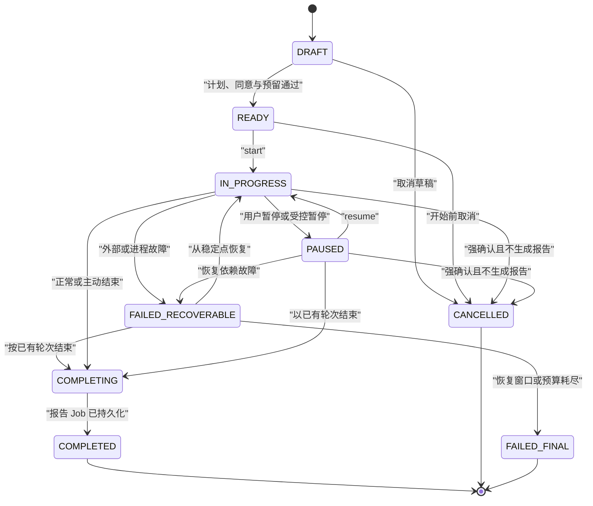

| 迁移 | guard | 同事务 effect | 恢复 / 禁止 |
|---|---|---|---|
| `DRAFT→READY` | confirmed PlanVersion、有效 Entitlement/Reservation、适用 Consent、题目版本可访问 | 冻结输入 refs，写 Session event/Outbox | 任一 guard 失败保持 DRAFT；不创建 Provider 调用 |
| `READY→IN_PROGRESS` | expectedVersion、Reservation 未过期、至少一题、无并行 active turn | 设置 startedAt，建立首题 Job | 重复 start 返回同 snapshot/Job |
| `IN_PROGRESS↔PAUSED` | command 在 allowed set；当前无不可中断落库段 | 更新状态/时间预算，写 durable event | pause 不撤销已 committed Turn；TTS 播放另行取消 |
| `IN_PROGRESS→FAILED_RECOVERABLE` | 错误分类允许恢复且有稳定点 | 保存 failure code/recovery deadline/allowed commands | 不删除 Turn、不释放全部权益、不自动无限重试 |
| `FAILED_RECOVERABLE→IN_PROGRESS` | deadline 内、pending Job/turn 已对账、expectedVersion | 重新建立必要 Job，保留原 business operation | 已 committed 问题不重新生成；partial audio 可丢弃 |
| `*→COMPLETING` | 用户正常/提前结束，或按已有轮次结束策略 | 拒绝新 answer；创建唯一 Evaluation/Report Job；结算/释放候选 | `COMPLETING` 不等于报告成功 |
| `COMPLETING→COMPLETED` | Evaluation/Report Job 已 durable 受理（是否需 ready 待产品决定） | session 终态 event | 报告有独立状态；不能由 COMPLETED 推导报告 Pass |
| `*→CANCELLED` | 在允许状态、强确认、明确是否报告/数据保留 | 取消可取消 Job、释放未用 reservation、写审计 | 不删除历史，删除走治理；不可逆调用完成后只能补偿 |

Turn 候选状态：`PLANNED→QUESTION_COMMITTED→ANSWER_CONFIRMED→CLOSED`；分支 `SKIPPED/CANCELLED/FAILED`。SSE delta、ASR partial 和 TTS playback 不推进 Turn；`question.committed` 与 `answer confirmed` 才是稳定点。

### 13.2 Job

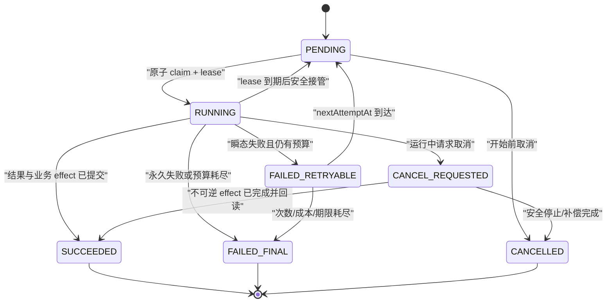

- claim 使用单条原子 SQL/锁策略选择到期 `PENDING`，设置 worker/lease/heartbeat 并写 `job_attempt`；具体 SQL 在 DB 设计验证。
- lease 到期只在副作用幂等或可回读时接管；不能确认外部结果时先进入 reconciliation/人工状态，而非盲重放。
- 每次失败由错误分类映射 `FAILED_RETRYABLE/FINAL`；4xx、同意/权限、schema 永久错误、内容拒绝、预算耗尽不可重试。
- `CANCEL_REQUESTED` 是合作式取消。若 Provider 已完成不可逆 effect，Job 必须回读/记录成功并触发补偿，不能谎报 CANCELLED。
- Job 成功只证明该异步工作完成，不自动推进 Feature、EV 或 UAT 状态。

### 13.3 Deletion Request

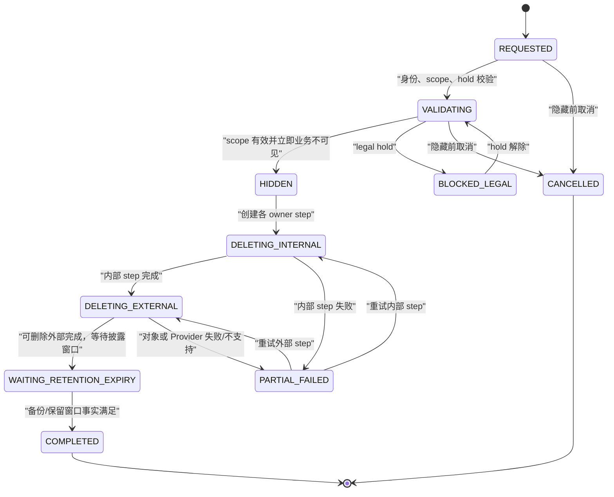

`WAITING_RETENTION_EXPIRY` 是内部候选状态，用户可映射为 `IN_PROGRESS`；是否单独外显由阶段 3/4 决定。关键不变量：

- `HIDDEN` 之后普通用户查询立即不可见；这不等于物理删除完成。
- 每个 domain/storage/provider/backup 都有独立 `deletion_step`、attempt、receipt/error；`PARTIAL_FAILED` 不能手工改成完成。
- 只有所有适用 step `SUCCEEDED`，不适用/不支持具有批准依据，且披露的备份窗口满足后才 `COMPLETED`。
- 审计仅保留 request/actor/scope hash/计数/结果，不保留被删正文；legal hold 不绕过用户可见说明。
- 物理删除不可恢复；取消仅允许在 `HIDDEN` 前，之后如需恢复产品访问属于新决策，不能反向伪造数据。

### 13.4 Usage Reservation

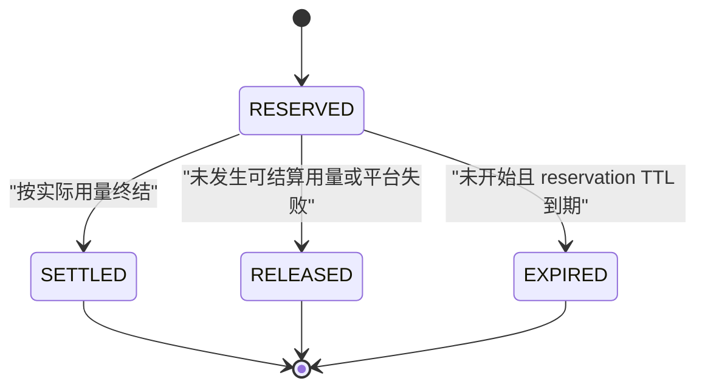

- Reserve 在一个数据库事务中锁定/原子校验 Entitlement 可用量并写 reservation；不能先调用 Provider 后补预留。
- Settlement 聚合属于同一 `business_operation_id` 的 usage events，按批准 rule version 计算实际结算并释放余量；用户侧权益与 Provider 重试成本分账。
- 实际用量超过 reserved 的策略（截断调用、允许小幅上浮、追加预留或平台承担）必须由 `PACK-DEC-12` 批准，代码不得自行选择。
- 客户端取消但 Provider 已产生用量时按产品批准的失败/取消计费规则结算；平台故障释放用户权益不等于抹去平台成本。
- `EXPIRED` 后到达的晚用量不能静默重新扣用户；进入 reconciliation/异常成本，按批准补偿策略处理。

### 13.5 Audio Artifact

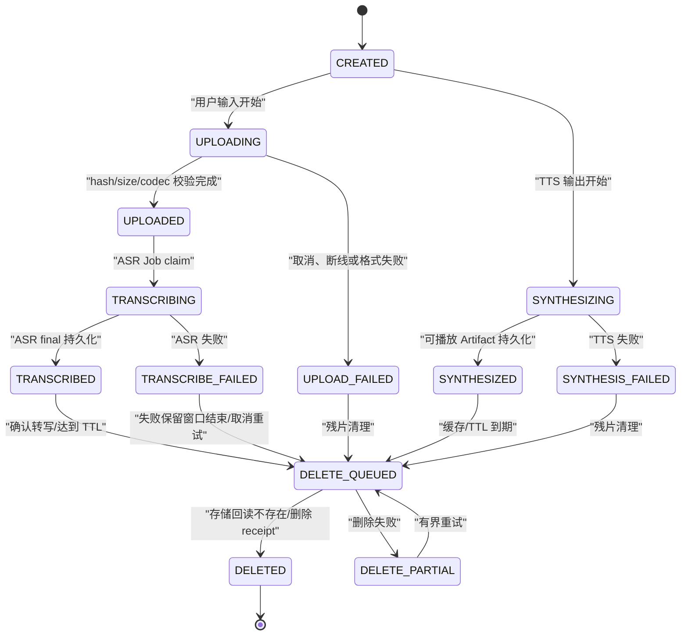

- 未满足适用 Consent 不得进入 `CREATED`；预检不能偷偷创建对象。
- `TRANSCRIBED` 只是 ASR final，用户修正/确认后才产生 confirmed TranscriptVersion/Interview AnswerVersion。
- 用户输入和 TTS 输出共享 Artifact 元数据但合法迁移不同；TTS 不经过 ASR。
- 断线 partial 可丢弃；`UPLOADED` 完整对象是否保留用于用户主动重试、最长多久，待 DEC-045。
- 删除完成需要对象存储回读/receipt，不以 Job 发送成功或 bucket lifecycle 配置存在为证据。

### 13.6 Prompt / Schema / Agent Config

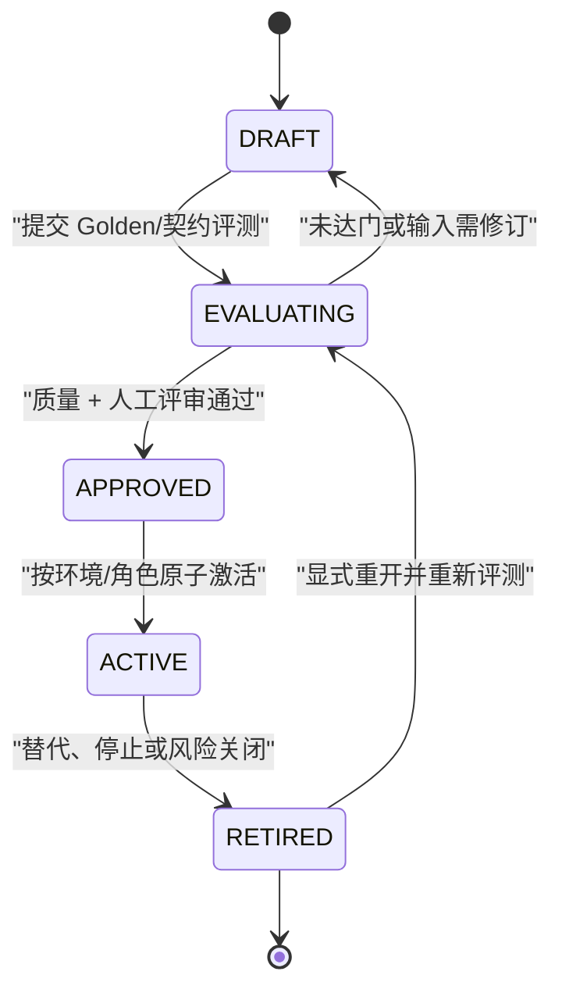

- Prompt/Schema 内容一旦进入 `EVALUATING` 即以 content hash 冻结；内容变化创建新 version，不在原版本上修改后复用 gate 结果。
- ACTIVE 的最小单位是 AgentConfigVersion 组合；Prompt/Schema 单项通过不代表组合通过。
- 同环境/角色/locale/quality tier 只有一个 ACTIVE activation；切换与回滚写审计、Flag 和 Golden baseline。
- 生产流量不自动把 Pending/最新版本设为 ACTIVE；模型自评不能批准模型。

### 13.7 Order / Payment（补充）

Order：`CREATED→PAYMENT_PENDING→PAID | CANCELLED | EXPIRED`；`PAID→PARTIALLY_REFUNDED→REFUNDED`。PaymentAttempt：`CREATED→PENDING→SUCCEEDED | FAILED | CANCELLED | UNKNOWN`。

- PaymentAttempt `SUCCEEDED` 只能来自验签 Webhook 或批准的 Provider 回读，不能来自浏览器 return URL。
- 乱序/重复事件不得让状态倒退；`UNKNOWN` 必须进入 reconciliation，不自动授予 Entitlement。
- Order PAID、EntitlementGrant、账本/Outbox 在同一事务；退款用补偿事实，不删除原 payment/ledger。

## 14. Outbox、事务与一致性

### 14.1 本地事务边界

| 用例 | 同一 PostgreSQL 事务必须包含 | 事务外工作 |
|---|---|---|
| 提交练习回答 | immutable AnswerVersion、Attempt state/version、IdempotencyRecord、Evaluation Job/Outbox | Provider 评测、报告、通知 |
| 提交面试回答 | Interview AnswerVersion、Turn/Session stable point、UsageReservation 引用、IdempotencyRecord、next Agent Job/Outbox | LLM、后续问题、评测 |
| 确认计划/开始会话 | confirmed PlanVersion、Reservation、Session、IdempotencyRecord、event/outbox | 首题 Agent Job 可同事务建立，实际调用事务外 |
| 评测成功 | EvaluationVersion/结果、Job attempt/state、UsageEvent/Settlement、Report Job/Outbox | Report Composer/通知 |
| 支付回调 | WebhookReceipt processed、Order/Payment state、EntitlementGrant、ledger/outbox | 通知、对账投影 |
| 删除推进 | DeletionRequest/Step state、owner 业务隐藏/删除事实、Job/outbox | 对象/Provider 删除、备份窗口等待 |

事务内不进行 LLM、ASR、TTS、支付、对象存储或网络调用，避免长事务与未知副作用。外部调用前写 durable operation/Job；外部调用后用幂等 business operation 回写。

### 14.2 Outbox 语义

- Producer 在业务事务内写最小 Outbox；publisher 以 lease claim，成功后标 `PUBLISHED`。投递是至少一次，consumer 必须用 event ID/aggregate version 去重。
- 事件按 aggregate 保序，不承诺跨 aggregate 全局顺序。consumer 遇到未来 aggregate version gap 时延迟/重读，不猜测缺失事实。
- payload 只含稳定 ID、版本、状态、计数和脱敏 reason；consumer 需要正文时调用 owner query，并重新鉴权。
- `PUBLISHED` 只表示发送到内部 consumer/stream store 成功，不表示所有下游业务完成。每个下游有自己的 Job/状态。
- dead/final failure 进入 operations projection/告警，禁止无限轮询或悄悄丢弃。

### 14.3 恢复快照

Interview snapshot 最少包含：session id/state/version、plan version、last stable Turn/sequence、committed questions/confirmed answer refs、pending Job summaries、Reservation state、Report state、SSE durable cursor、voice execution summary、allowed commands、recoverable deadline 和用户可见 failure code。

Snapshot 不包含 Provider Secret、完整 Prompt、storage key、管理员字段；回答正文是否返回由资源权限和页面需要决定。前端恢复顺序固定为：停止本地发送 → GET snapshot → 清理过期 optimistic action → 从 snapshot 重建 Query/store → 以 cursor 重连 SSE/WS → 只重放服务端允许的待执行用户动作。

## 15. 关键时序

### 15.1 文本面试

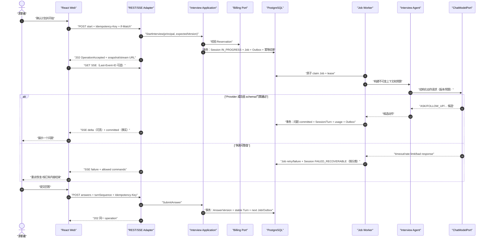

关键点：问题必须先 committed 再作为事实展示；SSE delta 可提前渲染但 UI 必须能在失败时撤销/标记未提交。重复 answer/start 返回同 operation，stale turn 不产生新 Job 或用量。

### 15.2 级联语音

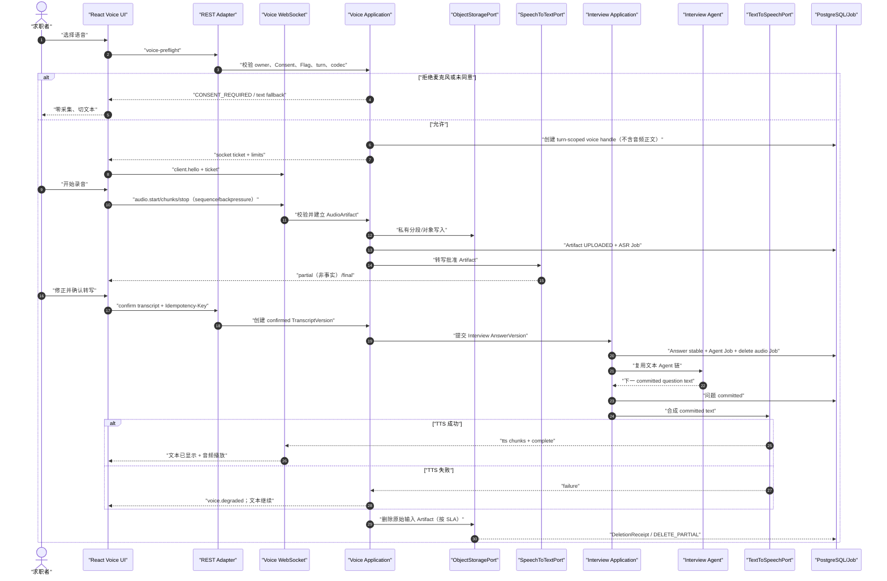

ASR final 不直接评分；用户确认后才生成 AnswerVersion。TTS 播放失败不回滚 committed question，不阻断文本回答。任何数据地域/同意/删除门失败时停止语音而不是绕过。

### 15.3 评测与报告

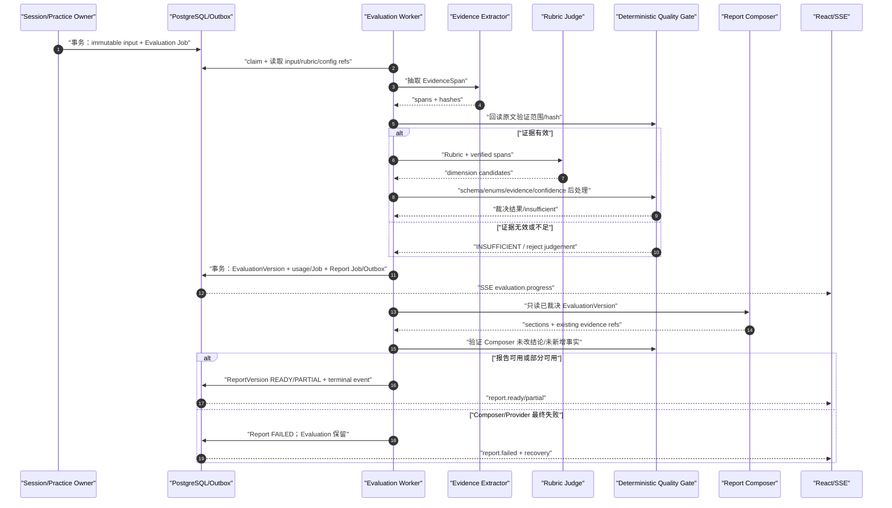

Judge 不评自己；Golden Set/人工门控制配置激活，不在每次线上请求里由模型自批。部分报告必须逐题列出失败与限制，不能用成功摘要掩盖。

### 15.4 删除

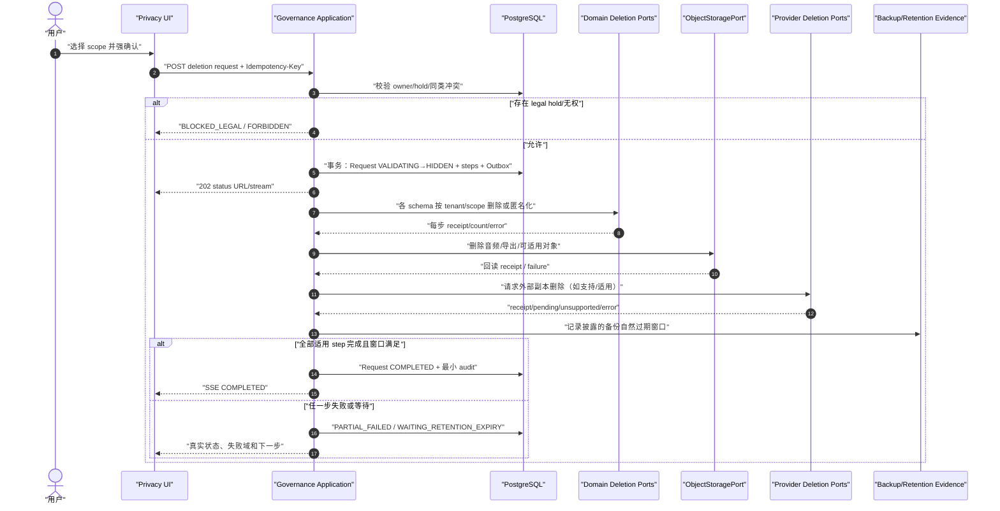

用户隐藏、内部删除、对象删除、Provider 删除和备份到期是不同事实。系统不得在收到请求、排队或对象生命周期规则创建时提前显示完成。

### 15.5 支付、权益与成本

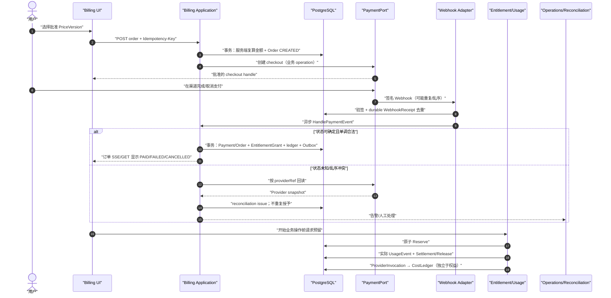

浏览器 return URL 只触发订单查询，不证明支付成功。Payment/Refund/Entitlement/CostLedger 均可回读且使用补偿事实；真实渠道与收款必须另行授权。

## 16. 前端模块、路由、状态与错误恢复

### 16.1 路由与 feature owner

| 路由 | feature owner | 核心页面/组件 | 必须覆盖的非正常状态 |
|---|---|---|---|
| `/`、`/questions`、`/questions/:id`、`/pricing`、`/status` | public/catalog/billing/operations | Landing、QuestionList/Detail、Pricing、ServiceStatus | 首次/空筛选、未授权权益、服务降级、维护 |
| `/auth/*`（register、login、recover） | identity | AuthForm、SessionNotice、PolicyLinks | 渠道未定、校验错、限流、取消、session 已存在 |
| `/app` | learning/dashboard | TodayTasks、RecentReport、ProgressTrend | 新用户空态、证据不足、projection stale、加载失败 |
| `/app/questions/:id/practice`、`/app/practice/*` | practice/evaluation | AnswerEditor、DraftStatus、History、EvidenceFeedback | 内容下线、草稿恢复、提交重复、评测 pending/fail/insufficient |
| `/app/interviews/new`、`/app/interview-plans/:id` | interview/billing | SetupWizard、PlanPreview、UsageEstimate | 无题、额度不足、语音关闭、版本过期、取消/恢复 |
| `/app/interviews/:id` | interview/voice | TextInterviewPage、Timeline、Controls、Recorder、TranscriptEditor、AudioPlayer | stale turn、SSE/WS 断线、Provider 故障、麦克风拒绝、TTS 降级、主动结束 |
| `/app/reports/:id`、`/app/interviews/:id/report` | evaluation | ReportProgress、EvidenceQuote、Dimensions、Limitations、Feedback | pending、partial、failed、历史版本、证据不足 |
| `/app/learning/*` | learning | PlanEditor、LearningItem、RetestComparison | 无可靠弱项、题目下线、不可比、用户拒绝/改期 |
| `/app/usage`、`/app/billing/*` | billing | EntitlementSummary、UsageBreakdown、OrderStatus | 免费空态、价格过期、支付失败/取消/unknown、退款处理中 |
| `/app/settings/*`（account、privacy） | identity/governance | Account、Consent、DataInventory、Export/Delete timeline | session step-up、legal hold、partial deletion、下载过期 |
| `/admin/catalog/*` | catalog | DraftEditor、VersionDiff、Review/Publish | 来源/Rubric 缺失、乐观锁、无权、拒绝 |
| `/admin/operations/*`、`/admin/audit/*` | operations/governance | Provider/Job/Cost/Quality、Flag、Audit、PrivacyRequest | projection stale、MFA/reason required、敏感字段隐藏、操作审计失败 |

路由 guard 只改善体验；服务端每次重新授权。未经授权页面不能先请求敏感正文再隐藏。

### 16.2 状态归属

| 状态 | 前端机制 | 生命周期 | 禁止 |
|---|---|---|---|
| REST 资源/列表/snapshot | TanStack Query 候选 | 服务端 ETag/失效；logout/tenant change 全量清理 | 把 Query cache 当离线永久事实、跨用户复用 key |
| 当前面试 UI、未提交草稿、选中设备、播放、连接状态 | feature-local state / Zustand 候选 | route/session scope；显式 TTL；logout 清理 | 保存 Server Session/额度/删除终态为客户端真相 |
| SSE/WS cursor 和 optimistic command | recovery controller | 连接 generation/operation scope | 无限自动重试、在 snapshot 前重放命令 |
| 表单草稿 | memory；必要时批准的 IndexedDB | user+tenant namespace、TTL、schema version、logout/delete 清理 | 默认持久化原始音频、完整敏感报告、长期 token |
| 认证 | HttpOnly Cookie，由浏览器管理 | server session | localStorage/sessionStorage 保存长期 JWT、API Key、Provider Key |

Query key 必须包含资源 ID 和当前 principal/tenant generation；tenant/user 切换后旧 generation 的 response/event 丢弃。Mutation 使用客户端 operation ID + 服务端 Idempotency-Key，UI 状态以返回 resource/snapshot 覆盖 optimistic state。

### 16.3 错误与恢复矩阵

| 场景 | UI 行为 | 恢复入口 |
|---|---|---|
| 401/session expired | 停止 mutation/stream、清理敏感内存、显示登录提示 | 登录后回到安全 route；GET snapshot，不自动重放提交/支付/删除 |
| 403 policy/consent/entitlement | 明确业务拒绝，不显示“系统错误” | 同意/权益/管理员申请等批准入口；策略拒绝不能被重试绕过 |
| 409 stale/version/idempotency | 停止 optimistic action，展示已发生事实 | GET resource/snapshot + ETag，由用户决定合并/继续 |
| 429 | 展示 retry-after，禁用倒计时内重复提交 | 到期后单次重试；仍复用同 idempotency key |
| 5xx/provider unavailable | 保留本地未提交草稿，展示服务端 `retryable/allowedCommands` | snapshot、有限重试、文本降级、稍后完成或结束 |
| SSE gap/cursor expired | 停止应用后续 event，不猜状态 | GET snapshot，使用新 cursor 重连 |
| WS gap/partial audio | 停止发送/播放，标记 partial 丢弃 | voice snapshot；重录或文本输入；已确认回答不重复 |
| route/component render failure | Error Boundary 隐藏敏感详情，保留 correlation ID | 返回上级/刷新 snapshot；错误页不能输出 stack/正文 |
| offline/navigation away | 未保存确认；暂停自动外传 | 恢复网络后先 snapshot，再决定提交；不后台继续录音 |

### 16.4 可访问与浏览器边界

- 页面必须有键盘可达、可见焦点、label/description、错误定位、非颜色唯一提示、语义状态与窄屏布局；目标 WCAG 等级待产品/质量批准。
- 麦克风请求只能由明确用户手势触发；拒绝后不循环弹权限，提供文本主路径。录音、播放和转写状态同时有文本/ARIA 表达。
- TTS 文本先可见；音频不是获取问题的唯一方式。播放取消按钮不改变面试业务状态。
- 前端不解码或展示未批准 raw Provider error；只显示公共 error code/userMessage/correlation ID。

## 17. 安全、管理员与隐私

### 17.1 信任边界与认证

- 公网浏览器、Webhook 来源、AI/语音/支付 Provider、对象存储和管理员均属于独立信任边界；“管理员”不是天然可信。
- 同源 Web 使用 Secure HttpOnly Cookie、session rotation/fixation 防护、idle/absolute expiry、CSRF token、精确 CORS allowlist。是否 MFA、登录渠道和密码/验证码参数由 `DEC-041/049`。
- API 鉴权顺序：认证 → tenant/principal 解析 → capability/role → resource owner/visibility → consent/policy → entitlement → aggregate state/version。失败默认拒绝并最小披露。
- 不在 URL、日志、metric、trace、错误、截图、sample data 或仓库保存 Secret、Cookie、Authorization、socket ticket、签名、支付凭据或对象 key。

### 17.2 tenant 强制

1. Controller 不接收 tenant 作为普通用户可控参数；principal context 只由认证层构造。
2. Application command/query 必须显式带 `TenantId + PrincipalRef`，并在进入 Repository 前做 resource capability/owner 判定。
3. Repository 方法命名/签名始终含 tenant；更新/删除 SQL 条件至少是 `tenant_id + id + version`，影响行数不为 1 即冲突/拒绝。
4. JPA filter/interceptor 只能作为附加防线，不替代显式条件；native SQL 和 projection 必须通过 tenant 安全审查。
5. cache/Query key/Redis key/object prefix/event stream 均带不可逆 tenant namespace；但日志只记录 `tenantHash`。
6. 测试必须有至少两个 tenant 的同 ID/相似资源越权场景；RLS 若启用再增加连接池 context 泄漏场景。

### 17.3 管理员矩阵

| 角色 | 默认可见/可操作 | 明确禁止 / step-up |
|---|---|---|
| `CONTENT_ADMIN` | catalog 草稿、来源、Rubric、审核发布 | 用户回答/转写/音频/简历/订单；无权改 Flag/删除状态 |
| `OPS_ADMIN` | 脱敏健康、Job、成本/质量聚合、受控 Flag | 默认无用户正文；敏感 resource 需 access request |
| `SUPPORT` | 用户提供的 ticket、账号/订单必要元数据 | 音频/完整回答/Prompt；退款/删除需专门命令和审计 |
| `PRIVACY_AUDITOR` | consent、retention、deletion step/audit 元数据 | 不自动获得被删正文；legal hold/导出需专权 |
| `SUPER_ADMIN` | 紧急受控能力 | 不是无限权限；MFA、短 session、reason、ticket、scope、expiry、append-only audit 全部适用 |

敏感访问流程：step-up/MFA → `AdminAccessRequest`（reason/ticket/scope/expiry）→ policy 审批/默认拒绝 → 最小字段 query → `AuditEvent`。业务 owner 不能通过直接 SQL、共享账号或 Flag 绕过。

### 17.4 数据 owner 的导出/删除责任

| owner | 可导出内容 | 删除/匿名化责任 | 不可删除或延迟部分 |
|---|---|---|---|
| identity | 账号/档案/会话清单 | session/identity/profile；关闭 tenant | 防滥用/安全最小记录按批准周期 |
| catalog | 用户收藏的版本引用说明 | 公共发布内容不因单用户删除；清理用户私有引用 | 来源/发布历史属平台事实 |
| practice/interview | 回答、练习/会话/轮次 | 私有正文、attempt/session/answer refs | 为删除安全仅保留不可逆计数/hash（需批准） |
| voice | Transcript/Artifact 状态 | 音频对象、transcript、TTS artifact、Provider 副本 | Provider 不支持/备份窗口显示真实状态 |
| evaluation/learning | 报告、证据、计划、趋势 | 评测/报告/学习对象与投影 | Golden Set 不含用户数据；审计 refs 脱敏 |
| billing | 权益、用量、订单/退款记录 | 非法定部分按 scope；敏感标识脱敏 | 财务/争议/法定保留待决，不能承诺瞬时全删 |
| governance | Consent、请求状态、审计摘要 | 导出 artifact 过期、请求正文最小化 | 最小 consent/deletion/audit 事实按批准周期 |
| operations/platform | 与用户关联的 ticket/ref/projection | 清理正文/ref，projection 重建 | 安全/故障/幂等最小记录按分类保留 |

### 17.5 上传与内容安全

- 语音/未来简历上传前校验 consent、purpose、MIME/codec、大小、时长、hash、malware/内容策略（适用时），只允许私有存储。
- 文件名和对象 key 不使用用户提供路径；下载强制 `Content-Disposition`、安全 MIME、短签名和访问审计。
- Prompt Injection 被视为不可信内容；catalog/回答/JD/简历不得改变 system policy、Provider route、权限、状态、额度或工具 allowlist。
- 表达指标只覆盖语速/停顿/填充词等已批准维度，不推断人格、诚信、智力、情绪障碍或录用适合度。

## 18. 验证设计、Golden Set、UAT 与故障注入

本文只设计未来验证；没有授权新增/运行测试，结果全部 `NotRun`。

### 18.1 分层验证

| 层 | 主要资产候选 | 必须证明 | 不能单独证明 |
|---|---|---|---|
| domain unit | `*PolicyTest`、状态迁移表 | 合法/非法迁移、预算、版本、预留、删除和金额确定性 | Spring/DB/外部链路 |
| application unit | fake ports + use case tests | 权限/事务意图、失败传播、幂等/补偿编排 | 真实事务和 Provider |
| module boundary | ArchUnit/Modulith 候选 | 无逆向依赖、跨域 Repository/entity、生产依赖 test-support | 运行行为 |
| repository/migration | PostgreSQL Testcontainers 候选 | tenant、unique、optimistic lock、Job claim、Outbox、空库/升级 migration | 生产容量/备份 |
| API/contract | OpenAPI/AsyncAPI/JSON Schema、adapter tests | auth、错误、幂等、ETag、SSE replay、WS sequence、Webhook 签名 | 浏览器任务与内容质量 |
| Provider contract | fake/stub/批准 sandbox | timeout、rate limit、bad schema、partial、request ID、错误分类 | 未授权真实质量/SLA/地域 |
| React component | Testing Library 候选 | 空/加载/拒绝/失败/取消/恢复、可访问组件 | 完整浏览器/后端 |
| browser journey | Playwright 候选 | Cookie/CSRF、路由、SSE/WS、麦克风拒绝、恢复、关键用户流程 | 业务 owner 最终接受 |
| Golden Set | versioned fixtures/harness | 结构化成功、证据 span、判定一致性、拒判、回归 | 市场效果/就业结果/真实用户体验 |
| security/privacy | tenant/CSRF/CORS/upload/redaction/deletion tests | 默认拒绝、同意前零采集、日志红线、部分失败 | 法律合规意见 |
| resilience/performance | fault harness/load plan | lease、重复、断线、backpressure、限流、成本熔断、恢复 | 未运行环境的生产 SLO |

### 18.2 Golden Set 候选结构

每个 case 至少包含：stable case ID、领域/locale、许可与敏感级别、Question/Rubric version、answer/transcript fixture、预期 evidence spans/judgement/insufficient、允许差异、人工标注 owner/复核人、数据版本。必须覆盖：

- 正确、部分正确、明确错误、证据不足、来源冲突、含糊需澄清。
- 虚构 EvidenceSpan、越界引用、Prompt Injection、结构化坏 JSON、未知枚举。
- Java/JVM/Spring/RAG/Agent/MCP 中英混说术语的 ASR 错词、低置信与用户修正。
- Report Composer 改分/漏限制、Learning Coach 虚构题目/不可比趋势等越界样本。

通过指标、样本规模和人工一致性门由 `DEC-039`/正式验证设计批准。Judge 不能给自己的配置出具唯一 Pass；真实 Provider benchmark 与线上质量继续分开。

### 18.3 浏览器 UAT 候选

| UAT 候选 | 真实场景 | 关键观察 |
|---|---|---|
| UAT-AUTH-01 | 首次注册/登录/同意/空 Dashboard | Cookie/CSRF、协议版本、空态、退出清理 |
| UAT-CATALOG-01 | 组合筛选、空结果、打开发布题 | 版本/来源、草稿不可见、空态可恢复 |
| UAT-PRACTICE-01 | 文本作答、断线草稿、提交/重答、证据不足反馈 | 不重复提交、历史不可变、纠错入口 |
| UAT-TEXT-01 | 短文本面试、暂停/刷新/恢复/主动结束 | 单问/追问预算、稳定点、部分报告规则 |
| UAT-VOICE-01 | 麦克风拒绝→文本 | 同意前零采集、无循环弹窗、完整文本路径 |
| UAT-VOICE-02 | ASR 技术错词修正、TTS 失败 | 确认文本评分、TTS 不阻断/不丢 Turn |
| UAT-REPORT-01 | 报告→接受/修改学习计划→复测 | 证据/限制/真实题目、不可比不误导 |
| UAT-BILLING-01 | 额度不足、沙箱支付重复/取消/退款 | 预计用量、无重复授予、账本一致 |
| UAT-PRIVACY-01 | 导出、逐项删除、对象删除失败 | HIDDEN/PARTIAL/COMPLETED 区分、管理员审计 |

Agent 不能替用户形成 UAT 结论；账号、数据、费用、浏览器、外部系统和清理动作需独立验收包授权。

### 18.4 故障注入矩阵

| 故障 | 预期状态/恢复 | 阻断信号 |
|---|---|---|
| LLM timeout/rate limit/bad schema | 有界重试/合规 fallback；Session recoverable，回答保留 | 无限重试、重复问题/扣费、无用户出口 |
| ASR partial 断线/低置信 | partial 丢弃或重录；final 可修正；文本降级 | 未确认文本被评分、音频无 TTL |
| TTS 中途失败 | committed 文本可见，播放停止，Session 不回滚 | 用户无法继续文本、重复结算 |
| Worker crash/lease expiry | 新 worker 幂等接管、attempt 可追溯 | 双执行造成状态/账本重复 |
| Outbox 重复/乱序 | consumer 去重；aggregate gap 延迟/回读 | 状态倒退或事件丢失无告警 |
| SSE cursor 过期/WS sequence gap | 410/snapshot 或 resync；partial 重录 | 客户端猜状态/重放敏感命令 |
| Redis 清空/不可用 | PostgreSQL 事实保留；按安全策略降级/限流 | 额度、Session、删除、订单丢失 |
| 对象/Provider 删除失败 | `PARTIAL_FAILED` + 有界重试/人工 | 显示 COMPLETED、无 receipt |
| 支付 Webhook 重复/乱序/丢失 | receipt 去重、回读/对账、不重复授予 | browser return 当成功、账本可改 |
| 成本/Job backlog 风暴 | Flag/熔断/停止新高成本操作，历史读取/文本路径保留 | 无上限、Flag 可关闭安全/审计 |

## 19. 部署、观测、Feature Flag、备份与回滚

### 19.1 部署候选

- 一个模块化单体 artifact，以 `api` 和 `worker` profile 运行；可同进程用于本地，但生产候选允许独立副本/扩缩容。逻辑域不因此变网络服务。
- `frontend` 独立构建后优先与 API 同源发布；TLS 入口、精确 host/CORS、Cookie domain/path 和 WebSocket/SSE timeout 共同设计。
- dev/test/prod 的账号、Secret、数据库、Redis、bucket、Provider 配置与支付环境完全隔离；测试不使用生产用户数据或 Secret。
- 托管 PostgreSQL、Redis、私有对象存储和单区域容器/VM 为候选；云厂商、Region、实例规格和网络未决定。Kubernetes、微服务与跨区 active-active 延后。

### 19.2 观测

统一关联：`traceId/correlationId/tenantHash/userHash/sessionId/turnId/jobId/businessOperationId/providerInvocationId/promptVersion/schemaVersion/rubricVersion`。允许指标：

- 业务：首练/面试开始、完成、恢复、报告打开、复练、权益/订单状态。
- 质量：结构化失败、Evidence reject、Judge insufficient、用户纠错、ASR 修正、Golden regression。
- 可靠性：REST/SSE/WS 错误与重连、Job backlog/lease expiry、Outbox 重试、Provider timeout/rate limit。
- 成本：按 capability/config/operation 的 token/audio/request/重试与成本；不以正文为 label。
- 安全隐私：登录/限流/越权拒绝、管理员访问、同意拒绝、删除 partial、日志 redaction 告警。

Metric label 禁止 user ID/高基数正文；span/log 禁止完整输入输出。Collector/exporter、采样、保留与告警阈值待 `DEC-056/050`。

### 19.3 Feature Flag

可 Flag：voice、具体 Provider route、payment、JD/简历（未来）、新 Prompt/Schema/评测组合、实验 UI。不可 Flag 关闭或放宽：认证、tenant、CSRF、同意、审计、删除真实状态、账本幂等、日志脱敏。

每次 Flag 变更必须包含 environment/scope/value/version/owner/reason/expiry/audit；安全停止可以关闭高风险能力，但不得删除历史、静默切跨境 Provider 或改变评分规则而不重新过 Golden 门。

### 19.4 备份与恢复

- PostgreSQL 候选使用加密备份/PITR；对象存储使用批准的版本/生命周期；Redis 不承担恢复业务事实。具体 RPO/RTO、保留和地域待 `DEC-047/050/052/055`。
- 恢复演练必须证明“可 restore 并通过一致性/tenant/账本/删除状态检查”，不是证明备份任务显示成功。
- 删除与备份的关系在隐私告知中说明：在线立即 HIDDEN，主存/对象/Provider 异步删除，备份在批准窗口自然过期；恢复旧备份后必须重放删除 tombstone/请求，防止已删数据复活。
- 恢复证据、操作人、时间、版本、校验结果和残余风险进入独立 EV；未经授权不执行真实恢复。

### 19.5 发布与回滚

候选顺序：expand migration → 部署向后兼容应用 → backfill/验证 → Flag 灰度 → contract migration（独立窗口）。停止条件包括 migration/健康/Golden/成本/越权/删除/账本异常。

- 应用回滚只在 schema 向后兼容时执行；不可兼容则停止并采用 forward fix/兼容版本。
- Prompt/Schema/Provider route 通过 activation/Flag 回到上一 Approved 组合；历史 invocation/report 不重算。
- 支付/退款/删除等不可逆事实使用补偿/后续 step，不通过数据库 rollback 或重新部署抹去。
- 备份恢复是灾难恢复，不是普通发布回滚。
- Phase 17/18 最多形成 `ReleaseReady` 输入；实际发布仍需独立授权，发布事实保持 `NotReleased`。

## 20. 计划契约与主要类型落点

以下均为计划创建，不是实际文件：

```text
contracts/
├── openapi/
│   ├── common.yaml
│   ├── identity.yaml
│   ├── catalog.yaml
│   ├── practice.yaml
│   ├── interview-plan.yaml
│   ├── interview-session.yaml
│   ├── evaluation-report.yaml
│   ├── learning.yaml
│   ├── voice.yaml
│   ├── billing.yaml
│   ├── privacy-audit.yaml
│   └── operations.yaml
├── asyncapi/
│   ├── common.yaml
│   ├── interview-events.yaml
│   ├── evaluation-events.yaml
│   ├── voice-events.yaml
│   ├── privacy-events.yaml
│   └── payment-webhooks.yaml
└── schemas/
    ├── error-envelope.schema.json
    ├── event-envelope.schema.json
    ├── operation-accepted.schema.json
    ├── interviewer-action-v1.schema.json
    ├── evidence-extraction-v1.schema.json
    ├── rubric-judgement-v1.schema.json
    ├── report-composition-v1.schema.json
    └── learning-plan-v1.schema.json
```

主要 Java 类型候选：

```text
interview-domain/
└── .../{identity,catalog,practice,interview,voice,evaluation,learning,billing,governance,operations,platform}/

interview-application/
├── .../shared/{TenantId,AggregateVersion,IdempotencyKey,CorrelationId,Money,UsageQuantity}.java
├── .../agent/port/{ChatModelPort,SpeechToTextPort,TextToSpeechPort,EmbeddingPort}.java
├── .../integration/port/{ObjectStoragePort,PaymentPort,IdentityChannelPort}.java
├── .../platform/port/{JobPort,OutboxPort,IdempotencyPort,FeatureFlagPort,ClockPort}.java
└── .../<domain>/{api,port,internal}/

interview-adapters/
├── .../inbound/{rest,sse,websocket,webhook}/
├── .../outbound/persistence/<schema>/
├── .../outbound/provider/{llm,asr,tts,payment,storage,identity}/
├── .../security/{cookie,csrf,tenant,rbac}/
└── .../observability/{metrics,tracing,redaction}/
```

Shared 类型只允许真正跨域且语义稳定的值对象；业务 DTO 留在 owner domain。若某类型只有一个 consumer，不为“未来复用”提前放入 shared。

## 21. 待决技术问题

本节的 `PACK-DEC-*` 只是本文内的待决问题，不能替代 [`../decisions/decision-register.md`](../decisions/decision-register.md)。正式批准时应合并到对应 `DEC-*` 或设计评审记录，避免第二份决策事实源。

| ID | 待决问题 / 推荐候选 | 关联现有决策 | 最晚关闭 / 影响 |
|---|---|---|---|
| PACK-DEC-01 | 业务 ID 使用随机 UUID 或可排序 ULID；推荐只暴露不透明 ID，数据库/索引比较后决定 | DEC-033 | Phase 01 shared types/migration 前 |
| PACK-DEC-02 | 公共 catalog 使用 platform tenant 而不是 `tenant_id NULL`；推荐采用 | DEC-029/060 | Phase 03/04 schema 前 |
| PACK-DEC-03 | 跨 schema FK 只保留 tenant 根 + 高风险稳定引用，还是全面 composite FK；推荐 schema 内硬 FK、跨域 application 校验 + 快照 | DEC-023/024/029 | 首个 migration 批准前 |
| PACK-DEC-04 | 登录方式确定后，`auth_identity/auth_challenge` 的字段、加密和找回语义 | DEC-041/042 | Phase 03 tasks 前 |
| PACK-DEC-05 | REST 乐观锁统一使用 ETag/`If-Match`，还是 body `expectedVersion`；推荐 GET 用 ETag、命令显式 version，OpenAPI 固定一种组合 | DEC-027 | Phase 01 common contract 前 |
| PACK-DEC-06 | SSE heartbeat、replay window、durable event TTL 与 cursor 过期表现；推荐 410 + snapshot，不猜具体数值 | DEC-055/058 | Phase 08 前 |
| PACK-DEC-07 | 首版音频 codec、chunk/frame、大小/时长、backpressure/ack 窗口和浏览器矩阵 | DEC-035/036/055 | Phase 12 原型/契约前 |
| PACK-DEC-08 | 对象存储加密/KMS、bucket/region、签名 URL TTL、ASR 失败保留和删除 receipt 能力 | DEC-026/045/048/052 | 真实音频前 |
| PACK-DEC-09 | EvidenceSpan offset 采用 Unicode code point 或 UTF-16 index；推荐以契约工具/前端一致性实验后确定 | DEC-031/039 | Phase 06 schema/Golden 前 |
| PACK-DEC-10 | Session `COMPLETED` 在 Report Job durable 受理还是 Report ready 后；零回答/部分失败是否生成报告 | PRD 截断修复、DEC-018/031 | 阶段 4 原型与 Phase 08/10 前 |
| PACK-DEC-11 | 删除的用户可见状态是否单列等待备份过期；backup window、legal hold 和 unsupported Provider 的措辞 | DEC-045–050 | 阶段 4 隐私原型/Phase 15 前 |
| PACK-DEC-12 | 实际用量超过预留、客户端取消、平台失败、Provider 重试的用户结算规则 | DEC-043/044/058，BR-09 | Phase 07/09 前；金额/体验关键 |
| PACK-DEC-13 | 成本/支付账本采用严格 double-entry 还是 append-only sub-ledger + reconciliation；推荐专项财务设计后决定 | DEC-043/044 | Phase 16 前 |
| PACK-DEC-14 | Prompt/Schema/AgentConfig 各自 Golden 指标、人工批准角色、激活/回滚窗口 | DEC-038/039/057 | Phase 06/10 前 |
| PACK-DEC-15 | LLM/ASR/TTS invocation 统一存 `agent.provider_invocation`；推荐统一元数据表、业务 Artifact 保持域内 | DEC-034–038 | Phase 06/12 schema 前 |
| PACK-DEC-16 | 管理员 MFA/step-up、reason/ticket、一次性 access scope 与审计防篡改实现 | DEC-049/050 | Phase 15 前 |
| PACK-DEC-17 | PostgreSQL RLS 何时启用及连接池 tenant context 清理；推荐 T2 defense-in-depth，不阻塞早期显式 scope | DEC-029/060 | Phase 14/15 安全评审前 |
| PACK-DEC-18 | stream/outbox/job/idempotency/audit 的保留期、分区/归档和高容量门槛 | DEC-050/055/062 | Phase 14/17 前 |

未关闭的决策不会阻止本文继续评审，但会阻止对应 Phase 的 `tasks.md` 或真实外部链路。实现窗口不得选择“默认值”把 Pending 变成事实。

## 22. 实施波次与可并行边界

### 22.1 进入编码前的硬门

任何源码波次开始前至少满足：

1. 修复并评审 PRD 与技术架构的字面截断；不能用本文代替缺失产品事实。
2. Gate A `DEC-002–032` 有明确决定，Gate C 延后范围获确认；对应 Gate B 在进入其外部链路前关闭。
3. Canonical Feature Spec 与适用技术设计为 `Approved`；阶段 4 原型覆盖正常、空、加载、错误、拒绝、取消和恢复。
4. 每个可执行 Feature 建立唯一 `docs/features/<FEAT-ID>-<slug>/tasks.md`，包含 TASK、依赖、精确文件范围、验证、执行包和独立授权。
5. 根 POM、group/package、版本矩阵、migration 编号、common OpenAPI/error/event/shared types 由单一 foundation owner 冻结。
6. 用户明确授权相应源码/测试代码；构建、测试、启动、真实 Provider、音频、支付、部署和 Git 仍分别授权。

### 22.2 推荐波次

| 波次 | 目标 | 可并行工作 | 必须串行/单 owner |
|---|---|---|---|
| 0 文档关闭 | PRD/原型/正式设计/Feature tasks/执行包 | 决策提案、原型、契约、验证设计可分别准备 | 产品批准、设计批准、执行包批准 |
| 1 Foundation | 五 module、shared types、common contracts、Boot/前端壳、Flyway 基线 | 前端壳与 test-support 可在 common contract 冻结后并行 | 根/后端 POM、group/package、版本、common error/event、migration registrar、Boot main/config |
| 2 确定性纵切 | Identity/tenant/consent 与 Catalog 可并行；随后 Practice | domain/application、persistence、feature UI 按独占目录并行 | SecurityConfiguration、router root、schema 编号和跨域 DTO 合并 |
| 3 AI/会话纵切 | Phase 02 benchmark 后，Provider/Evaluation 与 Plan/Entitlement 可在冻结 SPI 后并行；Session/Outbox 随后 | Provider adapter、Golden harness、Plan UI | Provider SPI、shared failure、Job/Outbox/idempotency、event envelope |
| 4 T1 闭环 | 文本 Agent→Report→Learning；ASR 设备实验可与 Learning 后半准备并行 | report UI、learning UI、voice browser lab | Session state、billing settlement、SSE event type、Prompt activation |
| 5 语音 | Audio/ASR 后接 TTS cascade | storage adapter、browser recorder、ASR/TTS contract tests 在契约冻结后并行 | voice WS common、Artifact state、consent/delete、Provider route |
| 6 T2 治理 | Redis/Flag→Privacy/Admin→Payment→Operations | dashboard/观测资产、privacy UI、payment sandbox adapter 可在各门后并行 | ledger、deletion saga、SecurityConfiguration、production config/migrations |
| 7 集成/证据 | 只读审查、分层 EV、Golden、browser UAT、故障/容量、上线就绪 | 不同验证包按环境/数据隔离并行 | 候选锁定、缺陷退回、UAT 用户结论、ReleaseReady 判断 |

### 22.3 多窗口独占规则

| 写入 owner | 独占范围 | 其他窗口怎样协作 |
|---|---|---|
| Foundation coordinator | 根/`backend/pom.xml`、五 module POM、group/package、shared types、common error/event contract、Boot main/base config、migration 编号登记 | 提交需求清单/patch 建议，不直接并发改共享文件 |
| Domain/Application window | `interview-domain`、`interview-application` 内已分配 logical domain package | 不创建 adapter/Controller/JPA；跨域需求走公开 port 评审 |
| Adapters/Boot window | 分配的 `interview-adapters` package 与预分配 migration 文件 | 不改 domain 规则；Boot shared config 由 coordinator 合并 |
| Frontend window | `frontend/src/features/<owner>` 和已分配页面/组件 | `app/router/providers`、`shared/api` 由单一 frontend integrator；按冻结 contract 消费 |
| Contracts/Test-support window | 分配的 OpenAPI/AsyncAPI/schema、`interview-test-support`、fixtures/harness | `common.*` 由 foundation owner；测试资产不能改生产契约迎合实现 |
| Integration reviewer | 全树只读审查、边界/追溯/冲突报告 | 不在审查窗口顺手改生产文件；缺陷退回原 TASK owner |

Migration registrar 先分配实际 `V###` 文件名和 schema owner；分配后各窗口只写自己的 migration，不重命名/插号。公共错误码、共享枚举、event envelope、Provider SPI、Session state 和 Billing unit 任何变化都要暂停相关并行窗口，回到设计/任务 owner 统一决定。

## 23. 阶段 5 评审门

### 23.1 可批准检查

- [ ] `DES-PACK-*` 与 Approved PRD/原型一致，未把截断缺失内容猜成产品承诺。
- [ ] 五 module 依赖、11 域 owner、platform/integration 边界获对应 owner 确认。
- [ ] 每个生产 schema 实体都有字段、tenant、版本、owner、生命周期、迁移和删除责任。
- [ ] 公共 catalog tenant、全局 identity 白名单、跨 schema 引用与 RLS 策略获安全/数据复核。
- [ ] REST/SSE/WS/Webhook 的认证、错误、幂等、排序、续传、取消和终态无冲突。
- [ ] Interview/Job/Deletion/Usage/Audio/Prompt 状态与阶段 4 UI 状态逐项映射。
- [ ] 五类 Agent 输入/输出/schema/门禁清楚；模型不拥有状态、权限、金额、额度或发布。
- [ ] 文本/语音/评测/删除/支付正常和失败时序可实现、可观察、可恢复或可补偿。
- [ ] 测试、Golden、浏览器 UAT、故障注入、容量、安全、隐私与证据限制有 owner。
- [ ] 部署、Secret、监控、Flag、备份恢复、migration 和回滚没有把计划写成结果。
- [ ] 所有 Pending 版本/供应商/地域/保留/支付问题都有最晚关闭门，而非隐藏默认值。

### 23.2 当前阻断

| 阻断 | 已验证事实 | 影响 | 最小关闭动作 |
|---|---|---|---|
| PRD 截断 | `FUNC-VOICE-002` 行含字面截断并跳到运营后台 | 语音及中间功能范围/页面/优先级可能缺失 | 产品 owner 从可信源修复并重新评审 PRD；本文不代写 |
| 技术架构截断 | 结构化输出示例跳到数据表尾部 | 原数据模型/章节不能比较、合并或批准 | 架构 owner 从可信源修复，或明确批准本文候选作为新修订输入，而非“找回原文” |
| Gate A Pending | 仅 DEC-001 Accepted | 产品、市场、语音、账号、module、tenant、协议均未批准 | 用户关闭 DEC-002–032 和 Gate C 范围 |
| 阶段 4 缺失 | 无 Approved 原型 | 错误、拒绝、取消、恢复和隐私外显仍可能改变 API/state | 创建并评审关键页面/文本/语音/删除/支付原型 |
| 无 Approved Feature 资料包 | 当前只有总 PRD/路线 Draft，无各 Feature tasks/执行包 | 不能安全分配编码窗口或修改范围 | 建立 Feature 控制页、Approved Spec/design、唯一 tasks.md |
| 依赖/供应商/数据政策 Pending | DEC-033–058 依对应 Phase 生效 | 无法锁构建、真实 Provider、保留、支付、生产设计 | 按 Phase 进入前做兼容/条款/质量/费用决策，不猜定 |
| 授权未形成 | 文档授权不含源码、测试、构建、启动、外调、部署、Git | 当前不能编码或运行 | 用户批准精确执行包及每类独立动作 |

当前结论：本候选包可进入阶段 5 评审，但不满足阶段 5 通过门，也不满足阶段 6/7 DoR。

## 24. 本文不能证明什么

- 不能证明任一 Maven module、表、API、状态机、Provider、Agent、前端页面或部署已经存在。
- 不能证明候选 SQL 可迁移、事务无死锁、SSE/WS 可续传、Provider/语音质量、Golden 一致性、浏览器兼容、支付或删除真实可用。
- 不能证明法律合规、数据地域/DPA、生产 SLO、容量、备份可恢复、账务正确、市场价值或学习/就业效果。
- 不能代替产品 owner 批准 PRD、用户批准 UAT、发布 owner 判断 ReleaseReady 或用户授权实际发布/Git。

## 25. 交接结论

- 交接对象：FEAT-INTERVIEW-001 / `DES-PACK-*` 候选集。
- 当前主阶段与状态：阶段 3 功能规格 / `WaitingForApproval`；本文工作流为阶段 5 技术设计候选 / `WaitingForApproval`。
- 风险：L3。
- 本轮产物：唯一文件 `docs/architecture/implementation-contract-pack.md`。
- 实际修改：只新增本 Draft 候选包；未修改截断文件、Phase、决策登记或其他文档。
- 只读检查：已核对全部指定上游，Markdown 代码围栏、相对链接、必需主题、候选 DES/决策 ID 的静态结构未发现异常；这不是产品 EV。所有源码、构建、测试和运行证据仍为 `NotRun`。
- 未执行：源码、依赖、migration、测试、构建、服务、真实 Provider/音频/支付、部署、Git。
- 下一阶段门：关闭第 23.2 节阻断，批准产品/原型/设计，再由唯一 Feature `tasks.md` 把 `DES-PACK-*` 转成可执行 TASK 和独占文件包。
- 退回条件：任何候选改变用户流程、权限意图、P0 范围、AC、数据地域/保留或外部副作用时退回阶段 1/3/4，不在实现中静默调整。
