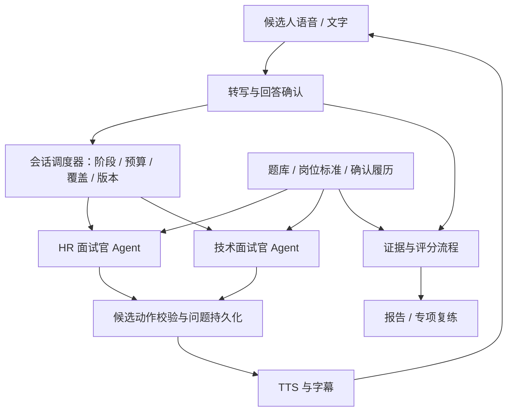
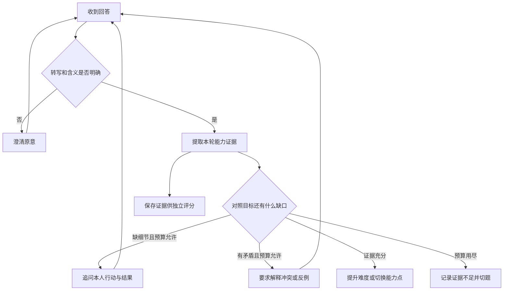

# 商业级 AI 语音面试：现状、竞品与双 Agent 方案讨论稿

> 文档类型：产品调研与方案讨论稿；文档状态：Draft  
> 创建日期：2026-09-07；更新日期：2026-09-08；竞品资料访问日期：2026-09-07  
> 编写：Codex；产品决策与批准：项目 owner（用户）；专业复核人：待指定  
> 关联任务：RES-INTERVIEW-20260907；关联 Feature：FEAT-INTERVIEW-001-ai-interview-coach  
> 产出阶段：2 问题调研；本次调研状态：InProgress（资料已整理，关键产品假设待讨论）  
> 本轮范围：只读源码核查、官网竞品调研、候选方案与交付标准；不包含开发、真实 Provider 调用或用户验收。  
> 风险：本次文档变更低影响；拟实施方案涉及简历、语音、外部模型和核心流程，建议实施按 L3 分流。  
> 本文不修改 Feature 控制页的当前主阶段，不构成 Approved 功能规格、执行包或发布授权。

> 流程深化入口（2026-09-08）：[完整使用流程与设计缺口审阅](2026-09-08-commercial-interview-flow-review.md)。包含逐步还原、HR/技术对话分支、计时与恢复、评分交付、权益复练及待完善问题；仍为 Draft，不是实测记录。

## 1. 先回答最核心的问题

> 技术深化入口：[商业级语音面试分层架构与接口设计](../architecture/commercial-interview-agents-design.md)。包含目录、各层职责、Agent角色/提示词/工具、模型路由、REST/WS/SSE契约、数据/状态/评分、定价额度与运行边界；仍为Draft，本研究稿保留产品与竞品事实。

**语音供应商适配代码已经写了，但不能据此认定“完整实时语音面试已交付”。** 当前采用浏览器录音、Java WebSocket、火山引擎豆包 ASR/TTS 和 DeepSeek 文本模型的级联路线。基础配置默认关闭外部 Provider 调用；没有验证当前进程环境、真实凭据和供应商成功请求，因此实际运行实例是否开启、是否能稳定完成一场语音面试，仍待验证。

**现在的面试智能主要是“题库主问题 + 有限技术追问”。** 已有技术追问模型调用，但没有完整的 HR / 技术面试官分工；现有技术追问 prompt 明确要求“不评分”。评分流水线有结构，但标准正文加载与实际评分接通尚未形成可交付证据。

建议产品方向是：**两个业务面试官 Agent + 共享会话调度器 + 独立评分流程**。HR 面试官考察动机、协作与经历表达；技术面试官验证知识、项目细节与工程权衡。两者都根据回答决定下一问；评分依据可引用的回答证据，最终生成可复练的报告。

商业价值应落在“问题像真实面试、追问有依据、评分可信、练完知道如何改进”，而不只是能说话、题目多或 Agent 数量多。

## 2. 当前实现与交付边界

下表是源码与历史记录的只读结论，不是本轮运行测试结果。

| 能力 | 核实到的实现 | 仍缺少什么 |
| --- | --- | --- |
| 浏览器录音 | Vue 页面通过 getUserMedia / MediaRecorder 获取麦克风；250ms 分片，Base64 经 WebSocket 发后端 | 真实设备、浏览器兼容性及长会话验证 |
| ASR | 自写 Java HttpClient / WebSocket 二进制适配器，接豆包流式识别服务 | 当前适配器先读取完整音频对象，再发供应商；不能等同于边说边转写 |
| TTS | Java HTTP 接口读取音频 chunks；前端能够组装并播放音频 | 前端等待 endOfOutput 后才生成 Blob 播放，不是首音频到达即播放 |
| 轮次控制 | 手动结束录音、确认转写后提交；有条件在播放结束后继续收音 | 未见完整 VAD / 语义回答结束判断；首题自动朗读与连续多轮未验证 |
| 动态追问 | DeepSeek 根据当前主问题、确认回答和追问预算，返回 FOLLOW_UP 或 NEXT | 当前调用条件主要限定已确认的主问题；缺 HR 策略、完整履历/JD 和能力覆盖状态 |
| 评分 | EvidenceExtractor → RubricJudge → ReportComposer 框架；有引用校验、版本和人工复核状态设计 | 当前发现 UnavailableRubricJudgeAdapter，拒绝无标准正文评分；未找到可用 judge 接通证据 |
| 可靠性基础 | 有 ticket、认证、音频序号、ACK、背压、取消、文字降级等代码 | 异常恢复、长时间稳定性、真实费用和全链路成功率未验证 |
| 页面体验 | 面试配置、面试室、语音操作、文字确认入口 | 大纲含固定 Java 内容；质量条为预设值；重复问题按钮仅滚动；草稿保存提示无对应持久化 |
| 历史与报告 | 本地答案在内存；刷新快照提示已回答 | 刷新恢复完整答案、正式报告页面与复练闭环没有交付证据 |

### 2.1 使用的具体技术

| 层次 | 当前技术 / 配置 |
| --- | --- |
| 前端 | Vue 3、getUserMedia、MediaRecorder、WebSocket、Audio / Blob |
| 后端 | RuoYi / Java，业务 Port / Adapter，Java HttpClient |
| ASR | 火山引擎豆包；默认 endpoint 为 `wss://openspeech.bytedance.com/api/v3/sauc/bigmodel_async` |
| ASR profile | `doubao-streaming-asr-2.0` → `volc.seedasr.sauc.duration`；concurrent profile → `volc.seedasr.sauc.concurrent` |
| TTS | 火山引擎豆包；默认 endpoint 为 `https://openspeech.bytedance.com/api/v3/tts/unidirectional`；`doubao-tts-2.0` → `seed-tts-2.0` |
| 面试文本推理 | DeepSeek，经 ChatModelPort 调用；具体运行模型依赖环境配置，不能从空默认值推断 |
| 关键开关 | 基础 application.yml 的 business-rest、external-provider-calls、object-storage-writes 默认关闭；local 配置可见 business-rest 开启，运行环境覆盖未核实 |

现状是 ASR → 文本 Agent → TTS，不是已接入端到端实时语音模型，也没有已完成 WebRTC 接入的证据。

### 2.2 可定位的本地证据

下列路径相对项目根；使用当前物理路径，避免沿用旧资料中的 `apps/` 路径。

- CODE-01：[InterviewRoomPage.vue](../../portal-web/src/features/interview/InterviewRoomPage.vue)：录音、转写确认、音频播放、页面预设与内存状态。
- CODE-02：[ProviderConfiguration.java](../../platform-backend/ruoyi-interview/src/main/java/com/ruoyi/interview/configuration/ProviderConfiguration.java)：外部调用开关与 Adapter 装配。
- CODE-03：[VolcengineSpeechToTextAdapter.java](../../platform-backend/ruoyi-interview/src/main/java/com/ruoyi/interview/infrastructure/provider/VolcengineSpeechToTextAdapter.java)：先加载音频对象再请求 ASR。
- CODE-04：[VolcengineTextToSpeechAdapter.java](../../platform-backend/ruoyi-interview/src/main/java/com/ruoyi/interview/infrastructure/provider/VolcengineTextToSpeechAdapter.java)：TTS 请求与音频解码。
- CODE-05：[VoiceWebSocketHandler.java](../../platform-backend/ruoyi-interview/src/main/java/com/ruoyi/interview/controller/websocket/VoiceWebSocketHandler.java)：stop / complete / final 等消息处理。
- CODE-06：[DefaultInterviewAgentCandidate.java](../../platform-backend/ruoyi-interview/src/main/java/com/ruoyi/interview/application/interview/internal/DefaultInterviewAgentCandidate.java)、[DefaultProgressInterview.java](../../platform-backend/ruoyi-interview/src/main/java/com/ruoyi/interview/application/interview/internal/DefaultProgressInterview.java)：技术追问 prompt、调用条件与题库主问题推进。
- CODE-07：[DefaultRunEvaluationPipeline.java](../../platform-backend/ruoyi-interview/src/main/java/com/ruoyi/interview/application/evaluation/internal/DefaultRunEvaluationPipeline.java)、[UnavailableRubricJudgeAdapter.java](../../platform-backend/ruoyi-interview/src/main/java/com/ruoyi/interview/infrastructure/agent/UnavailableRubricJudgeAdapter.java)：评分框架及不可用边界。
- HIST-01：[2026-08-23 语音运行记录](../development-records/2026-08-23-ruoyi-voice-runtime-completion.md)：部分历史编译 / 构建通过；真实 ASR/TTS 与完整 UAT 没有通过结论。
- HIST-02：[2026-08-29 实现记录](../development-records/2026-08-29-ruoyi-v2-implementation.md)：后续页面级修复不能外推生成计划、麦克风与语音完整链路已验收。

## 3. 市场上已有产品，应该学什么

资料均来自公开官网，访问日期为 2026-09-07。产品能力属于厂商公开声明，本次未注册或实测付费功能；宣传效果、客户结果不作为独立审计证据。除标明发布日期的案例外，其余页面发布日期未核实。

| 对标产品 | 公开可见的产品做法 | 对我们的启发 | 边界 / 商业信息 |
| --- | --- | --- | --- |
| [Yoodli Interview Preparation](https://yoodli.ai/use-cases/interview-preparation) | 按岗位练习、依据回答追问、语速与口头禅反馈、进度追踪 | 语音面试需要连续对话和可复练反馈；表达与内容分开评估 | 官方产品说明；不能据此证明 Java 技术评分准确，价格未核实 |
| [Huru](https://huru.ai/) | 模拟面试、反馈报告、自定义练习、题库、多语言、移动端；企业管理和分析 | 个人练习与机构管理可共用训练底座；产品最终要让用户看到成长 | 官网展示 Starter $24.99/月，Growth $99/年；地区、税和结账价格未核验；题量是厂商主张 |
| [牛客 AI 模拟面试](https://www.nowcoder.com/interview/ai/index) | 自我介绍、项目介绍与追问、薪资谈判、情景题、岗位 / 公司题集，含 Java 岗位内容 | 国内用户有明确岗位与专项训练入口；先把一个岗位练深 | 公开页面，未登录完成面试，价格未核实 |
| [牛客企业 AI 面试](https://hr.nowcoder.com/product/interview) | 全语音、多维追问、岗位模型、评价标准、结构化报告和招聘系统对接 | 商业产品需明确测什么、为什么这样评分，并保留证据和复核入口 | 属 B2B 相邻对标；“2s 追问”等为宣传，未实测，不转成我方承诺 |

### 3.1 一个值得参考的实际应用案例

[Yoodli / KindWork 案例](https://yoodli.ai/case-studies/how-kindwork-turned-interview-readiness-into-a-data-driven-signal-with-yoodli-ai-roleplays)发表于 2026-08-03。厂商报道，KindWork 在就业培训中将自己的评分标准放进模拟面试，让学员多次练习，并由教练结合结果辅导；案例覆盖自 2025 年春开始的多个培训周期。

它提示我们：有价值的交付是“适配目标岗位的标准 + 重复练习 + 人类辅导或复核”，而不只是通用问答。该案例由供应商发表，效果未独立审计，不能证明 AI 训练与就业结果存在因果关系，也不能把案例分数线照搬成我方及格线。

### 3.2 研究发现与取舍

| ID | 发现 / 假设 | 依据与可信度 | 方案取舍与验证方式 |
| --- | --- | --- | --- |
| FIND-01 | 录音成功和实时面试体验之间仍有明显工程差距 | CODE-01/03/05，源码直接证据；运行情况待验证 | 采用：先完成可测的真实语音闭环，再谈商业就绪 |
| FIND-02 | 岗位问题、上下文追问与复练是多家产品共同呈现的能力 | 三家 C 端官网，一手产品说明；付费体验未核验 | 采用：岗位化面试与专项复练；以目标用户访谈验证价值 |
| FIND-03 | 可解释标准与重复训练可能比单次总分更重要 | KindWork 厂商案例，适用性推断 | 采用：证据报告与同标准复练；比较用户能否据此完成具体改进 |
| FIND-04 | HR 与技术面需要不同证据与评分标尺 | 用户明确诉求、当前技术追问代码及岗位面试场景分析 | 采用双业务 Agent；对同一简历分别检查两类追问质量 |
| FIND-05 | 首发聚焦中文 Java 求职训练可能更易复用现有题库 | 现有代码 / 题库方向与旧研究；尚未验证付费需求 | 推荐假设：先验证单一岗位与级别，再扩展，不宣称市场已证明 |
| FIND-06 | 企业招聘涉及不同买方、评价用途与系统集成 | 牛客企业官网、产品边界分析 | 延后：机构训练后台；企业招聘初筛另立方案，不混入首发 |
| FIND-07 | 更多 Agent 或更自然的声音不会自动提高评分准确性 | 架构分析与当前不可用 judge；非竞品效果事实 | 不采用：以 Agent 数量作卖点、凭声音猜性格、无证据直接给录用结论 |

## 4. 推荐产品定位与完整使用旅程

**首发建议：面向个人求职者的中文面试训练，技术轮先覆盖 Java 岗位，配套通用 HR 轮。** 是否聚焦“Java 转 AI Agent”需单独确定；该方向可延续[既有产品研究](../product/research.md)，但仍是待验证假设。

用户购买的是可重复的面试准备：知道自己在哪些能力上证据不足，得到具体练法，并在再次面试中看到变化。企业招聘筛选有不同决策责任，不能直接用训练分数替代录用判断。

1. 选择岗位、级别和训练目标；填写 JD，可选导入简历，先确认解析事实。
2. 选择 HR、技术或组合面试，以及模拟模式 / 教练模式。
3. 查看预计时长、信息使用范围，完成麦克风和播放检测；文字模式可继续。
4. 面试官根据目标与履历制定覆盖计划，逐题提问；根据回答追问或切换话题。
5. 系统记录回答版本与证据；低置信转写先澄清，避免把识别错误当知识错误。
6. 结束后生成报告：已验证的优势、缺口、原话依据、改进方法和下一次练习。
7. 用户针对薄弱项复练；在可比岗位、难度与 rubric 版本下看变化。

模拟模式过程中不揭示答案或即时分数；教练模式允许逐题解释，但必须标记“提示后回答”，避免与独立首答混在一起评分。

## 5. 两个 Agent 应该怎样分工

两个 Agent 应有独立的知识来源、能力状态、追问策略与 rubric，而不是只换名字或 system prompt。它们可以使用同一模型，不要求拆成两个服务。

| 组件 | 负责 | 输入 / 输出 | 约束 |
| --- | --- | --- | --- |
| HR 面试官 Agent | 动机、协作、责任、学习、经历表达等岗位相关主题 | 岗位、确认履历、回答证据、HR 覆盖状态 → 单个问题与考察目的 | 评价回答中的行为证据，不猜性格、健康、诚实程度等个人属性 |
| 技术面试官 Agent | 基础、项目、故障排查、设计取舍与深度验证 | 技术题库、标准、项目声称、历史回答与能力缺口 → 单个问题及难度 | 错误先澄清；没问到或没说不等于不会；口述与实际代码能力分开 |
| 会话调度器 | 决定当前面试官、阶段、时间、追问预算、切题与结束 | 会话状态 + Agent 候选动作 → 校验后执行 | 确定性工作流即可；同一时间仅一个面试官说话，Agent 不直接改持久化状态 |
| 独立评分流程 | 提取证据、按 rubric 判断、规则聚合、生成报告 | 已确认回答、题目、标准正文与版本 → 分项评分 / 证据不足 / 复核项 | 与提问职责分离；可复用同一模型，但独立调用与记录 |
| 内容与标准库 | 维护题目、追问路径、行为锚点、误区和岗位适用范围 | 经审核版本 → 按岗位、级别、能力点检索 | 不把未经审核的模型生成答案直接当标准 |

建议先沿用 Java 模块化单体与现有 Port / Adapter。调度器管理会话，模型生成候选问题，服务端校验候选动作、权限、预算和版本，再持久化与播放。暂不为了“多 Agent”引入 Python 服务、复杂框架或微服务。



### 5.1 每轮决策需要哪些上下文

- 目标：岗位、级别、JD、轮次目标与难度；不能只输入“你是面试官”。
- 履历：用户确认事实、尚待验证的项目声称分别保存，不把自述自动判成事实。
- 历史：题目与回答原文索引、压缩摘要、已覆盖能力、未解决矛盾、提示使用情况。
- 预算：剩余时间、已追问次数、当前话题投入、静默或暂停状态。
- 版本：题目、rubric、prompt、模型与转写版本；报告能追溯当时的依据。

候选动作可包含 `ASK / FOLLOW_UP / CLARIFY / SWITCH_TOPIC / END`、问题文本、能力点、依据的回答片段和简短可核查理由。理由只描述事实与规则依据，不需要模型内部思维过程。动作集合属于候选契约，需正式技术设计确认。

### 5.2 HR 轮例子：有自己的问题与反馈方法

主问题：“讲一次你与同事意见不一致的经历。”

用户：“我协调了大家，最后顺利上线。”

HR Agent 应发现目前只有概括性结果，尚缺具体分歧与个人动作。下一问可以是：“当时具体在哪个决定上有分歧，你自己做了什么来推动解决？”若用户补充行动，再问结果如何验证或有哪些反思；若关键证据充分，就切换主题，不机械追满次数。

题库可包含动机、自我介绍、团队协作、失败复盘、学习迁移和薪资沟通。每类需维护考察目标、可追问方向、常见表达缺口和反馈方式。STAR 可帮助组织表达，但不是唯一正确答案；系统不能替用户编造项目结果或工作经历。

### 5.3 技术轮例子：随回答逐步验证深度

主问题：“秒杀系统如何防止库存超卖？”

用户：“用了 Redis 分布式锁。”

下一问先验证扣减链路与原子性；用户若提到锁超时，再问续期、释放时的 ownership 校验和故障情景；若解释充分，再进入数据库一致性、幂等、吞吐与锁范围的权衡。用户若已准确解释 Lua 原子扣减，就不应重复问已覆盖的问题。

技术题知识资产应包含适用前提、关键判断点、可接受替代方案、典型误区及追问树。项目声称较强但证据不足时，追问本人负责范围、故障定位和实际约束。未来编码与系统设计题应增加代码运行或结构化设计证据，不能用口述推断所有工程能力。

## 6. 评分怎样做到可信

建议采用“每轮轻量证据判断 + 面试结束异步深评”。轻量判断服务于追问，完整评分不阻塞下一句语音；运行速度与评分质量分别衡量。

### 6.1 评分数据与显示规则

每个维度输出：`rubricVersion`、题目与回答版本、原话 / 时间戳引用、0–4 分行为锚点、缺失或冲突证据、置信等级与理由、改进建议。置信等级表达证据充分程度，不伪装成统计概率。

HR 和技术使用各自标尺；语速、口头禅等表达指标单独展示，不能因为停顿、口音或识别质量差扣技术分。缺少考察机会、回答未完成或转写不可靠时，输出“证据不足”，不自动记 0 分。

以“幂等方案解释”一个维度为例，以下是候选行为锚点，需专家复核：

| 分值 | 可观察行为 |
| --- | --- |
| 0 | 已澄清后仍给出与幂等目标冲突的方案，且无法解释重复请求导致的重复副作用 |
| 1 | 能说出幂等概念或关键词，但无法说明请求标识、存储或生效位置 |
| 2 | 能描述唯一键 / 幂等号及基本检查流程，尚未处理并发和失败窗口 |
| 3 | 能解释并发互斥或唯一约束、失败恢复与重试，方案与具体场景一致 |
| 4 | 在上述基础上准确讨论事务边界、状态演进和方案代价，并说明验证方式 |
| 证据不足 | 本轮未充分涉及该维度，或识别 / 回答证据不足；不参与该项数值判定 |

总分由后端按批准权重确定性计算，不让模型自由生成。可计算已评估维度的加权分，同时单列覆盖率；达到预设覆盖门槛前不展示“整场能力总分”。HR 与技术分别报告；跨版本比较必须说明不可比条件。

### 6.2 示例报告应该长什么样

> 以下仅为格式示例，不是真实用户评分。  
> **技术：幂等方案解释 2/4**  
> 证据：“我会先查订单号，存在就不处理。”  
> 判断：已提出去重标识与检查流程；在后续并发情景追问中，尚未解释两个请求同时通过检查的处理。  
> 改进：补充唯一约束、状态迁移与失败重试的顺序，说明为何不会重复扣款。  
> 复练：用两个并发请求画出时序，解释失败恢复。  
> 限制：本轮仅评估口述方案，未执行代码。

### 6.3 评分上线前要如何校准

- 建立按岗位、级别和题型分层的匿名样本集，由至少两位专业人员独立评分并仲裁分歧；样本规模随覆盖范围确定。
- 对比模型与人工在各维度的一致性、差异原因和证据引用准确性，避免只看整体平均数。
- 检查同一回答多次运行、等义改写、长短表达、转写错字、提示后回答对评分的影响。
- 加入简历 / 回答中的 prompt injection、诱导高分、引用不存在内容、跨会话数据混用等异常样本。
- 更换模型、prompt、rubric 或转写处理方式时，用固定版本样本回归；人工分歧很大的题先改标准，不直接调模型迎合均分。

现有评分流水线可作为复用起点，但必须补齐标准正文来源、真实 judge、报告展示、版本审计及失败复核。不能把模型返回 JSON 视为评分质量已经达标。

## 7. 语音路线选择与必须补齐的体验

### 7.1 三种候选路线

| 路线 | 实现方式与范围 | 收益 | 风险 / 维护影响 | 建议 |
| --- | --- | --- | --- | --- |
| A：真正流式级联 | 复用 Java / 豆包 / DeepSeek；边录边发 ASR，文本决策，TTS 增量播放 | 问题、回答、评分证据容易对齐；复用现有业务边界 | 多跳延迟、音频格式、打断与状态同步需要补齐 | 首选，先做可测垂直闭环 |
| B：端到端实时语音 | 新增实时语音 Adapter，利用模型全双工与工具调用 | 有望改善自然轮换、低延迟和打断体验 | 新协议、业务动作约束、证据对齐、版本与费用需独立验证 | 做同场景对照实验，不假定必然优于 A |
| C：混合 | 实时语音负责对话体验，独立结构化评分继续异步执行 | 可兼顾自然对话与可追溯评估 | 链路更多，容易出现两套上下文与重复费用 | 对照数据证明收益后再引入，不首发同时维护双栈 |

截至本次调研，火山引擎[豆包实时语音模型 3.0 文档](https://docs.volcengine.com/docs/6561/2549778?lang=zh)（2026-09-04 更新）提供全双工、转写事件、Function Calling 与取消等能力。因此不能说端到端路线天然无法接业务工具或评分；是否满足本项目可控性，需要用一致场景验证。本文没有执行其真实 API，也未核实报价。

### 7.2 当前链路需要解决的具体工程问题

1. **真流式转写。** 当前 stop 后完成 ASR 的路径需演进为录音期间持续转发与 partial 输出；最终文本版本确定后才形成稳定评分证据。
2. **音频格式协商。** 浏览器候选格式包含 WebM/Opus，而[官方 ASR 文档](https://docs.volcengine.com/docs/6561/2630027?lang=zh)（2026-09-01 更新）列出的格式不能证明 WebM 容器可直接透传。应验证容器、编码、采样率、声道，必要时转码 / 重采样；“都是 Opus”不足以保证兼容。
3. **回答结束判断。** 结合语音活动、语义、思考时长与用户控制；ASR 句结束不等于整段回答结束。提供“我说完了”“继续思考”“暂停”兜底，避免抢话。
4. **增量播放。** 改善当前等待完整 TTS 的播放路径；是否保留 HTTP 流式 TTS 或改[双向 TTS](https://docs.volcengine.com/docs/6561/2532486?lang=zh)（2026-09-04 更新）需结合浏览器播放方案验证。后者支持文本流入、音频流出和取消，但当前项目未接通。
5. **打断与取消。** 用户开口后停止旧播放，取消在途生成；为音频 / 问题附加轮次标识，丢弃旧轮次晚到消息，避免重连后读错题。
6. **异常恢复。** ASR 失败保留重录与文字入口；TTS 失败仍显示题目；网络断开恢复已确认回答与当前轮次；重试不能重复记答案、出题或计费。
7. **原始表达证据。** 原始转写与规范化文本分开；去掉语气词、重复词的处理不能再用于计算原始口头禅指标。

商业体验应从“点录音、停止、确认、提交”的表单流程，逐步升级为自然轮换。确认文本仍可作为低置信、专有名词或用户主动纠错时的恢复入口，不能贸然移除。

## 8. 线框图与预期交付面

前一轮已生成[现状交互线框图](C:/Users/admin/.codex/visualizations/2026/09/07/01a07c4e-cc2b-7083-9eb4-9f2670b1a6aa/voice-interview-wireframe.html)，是本地示意，不是运行截图。下面是商业方案的候选线框，供讨论信息结构；不代表当前页面已具备这些能力。

```text
① 创建面试
┌──────────────────────────────────────────────────────────┐
│ 岗位：Java后端   级别：中级   目标：项目深挖                │
│ JD / 简历 → 确认解析事实（可跳过简历）                     │
│ 面试轮次：[HR] [技术] [组合]   模式：[模拟] [教练]          │
│ 时长与额度说明  ·  数据使用说明  ·  麦克风 / 播放检测       │
│ [开始面试]                         [使用文字模式]         │
└──────────────────────────────────────────────────────────┘

② 面试室
┌──────────────────────────────────┬───────────────────────┐
│ 技术面试官 · 项目深挖            │ 轮次：HR完成 → 技术   │
│ “两个请求同时通过检查怎么办？”  │ 目标：验证并发与幂等  │
│                                  │ 已覆盖 / 待覆盖主题   │
│ 正在听你回答…                    │ 模拟中隐藏评分与答案  │
│ 实时字幕 / 识别状态               │                       │
│ [我说完了] [继续思考] [暂停]      │ [结束并生成报告]      │
├──────────────────────────────────┴───────────────────────┤
│ 异常区：正在重连 / 修改识别文本 / 重录 / 切换文字          │
└──────────────────────────────────────────────────────────┘

③ 面试报告
┌──────────────────────────────────────────────────────────┐
│ 本次目标完成情况 · 评估覆盖率 · 报告状态与版本             │
│ [HR反馈] [技术反馈] [逐题回放]                            │
│ 优势 / 缺口 → 原话证据 → 评分理由 → 改进示例与练习        │
│ 未考察 / 证据不足单独列出，不伪装成低分                   │
│ [针对薄弱项再练] [反馈评分问题] [数据管理]                 │
└──────────────────────────────────────────────────────────┘
```

正式原型还需覆盖：没有履历、题库不足、解析待确认、麦克风拒绝、播放受限、长静默、ASR 错误、模型超时、打断、取消、断线恢复、报告生成中 / 失败 / 证据不足。当前草图不承担浏览器可访问性或 UAT 验证结论。

## 9. 商业级需要哪些可验收标准

以下全部是**候选指标与测量计划，尚未测量、尚未批准，不是 SLA 或交付承诺**。正式规格需要结合目标设备、网络、并发、岗位范围与预算确定阈值。

| 方面 | 候选目标 / 检查方式 | 不应通过的情况 |
| --- | --- | --- |
| 语音响应 | 以有效回答结束事件至首个可听音频为口径，建议先争取 P95 ≤ 3秒；同时记录静默判停时间、转写与生成各段耗时 | 只测服务端耗时，遗漏播放等待或过长判停 |
| 连续会话 | 在明确网络 / 浏览器矩阵内完成全场；建议邀测时目标完成率 ≥ 95%，样本量另定 | 把改成文字后的完成计为语音成功，或把重试失败剔出分母 |
| 追问质量 | 专家按相关性、增量信息、难度、重复程度盲评；候选相关且不重复占比 ≥ 90% | 根据不存在的回答追问、重复已解释内容、只换题不听答案 |
| 证据引用 | 展示的引用必须能定位到对应用户、会话、回答版本；逐条检查正确性 | 伪造原话、跨用户引用；此类错误阻断试商用 |
| 评分一致性 | 报告分项与专家仲裁分比较；候选 ≥ 90% 维度差值不超过1分（0–4标尺），按分层报告 | 总体平均数掩盖某一题型持续失准；差值1分仍需分析业务影响 |
| 恢复能力 | 断网、ASR/TTS超时、刷新、重复消息、打断后能回到正确状态 | 丢失已确认回答、旧题晚到、重复扣额度 |
| 内容覆盖 | 首发岗位的每个声称能力均有题目、rubric、样本与复核人 | 用“全岗位”文案销售未覆盖的能力 |
| 数据与费用 | 会话隔离、后端凭据、保留 / 删除策略、额度原子扣减、失败补偿与告警有证据 | 原音频默认无限保留、前端暴露密钥、费用不可归因 |

上述验证尚为计划。本轮没有执行测试、建立专家样本或完成用户验收。

## 10. 商业模式、成本与验证重点

首轮可验证“按场次或分钟限制的训练包”，再比较订阅；不宜在单场成本未知时承诺无限使用。机构批量训练可以是第二条收入路线，但机构后台、学员授权与数据可见范围需要另行设计。

Huru 的官网价格可说明市场上有订阅方式，不能直接证明国内用户愿付同价，也不能替代我们的成本测量和付费访谈。

单场成本应至少计算：

```text
单场成本 = ASR计费音频分钟 × 单价
         + TTS计费用量 × 单价
         + Σ各轮与报告的LLM输入/输出token × 对应单价
         + 存储与流量 + 重试与失败消耗
         + 分摊人工支持、支付与退款处理成本
```

单位需按最终 Provider 计费规则换算；用户沉默、历史上下文增长、深评和重试都可能增加成本。低 / 中 / 高情景应分别测量短练习、完整面试、长回答与故障重试，再决定套餐额度和毛利目标。本文未调用付费服务，不提供未经核实的每场成本或报价。

核心产品漏斗建议记录：完成设置 → 首场完成 → 阅读证据报告 → 按建议复练 → 在可比任务上改进 → 付费与续练。优先验证三件事：追问是否比固定题库有用；反馈能否转成行动；用户是否愿意为第二、第三次练习付费。

简历、录音、转写的用途与保留期需在实现前确定。建议原音频可选保留、提供删除入口、区分会话证据与匿名评测样本；这些是候选产品规则，不是已经批准的数据政策。

## 11. 从现有系统升级的分阶段交付建议

沿用[现有 Feature 控制页](../features/FEAT-INTERVIEW-001-ai-interview-coach/README.md)和[V2 收敛计划](../architecture/ruoyi-qbank-voice-convergence-plan.md)作为现有范围事实源。V2 曾延期的支付、报告扩展等，在本文中仅作为商业化候选重新讨论，不自动恢复开发授权。

| 阶段包 | 要交付的实际结果 | 关键依赖与验收证据 | 边界 |
| --- | --- | --- | --- |
| A：语音与追问基线 | 一个岗位，真实 ASR → 动态技术追问 → TTS 连续闭环；文字与异常恢复 | Provider启用核验、格式兼容、全场记录、分段延迟、取消和重连证据 | 可以邀测基础体验，不能宣称商业级评分完成 |
| B：双面试官与训练闭环 | HR / 技术独立策略、标准正文、证据评分、报告与专项复练 | HR/技术样本、题目/标准版本、评分链路、报告引用、刷新恢复证据 | 首发限定岗位与级别，不宣传全岗位 |
| C：专家校准与用户邀测 | 专家盲评、真实用户复练、稳定性与单场成本数据 | 分层质量报告、缺陷闭环、用户访谈与实际UAT结论 | Agent不代用户验收；指标未达标则缩小范围或改设计 |
| D：付费运营与上线就绪 | 套餐额度、计费补偿、数据管理、告警支持、停止与回滚准备 | 商业范围批准、费用与权限验证、上线就绪与独立发布授权 | 支付、部署均需具体执行范围，不能由本文直接启动 |

任务拆分应围绕上述垂直闭环，而非先把所有页面画完或先做四个 Agent。人员配置、现有债务和供应商稳定性尚未确定，因此本稿不承诺工期。

拟实施的专业责任：系统架构负责可靠性、成本、隐私边界；软件架构负责会话状态、Provider 和评分契约；前端负责媒体状态、恢复与可访问性；UI 设计负责线框、反馈表达及完整异常状态。当前由 Codex 形成候选稿，实施主责与独立复核人需在正式执行包中指定，不能用角色自报代替评审证据。

## 12. 本轮结论、未验证项与下一步讨论

本轮已整理：现状证据、三家面试训练产品与一个企业对标、真实公开客户案例、双 Agent 候选架构、追问与评分例子、语音路线比较、线框和分阶段交付建议。

证据边界：源码只读核查可支持“存在什么代码”，官网可支持“厂商如何描述产品”；真实语音成功率、延迟、评分准确率、浏览器兼容性、成本与用户付费意愿均为 **NotRun / 待验证**。本稿和已有线框不能作为这些能力已交付的证明。

建议按以下顺序讨论，第一项决定后续产品分叉：

1. **先卖给谁？** 推荐先面向求职者做训练；若首发是企业招聘初筛，需重新定义评价用途、采购者、复核与集成范围。
2. **首发岗位有多窄？** 建议先中文 Java 的一个明确级别，HR通用轮配套；Java转AI是否作为差异化定位需验证。
3. **优先体验是什么？** 推荐模拟模式为主、复盘后教练辅导；语音先验证流式级联，再用同场景比较端到端路线。
4. **什么证据足以进入付费？** 确定专家资源、邀测用户、预算与上述候选质量门，而非仅以页面完成为准。

讨论形成明确取舍后，再更新 Canonical Feature Spec、交互原型、技术设计和 TASK 执行包。本文继续保持 Draft，不改写既有批准范围，不表示已实现、已验收或已发布。

## 13. 补充调研：竞品的技术架构与面试决策逻辑

补充日期：2026-09-07；仍属阶段 2 调研，Draft。本节将官方帮助文档、厂商技术宣传与我方推断分开。未获得竞品源码、生产配置或运行 trace；不能从产品界面还原完整后端架构。

### 13.1 Yoodli：场景、角色、问题与评分目标分别配置

**技术组件的公开证据：**

- 2026-02-05 的[组织关键词配置文档](https://support.yoodli.ai/en/articles/13642004-create-organization-custom-keywords)直接提到 Deepgram 转写。这能证明其公开转写功能涉及 Deepgram，不能证明所有语言、套餐和会话都使用同一服务。
- 2024-08-08 的[官方 Google Cloud 合作文章](https://yoodli.ai/our-partnerships/yoodli-powered-by-google-cloud)披露当时使用 Google Cloud、Cloud Storage 与 BigQuery。这是历史基础设施事实，不能视为 2026 年完整架构清单。
- 本次没有取得足够一手证据确认当前各条业务链路的 LLM 型号、TTS 供应商、媒体传输协议、Agent 框架及数据库。使用某云平台不等于所有模型都来自该云。

**面试与评估逻辑的公开证据：**

1. [面试操作文档](https://support.yoodli.ai/en/articles/9550465-practice-with-yoodli)描述：设置岗位、公司与面试官风格，选择预设或自定义问题，面试中混合动态追问，结束后查看分析。
2. [场景构建文档](https://support.yoodli.ai/en/articles/11565137-how-to-build-and-customize-roleplays)把背景 context、persona 与 goals 分开配置；外部页面或预读材料可提供背景。由此可见业务配置分层，但无法证明底层必然使用向量检索或某个 RAG 框架。
3. [自定义评分目标文档](https://support.yoodli.ai/en/articles/11556965-creating-custom-goals)（2026-03-13）说明企业版可导入 rubric，使用通过/不通过、等级、组合与文档知识目标。知识目标以提供的文档为评估依据；没有公开完整权重算法和调用时序。
4. [多角色文档](https://support.yoodli.ai/en/articles/11011824-multi-persona-roleplays)（2025-06-02）描述同场最多三个 persona，可以有不同目标与风格，并相互交流。产品多角色不等于已证明后台有三个独立 Agent。

可用于理解的功能流程是：**岗位与场景配置 → 主问题 → 回答 → 上下文追问 → 按目标反馈 → 复练**。这是对公开功能的归纳，不是供应商部署图。

### 13.2 牛客企业 AI 面试：岗位标准驱动的动态追问与评估

牛客 2026-03-04 的[官方评估标准文章](https://hr.nowcoder.com/article/13685?urlSource=sitemap)声称使用 Now-GPT，结合 DeepSeek、通义千问、ChatGPT 等能力，并按出题、纠错、追问环节选择子模型。这里的证据等级是**厂商技术自述**，缺少可复核的模型卡、路由代码和生产配置。

该文把这种方式称为 MoEs，但没有足够细节判断其指神经网络内部专家结构，还是应用层多模型调度；本方案不能据此直接认定或复制某种 MoE 实现。ASR/TTS 供应商和传输协议本次未确认。

其公开面试逻辑强调：根据回答是否完整、是否切题调整追问，借 STAR / FACT 补充经历细节；评分标准由领域专家与企业共同确定。该描述支持“围绕考察目标补充证据”的产品方向，不能证明具体评分准确率。文章中的性能与一致性数字没有可审计测试集，本稿不采作我方基线。

[企业产品页](https://hr.nowcoder.com/product/interview/)进一步呈现岗位模型、全语音、多维追问、结构化报告和招聘系统对接；可以归纳为：**企业确定岗位标准 → 配置面试 → 候选人回答与追问 → 结构化评估 → HR复核 / 系统回传**。这些属于企业产品范围，不自动外推到牛客求职者模拟面试。

### 13.3 Huru：JD 定制题目与反馈复练

[产品主页](https://huru.ai/)公开的入口包括选择题库、从招聘网页导入职位、粘贴 JD；系统据岗位要求生成问题，用户录制回答、查看反馈并重复练习。

[面试生成器官方博客](https://huru.ai/ai-mock-interview-generator-custom-role-company/)提到 GPT-4、Claude，以及岗位/级别适配、行为题框架和自适应追问。这是产品营销说明，不能当作当前生产模型清单、已验证的逐轮调度逻辑或追问深度证据。其 ASR/TTS、rubric 权重、上下文管理和停止条件均未取得足够一手技术资料。

因此可以确认其公开定位重视“岗位定制 + 反馈训练”；现阶段不宜断言其动态追问实现深度与 Yoodli 或牛客企业版相同，也不能断言其没有动态追问。

### 13.4 从竞品学习的决策逻辑：下一问要补什么证据

以下为**我方参考设计**，不是已经查明的竞品算法。竞品资料能够支持配置题目、上下文追问与目标评分等功能；具体状态机需要我们自行设计并验证。



HR 例子：“我推动了项目上线。”只有结果声称时，下一问验证本人动作、分歧和结果依据；技术例子：“我加了缓存，性能提高了。”下一问可验证瓶颈、测试口径、缓存一致性或失效策略。先选一个最有价值的缺口，不把所有分支一次问完。以上均为我方示例，不是竞品真实问答记录。

两个面试官共用轮次与预算管理，分别维护考察维度、知识资料与证据状态；提问时补齐证据，结束后按标准评分。是否使用两个模型、两个进程或某种 Agent 框架，是实现选择，不由“HR / 技术两个角色”自动决定。

### 13.5 新增发现与剩余验证

| ID | 新发现 | 我方取舍 / 未确认项 |
| --- | --- | --- |
| FIND-08 | Yoodli 操作文档披露 Deepgram 与可配置评分目标，证据比泛化产品宣传更具体 | 借鉴术语转写与 rubric 管理；不照搬未知供应商组合 |
| FIND-09 | 牛客自述按环节选择模型，并用框架引导追问 | 借鉴按任务分工；多模型路由是否有必要用质量、延迟和成本实验决定 |
| FIND-10 | 多角色体验与后台多 Agent 部署是不同问题 | 保留 HR / 技术业务角色；首版不因角色数量引入额外服务 |

后续若需要验证真实体验，可用同一组授权测试情景比较三家：泛泛回答、已充分回答、前后矛盾、专业术语误识别、长停顿和重复练习。记录实际下一问、结束条件、评分证据和延迟；未经运行的场景继续标记 NotRun。公开网页不足以确认内部 prompt、模型路由与评分公式，这些只能通过供应商技术资料进一步核实，不能由体验测试直接证明。

## 14. 技术方案与首版价格深化入口

2026-09-08 根据用户要求补充[技术设计讨论稿](../architecture/commercial-interview-agents-design.md)。技术细节在该文件维护，本稿不重复复制。推荐继续复用Java/RuoYi模块化单体，将HR/技术面试官、会话调度和独立评分明确分工。

- 分层职责与拟实施文件树：技术稿第3–4节。
- Agent角色、五段提示词、模型路由和只读工具：第5–6节。
- 面试决策、状态、事务、REST与流式接口：第7–9节，并链接3份机器可读契约草案。
- 数据、评分与前端路由：第10–12节。
- 首版定价与额度规则：第13节；当前建议训练包为¥39/3场、¥99/10场，每场最多30分钟，尚未发布销售。
- 安全、成本、容量、恢复和架构取舍：第14–17节。

该深化稿将原先“定价待验证”的问题推进到具体候选值，仍需真实成本与付费需求验证；不代表已批准新功能、支付、上线或修改现有V2收敛范围。
