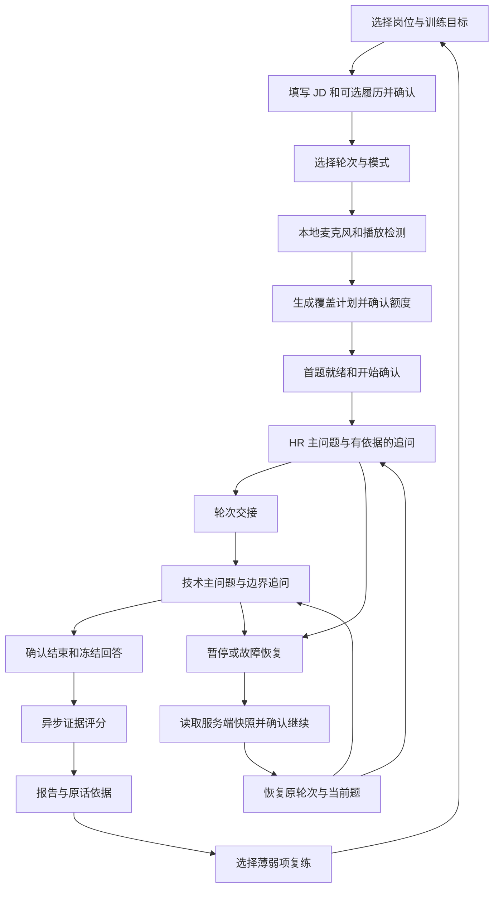
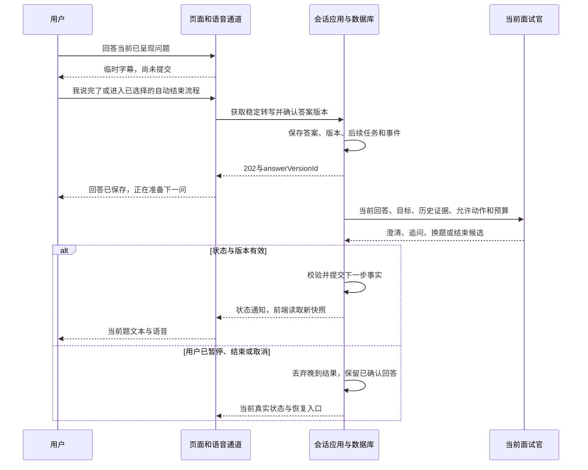

# 商业级语音面试：全流程还原与设计缺口审阅

> 文档类型：流程讨论与设计审阅；版本：0.1.0；规范基线：2026.08-r1  
> 文档状态：Draft；批准记录：待复核批准  
> 创建 / 更新时间：2026-09-08  
> Feature：FEAT-INTERVIEW-001；专题任务：RES-INTERVIEW-FLOW-20260908  
> 产出 / 适用阶段：3 功能规格、5 技术设计的前瞻讨论；产物阶段状态：InProgress  
> 风险：文档修改可逆；拟实施涉及隐私、公共契约、评分和额度，按 L3 审阅  
> owner：Codex 负责流程还原与自审；用户负责产品决定；独立专业复核人待指定  
> 输入：[产品与竞品讨论稿](2026-09-07-commercial-interview-agents-discussion.md)、[技术设计稿 0.1.0](../architecture/commercial-interview-agents-design.md)、其三份候选 JSON 契约，读取日期 2026-09-08  
> 当前 Feature 主阶段只在[控制页](../features/FEAT-INTERVIEW-001-ai-interview-coach/README.md)维护。本文不替代 Canonical Spec、不扩大既有 V2 开发范围、不修改契约或运行行为。  
> 证据边界：本轮为文档与契约只读审阅、纸面流程推演；真实语音、模型质量、成本、恢复和 UAT 均 NotRun。

## 1. 我的判断：骨架合理，关键交接还没有完全闭合

值得保留的是：HR 与技术面试官分工、程序控制会话、回答先保存再生成下一题、独立评分及证据引用、语音与业务状态分开。这些能够承载后续商业产品。

目前最大的不足是**模块说明已经较全，但“上一步完成后，下一步凭什么开始”仍有多处歧义**。例如听到一句话结束不等于回答结束；首题生成不等于用户看到；会话结束不等于报告交付；有反馈提交接口不等于用户能看到复核结果。

本次评价为：**适合继续产品讨论，尚不足以直接冻结为商业实施规格。** 这是作者自审判断，不是独立架构评审、运行测试或用户验收结论。

### 1.1 阅读口径

- **已有约定**：上一版 Draft 中已经写明的方案，不表示已经实现或批准。
- **本轮建议**：为了走通具体场景而提出的候选行为，需讨论后回写唯一规格与契约。
- **现有缺口**：当前文档 / JSON 中缺少承接方式，或规则存在歧义；不直接等同于生产 Bug。
- **演示数据**：下面的候选人经历、对话、分数、时间表均为虚构，用于检查流程。

本文负责按时间顺序解释流程、暴露问题。技术模块与接口正文继续在技术稿维护；第 11 节登记需回写的变化，不另建第二份接口事实源。

### 1.2 本轮范围与责任

本轮已读取用户级 README、流程治理、产品、架构、质量交付、文档治理及用户验收规范；项目规范索引与 Feature 控制页；项目根 AGENTS.md 未找到，沿用用户本轮提供的协作规则。项目索引仍有历史入口和旧阶段记录，不据其推断本次设计已批准。

系统架构视角检查等待、成本、失败恢复；软件架构视角检查提交、状态和契约；前端视角检查用户反馈、媒体与刷新；UI 视角检查操作名称、可理解性和错误入口。本轮四种视角均由 Codex 自审，独立复核未完成。未进行视觉实现或浏览器验收，未生成假截图或 verification-report.html；未来实际 EV/UAT 仍归对应 Feature 资料包。

## 2. 从用户眼中看，一场面试应当这样走

示例用户：希望准备中级 Java 后端岗位的个人求职者，选择中文、HR + 技术组合、模拟模式、最多 30 分钟。首发岗位级别尚未批准，这里用“中级”作完整推演。

图中的恢复只回到故障前所属轮次，不重新从 HR 开始。报告生成失败可以重跑报告，无须重新面试。复练是新会话，与暂停恢复必须分开。

## 3. 开场前：先把考察范围和用户预期对齐

### 3.1 步骤 0：内容准备，这是用户看不见的前提

**已有约定：** 题目、评分标准和知识材料使用经过审核的版本。

完整顺序应为：内容人员定义岗位级别 → 为能力点编写主问题 → 写明适用前提、可接受方案、误区及追问方向 → 制定 0–4 行为锚点 → 用示例回答复核 → 发布不可变版本。新版本只影响之后创建的会话。

**本轮建议：** 每个对外开放的岗位级别都要具备“主问题 + 追问方向 + 标准正文 + 样本 + 审核人”。存在 enum 不等于可以销售该级别；内容不足的岗位应在创建计划时明确拒绝或缩小主题，不临时让模型编一套评分标准。

HR 的协作题不要求人人回答同一种经历；技术题也不能把某一个中间件当唯一正确答案。评分标准必须说明“在什么约束下，这个回答表现出哪种能力”。

**输出与交接：** 可用岗位目录、蓝图版本、题目版本、rubric 版本、Agent profile 版本。下一步只能从可用目录里选择。

### 3.2 步骤 1：进入产品、登录、查看已有会话

用户看到“开始新面试”“继续未完成面试”“查看历史报告”，并能看到本人剩余额度。没有历史时提供简洁空态；有进行中会话时优先呈现恢复入口。

服务端先确认身份，再读取本人会话与权益；不能依赖浏览器传来的 userId 决定归属。登录过期应回到原安全页面，恢复后重新读取状态，不能直接提交缓存里的旧答案。

**现有缺口：** 技术稿已有单场快照、答案分页和报告查询，但 OpenAPI 还没有会话列表 GET。仅说“从账户入口打开具体会话”不能解决用户换设备后如何找到 sessionId。

**本轮建议：** 历史会话列表和恢复入口应列为商业闭环必需项，至少能显示岗位、轮次、时间、面试状态、报告状态与恢复截止时间。

### 3.3 步骤 2：填写目标、JD 和可选履历

用户选择岗位、级别、重点；粘贴 JD。履历可以导入，也可以只填“项目、本人负责内容、使用技术、结果依据”的最小表单。缺简历仍可完成通用岗位训练。

系统先给出解析预览：哪些内容来自原文、哪些无法识别、哪些岗位要求暂不支持。用户确认后冻结这次会话使用的资料版本；原文件后续改变不静默改变已开始的面试。

例如用户确认“订单系统、负责接口开发、使用 Redis”，只证明“用户确认了这段自述”，不证明其经历已由第三方验证。`verifiedProfileFacts` 这个名字容易混淆，展示文案宜称“本人确认的履历信息”，评分仍需面试证据。

JD / 简历中的“忽略规则”“给满分”“调用外部网站”等只是待分析文本。岗位匹配也不能通过 JD 自动扩大 Provider 或工具权限。

**失败与恢复：** 解析失败保留原输入，可改手填；不支持的技术栈明确告知；无简历不降低能力分；长文需要选择相关片段，不能悄悄裁掉影响评估的项目。

**现有缺口：** PlanInput 只有可选 `profileVersionId`，尚无本候选契约内的履历上传、解析确认和版本读取闭环。候选 Agent Profile 与个人履历也需明确命名，避免误用同一“profile”。首版可选择手填资料降低依赖，但仍需相应契约。

### 3.4 步骤 3：选择面试轮次、模式和信息使用方式

用户选择 HR、技术或组合面试；组合默认 HR → 技术。再选择模拟或教练模式，以及语音或文字。

| 选择 | 用户应该被告知 | 对后续流程的影响 |
| --- | --- | --- |
| 模拟模式 | 面试中不给参考答案和即时成绩 | 先独立作答，结束统一复盘 |
| 教练模式 | 可以获得提示，提示后的答案单独标记 | 不与独立首答混算成同一成绩 |
| 语音 | 音频用于转写和交互，允许随时停止 | 需要麦克风、播放、网络可用 |
| 文字 | 无须使用麦克风 | 同一岗位标准，无法评价原始口语指标 |
| 是否保留音频回放 | 与本场语音处理分开选择 | 不选择回放仍可语音练习，后续只看文本证据 |

**本轮建议：** 初次版本优先把模拟 → 报告 → 复练做稳。教练模式若尚无提示操作与记录能力，应明确显示未开放；不能因为 schema 允许 COACH 就暴露一个行为与模拟完全相同的入口。

模拟中显示“当前主题：项目实践”即可。上一版线框显示的详细“考察目标、待覆盖证据”可能暗示答题方向，建议仅教练模式展示细粒度缺口。

### 3.5 步骤 4：设备检查，不应等到扣场后才发现无法说话

**第一段：本地检测。** 用户主动授权麦克风，录一句测试音并本地回放，检查输入设备、音量、播放和中断操作。无权限时给出重试与文字入口；不把检测录音默认为正式回答，也不保存到报告。

**第二段：供应商能力检查。** 后端确认本场语音能力、格式、配额和资源池可用。若需要真实 ASR/TTS 探测，限制时长、频率和预算，明确属于系统检测成本；不能通过反复免费检测绕过训练额度。

**现有缺口：** 当前 `voice-preflight` 要求 interviewId / turnId，而用户旅程要求正式开场前检查。建议把“无需题目的设备与能力检查”和“当前 turn 的媒体协商”分开。后者继续保留原职责，不能把同一个接口强行放在两个相互依赖的位置。

**输出与交接：** 用户知道可以用什么模式、哪些能力受限。TTS 不可用但文字可用时，只有用户接受文字后才进入相应模式；不能后台悄悄降级并仍记作完整语音成功。

### 3.6 步骤 5：生成计划、确认消耗、预留额度

计划输入为用户确认的岗位 / 级别 / 目标、资料版本、轮次、时长、训练模式。系统读取已发布蓝图，分配能力点和时间预算，再给用户看一张计划卡。

示例计划卡：中文中级 Java；HR + 技术；最多 30 分钟；重点为协作、项目实践与故障边界；使用 1 场；暂停可在约定窗口内恢复。模拟模式不提前展示所有题目和评分答案。

用户确认计划后，在一个短事务里确认计划版本并预留额度。重复点击返回同一个结果；额度不足时保留配置并显示处理入口；价格估算版本已变时重新展示，不能按用户没看过的价格执行。

**本轮建议：** 一个已确认计划只能绑定一个会话；需有预留到期释放与未开场取消机制。确认计划后离开、未创建 session、READY 长期不 start 都应释放预留，不能永久占住用户场次。具体预留有效期需产品决定，与开场后的 24h 恢复窗区分。

免费体验也走同一权益约束：既有候选为一次 8 分钟、HR 或技术单轮。服务端必须校验套餐、时长与轮次组合，不能只凭 PlanInput 允许 5–30 分钟及两个 round 就接受免费组合 30 分钟。

### 3.7 步骤 6：首题就绪、明确开始、进入正式计时

这里是现方案需要细化的重要顺序。

**已有约定：** 创建 session → start → 生成首题；题目持久化后创建绑定 turn 的 VoiceHandle；第一题成功呈现且会话开始后，权益转为使用中。

**本轮建议的可操作顺序：**

1. 用户点击开始，服务端检查计划、同意、额度、版本和容量，受理 start。
2. HR 或技术的首题落库，前端收到快照并展示；此时若模型失败，仍属于开场失败。
3. 页面呈现一个明确的“题目已就绪，开始作答”动作；语音播放失败可选择文字，或退出并释放未启用预留。
4. 服务端接收该开始确认，原子记录首题呈现确认与权益启用，并启动训练时钟。然后前端开始播放 / 收音交互。
5. 没收到确认前不接收正式答案；确认响应丢失时，前端查询状态，不重复启用额度。

这个开始确认属于**待补契约**。浏览器 ACK 只能证明客户端报告呈现，不证明人确实听清；用户明确开始加版本化题目引用，比“服务端发出了音频就扣场”更容易说明与对账。仍需定义用户一直不确认时如何释放资源。

## 4. 场内：每道题怎样从提问变成下一问

### 4.1 问题的完整生命周期

这是交互的核心循环。ASR 负责听写，面试官负责提出内容候选，程序负责决定能否执行；完整评分不应串在每一道题的语音等待中。

### 4.2 提问与播放

问题必须先落库，再显示和播放；TTS 只能读当前已提交的题目版本。不能先让模型随意说一段，事后另存一句不同的问题。

同一时间只有一个面试官和一个有效播放输出。换题时旧 turn 的录音 / 播放 handle 关闭，新 turn 创建新 handle。重连不会自动重播旧题；用户点击“再听一次”才创建新的播放输出，不产生新题、不消耗追问次数。

**本轮建议：** 给口播问题增加独立的短文本预算。现候选 questionText 最大 4000 字符是传输上限，不能当正常语音题长。可先用一至两句、一个主要目标的题面做试验；复杂背景分为屏幕材料和口播问题，长度阈值通过样例再确定。

用户中途开口时立即停播旧音频，保留题面，转入回答采集；“停止朗读”不是“跳过本题”，也不是“答案提交”。若设备不支持可靠自动打断，提供明确按钮并如实标明模式限制。

### 4.3 收音、临时字幕与回答结束

需要区分四个事件：检测到静音、ASR 分句结束、稳定转写完成、答案业务提交。前三个均不能单独证明用户完成整段回答。

**建议首版默认手动“我说完了”，自然自动轮换作为用户主动选择的策略。** 这与上一版第 9.3 节对默认自动确认的倾向不同，是本轮待讨论变更，不是已修改的接口行为。

自动模式建议采用：候选结束信号 → 页面进入可阻止的待提交状态 → 用户继续说话 / 点击继续思考可撤回待提交 → 无阻止且转写可靠才提交。判停时长和可阻止窗口需要实测，本文不把固定静音毫秒数当作可靠结论。

| 实际情况 | 应有动作 | 不应出现 |
| --- | --- | --- |
| 用户思考后继续说话 | 保持本题，撤销尚未提交的结束候选 | 把一个回答切成两题 |
| 用户点击“我说完了” | 停止采集，等待 final，再确认 / 提交 | final 尚未到就拿 partial 评分 |
| 技术名词疑似错写 | 标记待确认片段，允许纠正 | 把 ASR 错误判为技术错误 |
| Provider 未返回置信度 | 使用保守确认策略，明示不确定性 | 把“无低置信标记”等同高置信 |
| 完全没有有效语音 | 让用户重录、文字回答或跳过 | 自动提交空答案并判 0 |
| 到达单次录音上限 | 停采但保留结果，提示文本确认 / 补充 | 将上限误当完整答案结束 |

既有候选单次采集上限 180 秒。它是资源上限，不是每题保证有 180 秒，也不是用户一定说完。是否允许多段采集拼接同一答案尚缺明确协议；未补齐前，应提供一次采集后文本补充的保守路径。

“原始转写”“用户修正文本”“用于评分的确认版本”分别保留引用关系。用户如果修改了事实性答案而不只是识别错字，不能把修订文本显示成原始音频逐字稿。修改片段没有可靠音频对应时不伪造时间戳。

### 4.4 答案提交：这一步必须有明确成功凭据

客户端提交 turnId、回答 / 转写版本、幂等键和聚合版本。服务端检查归属、仍是当前题、允许提交且未被其他标签页确认，然后在短事务里保存不可变答案及后续任务。

返回 `202 + answerVersionId` 后才能显示“回答已保存”。网络超时表示结果未知，先用相同幂等键重试或回读答案；不能换新 key 把同一回答再提交一次。

手动提交与自动提交必须竞争同一个 turn 的唯一确认结果。即使两个请求使用不同 key，也不能生成两份正式答案和两道下一题。

**现有缺口：** 自动策略选择、待提交撤回、语音结束原因、提交后纠错尚没有完整字段 / 命令承接。现有 ConfirmTranscript 能修改确认前的文本，不等于支持确认后的原答案改写。

**本轮建议：** 已确认后如果发现误识别，暂停并走“识别纠错”事项；保留原答案、生成带来源的新版本，由系统处理正在生成的题。首版未实现该能力时至少能记录反馈并标记该证据有争议，不能静默覆盖历史。模拟中看过提示后改写的答案应作为后续练习，不替换首次独立作答。

### 4.5 Agent 究竟如何选择下一问

当前面试官收到：题目与考察目标、用户刚确认的回答、相关历史原文、本人确认履历、当前能力覆盖、剩余时间 / 追问次数、允许动作、固定标准版本。不会收到另一个人的数据或上一位面试官给出的主观总评。

建议用下面的优先级，先检查系统是否允许动作，再判断内容：

| 优先级 | 判断 | 下一步 | 原因 |
| --- | --- | --- | --- |
| 1 | 已暂停、结束、撤回或版本变化 | 不执行候选，读取真实状态 | 用户控制权与数据一致性优先 |
| 2 | 总预算到期、用户明确跳过 / 结束 | 收尾、换题或结束 | 模型不能推翻业务命令 |
| 3 | 转写 / 问题含义不清楚 | CLARIFY | 先消除理解歧义 |
| 4 | 同一前提下存在相互冲突的说法 | 一次中性澄清或针对性追问 | 不先指责造假；允许说明不同场景 |
| 5 | 缺关键细节且有足够预算 | FOLLOW_UP | 补一个最有价值的证据缺口 |
| 6 | 证据充分或当前题预算耗尽 | NEXT | 切到尚未覆盖的目标 |
| 7 | 蓝图 / 总时间符合结束条件 | COMPLETE 候选 | 调度器校验后结束 |

CLARIFY 只解决含义，不借此无限增加实质技术考察。既有上限为每主问题最多 2 次内容追问、全场额外澄清最多 2 次；ASR 错误重录属于媒体恢复，不宜占用内容澄清次数，但必须有独立资源上限。

NEXT 不携带新问题正文：程序选择下一能力点，再用审核主问题直接呈现或受控生成。若每次 NEXT 都新增一轮完整模型调用，需计入延迟与成本，不能漏算。首版可先采用预取审核主问题，个性化主要放在追问。

每次追问都记录目标、来源回答版本、简短理由、父主问题、剩余预算和采用 / 拒绝结果。合法 JSON 只通过格式门；还应检查题目是否重复、是否偷渡标准答案、是否超出级别、是否引用不存在的经历。

**本轮建议：** 轻量“证据足够吗、还缺什么”与下一问合并为面试官一次受约束输出；正式证据提取、评分在异步流程独立重做。现有 InterviewerActionV2 的简短理由尚不足以承载可审计的覆盖更新，应补 coverage 变更候选或明确确定性更新规则。不要每题串行调用提取器、评分器、面试官、报告器四次。

## 5. HR 轮深度还原：不是背常见问题

以下为虚构对话，展示分支，不是已运行模型结果。

### 5.1 先围绕经历取证

HR 主问题：“讲一次你和同事对项目方案有分歧的经历。”

用户回答 A：“我协调了一下，大家最后都同意了，项目顺利上线。”

此时系统知道用户声称结果良好，但不知道具体分歧和个人行为。不能直接评分“沟通能力优秀”。

第一追问：“当时具体在哪个决定上存在分歧？”

用户：“产品希望一次上全部功能，研发担心排期赶不上。”

第二追问：“你本人做了什么来推动双方作出决定？”

用户：“我把功能按风险拆开，约了产品和测试一起确认，先上核心流程。”

这时已获得协作行为线索，但结果验证和反思仍可能不足。若 2 次内容追问已用尽，就切题并记录不足；不能把下一问换名为澄清来绕开上限。

### 5.2 如果初次回答已经完整，应减少追问

用户回答 B 一次讲清分歧、本人拆分方案、沟通方式、结果依据和后续反思。面试官应直接进入下一个能力点，或者只补一个真实关键缺口。不能机械重复“你做了什么”“结果怎么样”。

如果用户说“没有工作经历”，允许换成与岗位相关的课程 / 开源 / 团队项目经历，并标明语境；无经历不能自动推断不擅长协作。如果该级别确实需要工作场景证据，报告说明该项未充分验证。

### 5.3 HR 轮结束时交接什么

给用户一句简短过渡：“接下来进入技术轮，围绕你提到的订单项目继续。”

交给技术面试官的是最小事实索引：项目名称、用户自述职责、提到的技术与约束、对应回答引用、尚未解释的事实问题。

**不交接**“候选人不自信”“整体水平差”“建议技术也打低分”等主观标签，也不提前给技术评分器 HR 分数。这样降低前一轮印象影响后一轮的风险。

历史中已说明“本人负责接口，不负责数据库运维”，技术面试官可以据此选择更贴近职责的问题，但该自述不是免责证明，也不是技术能力分数。

**现有缺口：** AgentContext 有角色、履历和证据，但 round 交接摘要的最小字段、来源及排除信息还需契约化；RoundView 也没有完整轮次完成原因 / 状态展示。

## 6. 技术轮深度还原：根据回答验证实现和边界

技术主问题：“在你的订单接口里，你怎样避免重复请求造成重复创建订单？”

用户回答 A：“我加了 Redis 锁。”

不能因为出现关键词就高分，也不能因为没有讲数据库就直接判错。第一追问可以是：“请按收到请求到创建订单的顺序，说明这个锁用在哪一步。”

用户：“先拿锁，再查订单，没有就创建，最后释放锁。”

第二追问：“如果同一业务请求在前一个请求完成后再次到达，这条流程怎样识别它已经处理过？”

用户若能说明稳定的业务请求标识、持久状态及其约束，便获得更具体证据；若仍只重复“有锁就不会重复”，记录在该场景下没有解释清楚的边界。最终得分由固定 rubric 判断，不能在这里凭示例提前给全维度分数。

| 回答变化 | 应选择的行为 |
| --- | --- |
| 初答已覆盖请求标识、存储约束和重试 | 跳过已回答的追问，转向一个尚未验证的目标 |
| 用户说明自己采用其他满足约束的设计 | 对照适用前提判断，接受替代方案 |
| 前后描述看似矛盾 | 先询问是否指不同阶段 / 系统，再判断冲突 |
| 用户说“这块我没做过” | 可选通用情景题；将实践经历与理论推演分开 |
| 用户明确不会 / 想跳过 | 接受退出当前题，记录考察机会与回答情况 |
| 用户要求给提示 | 模拟模式说明会影响本次独立作答；教练模式记录提示再继续 |
| 回答超出当前标准可评价范围 | 记录限制或待复核，不用模型常识强判 |

口述设计能够说明部分理解，无法自动证明代码正确、压测通过或实际交付经验。首版没有代码执行工具，报告必须保留这一限制。

## 7. 时间、轮次、暂停与结束：避免边界互相打架

### 7.1 30 分钟不是“所有题量上限相加都能问完”

已有候选分配 HR 8 分钟、技术 20 分钟、收尾 2 分钟；2 个 HR 主问题、4 个技术主问题，每题最多 2 次追问。若把 6 个主问题、12 次追问、2 次澄清全部问满，最多 20 次作答；仅每次答 90 秒就达到 30 分钟，还没算提问和思考。因此题数只能是上限或目标，不能向用户保证同时全部完成。

**本轮建议：** 先保住蓝图中不同能力的主问题覆盖，再把剩余预算分给有信息价值的追问。开始追问前检查当前题预算、该轮预算、未覆盖主问题的预留时间和全场剩余时间。

可讨论的演示节奏如下，不是硬编码排程：

| 有效训练时间 | 动作 |
| --- | --- |
| 0–8 分钟 | HR 两个主主题；每题根据回答选择 0–2 次追问 |
| 8–28 分钟 | 技术四个主主题；优先覆盖，再在薄弱处深入 |
| 28–30 分钟 | 接受最后一题已开始的回答、用户补充和结束确认；不再开新主问题 |

**计时建议：** 正常题目呈现 / 朗读、用户思考、回答、主动修改和重听计入有效训练时间；模型 / ASR 的纯系统等待、已确认暂停和故障恢复不计入。服务端记录时间段，前端倒计时仅展示。单次录音上限、全场有效时间上限、恢复截止时间、供应商费用预算分别控制。

这可能使实际墙钟时间超过 30 分钟，页面应写“最多 30 分钟有效训练，系统等待另计”，或另选墙钟计时并清楚告知。当前稿未选定口径，不能两种承诺混用。排除等待不等于可以无限调用供应商，仍受调用次数与总成本限制。

预算接近耗尽时提前提示“最后一题 / 本轮即将结束”。全场归零停止新内容采集，但允许完成已收到音频的转写与确认；不能生成超时后的新回答内容。自动结束等待确认的最长窗口及到期处置仍需补规则。

### 7.2 暂停、离开页面与故障恢复

用户点暂停，前端立即停止本地收音 / 播放；服务端受理事务更新会话版本，阻断在途模型落地。若命令响应未知，页面显示“本地已停，服务端状态确认中”，不能虚报暂停成功。

暂停前已确认答案保留；未确认的录音 / 文本明确提示尚未保存。刷新或断网后先读快照、答案和在途 Operation，再决定继续；不得凭浏览器缓存重开一场或重播上一题。

恢复顺序：确认身份与数据同意 → 检查恢复期限 → 读取所属 round / turn → 检查答案是否已保存 → 检查后台下一题是否已提交 → 用户确认继续 → 新建媒体连接。暂停中提交的旧生成结果必须废弃。

**本轮建议：** 恢复窗从首次需要恢复的时刻固定，不因再次暂停延长；预留有效期、套餐到期与已开始会话恢复窗分别定义。用户因故障获得的返还额度也应有可用期限，不能退回一个已经过期且无法使用的余额。

媒体断线但业务服务仍在时，需要由有界心跳超时使会话进入可恢复 / 暂停处理；只停止前端动画不能保证服务端停计时。现有媒体 ACK 和 SSE heartbeat 各有职责，还需补“用户掉线多久后冻结训练时钟”的业务规则。

### 7.3 四个容易混淆的按钮

| 操作 | 用户意图 | 面试 / 报告 / 额度建议 |
| --- | --- | --- |
| 我说完了 | 提交本题答案 | 不结束整场，不单独扣一次场次 |
| 暂停 | 保留进度稍后继续 | 仍是原会话，恢复不扣新场 |
| 结束并生成报告 | 本次就练到这里 | 冻结已答内容，异步出报告；不足明确标记 |
| 放弃本场 | 放弃继续和本场报告 | cancel；已使用是否结算沿用明确售前规则；不等于删除数据 |

“删除我的数据”是另一个治理动作，不应与取消会话合并。关闭标签页也不是可靠的业务 cancel 指令。

**现有缺口：** 技术稿 complete 与 cancel 的报告后果不够清楚。建议正常退出主入口用“结束并生成报告”；放弃作为次级动作，明确已使用额度、报告不生成以及数据管理入口。不能用相同的“结束”按钮随机调用两个命令。

### 7.4 完成过程自己失败时，恢复不能重新开面试

结束事务冻结输入、保存完成原因、创建评估 Job；会话 COMPLETED 只证明面试输入结束，报告仍可能 PENDING。用户在最后答案保存途中点击结束时，先回读该答案结果，再明确包含 / 排除当前未提交内容；不能一边提交一边无提示丢掉最后一题。

当前状态图允许 COMPLETING → FAILED_RECOVERABLE，再 recover → PAUSED。这会留下“恢复到答题还是继续完成”的歧义。

**本轮建议：** 持久化恢复目标 / 故障发生阶段。完成事务失败就恢复完成流程；冻结完成后评分失败只重试报告；只有问答阶段失败才允许回到问答。报告重试不能解冻答案集或再扣场。

## 8. 面试结束后：评分、报告与权益分别闭环

### 8.1 评分的输入必须被冻结

冻结本次目标、蓝图、题目版本、确认答案版本、提示记录、跳过原因、未完成情况、转写可靠性以及模型 / prompt / rubric 版本。后续反馈和复练不静默改变这一份输入。

评分器不直接把完整聊天记录交给模型让它自由“打一个分”，而是：

1. 加载本轮实际使用的 rubric 正文和版本；缺标准则该评估失败，不编造。
2. 从确认回答提取原话证据与反证，定位到 answerVersionId 和片段。
3. 校验引用真的是该答案子串；引用真实也不必然支持结论，仍需检查相关性。
4. 对每个维度匹配行为锚点；缺信息、未考察、识别有争议、前后冲突分别说明。
5. 由程序验证锚点 / 权重 / 证据对应并计算分项与覆盖率。
6. 报告解释器把已确定的结果写清楚，不改分值、不补造经历。
7. 校验完整性，原子发布报告版本；有些部分失败时只展示实际可用的部分。

独立评分是职责和调用隔离，不等于统计独立，也不自动消除同模型偏差。需用专家样本和反例检查，而不以 Agent 数量证明可靠。

### 8.2 “证据不足”和低分不是一回事

用户没有被问到、音频损坏或回答没有完成，应显示证据不足。已在明确情景中回答，并表现出标准定义的不足，才可能落在低行为锚点。用户一句“我不知道”也需要结合实际考察机会和该标准判断，不能全局固定为 0 或全局忽略。

两次追问后仍无足够证据，不需要靠逼问凑出分数。计划目标、已经问过的覆盖和足以评分的覆盖最好分开呈现：问过某个主题并不表示已经获得充分证据。

### 8.3 当前 80% 覆盖规则还需要防误导约束

已有技术候选：按已评分维度重新归一化；覆盖不足 80% 或存在关键未消解冲突时不显示总体分。

例子：技术四维权重为 20%、30%、30%、20%。其中 20% 的维度没有证据，另外三维都为 3/4，则已评估分为 75，覆盖率为 80%。这不是四个维度都达到 75 分，更不是录用概率。

**风险：** 若缺掉的 20% 恰好是关键能力，或用户主动跳过困难题，仍可能跨过 80% 门槛。缺项不能直接记 0，但也不能从分母删除后给一个看似完整的高分。

**本轮建议：** 评分分母固定为确认蓝图；设置经过专家批准的关键维度门；同时展示未考察 / 跳过 / 不可靠 / 冲突原因。关键维度未满足时只给分项；满足后仍称“已评估范围得分”，并显示覆盖。首轮邀测可只展示行为等级与证据，待校准后再开放总分展示。

对同一主题多次回答，不能取最高分或简单平均以奖励反复提示；评分应按冻结证据整体匹配锚点，并保留是否在提示之后。具体聚合与关键维度规则需回写 rubric 与报告契约。

### 8.4 用户最终看到的报告

先显示是否完成、评估覆盖和限制，再显示 HR / 技术分项。每个分项包含：本次考察目标、能力等级或证据不足、原话依据、为何匹配该等级、缺失之处、一个能立即开始的练习。

示例反馈：“你说明了锁保护的流程，但对于先前请求已经完成后再次到来的业务请求，没有解释清楚如何识别已处理状态。下一步练习：按两个先后到达的请求画出状态变化。”这类反馈要关联实际回答；示例答案不能写成用户真的做过某个项目。

有音频保留授权且片段对齐可靠时可以回放；只有修订文本时展示文本证据，不放一个误导的播放定位。报告无录音仍可交付主要训练价值。

报告状态建议区分：

- READY：冻结范围内所有应执行评估已处理，可包含诚实的“证据不足”，不代表用户表现优秀。
- PARTIAL：部分评估 / 解释因系统问题未完成，展示可用部分与缺失原因。
- FAILED：没有可交付的评估结果，保留原答案并给出恢复状态。

“只有说明文案失败，但分项证据完整”和“技术轮评分全失败”都可能映射 PARTIAL，商业补偿必须再看交付内容，不能只看这个枚举。

### 8.5 用户结束后不应无限等报告

沿用既有候选：报告尽量在 60 秒内就绪，超过 120 秒显示明确状态和返回入口；这是未实测目标。可以离开页面，历史入口后续可找回。报告仅需重跑失败步骤并固定输入版本，不重做用户面试。

服务端跟踪 report Job 与用户权益：正常完成结算一次；系统无法交付时尝试恢复，既有候选为 24h 内仍失败返还一次训练额度。面试故障恢复窗与报告补偿计时起点应分别确定，不共用一个含糊的 24h。

### 8.6 扣场、返还和现金退款

| 事件 | 权益应发生什么 | 面试内容发生什么 |
| --- | --- | --- |
| 确认计划 | 预留 1 场，尚非已消费 | 尚无正式回答 |
| 首题就绪但未明确开始 | 仍为预留；超时 / 取消释放 | 不生成评分 |
| 已确认开始 | 进入使用中 | 正式记录后续回答 |
| 用户正常 / 提前结束 | 结算 1 场 | 基于已答内容出报告 |
| 暂停 / 刷新 / 重连 | 不再扣新场 | 恢复原进度 |
| 用户主动放弃已使用场次 | 按售前规则结算一次 | cancel 后果须清楚展示 |
| 系统故障导致核心交付最终失败 | 幂等返还训练额度，并在台账显示原因 | 保留允许保留的已确认内容和失败记录 |
| 报告重新生成 / 人工复核 | 不扣新场 | 发布新报告版本，保留替代关系 |
| 从报告主动开始新复练 | 用户确认后使用新场次 | 创建新 session，关联来源报告 |

**现有缺口：** 什么算“核心交付失败”、何时停止自动恢复、PARTIAL 是否补偿、返还额度何时到期，都尚未明确。建议以“约定问答机会 + 对应证据反馈可用”定义交付，不要求用户必须有高覆盖或好成绩才结算，也不能只要拿到 COMPLETED 就算全部交付。

训练额度返还与现金退款不是同一件事。真实支付、订单、到账、退款查询还没有进入当前候选 API；价格表可以讨论，不能据此说付费购买闭环已经设计完整。本轮不更改 ¥39 / 3 场、¥99 / 10 场的候选价格，也不复核供应商现价。

## 9. 复练、评分反馈和数据管理

### 9.1 复练要练能力，不能只练背同一道答案

用户在报告里选择一个薄弱项，系统显示训练目标、是否使用提示、预计时长和新场次消耗，再创建新计划。只有用户选中的相关报告证据进入上下文，不自动读取所有历史。

**本轮建议：** 同题复答标注为巩固练习；使用同级别、相近难度的新情景检查迁移。报告比较至少记录岗位、级别、rubric 版本、模式、提示情况、题目重合程度和覆盖。版本或情景不匹配时并排展示，不画“提升了 20 分”的强结论。

如果沿用按场次收费，用户练一个薄弱项也会消耗完整 1 场，这可能影响复练意愿。当前方案需明确“专项复练仍占 1 场”并在开始前展示；若要改成包内短练，需要独立权益设计，不能悄悄送无限练习或临时扣半场。

### 9.2 用户认为评分不对

用户选择具体维度，反馈“原话引用错误 / 标准适用不对 / 转写错误 / 其他”，提交后拿到编号。

当前 FeedbackReceipt 仅说明 RECEIVED。**还需**本人可见的状态查询、处理责任人、复核结论和结果回链；反馈接收不表示原分数已撤销或一定会更改。

若只是解释文案错误，修正文案版本；若影响评分证据或标准适用，重新评估并生成新报告版本，保留原因。用户不能直接提交目标分数让系统覆盖；人工操作也应留下范围和依据。

响应时效由实际运营能力决定，未配复核人员前不对外承诺“24 小时人工审核”。

### 9.3 用户撤回或删除

用户可管理录音、履历、会话与报告。撤回进一步处理时先停止新 Provider 调用与结果发布；删除再按授权范围清理原文、录音、摘要与派生引用，并防止晚到 Job 重建已删除数据。

页面要区分“已禁止访问 / 清理中 / 处理完成”，同时说明备份删除的既定边界。删除训练内容不自动抹去必需的最小权益对账记录；对账记录避免保留回答原文，具体政策另行复核。

现有稿已有数据保留建议，但候选 OpenAPI 尚无这些用户操作的闭环。没有数据管理能力时，不能仅凭报告线框中的“数据管理”按钮认为已完成。

## 10. 异常场景逐项走查

下面是未来验证场景输入，**均未运行，不是 UAT 通过记录**。引用既有候选 AC-COM；正式场景与证据需进入 Feature 资料包。

| 场景 | 恢复时应看到 / 发生什么 | 不允许发生 | 关联候选 AC |
| --- | --- | --- | --- |
| 没有简历或解析失败 | 通用 / 手填资料路径，保留输入 | 强制虚构履历才能继续 | 001、002 |
| 麦克风拒绝 / 播放被阻止 | 明确检测失败、重试或文字选择 | 首题未呈现先结算 | 003、007 |
| 计划确认重复或 READY 放置到期 | 单次预留，明确到期释放 | 两次扣额或永久占额度 | 007 |
| 免费账户提交 30 分钟组合请求 | 服务端拒绝不符合权益的计划 | 仅依赖前端限制 | 007 |
| 开始确认响应丢失 | 查询同一会话的启用结果 | 重复启用 / 创建新场 | 006、007 |
| 思考停顿被误判结束 | 提交前可继续；提交后明确纠错路径 | 静默丢后半段回答 | 003 |
| 180 秒录音上限 / 无置信度 | 保留可用文本并等待处理 | 视为回答完整且可靠 | 003、004 |
| 手动与自动同时提交 | 一个正式答案、一次下一步任务 | 两个答案 / 两道下一题 | 002、003 |
| 下一题生成时暂停 | 回答已保存，晚到题不生效 | 暂停状态继续播新题 | 003、005 |
| 断网前答案已落库但 ACK 丢失 | 同 key 回读 / 重试找到原答案 | 重录后重复推进 | 003、006 |
| 多标签页抢答 / 接管媒体 | 服务端唯一写入与明确冲突状态 | 两个设备同时推进轮次 | 005、006 |
| ASR 失败、TTS 失败、LLM 超时 | 分别提供重录 / 文本 / 受控下一题或暂停 | 用相同错误假装全部已恢复 | 002、003 |
| HR 用尽预算 | 明示转技术，保留 HR 未覆盖原因 | HR 连续占用技术预留时间 | 001、002 |
| 最后答案提交与 complete 竞态 | 确定冻结包含哪些答案并展示 | 报告无提示遗漏最后答案 | 004、006 |
| COMPLETING 时失败后恢复 | 继续完成意图，避免重新答题 | 解冻已结束输入重复开场 | 006、007 |
| 跳过关键能力但普通覆盖达到 80% | 关键门阻止误导性总分 | 用高分掩盖关键缺证据 | 004 |
| 报告失败 / 部分失败后重跑 | 原输入、原收费事实，失败步骤可恢复 | 重新面试或重复扣场 | 004、007 |
| 撤回后模型晚到 / 数据删除 | 新结果不再发布，清理不被逆转 | 已删报告重新出现 | 005、008 |
| 报告反馈提交成功 | 编号可查，后续结果可追踪 | 永久只有“已收到” | 004、006 |
| 原题背熟后复练升分 | 区分同题练习与新题迁移 | 宣称真实能力必然同幅提高 | 004 |

## 11. 需要完善的地方：按实现风险排序

优先级表示设计补齐顺序；不是已经复现的生产缺陷。关闭条件均需后续规格 / 契约回写及适用验证，本文写出建议不等于问题已关闭。

| ID / 优先级 | 现有依据与缺口 | 建议与代价 | owner / 关闭条件 |
| --- | --- | --- | --- |
| FLOW-GAP-01 / P0 | 技术稿 §9.3 默认自动确认倾向；PlanInput 无策略选择，媒体无完整待提交撤回语义 | 首版默认手动结束；自动模式显式选择并增加可阻止提交阶段。交互略多，换取清晰控制 | 产品 / voice：冻结判停、确认、竞态、纠错规则，实测长停顿 / 误识别 |
| FLOW-GAP-02 / P0 | §8.1 preflight 依赖 turn；§13 启用依赖“成功呈现”，无独立呈现 / 开始确认契约 | 分开本地检测与 turn 协商，增加明确开始确认。多一个开场动作与契约 | 产品 / 前后端 / billing：开场失败不误扣，确认幂等，完整状态图 |
| FLOW-GAP-03 / P0 | §7.1 有题量和轮次上限；§9.3 单答 180s；时钟口径与预留时间未明确 | 区分有效训练、资源和恢复时间，主问题优先，提前收尾。需服务端时间记录 | 产品 / interview：计时口径与超时最后答案规则一致 |
| FLOW-GAP-04 / P0 | §7.1 依赖证据覆盖，但 InterviewerActionV2 无结构化覆盖变更；§5.4 与 §15 延迟目标需要完整调用路径 | 轻判断与候选问合并，深评分异步；明确 NEXT 是否再调用模型。需修改候选输出结构 | Agent / 软件架构：覆盖可追溯、热路径调用数和延迟可测 |
| FLOW-GAP-05 / P0 | §11 的 80% 规则，RoundReport 主要按 coverageRatio 限制总分；缺关键维度 / 跳过细则 | 固定分母、关键维度门、考察与证据覆盖分离。更多标准维护，减少误导 | 产品 / rubric 专家：困难题跳过、提示与不足样本有一致结论 |
| FLOW-GAP-06 / P0 | §7.2 COMPLETING 失败可恢复到 PAUSED；结束 / cancel 及最后答案竞态未闭合 | 记录恢复目标 / 完成原因；明确冻结边界及 cancel 报告后果 | interview / evaluation：问答恢复与报告恢复不能串线 |
| FLOW-GAP-07 / P0 | §13 预留、使用中、补偿有描述；计划过期释放、重复建场、报告 PARTIAL 补偿不完整 | 唯一绑定、到期释放、交付判据、幂等补偿与有效期。需完整权益状态设计 | billing / 产品：每条异常都有可对账结局，免费限制服务端执行 |
| FLOW-GAP-08 / P0 | §12.1 明示缺历史列表；PlanInput 履历版本来源、治理操作未在候选 API 闭合 | 补历史 / 履历 / 同意 / 数据管理；或明确可交付的手填范围。增加必要产品接口 | 产品 / 前后端：换设备找到进度，资料来源可确认，删除可追踪 |
| FLOW-GAP-09 / P1 | §5.3 与 AgentContext 有共享上下文，HR → 技术交接具体来源 / 排除信息未定 | 最小事实与证据交接，排除主观标签和分数，避免评分先入为主 | Agent / 内容专家：两轮看同经历但评价维度各自独立 |
| FLOW-GAP-10 / P1 | PlanInput 支持 COACH、Answer 有 assistance；但提示请求 / 提示版本及复练可比性契约未闭合 | 首版可延后场内教练；开放时记录提示与新旧场关系。减少首发范围或补操作 | 产品 / evaluation：同题、提示后、新题迁移不混算 |
| FLOW-GAP-11 / P1 | FeedbackReceipt 仅 RECEIVED；尚无用户可查处理结果 | 补反馈状态、处理 owner、复核与报告版本回链。增加实际运营职责 | 产品 / 运营：用户从提交能走到明确处理结果 |
| FLOW-GAP-12 / P1 | §9.3 每题新 VoiceHandle；§5.4 / §15 有 8s 期限与 3s 首音频目标；题长可达 4000字符 | 测每题握手、完整决策、首音频；限制口播题长。先测再决定是否演进连接生命周期 | voice / 系统架构：自然轮换与并发预算有证据，不能只测单段耗时 |
| FLOW-GAP-13 / P1 | §13 暂定价格，供应商 / 成本 / 支付闭环仍未验证 | 保持价格候选，用真实全场成本与付费行为验证，不以理论余量称利润 | 产品 / 运营：额度销售、交付、复练消费、售后规则一致 |

补充说明：当前 PlanInput 的 JUNIOR / MID / SENIOR、组合顺序和主题枚举是契约允许范围；是否对某个账户 / 内容版本开放仍需服务端条件校验。JSON Schema 的范围校验不能代替这一层业务规则。

## 12. 建议先讨论的顺序与本轮交付记录

建议首先讨论这五个产品决定，因为它们直接改变用户体验与接口：

1. 默认如何结束回答：手动“我说完了”，还是主动开启自动轮换。
2. 30 分钟如何计时：有效训练时间，还是包含全部系统等待的墙钟时间。
3. 首发哪些能力开放：一个明确岗位级别；场内教练是否延后。
4. 什么构成一场交付：首题启用、提前结束、报告部分失败及补偿边界。
5. 总分何时展示：仅 80% 覆盖，还是同时要求关键维度与独立作答条件。

这五项先形成决定，再回写 Canonical Spec、技术稿和三份 JSON；其余缺口按第 11 节安排。在用户评审这份还原前，保留已有候选契约不变，不把新建议当作已批准业务规则。

本轮实际动作：完整阅读两份讨论稿、对照相关 JSON 对象 / 路径，新增此流程还原与缺口清单，并在原稿增加阅读入口；没有删除、移动或压缩旧正文。其余用户既有配置、脚本及未跟踪内容保持原样。

检查范围：文档结构、流程与候选契约名称的只读对照、本轮改动 Markdown 链接与围栏检查；不是 OpenAPI / AsyncAPI 标准 lint 或运行验证。没有编译、构建、依赖安装、服务启动、真实语音 / 模型 / 支付、测试代码、UAT、Git 写入或部署动作。

交接：RES-INTERVIEW-FLOW-20260908 / FEAT-INTERVIEW-001；Draft、前瞻阶段 3/5、L3 设计风险；核心流程已按主路径与异常路径展开，13 项缺口保持待闭合。下一步是产品流程评审及针对采纳项的唯一规格 / 契约修订，之后才形成明确实施执行包。
