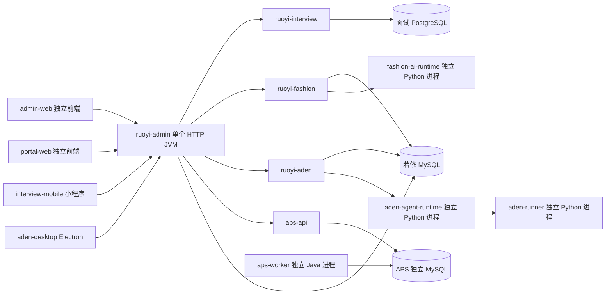

# 工程按技术类型归档架构

> 文档类型：共享工作区目标架构  
> 文档状态：Draft  
> owner：共享工作区工程  
> 批准依据：2026-09-25 用户认可 Java、前端、小程序、Python 四类工程归档方案，并要求形成架构文档  
> 创建时间：2026-09-25  
> 更新时间：2026-09-25  
> 适用范围：工程模块、进程、调用和数据边界；迁移任务与验收见[迁移设计](工程按技术类型归档设计.md)

## 架构决定

工作区按技术类型设置四个活跃工程根目录：`ruoyi-backend/`、`frontend/`、`miniapp/`、`python/`。`ruoyi-backend/` 使用当前 `platform-backend/` 的实现作为主体，由其 Maven 父 POM 管理所有活跃 Java 模块。上游若依后端代码只用于参考，保存在 `ruoyi-backend/_reference/ruoyi-original/`，不作为第二个后端入口。

“统一管理 Java 后端”包含源码聚合、构建和 HTTP 服务入口三个层面。面试、选品、Aden、APS API 作为若依 Maven 子模块由 `ruoyi-admin` 组合进一个 Spring Boot JVM；默认启用、逐项关闭及依赖前置条件遵循[Java 业务模块统一装配](Java业务模块统一装配.md)。APS 求解 Worker 仍是同一 Java 聚合工程中的独立进程，用于隔离 OR-Tools 原生库与重计算资源。Python Runtime、Electron 和各前端也继续独立运行；工程目录不会改变部署进程边界。

## 工程视图

```text
java-workspace/
├─ ruoyi-backend/                         # 唯一活跃 Java Maven 聚合根
│  ├─ pom.xml
│  ├─ ruoyi-admin/                        # Spring Boot HTTP 入口
│  ├─ ruoyi-common/
│  ├─ ruoyi-framework/
│  ├─ ruoyi-system/
│  ├─ ruoyi-quartz/
│  ├─ ruoyi-generator/
│  ├─ ruoyi-interview/                    # 面试业务 Java
│  ├─ ruoyi-fashion/                      # 智能选品业务 Java
│  ├─ ruoyi-aden/                         # 智能体桌面端控制面 Java
│  ├─ aps/                                # 排产业务 Java 聚合模块
│  │  ├─ aps-domain/
│  │  ├─ aps-application/
│  │  ├─ aps-infrastructure-mysql/
│  │  ├─ aps-solver-contract/
│  │  ├─ aps-constraint-validator/
│  │  ├─ aps-solver-ortools/
│  │  ├─ aps-api/
│  │  └─ aps-worker/                       # 独立 Java 进程入口
│  ├─ bin/
│  ├─ sql/
│  └─ _reference/ruoyi-original/         # 原 ruoyi-backend 上游原文
├─ frontend/
│  ├─ admin-web/                          # 共享若依管理端
│  ├─ portal-web/                         # 面试门户
│  ├─ desktop/aden-desktop/               # Electron 桌面端
│  ├─ packages/interview-contracts/      # 前端共享 TypeScript 包
│  └─ _reference/
│     ├─ ruoyi-vue3-frontend/            # Vue 3 上游基线
│     └─ ruoyi-ui/                        # 现有平台旧 UI 参考
├─ miniapp/
│  ├─ interview-mobile/                   # 现有面试 mobile 工程
│  └─ _reference/ruoyi-app/               # 移动端上游基线
├─ python/
│  ├─ fashion-ai-runtime/
│  ├─ aden-agent-runtime/
│  └─ aden-runner/
├─ contracts/                             # 跨语言 API / 事件契约
├─ prototype/                             # 原型，不代表生产能力
├─ scripts/                               # 跨工程脚本
└─ 文档/                                  # 人读事实源
```

`_reference/` 仅供上游比对，不参与 Maven reactor、活跃前端 workspace、部署或业务功能修改。旧若依后端原文可能自带 `ruoyi-ui/`，它属于整体上游快照；活跃前端只有 `frontend/` 中非 `_reference` 的工程。`contracts/` 作为跨语言事实源保持仓库根目录，不复制到 Java 或前端目录。

## 运行与调用视图



此图表达职责和部署边界，不表示所有可选运行时在默认启动时已经联机。`ruoyi-admin` 是唯一共享 HTTP 后端入口；各前端分别启动、分别构建。APS Worker 的启动与停止独立于 `ruoyi-admin`，若依模块开关只控制其 JVM 内的业务 API 和组件；不能以 `aps.enabled=true` 推断 Worker 正在运行。

## 模块、数据与信任边界

| 边界 | owner 与规则 |
|---|---|
| 若依平台 | `ruoyi-admin` 组合 Spring 配置，`ruoyi-system` 等维护账号、认证、角色、菜单和权限；平台数据由若依 MySQL 承载。 |
| 面试业务 | `ruoyi-interview` 拥有面试 Java 规则；业务事实由 PostgreSQL 承载，与若依用户只用稳定标识关联，不建跨库外键、`JOIN` 或事务。 |
| 智能选品 | `ruoyi-fashion` 和 MySQL 持有正式商品、库存、价格、报价及写入；`fashion-ai-runtime` 提供 AI 计算能力，不直接拥有正式业务数据库。 |
| Aden | `ruoyi-aden` 是任务、审批和审计的中心控制面；Python Runtime、Runner 和 Electron 不持有第二套权威状态。 |
| 生产排产 | APS API 与 Worker 共享明确的排产业务契约和独立 APS 数据源；Worker 单独调度求解，隔离原生库与资源消耗。 |
| 公共契约 | `contracts/` 保持 API 和事件机器契约的跨语言位置，移动工程时更新消费者相对引用，不重定义字段或版本语义。 |

前端和 Python 进程调用 Java 接口仍需沿用现有认证、授权与校验；目录同层不赋予跨模块权限。各运行时的 Secret 仍从原有环境机制加载，不写入目录迁移脚本、文档或锁文件。模块开关缺省启用是装配意图，不保证业务数据库、schema 或外部 Provider 已准备。

## 依赖、部署与恢复

Java 构建从 `ruoyi-backend/pom.xml` 进入；前端、小程序和三个 Python 工程各有自己的包管理与启动入口。一次开发环境启动通常需要一个 `ruoyi-admin` 后端及所需的多个前端进程；实际需要 AI Runtime 或排产求解时再按各项目运行说明启动对应独立进程。数据库迁移和真实外部调用仍遵守各业务项目的专项设计，目录重组不授权自动执行。

迁移需要保存所有未提交内容和上游原文，更新受路径影响的 Maven、脚本、CI、代理、工作区配置和文档链接。若新目录无法构建或有文件丢失，按[迁移设计中的旧新映射与恢复步骤](工程按技术类型归档设计.md#目标目录与迁移映射)恢复原目录及其路径消费者。目录改动不改数据库 schema，因此恢复重点是文件原文、配置路径和启动入口；若实施中发现数据或公共 API 变化，须重新评估并独立设计。

