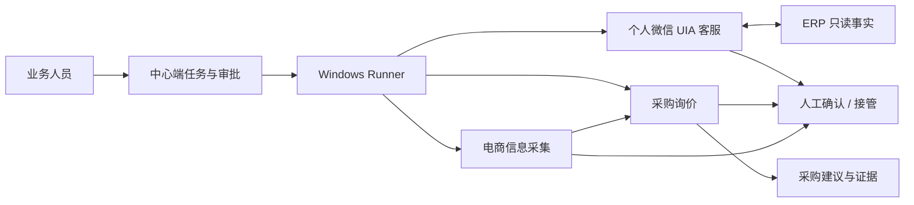
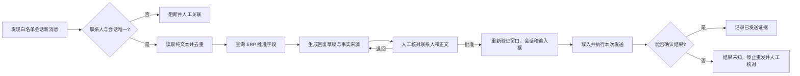
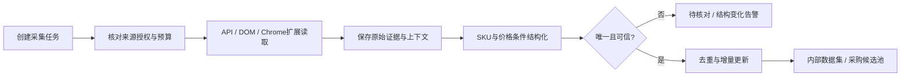
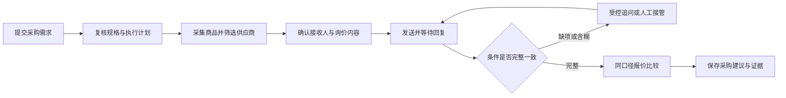

# Aden 桌面智能执行平台产品需求文档

> 文档类型：PRD；版本：3.0.0；文档状态：Draft  
> owner：用户负责产品方向；Codex 负责本轮候选规格与验证边界  
> 创建 / 更新：2026-09-11  
> 风险等级：L3；原因是个人聊天数据、对外发送、平台账号和网站访问控制均可能产生真实外部影响  
> 上游：[控制页与用户决定](../README.md)、[采购专项调研](../调研/采购专题调研.md)、[行业机会研究](../调研/2026-09-11-行业机会调研.md)、[原始 Word](../原始需求/智能体桌面端原始需求-第一版.docx)  
> 下游：[桌面执行底座技术设计](../功能/FEAT-ADEN-001-桌面执行底座/技术设计.md)、[历史架构候选（非当前基线）](../归档/架构/基于Python的多智能体架构候选.md)、[现有采购原型设计](../原型/采购询价原型设计.md)、[采购交互原型](../../../../prototype/business-suite-v1/02-agent-desktop-execution/sourcing-v2/index.html)、[实际验证](../原型/采购询价原型验证记录.md)  
> 内容边界：本文件是三模块产品候选基线。采购原型已经完成本地示例验证；个人微信和新一代电商采集尚未实现或联机验证，文中的指标均是未来退出条件，不表示已经达到。

## 1 产品结论

Aden 是面向企业业务人员的 Windows 桌面智能执行平台。它不是一个任意模仿点击的通用机器人，而是“一套可审计执行底座 + 三个有明确业务结果的能力包”：

1. **个人微信客服连接器（实验轨）**：通过 Windows UI Automation（UIA）读取受控会话、结合 ERP 资料生成回复，并在发送前完成目标和内容复核。它用于验证既有个人微信业务场景，不宣称获得腾讯授权，也不承诺长期无人值守或零账号限制。
2. **采购询价助手（产品轨）**：整理采购需求、搜索商品和供应商、生成并审核询价、处理回复、比较报价，最终交付有来源的采购建议。
3. **电商信息采集（产品轨）**：通过官方接口、浏览器 DOM 或经批准的 Chrome 扩展采集商品、SKU、价格条件、店铺和库存等只读数据，形成可回查的数据资产，并向采购询价模块提供候选。

三条轨道共用任务中心、Windows Runner、连接器、人工审批、证据、权限、限额、熔断与 ERP 接口。每项能力必须按“实验中 → 已验证 → 可试点 → 可生产”独立晋级；某个客户端版本或某个站点验证通过，不能自动外推到所有版本、账号和平台。

产品形态为中心端工作台加专用 Windows 执行端。中心端负责任务、策略、审批、审计和结果；执行端负责在指定用户会话中调用 API、浏览器 DOM 或 UIA。关闭工作台不能造成任务或证据丢失；执行电脑离线时，依赖该电脑的步骤进入等待或人工处理，不能伪称仍在执行。

### 1.1 UIA、控件树与“讲述人”的准确含义

UIA 是 Windows 提供的无障碍自动化框架，不是微信插件。应用如果把界面元素暴露给 UIA，客户端可以在层级化的 **UI Automation Tree（控件树）** 中读取元素属性、监听事件，并通过控件支持的 Pattern 执行输入、选择或调用。微软也将屏幕阅读器和自动化测试工具列为 UIA 客户端的典型用途，详见 [UI Automation Clients Overview](https://learn.microsoft.com/en-us/windows/win32/winauto/uiauto-clientsoverview) 与 [UI Automation Tree Overview](https://learn.microsoft.com/en-us/windows/win32/winauto/uiauto-treeoverview)。

Windows 讲述人是使用无障碍信息的一个系统工具，但“讲述人能读到”不等于 Runner 能取得稳定、唯一、可操作的 UIA 节点。Aden 的验收依据必须是 Runner 实际取得的 `AutomationId`、`ControlType`、`Name`、层级、事件和 Control Pattern；讲述人结果只作为诊断线索，视觉识别只作读取兜底，不能据此决定收件人或完成发送。

## 2 用户与问题

### 2.1 目标客户与角色

首批客户候选是已经在 Windows 上运行微信、ERP、电商网站和表格的中小企业，包括包装礼品商贸、服装面辅料与轻制造供应链、采购代理和自有电商运营团队。当前尚无足量客户访谈，客户规模、使用频率和付费意愿仍须通过试点验证。

| 角色 | 需要完成的工作 | 可做的主要动作 |
| --- | --- | --- |
| 客服执行人 | 处理白名单业务会话、查询 ERP、回复常见问题 | 查看受权会话、审核草稿、逐条发送、接管与纠错 |
| 客服主管 | 管理话术、敏感意图、服务质量与异常 | 配置业务规则、复核承诺类消息、查看脱敏审计 |
| 采购执行人 | 创建需求、整理候选、询价、完成报价比较 | 管理本人及明确共享的任务，审核询价与采购建议 |
| 采购主管 | 审查约束、异常和采购建议 | 复核偏离约束的结果、配置部门模板和限额 |
| 采集运营 | 配置批准来源、字段和采集计划 | 预览采集、处理结构变化、导出和关联采购任务 |
| 工作空间管理员 | 管理成员、连接、执行电脑和数据规则 | 配置最小权限；管理员身份不自动获得全部聊天和采购内容 |
| 审计 / 只读协作者 | 检查被授权结果与证据 | 查看指定任务，不发送、不扩大访问范围 |

现有采购原型采用“采购执行人兼管理员”的演示身份。角色切换、真实身份认证和服务端权限是生产实施内容，不能以隐藏按钮代替。

### 2.2 三类核心问题

- **客服割裂**：客户问题在个人微信，商品、库存、订单和售后事实在 ERP；人工需要复制、搜索和重写，容易错联系人、错商品或作出超权限承诺。
- **采购割裂**：采购人员反复切换商品页、聊天和表格；挂牌低价常对应不同 SKU、数量或税运条件；供应商回复缺少结构化证据。
- **采集不可复用**：一次性复制商品信息没有 SKU、地区、登录态、促销条件和采集时间，无法做趋势、复核或稳定输入采购流程；页面变化又会让脚本静默取错字段。

这些痛点来自用户既有实践、当前产品设想和流程分析，尚未通过足量样本量化。试点必须先记录人工处理时间、错误类型、数据完整度和平台异常基线，不能预先声称固定节省比例或绝对不触发限制。

### 2.3 市场位置与产品差异

Accio Work 已覆盖相似采购流程，1688 AI 版也公开描述采购 Agent 工作台。Aden 的待验证差异是：把国内企业已有的 ERP、受控桌面客户端和网页数据放进同一任务证据链；使用可复算全成本、字段原文、逐对象审批和人工接管，而不是只展示模型答案。采购竞品事实与边界见[专项调研](../调研/采购专题调研.md)。

个人微信 UIA 是技术上可试验、平台允许性未确认的连接器，不应作为“低封号”卖点。微信个人账号规范对未经腾讯授权的第三方软件、插件、外挂或系统登录、使用服务设有限制，详见 [微信个人账号使用规范](https://weixin.qq.com/cgi-bin/readtemplate?lang=zh_CN&t=page/agreement/personal_account)。正式无人值守客服应并行保留迁移至微信客服、企业微信或其他官方接口的路线。

## 3 范围、优先级与版本取舍

### 3.1 V3 P0：三条可独立验证的最小闭环

**模块 A：个人微信客服连接器（Experimental）**

1. 固定微信客户端版本和专用 Windows 测试机，读取白名单一对一会话的纯文本新消息。
2. 识别联系人、会话、消息方向和时间，去重并关联 ERP 客户或订单；重名或关联不唯一时阻断。
3. 调用 ERP 只读接口取得库存、订单进度、商品资料等批准字段，生成带事实来源的回复草稿。
4. 展示实际账号、联系人、正文、附件与引用事实，逐条人工确认后写入输入框并发送；发送后回读会话，未知结果不自动重发。
5. 支持暂停、人工接管、用户键鼠抢占检测、版本 / 控件树指纹变化熔断和脱敏审计。
6. 仅当离线故障验证和小范围受监督真实验证分别通过后，才允许标为“该环境已验证”；仍不得宣传平台授权或零账号限制。

**模块 B：采购询价助手（Beta candidate）**

1. 结构化采购需求和可复核的自然语言解析结果。
2. 单一授权平台的商品采集、用户手工补充、候选池、供应商身份和规格预算筛选。
3. 首次询价草稿、逐接收人预览确认、发送状态回读、商家人工 / AI 客服回复和有界追问。
4. 报价条件提取、冲突与缺失标记、统一口径比较、采购建议快照和证据回查。
5. 任务暂停、停止、人工接管、断点恢复、预算期限、真实权限和敏感信息保护。

**模块 C：电商信息采集（Beta candidate）**

1. 来源清单、域名 / 路径 / 账号 / 字段 / 频率 / 每日数据量的批准与版本化。
2. 官方 API 优先；网页有 DOM 时使用 Playwright 或 Manifest V3 Chrome 扩展读取；UIA 和视觉不作为网页采集首选。
3. 采集商品、SKU、店铺、规格、标价与促销原文、币种、库存文本、地区 / 登录态上下文、来源 URL 和时间。
4. 保存原始快照或必要证据、结构化字段、解析器版本和哈希，支持去重、增量更新、异常分布检测和变更报告。
5. 遇到`403`、验证码、登录失效、明确自动化阻止、站点指纹大幅变化或权限不明时立即熔断；单次`429`只按下述公开等待规则处理，持续限流则熔断，均不自动对抗。
6. 采集结果可进入采购候选池；未明确 SKU、价格类型或适用条件的数据只能进入待核对区。

### 3.2 共用 P0 底座

1. 多工作空间任务中心、步骤状态机、优先级、租约、心跳和执行电脑管理。
2. API → 浏览器 DOM / Chrome 扩展 → Windows UIA → 受限视觉读取的分层执行器；结构化能力失败后不得自动降级为视觉发送或写入。
3. 对外发送、表单提交、敏感数据传输的最终审批，审批绑定目标、正文、附件、对象、数量 / 金额和工作流版本。
4. 写前记录、幂等键、权威回查、`OUTCOME_UNKNOWN`、人工复核和全局 kill switch。
5. 工作空间 / 任务 / 账号隔离、最小权限、凭证引用、证据脱敏、留存删除、审计与数据导出控制。
6. ERP / 商品主数据只读连接器；任何写入、库存调整、订单确认或退款均需另立范围。

### 3.3 P1 候选

企业微信 / 微信客服官方接口、多平台授权连接、历史供应商复用、定期复询、行业模板、报价版本提醒、团队分工、Excel 导入导出、采集数据趋势和质量看板、ERP 受控草稿回写。每新增应用或平台均验证读取、身份、发送 / 提交、回执、限额、版本变化和恢复能力，不能凭“浏览器或讲述人可访问”直接勾选支持。

### 3.4 明确不纳入

- 自动加好友、拉群、群发营销、朋友圈、自动登录、红包、转账及个人微信全量监听。
- 绕过验证码、MFA、登录、付费、访问限制或反自动化措施；代理轮换、指纹伪装、stealth 插件、未公开协议和伪装人工节奏。
- 电商刷浏览、加购、收藏、评价、私信、改价、下单及未经批准的全站规模采集。
- 自动下单、支付、付定金、签约、确认成交、退款、法律承诺和无限自动谈判。
- 通用 RPA 流程设计器、任意代码或插件下发、Agent 市场，以及全行业多币种税务与国际贸易决策。

第三项的“低风险”来自减少请求、使用批准来源、缓存复用、按平台规则限频和遇阻停止，不来自模仿真人规避识别。本 PRD 不设计或验收反检测能力。

## 4 总体业务设计

### 4.1 一套执行底座，三个能力包

中心端拥有业务状态和授权；Runner 只执行版本固定、能力受限的任务包。模型负责分类、抽取、草稿和计划建议，不直接获得任意桌面、文件、网络或凭证权限。页面、聊天、商品描述和附件都是不可信输入，其中出现的“打开文件”“忽略规则”“发送资料”等文字不能扩大任务权限。

Windows Runner 拆成两个进程：Session 0中的低权限 Service Supervisor负责设备身份、仅出站mTLS连接、租约、看门狗、会话进程和签名更新；目标用户交互会话中的Session Agent负责浏览器、UIA和键鼠。两者通过带ACL的本机IPC通信。Microsoft说明Windows服务不能直接与用户交互，推荐服务通过IPC与用户会话应用协作，见[Interactive Services](https://learn.microsoft.com/en-us/windows/win32/services/interactive-services)。

每个交互桌面同一时间只有一个writer。Session Agent在每个可能产生UI输入的动作前，使用本机单调时钟复核短租约、fencing token、本地独占mutex和kill switch；中心端只有取得旧交互进程 / Windows会话的操作系统级终止确认，或隔离机制能够证明旧进程不可恢复且恢复前必定清理，才把同一业务对象交给新writer。网络隔离、心跳超时或等待宽限期本身都不是停止证明；证明不可得时不启动新writer，并把可能在途的动作保持为`OUTCOME_UNKNOWN`。UIA目标系统不会校验fencing token，因此云端租约本身不能阻止失联旧进程继续点击。

Runner首次注册取得不可导出的设备证书；控制通道只由Runner出站建立。任务包包含租户、设备 / 机器池、工作流版本、能力清单、对象、nonce、序列号、签发 / 过期时间和签名，Runner验证防重放后才接收。更新包校验发布清单签名、哈希和Windows代码签名，按实验机→小批量→全量灰度，启动 / 心跳或核心指标异常时自动回滚；控制面可吊销设备证书和版本并触发kill switch，不下发任意脚本。

执行层固定按以下顺序选择：

1. 官方 API、ERP API、邮件 API 或平台连接器。
2. 浏览器 DOM：Playwright 或经批准的 Chrome 扩展。
3. Windows UIA：仅用于已认证版本的桌面客户端。
4. 视觉 / OCR：只用于读取、异常解释或提出定位候选；P0 不用于最终发送、提交、授权或交易动作。

### 4.2 模块 A：个人微信客服闭环

客服业务 Case 与渠道连接器分开建模：问题分类、ERP事实、回复策略、人工升级、等待客户、解决和结案不依赖个人微信；“个人微信 UIA”只是首个 Experimental 渠道适配器。未来改用微信客服、企业微信或其他官方接口时，复用同一客服业务流程和证据对象，只替换渠道能力与限制。

客服任务的最小业务对象是“账号 + 白名单联系人 / 会话 + 消息游标 + ERP 客户或订单关联 + 回复版本”。P0 只支持一对一纯文本；图片、语音、视频、小程序卡片、群聊和文件自动处理均不进入核心成功率。

回复按风险分级：普通资料和进度信息可生成草稿；价格变更、退款、赔付、交期承诺、账号信息、合同与敏感附件必须标为高风险并交主管处理。发送授权绑定实际账号、联系人、正文、附件哈希、引用事实和有效时限；任一项变化后原批准失效。

用户在电脑上发生键鼠输入、远程会话切换、微信升级、控件树指纹变化、窗口被抢占、重名联系人或多个输入框命中时，Runner 在安全点暂停。UIA 失败不能自动改用坐标或视觉点击发送。

### 4.3 模块 B：采购询价闭环

采购模块把采集模块给出的候选、用户手工资料和既有供应商库合并为任务候选，再完成询价、缺项追问和同口径报价比较。商品页面上的挂牌价不是正式报价；商家人工客服和 AI 客服只是不同的回复来源，不改变字段校验和采购承诺边界。

现有采购原型完整演示该闭环，但不包含真实平台、账号、模型、Runner 或后端。其详细流程、金额规则和验收条件在后续章节继续维护。

### 4.4 模块 C：电商信息采集闭环

Chrome扩展采用Manifest V3：内容脚本只在允许页面读取DOM，Service Worker负责事件和消息转发，必要时经Native Messaging与本机Runner交换已校验的结构化消息。不注入远程代码，不保存账号密码，不把页面指令当成Runner指令。三种网页执行模式分别认证，不能用一种模式的通过证明另外两种：

| 模式 | 权限与运行方式 | 适用场景 | 独立认证边界 |
| --- | --- | --- | --- |
| `attended-activeTab` | 用户点击扩展后取得当前页临时权限 | 首版低风险的“打开商品页→采集当前页” | 浏览器profile、账号、工作空间、当前tab和用户手势 |
| `managed-host_permissions` | 管理员批准固定域名 / 路径权限，由内容脚本和Service Worker处理 | 已批准站点的任务化读取 | 扩展ID / 版本、浏览器profile、账号、域名策略、设备和工作空间 |
| `playwright-managed-browser` | Runner启动独立受管浏览器和profile，使用DOM locator | 批量但有预算的授权网页流程 | Runner、浏览器版本、profile、账号、站点解析器和工作空间 |

P0先交付`attended-activeTab`，任务化采集必须另行通过后两种模式之一的认证。Native Messaging只在实际启用时验收；消息除Chrome校验的`allowed_origins`外，还绑定`extension_id + extension_version + browser_profile + device_id + workspace_id + task_id + nonce + sequence + expires_at`，由Native Host复核签名 / MAC和防重放。每种模式使用自己的故障矩阵，不适用项明确记`N/A`而不是Fail或伪造Pass：

| 模式 | 必测生命周期与故障 |
| --- | --- |
| `attended-activeTab` | 用户手势 / 临时权限失效、当前tab关闭或跳转、Service Worker回收、扩展更新 / 禁用；启用Native Messaging时再测Native Host和消息防重放 |
| `managed-host_permissions` | 主机权限撤回、Service Worker回收、扩展更新 / 禁用、浏览器 / tab关闭或跳转；启用Native Messaging时再测Native Host、身份绑定、重复 / 乱序 / 重放 |
| `playwright-managed-browser` | Runner或浏览器进程崩溃、profile错绑、locator / 模板失效、跨域跳转、上下文泄漏、重复 / 乱序任务；扩展和Native Messaging项目记`N/A` |

上述故障都必须产生可解释的部分结果或失败状态，不能静默完成，也不能跨profile、设备或工作空间恢复。

Chrome官方说明内容脚本可读取页面DOM，`activeTab`是用户手势获得的临时主机权限，原生通信需由扩展页或Service Worker转发，详见[Content scripts](https://developer.chrome.com/docs/extensions/develop/concepts/content-scripts)、[chrome.scripting](https://developer.chrome.com/docs/extensions/reference/api/scripting)、[Manifest V3](https://developer.chrome.com/docs/extensions/mv3/manifest)与[Native messaging](https://developer.chrome.com/docs/extensions/develop/concepts/native-messaging)。

采集任务必须固定平台、域名、路径、数据字段、地区、登录状态、账号授权、请求频率、每日上限和保留用途。采集到的价格区分标价、会员价、券后价、阶梯价、结算价及其适用条件；无法确认时保留原文，不合成一个虚假的“最低价”。内部使用不自动取得公开发布、转售或训练数据的权利。

### 4.5 三模块之间的关系

- 采集模块向采购模块提供候选商品、SKU、页面条件和来源证据；采购模块产生正式询价和报价，不回写页面挂牌价为供应商承诺。
- 微信客服模块可查询同一 ERP 的商品、库存、订单或售后状态，但默认不能查看不相关采购报价、其他客户会话或完整后台。
- 三个模块共享供应商 / 商品主数据时仍保留来源、工作空间和授权边界，不能因为名称相同自动合并身份。
- 每个能力包可独立停用、升级和撤权；个人微信连接器受限或停用时，不应影响采购数据和网页采集任务。

## 5 模块 B：采购询价助手详细流程

### 5.1 创建与复核

入口为工作台“新建采购任务”。用户可以输入自然语言或直接填写表单。系统提取商品、数量、规格、预算、目的地和时间要求，将无法确定的项目标为待补充，不凭模型补造默认事实。

保存草稿不启动采集。复核页显示最终约束、候选数量、目标平台、联系范围、是否允许自动追问、截止时间和预计会使用的信息。用户确认后冻结本次需求版本。执行后改规格、数量或发送边界，需要生成新版本，旧候选和报价重新校验适用性。

原型的自然语言解析为本地规则演示，不能标为真实模型理解。结构化表单必须可独立完成创建。

### 5.2 商品与供应商筛选

系统整理商品标题、规格、页面价格及其条件、店铺身份、商品来源和读取时间。每条候选显示“符合 / 不符合 / 信息不足”以及原因。关键词相似不等于规格相同；商品图片不能独自证明材质或认证。

同一店铺同一规格重复商品可合并展示，但保存原始来源；同一供应商不同规格不能合成一份报价。工厂身份、认证和信誉均保留“平台展示 / 供应商自述 / 已审核资料”等来源，未知时不赋予认证标识。

用户可以筛选、选择、排除并写原因，也能手动补充商品。无结果时提供调整关键词、放宽明确约束或手动补充的入口，不能自动放宽硬约束。

### 5.3 询价与等待

为每个选中供应商生成独立会话，询价内容绑定采购需求版本、商品 / SKU、采购数量、目的地和需确认字段。首次询价展示店铺及具体接收对象、平台、正文、附件和信息范围，由用户确认后发送。

系统在实际通道接受或观察到平台对应状态后标记已发送；没有证据时保持“发送中”或“结果未知”。已发送不等于送达、已读或商家接受。等待商家期间保留会话和任务，释放不必要的桌面交互资源。

待回复视图显示已收集字段、未回答问题和下一跟进时间。自动跟进属于任务范围内单独可配置能力，不能因为首次询价已确认而无限外发。

### 5.4 对端 AI 客服与多轮追问

对端身份使用“平台标明 AI / 商家人工 / 未知”，无法确定时不伪造识别结果。提取“约 10 天”“一般包邮”“价格详询”等条件性说法，保留原话并明确待核实条件。

如果对方漏答税费、运费或交期，生成具体追问；如果重复相同模板、要求转人工、答非所问或给出矛盾价格，优先请求商家人工确认或进入用户接管。不得因客服自动回复了一条消息就把字段完整率提高到 100%。

对方提出改规格、订金、订单、合同、账户信息或未经批准的附件要求时，交给用户处理，不以自然语言“好的”代替采购承诺。

### 5.5 比较与交付

系统按统一数量、SKU、币种、税口径、收货地和费用项目展示报价。完整且符合约束的报价参与推荐；缺项、过期、超 MOQ 或条件不明的报价保留可见并说明不可比原因。

用户可按预计总成本和交期排序，点开每个字段回看供应商原话。最终选择保存为“采购建议”，包含所选报价版本、理由、未满足项和生成时间，供采购人员后续确认交易。导出不得显示“订单已确认”或“采购已完成交易”。

## 6 需求清单与可观察验收

P0 表示进入对应模块验证所需的最小能力，不表示三个模块必须同时上线。“现有原型覆盖”仅指采购模块有相应本地交互；实际结果见[验证记录](../原型/采购询价原型验证记录.md)。

### 6.1 共用底座需求

| REQ | 优先级 | 能力 | 对应 AC |
| --- | --- | --- | --- |
| CORE-01 | P0 | 版本化任务、步骤状态、租约、心跳、暂停 / 停止 / 接管 | CORE-AC-01、02 |
| CORE-02 | P0 | API、DOM、UIA、视觉来源分级和能力探测 | CORE-AC-03 |
| CORE-03 | P0 | 审批与动作哈希绑定，写前复核、幂等和权威回查 | CORE-AC-04、05 |
| CORE-04 | P0 | 账号、工作空间、任务和执行会话隔离 | CORE-AC-06 |
| CORE-05 | P0 | 最小权限、凭证代理、脱敏证据、留存删除和审计 | CORE-AC-07 |
| CORE-06 | P0 | 限频、资源预算、工作流 / 账号级熔断和全局 kill switch | CORE-AC-08 |
| CORE-07 | P0 | Service Supervisor / Session Agent分进程、本地租约、桌面独占和失联隔离 | CORE-AC-09 |
| CORE-08 | P0 | 设备注册、仅出站mTLS、签名任务包、防重放、证书吊销和灰度更新回滚 | CORE-AC-10 |
| CORE-09 | P0 | 一次性批准的原子占用、不可变动作意图、Outbox和崩溃回查 | CORE-AC-11 |

### 6.2 模块 A：个人微信客服需求

| REQ | 优先级 | 能力 | 对应 AC |
| --- | --- | --- | --- |
| WX-01 | P0 | 固定版本能力探测和 UIA 控件树认证 | WX-AC-01、02 |
| WX-02 | P0 | 白名单一对一纯文本新消息识别、游标和去重 | WX-AC-03 |
| WX-03 | P0 | 联系人、会话与 ERP 客户 / 订单的唯一关联 | WX-AC-04 |
| WX-04 | P0 | ERP 只读查询、事实引用、回复草稿和敏感意图分级 | WX-AC-05 |
| WX-05 | P0 | 逐条确认、发送前重新校验、回读和结果未知处理 | WX-AC-06、07 |
| WX-06 | P0 | 用户输入抢占、窗口变化、升级及账号异常熔断 | WX-AC-08、09 |
| WX-07 | P0 | 聊天最小采集、日志脱敏、人工接管与可解释证据 | WX-AC-10 |

### 6.3 模块 B：采购询价需求

| REQ | 优先级 | 能力与来源 | 对应 AC |
| --- | --- | --- | --- |
| PUR-01 | P0 | 草稿、解析与复核；用户需求、FIND-02 | PUR-AC-01、02 |
| PUR-02 | P0 | 商品采集、来源与候选；FIND-02、03 | PUR-AC-03、04 |
| PUR-03 | P0 | 供应商与会话绑定、去重；FIND-03 | PUR-AC-05 |
| PUR-04 | P0 | 首次询价与确认发送；FIND-04 | PUR-AC-06、07 |
| PUR-05 | P0 | 等待、缺项追问与对端 AI；FIND-05 | PUR-AC-08、09 |
| PUR-06 | P0 | 报价核验与可复算比较；FIND-03 | PUR-AC-10、11、12 |
| PUR-07 | P0 | 采购建议快照及导出；FIND-03 | PUR-AC-13 |
| PUR-08 | P0 | 暂停、接管、停止与恢复；FIND-04 | PUR-AC-14、15、16 |
| PUR-09 | P0 | 连接能力、登录、电脑状态；FIND-04 | PUR-AC-17 |
| PUR-10 | P0 | 权限、数据与执行边界；FIND-04 | PUR-AC-18、19 |
| PUR-11 | P0 | 任务与会话持久性、版本、审计；FIND-04 | PUR-AC-07、13、15、20 |
| PUR-12 | P0 | 桌面可用性、反馈和异常可恢复 | PUR-AC-21、22 |
| PUR-13 | P1 | 行业模板与历史复询；客户研究假设 | 扩展规格另定，不占用首版验收编号 |

### 6.4 模块 C：电商信息采集需求

| REQ | 优先级 | 能力 | 对应 AC |
| --- | --- | --- | --- |
| COL-01 | P0 | 来源目录、授权目的、字段、域名路径、账号、频率和数据量版本化 | COL-AC-01 |
| COL-02 | P0 | API 优先、DOM / Chrome 扩展读取及能力来源标记 | COL-AC-02 |
| COL-03 | P0 | 商品、SKU、店铺、价格、促销、库存和上下文结构化 | COL-AC-03、04 |
| COL-04 | P0 | 原始证据、解析器版本、哈希、去重、增量与变更记录 | COL-AC-05 |
| COL-05 | P0 | 页面结构与数据分布异常检测、待核对和解析器停用 | COL-AC-06 |
| COL-06 | P0 | `403` / 验证码等立即熔断，`429`公开等待、有界重试与持续限流熔断 | COL-AC-07、08 |
| COL-07 | P0 | 内部搜索、导出、采购候选关联和数据使用范围控制 | COL-AC-09、10 |
| COL-08 | P0 | 三种可选网页模式分别认证、扩展生命周期、Native Messaging绑定和防重放 | COL-AC-11 |

### 6.5 跨模块需求

| REQ | 优先级 | 能力 | 对应 AC |
| --- | --- | --- | --- |
| XMOD-01 | P0 | 采集记录进入采购候选后全链路保留来源、版本和撤权状态 | XMOD-AC-01 |
| XMOD-02 | P0 | 微信消息、ERP事实、策略、批准、外部动作与客服结案形成完整证据链 | XMOD-AC-02 |
| XMOD-03 | P0 | 连接器独立熔断、能力包隔离和离线Runner停止语义 | XMOD-AC-03 |
| XMOD-04 | P0 | 双Runner租约、乱序事件、批准单次消费和审计失败时关闭执行 | XMOD-AC-04 |

## 7 关键数据与输入约束

### 7.1 个人微信客服任务

| 字段 | 规则 |
| --- | --- |
| Windows / 微信环境 | 记录 Windows 版本、DPI、微信版本、进程路径、发布者签名、Runner 版本和 UIA 控件树指纹；任一认证关键项变化后转待复验 |
| 业务账号 | 仅引用已登记账号 ID 和用途，不保存微信密码、二维码或可复用登录材料；账号身份无法确认时不读取或发送 |
| 会话白名单 | 以可稳定识别的会话标识、展示名和 ERP 关联共同确认；只靠展示名或头像不能唯一确认 |
| 消息游标 | 保存会话、方向、可见时间、内容摘要、稳定标识或组合去重键；无法可靠划分消息边界时停止自动处理 |
| ERP 关联 | 客户、订单、商品等关系必须唯一或由人确认；只开放回复所需字段，不因会话存在而获得整个 ERP 权限 |
| 回复草稿 | 保存模型版本、引用事实、敏感意图、正文版本、附件哈希和生成时间；模型建议与 ERP 事实分别展示 |
| 发送批准 | 绑定账号、会话、联系人、正文、附件、引用事实和失效时间；目标或内容变化即失效 |
| 发送结果 | 区分已准备、待批准、执行中、结果未知、已出现在本方会话、失败、人工确认；“点击完成”不能单独证明送达 |

聊天内容属于高敏感业务数据。普通日志只保存任务号、步骤、脱敏标识、状态和错误类别；为诊断保存的截图与 UIA 树片段必须裁剪、加密、限权和限期，默认不把无关会话列表或聊天全文发送给模型。

### 7.2 采购需求

| 字段 | 规则 |
| --- | --- |
| 商品名称 / 任务名 | 必填，去除首尾空格，任务名 1–80 字；避免仅有标点 |
| 采购数量与单位 | 必填，正整数；原型上限 100,000；单位明确为件、个、米等，不跨单位直接比较 |
| 核心规格 | 材质、尺寸、颜色、工艺等可填；产品名不足以表达的规格必须在发出询价前确认 |
| 预算 | 首版输入“含税到货每件成本上限”，为硬约束，包含加工、包装、运费及本批固定费摊销；总上限为数量乘每件上限。缺费用时不能判断达标，不能以裸价符合替代整批预算符合 |
| 收货地 | 至城市的询价信息即可；完整地址和个人电话仅在明确需要及用户另行选择时外发 |
| 最晚交期 / 询价截止 | 最晚交货要求与询价截止分开，使用 Asia/Shanghai 日期与时刻；不能用“7 天”混写两者 |
| 候选供应商数量 | 默认 5 家，上限 10 家；上限为产品保护与原型范围，不代表平台允许该频率 |
| 目标可用报价数 | 默认 3 家，最少 1 家，不超过候选供应商数；与候选数量分开。达不到目标时只能显式选择部分结果结束 |
| 目标平台 | 仅选择连接能力已满足的真实平台；未接入平台只能使用手工资料或演示 |
| 跟进策略 | 是否自动补问、自动催问、轮数、时窗、截止；首次确认不等于全权代理 |

示例需求：1,000 件黑色纯棉圆领 T 恤，200g，胸前单色印花、独立包装，送杭州，确认含税单价、加工、包装、运费、MOQ、打样、交期起算和报价有效期。示例用于测试，不是已发生订单。

### 7.3 电商采集记录

| 字段 | 规则 |
| --- | --- |
| 来源与授权 | 平台、域名、路径、官方 API / 公开页面 / 授权后台、授权主体、允许目的、有效期和审核记录 |
| 页面上下文 | 原始 URL、最终 URL、采集时间、地区、币种、语言、登录状态类别、账号授权引用、浏览器和连接器版本 |
| 商品身份 | 平台商品 ID、店铺稳定 ID、商品标题、类目；ID 不可得时不得只以标题长期去重 |
| SKU 与规格 | SKU ID、销售属性及值、单位、包装、数量阶梯；不同 SKU 或地区版本分别保存 |
| 价格 | 原始显示文本、数值、币种、价格类型、适用数量、会员 / 优惠券 / 活动条件、税运口径和有效时间；结算价不可见时不得推测 |
| 库存与履约 | 原始库存文本、可售 / 缺货 / 未知、配送地区、预计时效；不把“有货”外推为任意地区可交付 |
| 证据 | 必要 DOM 片段、API 响应字段或脱敏截图的引用、内容哈希、解析器版本、字段来源层级和置信状态 |
| 质量状态 | 有效、待核对、结构变化、来源受限、过期、删除 / 撤权；异常数据不进入自动推荐 |

### 7.4 共用业务对象

| 对象 | 必须保留的关系与事实 |
| --- | --- |
| 工作空间 | 客户组织、成员、数据区域、留存策略、连接器、账号、执行电脑和共享边界 |
| 自动化任务 / 步骤 | 能力包、工作流版本、风险级别、业务幂等键、状态、租约、限额、审批和终态 |
| 连接与执行环境 | 能力来源、目标版本、授权范围、账号、Runner、Windows 会话、心跳、占用和认证状态 |
| 能力认证卡 | 目标软件 / 站点版本、账号类型、API / DOM / UIA能力、限制、金标集、证据、复核人、到期和失效条件 |
| 控制租约 | 任务、Runner、Windows会话、fencing token、控制权、心跳、交接版本和失效时间 |
| 批准 | 动作哈希、目标、正文 / 字段、附件、数量 / 金额、批准人、有效期、撤销和单次消费结果 |
| 外部动作 / Outbox / 回执 | 业务幂等键、写前记录、尝试、发送 / 提交状态、平台回执、权威回查和人工核对结果 |
| 身份映射 | 微信联系人、ERP客户 / 订单、供应商和平台账号之间的版本化映射、来源与人工决定 |
| ERP事实快照 | 值、权威系统、`asOf`、有效期、读取权限和用于哪一个草稿 / 决策 |
| 微信业务会话 | 业务账号、白名单联系人、消息游标、ERP 关联、控制权、版本和最小证据；不等同于导入全部个人聊天 |
| 采购任务 | 工作空间、负责人、需求版本、约束、状态、截止与执行限制 |
| 商品候选 | 任务版本、平台商品标识 / URL、SKU、参数、页面价格条件、采集时间、证据 |
| 来源策略 | 允许域名 / 路径、账号、字段、用途、频率、并发、数据量、留存、导出、有效期与撤权行为 |
| 采集任务 / 字段观察 / 数据集版本 | 来源策略、商品 / SKU、上下文、原文、解析器、字段质量、增量、发布版本和生命周期状态 |
| 供应商 | 平台店铺稳定标识、名称、地区、联系人和来源；跨平台身份合并须人工确认 |
| 会话 | 区分平台聊天线程与采购任务会话；任务会话绑定任务、供应商、商品、需求版本；同一平台线程可涉及多个任务，保存消息归属依据、对端身份来源及接管状态 |
| 消息 | 方向、正文、接收对象、会话游标、平台标识、时间、支持类型和事实 / 草稿关系；发送状态由外部动作对象维护 |
| 附件 | 类型、哈希、恶意内容扫描、敏感级别、隔离、批准、来源和生命周期；不随正文隐式获得发送权限 |
| 报价版本 | 对应需求和会话、每项费用、条件、有效期、原话、采纳 / 冲突 / 缺失状态 |
| 采购建议 | 所选报价快照、比较范围、规则版本、理由、未满足项、保存人和时间 |
| 执行记录 | 本次执行和步骤、使用的连接 / 电脑、前后状态、失败原因、人工动作与恢复检查点 |
| 删除墓碑 / 审计事件 / 事故 | 删除与撤权范围、不可复活标识、追加式动作事件、实际影响、处置、复验和关闭人 |

所有业务事实统一保留`value`、`rawValue`、`sourceType`、`sourceRef`、`observedAt`、`asOf`、`validUntil`、解析器 / 模型 / 策略版本、置信与复核状态、敏感级别、处理目的和工作空间范围。ERP权威事实、平台观察、供应商陈述、模型推断和人工确认不得混为同一来源等级。

## 8 模块 B 报价业务规则

### PUR-BR-01 页面价格与正式报价

页面挂牌价是发现候选的参考数据。必须同时展示适用数量、SKU、税费和采集时间。没有供应商对当前数量及规格的明确回复时，不标记为已确认报价。供应商原话的确认只表示其陈述，不表示 Aden 对库存、资质或交付的独立担保。

### PUR-BR-02 缺失与冲突

缺失金额保存为未知，不转为 0。0 必须来自明确“免费 / 已包含”及其来源。语义含糊、图片难辨或多个版本矛盾，均标为待确认。新报价保留旧版本；不能静默覆盖历史，也不能组合不同时间、不同规格的最低字段形成虚假报价。

### PUR-BR-03 比较条件

参加最低总成本推荐的报价必须对应同一需求版本及数量、SKU / 规格、计量单位、目的地、币种和税口径，满足 MOQ 和硬约束，且在有效期内。交期必须包含起算条件及“出货 / 到货”的语义。一个不符合硬约束的低价不应排名为推荐第一。

第一版只做人民币国内采购比较。币种、税口径不一致时显示不可比原因，不让模型自行推断汇率或税率。用户可以查看这些报价，但不能保存为已核验的推荐。

### PUR-BR-04 总成本

当各项目完整且口径一致时：

`本批预计总成本 = 数量 ×（商品单价 + 单件加工费 + 单件包装费）+ 本批运费 + 本批固定费用`

商品单价和单位费用使用最多6位定点小数保留来源精度，不先舍入到分；每个数量乘费用的行金额以十进制四舍五入到分，再汇总本批费用和总额。超出支持精度的输入明确拒绝或转人工确认，不静默截断。币种总额按人民币两位小数显示；税已在输入口径中一致处理，不默认额外加税。固定费用逐项标明是否计入本批。单独打样的费用单列，不自动摊入未确定的量产数量；抵扣条件必须有来源，未满足前不扣减。例：10,000个包装袋 × ¥0.035 = ¥350.00，不能将单价先改成¥0.04。

例：1,000 件，含税单价 ¥17，加工 ¥2，包装 ¥0.30，运费 ¥450，本批固定费 ¥100，则预计总成本为 `1000 × 19.30 + 450 + 100 = ¥19,850.00`，每件摊销 ¥19.85。若运费未知，展示已知成本 ¥19,400.00 加待询运费，不显示完整总成本和最低总价标签。

### PUR-BR-05 推荐与选择

首版不输出无解释的“综合最优评分”。展示最低可比总成本、最早满足条件的交期以及差异原因。用户可选择非最低价并填写理由。若后来改需求、报价过期或供应商修改价格，旧建议保留为历史快照并标记需重新核验；不能自动修改已保存建议。

## 9 共用自动化与采购沟通规则

### BR-AUTH-01 动作授权

发送、提交和敏感数据传输的批准必须绑定工作空间、账号、目标对象、正文 / 字段、附件哈希、数量或金额、工作流版本和有效时间。页面、聊天、附件或模型输出不能取得新权限；目标、内容或关键事实变化后原批准失效。

### BR-AUTH-02 一次批准的原子占用

最终动作不能先执行再消费批准，也不能先永久消费批准再丢失动作。中心端在同一数据库事务 / CAS中验证`APPROVED_ONCE`及版本，写入不可变Action Intent和Outbox，并绑定`claim_id + action_id + attempt_id + fencing_token`后转`CLAIMED`。`action_id`在整个逻辑动作中保持不变；`attempt_id`只在上一attempt被权威确认`NOT_OCCURRED`后递增，任一时刻最多一个有效attempt。Runner取得副作用执行许可时批准转`CONSUMED`，之后只能回查同一action，结果不明保持人工复核。

批准在`CLAIMED`后、进入`IN_FLIGHT`前过期或撤销时，中心端先冻结Outbox；只有Service Supervisor确认本机尚未跨过副作用边界，才能取消Outbox并转`EXPIRED` / `REVOKED`。无法证明尚未执行时，批准按已消费处理，外部动作进入`OUTCOME_UNKNOWN`。已经权威确认`NOT_OCCURRED`且动作内容、目标、环境和批准有效性仍未变化时，才可在同一`action_id`下创建下一attempt；否则必须重新批准。

### BR-LEASE-01 桌面写入租约

fencing token只对会校验它的中心端和API有效，不能单独阻止失联UIA进程。Session Agent在每次输入前检查本机单调时钟租约、桌面独占mutex、连接器状态和kill switch；Service Supervisor负责冻结 / 终止过期Session Agent。只有操作系统级确认旧交互进程 / 会话已终止，或隔离机制能够证明旧进程永不可恢复且恢复前必定清理，才允许新writer开始；断网、心跳超时、网络隔离或宽限期均不单独构成证明。无法排除重叠执行时不换writer，相关外部动作进入`OUTCOME_UNKNOWN`并等待人工处置。

### BR-EXEC-01 能力来源与降级

每一步记录使用 API、DOM、UIA、讲述人线索或视觉的哪一种来源。API / DOM / UIA 的失败不自动授权视觉或坐标完成写操作；视觉只能读取和提出候选，最终发送、提交、授权、交易与删除必须使用已认证的结构化执行路径。

### BR-SEND-01 发送前后校验

发送前重新核验实际账号、接收对象、当前窗口 / URL、正文、附件和批准哈希；无法唯一确认就阻断。发送后优先查询平台回执、消息历史或业务流水。已经发生可能有副作用的点击或请求但结果不可得时进入 `OUTCOME_UNKNOWN`，回查前不自动重放。

### BR-UIA-01 微信执行边界

微信 P0 仅使用固定环境中已经认证的 UIA 节点和 Control Pattern。UIA层级只用于定位，不能充当联系人身份。自动发送必须同时具备已登记的业务身份映射、当前会话稳定标识和可见名称的一致校验；客户端无法提供稳定会话标识时，只能生成 / 写入草稿，由用户在官方客户端确认发送。只靠坐标、头像、OCR文本或“名称相似”不得发送。检测到用户键鼠输入后，1秒内停止发起新的UI动作，在当前安全点交还控制权。

### BR-PRIVACY-01 最小数据

Runner 只读取批准窗口、页面、会话和字段。截图、DOM、UIA 树、模型输入、日志和导出遵守相同范围；采集到无关个人信息时立即丢弃或遮蔽。凭证使用引用和短期令牌，不进入模型、普通日志、命令行、浏览器 localStorage 或截图。

### BR-COLLECT-01 来源与访问控制

采集任务启动前核验来源清单及有效授权。API 返回、公开页面可见内容和授权后台分别标记，不因技术上能读取就认定可以长期保存、再分发或商业化。遇到拒绝访问、验证码、登录失效、协议变化或权限不明时停止该来源，不自动更换账号、代理、指纹或访问手法继续。

### BR-COLLECT-02 限流与缓存

按平台 / 域名、业务账号、工作空间、工作流和Runner设置令牌桶、并发上限、每日数据量和退避。使用增量更新、内容哈希、条件请求及结果缓存减少重复访问；遵守公开配额和`Retry-After`。默认策略为：单次`429`只有在响应给出可解析且不超过15分钟的`Retry-After`、来源授权仍有效时才进入`RATE_LIMITED`；30分钟窗口内最多执行2次只读重试。缺少有效等待时间、第三次`429`、累计等待超过30分钟或平台更严格规则被触发时，打开站点 + 账号维度熔断，须人工复核后恢复。`403`、验证码、账号限制和登录 / 权限变化立即熔断，不进入该重试路径。这些措施用于降低负载和错误，不用于模拟真人或对抗识别。

### BR-COLLECT-03 字段事实

页面标题、展示价格、库存、促销和 AI 推断分开存储。API、DOM 与视觉结果冲突时保持冲突状态，不能静默选最便宜的数值。SKU、规格、地区、币种、登录状态、价格类型和采集时间不完整时，不进入自动比较和采购推荐。

### PUR-BR-06 确认范围

首次联系按具体接收人和内容确认；编辑收件人、正文、附件或需求版本后原确认失效。允许批量复核清单，但每位接收人和外发内容都能独立检查、排除。拒绝记录理由，修改后产生新的待确认版本。

自动追问只补充该任务已要求的字段，不擅自披露预算上限、其他供应商报价、商业机密或完整个人地址。默认预算仅用于筛选，不直接写入供应商话术。新增议价、数量变化、替代规格和承诺均交给采购人员。

### PUR-BR-07 有界跟进

候选默认规则为每位供应商最多 3 轮补问、最多 2 次未回复提醒，仅在 09:00–18:00（Asia/Shanghai）进行；提醒间隔至少 2 小时，且不超出任务截止。平台实际限额更严时遵循平台限额。上述默认值可由主管在正式方案中调整，不构成平台许可声明。

P0 的轮次和时窗配置只授权“到时生成待审草稿”，不授权直接外发。每一轮追问或提醒都显示实际接收人和最终正文并单次批准；上一轮批准不能复用。未来若验证批量策略授权，须另定义允许模板、对象、次数、有效期、撤销和逐条审计，不由本规则默认开放。

无回复达到截止时标为超时未报价。用户可生成部分结果或延长任务；不能虚构回复、自动扩大供应商范围或把部分结果称为完整完成。

### PUR-BR-08 发送结果与重复

同一确认动作的重复点击、网络重试、客户端刷新不得重复发出消息。先回查平台消息标识或同会话可靠证据，再决定是否重试。只看到点击成功而没有可靠结果时，进入发送结果未知；该动作不自动重放。人工确认已发送后等待回复，确认未发送后才重新进入待发送。无法核实则继续等待人工。

### PUR-BR-09 人工控制

点击暂停、停止或接管后立即取消尚未开始的动作；已有外发在途时先显示“正在停止 / 正在交接”，禁止新自动动作，回读本次发送或进入结果未知，并向用户显示可能已发送的内容后再完成交接。不得通过立即显示“已暂停”掩盖在途外发。

人工接管完成后，Agent 不再控制该会话或桌面；用户明确交还后复核任务、账号、当前页面和未决动作再继续。停止是本次执行终态；恢复需求需创建新的执行实例，不能让晚到回复或旧任务自动复活。已发生的外发不能通过“停止”撤回，原消息证据保留。

### PUR-BR-10 等待与完成

任务状态与各供应商会话状态分开。一家待回复不影响其他授权会话推进；已完成报价持续可查。达到目标可用报价数或询价截止只进入待比较；用户保存采购建议或明确“以现有结果结束”并写原因后，任务才进入已完成。未达到目标的结果标为部分完成；没有可用报价时也允许以“无可用报价”结束并记录原因，不能强迫用户选择无效报价。进入已完成后取消尚未执行的跟进，晚到消息仅归档为新证据，不自动重开任务或改动已保存快照。

平台聊天线程承载多个采购任务时，消息必须通过明确商品 / 任务引用、可靠回复关系或人工关联确定归属。无法唯一关联的“1000个、0.3元”等回复进入待关联区，不更新任一任务报价、不自动续问；由用户关联或发出已获准的澄清，禁止仅按最近活动任务推断。

### PUR-BR-11 外部信息

商品页面、客服消息、上传文件是业务资料，不具有改变 Agent 权限、任务目标或读取其他文件的指令效力。页面要求“忽略前文、上传文件、打开其他账号”不能产生新权限。日志不记录密码、Token、Cookie、验证码正文或其他采购任务的私人消息。

### PUR-BR-12 连接状态

平台连接记录实际支持的能力：商品读取、店铺身份、发送、回执、回复获取、附件、限额。界面分别显示未接入、已授权、需重新登录、限流、离线、只读等状态，不用一个“在线”替代全部能力。

员工设备锁屏 / 休眠或专用电脑离线时，依赖它的动作进入可解释等待。生产实现同一桌面会话同时仅一个交互任务；可以保存多条等待会话，但不能伪称单桌面并发操作多个窗口完全独立。

### 9.1 REQ—BR—AC追踪矩阵

| 业务规则 | 上游需求 | 下游验收 |
| --- | --- | --- |
| PUR-BR-01、PUR-BR-02、PUR-BR-03、PUR-BR-04、PUR-BR-05 | PUR-06 | PUR-AC-10、PUR-AC-11、PUR-AC-12 |
| BR-AUTH-01 | CORE-03、WX-05、PUR-04、PUR-05 | CORE-AC-04、WX-AC-06、PUR-AC-06、PUR-AC-08 |
| BR-AUTH-02 | CORE-09、XMOD-04 | CORE-AC-11、XMOD-AC-04 |
| BR-LEASE-01 | CORE-07、XMOD-04 | CORE-AC-09、XMOD-AC-04 |
| BR-EXEC-01 | CORE-02、WX-01、COL-02 | CORE-AC-03、WX-AC-01、WX-AC-02、COL-AC-02 |
| BR-SEND-01 | CORE-03、WX-05、PUR-04 | CORE-AC-05、WX-AC-06、WX-AC-07、PUR-AC-07 |
| BR-UIA-01 | WX-01、WX-03、WX-05、WX-06 | WX-AC-01、WX-AC-04、WX-AC-07、WX-AC-08、WX-AC-09 |
| BR-PRIVACY-01 | CORE-04、CORE-05、WX-07、COL-07 | CORE-AC-06、CORE-AC-07、WX-AC-10、COL-AC-10 |
| BR-COLLECT-01、BR-COLLECT-02、BR-COLLECT-03 | COL-01、COL-02、COL-03、COL-04、COL-05、COL-06 | COL-AC-01、COL-AC-02、COL-AC-03、COL-AC-04、COL-AC-05、COL-AC-06、COL-AC-07、COL-AC-08 |
| PUR-BR-06、PUR-BR-07 | PUR-04、PUR-05 | PUR-AC-06、PUR-AC-08、PUR-AC-09 |
| PUR-BR-08、PUR-BR-09、PUR-BR-10 | PUR-04、PUR-08、PUR-11 | PUR-AC-07、PUR-AC-13、PUR-AC-14、PUR-AC-15、PUR-AC-16 |
| PUR-BR-11、PUR-BR-12 | PUR-09、PUR-10 | PUR-AC-17、PUR-AC-18、PUR-AC-19 |

矩阵只用于追踪，不复制或改写规则正文。若需求、规则或AC编号变化，三列必须在同一次修订中同步；没有映射的P0规则不能进入实现。

## 10 状态与异常

### 10.1 共用执行状态

任务、步骤、批准、外部动作、桌面控制权、连接器、Runner / 设备、Windows会话、来源类型、数据质量和生命周期是至少十一个正交状态维度，不能压成一个字段或用“运行中”掩盖发送结果未知。

| 维度 | 主要状态 | 迁移原则 |
| --- | --- | --- |
| 任务 | `DRAFT`、`VALIDATING`、`QUEUED`、`RUNNING`、`WAITING_USER`、`WAITING_EXTERNAL`、`SUCCEEDED`、`FAILED`、`CANCEL_REQUESTED`、`CANCELED` | 只有业务结果满足完成定义才成功；完整、部分和无结果另存为`completion_kind=FULL/PARTIAL/NO_RESULT`，不与执行状态混用 |
| 步骤 | `PREPARED`、`AWAITING_APPROVAL`、`REVALIDATING`、`EXECUTING`、`VERIFYING`、`SUCCEEDED`、`RETRY_WAIT`、`FAILED`、`MANUAL_REVIEW` | 明确发生在副作用前的瞬时失败才能有界重试 |
| 批准 | `PENDING`、`APPROVED_ONCE`、`CLAIMED`、`REJECTED`、`EXPIRED`、`REVOKED`、`CONSUMED` | `APPROVED_ONCE→CLAIMED`须与动作意图和Outbox在同一事务 / CAS内完成；内容变化、超时或撤销后不可执行 |
| 外部动作 | `NOT_STARTED`、`IN_FLIGHT`、`OUTCOME_UNKNOWN`、`RECONCILING`、`CONFIRMED`、`NOT_OCCURRED`、`FAILED` | 结果未知只能经权威回查转确认 / 未发生，否则人工复核 |
| 控制权 | `AGENT_CONTROLLED`、`HANDOFF_PENDING`、`HUMAN_CONTROLLED`、`PAUSED` | 请求接管先冻结新动作并处理在途状态；交还前重新观察环境 |
| 连接器 | `UNVERIFIED`、`AVAILABLE`、`READ_ONLY`、`AUTH_REQUIRED`、`RATE_LIMITED`、`CIRCUIT_OPEN`、`DISABLED`、`REVOKED` | 版本、签名、权限或页面结构变化可使认证失效；连接正常不代表所有能力可用 |
| Runner / 设备 | `UNREGISTERED`、`ONLINE`、`LEASED`、`DRAINING`、`OFFLINE`、`QUARANTINED`、`REVOKED`、`UPDATING`、`ROLLING_BACK` | 设备身份、证书、版本、租约和隔离分别可见；已吊销或隔离设备不能领取或恢复任务 |
| Windows会话 | `ABSENT`、`PREPARING`、`READY`、`LOCKED`、`USER_ACTIVE`、`AGENT_ACTIVE`、`HANDOFF`、`TERMINATING` | UIA只在目标用户会话中执行；锁屏、用户抢占和交接不伪装为业务失败或成功 |
| 来源类型`provenance_type` | `OBSERVED`、`DERIVED`、`MANUAL` | 说明字段如何取得；同一记录可同时拥有独立的质量和生命周期状态 |
| 数据质量`quality_state` | `VALID`、`UNKNOWN`、`CONFLICT`、`STALE`、`QUARANTINED` | 质量变化不改写来源；冲突、过期或隔离数据不进入自动推荐 |
| 生命周期`lifecycle_state` | `ACTIVE`、`EXPIRED`、`WITHDRAWN`、`DELETED` | 删除、撤权或过期不得被后台任务、离线Runner或备份恢复重新激活 |

取消请求先进入 `CANCEL_REQUESTED`，到安全点后转 `CANCELED`；已发生的外部事实仍保留。任务终态不等于每个连接器终态，连接器熔断也不能删除已经采集或已发送的证据。以下“模块业务状态”只是在界面上由这些正交状态计算出的投影视图，不是第二套状态真相源；一个事件只能由对应的规范状态机消费并留下版本化事件。

**模块 A 业务状态：**

| 状态 | 进入条件 | 下一步 / 终态 |
| --- | --- | --- |
| 能力待认证 | 微信版本、DPI、签名或UIA指纹不在有效认证卡 | 只读检测；认证通过后可观察，失败或风险不可接受则停用 |
| 观察中 | 连接器可用，监听白名单会话 | 新消息进入提取；用户抢占转人工控制；环境变化转熔断 |
| 身份关联中 | 收到支持的纯文本新消息，尚未唯一关联联系人 / ERP实体 | 唯一后查询事实；重名、多匹配或不支持消息转人工 |
| 事实收集中 | 身份唯一，正在查询批准的ERP字段 | 事实有效则起草；缺失、冲突、过期或越权转人工 |
| 起草与策略检查 | 生成回复并检查承诺、退款、赔付、敏感信息和来源 | 低风险完整草稿进入待审；高风险或不确定转主管 |
| 草稿待审 | 消息与ERP事实已唯一关联并生成草稿 | 退回重写、人工处理或逐条批准；新消息 / 事实变化使草稿过期 |
| 重新校验 | 已批准，发送前核对账号、会话、联系人、输入框和内容哈希 | 一致则进入发送；不一致则作废批准 |
| 发送中 | 已写前记录并触发可能产生副作用的动作 | 回读确认后已发送；不可判断则结果未知 |
| 等待客户 | 本方发送已确认，当前Case未解决 | 客户回复后重新进入身份 / 事实 / 草稿流程；人工回复需同步游标 |
| 结果未知 | 发送可能发生、没有可靠结果 | 只读回查或人工确认；核实前不得再发 |
| 人工接管 / 已暂停 | 用户抢占、敏感意图或主动暂停 | 人工处置；重新观察和确认后才可交还 |
| 已升级 / 已解决 / 已关闭 | 转主管，或业务问题已解决并满足结案规则 | 只读追溯；关闭后新消息按配置重开Case或创建新Case，不复用旧批准 |
| 环境熔断 / 账号受限 | 版本变化、连续定位失败、验证码、安全或限制提示 | 终止该连接器自动动作；重新认证或通过官方流程处置 |

系统消息、图片、语音、视频、文件、小程序卡片、撤回消息和群聊在P0均转人工并保留“不支持类型”原因，不能静默丢弃。若人工已在官方客户端回复，Runner应更新消息游标并作废未发送草稿，不能再补发一遍。

**模块 C 业务状态：**

| 状态 | 进入条件 | 下一步 / 终态 |
| --- | --- | --- |
| 来源待批准 | 来源、用途、字段、账号、频率或保留未通过G0 | 补齐并审核；未批准即终止 |
| 待采集 / 采集中 | 来源与解析器认证有效，预算可用 | 读取、部分结果、待核对、限流等待、完成或停止 |
| 部分成功 | 部分页面成功且部分明确失败 | 保留成功数据；只对允许且无副作用的失败有界重试 |
| 无结果 | 来源正常返回但当前查询无可用商品，或全部记录被明确规则排除 | 显示查询、时间和排除原因；不得用空结果覆盖上一版有效数据 |
| 待核对 | SKU、价格类型、地区或来源结果冲突 | 人工确认或解析器更新后重取；不进入推荐 |
| 限流等待 | 单次`429`含≤15分钟的有效`Retry-After`且授权仍有效 | 到期后按公开规则最多有界只读重试；达到次数 / 累计等待阈值转来源熔断 |
| 页面结构变化 | 指纹或数据分布异常 | 隔离受影响数据、停用解析器并回归认证 |
| 来源熔断 | `403`、验证码、账号限制、连续失败或权限不明 | 停止该来源；不得切换规避手法 |
| 已完成 / 已撤权 | 达到批准范围，或授权被撤销 | 已完成可供内部使用；撤权后停止新采集并执行数据策略 |

增量刷新以新的数据集版本发布，部分刷新失败时保留上一版未刷新的记录并标为`STALE`，不能把缺页、懒加载失败或解析器错误解释为商品已下架。只有来源明确下架或按规则确认删除后，记录才转对应生命周期状态。

### 10.2 采购任务状态

| 状态 | 进入条件 | 允许的下一步 |
| --- | --- | --- |
| 草稿 | 已保存但未复核计划 | 编辑、复核 |
| 待开始 | 需求版本与计划已确认 | 启动、回到编辑 |
| 采集中 | 执行商品采集 | 完成采集、暂停、接管、停止、异常等待 |
| 待筛选 / 待确认发送 | 候选或询价需要采购人员决定 | 选择、排除、修改、确认、停止 |
| 等待回复 / 沟通中 | 已发送询价或补问 | 处理回复、受控追问、接管、暂停、超时结束 |
| 待比较 | 有报价或截止后有部分结果 | 查看、补问、保存采购建议 |
| 已完成 | 已保存结果，明确完整或部分完成 | 查看快照、导出、另建任务 |
| 已暂停 / 人工接管 | 用户暂停或接管 | 重新核验后恢复、停止 |
| 待处理 | 登录、限流、离线、未知发送等 | 对应恢复动作、接管、停止 |
| 已停止 | 用户终止本次执行 | 查看已有证据、复制为新任务 |

会话另有未联系、待发送、发送中、结果未知、待回复、部分回复、待补问、完整报价、转人工、超时、拒绝报价、排除等细状态。生产实现用稳定状态值映射中文，不允许任意按钮越过状态前置条件。

### 10.3 关键异常的反馈与恢复

| 异常 | 用户可见反馈 | 必须保留 | 可用恢复 |
| --- | --- | --- | --- |
| 微信联系人重名 / 会话不唯一 | 无法确认实际收件人，发送已阻断 | 候选关联、当前窗口和阻断原因的脱敏证据 | 人工选择并重新生成本次批准，不复用旧批准 |
| 微信控件树 / 客户端版本变化 | 当前版本尚未认证，工作流已熔断 | 原认证版本、差异指纹和未决任务 | 隔离环境重跑认证矩阵，达标后由管理员重新启用 |
| 用户键鼠或远程会话抢占 | 已交还电脑控制权，未开始新动作 | 安全点、未决外发和最后可验证状态 | 用户明确交还后重新观察，不盲目续接焦点 |
| 错对象、未批准或重复外发 | 显示实际影响并触发全局停发 | 完整业务事件、收件人、内容版本和可用回执 | 人工处置与独立复盘；撤回不等于已完全恢复 |
| 站点`403` / 验证码 / 限制提示，或`429` | 前三类立即熔断；合格的单次`429`按公开时间等待，否则熔断 | 已合法取得数据、响应类别、配额、累计等待和最后页面 | 遵守平台流程或人工复核；不得换账号 / 代理对抗 |
| SKU、价格类型或地区不唯一 | 数据进入待核对，不进入采购推荐 | 原文、页面上下文、冲突字段和解析器版本 | 人工校正或更新解析器后重新读取允许样本 |
| 页面结构或数据分布突变 | 解析器已停用，受影响记录隔离 | 变更前后指纹、样本和影响范围 | 回归金标集并重新认证，不静默继续采集 |
| 页面 / 采集失败 | 失败来源、已完成条数、未完成原因 | 成功候选和当前任务 | 有界只读重试、手工补充 |
| 登录失效 / 验证码 | 需要在指定环境完成验证 | 任务、原会话、未决动作 | 用户登录后核验身份并恢复 |
| 发送结果未知 | 本次可能已发送，待核实 | 确认版本、接收人、最后观察 | 回查或人工确认，禁止盲重发 |
| AI 模板循环 / 答非所问 | 哪些条件仍未回答 | 原回复和追问次数 | 转商家人工、用户接管 |
| 报价缺失 / 矛盾 / 过期 | 标记具体字段与来源 | 全部报价版本 | 针对性询问、重新确认 |
| 执行电脑离线 / 页面被人工切换 | 解释无法继续原因 | 持久检查点和控制权状态 | 恢复环境后重新观察 |
| 截止或任务预算到达 | 已获结果、缺口和停止原因 | 已有商品 / 消息 / 报价 | 以部分结果结束或显式续期 |
| 存储不可用 | 草稿 / 结果尚未保存成功 | 当次输入 | 重试保存或导出；不能显示保存成功 |

## 11 页面与交互要求

| 页面 | 主内容 | 用户应该能完成的动作 |
| --- | --- | --- |
| 总工作台 / 任务中心 | 三模块任务、正在执行、待确认、结果未知、熔断与执行机状态 | 按模块 / 风险筛选、新建、搜索、进入任务、处理待办、全局停发 |
| 微信能力认证 | 客户端 / Windows / DPI / UIA节点与Pattern矩阵、认证记录 | 运行只读检测、查看差异、启用或停用已认证版本 |
| 微信客服收件箱 | 白名单会话、未读消息、ERP关联、接管与异常 | 查看受权消息、关联客户 / 订单、暂停、接管、回到官方客户端 |
| 微信回复审查 | 实际账号和联系人、原消息、ERP事实、草稿、敏感意图、附件 | 修改 / 退回 / 逐条批准，查看发送回读和未知结果 |
| 需求与计划 | 自然语言和结构化字段、版本、计划和外发范围 | 保存、编辑、复核、启动 |
| 任务详情 | 进度、分供应商状态、计划、异常与证据 | 暂停 / 接管 / 停止 / 恢复，进入对应待办 |
| 商品候选池 | 商品、规格、页面价条件、供应商与来源 | 筛选、选择、详情、排除、手工补充 |
| 供应商会话 | 左侧列表、中间消息、右侧采购条件与报价 | 编辑草稿、审核发送、追问、接管、核验 |
| 报价对比 | 同口径费用、交期、缺失、推荐原因 | 排序比较、查看证据、选择、保存与导出 |
| 供应商库 | 来源身份、关联任务、已取得报价 | 搜索、查看历史、关联当前候选 |
| 采集来源与权限 | 来源类型、用途、允许域名路径、字段、账号、频率、数据量和有效期 | 申请 / 复核 / 停用来源，查看能力与限制 |
| 采集任务 | 查询条件、采集预算、进度、部分失败、限流和结构变化 | 预览、启动、暂停、停止、重试允许的只读步骤 |
| 商品数据集 | 商品 / SKU、地区、价格类型、库存、时间、质量和证据 | 搜索、对比版本、核对异常、导出、加入采购候选 |
| 执行环境 | 电脑及平台连接、支持能力、等待原因 | 查看状态、处理连接异常、检查任务占用 |
| 规则、审批与审计 | 话术、采购、采集、限额、批准记录和操作事件 | 查看 / 保存允许规则、撤权、追溯动作、处理结果未知 |

产品界面使用业务语言，不要求一线人员理解 DOM、UIA、模型 Token、Outbox 或 SDK；能力来源和技术证据仅在诊断层展开。全局持续显示运行模式、能力包状态和当前电脑控制权。现有采购原型统一显示“交互原型 · 示例数据”，所有模拟结果可与真实接入区分；它不应出现个人微信和新采集模块已经联机的假状态。

支持键盘、可见表单标签、焦点、关闭与返回路径。桌面目标视口 1280×800 及以上；原型同时验证 1440×1000、375×812 和窄屏横向布局，允许比较表局部滚动，不允许整页意外横向溢出。窄屏适配不等于交付原生手机应用。

## 12 数据、权限与留存

### 12.1 权限与隔离

正式系统按客户、工作空间、任务、业务账号、Windows 用户会话和证据对象隔离。用户只能访问被授权的聊天、采购结果、采集记录和证据；搜索、模型检索、导出、API 与后台任务执行相同的服务端授权。管理员可以管理连接并不等于可以阅读全部聊天，Runner 在线也不等于任意任务可以占用它。

连接器使用最小能力清单，例如 `read_selected_chat`、`prepare_reply`、`send_approved_reply`、`read_product_page`、`send_approved_rfq` 分开授权。云端只能下发已签名的版本化任务包，不能远程执行任意 PowerShell、模型生成脚本或未登记插件。

### 12.2 个人微信与 ERP 数据

白名单、会话和 ERP 关联由客户组织维护。进入真实试点前，必须明确业务联系人知情方式、内部员工权限、聊天数据用途、模型处理位置、截图策略和删除处理。若这些条件未确定，真实聊天读取保持 `NotRun`。

默认只把当前待处理消息和回答所需 ERP 字段送入模型；不上传完整通讯录、无关会话、朋友圈或整个客户档案。微信登录会话由用户在官方客户端维护；Aden 不保存密码、二维码，不自动登录，不接管验证码或账号安全流程。

### 12.3 电商数据来源与用途

每个来源保存“谁批准、允许采什么、用于什么、保留多久、能否导出或再分发”。公开可见不自动等于可以全站批量采集、长期保存、再销售或训练模型。授权撤回或规则变化后立即停止新采集，标记受影响数据，按有效约定删除、降级为只读历史证据或限制用途。

商品图片、详情文案、评价和店铺信息可能涉及知识产权、商业数据或个人信息。P0 默认只采完成商品识别和采购候选所需字段，不采买家姓名、地址、手机号、订单、评价用户画像或其他个人数据。

### 12.4 凭证、证据与留存

模型处理只使用当前任务所需数据。数据传输、模型服务地区、保存用途和是否用于训练在接入时明确；没有明确配置时不能宣称所有信息不出本机。凭证以 Vault / OAuth / 短期令牌引用提供，不得出现在模型、浏览器 localStorage、普通日志、命令行、截图或崩溃转储。

候选初始留存建议：商品、报价、采集记录和任务 180 天，关键截图 / DOM / UIA 片段 30 天，操作审计 180 天，备份轮转 30 天；微信原始消息和截图应按客户需求进一步缩短并优先保存结构化摘要。平台协议、客户合同或法定要求不同则按冻结后的策略实施，不能因原型有本地存储而默认无限保留真实数据。

删除请求先阻止后续处理、模型检索和新导出，再清理可删除的原始与派生数据；在适用约束下保留最小必要审计并说明范围。迟到任务、离线 Runner、重试队列和备份恢复不能使已删除内容重新进入可见业务库。现有采购原型只保存演示数据，清理仅影响其独立存储键，不接触其他原型或真实账号。

## 13 验收条件

以下是预期条件，均未自动获得生产 Pass。每项在原型、集成和真实环境的结果分别记录。

### 13.1 共用底座 AC

| AC | 输入与动作 | 应观察到的结果 |
| --- | --- | --- |
| CORE-AC-01 | 任务运行时依次请求暂停、取消、人工接管和交还 | 未开始动作被冻结；在途副作用先转结果核对；检查点、控制权和恢复前置条件可见 |
| CORE-AC-02 | Runner 断网、进程崩溃、Windows 重启或租约过期 | 旧 Runner 不再执行；任务进入明确状态，已完成步骤不重放，外部结果不明则转人工复核 |
| CORE-AC-03 | API / DOM / UIA 定位失败，仅视觉仍能看到目标 | 读取步骤可标视觉来源；最终发送、提交、授权或交易被阻断，不发生静默降级 |
| CORE-AC-04 | 批准后修改收件人、正文、附件、数量、金额或工作流版本 | 原批准立即失效；新动作只有重新审查后才能执行 |
| CORE-AC-05 | 在发送 / 提交后、读取结果前注入超时或掉线 | 进入 `OUTCOME_UNKNOWN`；权威回查或人工确认前没有自动重试和重复副作用 |
| CORE-AC-06 | 低权限用户替换工作空间、任务、证据或账号标识 | 服务端拒绝查询、导出和执行；模型检索也不返回越权内容 |
| CORE-AC-07 | 页面或聊天要求访问本机文件、泄露其他客户资料或改变规则 | 指令被视为外部数据，不扩大能力；仅记录脱敏安全事件 |
| CORE-AC-08 | 触发账号熔断、工作流熔断或全局 kill switch | 新任务不再租赁，运行任务在安全点停止，离线 Runner 恢复后也不能自行续跑 |
| CORE-AC-09 | 在最后一次租约检查后、UI输入前挂起旧Session Agent，使租约过期并请求新writer | 旧进程仍存活时新writer启动被拒绝；只有操作系统确认旧进程 / 会话终止并完成桌面清理后才能启动新writer，此时旧进程无法恢复输入；无法取得该确认时保持单writer阻断并进入`OUTCOME_UNKNOWN`，网络隔离或等待超时不能替代终止证明 |
| CORE-AC-10 | 注入未注册设备、过期 / 克隆 / 重放任务包、乱序序列、无效签名、证书吊销、仅入站控制尝试，以及灰度更新中断 | 设备注册、仅出站mTLS和包签名逐项生效；重放 / 乱序被拒绝，吊销后不再领任务；更新失败自动停止并回滚到已签名稳定版，过程可审计 |
| CORE-AC-11 | 分别在批准占用前后、动作意图 / Outbox写入前后、Runner取件前后和`CONSUMED`前后崩溃；另在`CLAIMED`阶段过期 / 撤销批准 | 同一逻辑动作的`claim_id/action_id`稳定，每个attempt的ID唯一且任一时刻最多一个；只有上一attempt权威`NOT_OCCURRED`且批准仍有效才递增attempt；未越过副作用边界可取消Outbox，否则转`CONSUMED + OUTCOME_UNKNOWN`；无丢动作或重复副作用 |

### 13.2 模块 A：个人微信客服 AC

| AC | 输入与动作 | 应观察到的结果 |
| --- | --- | --- |
| WX-AC-01 | 在认证工具中检查会话列表、当前会话身份锚点、消息文本、输入框和发送控件五个必需角色，以及未读提示 | 每个必需角色都有可复现的稳定定位与所需Pattern，发送模式的角色覆盖率必须为100%；讲述人可读或视觉可见不计为UIA角色已覆盖 |
| WX-AC-02 | 固定微信版本，在100% / 125% DPI各执行20个环境周期，覆盖冷启动、最小化恢复、列表重排及重启，对五个必需角色逐项定位 | 共200次角色定位试验，成功率≥98%，身份锚点不得出现错误命中；版本、签名或控件树指纹变化时停止而非沿用旧定位 |
| WX-AC-03 | 10个白名单测试联系人产生至少300条纯文本消息，包含重复内容和快速连续消息 | 联系人与消息归属100%正确，无重复任务；纯文本提取准确率≥99%，新消息识别P95≤5秒 |
| WX-AC-04 | 构造同名联系人、会话列表重排 / 虚拟节点复用、重启、账号切换、切换会话、窗口遮挡、焦点丢失和多个输入框候选 | 只有独立登记且经验证的稳定会话身份锚点与当前可见身份一致才允许发送；锚点不可得或任一信号不一致时阻断，跨会话写入为0；UIA层级 / 名称 / 头像 / ERP映射不能互相拼成身份锚点 |
| WX-AC-05 | ERP 返回正常、缺字段、冲突、超时和越权数据；至少100条标注消息覆盖退款 / 赔付 / 交期承诺等敏感意图 | 草稿只引用批准字段并显示来源；缺失不补造，固定敏感集漏判0条并100%转指定人工角色 |
| WX-AC-06 | 草稿获批后更换联系人、修改正文 / 附件或 ERP 事实变化 | 原批准失效；发送前页面显示实际账号、联系人、最终正文和事实差异 |
| WX-AC-07 | 在身份锚点已通过的受控环境中，跨10个联系人执行至少200次符合条件且逐条批准的写入 / 发送，并注入双击、网络抖动、Runner崩溃和结果读取超时 | 权威确认的端到端成功率≥98%，误阻断率≤2%；错联系人、未批准发送、观测到的重复发送均为0，结果不明100%进入待核对且不盲重发；全部转人工不能判为通过 |
| WX-AC-08 | Runner 执行中发生真实键鼠输入、远程登录或窗口抢占 | 1秒内不再发起新UI动作，显示已交还控制权；交还后先重新观察和校验会话 |
| WX-AC-09 | 出现登录、升级、验证码、账号异常、安全提示或连续定位失败 | 账号 / 工作流按规则熔断；不自动登录、不处理验证、不切坐标 / 视觉继续发送 |
| WX-AC-10 | 检查数据库、日志、模型输入、截图、UIA树和导出 | 无密码、二维码、全通讯录或无关聊天；敏感证据已裁剪 / 脱敏 / 限权并可按策略删除 |

以上 AC 先在合成聊天界面或双方知情的隔离测试素材中执行；第二阶段才可在独立试验账号和指定测试联系人上逐条批准发送。无法取得跨列表重排、虚拟节点复用、重启和账号切换仍唯一的独立会话身份锚点时，微信模块只能交付`draft-only`，发送P0必须判为未通过。技术通过只能表述为“指定环境和场景已验证”，不能表述为获得平台授权、不会封号或可以长期无人值守。

### 13.3 模块 C：电商信息采集 AC

| AC | 输入与动作 | 应观察到的结果 |
| --- | --- | --- |
| COL-AC-01 | 创建未批准域名 / 路径、过期授权、超字段或超每日预算任务 | 启动被拒绝并指出具体边界；不能由页面内容或管理员之外的角色临时扩大 |
| COL-AC-02 | 为来源声明官方API或一个已认证网页模式，并用该路径读取批准样本；另一路未选择时保持`UNVERIFIED` | 每个FieldObservation标记实际来源和模式；API优先，扩展仅拥有批准主机权限、打包代码和受限Native Messaging origin；不能用某一路的结果冒充其他路线通过 |
| COL-AC-03 | 至少1,000个已标注SKU页面，覆盖每个目标站点、模板、地区、登录状态、分页、懒加载和多规格 | SKU / 规格、价格 / 币种关联准确率≥99.5%，库存状态准确率≥99%；按分层及总体同时报告，不以总体掩盖薄弱层；每条记录有URL、时间、地区和账号上下文 |
| COL-AC-04 | 页面同时出现标价、会员价、券后价、阶梯价和运费条件 | 各价格类型及条件分开保存；促销结构化F1≥95%，冲突或不确定内容保留原文并待核对 |
| COL-AC-05 | 重复访问同一版本、价格变化、页面下架和解析器升级 | 重复记录率≤0.1%；保留增量、历史版本、内容哈希、解析器版本和删除 / 过期状态 |
| COL-AC-06 | 在冻结版本的mutation corpus中改动DOM层级、字段标签和页面模板，或注入异常价格分布 | 检测召回率100%、误报率≤5%，指纹 / 质量监控隔离受影响记录；不能静默把错误字段写入正式数据集，新型变化先加入下一版语料再重新认证 |
| COL-AC-07 | 分别返回`403`、验证码、登录失效、限制提示；以及有 / 无合法`Retry-After`的`429`、30分钟内第3次`429` | 前四类立即熔断；合格单次`429`最多2次有界只读重试，无等待时间 / 超时长 / 第3次则熔断；不换账号、代理、指纹或未公开接口继续 |
| COL-AC-08 | 页面跳转到非白名单域名，或页面文字要求上传文件 / 扩大抓取 | 导航与动作被阻断；页面内容不能调用 Native Host 的未授权能力 |
| COL-AC-09 | 把缺SKU、缺地区或视觉推断价格的数据加入采购候选 | 系统拒绝自动推荐，保留待核对状态和原证据；合格记录能带版本和来源进入采购模块 |
| COL-AC-10 | 来源撤权、用户删除或尝试跨工作空间导出 | 新采集立即停止；导出受同一授权控制，派生数据按有效策略清理且不被离线任务恢复 |
| COL-AC-11 | 选择一种网页模式并执行§4.4对应故障矩阵：扩展模式测权限、Service Worker、更新 / 禁用及按实际启用情况测试Native Host；Playwright模式测Runner、浏览器、profile、locator、导航和上下文隔离 | 只有声明且完整通过的模式可标为已认证，其他模式仍为`UNVERIFIED`；不适用项明确为`N/A`；故障产生可解释的部分结果 / 失败且不跨profile、设备或工作空间，适用的任务 / 消息身份、nonce、sequence、expiry和签名 / MAC校验生效 |

### 13.4 模块 B：采购询价 AC

| AC | 输入与动作 | 应观察到的结果 |
| --- | --- | --- |
| PUR-AC-01 | 空商品、数量 0 / 非整数、负预算、过去截止日期，尝试复核 | 明确字段错误并保留输入，不生成可执行任务 |
| PUR-AC-02 | 输入采购需求，保存草稿后刷新，再复核 | 输入可恢复；未确认计划不发生采集或外发；未知信息不被补造 |
| PUR-AC-03 | 同商品不同规格、数量阶梯和来源的候选 | 保留原条件与时间，筛选不把不同 SKU 合并为同一报价 |
| PUR-AC-04 | 无匹配商品，或部分页面失败 | 显示无结果 / 部分结果及恢复入口，不伪造候选、不静默放宽硬约束 |
| PUR-AC-05 | 两个任务都联系同一供应商，来一条回复；另有未指明商品的回复 | 明确回复只归属对应会话；含糊回复待关联，不更新任一任务报价、不自动追问 |
| PUR-AC-06 | 待发询价，修改正文或拒绝，随后重新审阅 | 原确认失效；拒绝原因保留；仅当前确认版本可发送 |
| PUR-AC-07 | 双击发送或发送后连接断开 | 不重复发送；无法核实时进入结果未知且阻断自动重发 |
| PUR-AC-08 | 对端 AI 回复“价格看页面，运费待核实” | 保留缺项，不生成完整总成本；追问仅覆盖未回答字段 |
| PUR-AC-09 | 对端连续模板、要求转人工或新增订金承诺 | 有界停止补问并转人工，不自动答应订金、数量或支付 |
| PUR-AC-10 | 1,000 件，单价17，加工2，包装0.30，运费450，固定100；另有10,000个×0.035 | 总价分别为19,850.00和350.00；运费未知时不显示完整总价；每件预算18时首例不达标 |
| PUR-AC-11 | 混入不同币种、未知税费、MOQ超量、过期报价或错误规格 | 对应条目标记不可比，不能获得最低总价推荐 |
| PUR-AC-12 | 交期写“定金及样品确认后10天出货” | 不写成今天起10天到货，保留起算与出货语义 |
| PUR-AC-13 | 达到目标、保存选择、修改当前数据、刷新并导出；目标不足时保存部分结果 | 仅收到报价不自动完成；保存后才完成，保留快照与理由，取消未执行跟进；部分结果标明缺口，导出防公式执行 |
| PUR-AC-14 | 发送在途时请求人工接管，交接后尝试自动追问，再交还 | 先冻结新动作并核实在途发送，交接后自动动作被阻止；交还前复核状态 |
| PUR-AC-15 | 发送在途时暂停、关闭界面或执行机中断后恢复 | 在途结果如实显示；进度、未决发送和已获报价不丢，不重放已完成副作用 |
| PUR-AC-16 | 停止后收到迟到回复或旧任务唤醒 | 本次执行仍为已停止，历史数据可查，不继续自动外发 |
| PUR-AC-17 | 未接入、只读、登录失效、电脑离线 | 只提供实际可用动作并解释受限原因，不显示虚假已连接 |
| PUR-AC-18 | 用户替换任务标识 / 下载其他工作空间报价 | 服务端拒绝访问和导出，无跨空间内容泄露 |
| PUR-AC-19 | 商品页或客服消息要求读其他文件并外发 | 不产生新权限，不访问或发送超范围内容；保留必要事件 |
| PUR-AC-20 | 删除 / 撤回后后台重试或恢复备份 | 不恢复可见业务数据，按有效策略清理派生与备份内容 |
| PUR-AC-21 | 键盘打开表单、校验、关闭，切换与刷新页面 | 标签可用、焦点合理、Escape可退出、关键页面能恢复与返回 |
| PUR-AC-22 | 目标宽屏 / 窄屏、长文本、减少动效 | 可读可操作，无遮挡与整页溢出，失败与加载有反馈 |

### 13.5 跨模块 AC

| AC | 输入与动作 | 应观察到的结果 |
| --- | --- | --- |
| XMOD-AC-01 | 采集快照加入采购候选，随后来源更新、撤权或商品下架 | RFQ、报价版本和已保存采购建议仍指向原快照；旧数据被标为过期 / 撤权，不静默改写历史结果 |
| XMOD-AC-02 | 微信客户提问，系统查询ERP、生成并批准草稿；批准后客户又发消息或ERP事实变化 | 新消息 / 事实使旧批准失效；从原消息到事实快照、策略、草稿、批准、发送回读和结案均可追溯 |
| XMOD-AC-03 | 微信连接器熔断，同时运行采购读取和采集任务；之后重启离线Runner | 只有微信自动动作停止；其他模块按各自能力继续；Runner不得复活已停止或撤权任务 |
| XMOD-AC-04 | 两个Runner争抢同一任务，注入旧UIA进程挂起 / 恢复、重复 / 乱序事件、批准重复消费和审计写入失败 | 中心端fencing配合本地租约、mutex和旧writer停止 / 隔离阻止双写；事件幂等且不倒退状态；批准只能原子占用一次；审计不可用时外部写动作fail-closed，无法排除重叠则转`OUTCOME_UNKNOWN` |

## 14 生产质量目标与验收方法

这些数字是初始交付目标，不是从竞品宣传取得的成果。正式试点可以依据数据调整，但变更需记录原因，不能为通过测试静默降低门槛。

### 14.1 指标字典

| 名称 | 冻结口径 |
| --- | --- |
| 符合条件动作（eligible action） | 在测试前已满足授权、身份锚点、环境认证、内容审批和连接器可用条件，且按产品范围应当执行的动作。预声明的不支持类型、失效授权和真实安全阻断不进入分母，但数量和原因必须单列；因产品误判而阻断仍进入分母 |
| 权威确认成功 | 由受控测试桩、平台回执、同会话稳定消息标识或人工双人核对确认动作发生且对象 / 内容正确；只有按钮点击或输入框清空不计成功 |
| 误阻断率 | `符合条件但没有有效安全 / 可用性原因仍被系统阻断的动作数 ÷ 符合条件动作数`；全部转人工不能取得零错误Pass |
| UIA角色覆盖率 | `具有稳定定位、必要Pattern和认证证据的必需角色数 ÷ 5`；五类为会话列表、当前会话身份锚点、消息文本、输入框和发送控件，发送模式要求100% |
| UIA重定位试验 | 一个必需角色在一个冻结环境周期中的一次定位为一个样本；2种DPI × 20周期 × 5角色=200次，周期覆盖冷启动、恢复、重排和重启，错误命中按失败计 |
| 新消息识别时延 | 离线 / 隔离验收的起点为独立测试桩注入消息并确认其在认证UIA树首次可见的时刻，终点为Runner收到中心端持久化确认；同机单调时钟计时，因此包含轮询等待和网络往返。生产另报“Runner首次观察→中心确认”的内部耗时，不用它冒充完整识别时延 |
| 读取观察（ReadObservation） | 一个期望读取字段在一个`消息或页面上下文 × 观察时刻`中的期望与实际结果；视觉占比=`仅由视觉取得的ReadObservation ÷ 全部ReadObservation`，身份与写动作不得使用视觉兜底 |
| 字段观察（FieldObservation） | 电商采集的一类ReadObservation：一个目标字段在一个`SKU × 页面上下文 × 采集时刻`中的期望与实际结果；API / DOM / 视觉占比、准确率和缺失率均以它为分母，不按整页或任务混算 |
| 结构变化召回率 | `版本化mutation corpus中被正确告警并隔离的应检突变数 ÷ 应检突变总数`；语料版本、突变类型和期望结果冻结，不承诺发现所有未来页面变化 |
| 服务可用性 | 只统计中心端任务API、审批、调度和审计的约定服务窗口；提前冻结的维护窗口可排除，外部平台和客户Runner另报，不并入99.5%候选目标 |
| RPO / RTO | 只覆盖中心端权威任务库、事件、审批、证据元数据和已持久化对象；不承诺恢复第三方平台状态、未回读外部动作或客户电脑瞬时UI |

所有比例同时保存分子、分母、排除项和分层结果，并报告95% Wilson区间。除某项AC另行明确外，V3门槛按点估计及每个预声明分层的点估计判定，区间用于表达不确定性而不作为第二门槛；零事件门槛仍要求观测数为0且达到最低样本。未达到最低样本的分层标为`Insufficient`，不能并入总体后宣称通过。采集每个承诺站点 / 模板 / 地区 / 登录态分层至少50个FieldObservation；安全零事件之外仍必须满足对应的最低正向执行量、成功率和误阻断率。

### 14.2 候选目标

| 维度 | 候选目标 | 测量口径 |
| --- | --- | --- |
| 共用：外部动作 | 越权、错对象、未批准外发、观察到的重复副作用均为0 | 每个写连接器至少100次符合条件正向动作和100次边界故障注入；记录分母与误阻断，0次观察不是未来绝对保证 |
| 共用：恢复 | 已确认完成的状态不丢，异常均有明确去向 | 断网、崩溃、重启、暂停、接管、未知结果、身份和版本变化逐项验证 |
| 共用：安全 | 高危页面 / 消息指令越权成功0次，明文凭证泄露0项 | 对网页、聊天、附件、日志、trace、截图和崩溃转储做对抗与扫描 |
| 共用：服务 | 中心端约定服务窗口月可用性候选目标99.5%；普通操作及时反馈 | 按指标字典统计中心端；批准维护、平台依赖和客户Runner分别报告，合同冻结边界后才形成SLA |
| 共用：数据恢复 | 中心端权威数据候选RPO≤5分钟、RTO≤4小时 | 按指标字典做备份恢复和删除演练；未知外发不得依靠恢复快照自动重放 |
| 微信：对象与文本 | 联系人 / 消息归属100%，纯文本提取≥99%，跨会话写入0次 | 固定环境、10个测试联系人、至少300条消息、100%和125%DPI、重启与抢占场景 |
| 微信：操作稳定性 | UIA角色覆盖率100%，200次重定位≥98%；至少200次符合条件批准动作端到端成功≥98%、误阻断≤2%，只读ReadObservation视觉占比≤5% | 错对象 / 未批准 / 重复发送一票否决；失败保留版本、裁剪截图和UIA树证据，视觉不计为UIA通过且不得用于身份或写动作 |
| 微信：响应 | 新消息识别P95≤5秒，用户键鼠输入后1秒内停止新UI动作 | 按指标字典使用Runner单调时钟，报告轮询周期和网络往返；不能外推共享办公电脑7×24能力 |
| 微信：事实与安全 | ERP确定性字段与金标完全一致；固定敏感意图集漏判0条；草稿无无来源业务承诺 | 至少300条客服金标，其中敏感意图不少于100条；未知、冲突和过期事实必须转人工 |
| 微信：用户价值 | 单个可解决Case的人工分钟下降≥30%，一次解决率不低于人工基线 | 至少5名客服、每人30个受监督Case；同时报告升级率、首次响应、重开率、错答和账号异常，不只报速度 |
| 采购：字段质量 | 关键报价字段精确率≥98%，可提取字段召回率≥95% | 至少300段人工标注回复，覆盖3品类、缺项、冲突和对端AI模板，不把未知自动填值 |
| 采购：金额与条件 | 标准费用计算和不可比判定测试全部通过 | 精确金额、未知值、口径、过期、MOQ、交期等确定性测试 |
| 采购：用户价值 | 每份可用报价人工处理时间较基线下降≥30% | 至少5用户、每人3个同类任务；完整报价数量和质量不可下降 |
| 采集：字段与上下文 | SKU / 规格及价格 / 币种关联≥99.5%，库存≥99%，上下文完整率100% | 至少1,000个授权或测试SKU金标样本，覆盖多规格、地区、登录态、分页和懒加载 |
| 采集：促销与去重 | 促销结构化F1≥95%，重复记录≤0.1% | 对标价、会员价、券后、阶梯和结算条件分别标注；保留原文 |
| 采集：能力与停止 | API / DOM FieldObservation占比≥95%；403 / 验证码 / 登录失效立即熔断率100%，429策略执行准确率100% | 视觉FieldObservation单列且≤5%；拒绝和限流样本不能从成功率分母静默剔除 |
| 采集：结构变化 | 冻结mutation corpus检测召回率100%，误报率≤5%，无已检突变造成的静默错列进入正式数据集 | 每个站点维护有版本的页面快照、DOM突变和异常分布语料；新模板先扩充语料再重新认证 |

“可用报价”定义为符合当前规格、数量和比较条件，并具备必要字段及来源的有效报价。采购节省只能比较同条件、同时间窗口的可比方案，不能拿页面最低价和真实含税运总价相减作为收益。

成本按成功结果统计：模型、浏览器 / 执行机、连接服务、失败重试、人工审核和支持维护总成本除以可用报价数。候选商业模式为团队席位与执行用量组合，价格待实际单位成本和客户验证后制定，本 PRD 不包含定价承诺。

## 15 从需求到已验证产品的交付顺序

| 阶段 | 交付物与退出条件 | 不能由本轮原型证明的内容 |
| --- | --- | --- |
| G0 授权与范围 | 目标软件 / 站点、账号、数据、用途、字段、动作、限额、留存和负责人均有可审查记录；不允许的能力被产品阻断 | 技术上可以操作不等于G0通过 |
| G1 离线能力验证 | 合成界面、页面快照和金标数据通过结构化读取、业务规则、异常与攻击测试 | 不证明真实客户端、网站或账号可用 |
| G2 隔离集成验证 | 专用Windows测试机、测试账号、ERP staging、Runner、中心状态、审批、审计和故障注入达到本PRD门槛 | 不证明真实客户价值或长期平台稳定性 |
| G3 受监督真实验证 | 明确授权的真实账号 / 页面 / 对象，小批量、逐项审批；记录版本、成功率、限制和实际影响 | 只能证明认证矩阵内场景，不能外推任意版本或零账号限制 |
| G4 受限客户试点 | 固定客户、能力包、环境、数量和SLO；与人工基线比较价值、成本、人工接管和缺陷 | 局部试点不能外推全行业、全平台或7×24能力 |
| G5 上线就绪 | 阻断缺陷关闭、来源权限有效、独立安全 / 隐私 / 恢复复核、运维值守、回滚、用户验收和发布方案 | 准备完成不等于已经发布；后续改版需重新认证 |

每个连接器维护一张“能力认证卡”：目标版本、系统和DPI、账号类型、允许读写动作、能力来源、金标集版本、测试时间、通过指标、已知限制、证据链接、复核人和到期时间。UIA控件树、DOM模板、扩展版本或平台规则发生关键变化时，认证卡自动过期。

### 15.1 模块 A 验证顺序

1. **UIA 能力普查**：在固定微信版本上实际导出会话列表、当前会话身份锚点、消息文本、输入框和发送控件五个必需角色的Raw / Control / Content View、属性、事件与Pattern；分别标记UIA、讲述人线索、视觉可见。五类角色没有100%覆盖，或没有独立稳定身份锚点，结论即为`draft-only`，不能进入发送验证。
2. **离线安全回归**：使用合成聊天界面或双方知情的隔离测试素材完成200次角色重定位、10个联系人至少300条消息和至少200次符合条件的批准动作，覆盖同名联系人、列表重排、虚拟节点复用、窗口切换、遮挡、焦点丢失、双击、超时、崩溃、重启、取消和消息诱导越权。达到成功率与误阻断门槛且任何错对象、未经批准或重复外发均为0，才算G1通过。
3. **ERP 与草稿**：连接 staging，只开放批准的只读字段；评测实体关联、事实引用、缺失处理、敏感意图和回复质量。
4. **受监督真实试验**：只有在账号、测试联系人、内容和数据处理范围获得本次明确授权后，才在独立试验账号对至少5个已知测试联系人完成至少50次逐条确认动作；权威确认成功率≥98%、误阻断率≤2%，且错对象、未批准和重复发送仍为0。出现风险提示、功能限制或身份变化立即停用，本轮样本不能证明未来无账号限制。
5. **产品化判定**：即使技术指标通过，仍须单独评估平台许可和客户残余风险。无法获得可接受依据时，连接器保持 Experimental，不进入通用生产销售；正式无人值守客服切换官方渠道路线。

### 15.2 模块 B 验证顺序

现有采购交互原型属于G1的一部分：合成数据下核心流程和金额规则已验证。下一步依次完成单一获授权平台的商品读取和消息能力、ERP / 邮件或平台回执、至少100次发送边界故障注入、300段报价金标评测，再进入少量已知供应商的逐封审批试点。自动下单、接受报价、签约和付款不随询价试点获得授权。

### 15.3 模块 C 验证顺序

先在静态快照和自建页面镜像上完成1,000个SKU金标集与版本化mutation corpus回归，再对3～5个通过G0的来源执行低频只读验证。P0先认证用户点击当前页的`attended-activeTab`；任务化浏览必须另外选择并通过`managed-host_permissions`或`playwright-managed-browser`认证，并执行COL-AC-11的生命周期与消息乱序故障集。遇到拒绝、验证码或限制不以“仿人工”继续。每个站点、模式、浏览器profile、账号和工作空间分别认证，一个组合通过不能代表京东、1688或其他组合同时通过。

### 15.4 当前真实状态

- 模块 A：PRD与验证设计完成，UIA能力普查、Runner、ERP联调和真实账号试验均 `NotRun`。
- 模块 B：PRD和本地采购交互原型处于`G1 Partial`，已完成37项合成浏览器检查；报价金标、故障集、真实平台、模型、Runner、权限和客户试点仍为`NotRun`。
- 模块 C：PRD与Chrome扩展技术路线完成；扩展、1,000 SKU金标集、真实站点授权和采集验证均 `NotRun`。
- 共用底座：状态机、权限和故障规则是候选设计；生产服务端和Windows Runner尚未实现。

## 16 本轮默认决定与需要后续实证的事项

| 事项 | 本轮采用 | 依据及后续处理 |
| --- | --- | --- |
| 产品结构 | 一套Windows执行底座，个人微信客服、采购询价、电商采集三个独立能力包 | 用户2026-09-11最新决定；各模块独立验证和晋级 |
| 个人微信定位 | Experimental连接器，先验证一对一纯文本、ERP查询、草稿和逐条批准发送 | 用户有既有实践；技术可行性与平台许可 / 账号风险分开判断 |
| UIA判定 | Runner实际控件树和Pattern是验收依据；讲述人只作线索 | Microsoft UIA机制；避免把“能朗读”误记为“可稳定操作” |
| 采购闭环 | 商品采集→供应商询价→报价比较→采购建议 | 用户明确方向与采购竞品研究；现有本地原型保留 |
| 采购首个平台 | 1688正式许可路线优先验证 | 原始需求；商品、聊天和回执权限尚未证明 |
| 电商采集 | 官方API优先，DOM / Manifest V3扩展次之；按SKU和页面上下文留证 | 用户提出Chrome插件；低风险路径不包含反检测 |
| 采集停止线 | `403`、持续`429`、验证码、登录失效、账号限制、权限不明和模板大变更均停止 | 不用仿人工、代理、指纹或未公开协议对抗平台控制 |
| 原型数据 | 服装、包装袋、保温杯示例；未知品类走无结果和手工补充 | 可覆盖不同单位、规格、费用及无匹配流程 |
| 对端AI | 普通会话中的一种身份与异常来源 | 未有通用跨平台Agent协议证据 |
| 外发策略 | 个人微信和首次采购询价逐对象确认；补问有明确范围与上限 | 发送授权绑定目标和内容，修改后重新批准 |
| 报价口径 | 国内人民币、同数量规格、含税口径一致 | 避免首版引入跨币种与复杂税务 |
| 技术方向 | 中心端 + Windows Service / 用户会话Runner；API→DOM→UIA→只读视觉 | 支持持久任务、控制权、审计和连接器独立熔断 |
| 交付状态 | V3需求可审阅；只有采购G1原型有本地证据；其他生产能力均未验证 | 用户要求只做可验证产品，不能将设计或技术演示宣称真实联机 |

本文成为 Aden 三能力产品方向的唯一需求正文。后续范围变更直接修订此文及版本；原型设计只说明交互和实现映射，验证记录只维护实际执行结果，不另建一份相互冲突的PRD。
