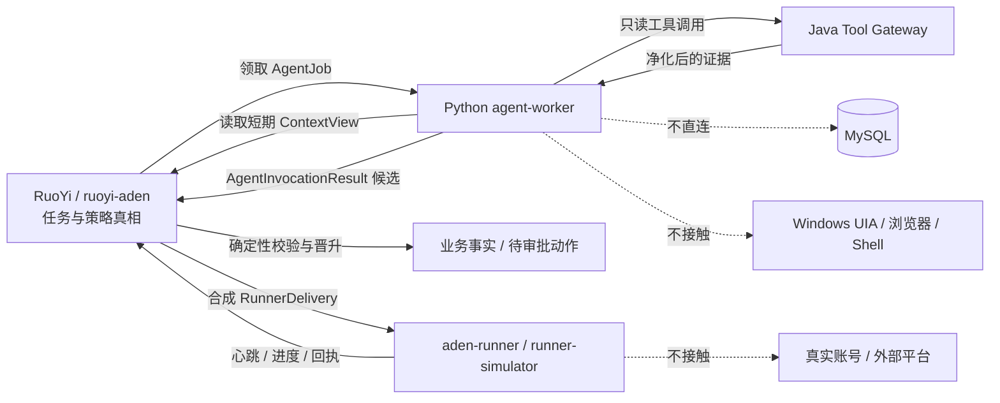
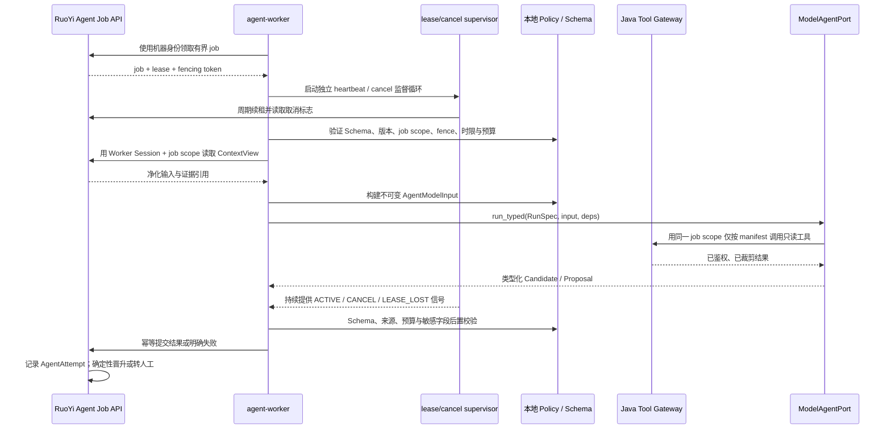

# Aden Python Agent 架构与实现方案

> 文档类型：Feature 专题技术设计；版本：0.2.0；文档状态：Approved  
> Feature：FEAT-ADEN-001；创建 / 更新：2026-09-12；风险：当前合成切片 L2，接入真实模型数据、真实账号或桌面副作用后重新分流  
> owner：Codex 负责候选架构与实现方案；用户负责模型、数据、费用和真实环境决定；独立安全复核待指定  
> 上游：[功能规格](功能规格.md)、[总技术设计](技术设计.md)、[Aden 产品需求](../../产品/产品需求文档.md)  
> 关联：[桌面端架构与实现方案](桌面端架构与实现方案.md)、[RuoYi 后端架构与实现方案](RuoYi后端架构与实现方案.md)、[十阶段实施任务清单](任务清单.md)  
> 事实边界：本文是 Python Agent / 模拟 Runner 内部设计，不拥有任务、审批、动作、审计或业务终态；跨进程 HTTP 字段以 `IMP-01` 建立的 `contracts/aden/` 机器契约为准

## 1. 结论

Python 不建设第二个业务后端，也不提供 FastAPI 控制面。目标态按凭据和运行环境新增两个独立工程，不能为了复用 Python 代码把它们合成一个高权限发行物：

1. `python/aden-agent-runtime/`：在服务端或受控 Worker 环境执行模型推理，只产生有版本、可校验的候选结果。
2. `python/aden-runner/`：Windows 执行端工程；FEAT-ADEN-001 只实现无权限的 `runner-simulator`，不包含 UIA、浏览器、文件或外部发送能力。

真实 Windows Runner 不塞进 `agent-worker`。它未来仍在独立 `aden-runner` 发行物内拆为 Session 0 的 Service Supervisor 与用户会话中的 Session Agent，并走独立 L3 设计。当前只预留契约和合成模拟器，不创建高权限进程。

Python Agent SDK 推荐 **PydanticAI + 自有 `ModelAgentPort`**。原因是 Aden 需要显式依赖、强类型输入输出和 Provider 适配，而不是 SDK 自己持有业务会话。PydanticAI 官方将 Agent 描述为 instructions、tools、structured output、dependencies 与 model 的组合，并支持类型化输出；这些能力与本方案的端口边界匹配。[PydanticAI Agent](https://pydantic.dev/docs/ai/core-concepts/agent/)、[PydanticAI 结构化输出](https://pydantic.dev/docs/ai/core-concepts/output/)

如果后续明确只使用 OpenAI，可在同一个 `ModelAgentPort` 后替换为 OpenAI Agents SDK；它同样支持结构化 `output_type`、工具和 guardrails。[OpenAI Agents SDK：Agents](https://openai.github.io/openai-agents-python/agents/)

首版不引入 LangGraph。其 durable execution、persistence 和 human-in-the-loop 会与 RuoYi / MySQL 的任务状态和恢复职责重叠；只有后续出现大量动态认知分支且普通代码编排无法维护时再做 ADR 和 PoC。[LangGraph 官方概览](https://docs.langchain.com/oss/python/langgraph/overview)

## 2. 当前事实与调研结论

### 2.1 工作区现状

| 项目 | 当前事实 | 结论 |
| --- | --- | --- |
| Aden Python 工程 | 不存在 `python/aden-agent-runtime/`、Aden Agent Worker、Runner 或 Aden Python 契约 | 必须新建，不能把文件存在写成已实现 |
| `contracts/aden/` | 不存在 | 应建立跨 Java / TypeScript / Python 的机器契约包 |
| `python/fashion-ai-runtime/` | 是智能选品项目的独立 Python Runtime，已有 Python 3.12、Pydantic v2、Provider 默认关闭和契约测试模式 | 只借鉴工程方法；不得共享业务模型、状态或数据库 |
| 历史 Python 架构 | 已归档的 FastAPI / Temporal Python-first 方案包含有价值的强类型候选、RunSpec、租约和安全停止语义 | 只提炼不冲突的机制；FastAPI 控制面、Temporal 主流程和八进程部署不恢复 |
| 当前 CORE 切片 | 不允许真实模型、UIA、浏览器、ERP、账号或外发 | 第一阶段必须使用 `FakeModelPort` / fixture，真实 Provider 为 `disabled` |

### 2.2 框架选择

| 方案 | 优点 | 与当前边界的冲突 / 代价 | 本轮决定 |
| --- | --- | --- | --- |
| PydanticAI | Python 原生；依赖与输出类型明确；支持多 Provider；工具 Schema 和测试替身清楚 | SDK API 仍需锁版本并做升级兼容；其 deferred approval 不能代替 Aden 审批 | 推荐；放在自有端口后 |
| OpenAI Agents SDK | 原语少；OpenAI 模型集成、结构化输出、工具和 tracing 完整 | 若未来有多 Provider 需求会增加适配；Agent / tool guardrail 的覆盖点不同 | OpenAI-only 备选，不与 PydanticAI 并装 |
| LangGraph | 适合动态、长运行、有检查点的 Agent 图 | 与 Java 状态机、MySQL 任务真相和人工审批重复；首版复杂度过高 | 不采用；满足触发条件后再评估 |
| 直接调用各 Provider SDK | 依赖最少、行为完全自控 | 需要自行实现工具循环、结构化重试、用量、模型差异和测试适配 | 只作为 `ModelProviderAdapter` 底层实现，不直接进入业务代码 |

PydanticAI 的 deferred tool / approval 只能暂停一次 SDK 运行，不是服务端业务批准。即使 SDK 返回“已批准”，Java 仍须根据用户身份、工作空间、对象、内容哈希、版本和有效期重新裁决。[PydanticAI Deferred Tools](https://pydantic.dev/docs/ai/tools-toolsets/deferred-tools/)

OpenAI Agents SDK 的 input/output guardrail 只覆盖 Agent 链首和链尾；逐个 function tool 需要 tool guardrail，而且 handoff 不走 function-tool guardrail。因而 SDK guardrail 只能是补充，不能成为 Aden 权限边界。[OpenAI Agents SDK：Guardrails](https://openai.github.io/openai-agents-python/guardrails/)

### 2.3 “调研清楚”的准确范围

| 问题 | 当前结论 | 证据状态 |
| --- | --- | --- |
| 谁拥有业务真相 | RuoYi / MySQL 唯一拥有 | 已由用户决定和当前规范锁定 |
| Python 做什么 | 推理候选、只读工具调用、模拟 Runner；不做审批和业务终态 | 架构结论已明确，待实现 |
| 首版 Agent 框架 | PydanticAI + 自有 Port | 文档调研完成；运行 PoC 未做 |
| 首版是否用 LangGraph / Temporal | 不用 | 当前切片决定明确；未来有量化触发条件再评估 |
| 使用哪个 Provider / 精确模型 | 尚未选择 | 需要用户的数据、费用、地域和账号决定，并做金标评测 |
| Windows UIA 使用哪套 Python 库 | 尚未选择 | 不属于当前合成切片；需固定 Windows / 微信版本后做实机探针 |
| Python 打包为 zipapp、PyInstaller 还是独立安装 | 服务端 Worker 先用受控虚拟环境 / 容器；真实 Runner 打包另议 | 需要真实 Windows Runner 的签名、更新和杀停 PoC |

所以，本轮已经足以形成可评审、可拆任务的方案，但不能宣称框架、模型、Windows Runner 或真实连接器已经验证通过。

## 3. 所有权和信任边界



强制边界：

- Python 不直连 Aden MySQL，不读取 RuoYi 用户表，不持有用户 JWT。
- `agent-worker` 只持有机器身份和完成当前 job 所需的短期 Scope。
- 模型看不到机器凭据、工作空间权限对象、完整数据库连接、内部签名密钥或任意文件路径。
- 模型输出永远是 `Candidate` / `Proposal` / `NoAction` / `Escalation`，不能输出“批准完成”“发送成功”作为业务终态。
- `runner-simulator` 与 `agent-worker` 不共享凭据；共享的只允许是生成自 `contracts/aden/` 的类型和无秘密工具库。
- Python 进程退出不会丢业务状态；Java 根据租约、attempt 和幂等记录决定恢复或新建尝试。

## 4. 工程布局与模块数量

### 4.1 顶层工程

目标架构计划新增 **2 个 Python 顶层工程 + 1 个非运行时契约目录**：

```text
python/aden-agent-runtime/       # 服务端低权限模型 Worker；当前只做离线 Fake 骨架
python/aden-runner/              # Windows 执行端；当前只实现无权限 simulator
contracts/aden/           # Java、Python、TypeScript 共用机器契约
```

当前 Feature 的编码顺序应先建 `contracts/aden/` 和 `aden-runner` 的 simulator，打通 RuoYi / MySQL / REST / SSE 合成闭环；`aden-agent-runtime` 可以建立无网络骨架与 `FakeModelPort`，但不能接真实 Provider。两类 Python 进程都不创建 FastAPI Web 应用，不开放面向桌面端的端口，只主动出站调用 RuoYi API。

### 4.2 Agent Runtime 内部九个逻辑包

| 包 | 责任 | 禁止内容 |
| --- | --- | --- |
| `bootstrap` | CLI、配置、生命周期和默认 `provider_disabled` | 监听业务 HTTP 端口、隐式启用 Provider |
| `contracts` | 由 `contracts/aden/` 生成或同步的 Pydantic DTO、Schema 版本和枚举 | 业务数据库实体、Provider SDK 类型 |
| `client` | RuoYi Agent Job 客户端、Worker 认证、超时、幂等和错误映射 | 自行推进任务状态；读取 Runner Delivery |
| `runtime` | job 领取、租约、取消、预算、attempt 生命周期和进程协调 | 持久化业务真相 |
| `agents` | 三个 Agent Family 及其版本化 RunSpec 注册表 | 一个拥有全部工具的万能 Agent |
| `model_ports` | `ModelAgentPort`、PydanticAI adapter、Fake adapter、未来 OpenAI adapter | 把 SDK Session 暴露为业务契约 |
| `tools` | 只读 Tool Gateway proxy、输入输出 Schema 和调用预算 | UIA、Shell、任意 URL、外部写工具 |
| `policy` | 本地确定性前后置校验、来源引用校验、敏感字段过滤 | 代替 Java 的最终权限 / 金额 /状态裁决 |
| `observability` | correlation、结构化日志、用量、延迟、错误分类和脱敏 | prompt / 证据全文、Token、隐藏推理 |

测试按 `unit/`、`contract/`、`golden/`、`fault/` 分层，不算运行模块。

`aden-runner` 当前只需 `simulator`、`protocol`、`transport`、`lease`、`receipts`、`fixtures` 六个低权限包；未来进入 L3 后才增加 `service`、`session_agent`、`ipc`、`ledger` 和具体 adapter。Agent Runtime 与 Runner 可以复用契约生成器，但不能复用机器凭据、进程入口或发行包。

### 4.3 三个 Agent Family，不是三个服务

| Agent Family | 未来运行模式 | 当前 FEAT 是否调用真实模型 |
| --- | --- | --- |
| `CustomerServiceAgent` | `classify_intent`、`draft_reply`、`explain_escalation` | 否 |
| `SourcingAgent` | `normalize_requirement`、`plan_discovery`、`draft_supplier_message`、`extract_quote`、`explain_comparison` | 否 |
| `CatalogUnderstandingAgent` | `map_product_fields`、`resolve_sku_terms`、`explain_uncertainty` | 否 |

任务已有确定的 `task_type + run_mode`，由 Java 路由到 RunSpec，不增加“总指挥 Agent”。首版 Handoff 深度为 0；Agent 间只交换已经校验并落库的 artifact 引用。

## 5. 核心契约

下面是语义草图，字段最终写入 `contracts/aden/` 的 JSON Schema / OpenAPI；本文不成为第二份字段真相。

### 5.1 AgentJob

```text
AgentJobEnvelope
├─ schema_version
├─ job_id / attempt_id
├─ workspace_id / task_id / step_id
├─ agent_family / run_mode / run_spec_version
├─ context_view_ref + context_hash
├─ tool_manifest_id + tool_manifest_hash
├─ model_policy_id
├─ max_steps / timeout / token_budget / cost_budget
├─ issued_at / expires_at
├─ lease_epoch / fencing_token
└─ correlation_id
```

不在 job 中携带用户密码、用户 JWT、Provider API Key、完整聊天历史、任意 URL 或可执行脚本。

### 5.2 RunSpec

每次模型运行冻结：

- `agent_family + run_mode + run_spec_version`；
- system instructions 的内容哈希；
- input / output Schema 哈希；
- 允许工具及版本；
- Provider、精确模型、参数与区域形成的 `model_policy_id`；
- 最大步骤、超时、token / 费用预算；
- policy pack、脱敏策略和 eval suite 版本。

以上任一项改变都产生新 RunSpec 候选，并重跑受影响金标；运行中不临时换 Provider、模型或提示词。

### 5.3 ContextView

`ContextView` 由 Java 按当前工作空间、任务、目的、数据等级和证据引用生成。Python 只得到：

- 净化后的结构化字段；
- 必要的 `untrusted_content` 片段；
- 不可猜测的证据引用与内容哈希；
- 任务约束、可见字段和有效期；
- 明确的缺失 / 撤权标记。

ContextView 决定“模型本次可以看什么”，不决定“模型可以做什么”。每次 Tool Gateway 请求仍由 Java 重新鉴权，以处理运行中撤权和 Scope 变化。

### 5.4 AgentInvocationResult

```text
AgentInvocationResult
├─ schema_version
├─ job_id / attempt_id / run_spec_version
├─ output: Candidate | Proposal | Escalation | NoAction
├─ source_refs[]
├─ missing_fields[] / conflicts[] / uncertainty[]
├─ usage: provider / model / tokens / latency / estimated_cost
├─ tool_trace_summary[]
├─ input_hash / output_hash
└─ completed_at
```

金额用 `Decimal` 的字符串表示，时间必须带时区，枚举拒绝未知值，Pydantic 模型默认 `extra="forbid"`。Task / aggregate version、event sequence、Session / lease epoch、fencing token、receipt sequence 和公开 BIGINT id 的 wire 值也使用 `0..Long.MAX_VALUE` 范围内的 canonical 十进制字符串；Pydantic 可校验后转为受界 `int` 运算，但序列化必须恢复为 string，并覆盖 `2^53` 以上三端 round-trip。`attempt_no` 等有业务小上限的字段才用 int32。Schema 通过只证明结构有效，不证明事实真实；Java 的 Fact Promotion Gate 还要核对来源、版本、字段原文和冲突。

## 6. 一次 Agent 运行的实现逻辑



实现步骤：

1. `claim` 每次最多领取一条，声明 Worker 版本与支持的 Schema / Agent Family。
2. 领取后立刻启动独立的 `LeaseSupervisor`，用不超过租期三分之一的间隔 heartbeat，并读取 cancel；它不能依赖模型 / 工具循环主动让出执行权。
3. 本地先检查 `expires_at`、attempt、租约 epoch、fencing token 和未知版本；失败直接拒绝，不调用模型。
4. 通过 job Scope 获取一次不可变 ContextView。Python 不自行按 ID 查询任意工作空间数据。
5. 选择精确 RunSpec；找不到、哈希不符或 Provider 被禁用时返回稳定错误，不回退到默认模型。
6. 运行模型时传入只读 `AgentRuntimeDeps` 和 cancellation signal；模型输入与运行依赖分开，不把权限对象序列化进 prompt。
7. 工具调用必须同时满足 RunSpec manifest、本次 job Scope、Java 当前权限与预算，并在调用前后检查 supervisor；Python 不能动态注册模型提出的新工具。
8. heartbeat 暂时失败只在当前 `lease_until` 前有界重试；收到 cancel、lease lost、旧 fence 或越过 deadline 后立即停止新工具、请求取消 Provider 调用，并把本次结果标为不可提交。即使底层 SDK 未及时中断，迟到结果也必须丢弃。
9. 结果先做 Pydantic 严格校验，再做来源、枚举、金额、时间、长度、敏感内容和预算校验；提交前再次要求 supervisor 状态为 `ACTIVE`。
10. 使用 `attempt_id + result_hash` 幂等提交。相同 attempt 不同结果 hash 为冲突，不能覆盖第一次结果；旧 fence 永不提交。
11. Java 记录 `aden_agent_attempt` 后决定晋升、拒绝、人工核对或下一任务命令；Python 不直接改 `aden_task`。
12. 收到提交响应后停止 supervisor，清理内存中的 ContextView 和短期凭据；日志只保留引用、哈希和指标。

对应的服务端契约至少包括 Worker session、job claim / heartbeat / result、`GET .../jobs/{jobId}/context` 和 `POST .../jobs/{jobId}/tools/{toolName}:invoke`。claim 返回的不透明 job scope 绑定 attempt、Worker Session、workspace、ContextView / manifest 哈希、fence 和有效期；Java 在每次 context / tool 请求时重新鉴权并审计，不能把一次 claim 当成长期授权。

## 7. 工具模型

Python Agent 只接入两类工具：

| effect | 示例 | 是否允许模型调用 |
| --- | --- | --- |
| `read` | `evidence.read_text`、`catalog.read_product_snapshot`、`erp.read_approved_fact` | 允许，但须逐次经 Java Tool Gateway 鉴权 |
| `proposal` | `candidate.create_draft`、`candidate.report_escalation` | 允许；结果仍只是候选 |
| `external_write` | 发送消息、表单提交、浏览器点击、UIA 输入、文件写入 | 永不提供给推理 Agent |

实际工具集取交集：

```text
RunSpec 允许工具
∩ job 授予 Scope
∩ 当前用户与工作空间权限
∩ 数据 / 来源策略
∩ 连接器能力认证状态
∩ 当前熔断与 kill switch
```

PydanticAI 可以从函数签名生成工具 Schema，但这不构成授权；`RunContext` 只保存服务端注入的依赖和调用句柄。[PydanticAI Function Tools](https://pydantic.dev/docs/ai/tools-toolsets/tools/)

## 8. 重试、取消和恢复

| 场景 | Python 行为 | Java 权威行为 |
| --- | --- | --- |
| 领取请求网络失败 | 在 deadline 内指数退避并抖动；不超过配置上限 | job 保持可领取 |
| Provider `429` / 5xx | 只在同一 RunSpec、同一 attempt、同一输入哈希内有限重试；遵守合法 `Retry-After` | 保存尝试与错误分类 |
| 输出 Schema 不合法 | 最多执行一次已登记的结构修复；仍失败则明确 `MODEL_OUTPUT_INVALID` | 不晋升候选，可按策略新建 attempt |
| Provider 超时 | 主动取消本次调用并上报；不切换未认证模型 | lease 到期后决定重试或人工处理 |
| Java 请求取消 | Worker 在模型调用或工具边界检查 cancel；停止新工具调用 | 状态先保持 `CANCEL_REQUESTED`，收到安全停止回执后再推进 |
| heartbeat 连续失败 / lease lost | 独立 supervisor 在 deadline 前重试；失租即发取消信号、禁用提交并丢弃迟到模型结果 | 拒绝旧 fence；按策略新建 attempt 或转人工 |
| Worker 崩溃 | 本地不持有业务真相；重启后重新领取 | 旧 fencing token 的迟到结果被拒绝 |
| 结果提交超时 | 用同一 idempotency key 和 result hash 重提 | 返回已有结果或冲突，不创建第二条业务事实 |

模型推理没有外部副作用，因此在证明结果未提交时可以安全重算；一旦未来工具越过外部副作用边界，必须转到 Runner / Connector 的 Action Intent 与回读协议，不能沿用“重跑 Agent”。

## 9. 安全、数据和配置

- Provider 默认 `disabled`；只有实现任务明确授权模型、数据类别、Region、费用和 Secret 来源后才启用。
- Worker 身份由 RuoYi 管理面一次性 enroll，长期 credential 只经批准的 Secret Manager / 进程环境注入；它与 Runner credential 使用不同 namespace，不能放入仓库、镜像层或 job。
- Secret 只从进程环境或批准的 Secret Manager 注入，不进入 job、配置样例、日志、trace 或证据。
- HTTP 客户端只允许配置的 RuoYi Origin 和明确 Provider Origin；拒绝 job 中的任意回调 URL。
- 页面、聊天和附件文本一律放在 `untrusted_content` 字段，不拼入 system instructions。
- 默认不保存模型隐藏推理；保存 input / output Schema 版本、哈希、结构化候选、用量和脱敏 trace 引用。
- 每个 job 限制 wall-clock、步骤、并发、工具次数、输入体积、输出体积、token 和费用。
- 本地日志使用 `correlation_id / job_id / attempt_id`，禁止记录正文、凭据、完整 prompt 和未脱敏 tool result。
- Python 无法访问任意 Shell、文件系统路径、浏览器和 UIA；未来 Runner 也只解释版本化命令联合类型，不提供 `RunScript`、`Click(x,y)` 或 `ReadFile(path)`。

## 10. 测试与验收证据设计

### 10.1 当前合成切片

1. 契约 round-trip：同一 Schema 样例在 Java、TypeScript、Python 都能通过，未知字段和未知枚举被拒绝。
2. `FakeModelPort`：固定输入产生固定候选；测试过程中设置“禁止真实模型请求”。
3. Worker 生命周期：领取、独立 heartbeat supervisor、长 Provider 调用、取消、失租、过期、重复提交、不同 hash 冲突和旧 fencing token。
4. Tool manifest：未声明工具、外部写工具、越工作空间引用和超预算调用全部拒绝。
5. Runner simulator：重复 delivery、崩溃重启、乱序回执和租约失效不重复推进。
6. 静态扫描与网络观测：没有真实 Provider、微信、电商、ERP 和外发目标。

PydanticAI 官方测试指南提供 `TestModel` / `FunctionModel`，并建议用 `ALLOW_MODEL_REQUESTS=False` 防止单测误发真实模型请求；本工程仍在其外层保留自有 `FakeModelPort`，避免 SDK 测试类型渗入业务测试。[PydanticAI Testing](https://pydantic.dev/docs/ai/guides/testing/)

### 10.2 真实模型启用前

- 为每个 `AgentFamily + run_mode + RunSpec` 建独立金标集，不用一次成功样例替代评测。
- Schema 有效率目标 100%；跨工作空间内容暴露、越权工具和无来源事实晋升必须为 0。
- 采购金额、身份、权限、状态和发送结果只用确定性断言，不用 LLM Judge 决定。
- 分层报告字段精确率 / 召回率、敏感意图漏判、人工接受率、编辑量、延迟和单次成本。
- Provider、模型、参数、prompt、Schema、工具或 policy pack 变化时，重跑受影响套件。

## 11. 分阶段落地

| 阶段 | 产物 | 退出条件 |
| --- | --- | --- |
| P0 契约与模拟 Runner | `contracts/aden/`、`aden-runner` 六个低权限包、fixture 和故障脚本 | 测试引导 / enroll、Session、claim、heartbeat、receipt 不重复推进 |
| P1 Agent Runtime 骨架 | `aden-agent-runtime`、九个包边界、`FakeModelPort`、RuoYi client port 与 Fake transport | 不联网即可完成类型、生命周期和错误测试 |
| P2 合成 AgentJob | Java 生成 job，Worker 领取并返回固定候选 | 重复、超时、取消、崩溃与旧 token 证据成立 |
| P3 框架 PoC | 锁定一个 PydanticAI 版本、一个 sandbox Provider / 模型、一个无敏感数据 RunSpec | Schema、预算、取消、重试、日志脱敏和金标基线可量化 |
| P4 首个业务 Agent | 建议先做 `SourcingAgent.extract_quote`，仍只产候选 | 通过对应金标，Java 确定性晋升，不能外发 |
| P5 三 Agent Family | 客服、采购、商品理解按独立 RunSpec 发布 | 每个 Family 独立评测和停用，不互相继承认证 |
| P6 真实 Runner | 新 Feature / L3；设备身份、双进程、本地账本和签名更新 | 实机安全、停止证明、权限和连接器认证通过 |

本表只表达 Python 组件自身的设计演进。FEAT-ADEN-001 当前实施只覆盖 P0、P1 的相应子集；P2～P6 不是本期承诺。跨组件的 `IMP-01`～`IMP-10`、实际状态、授权和证据只在[任务清单](任务清单.md)维护。

## 12. 待讨论决定

以下决定不阻断本轮文档完成，但会阻断真实模型实现：

1. 首个 Provider、精确模型、Region、数据保留策略和单次 / 日费用上限。
2. 首个 RunSpec 选采购需求解析还是报价抽取；本方案建议先做报价抽取，因为输入、金标和确定性复核边界更清楚。
3. PydanticAI 锁定版本和升级窗口；是否保留 OpenAI Agents adapter 的空接口而不安装依赖。
4. Worker 首期部署在与 RuoYi 同一受控内网主机还是独立容器；两者都不改变 MySQL 所有权。
5. 真实 Windows Runner 的 UIA 库、进程身份、打包、代码签名和更新路线；这些必须由后续 PoC 决定。

## 13. 完成定义

十阶段[任务清单](任务清单.md)已形成 Draft；本文与任务清单经用户确认后，才能实施 Python 范围。Python 方案的“设计完成”至少要求：

- Java / Python 所有权、两个独立 Python 工程和各自包职责无冲突；
- `contracts/aden/` 中的 AgentJob、RunSpec、ContextView、结果和错误契约可生成并校验；
- Provider 默认关闭，测试不会误发真实请求；
- Agent 无外部写工具、无用户 JWT、无数据库连接；
- 重试、取消、租约、fencing、幂等和恢复有可执行测试范围；
- 未决 Provider、模型、费用、Region 与 Windows Runner PoC 保持明确，不伪造为已验证。
