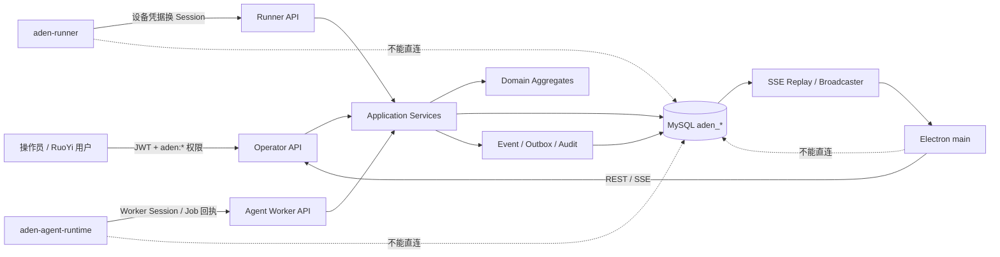

# Aden RuoYi 后端架构与实现方案

> 文档类型：Feature 专题技术设计；版本：0.2.0；文档状态：Approved  
> Feature：FEAT-ADEN-001；创建 / 更新：2026-09-12；风险：当前合成切片 L2，真实账号、外部动作、设备证书或跨租户运维另行分流  
> owner：Codex 负责候选架构与实现方案；用户负责业务权限、部署和迁移决定；独立安全复核待指定  
> 上游：[功能规格](功能规格.md)、[总技术设计](技术设计.md)、[Aden 产品需求](../../产品/产品需求文档.md)  
> 关联：[Python Agent 架构与实现方案](Python%20Agent架构与实现方案.md)、[桌面端架构与实现方案](桌面端架构与实现方案.md)、[十阶段实施任务清单](任务清单.md)  
> 事实边界：本文拥有 `ruoyi-backend/ruoyi-aden` 的内部架构、数据库和服务端协议语义；具体跨语言字段最终以 `IMP-01` 建立的 `contracts/aden/` OpenAPI / JSON Schema 为唯一机器事实

## 1. 结论

Aden 后端继续放在现有 RuoYi Reactor 内，**只保留已经创建的 1 个 Maven 业务模块 `ruoyi-aden`，首版不再增加 Java 子模块，也不拆微服务**。身份、工作空间、任务、Runner 会话、租约、事件、审计和最终业务状态都由 RuoYi + MySQL 持有；Electron、Python Agent 和 Windows Runner 只能通过受限 API 参与，不能直连数据库或自行宣布业务终态。

`ruoyi-aden` 内采用四个技术层和六个逻辑领域边界：

- 四个技术层：`api → application → domain`，以及实现端口的 `infrastructure`；`configuration` 只负责装配。
- 六个逻辑领域：`workspace`、`task`、`runner`、`agent`、`action`、`event/audit`。
- 当前 FEAT-ADEN-001 实现 `workspace`、`task`、`runner`、`event/audit` 的合成闭环；`agent` 先冻结契约、可做无网络 Fake PoC；`action` 只保留默认关闭的端口，不落真实外部动作。

这 6 个是同一 Maven 模块内的逻辑边界，不是 6 个 JAR、6 个进程或 6 个数据库。等出现独立扩缩容、独立发布、团队所有权或故障隔离的量化证据后，才通过 ADR 评估拆分。



## 2. 当前实现事实

### 2.1 已存在

| 项目 | 当前事实 | 能证明什么 |
| --- | --- | --- |
| Maven 模块 | 根 `ruoyi-backend/pom.xml` 已聚合 `ruoyi-aden`，`ruoyi-admin` 已依赖它 | 模块已进入 RuoYi 构建图，不代表功能完成 |
| 主源码 | 5 个 Java 文件：1 个 `package-info`，4 个任务状态类 | 只有纯 Java 状态迁移骨架 |
| 测试 | 1 个 JUnit 类、7 个测试方法 | 覆盖部分正常 / 非法状态迁移，不是完整并发和持久化证明 |
| 历史报告 | 工作区可见 2026-09-12 生成的 Surefire XML，记录 7 个测试、0 失败 | 只是已有产物；本轮未重跑，不能写成当前验证通过 |

当前状态机已表达 `DRAFT → VALIDATING → QUEUED → RUNNING → SUCCEEDED`，以及 `WAITING_USER`、`WAITING_EXTERNAL`、取消和失败路径。尚不存在 Controller、Application Service、Mapper、Repository、DDL、REST、SSE、Runner 认证、Agent Job 或持久化实现。

### 2.2 当前技术基线

| 类别 | 工作区事实 | 设计使用方式 |
| --- | --- | --- |
| 平台 | RuoYi `3.9.2` | 复用账号、认证、角色、菜单、日志与部署入口 |
| Java | Maven 编译目标 Java `17`；当前本机 Maven JDK `21.0.10` | 生产兼容以 Java 17 bytecode 为准；测试记录同时写运行 JDK |
| Web | Spring Boot `4.0.6`、Spring MVC / Tomcat | REST 与 `SseEmitter`，首版不引入 WebFlux |
| 持久化 | MyBatis Spring Boot Starter `4.0.1`、Druid、MySQL Connector/J | 显式 Mapper XML、Row 与 Repository，不把表对象泄漏为领域对象 |
| 数据库 | 当前本机 MySQL `8.0.46`；生产精确版本待确认 | 设计要求 MySQL 8 / InnoDB；兼容下限需用目标环境验证 |
| 安全 | Spring Security + RuoYi JWT / Redis 登录态 | 仅操作员 API 复用用户 JWT；Runner / Agent 使用独立机器身份 |

RuoYi 官方仓库说明了当前框架的前后端分离、Spring Security、JWT 和权限体系，本方案只在这些平台能力上增加 Aden 的资源级授权，不另造用户系统。[RuoYi 官方仓库](https://github.com/yangzongzhuan/RuoYi)

### 2.3 当前数据库惯例与冲突风险

- RuoYi MySQL 平台库目前通过 `ruoyi-backend/sql/*.sql` 手工初始化或增量导入。
- `ruoyi-interview` 只为独立 PostgreSQL 数据源配置自定义 Flyway，而且默认关闭。
- Aden 的 MySQL 迁移机制尚未批准、尚未实现。
- **不能直接启用默认 `classpath:db/migration` 扫描**：该 classpath 已含 PostgreSQL migration；误扫可能把 PostgreSQL SQL 发给 MySQL。

因此本文把 Aden 专属 Flyway 列为推荐待决方案，而不是既成事实。

## 3. 模块数量与代码结构

### 3.1 数量结论

| 层级 | 数量 | 说明 |
| --- | ---: | --- |
| Aden Java Maven 模块 | **1** | 已存在的 `ruoyi-backend/ruoyi-aden`；不再新增 `api/domain/infrastructure` 子模块 |
| 技术层 | **4 + 装配层** | `api`、`application`、`domain`、`infrastructure`；`configuration` 只装配 |
| 逻辑领域边界 | **6** | workspace、task、runner、agent、action、event/audit |
| 首个合成闭环实际实现的领域边界 | **4** | workspace、task、runner、event/audit |
| 跨语言契约目录 | **1** | `contracts/aden/`；不是 Maven 模块，也不运行 |

### 3.2 推荐包结构

```text
com.ruoyi.aden
├── api
│   ├── operator                 # 用户 REST
│   ├── runner                   # Runner 专用 REST
│   ├── agent                    # Agent Worker 专用 REST（后续）
│   ├── stream                   # SSE
│   └── error                    # Aden 异常映射
├── application
│   ├── workspace
│   ├── task
│   ├── runner
│   ├── agent
│   ├── action
│   └── event
├── domain
│   ├── workspace
│   ├── task
│   ├── runner
│   ├── agent
│   ├── action
│   └── event
├── infrastructure
│   ├── persistence
│   │   ├── mapper
│   │   ├── repository
│   │   └── row
│   ├── security
│   ├── outbox
│   ├── stream
│   └── scheduling
└── configuration
```

Mapper interface 固定放在以 `.mapper` 结尾的包并命名 `*Mapper.java`，匹配现有 `@MapperScan("com.ruoyi.**.mapper")`；XML 固定放在 `src/main/resources/mapper/aden/` 并命名 `*Mapper.xml`，匹配现有 `classpath*:mapper/**/*Mapper.xml`。不为 Aden 放宽共享扫描规则，也不把领域对象加入 RuoYi 全局 `typeAliasesPackage`；使用专用 Row 类型和显式 `resultMap`，并以 Spring / MyBatis 启动和 statement 装配测试提前发现漏扫或 alias 冲突。

### 3.3 依赖方向

```text
api → application → domain
infrastructure → application/domain 定义的 ports
configuration → 负责 Spring 装配
domain → 不依赖 Spring、MyBatis、RuoYi、Electron 或 Python
```

- Controller 只做认证上下文、DTO 校验、ETag / 幂等头和响应映射。
- Application Service 拥有用例和事务边界。
- Domain 聚合拥有状态迁移和不变量，但不执行网络或 SQL。
- Infrastructure 实现 Repository、时钟、发布、凭据校验和广播。
- 不允许 Controller 直接调用 Mapper，也不允许 Mapper Row 直接作为 API 响应。

## 4. 领域模型与不变量

### 4.1 Workspace

核心对象：`Workspace`、`WorkspaceMember`、`WorkspaceRole`、`WorkspaceStatus`。

首版权限角色固定为 `OWNER / OPERATOR / VIEWER`。平台级 RuoYi 管理权限与 Workspace 业务角色分开，不在 Workspace 内再造 `ADMIN`；需要复核能力时先由权限字符与任务状态裁决，未来确有独立职责再通过规格变更增加角色。有效授权必须同时满足：

```text
已登录
AND 具备对应 aden:* RuoYi 功能权限
AND 是 path 所选 workspace 的有效成员
AND workspace 角色允许该动作
AND 目标资源属于该 workspace
AND 聚合当前状态允许该命令
```

RuoYi 权限回答“用户可否调用这一类功能”，Workspace membership 回答“用户可否操作这个具体空间”。两者不能相互替代。

当前角色结果固定为：三种角色均可列出自己的 Workspace，并在具备对应 `aden:*` 权限时读取 bootstrap、Capability、Task、Runner 摘要、事件与最小审计；OWNER 和 OPERATOR 可在各自功能权限同时满足时创建 Task、提交校验或请求取消；只有 OWNER 可 enroll / revoke Runner；VIEWER 无写权限。`SUBMIT_FOR_VALIDATION` 精确要求 `aden:task:command`，`REQUEST_CANCEL` 精确要求 `aden:task:cancel`，二者不互相隐式授权。平台 `workspace:create` 只看独立 RuoYi 权限，成功后才建立首个 OWNER。本 Feature 不提供成员增删、角色变更、OWNER 转移或 Workspace 删除 API；OPERATOR / VIEWER 只由隔离测试 setup 配置以验证矩阵，正式成员管理另开 Feature。精确矩阵以[任务清单 2.1](任务清单.md#21-workspace-角色矩阵)为当前批准事实。

### 4.2 Task

核心对象：`Task`、`TaskStep`、`TaskState`、`OperatorTaskCommand`、内部 `DomainCommand`、`ActorType`、`TaskVersion`、`TaskType`、`CapabilityCode`、`CorrelationId`。

现有静态状态转换保留为领域规则的起点，但目标实现必须由 Task 聚合同时校验：

- 当前状态和命令；
- 乐观版本；
- 操作者类型；
- 是否到达取消安全点；
- 是否还有未决 `OUTCOME_UNKNOWN` 动作；
- 是否允许进入终态。

命令边界先于 Controller 冻结：当前 Operator OpenAPI 只接受 `SUBMIT_FOR_VALIDATION` 与 `REQUEST_CANCEL`，并在 Controller / Application guard 按 DTO command 分别要求 `aden:task:command` 与 `aden:task:cancel`。当前合成 Validator 是校验用例内的纯确定性、零网络函数；`SUBMIT_FOR_VALIDATION` 在单一事务中连续应用 `DRAFT → VALIDATING → QUEUED / FAILED`，两次迁移分别递增 aggregateVersion 并写连续事件，`VALIDATING` 不是独立提交点。合法提交产生业务校验失败时仍返回 HTTP 200 + 最新 Task / ETag（`state=FAILED`、稳定 `reasonCode`）；422 只用于不改变 Task 的前置输入拒绝。Validator 可在该用例内部产生 `VALIDATION_PASSED / VALIDATION_FAILED`；Runner 只提交强类型 receipt，鉴权、lease / fence / sequence 校验通过后由 receipt adapter 产生 `START / COMPLETE / FAIL / CONFIRM_CANCELED` 等内部 DomainCommand；Coordinator 才能产生等待 / 恢复和无活动 Delivery 时的取消确认。内部命令枚举不作为 Controller DTO，未知或伪造的内部命令名在反序列化 / mapping 边界即拒绝。`allowedCommands` 仅投影当前 Operator + role + state + 命令级功能权限可发送的公开命令，服务端收到请求后仍按 `permission × membership × role × state × actor × command` 重新裁决。

`OUTCOME_UNKNOWN` 首先是 Action / Delivery 的结果状态，不作为普通 Task 成功 / 失败迁移。只有完成平台回读或人工处置后，Task 才能进入最终状态。

### 4.3 Runner

核心对象：`Runner`、`RunnerCredential`、`RunnerSession`、`RunnerDelivery`、`Lease`、`FencingToken`、`CapabilitySnapshot`。

建议状态：

- Session：`ACTIVE / EXPIRED / REVOKED / CLOSED`。
- Delivery：`READY / LEASED / RUNNING / COMPLETED / FAILED_RETRYABLE / FAILED_FINAL / CANCELED / OUTCOME_UNKNOWN`。

Runner 在线与否、Session 是否有效、Delivery 是否被领取、Task 业务状态是四个不同事实，不能压缩成一个布尔值。

### 4.4 Agent

Agent 是后续低权限推理执行边界，不是第二控制面。核心对象候选：`AgentJob`、`AgentAttempt`、`AgentWorkerSession`、`RunSpecRef`、`ContextViewRef`、`CandidateResult`。

- `AgentJob` 由 Java 基于 Task 派生；Python 不能任意创建业务任务。
- Worker 只领取与自己声明的 Schema / Agent Family 兼容的 Job。
- 结果必须携带 RunSpec、模型 / Provider、Schema、来源引用、用量和确定性校验摘要。
- Java 决定结果是否接受、重试、降级、转人工或派生动作；模型输出不能直接变成成功终态。
- 当前合成切片只需要冻结契约与 Fake 结果，不创建真实 Provider 凭据和联网作业。

### 4.5 Action

真实外部写动作不属于本切片。只定义默认关闭的端口和未来对象：`ActionIntent`、`Approval`、`ActionAttempt`、`ExternalReceipt`。

未来批准必须绑定 `action_intent_id`、目标、载荷哈希、Task 版本、策略版本和过期时间。正文、目标或策略变化后旧批准自动失效；批准只能原子消费一次。

### 4.6 Event / Audit

核心对象：`DomainEvent`、`OutboxRecord`、`InboxRecord`、`AuditEvent`、`StreamCursor`。

准确的一致性承诺是：

- Outbox 至少一次投递；
- Inbox、唯一约束和状态 CAS 保证幂等消费；
- 对中心业务状态实现 effectively-once 推进；
- 不承诺端到端 exactly-once；非幂等外部动作仍需平台回读、本机动作账本和人工对账。

## 5. 数据设计

### 5.1 当前合成闭环：12 张业务表

| 分组 | 表 | 责任 |
| --- | --- | --- |
| Workspace | `aden_workspace` | 工作空间、状态、版本 |
| Workspace | `aden_workspace_member` | RuoYi user 与 workspace 角色 |
| Task | `aden_task` | Task 聚合、状态、版本、correlation |
| Task | `aden_task_step` | 有序步骤和步骤状态 |
| Runner | `aden_runner` | 设备、允许能力与唯一 `current_session_epoch` |
| Runner | `aden_runner_credential` | 设备凭据 keyed digest、pepper key id、轮换与吊销 |
| Runner | `aden_runner_session` | 短期会话、递增 epoch、心跳 |
| Runner | `aden_runner_delivery` | 任务包、租约、fencing 与回执 |
| Reliability | `aden_event` | 不可变领域事件，也是 SSE replay 来源 |
| Reliability | `aden_outbox` | 各 consumer 的投递状态 |
| Reliability | `aden_inbox` | 请求和回执幂等去重 |
| Audit | `aden_audit_event` | 只追加的安全与业务审计 |

已批准由独立的 `aden_flyway_schema_history` 记录迁移历史；它不是业务表。后续启用真实 Agent 时再增加 `aden_agent_worker_credential`、`aden_agent_worker_session`、`aden_agent_job`、`aden_agent_attempt`；进入真实外部动作 L3 时再增加 `aden_action_intent`、`aden_approval`、`aden_action_attempt`、`aden_external_receipt`。不能把未来表提前写成当前已实现。

### 5.2 关键数据库规则

- 所有 **workspace-owned** 聚合、唯一键和业务查询都显式带 `workspace_id`；`aden_workspace` 自身以 `workspace_id` 为根主键。
- `aden_workspace` 保存 `last_event_seq`。每个写事件的事务先锁定对应 Workspace 行、递增并取得序号，持锁直至提交；不得用普通 AUTO_INCREMENT、独立 sequence 表的无锁读取或 `MAX(event_seq)` 冒充提交有序水位。
- 受控例外只有平台级身份 / 元数据：未来 `aden_agent_worker_credential`、`aden_agent_worker_session` 是跨 workspace Worker 池的机器身份，`aden_flyway_schema_history` 是迁移元数据。它们不保存业务内容，也不能据此直接查询任意 workspace 数据。
- 每个 `aden_agent_job`、`aden_agent_attempt`、ContextView 和 job scope 仍强制绑定一个 `workspace_id`。平台 Worker credential 只允许进入兼容 job 池，具体业务访问权只来自短期 job scope。
- 平台级 Repository 置于独立 security / administration port，只能由全局管理或机器认证用例调用；面向用户和业务聚合的 Repository 方法仍强制接收 `WorkspaceId`。
- `aden_audit_event` 使用 `scope_type=PLATFORM|WORKSPACE`；只有 Worker enroll / revoke、workspace create 等平台管理事件允许 `workspace_id` 为空，普通业务审计必须非空。调用方不能自行选择 scope。
- Aden 表之间可以使用包含 `workspace_id` 的组合外键。
- Aden 表不向 `sys_user` 建级联外键；只保存稳定 `ruoyi_user_id BIGINT`，由应用校验。
- 公共 ID 首版使用 UUID 字符串与 ASCII binary collation；不为 ULID 新增依赖。
- 数据库中的 Task / aggregate version、event sequence、Runner / credential / Session epoch、fencing token、receipt sequence 和 RuoYi user id 使用非负 signed BIGINT / Java `long` value object；一旦进入 OpenAPI、JSON、SSE 或 IPC，统一编码为 `0..9223372036854775807` 的 canonical 十进制字符串，禁止前导零、符号、指数和小数。`attempt_no` 等小计数使用有明确上限的 int32。TypeScript 不得经 `number` 处理这些值，cursor / ETag 继续 opaque。
- 时间列使用 `DATETIME(6)`；Java 通过 UTC `Clock` 和转换器读写。当前共享连接 URL 为 GMT+8，不能假设 `DATETIME` 自动表达 UTC。
- JSON 只保存经过 Schema 校验、大小受限的任务包、能力和公开事件数据；截图、大正文、凭据、Token、模型隐藏推理不进入 JSON 列。
- 所有枚举按稳定字符串存储；未知枚举必须 fail closed，不能悄悄映射为默认值。

关键索引至少包括：

```text
aden_task(workspace_id, state, created_at, task_id)
aden_workspace_member(ruoyi_user_id, status, workspace_id)
aden_runner_delivery(workspace_id, state, available_at, required_capability, priority, delivery_id)
aden_event UNIQUE(workspace_id, event_seq)
aden_outbox(state, available_at, outbox_id)
aden_inbox UNIQUE(workspace_id, consumer, producer_id, operation, idempotency_key)
```

### 5.3 已批准迁移方案

推荐采用 Aden 专属 Flyway，但不能复用默认 migration location：

```text
location = classpath:db/aden-migration
history table = aden_flyway_schema_history
cleanDisabled = true
baselineOnMigrate = false
普通应用启动默认不自动 migrate
```

实施约束：

1. `ruoyi-aden` 显式依赖 `flyway-core` 和 `flyway-mysql`，不能依赖其他业务模块的传递依赖。
2. 提供短生命周期、条件装配的 `AdenMigrationCli`，只支持显式 `baseline / migrate / validate` 三种模式。CLI 固定 datasource、location 与 history table，每个动作前校验预期数据库名、RuoYi 标志表和 `aden_*` 冲突；它不是第二个业务服务，不注册 Web Controller / scheduler，也不常驻。
3. 对现有非空 RuoYi 数据库执行一次显式 baseline version `0`，先验证数据库名、RuoYi 标志表、`aden_*` 冲突、备份和恢复路径。合成本机 MySQL 一次性隔离实例先导入只读基线 `ruoyi-backend/sql/ry_20260417.sql`，再执行 Aden baseline / migration；空库与错库必须 fail-closed。
4. 不启用 `baselineOnMigrate=true`；该选项会减弱连接错误数据库时的安全保护。[Flyway baselineOnMigrate](https://documentation.red-gate.com/flyway/reference/configuration/flyway-namespace/flyway-baseline-on-migrate-setting)
5. 执行顺序固定为“`AdenMigrationCli migrate` → `AdenMigrationCli validate` → 普通 `ruoyi-admin` 启动”。普通应用只运行 Schema version guard 并在版本不满足时 fail-closed；CLI 内禁用该应用 guard，migration 完成后才 validate，避免 guard 与 migration 形成启动循环，也不让多个应用实例并发改 Schema。
6. MySQL 8 的单条 InnoDB DDL 可具备 atomic DDL 语义，但 DDL 仍会隐式提交；迁移必须采用 expand / contract、备份、停止条件和 forward-fix，不能承诺整批 DDL 可事务回滚。[MySQL atomic DDL](https://dev.mysql.com/doc/refman/8.0/en/atomic-ddl.html)
7. RuoYi 菜单和权限继续单独提供幂等 `ruoyi-backend/sql/aden-permissions.sql`，默认不给任何业务角色授权。测试所需合成用户 / 角色 / 权限由 test-only setup 创建；Workspace 与 Runner 仍调用真实受控 create / enroll API，测试 seed 不进入 migration 或普通启动。

Flyway 已作为当前唯一权威迁移事实；若未来要求替换，必须另行修订设计并迁移历史，不能并行维护“版本化 SQL + 人工记录”第二套事实源。

## 6. API 与认证

### 6.1 操作员 API

workspace ID 使用显式资源路径；它只是客户端选择器，服务端必须重新校验 membership。

| 方法 | 路径 | 权限 / 并发语义 |
| --- | --- | --- |
| `GET` | `/api/v1/aden/workspaces` | 当前用户的有效成员关系 |
| `POST` | `/api/v1/aden/admin/workspaces` | `aden:workspace:create`；事务内创建 workspace 与首个 OWNER |
| `GET` | `/api/v1/aden/workspaces/{workspaceId}/bootstrap` | membership + Task / Runner / Capability / Event 读取权限；同一一致性视图返回当前 UI 投影和 workspace-wide `streamCursor` |
| `GET` | `/api/v1/aden/workspaces/{workspaceId}/capabilities` | `aden:capability:list` + membership；返回四能力状态、下一门禁和外部动作开关，不新增业务表 |
| `POST` | `/api/v1/aden/workspaces/{workspaceId}/tasks` | `aden:task:create`；要求 `Idempotency-Key` |
| `GET` | `/api/v1/aden/workspaces/{workspaceId}/tasks` | `aden:task:list`；游标分页 |
| `GET` | `/api/v1/aden/workspaces/{workspaceId}/tasks/{taskId}` | `aden:task:query`；返回该 Task 的 `ETag` / version，不充当 Workspace stream 起点 |
| `POST` | `/api/v1/aden/workspaces/{workspaceId}/tasks/{taskId}/commands` | `SUBMIT_FOR_VALIDATION` 要求 `aden:task:command`；`REQUEST_CANCEL` 要求 `aden:task:cancel`；要求 `If-Match` 和幂等键 |
| `GET` | `/api/v1/aden/workspaces/{workspaceId}/events` | `aden:event:subscribe` + membership；workspace SSE replay |
| `GET` | `/api/v1/aden/workspaces/{workspaceId}/audit-events` | `aden:audit:list` |
| `GET` | `/api/v1/aden/workspaces/{workspaceId}/runners` | `aden:runner:list`；只返回设备摘要与状态 |
| `POST` | `/api/v1/aden/workspaces/{workspaceId}/runners:enroll` | `aden:runner:enroll`；生成一次性设备秘密 |
| `POST` | `/api/v1/aden/workspaces/{workspaceId}/runners/{runnerId}:revoke` | `aden:runner:revoke`；吊销凭据与活动 Session |
| `POST` | `/api/v1/aden/admin/agent-workers:enroll` | 未来 `aden:agent:manage`；生成一次性 Worker credential |
| `POST` | `/api/v1/aden/admin/agent-workers/{workerId}:revoke` | 未来 `aden:agent:manage`；吊销 Worker 与活动 Job |

权限字符候选：

```text
aden:workspace:list
aden:workspace:create
aden:capability:list
aden:task:list
aden:task:query
aden:task:create
aden:task:command
aden:task:cancel
aden:event:subscribe
aden:runner:list
aden:runner:enroll
aden:runner:revoke
aden:audit:list
aden:agent:manage        # 未来 Agent PoC
aden:action:approve       # 未来 L3
```

写请求规则：

- `POST .../tasks` 返回 `201`、`Location` 和 `ETag`。
- Task 快照返回 `version` 与 `ETag: "task-<id>-v<version>"`。
- 命令缺少 `If-Match` 返回 `428`；版本不一致返回 `412`，客户端重新读取快照。
- 同幂等键、同确定性请求指纹返回第一次结果；同键不同指纹返回 `409`。
- 指纹从经过规范化的具体 DTO 字段计算，不能依赖原始 JSON 字段顺序。
- 命令端点在 DTO 解析后再做命令级权限 guard：`SUBMIT_FOR_VALIDATION → aden:task:command`，`REQUEST_CANCEL → aden:task:cancel`；查询响应中的 `allowedCommands` 用同一映射投影。
- 合法 `SUBMIT_FOR_VALIDATION` 若得出业务校验失败，因 Task / Event / 幂等事实已提交，返回 HTTP 200 + 最新 `FAILED` Task 与 ETag；`422 ADEN_TASK_VALIDATION_FAILED` 仅表示未发生状态变更的前置输入拒绝。

操作员 API 不能直接继承 RuoYi 默认错误输出：现有默认 AuthenticationEntryPoint / 全局异常处理可能以 HTTP 200 携带 body `code`，这会破坏 Electron、OpenAPI 与重试语义。安全链顺序固定为：Runner `@Order(1)` → Aden Operator `@Order(2)` → RuoYi 默认链。Operator chain 用 `securityMatcher("/api/v1/aden/**")`，复用现有 RuoYi JWT authentication filter，但替换为 Aden 专用 AuthenticationEntryPoint / AccessDeniedHandler，返回真实 HTTP 401 / 403 和 ErrorEnvelope；更高优先级且限定 `com.ruoyi.aden` 的 `@RestControllerAdvice` 处理参数、method security 与领域异常，返回真实 400 / 404 / 409 / 412 / 428。filter 层和 controller 层的 correlation / envelope 字段必须一致，不能被 RuoYi 全局 advice 再包装。

Runner 与 Aden Operator 两条链都使用 `SessionCreationPolicy.STATELESS`，关闭 CSRF、request cache、form login 和 HTTP Basic，但保留必要安全响应头。RuoYi JWT 的 Redis 登录事实不等于 Servlet HttpSession。现有 `ruoyi-framework/ResourcesConfig` 已对 `/**` 注册 `allowedOriginPattern("*")` 的全局 `CorsFilter`，因此“SecurityFilterChain 不配置 CORS”不足以保护 Aden。当前没有浏览器调用方：`ruoyi-aden` 必须以明确 order 注册早于该全局 Filter 的 Aden Origin Guard，限定 `/api/v1/aden/**`，凡带 `Origin` 的请求（包括 preflight OPTIONS）一律返回真实 403 ErrorEnvelope；无 Origin 的 Electron main / Python httpx 正常通过。不得为此修改共享 `ResourcesConfig`。若未来 `admin-web` 调用这些 API，再经批准把 Guard 改为精确 Origin / method / header allowlist。集成测试必须同时证明真实 POST 不被 CSRF / saved-request 误拦、任意 Origin / preflight 均无 `Access-Control-Allow-Origin: *`，且全局 CorsFilter 不能覆盖 Aden 的拒绝结果。

### 6.2 空库引导与 Runner enroll

生产与合成测试使用不同但显式的引导路径：

1. 数据迁移只建 Schema，不静默创建业务 workspace、默认成员或通用 Runner secret。
2. 当前切片由已认证且具备独立 `aden:workspace:create` 权限的 RuoYi 用户调用 `POST /admin/workspaces`；此动作发生在 workspace role 建立之前，同一事务创建 workspace、将当前用户设为 OWNER，并写审计。本 Feature 不修改 `admin-web`；若后续增加管理页面，要把它另行纳入受影响工程和任务范围。
3. OWNER 且具备 `aden:runner:enroll` 功能权限时调用 `runners:enroll`，请求只含设备显示名和允许 capability。服务端用 CSPRNG 生成 `credentialId.secret`，Secret 仅返回一次；数据库只保存公开 credential id、带可轮换 pepper key id 的 keyed digest、创建人、到期、状态和 credential epoch，验证时使用常量时间比较。
4. 一次性秘密由管理员通过批准的带外渠道配置到 `aden-runner`。桌面 renderer、任务 JSON、SSE、普通日志和截图都不得取得它。首次换 Session 成功后可按策略立即轮换 bootstrap secret。
5. `POST /runner/v1/sessions` 通过 `Authorization: AdenCredential <credentialId.secret>` 接收设备凭据。先由公开 credential id 只读定位 Workspace，随后在同一事务按 `Workspace → Runner → Credential → Session` 锁序重新校验并原子执行 `current_session_epoch + 1`、创建短期 opaque `sessionId.secret` 对应的 ACTIVE Session，并把所有旧 ACTIVE Session 标为 `SUPERSEDED`；其余 Runner API 使用 `Authorization: AdenRunner <sessionId.secret>`。Session 表只存公开 id、keyed digest、pepper key id、状态、到期和 epoch；吊销 Runner 时按全局锁序在同一事务使长期 credential 与所有活动 Session 失效。
6. 合成 E2E 先执行 canonical `aden-permissions.sql`；test-only setup 只创建合成 RuoYi 用户 / 角色、授予已存在权限，并可在真实 create API 建立 OWNER 后配置额外 OPERATOR / VIEWER membership 以验证矩阵。Workspace 与 Runner credential 必须经过真实 create / enroll API，不能直接 seed `aden_workspace` / `aden_runner*`。测试结束关闭并清理本轮一次性 MySQL / Redis；setup 不进入普通启动、生产 migration 或示例配置。

若一次性秘密遗失，不能回读明文，只能吊销并重新 enroll。轮换、显示、复制和过期都写审计，但审计永不保存秘密本身。

### 6.3 Runner API

| 方法 | 路径 | 作用 |
| --- | --- | --- |
| `POST` | `/api/v1/aden/runner/v1/sessions` | 设备凭据换短期 Session |
| `POST` | `/api/v1/aden/runner/v1/sessions/{sessionId}/heartbeats` | Session 心跳 |
| `POST` | `/api/v1/aden/runner/v1/deliveries:claim` | `Idempotency-Key / claimRequestId`；按 Session capacity 有界领取 |
| `POST` | `/api/v1/aden/runner/v1/deliveries/{deliveryId}/heartbeats` | 续 Delivery 租约 |
| `POST` | `/api/v1/aden/runner/v1/deliveries/{deliveryId}/receipts` | 幂等进度 / 最终回执 |

Runner **不能复用 RuoYi 用户 JWT**。首版增加 `@Order(1)` 且 `securityMatcher("/api/v1/aden/runner/**")` 的独立 Runner `SecurityFilterChain`，该链只装配识别 `AdenCredential` / `AdenRunner` scheme 的 `AdenRunnerAuthenticationFilter / Provider` 并建立 `AdenRunnerPrincipal`，不装配 RuoYi JWT filter；Aden Operator `@Order(2)` 与默认 RuoYi 链依次后置。filter-chain 集成测试必须证明 Runner path 只命中 Runner chain；用户 Bearer JWT 调 Runner API 返回 `401 ADEN_RUNNER_AUTH_INVALID`，Runner token 调操作员 API 返回 `401 ADEN_AUTH_REQUIRED`，不能降级尝试另一种 principal。只有实测发现现有 chain 选择异常时才另行评估共享 framework 的最小改动；长期生产设备证书 / mTLS 需要独立 L3 设计。

### 6.4 Agent Worker API（后续）

| 方法 | 路径 | 作用 |
| --- | --- | --- |
| `POST` | `/api/v1/aden/agent/v1/sessions` | Worker 凭据换短期 Session，声明兼容 Schema / Family |
| `POST` | `/api/v1/aden/agent/v1/jobs:claim` | 领取一个兼容 Job |
| `POST` | `/api/v1/aden/agent/v1/jobs/{jobId}/heartbeats` | 续租、读取取消标志 |
| `GET` | `/api/v1/aden/agent/v1/jobs/{jobId}/context` | 获取与 Job 绑定的不可变 ContextView |
| `POST` | `/api/v1/aden/agent/v1/jobs/{jobId}/tools/{toolName}:invoke` | 调用 manifest 内只读 / proposal 工具 |
| `POST` | `/api/v1/aden/agent/v1/jobs/{jobId}/results` | 提交强类型候选或稳定失败 |

Agent Worker 使用与 Runner 不同的 `aden_agent_worker_credential`、Principal、Authority 和 Job 表；它没有 Runner capability，也不能取得真实桌面动作包。Worker 由受控管理员 API enroll，一次性秘密注入批准的 Secret Manager / 运行环境，数据库仍只存哈希；遗失时吊销重建，不允许回读。claim 返回短期、不透明的 `job_scope_token`，绑定 `job_id + attempt_id + worker_session_id + workspace_id + context_hash + tool_manifest_hash + fencing_token + expires_at`。Worker Session 与 job scope 必须同时有效。

`context` 只返回该 Job 已冻结、经过裁剪的 ContextView，响应哈希必须与 claim 一致。每次 Tool Gateway 调用都重新校验 Worker Session、job scope、lease / fence、当前 workspace 状态、manifest、tool 输入 Schema、调用预算和撤权状态，并写 tool-call 审计；不能只在 claim 时鉴权。`toolName` 必须来自服务端注册表，只允许 `read` / `proposal` effect，拒绝任意 URL、外部写和动态工具名。

当前 Feature 不要求这些端点承载真实模型流量；可用 Fake Job / Fake Result 验证契约，真实 Worker 凭据表和端点随 Agent PoC 阶段落地。

### 6.5 错误包

保持 RuoYi 常用响应外形，但增加稳定机器字段：

```json
{
  "code": 409,
  "msg": "任务当前状态不允许执行该命令",
  "data": null,
  "errorCode": "ADEN_STATE_TRANSITION_DENIED",
  "retryable": false,
  "correlationId": "uuid"
}
```

| HTTP | `errorCode` | 语义 |
| ---: | --- | --- |
| 400 | `ADEN_INVALID_ARGUMENT` | 输入 Schema / 字段非法 |
| 400 | `ADEN_STREAM_CURSOR_INVALID` | SSE 游标非法或 workspace 不匹配 |
| 401 | `ADEN_AUTH_REQUIRED` | 操作员未认证 |
| 401 | `ADEN_RUNNER_AUTH_INVALID` | Runner 凭据 / Session 无效 |
| 401 | `ADEN_AGENT_AUTH_INVALID` | Agent Worker 凭据 / Session 无效 |
| 403 | `ADEN_PERMISSION_DENIED` | 缺少 RuoYi 功能权限 |
| 403 | `ADEN_AGENT_SCOPE_DENIED` | Job scope、ContextView 或工具不允许 |
| 403 | `ADEN_EXTERNAL_ACTION_DISABLED` | 当前切片禁用外部动作 |
| 404 | `ADEN_TASK_NOT_FOUND` | 不存在或无权查看，防枚举 |
| 409 | `ADEN_STATE_TRANSITION_DENIED` | 非法状态迁移 |
| 409 | `ADEN_IDEMPOTENCY_KEY_REUSED` | 同 key 不同载荷 |
| 409 | `ADEN_RUNNER_LEASE_LOST` | 租约失效 |
| 409 | `ADEN_SESSION_EPOCH_STALE` | 旧 Runner Session |
| 409 | `ADEN_RECEIPT_STALE` | 旧 fence / 乱序回执 |
| 409 | `ADEN_AGENT_JOB_LEASE_LOST` | Agent Job 租约 / fence 已失效 |
| 409 | `ADEN_OUTCOME_UNKNOWN` | 外部结果未知，需对账 |
| 410 | `ADEN_STREAM_CURSOR_EXPIRED` | 超出 SSE 保留窗 |
| 412 | `ADEN_VERSION_CONFLICT` | `If-Match` 不成立 |
| 422 | `ADEN_TASK_VALIDATION_FAILED` | 业务校验不通过 |
| 428 | `ADEN_PRECONDITION_REQUIRED` | 缺少 `If-Match` |
| 429 | `ADEN_RATE_LIMITED` | 有界退避，返回 `Retry-After` |
| 503 | `ADEN_DEPENDENCY_UNAVAILABLE` | 依赖暂不可用 |
| 503 | `ADEN_AUDIT_UNAVAILABLE` | 审计不可写；外部动作 fail closed |
| 503 | `ADEN_STREAM_UNAVAILABLE` | 回退 REST 快照 |

Aden 提供自身包范围的高优先级异常映射；不能让全局处理器把任意 `RuntimeException.getMessage()`、SQL、堆栈或本机路径返回客户端。

## 7. Workspace 隔离

RuoYi 原生 `@DataScope` 面向部门 / 用户范围，依赖调用方主动使用动态 SQL，且超级管理员通常绕过；它不等价于 Aden 的强 workspace 隔离。因此增加 `AdenRequestContext` 与 `WorkspaceAccessGuard`：

1. workspace 可以来自 path，但只作为选择器。
2. 服务端用已认证 `user_id` 查询有效 membership。
3. Repository 方法签名强制携带 `WorkspaceId`。
4. 所有 workspace-owned 资源 SQL 显式使用 `workspace_id` 条件；平台级 Worker 身份例外只能走独立 administration / security Repository，不能复用业务查询入口。
5. 跨 workspace 或不存在的资源统一对外返回 404，内部审计 `ADEN_WORKSPACE_FORBIDDEN`。
6. 即使 `user_id=1` 或具有 `*:*:*`，也不自动绕过 membership。是否提供 break-glass 管理员要单独批准、单独权限、完整审计。

这对应 OWASP 对接收对象 ID 的每个 API 做对象级授权的要求。[OWASP API1:2023](https://owasp.org/API-Security/editions/2023/en/0xa1-broken-object-level-authorization/)

## 8. 事务、幂等与并发

### 8.1 事务边界

Application Service 的公开用例是事务入口：

```text
解析身份和 workspace
→ BEGIN；锁定 aden_workspace 水位行
→ claim / 校验 aden_inbox 或请求幂等事实
→ 按需依次锁定 Runner / Credential / Session / Task / Step / Delivery，同类多行按稳定 ID
→ 校验 If-Match、状态、租约或 fence
→ 更新 Task / Delivery
→ 递增 last_event_seq 并写 aden_event
→ 写 aden_outbox
→ 写 aden_audit_event
→ 完成 aden_inbox 并保存结果摘要
→ COMMIT
```

所有网络、SSE send、Python 调用和 Runner 调用都在事务提交之后。应用服务使用 Spring `@Transactional` 或 `TransactionTemplate`；Repository 写方法可要求 `Propagation.MANDATORY`，并避免同类内部调用绕过事务代理。[Spring 事务管理](https://docs.spring.io/spring-framework/reference/data-access/transaction.html)

产生事件、审计或公开投影变化的命令采用统一锁序：`Workspace 水位 → Inbox / 幂等事实 → Runner → Credential → Session → Task / Step → Delivery → Event / Outbox / Audit`；未涉及的层跳过，同类多行按稳定 ID 排序，单命令不跨 Workspace。Runner Session 本身绑定 Workspace，因此 claim 也先锁该 Workspace，再锁 Runner / Session 并在该范围用 `SKIP LOCKED` 选择 Delivery。检测到死锁时，只允许对具有幂等键、且尚未发生事务外副作用的**整个事务**做有界重试，不能从半个事务继续。

高频 Session / Delivery heartbeat 是唯一特例：它只执行受 current epoch / fence 保护的 CAS 续期，不写 Event / Audit、不改变公开 online/offline 投影，并且在持有 Session / Delivery 锁后绝不再取 Workspace 锁。节流的 presence / expiry coordinator 再按全局锁序发布 ONLINE / OFFLINE 投影、Event 和 Audit，避免 heartbeat 与 exchange / receipt 形成反向锁序。

Task CAS 示例：

```sql
update aden_task
   set state = ?, version = version + 1, updated_at = UTC_TIMESTAMP(6)
 where workspace_id = ?
   and task_id = ?
   and state = ?
   and version = ?;
```

更新行数不为 1 就抛版本 / 状态冲突并回滚整个事务，不能继续补写事件。

### 8.2 Outbox

Publisher 使用短事务：

```text
SELECT ... FOR UPDATE SKIP LOCKED
→ 标记 CLAIMED、claim owner / expiry
→ COMMIT
→ 事务外投递
→ 新事务标记 PUBLISHED 或 RETRYABLE / DEAD
```

MySQL 明确说明 `SKIP LOCKED` 返回的不是一致视图，因此只用于 Outbox / Delivery 这类 queue-like 表，不用于普通业务查询。[MySQL locking reads](https://dev.mysql.com/doc/refman/8.4/en/innodb-locking-reads.html)

SSE consumer 的 Outbox payload 只表示 `workspace_id` 已变脏；Publisher 可合并重复 wake-up。业务事件由 broadcaster 随后从 `aden_event` 严格升序读取，不能把并行 `SKIP LOCKED` 的 claim 顺序当作事件顺序。即使某条 Outbox 进入 `DEAD`，周期性 Workspace 水位扫描仍能发现未 drain 的已提交事件；Outbox 恢复不会重新推进 Task，只会重新触发 drain。

### 8.3 Runner lease 与 fencing

领取事务在 `READ_COMMITTED` 下先锁 Workspace 水位、Inbox、Runner 和 Session，校验 current epoch / capacity，再以 `SELECT ... FOR UPDATE SKIP LOCKED` 锁定同 Workspace 的 READY Delivery，然后：

```text
fencing_token + 1
owner_session_id = 当前 Session
owner_session_epoch = 当前 epoch
lease_until = 数据库 UTC 时间 + 租期
state = LEASED
COMMIT
```

`attempt_no` 在创建 Delivery 时固定，普通 claim / 失租重领只递增 `fencing_token`，不能改写 attempt。只有 retry policy 明确创建下一条新 Delivery 时，才以唯一 dispatch key 将 `attempt_no + 1`；当前不另设 claim generation。

每个逻辑 claim 带稳定 `Idempotency-Key / claimRequestId`，请求 hash 覆盖 session、capability、capacity 与 batch limit。claim Delivery、写 Inbox，以及保存 delivery ids / fences / lease_until / 响应摘要必须在同一事务；HTTP 响应丢失后，同 key/hash 且原 leases 仍有效时返回原 batch，不再领取。同 key 不同 hash 返回 `ADEN_IDEMPOTENCY_KEY_REUSED`；原 batch 的关键 lease 已过期 / 改变时返回 `ADEN_RUNNER_LEASE_LOST`，Runner 对账 / 清理后才能用新 key。服务端计算本 Session 当前 ACTIVE Delivery 并限制 `active + new <= capacity`，客户端声明不能扩大服务端上限。

claim、续租和每个回执必须同时满足 Session 自身为 ACTIVE、`session_epoch = aden_runner.current_session_epoch`，并匹配 `workspace_id`、`delivery_id`、`session_id`、owner、`fencing_token`、当前状态和未过期的 `lease_until`。并发换 Session 最终只有最高 epoch 有效；旧 Session 即使持有未过期 lease 也不能续租或回执，由租约 / fencing 恢复路径接管。任一不匹配即 lease lost / stale，不能容错接收。

Fencing token 只能约束会检查它的中心资源：

- 能阻止旧 Runner 回写 MySQL；
- 不能天然阻止旧进程再次点击微信或重复发送采购消息；
- 进入真实 UIA / 外部写动作前，还必须有本机 Supervisor、单实例 mutex、动作账本、旧 writer 隔离和 kill switch；
- 非幂等动作失租且无法权威回读时进入 `OUTCOME_UNKNOWN`，禁止自动重发。

当前 simulator 无真实副作用，只验证协议与故障语义。

### 8.4 Task、TaskStep 与 RunnerDelivery 联动

Task 是业务聚合，RunnerDelivery 是一次可租赁执行尝试，二者不能靠异步猜测拼接。首版 TaskStep 状态候选为 `PENDING / READY / RUNNING / WAITING_RETRY / SUCCEEDED / FAILED / CANCELED / OUTCOME_UNKNOWN`。`aden_runner_delivery` 使用唯一键 `(workspace_id, task_id, step_id, attempt_no)`；每个被接受的回执携带单调 `receipt_seq`。TaskPackage 在 dispatch 事务内按已冻结 Schema 校验、计算 hash 并落入 Delivery；不能把 Task 推进为 `QUEUED` 后再靠内存异步补建 READY Delivery。

当前 Validator 为 Application Service 内纯确定性、零网络函数，只校验版本化合成 Task 输入、Capability 和 TaskPackage Schema。Operator 提交后，单一事务连续应用 `DRAFT --SUBMIT_FOR_VALIDATION→ VALIDATING --VALIDATION_PASSED→ QUEUED`（或 `VALIDATION_FAILED→FAILED`）；每次迁移各增一个 aggregateVersion 并写连续 Event，`VALIDATING` 不作为独立提交点。通过时在同一事务把首步置为 READY、冻结 TaskPackage 并幂等插入 attempt 1 READY Delivery；失败时提交 `FAILED + reasonCode`。两种结果都以 HTTP 200 + 最新 Task / ETag 返回并保存幂等响应；长时校验未来必须另设可恢复 worker，不允许拆成内存异步任务。

| 触发 | 同一事务内的 Delivery 变化 | TaskStep 变化 | Task 聚合变化 |
| --- | --- | --- | --- |
| 创建 Task | 无；Task 先为 `DRAFT` | 创建确定性步骤，初始 `PENDING` | 创建版本 1 的 Task |
| `SUBMIT_FOR_VALIDATION` 内部校验通过 | 为首个可运行步骤插入 attempt 1、`READY` 的 Delivery | 首步骤 `READY` | 同一事务连续 `DRAFT → VALIDATING → QUEUED` |
| `SUBMIT_FOR_VALIDATION` 内部校验失败 | 无 | 保持 `PENDING` | 同一事务连续 `DRAFT → VALIDATING → FAILED`，返回 HTTP 200 + 失败快照 |
| Runner claim | `READY → LEASED`，写 owner / epoch / fence / lease | 不变 | 不变；claim 不等于已经执行 |
| `STARTED` receipt | `LEASED → RUNNING` | `READY → RUNNING` | 首个步骤启动时应用 `START`：`QUEUED → RUNNING` |
| `PROGRESS` receipt | 只接受更大的 `receipt_seq`，更新进度摘要与 lease | 更新经过 Schema 限制的进度 | 状态不变，但聚合内容改变时 version 只加 1 |
| `SUCCEEDED` receipt | `RUNNING → COMPLETED` | 当前步骤 `SUCCEEDED` | 若有下一步，则创建下一条 `READY` Delivery；全部完成才应用 `COMPLETE → SUCCEEDED` |
| 可重试失败 | 当前 Delivery → `FAILED_RETRYABLE`，按策略 / 退避创建下一 attempt | `WAITING_RETRY`，新 attempt 开始时回 `READY` | 若从未 START 则保持 `QUEUED`，否则保持 `RUNNING`；不伪造终态 |
| 最终失败 | 当前 Delivery → `FAILED_FINAL` | `FAILED` | 应用 `FAIL → FAILED` |
| 用户取消 | `READY` 立即置 `CANCELED`；`LEASED/RUNNING` 写 `cancel_requested_at` | 未启动步骤取消，活动步骤等安全点 | 先用 If-Match 应用 `REQUEST_CANCEL → CANCEL_REQUESTED`；若没有活动 Delivery，同一用例立即 `CONFIRM_CANCELED` |
| `CANCELED_AT_SAFE_POINT` receipt | 活动 Delivery → `CANCELED` | 当前步骤 `CANCELED` | 所有活动 Delivery 均停止后应用 `CONFIRM_CANCELED → CANCELED` |
| 结果未知 | Delivery → `OUTCOME_UNKNOWN`，停止重派 | `OUTCOME_UNKNOWN` | 保持非终态并建立对账事项；对账完成后才允许最终命令 |

每次接受 Runner receipt 的事务顺序固定为：锁 Workspace 水位 → claim Inbox → 锁 Runner / Session → 按稳定顺序锁 Task / Step / Delivery → 校验 session / epoch / fence / lease / receipt sequence → 更新 Delivery 与 Step → receipt adapter 按上表产生获允许的内部 DomainCommand 或增加聚合版本 → 分配事件序号并写 event / outbox / audit → 完成 Inbox → commit。Task、Step、Delivery、事件与审计不能分成多个“尽力而为”的提交。

取消由中心协调：`REQUEST_CANCEL` 事务同时取消未领取 Delivery，并给活动 Delivery 写 `cancel_requested_at`；Session / Delivery heartbeat 都返回当前 cancel 指令。Runner 只能在声明的安全点停止并提交 `CANCELED_AT_SAFE_POINT`，随后服务端在同一回执事务确认 Delivery、Step、Task 的 `CANCELED`。超时、断线或仅发送过 cancel 指令都不能伪造已取消。

租约到期规则：

- 若 Task 已为 `CANCEL_REQUESTED` 或 Delivery 存在 `cancel_requested_at`，取消优先于任何 retry policy：租约到期不得 requeue 或创建新 attempt。收到安全点 receipt 才进入 `CANCELED`；未收到则当前 Delivery 进入 `OUTCOME_UNKNOWN`、Task 保持 `CANCEL_REQUESTED`，写 Event / Audit / 待处置标记，并永久拒绝旧 fence。
- `LEASED` 且尚未收到 `STARTED`：把**同一条** Delivery 退回 `READY`、清 owner / lease，`attempt_no` 不变；下次 claim 只增 fencing token，Task 仍为 `QUEUED`。
- `RUNNING` 的合成 simulator 且无取消请求：当前 Delivery 标为 `FAILED_RETRYABLE`，再按故障策略创建唯一 `attempt_no + 1` 的新 Delivery，Task 保持 `RUNNING`。
- 未来真实外部动作已开始：除非连接器能权威证明未发生，否则转 `OUTCOME_UNKNOWN`，不能自动重派。

重复与乱序规则：

- 同 idempotency key、同请求 hash：返回第一次保存的响应，HTTP 200，不改变版本，不重写事件。
- 同 key、不同 hash：`409 ADEN_IDEMPOTENCY_KEY_REUSED`。
- 新 key 但 `receipt_seq` 小于等于已接受值：`409 ADEN_RECEIPT_STALE`。
- 旧 Session、旧 epoch、旧 fence 或失租：返回对应 409，任何中心状态都不变化。
- 并发合法回执只有一个 CAS 成功；失败者重新读取已有 receipt 结果，不能盲重放状态命令。

## 9. SSE 设计

服务端使用 Spring MVC `SseEmitter`，不为一个事件流引入 WebFlux。[Spring MVC 异步请求](https://docs.spring.io/spring-framework/reference/6.2/web/webmvc/mvc-ann-async.html)

事件包候选：

```json
{
  "schemaVersion": 1,
  "eventId": "uuid",
  "workspaceId": "uuid",
  "eventType": "aden.task.state-changed.v1",
  "aggregateType": "TASK",
  "aggregateId": "uuid",
  "aggregateVersion": "7",
  "sequence": "12345",
  "occurredAt": "2026-09-12T08:00:00Z",
  "correlationId": "uuid",
  "data": {
    "from": "RUNNING",
    "to": "SUCCEEDED",
    "reasonCode": "SIMULATION_COMPLETED"
  }
}
```

关键语义：

- `aden_event` 是不可变 replay / SSE 发送来源；`aden_outbox` 只保存投递状态并发出“某 Workspace 有新事件”的唤醒信号。多个 worker 可能把 Outbox 乱序 claim / publish，因此绝不能按 Outbox 出队顺序直接向客户端发送业务事件。
- 每个产生事件的写事务先 `SELECT ... FOR UPDATE` 锁定 `aden_workspace`，递增 `last_event_seq` 并把该值写入 `aden_event.event_seq`，直到事务提交才释放锁。同 Workspace 后续事件必须等待，因此序号与提交顺序一致；禁止使用 AUTO_INCREMENT 或 `MAX(event_seq)`，否则并发事务可能“先分配小序号、后提交”并永久越过 cutoff。
- `GET /workspaces/{workspaceId}/bootstrap` 在同一个 MySQL `REPEATABLE_READ` 只读事务 / 一致性快照中读取 `aden_workspace.last_event_seq`、Workspace 摘要、当前 Task 页、Runner 摘要和 CapabilityProjection，返回 `WorkspaceBootstrapSnapshot + snapshotQueryHash + streamCursor`。Task 详情只返回自己的 version / ETag，不能把单聚合快照当作 Workspace 全量流 cutoff。Task / Runner / capability 变化、水位和 `aden_event` 在各自写事务内原子提交，因此 bootstrap cutoff 之后提交的变化一定可 replay，消除多投影“先读快照、后订阅”的漏窗。
- SSE wire 的 `id:` 固定为“消费当前事件后的不透明 stream cursor”；Electron 重连时把该值原样放入 `Last-Event-ID`。JSON 内的 `eventId` 只用于事件幂等，`sequence` 是服务端 workspace 排序位置，`aggregateVersion` 只用于单个聚合版本判断，三者不能互换。
- stream cursor 至少绑定 `cursor_version + workspace_id + after_sequence + filter_hash + expires_at` 并加 MAC。若未来允许服务端过滤，重连必须使用相同 filter；客户端不得把 sequence 数字跳跃直接判为丢事件，因为其他聚合、过滤和回滚都可能产生合法间隔。
- 对某个本地 Task，收到 `aggregateVersion <= localVersion` 的事件可幂等忽略；若 `aggregateVersion > localVersion + 1`，只重拉该 Task 快照。全流恢复依靠 cursor replay，不依靠前端自行补 sequence。
- 非法或其他 workspace 游标返回 400；过期返回 `410 ADEN_STREAM_CURSOR_EXPIRED` 和 snapshot URL。
- 15 秒心跳只保活，不推进业务状态。每个 emitter 设置不超过 5 分钟的硬 TTL，并且不能超过用户 Token 到期时间；到期后客户端必须重新认证建立连接。
- 服务端在每批事件发送前、且最长每 30 秒重新校验 RuoYi Redis 登录态、`aden:*` 权限、workspace membership 状态与版本。成员撤销 / 权限变化发出内部断连信号作为加速路径；任何重校验失败都在发送下一条业务事件前关闭连接，下一次请求返回 401 / 403。
- 首版一个进程级轮询器 / broadcaster 响应 Outbox wake-up，并周期扫描 Workspace 水位以补偿丢失 / DEAD wake-up。它从每条连接最后一次**成功发送**的 cursor 开始，按 `aden_event.event_seq ASC` 读取有界批次；send 成功后才推进 cursor，失败或不可解释 gap 时停止该连接的后续发送，绝不能越过失败序号。
- 使用 qualifier 明确的 Aden-owned 有界 stream / send executor 和 scheduler、每连接有界串行队列、全局 / 用户 / Workspace 连接上限、replay batch 上限和 send timeout。每个 `SseEmitter(timeout)` 的 send 只在 Aden executor 上串行执行；本模块不用 `WebMvcConfigurer` 替换共享 `ruoyi-admin` 的全局 MVC async executor，避免改变 `ruoyi-interview` 等其他 SSE 消费者。慢消费者、队列溢出或 timeout 必须清理 emitter 并要求客户端重新拉 bootstrap；不静默丢事件，也不允许一个慢连接阻塞 broadcaster。若 Spring Boot 4 实测要求全局配置，先停止、记录共享影响并另行授权，同时补 Interview SSE 回归。
- 多实例部署前必须决定 broadcaster / scheduler 拓扑；未决定时不声称水平扩展已验证。

## 10. 安全基线

- 三类身份完全分离：RuoYi 用户、Runner machine、Agent Worker machine。
- 用户 JWT 不能调用 Runner / Agent API；机器 token 不能调用操作员 API。
- DTO 白名单反序列化；客户端不能 mass-assign `workspaceId`、`state`、`version`、owner、epoch 或 fence。
- Runner / Agent 任务包只允许已注册 capability 和固定 Schema；拒绝任意 URL、绝对路径、Shell、未知工具和超大 payload。
- Runner 设备 / Session 凭据只保存带 pepper key id 的 keyed digest 并常量时间比较，支持轮换与吊销；未来 Worker 凭据采用同等或更强的已批准方案。日志只记录公开 credential / session id，不记录秘密。
- 事件与审计不保存 Token、数据库连接、完整 prompt、模型隐藏推理、截图正文或敏感凭据。
- 外部动作开关默认关闭；审计不可写时未来动作 fail closed。
- 所有响应携带 correlation id；错误消息不泄露 SQL、路径、堆栈或他人 workspace 是否存在。

## 11. 验证策略

### 11.1 领域单测

- 参数化穷举 `state × actor × command` 合法 / 非法矩阵、Operator 伪造内部终态命令拒绝和终态不可恢复。
- 取消必须经过安全点；合法命令版本只增加一次。
- 未决 unknown 阻止 Task 伪造成功 / 失败终态。
- 幂等 request fingerprint、Session epoch、lease、fencing 不变量。
- 当前 7 个测试只是起点，不是完整状态机证明。

### 11.2 MySQL 8 集成测试

使用本机 MySQL 8 一次性隔离实例，不使用 H2 代替，也不要求 Docker Desktop：

- 先导入 `ruoyi-backend/sql/ry_20260417.sql`，再执行显式 baseline 0、Aden migrate / validate、重复 migrate、checksum 改变、空库和错库保护；
- MyBatis Mapper XML 装配；
- Task + event + outbox + audit 同事务提交 / 回滚；
- 两个并发写者 CAS、同幂等键并发、同 Workspace event sequence 连续且与提交顺序一致、全局锁序 / 死锁整事务有界重试、两个 Runner `SKIP LOCKED` 竞争；
- 换 Session 响应丢失后重换、两个 Session 并发建立、Session exchange × receipt / revoke / expiry 并发、旧 Session 已持 lease、claim 提交后响应断链 / 同 key 并发 / batch 与 capacity 上限、租约过期、旧 fence、乱序回执、Inbox 同 key 同 / 不同 hash；
- 未 STARTED 租约到期只恢复同 Delivery、已 STARTED simulator 按唯一新 attempt 重试，以及“取消请求→Runner 崩溃→租约过期”时零新 Delivery / 零重派 / Task 不伪造终态；
- workspace 越权 / IDOR、死锁注入和有界整事务重试。

### 11.3 API 与安全测试

- 400 / 401 / 403 / 404 / 409 / 412 / 428 的真实 HTTP status + Aden ErrorEnvelope，证明未退回 RuoYi 的 HTTP 200 错误语义；
- Runner `@Order(1)`、Aden Operator `@Order(2)`、RuoYi 默认链的 matcher / filter-chain 命中；真实 POST 证明 stateless、CSRF / request cache / form login / HTTP Basic 关闭，及 RuoYi 权限与 membership 双门禁；
- 超级管理员默认不能隐式跨 workspace；
- 用户 JWT、Runner token、Agent token 互相不可替用；JWT→Runner 为 `ADEN_RUNNER_AUTH_INVALID`，Runner→Operator 为 `ADEN_AUTH_REQUIRED`；
- ETag、If-Match、Idempotency-Key、游标分页和 payload 上限；
- `command-only / cancel-only / 均无 / 均有` 四种权限组合分别验证 SUBMIT / CANCEL 和 `allowedCommands`，不允许一项权限隐式授予另一命令；
- 合法 SUBMIT 校验失败的 HTTP 200 + `FAILED` Task / ETag / 幂等回放，以及 422 前置拒绝确认 Task 版本、Event 和 Inbox 均未改变；
- Java / TypeScript / Python 对 `2^53-1 / 2^53 / Long.MAX_VALUE` 的 decimal-string round-trip 与比较一致，溢出、负数、指数、小数和前导零拒绝；
- DTO mass assignment、任意 URL / Shell / 绝对路径 / 未知 capability 负向测试；
- 凭据轮换、吊销、超时、限流、错误脱敏；
- 空库创建首个 workspace / OWNER、一次性 Runner secret 只返回一次、遗失后只能重新 enroll；普通启动不含测试 seed。

### 11.4 SSE 测试

- 建连、heartbeat、正常 replay、断线重连和事件去重；
- invalid / foreign / expired cursor；
- Workspace bootstrap 的 Task / Runner / Capability 多投影与事件间无漏窗，Task detail ETag 不被当作 workspace cursor，workspace 不串流；
- Token 到期、成员撤销、权限变化和 emitter 硬 TTL 均在边界时间内断连；
- `id` / `Last-Event-ID` 与 cursor 映射、同聚合版本跳跃和不同聚合 sequence 间隔；
- Outbox 乱序 claim / publish 只触发 workspace drain，`aden_event` 仍严格升序；send 失败不能越过 gap；
- 慢消费者、队列溢出、send timeout、全局 / 用户 / Workspace 连接上限和 replay batch 上限；
- 连接断开后的 emitter 清理；服务重启后从 DB replay 恢复。

### 11.5 合成端到端

```text
导入 RuoYi 基线 → Aden migration → canonical 权限 SQL
→ test-only setup 创建合成 sys_user / sys_role 并授予既有 aden:* 权限
→ 真实管理 API 创建 workspace / OWNER 并 enroll simulator
→ simulator 用一次性设备凭据换 Session
→ RuoYi 用户创建 Task
→ Operator SUBMIT_FOR_VALIDATION
→ Java 同一事务确定性执行 DRAFT → VALIDATING → QUEUED / FAILED，通过时创建 READY Delivery
→ Python Runner simulator claim
→ heartbeat / progress / final receipt
→ Java 事务推进 Task 并写 event / outbox / audit
→ Electron REST 快照与 SSE 最终一致
```

一次性 Runner Secret 只驻留 E2E 编排进程内，以临时环境变量交给 simulator，不能写入 fixture、日志或证据。至少一次 captcha-enabled 路径命中本次隔离启动的真实 RuoYi `/captchaImage → /login → /getInfo → /logout` 并由人工输入本次验证码；stub 只作补充。

故障集至少覆盖双 Runner 抢占、claim 后崩溃、回执前崩溃、重复 / 乱序回执、旧 Session、租约过期、运行中取消、SSE 断线和 MySQL 回滚。`local/test` 明确设置 `server.address=127.0.0.1` 并用 socket 观测验证；MySQL 使用随机 loopback 端口的一次性本机实例，Redis 也必须显式绑定 loopback，并记录真实监听 / 防火墙边界，不能仅凭 hostname 声称 loopback。静态与运行网络观测必须确认没有真实域名、账号、外发、UIA、ERP 或模型调用。

## 12. 分阶段落地

| 阶段 | 实现范围 | 阶段出口 |
| --- | --- | --- |
| B0 契约冻结 | workspace、bootstrap / enroll、Task、Runner、错误包、OpenAPI / JSON Schema | Java / TypeScript / Python 契约测试一致 |
| B1 数据与隔离 | 迁移机制、12 张表、首个 workspace 引导、`AdenRequestContext`、membership guard | fresh / baseline / seed 隔离 / 越权 / 恢复证据成立 |
| B2 Task 事务内核 | 聚合、CAS、Inbox、Event、Outbox、Audit | 并发、幂等、回滚、死锁故障集通过 |
| B3 操作员 API | workspace、Task REST、ETag、命令 | 权限和版本冲突测试通过 |
| B4 Runner 协议 | enroll / revoke、独立身份、Session epoch、claim、lease、fence、receipt 与 Task 联动 | simulator 故障集通过 |
| B5 SSE | replay、游标、权限复核、broadcaster、快照回退 | 断线、重启、过期、撤权、跨 workspace 测试通过 |
| B6 合成 E2E | RuoYi + MySQL + Runner simulator + Electron | 完整验证记录；无真实副作用证据 |
| B7 Agent 契约 / 离线 Fake 边界 | Agent Job / ContextView / Tool Manifest Schema 与 Fake 结果；不建 Worker 身份端点、表或服务端 round-trip | 离线 Scope / 取消 / 失租规则成立，Provider 默认关闭；真实 Worker 另批 |
| B8 L3 扩展 | 真实 Runner、审批和外部动作 | 新 Feature、专项安全设计与用户明确授权 |

不按 Controller 数量或页面数量切阶段；每个阶段必须形成可重跑的正向、负向和故障证据。

本表只表达 RuoYi 后端组件自身的设计顺序；B7 只保留契约 / Fake 候选，B8 不属于当前 Feature。跨组件的 `IMP-01`～`IMP-10`、实际状态、授权和证据只在[任务清单](任务清单.md)维护。

## 13. 决定分流

[任务清单](任务清单.md)第 2 节是当前 L2 的批准基线：批准该版本即批准 Aden 专属 Flyway、MySQL 8 合成环境、三种 Workspace 角色且无隐式 break-glass、一次性 Runner Secret + 短 Session、显式 workspace 路径和单实例 broadcaster。数值型 TTL、保留期、payload 上限和批量上限由 IMP-01 集中进入类型化配置和测试样例，不再逐项等待产品批准；若数值改变安全或数据留存语义，则另做决定。

以下事项只在对应未来范围进入时阻断，不阻断当前 L2 开工：

1. 生产 MySQL 精确小版本、兼容下限、备份、恢复目标和生产迁移责任人。
2. Runner 从一次性 Secret 升级到设备证书 / mTLS 的时间与证书运维方案。
3. Agent Worker credential / session / job 的服务端认证与数据表；当前只做离线 Fake。
4. 多实例 broadcaster / scheduler、生产 HA 与容量目标；当前只做单实例合成验证。
5. 外部动作表族、审批、对账和真实连接器的 L3 Feature。
6. 审计导出、删除、生产脱敏策略和运维查看权限。

## 14. 完成定义

十阶段[任务清单](任务清单.md)已形成 Draft；本后端设计与任务清单经用户确认后才进入实施。设计完成需要同时满足：

- 用户确认 1 个 Maven 模块、6 个逻辑领域边界的结构；
- 迁移机制、workspace 权限和 Runner 认证有明确决定；
- 空库引导、一次性 Runner secret、轮换 / 吊销和测试 seed 隔离可执行；
- `contracts/aden/` 成为跨语言字段唯一事实源；
- 12 张首版业务表、索引、CAS、Inbox / Outbox 和审计语义无冲突；
- Task、TaskStep、Delivery 从入队、启动、进度、重试、完成到取消的原子映射明确；
- 操作员、Runner、Agent 三类身份和 API 互相隔离；
- Agent Job Scope、ContextView 和只读 Tool Gateway 逐次鉴权边界明确；
- REST、SSE 撤权 / 游标、lease、fencing、失败恢复与错误码有可执行测试范围；
- 未决真实 Agent、设备证书、UIA 和外部动作保持关闭，不被写成已实现或已验证。
