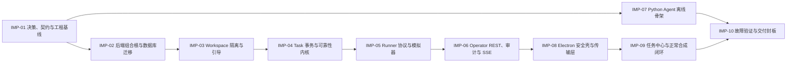

# Aden 桌面执行底座十阶段实施任务清单

> 文档类型：Feature 任务清单 / L2 执行包；Canonical：是，FEAT-ADEN-001 唯一实施任务与授权范围事实源  
> 版本：0.12.0；文档状态：Approved；创建：2026-09-12；更新：2026-09-13  
> Feature：FEAT-ADEN-001；风险：L2（仅合成 CORE）；进入真实账号、真实业务数据、模型 Provider、桌面控制或外部副作用后重新分流为 L3  
> 规范基线：用户级 `2026.09-r1`；工作区项目级 `2026.09-r5`；文档组织 `2026.09-r4`  
> 产出 / 适用阶段：为 Stage 6 任务拆分提前形成；批准后用于 Stage 7～8；Feature 当前主阶段只以[控制页](README.md)为准  
> 实施授权状态：Approved；当前实施状态：`IMP-01～10 Completed`  
> owner：用户负责范围、关键方案与授权决定；Codex 负责实施、自审和技术验证；独立安全复核待指定  
> 提出依据：2026-09-12 用户要求先形成可审核的十阶段实现文档，逐阶段明确需求、模块、文件结构、技术栈与最终实现范围，批准后再开工  
> 批准依据：2026-09-12 用户明确要求“收敛下，分这 10 个阶段进行开工，进入编码实现”  
> 上游：[控制页](README.md)、[功能规格](功能规格.md)、[总技术设计](技术设计.md)、[Python Agent 架构](Python%20Agent架构与实现方案.md)、[桌面端架构](桌面端架构与实现方案.md)、[RuoYi 后端架构](RuoYi后端架构与实现方案.md)  
> 证据入口：[验证记录](验证记录.md)；实际结果只写入该事实源，机器证据按需放入 `证据/`

## 1. 审核结论与最终交付

本计划把 FEAT-ADEN-001 拆成恰好十个实现阶段，编号为 `IMP-01`～`IMP-10`。这些编号是工程实现切片，不是项目治理规范中的 Stage 1～10。用户已批准本版并要求开工；截至 2026-09-13，`IMP-01`～`IMP-10` 的实现、自审与技术验证均已完成，治理 Stage 8 已完成，下一门为 Stage 9 用户验收。

批准已于 2026-09-12 生效：治理 Stage 6“任务拆分”记为 Completed，Stage 7 从 `IMP-01` 开始。若后续发现会改变产品结果、公共契约、真实环境或安全边界的例外，只将受影响阶段转为 `WaitingForApproval`，无关的安全本地工作不越过依赖门。

十阶段全部完成时，交付的是一条可恢复、可审计、零真实外部副作用的本地合成纵向闭环：

```text
合成 RuoYi 用户登录
→ 选择获授权 Workspace
→ 创建与推进合成 Task
→ Python Runner simulator 建立独立 Session
→ claim / lease / fencing / heartbeat / receipt
→ RuoYi + MySQL 原子推进并记录 Event / Outbox / Inbox / Audit
→ Electron 通过 REST 快照 + SSE 展示并在断线、重启后恢复
→ Python Agent Runtime 用本地 AgentJob fixture + FakeModelPort 验证离线候选链
```

最终源码组织为 **4 个实现单元 + 1 个非运行时契约目录**：

| 实现单元 | 数量与定位 | 十阶段完成后的范围 |
| --- | --- | --- |
| `ruoyi-backend/ruoyi-aden` | 保持 1 个 Maven 业务模块，由现有 `ruoyi-admin` 承载 | Workspace、Task、Runner、Event/Audit 四个当前领域闭环；Agent/Action 不落真实运行链 |
| `frontend/desktop/aden-desktop/` | 保持 1 个 npm / Electron 工程，main、preload、renderer 三个信任层 | 合成登录、任务中心、Runner 状态、能力总览、REST/SSE 恢复和安全负向行为 |
| `python/aden-runner/` | 新增 1 个 Python 3.12 工程 | 六个低权限包组成的 Runner simulator，无 UIA、Shell、浏览器、文件或外发能力 |
| `python/aden-agent-runtime/` | 新增 1 个 Python 3.12 工程 | 九个逻辑包的离线 Fake 骨架；只产候选，不接真实 Provider、不接服务端 AgentJob 链 |
| `contracts/aden/` | 新增 1 个非运行时目录 | OpenAPI 3.1 + JSON Schema 2020-12；Java、TypeScript、Python 跨边界字段唯一事实源 |

## 2. 本次审核要确认的实现决定

下表是本计划的实现基线。用户批准本计划即表示接受这些决定，除非在批准时逐项标注例外；后续普通类名、函数名和可替换测试工具由实施者在不改变边界的前提下确定。

| 决定 | 本计划采用的基线 | 不采用 / 不包含 |
| --- | --- | --- |
| 中心控制面 | RuoYi / `ruoyi-admin` 是唯一中心；MySQL `aden_*` 是业务事实源 | FastAPI 业务后端、Python 第二控制面、跨库事务 |
| Java 模块 | 只扩展既有 `ruoyi-aden`，内部采用 `api/application/domain/infrastructure/configuration` | 新增 Java Maven 子模块、首版拆微服务 |
| 机器契约 | OpenAPI 3.1 + JSON Schema 2020-12；契约先行，三端生成或校验 | Java、TypeScript、Python 各写一套状态枚举和 DTO |
| 数据迁移 | Aden 专属 Flyway：`classpath:db/aden-migration`、`aden_flyway_schema_history`、`cleanDisabled=true`、`baselineOnMigrate=false`；普通启动默认不迁移 | 默认 `classpath:db/migration`、静默 baseline、直接改生产库 |
| Workspace | 角色先用 `OWNER / OPERATOR / VIEWER`；RuoYi 权限与 membership 双门禁；无隐式超级管理员跨 Workspace | 仅凭 path/body 的 workspaceId 授权、`@DataScope` 代替资源隔离 |
| 命令权限 | `SUBMIT_FOR_VALIDATION` 要求 `aden:task:command`；`REQUEST_CANCEL` 要求 `aden:task:cancel`；Controller / Application guard 按命令再校验，`allowedCommands` 同样按权限投影 | 用 `aden:task:command` 隐式授予取消，或仅靠前端隐藏按钮 |
| Runner 身份 | `AdenCredential credentialId.secret` 换短期 `AdenRunner sessionId.secret`；只存 keyed digest；用户 JWT、Runner、未来 Agent Worker 三类身份隔离 | Runner 复用操作员 Token、直连数据库、长期明文 Secret |
| HTTP 错误 | `/api/v1/aden/**` 用独立有序 SecurityFilterChain / Advice 返回真实 HTTP status + 统一 ErrorEnvelope | 继承 RuoYi 的 HTTP 200 错误包、filter 与 controller 两套错误外形 |
| Aden Origin 隔离 | 在 `ruoyi-aden` 注册顺序早于共享 `CorsFilter` 的路径限定 Origin Guard；当前 `/api/v1/aden/**` 任何带 `Origin` 的请求和 preflight 都返回真实 403 ErrorEnvelope，无 Origin 的 Electron main / httpx 正常通过 | 修改共享 `ResourcesConfig`、依赖当前全局 `allowedOriginPattern("*")`、未批准的浏览器调用 |
| 桌面登录 | 使用现有 RuoYi `captchaImage → login → getInfo → logout`；无 refresh-token 接口；Token 默认仅在 Electron main 内存 | renderer/localStorage 保存 Token、保存密码、默认账号、虚构 refresh token |
| 网络地址 | 打包态仅允许固定 HTTPS Origin；仅显式 dev/test 且应用未打包时允许精确 loopback HTTP；拒绝 credentials、query、fragment；当前 REST / SSE `redirect: 'manual'` 并拒绝全部 3xx | 任意 URL、通配 `https:`、生产 HTTP、Token 放 query、自动跟随后再检查 final URL |
| 桌面产品形态 | 一个共享 Task Center，加 CORE/WX/PUR/COL 能力状态卡与 capability filter；状态来自服务端投影或明确本地构建常量 | 四套独立应用、静态文案冒充运行状态、当前注册审批路由 |
| Python Agent | `ModelAgentPort + FakeModelPort` 为必做；PydanticAI 仅作为自有端口后的可选 adapter 做离线兼容验证，默认 `provider_disabled` | 真实模型、API Key、费用、Provider 网络、Agent 直接推进 Task |
| Runner | 当前只实现合成 simulator，固定 fixture，出站目标限本地 RuoYi 测试服务 | Windows Service、Session Agent、UIA、浏览器、Shell、任意文件或外发 |
| 运行拓扑 | 当前只验证单个 `ruoyi-admin` 和进程级 broadcaster / scheduler，MySQL 为持久真相 | 多实例 fan-out、生产 HA、MQ、分布式调度 |
| 构建边界 | Electron 只要求 `electron-vite` 生产 bundle、三入口检查和窗口烟测 | 安装器、Authenticode、Fuses 产物门、自动更新、可分发声明 |
| 外部能力 | CORE/WX/PUR/COL 都显示独立状态和下一门禁，外部动作总开关默认关闭 | 微信、电商、ERP、供应商、验证码自动处理、发送、下单、付款 |

### 2.1 Workspace 角色矩阵

RuoYi 功能权限、有效 membership 与下表 role 三者必须同时满足；表中的“允许”不自行授予 `aden:*` 权限。平台创建 Workspace 发生在角色建立之前，只由独立 `aden:workspace:create` 控制，成功后当前用户成为首个 OWNER。

| 用例 | OWNER | OPERATOR | VIEWER |
| --- | --- | --- | --- |
| 列出自己的 Workspace、读取 bootstrap / Capability / Task / Runner 摘要 | 允许 | 允许 | 允许 |
| 读取 Task 详情、事件流与最小审计 | 允许 | 允许 | 允许 |
| 创建 Task（另需 `aden:task:create`） | 允许 | 允许 | 拒绝 |
| 提交校验（另需 `aden:task:command`） | 允许 | 允许 | 拒绝 |
| 请求取消（另需 `aden:task:cancel`） | 允许 | 允许 | 拒绝 |
| enroll / revoke Runner | 允许 | 拒绝 | 拒绝 |
| 增删成员、改变角色、删除 Workspace | 本 Feature 无 API | 本 Feature 无 API | 本 Feature 无 API |

本期真实 create API 只建立首个 OWNER；OPERATOR / VIEWER membership 仅由隔离测试 setup 配置以验证矩阵，不进入 migration、普通启动或公开业务接口。正式成员管理、OWNER 转移、最后一个 OWNER 保护和 Workspace 删除另开 Feature 决定，实施者不得在本期临时补入口。

数值型配置（Session TTL、lease、heartbeat、批量上限、SSE TTL、重试与保留期）在 `IMP-01` 统一进入类型化配置和契约样例，以“小值可故障测试、生产值可外部配置”为原则。它们不得散落成业务代码常量；改变安全或数据保留语义时另做决定记录。

## 3. 治理 Stage 与实现阶段的关系

| 层级 | 当前 / 后续事实 | 唯一维护位置 |
| --- | --- | --- |
| 治理 Stage 5 技术设计 | 2026-09-12 随用户批准实施基线而收口为 `Completed`；实时主阶段不在本文维护 | [Feature 控制页](README.md) |
| 治理 Stage 6 任务拆分 | 本文已获用户批准并记为 `Completed` | [Feature 控制页](README.md) + 本文批准依据 |
| 治理 Stage 7 开发实现 | `Completed`；`IMP-01`～`IMP-09` 已完成 | 本文 |
| 治理 Stage 8 审查验证 | `Completed`；`IMP-10` 已形成 P0 AC 技术证据并关闭阻断审查问题 | [验证记录.md](验证记录.md) |
| 治理 Stage 9 用户验收 | `InProgress`；2026-09-25 合成场景已执行，用户接受决定待确认；Codex 不代签 | [验收记录.md](验收记录.md) |
| 治理 Stage 10 上线就绪 | `Skipped`；当前没有部署目标，不代表已经发布 | [Feature 控制页](README.md) |

`IMP` 阶段状态只使用 `NotStarted / InProgress / WaitingForApproval / Blocked / Completed / Skipped / Cancelled`。`Completed` 仅表示该阶段产物和自审完成，不代替验证记录中的 `Pass`；文件存在、历史报告或 Mock 成功也不能自动改变状态。

## 4. 执行授权包

### 4.1 当前授权状态

本执行包已于 2026-09-12 获得用户批准，以下本地实施与验证作为同一授权包生效，无须逐文件重复确认。排除项和“重新确认条件”仍然有效。

### 4.2 批准后允许的范围

| 动作 | 精确范围 | 环境、数据与影响 | 当前 | 用户批准本版后 | 重新确认条件 |
| --- | --- | --- | --- | --- | --- |
| 文档与 ADR | 本 Feature、项目 `README.md`、项目 `决策/ADR-ADEN-*.md` | 只写当前事实，不创建第二套任务 / 证据源 | Approved | Approved | 改变其他项目事实或移动 / 删除历史 |
| 契约与源码 | `contracts/aden/`、`ruoyi-backend/ruoyi-aden/`、`frontend/desktop/aden-desktop/`、`python/aden-runner/`、`python/aden-agent-runtime/` | 本地文件变化；只含合成 fixture | Approved | Approved | 新顶层工程、Java 子模块、真实连接器或超出 Feature |
| RuoYi 窄集成 | `ruoyi-backend/pom.xml`、`ruoyi-admin/pom.xml`、`ruoyi-admin/src/main/resources/application*.yml`、`ruoyi-backend/sql/aden-permissions.sql` | 仅承载 Aden；不顺手重构共享认证 / 数据源 | Approved | Approved | 改共享认证语义、其他业务模块或默认角色权限 |
| 依赖与锁文件 | 上述五个实现范围内的 Maven / npm / uv 依赖文件和项目缓存 | 从现有或已记录可信 registry 下载；会产生网络、`node_modules`、Maven / uv cache 和磁盘占用 | Approved | Approved | 切换 registry、全局安装、未知 install script、真实 Provider SDK 启用 |
| 静态、构建与测试 | Maven、npm、uv/pytest、契约校验、Electron/Playwright、文档检查 | 合成 fixture；可能占用 CPU / 内存并生成 `target/out/report` | Approved | Approved | 大范围压力测试、真实数据、费用或非本项目回归 |
| 隔离数据库与缓存 | 本机 MySQL 8 一次性实例；Redis 隔离实例 | 2026-09-13 用户明确要求直接使用 MySQL，不依赖 Docker Desktop。当前实现只复用已安装的 MySQL 8 可执行文件，在模块 `target` 下创建一次性数据目录、随机 loopback 端口和随机数据库，测试后关闭并清理；不接现有数据目录或业务库 | Approved | Approved | 安装 Docker、启动现有 MySQL80 服务并接触其数据目录、固定端口、持久卷、放宽防火墙或非隔离实例 |
| 本地联调进程 | `ruoyi-admin`、Electron、Runner simulator、Agent Fake CLI | 仅 loopback、合成账号 / 数据；实际端口和进程生命周期写入验证记录 | Approved | Approved | 对外监听、真实账号 / Origin、后台常驻或高权限进程 |

不顺手修改 `admin-web`、上游若依基线或其他业务项目。隔离测试实例使用随机端口并核验真实宿主监听地址；确需固定测试端口时先确认空闲并在验证记录中写明。

### 4.3 明确不授权

- Git 暂存、提交、分支、合并、推送、PR、标签或发布。
- 连接、迁移、清理或写入生产 / 共享业务数据库；无隔离数据库时不得用业务库替代。
- 使用真实账号、真实聊天、真实商品、真实客户、真实供应商、真实订单或真实附件。
- 调用 OpenAI 或其他模型 Provider、产生费用、读取 Provider Secret，或访问微信、电商、ERP、更新源等真实外部系统。
- 安装高权限 Windows 服务、控制桌面、使用 UIA / 浏览器自动化 / Shell / 任意文件能力，或执行外部发送、提交、下单、付款。
- 构建或分发安装包、签名、自动更新、部署、上线或生产迁移。

### 4.4 停止、失败与恢复

- 契约字段、状态语义或身份边界无法三端一致时，停止受影响实现，回到治理 Stage 5 / `IMP-01`；不在客户端临时兼容两套真相。
- 需求或产品结果变化时回到治理 Stage 3，只重开受影响范围；不能用实现细节替代需求决定。
- 发现目标包含真实账号、数据、外部动作、模型费用或高权限桌面控制时，立即停止对应动作并另建 L3 执行包。
- MySQL / Java / Node / Python 环境缺失时，先记录 `Blocked` 和准确缺口；Docker 缺失本身不再构成 MySQL 测试阻塞。不得连接业务数据库或全局安装未知工具绕过。
- Migration 失败时保留必要日志和 Schema 状态用于诊断；测试数据只通过本轮实例自己的管理命令关停，并在路径校验后清理模块 `target` 或 `test-results/aden-e2e-local-*` 下的一次性目录，不运行 Flyway `clean` 或递归删除工作区。
- 同一失败原因最多在修复或获得新证据后重试两次；仍无进展则保留真实失败，报告最小下一步。

## 5. 当前基线与目标文件结构

以下目录树表达职责和计划落点；普通类名可以在实施中按同一边界微调，但不得因此新增顶层工程、Java Maven 子模块或第二套契约。

### 5.1 当前可见基线

```text
ruoyi-backend/ruoyi-aden/
├── pom.xml
├── src/main/java/com/ruoyi/aden/package-info.java
├── src/main/java/com/ruoyi/aden/domain/task/
│   ├── AdenTaskCommand.java
│   ├── AdenTaskState.java
│   ├── AdenTaskTransitions.java
│   └── AdenTaskTransitionException.java
└── src/test/java/com/ruoyi/aden/domain/task/AdenTaskTransitionsTest.java

frontend/desktop/aden-desktop/
├── package.json / package-lock.json
├── electron.vite.config.ts / tsconfig*.json
├── src/main/{index.ts,runtime-config.ts}
├── src/preload/{index.ts,index.d.ts}
├── src/renderer/index.html
├── src/renderer/src/{main.ts,App.vue,module-catalog.ts,styles.css}
├── tests/runtime-config.test.ts
└── scripts/check-build.mjs

contracts/aden/       # 不存在
python/aden-runner/          # 不存在
python/aden-agent-runtime/   # 不存在
```

工作区当前还可见 `ruoyi-backend/ruoyi-aden/target/`、`frontend/desktop/aden-desktop/node_modules/`、`frontend/desktop/aden-desktop/out/` 和 TypeScript build info 等生成物；它们不属于目标源码树，也不构成本轮验证证据。

### 5.2 当前实施环境前置

| 项目 | 2026-09-12 只读核查事实 | 对实施的影响 |
| --- | --- | --- |
| OS | Windows 11 x64 | Electron / PowerShell 本地链可实施 |
| Maven / Java | Maven 3.9.15 运行于 Temurin JDK 21.0.10；项目编译目标 Java 17 | IMP-02 设置 compiler `release=17`，最终仍需 Java 17 运行验证或如实记录缺口 |
| Node / npm | Node 24.15.0、npm 11.12.1 | 依赖兼容性由 IMP-01 探针和 lockfile 证明 |
| Python / uv | Python 3.12.4、uv 0.11.18 | 符合两个新 Python 工程的基线 |
| MySQL | 本机安装 MySQL 8.0.46；现有 `MySQL80` 服务保持停止 | 2026-09-13 已用同版本可执行文件启动一次性 loopback 实例并完成 IMP-02；未接现有服务数据目录 |
| Docker | 当前命令不可用 | 不参与本 Feature 当前实现或验收；MySQL 统一走本机已安装的 MySQL 8 一次性隔离实例 |

批准本计划允许下载已锁定工程依赖；2026-09-13 用户补充批准直接使用本机 MySQL，并明确不需要 Docker Desktop。当前批准落点仅是一次性隔离实例，不等于安装 Docker Desktop、接触现有 `MySQL80` 数据目录或写入业务数据库；这些动作若实际需要，仍须补充环境影响与授权。

### 5.3 十阶段完成后的目标结构

```text
contracts/aden/
├── README.md
├── openapi/aden-v1.yaml
├── schemas/
│   ├── common/{error,event-envelope}.v1.schema.json
│   ├── workspace/{workspace,workspace-bootstrap,capability-projection}.v1.schema.json
│   ├── task/{task,task-command,task-event}.v1.schema.json
│   ├── runner/{session,task-package,receipt}.v1.schema.json
│   └── agent/{agent-job,run-spec,context-view,tool-manifest,candidate}.v1.schema.json
├── examples/{operator,runner,agent}/
└── scripts/validate-contracts.mjs

ruoyi-backend/ruoyi-aden/
├── pom.xml
├── src/main/java/com/ruoyi/aden/
│   ├── configuration/
│   ├── api/{operator,runner,stream,error}/
│   ├── application/{workspace,task,runner,event,idempotency}/
│   ├── domain/{workspace,task,runner,event,audit}/
│   ├── infrastructure/{persistence,security,outbox,stream,time}/
│   └── migration/                              # 一次性 AdenMigrationCli；不是业务服务
├── src/main/resources/
│   ├── db/aden-migration/
│   │   ├── V1__aden_workspace.sql
│   │   ├── V2__aden_task_execution.sql
│   │   ├── V3__aden_runner.sql
│   │   └── V4__aden_reliability.sql
│   └── mapper/aden/Aden*Mapper.xml
└── src/test/
    ├── java/com/ruoyi/aden/{contract,domain,migration,integration,security,concurrency}/
    └── resources/fixtures/

ruoyi-backend/ruoyi-admin/
├── pom.xml                                      # 仅必要承载依赖
└── src/main/resources/application*.yml          # Aden 默认启用；须先配置预期 MySQL 库并准备 V4 schema，隔离 test profile 可显式关闭
ruoyi-backend/sql/aden-permissions.sql

python/aden-runner/
├── pyproject.toml / uv.lock / README.md
├── src/aden_runner/{simulator,protocol,transport,lease,receipts,fixtures}/
└── tests/{unit,contract,fault}/

python/aden-agent-runtime/
├── pyproject.toml / uv.lock / README.md
├── src/aden_agent_runtime/
│   ├── bootstrap/
│   ├── contracts/
│   ├── client/
│   ├── runtime/
│   ├── agents/
│   ├── model_ports/
│   ├── tools/
│   ├── policy/
│   └── observability/
└── tests/{unit,contract,golden,fault}/

frontend/desktop/aden-desktop/
├── package.json / package-lock.json
├── src/main/
│   ├── bootstrap/
│   ├── config/
│   ├── security/
│   ├── auth/
│   ├── transport/
│   └── ipc/
├── src/preload/{index.ts,api.ts,index.d.ts}
├── src/shared/{contracts,generated}/
├── src/renderer/src/
│   ├── router/
│   ├── stores/
│   ├── layouts/
│   ├── components/system/
│   └── features/{auth,task-center,runner-status,capability-overview}/
├── tests/{unit,integration,component,e2e}/
└── scripts/

文档/项目/智能体桌面端项目/
├── 决策/                                  # 需要独立生命周期的 ADR 才创建
└── 功能/FEAT-ADEN-001-桌面执行底座/
    ├── README.md / 功能规格.md / 技术设计.md
    ├── Python Agent架构与实现方案.md
    ├── 桌面端架构与实现方案.md
    ├── RuoYi后端架构与实现方案.md
    ├── 任务清单.md                         # 本文件，唯一实施状态源
    ├── 验证记录.md                         # 首次真实验证时创建
    ├── 验收记录.md                         # 用户实际验收时创建
    └── 证据/                               # 有实际机器证据时创建
```

## 6. 十阶段总览与依赖



编号表示成果切片和审阅顺序。阶段内可以并行，例如 `IMP-02` 的 DDL 与 Java 配置、`IMP-08` 的 main 安全策略与 preload Schema；`IMP-07` 与 `IMP-08` 在各自入口成立后也可并行，最终由 `IMP-10` 汇合。其他阶段只有在图中依赖出口成立后才记为开始。可以在 `IMP-01` 契约稳定后提前编写后续 fixture 或测试骨架，但不得将其记成后续阶段完成，也不得用 stub 冒充跨系统联调。

| 阶段 | 状态 | 主要需求 | 主要实现单元 | 核心结果 | 严格依赖 |
| --- | --- | --- | --- | --- | --- |
| IMP-01 决策、契约与工程基线 | Completed | REQ-01/02/04/05/06/07/08/09/10/11 | 契约、四个工程、文档 | 机器契约、ADR、构建与证据入口可执行 | 本计划 Approved |
| IMP-02 后端组合根与数据库迁移 | Completed | REQ-01/03/08/10 | RuoYi、MySQL | 单模块组合根、12 表、专属迁移 | IMP-01 Completed |
| IMP-03 Workspace 隔离与引导 | Completed | REQ-01/04/10 | RuoYi、MySQL | 身份、成员、角色、受控创建首个 Workspace | IMP-02 Completed |
| IMP-04 Task 事务与可靠性内核 | Completed | REQ-02/03/07/10 | RuoYi、MySQL | 状态、CAS、幂等、Event/Outbox/Inbox/Audit | IMP-03 Completed |
| IMP-05 Runner 协议与模拟器 | Completed | REQ-04/07/08/10 | RuoYi、`aden-runner` | Session、claim、lease、fence、receipt | IMP-04 Completed |
| IMP-06 Operator REST、审计与 SSE | Completed | REQ-01/02/03/06/07/09/10 | RuoYi、契约 | 可供桌面消费的 API、投影和恢复事件流 | IMP-05 Completed |
| IMP-07 Python Agent 离线骨架 | Completed | REQ-08/10/11 | `aden-agent-runtime`、契约 | Fake 候选链、Scope/取消/失租保护、零外联 | IMP-01；排期上在 IMP-06 后启动，可与 IMP-08 并行 |
| IMP-08 Electron 安全壳与传输层 | Completed | REQ-01/05/06/08/10 | `aden-desktop` | main 登录会话、REST/SSE、窄 IPC、安全边界 | IMP-06 Completed |
| IMP-09 任务中心与正常合成闭环 | Completed | REQ-01/02/04/05/06/07/09/10 | RuoYi、Electron、Runner simulator、MySQL / Redis 测试环境 | 登录到成功/取消的正常纵向链、四能力状态 | IMP-08 Completed |
| IMP-10 故障验证与交付封板 | Completed | 全部 REQ / BR / AC | 全部 | 故障集、审查、实际 EV、UAT 输入与非发布结论 | IMP-07、09 Completed |

## 7. 需求与验收追溯

### 7.1 REQ 到实现阶段

| REQ | 主实现阶段 | 集成 / 最终验证阶段 |
| --- | --- | --- |
| ADEN-CORE-REQ-01 RuoYi 唯一控制面 | IMP-01、02、03、06 | IMP-08、09、10 |
| ADEN-CORE-REQ-02 显式状态与取消安全点 | IMP-01、04 | IMP-05、06、09、10 |
| ADEN-CORE-REQ-03 MySQL 与事务可靠性 | IMP-02、04 | IMP-05、06、10 |
| ADEN-CORE-REQ-04 Runner 独立身份与租约 | IMP-01、03、05 | IMP-09、10 |
| ADEN-CORE-REQ-05 桌面本地壳与 RuoYi 合成登录 | IMP-01、08 | IMP-09、10 |
| ADEN-CORE-REQ-06 REST + SSE 恢复 | IMP-01、06、08 | IMP-09、10 |
| ADEN-CORE-REQ-07 重复、竞争、旧写入不重复推进 | IMP-04、05、06 | IMP-09、10 |
| ADEN-CORE-REQ-08 合成数据与外部动作关闭 | IMP-01、05、07、08 | IMP-09、10 |
| ADEN-CORE-REQ-09 四能力独立状态与门禁 | IMP-01、06、09 | IMP-10 |
| ADEN-CORE-REQ-10 correlation、版本、错误与证据 | IMP-01、03、04、05、06、07、08 | IMP-09、10 |
| ADEN-CORE-REQ-11 Python Agent 离线 Fake 骨架 | IMP-01、07 | IMP-10 |

### 7.2 AC 到任务与证据

| AC | 主实现阶段 | 计划最终证据 |
| --- | --- | --- |
| AC-01 RuoYi 聚合构建 | IMP-01、02 | EV-BUILD-JAVA、EV-BUILD-REACTOR |
| AC-02 RuoYi 权限与 Workspace | IMP-03、06 | EV-SEC-WORKSPACE、EV-API-OPERATOR |
| AC-03 合法状态迁移与版本 | IMP-04、06 | EV-DOMAIN-STATE、EV-DB-CAS |
| AC-04 取消安全点与终态 | IMP-04、05 | EV-DOMAIN-CANCEL、EV-E2E-CANCEL |
| AC-05 Task / Outbox 原子事务 | IMP-02、04 | EV-DB-TRANSACTION、EV-OUTBOX-RECOVERY |
| AC-06 幂等请求与回执 | IMP-04、05、06 | EV-API-IDEMPOTENCY、EV-RUNNER-RECEIPT |
| AC-07 Runner 注册、能力、租约与恢复 | IMP-03、05 | EV-RUNNER-SESSION、EV-RUNNER-FAULT |
| AC-08 旧 token、乱序与双 Runner | IMP-05 | EV-RUNNER-CONCURRENCY |
| AC-09 Electron 三入口 bundle 构建 | IMP-08 | EV-DESKTOP-TYPE、EV-DESKTOP-BUILD、EV-DESKTOP-SMOKE |
| AC-10 Electron 安全默认拒绝 | IMP-08 | EV-DESKTOP-SECURITY |
| AC-11 SSE 断线与快照恢复 | IMP-06、08 | EV-SSE-REPLAY、EV-E2E-RECOVERY |
| AC-12 Worker 崩溃恢复且不重复执行 | IMP-04、05 | EV-RUNNER-CRASH |
| AC-13 无真实目标、账号、外发、UIA、ERP、模型 | IMP-05、07、08、09 | EV-STATIC-EXTERNAL、EV-NETWORK-OBSERVE |
| AC-14 能力总览卡与共享 Task Center 筛选 | IMP-06、09 | EV-DESKTOP-CAPABILITY |
| AC-15 任务与审计可追溯 | IMP-03、04、06、08、09 | EV-AUDIT-TRACE |
| AC-16 Python Agent 离线 Fake 与零外联 | IMP-01、07 | EV-AGENT-CONTRACT、EV-AGENT-FAULT、EV-AGENT-NETWORK |
| AC-17 RuoYi 合成登录与会话失效 | IMP-08、09 | EV-DESKTOP-AUTH、EV-E2E-AUTH |

## IMP-01 — 决策、契约与工程基线

> 状态：Completed（2026-09-13）  
> 前置：已于 2026-09-12 获得用户批准；实施授权为 `Approved`  
> 关联：REQ-01/02/04/05/06/07/08/09/10/11；AC-01、13、14、16 的基线

### 实现单元与文件范围

```text
contracts/aden/{README.md,openapi/,schemas/,examples/,scripts/}
文档/项目/智能体桌面端项目/决策/ADR-ADEN-*.md
ruoyi-backend/{pom.xml,ruoyi-aden/pom.xml,ruoyi-admin/pom.xml}
frontend/desktop/aden-desktop/{package.json,package-lock.json}
python/aden-runner/{pyproject.toml,uv.lock,README.md}
python/aden-agent-runtime/{pyproject.toml,uv.lock,README.md}
本 Feature 的 README.md、功能规格.md、技术设计.md、任务清单.md
```

### 实现任务与逻辑

| TASK-ID | 任务 |
| --- | --- |
| ADEN-TASK-001 | 建立术语、状态、主体、`state × actor × command`、命令级权限、错误码、版本、64-bit wire scalar 和兼容规则词典，明确 Operator / Runner / Agent 三类外部身份，以及 Validator / Coordinator / Runner receipt adapter 内部 actor 与 workspace 归属 |
| ADEN-TASK-002 | 编写 Operator / Runner 当前 OpenAPI；为 Workspace、`WorkspaceBootstrapSnapshot`、Task、公开 `OperatorTaskCommand`、RunnerSession、TaskPackage、Receipt、EventEnvelope、CapabilityProjection 和 Error 建 Schema；JSON Schema 是 body / event DTO 的唯一机器事实源，OpenAPI 3.1 的 components / request / response 只通过相对 `$ref` 引用，OpenAPI 自己只维护 path / status / header / security / path parameter；内部 DomainCommand 不进入 Operator 传输枚举，可能增长的 64-bit 值统一用受限十进制字符串 |
| ADEN-TASK-003 | 为 AgentJob、RunSpec、ContextView、ToolManifest、Candidate 建 `experimental / provider-disabled` Schema，但不在当前 OpenAPI 发布 Agent Worker 路径 |
| ADEN-TASK-004 | 建立 Workspace bootstrap 成功 / 跨投影水位、命令权限拒绝、合法校验失败的 HTTP 200 + FAILED Task / ETag、无状态变化的 422、版本冲突、幂等冲突、游标过期、旧 fence、未知 Schema，以及 `2^53-1 / 2^53 / Long.MAX_VALUE / 溢出` 等 64-bit 边界正负 example，并让同一组 example 同时通过 OpenAPI 与 JSON Schema 机器校验 |
| ADEN-TASK-005 | 对 Java / TypeScript / Python 的生成或校验工具做兼容探针，校验 / bundle / resolve 全部 `$ref`，检测 OpenAPI 未重复手写 body/event DTO Schema；记录唯一生成命令、输出目录、不可手改文件和升级规则 |
| ADEN-TASK-006 | 记录控制面、Flyway、身份隔离、桌面网络与 Python Provider 边界的 ADR；建立首版类型化配置键和测试值，不在业务类散落常量 |
| ADEN-TASK-007 | 建立 `验证记录.md` 的实际 EV 入口并记录四个工程的真实构建基线；失败保持失败，不修成与本阶段无关的“大重构” |

契约先冻结服务端拥有的字段：`workspaceId`、主体、状态、版本、fencing token、审计时间和 correlation 不能由普通创建请求自由赋值。当前公开 `OperatorTaskCommand` 只含 `SUBMIT_FOR_VALIDATION` 与 `REQUEST_CANCEL`；`VALIDATION_PASSED / VALIDATION_FAILED / START / COMPLETE / FAIL / WAIT_* / RESUME / CONFIRM_CANCELED` 等内部 DomainCommand 永不从 Operator DTO 反序列化。操作员 Task 写入使用 `Idempotency-Key`，命令同时使用 `If-Match`；Runner 只提交强类型 receipt，服务端 adapter 再产生内部命令。Runner 回执使用 delivery / receipt 级幂等和请求 hash。SSE 事件包至少固定 schema version、event id、workspace、aggregate id/version、event type、occurredAt、correlation 和公开 payload。

Wire scalar 规则固定：Task / aggregate version、event sequence、Runner / credential / Session epoch、fencing token、receipt sequence，以及若公开的 RuoYi BIGINT id，都用 JSON `string` + canonical non-negative decimal 表示，值域为 `0..9223372036854775807`，禁止前导零、指数、小数和符号；Java 在边界解析为受检 `long` / value object，TypeScript 保持 `string` 并用共享 decimal comparator，Python 可解析为受界 `int` 但序列化仍为 string。`attemptNo` 等有业务小上限的计数使用 JSON int32 并由配置 / Schema 限界；cursor 与 ETag 始终 opaque。任何一端不得先转 JavaScript `number` 再比较或回写。

RuoYi 平台认证接口不复制进 `contracts/aden/`，由桌面 main 的平台认证 adapter 适配现有 `/captchaImage`、`/login`、`/getInfo`、`/logout`。验证码实际 JPEG 内容必须有 fixture / 签名测试，不能照搬旧管理端的 GIF 文案。

### 技术栈

- OpenAPI 3.1、JSON Schema 2020-12、HTTP ETag / `If-Match`、Idempotency-Key、SSE。
- Java 17 / Spring Boot 4.0.6 / RuoYi 3.9.2；Electron 44.3.0 / Vue 3.5.26 / TypeScript 5.7.3；Python `>=3.12,<3.13`。
- JSON Schema runtime validator、TypeScript OpenAPI 类型生成器、Python Pydantic v2 模型生成 / 校验器。精确工具与版本须通过本阶段兼容探针后锁入依赖文件，不以本文猜测版本冒充验证。

### 交付能力与计划证据

- 三端对同一 example 得到一致的字段、枚举和拒绝结果；生成物路径明确，手写领域模型与传输 DTO 有显式 mapping。
- `contracts/aden/README.md` 能说明 current 与 experimental 契约、版本升级和消费者更新顺序。
- 计划证据：契约 lint、Schema example round-trip、未知字段 / 未知枚举拒绝、三端最小编译、依赖树和 ADR 链接。

### 退出门、非目标与恢复

只有当 current 契约可机器解析、所有当前 example 通过、三个消费者都能生成或校验、关键决定有 ADR、实际基线写入验证记录时，`IMP-01` 才能 `Completed`。本阶段不实现业务 Controller、数据库表、UI 页面或 Provider。若工具无法表达同一 Schema，应调整工具或契约，不并存第二套字段；回退时删除未被下游消费的生成物并保留契约与失败证据，不回滚用户既有代码。

完成记录：ADEN-TASK-001～007 均已完成；机器契约、35 个正负案例、17 个类型化配置键、三语言消费者探针、独立 ADR、两个 Python 工程基线和四工程实际构建证据均已落地。退出依据见[验证记录](验证记录.md#2-imp-01-验证矩阵)；该结论不外推为后续 API、数据库、Runner 或 UI 已实现。

## IMP-02 — 后端组合根与数据库迁移

> 状态：Completed  
> 前置：IMP-01 Completed  
> 关联：REQ-01/03/08/10；AC-01、05、13、15

### 实现单元与文件范围

```text
ruoyi-backend/ruoyi-aden/pom.xml
ruoyi-backend/ruoyi-aden/src/main/java/com/ruoyi/aden/configuration/
ruoyi-backend/ruoyi-aden/src/main/java/com/ruoyi/aden/migration/
ruoyi-backend/ruoyi-aden/src/main/java/com/ruoyi/aden/infrastructure/time/
ruoyi-backend/ruoyi-aden/src/main/resources/db/aden-migration/V1__*.sql ... V4__*.sql
ruoyi-backend/ruoyi-aden/src/test/java/com/ruoyi/aden/{migration,architecture}/
ruoyi-backend/ruoyi-admin/{pom.xml,src/main/resources/application*.yml}
ruoyi-backend/sql/aden-permissions.sql
```

### 实现任务与逻辑

| TASK-ID | 任务 |
| --- | --- |
| ADEN-TASK-008 | 扩展 `ruoyi-aden` 依赖和四层包骨架，设置 Java compiler `release=17`，建立 `AdenConfiguration`、`AdenProperties`、UTC `Clock` 与 ID 生成端口；domain 保持纯 Java |
| ADEN-TASK-009 | 实现一次性 `AdenMigrationCli`，显式提供 `baseline / migrate / validate` 三种模式，固定 datasource、location 与 history table，并在动作前校验预期数据库名和 RuoYi 标志表；普通 `ruoyi-admin` 只做 Schema validate / fail-closed，不自动迁移，Schema guard 在 CLI migration 完成后运行且 CLI 内禁用应用启动 guard |
| ADEN-TASK-010 | 编写 V1 Workspace、V2 Task、V3 Runner、V4 Reliability 四个只增量 migration，创建 12 张业务表及必要索引 / 组合约束；在 Workspace 保存提交有序的 `last_event_seq` 水位 |
| ADEN-TASK-011 | 明确 UUID 字符串、ASCII binary collation、`DATETIME(6)` + UTC converter、数据库 signed BIGINT ↔ wire decimal string、稳定字符串枚举和有界 JSON 的持久化约束 |
| ADEN-TASK-012 | 提供幂等权限 SQL，只定义 `aden:*` 菜单 / 权限字符，不静默创建 workspace、默认成员、默认 Runner secret 或角色授权 |
| ADEN-TASK-013 | 本机一次性 MySQL 8 先导入只读基线 `ruoyi-backend/sql/ry_20260417.sql`，再验证 fresh migrate、显式 baseline 0、migrate、validate、重复 migrate、checksum、空库 / 错库保护和失败恢复；测试 seed 独立于 migration，不依赖 Docker Desktop |

`local/test` profile 或等价启动参数必须显式设置 `server.address=127.0.0.1`；不能依赖 Spring Boot 默认绑定行为来声称服务只在本机可达。该设置只约束合成联调配置，不擅自改变现有生产 profile。

12 张业务表固定为：

```text
aden_workspace
aden_workspace_member
aden_task
aden_task_step
aden_runner
aden_runner_credential
aden_runner_session
aden_runner_delivery
aden_event
aden_outbox
aden_inbox
aden_audit_event
```

`aden_flyway_schema_history` 是迁移元数据，不计入 12 张业务表。所有 workspace-owned 表、唯一约束和查询索引显式带 `workspace_id`；Aden 表不对 `sys_user` 建级联外键，只保存稳定 `ruoyi_user_id BIGINT`。后续 Agent Worker / Job 和真实 Action 表族不在本阶段提前创建。

沿用 RuoYi 现有 `classpath*:mapper/**/*Mapper.xml` 与 `@MapperScan("com.ruoyi.**.mapper")`：所有 interface 位于以 `.mapper` 结尾的包且命名 `*Mapper.java`，对应 XML 放在 `src/main/resources/mapper/aden/` 并命名 `*Mapper.xml`。不放宽共享 `mapperLocations`；启动 / statement 装配测试必须在进入业务 API 前发现漏扫。

### 技术栈

- Java 17、Spring Boot 4.0.6、Spring MVC / Validation / Transaction、MyBatis Spring Boot 4.0.1。
- MySQL 8 / InnoDB、Flyway Core + `flyway-mysql`、JUnit 5、本机一次性 MySQL 测试脚本、架构依赖检查。
- Migration location 固定为 `classpath:db/aden-migration`，history table 固定为 `aden_flyway_schema_history`；`cleanDisabled=true`、`baselineOnMigrate=false`。唯一写 Schema 的入口是短生命周期 `AdenMigrationCli`；正常应用启动只校验期望版本并 fail-closed，不能与 migration 并发，也不能因 guard 尚未满足而让 CLI 自己启动失败。

### 交付能力与计划证据

- `ruoyi-admin` 在 Aden 关闭时仍按原平台工作；启用 Aden 但 Schema 版本不满足时 fail-closed，不带病注册业务能力。
- Fresh MySQL 和模拟已有 RuoYi 非空库都能走显式、可审计迁移；Interview PostgreSQL migration 不会被扫描。
- 计划证据：Maven 模块 / Reactor 编译，迁移与 Schema contract 测试，表 / 索引 / 约束快照，checksum 篡改负向测试和隔离实例清理记录。

### 退出门、非目标与恢复

12 表、索引、时间和迁移门全部在隔离 MySQL 8 通过，且普通启动未隐式迁移，才能完成本阶段。此处不执行生产 / 共享业务库 migration，不创建业务 seed。DDL 失败只关停本轮 MySQL 并经严格路径校验后重建模块 `target` 下的一次性实例；不得运行 Flyway `clean`、修改已执行 migration 或把隔离测试成功写成生产迁移已就绪。

阶段记录（2026-09-13）：ADEN-TASK-008～013 全部实现。MySQL 8.0.46 一次性实例在随机 loopback 端口完成 RuoYi 基线导入、显式 baseline 0、V1～V4、重复 migrate、validate、错库 / 空库保护、checksum 篡改与 Schema 回读，4/4 集成测试通过；实例、随机数据库和模块 `target` 下临时数据目录均已清理，现有 `MySQL80` 服务与数据目录未使用。IMP-02 已完成并进入 IMP-03；详见[验证记录](验证记录.md#4-imp-02-验证矩阵)。

## IMP-03 — Workspace 隔离与受控引导

> 状态：Completed（2026-09-13）  
> 前置：IMP-02 Completed  
> 关联：REQ-01/04/10；AC-02、07、15

### 实现单元与文件范围

```text
ruoyi-backend/ruoyi-aden/src/main/java/com/ruoyi/aden/
├── domain/workspace/
├── application/workspace/
├── infrastructure/security/
├── infrastructure/persistence/mapper/Aden*Workspace*Mapper.java
└── api/{operator/{WorkspaceController,admin/*},common,error}
ruoyi-backend/ruoyi-aden/src/main/resources/mapper/aden/Aden*Workspace*Mapper.xml
ruoyi-backend/ruoyi-aden/src/test/java/com/ruoyi/aden/{security,integration}/
```

### 实现任务与逻辑

| TASK-ID | 任务 |
| --- | --- |
| ADEN-TASK-014 | 实现 Workspace、Member、Role、Status、Version 领域对象和 repository port，角色固定为 OWNER / OPERATOR / VIEWER；MyBatis interface 以 `Mapper.java` 结尾并位于 `.mapper` 包，XML 以 `Mapper.xml` 结尾放在 `mapper/aden/`，沿用现有扫描规则 |
| ADEN-TASK-015 | 将 RuoYi `LoginUser` 适配为 Aden Operator principal；在 Runner chain 之后、RuoYi 默认 chain 之前建立 `@Order(2)` + `/api/v1/aden/**` matcher 的 Aden Operator `SecurityFilterChain`，复用现有 JWT filter 但使用 Aden 专用 AuthenticationEntryPoint / AccessDeniedHandler，并设为 stateless、关闭 CSRF / request cache / form login / HTTP Basic；在 `ruoyi-aden` 内以明确 order 注册早于共享 `CorsFilter` 的 Aden Origin Guard，当前对 `/api/v1/aden/**` 任何带 Origin 的请求（含 preflight）返回真实 403 ErrorEnvelope，无 Origin 的 Electron main / httpx 通过，不修改共享 `ResourcesConfig`；同时建立 correlation filter、`AdenRequestContext`、限定 Aden 包的高优先级 `@RestControllerAdvice` 和基础 ErrorEnvelope，使 400/401/403/404 返回真实 HTTP 状态。请求体不能覆盖 actor 或授权 workspace，响应不能泄漏堆栈、SQL、路径或 Token |
| ADEN-TASK-016 | 实现功能权限 + membership + workspace role + resource.workspace_id 四层门禁；跨 workspace 资源对外统一 404、内部写最小审计 |
| ADEN-TASK-017 | 实现 `GET /api/v1/aden/workspaces` 和受控 `POST /api/v1/aden/admin/workspaces`；同事务创建 workspace、首个 OWNER 和审计 |
| ADEN-TASK-018 | 实现并测试 2.1 固定的 OWNER / OPERATOR / VIEWER 正负矩阵，覆盖 POST 不被 CSRF / request cache 误拦、IDOR、body/path 替换、超级管理员和 wildcard permission 不隐式绕过 membership；任意 Origin 和 preflight 都在共享宽泛 `CorsFilter` 前返回 403，响应不得出现 `Access-Control-Allow-Origin: *`，无 Origin 请求不受影响；实测 400/401/403/404 的 HTTP status + ErrorEnvelope，并证明不会退回 RuoYi 的 HTTP 200 错误包 |

Repository 的 workspace-owned 方法强制接收 `WorkspaceId`，MyBatis SQL 显式包含 `workspace_id = #{workspaceId}`。RuoYi `@DataScope` 不承担 Aden Workspace 隔离。平台级管理用例与 workspace 资源用例分开；首版没有隐式 break-glass，若未来需要跨空间应急访问，必须另做审计、时限和授权设计。

### 技术栈

RuoYi JWT / Redis 会话、Spring Security `@PreAuthorize` 与受控 Filter / interceptor、MyBatis XML、MySQL 8、MockMvc、本机 MySQL 一次性隔离测试脚本。

### 交付能力与计划证据

- 合成管理员可显式建立首个 workspace 和 OWNER；普通用户只能列出有效 membership。
- 无 JWT 为真实 HTTP 401；有 JWT 无功能权限为真实 HTTP 403；有功能权限但非成员或资源跨空间为真实 HTTP 404。Aden API 不能继承 RuoYi 默认“HTTP 200 + body code”错误语义；filter 层和 controller / method-security 层都必须输出同一 ErrorEnvelope。
- 计划证据：权限矩阵、Mapper SQL 审计测试、MockMvc + MySQL 集成、审计记录最小化检查。

### 退出门、非目标与恢复

所有对 workspace-owned 资源的访问都通过同一服务端上下文和负向矩阵，且没有隐式跨空间入口时才能完成。不修改 `admin-web`，不把管理员 UI 纳入本 Feature。若发现共享 RuoYi super-admin 语义不可直接收窄，先停下受影响 API 并通过显式 Aden guard 解决，不修改全平台认证逻辑。

阶段记录（2026-09-13）：ADEN-TASK-014～018 全部实现。已建立 Workspace / membership / role 领域与 MyBatis 持久化、RuoYi `LoginUser` 适配、Aden `@Order(2)` 无状态安全链、Origin / correlation / ErrorEnvelope 边界、四层门禁、独立事务的 `ADEN_WORKSPACE_FORBIDDEN` 最小审计，以及 Workspace 列表和受控创建 API。55 个无外部依赖单测、7 个本机 MySQL 8.0.46 集成测试和 15 模块 RuoYi 聚合编译通过；一次性实例与随机数据库已清理，现有 `MySQL80` 未启动。详见[验证记录](验证记录.md#5-imp-03-验证矩阵)。

## IMP-04 — Task 事务与可靠性内核

> 状态：Completed  
> 前置：IMP-03 Completed  
> 关联：REQ-02/03/07/10；AC-03、04、05、06、12、15

### 实现单元与文件范围

```text
ruoyi-backend/ruoyi-aden/src/main/java/com/ruoyi/aden/
├── domain/task/
├── domain/{event,audit}/
├── application/{task,idempotency,event}/
├── infrastructure/persistence/mapper/Aden{Task,TaskStep,Event,Outbox,Inbox,Audit}*Mapper.java
└── infrastructure/outbox/
ruoyi-backend/ruoyi-aden/src/main/resources/mapper/aden/Aden{Task,TaskStep,Event,Outbox,Inbox,Audit}*Mapper.xml
ruoyi-backend/ruoyi-aden/src/test/java/com/ruoyi/aden/{domain,integration,concurrency}/
```

### 实现任务与逻辑

| TASK-ID | 任务 |
| --- | --- |
| ADEN-TASK-019 | 将现有静态迁移代码收敛到 Task 聚合，补齐 TaskId、TaskVersion、TaskStep、TaskType、CapabilityCode、CorrelationId、ActorType、公开 OperatorCommand 到内部 DomainCommand 的显式 adapter 和领域事件；领域命令对象不直接作为 Controller DTO |
| ADEN-TASK-020 | 建立唯一 `state × actor × command` 迁移表：Operator 当前只可发 `SUBMIT_FOR_VALIDATION / REQUEST_CANCEL`，分别要求 `aden:task:command / aden:task:cancel`；当前合成 Validator 是同一应用用例内的纯确定性、零网络函数，在 SUBMIT 事务内产生 `VALIDATION_PASSED / FAILED`；Coordinator / 通过鉴权的 Runner receipt adapter 才能产生其余内部命令。落实终态不可恢复、`CANCEL_REQUESTED` 两阶段取消和结果未知不得猜测终态 |
| ADEN-TASK-021 | 实现 `task_id + workspace_id + version + expected_state` CAS；成功一次只增一个版本，冲突返回领域错误而非覆盖 |
| ADEN-TASK-022 | 实现创建 / 命令幂等指纹：同 key 同 hash 返回原事实，同 key 异 hash 冲突；禁止按原始 JSON 字段顺序计算 hash |
| ADEN-TASK-023 | 在单个事务内完成 Task / Step 更新、不可变 Event、Outbox、Inbox 与 Audit；`SUBMIT_FOR_VALIDATION` 同一事务按连续 aggregateVersion 应用 `DRAFT→VALIDATING→QUEUED/FAILED` 并为每次迁移分配连续事件序号，幂等事实保存最终响应。所有产生事件的写事务先锁定 Workspace 水位，再按稳定顺序锁聚合 / Delivery，递增 `last_event_seq` 并持锁到提交；网络、SSE send 和 Runner 调用一律在事务外 |
| ADEN-TASK-024 | 建立 Outbox claim / retry / dead 状态模型和恢复端口，本阶段先证明账本正确，实际 SSE fan-out 在 IMP-06 |
| ADEN-TASK-025 | 用参数化、并发和故障测试覆盖完整 `state × actor × command` 矩阵、操作员伪造内部终态命令拒绝、CAS、幂等、写入失败回滚、同 Workspace 并发 event sequence 连续 / 提交有序、全局锁序、死锁整事务有界重试和时间可控性 |

核心事务顺序固定为：

```text
认证后的 Application Command
→ BEGIN；锁定 workspace 水位行
→ claim / 校验 Inbox 或请求幂等事实
→ 按稳定 ID 顺序锁定 workspace-owned Task / Step / Delivery
→ 校验状态、命令、版本、actor 与安全点
→ 聚合产生新状态和领域事件
→ CAS 更新 Task / Step
→ 写 Event + Outbox + Inbox + Audit
→ COMMIT
```

全局锁序固定为 `Workspace 水位 → Inbox / 幂等事实 → Runner → Credential → Session → Task / Step → Delivery → Event / Outbox / Audit`；单命令不得跨 Workspace，未涉及的层跳过，多个同类行按稳定 ID 排序。enroll、Session exchange、revoke / expiry、claim、receipt 等只要改变公开投影、写 Audit 或发 Event，都必须先锁 Workspace。检测到死锁时，只允许对具备幂等键且尚未产生事务外副作用的**整个命令事务**做有界重试，不能从半个事务继续执行。

任何 Mapper、Runner receipt、桌面请求或脚本都不能绕过 Application Service 直接写 Task 终态。`OUTCOME_UNKNOWN` 首先属于未来 Action / 当前 Delivery 的结果语义；无法证明回执是否提交时保持可解释状态，不自动创建第二次副作用。

### 技术栈

纯 Java 17 domain、JUnit 5 参数化测试、Spring `@Transactional` / `TransactionTemplate`、MyBatis CAS、MySQL InnoDB、本机 MySQL 一次性实例的并发与故障注入。

### 交付能力与计划证据

- Task / TaskStep 有唯一、可审计的状态推进；重复命令和并发 writer 不重复完成。
- 任一 Event / Outbox / Audit 写入失败时业务更新整体回滚；事务提交前任何订阅者看不到新状态。
- 计划证据：状态命令矩阵、终态 / 取消测试、并发 CAS、同异 hash 幂等、事务注入失败、死锁和重启前后数据断言。

### 退出门、非目标与恢复

领域矩阵、真实 MySQL 8 CAS 和原子事务证据全部成立后完成。本阶段不提供桌面 API、Runner 领取或 SSE；不为了测试方便增加直接改状态的后门。发现已有状态骨架与批准规格冲突时回到 Stage 3 / 5 修订，不兼容保存两套状态机。

阶段记录（2026-09-13）：ADEN-TASK-019～025 全部实现。Task 聚合与 440 组完整状态矩阵、Operator 显式命令适配、四条件 CAS、规范化 SHA-256 幂等指纹、创建 / 提交校验 / 请求取消的单事务账本、连续 Workspace event sequence、Outbox claim / retry / expired-claim recovery / dead、claim token fencing，以及只允许带幂等键的整事务有界死锁重试均已落地。513 个无数据库单测和 12 个本机 MySQL 8.0.46 集成测试通过；一次测试数据格式失败已如实记录并修正，最终临时实例、随机数据库和进程全部清理，现有 `MySQL80` 未启动。详见[验证记录](验证记录.md#6-imp-04-完成证据)。

## IMP-05 — Runner 身份、Delivery 与无权限模拟器

> 状态：Completed  
> 前置：IMP-04 Completed  
> 关联：REQ-04/07/08/10；AC-04、06、07、08、12、13

### 实现单元与文件范围

```text
ruoyi-backend/ruoyi-aden/src/main/java/com/ruoyi/aden/
├── domain/runner/
├── application/runner/
├── infrastructure/{security,persistence/mapper}/
└── api/{operator/runner,runner}/
ruoyi-backend/ruoyi-aden/src/main/resources/mapper/aden/Aden*Runner*Mapper.xml
ruoyi-backend/ruoyi-aden/src/test/java/com/ruoyi/aden/{security,concurrency,integration}/
python/aden-runner/{pyproject.toml,uv.lock,README.md,src/aden_runner/,tests/}
```

### 实现任务与逻辑

| TASK-ID | 任务 |
| --- | --- |
| ADEN-TASK-026 | 实现 Runner（持有 `current_session_epoch`）、Credential、Session、Delivery、Lease、FencingToken、Receipt 和 CapabilitySnapshot 领域模型 |
| ADEN-TASK-027 | 实现管理员 enroll / revoke；设备凭据格式固定为 `credentialId.secret` 且 Secret 只显示一次，数据库只保存 credential id、带 pepper key id 的 secret digest、状态、到期和 credential epoch；索引只查公开 id，Secret 用常量时间比较 |
| ADEN-TASK-028 | 建立 `@Order(1)` 且只匹配 `/api/v1/aden/runner/**` 的 Runner `SecurityFilterChain` / filter / provider / AuthenticationEntryPoint；使用独立 `AdenCredential` / `AdenRunner` Authorization scheme，并设为 stateless、关闭 CSRF / request cache / form login / HTTP Basic，`@Order(2)` Aden Operator chain 与 RuoYi 默认 chain 依次后置且不得消费 Runner token。换 Session 时锁 Runner / credential，原子递增 `current_session_epoch`、创建 `sessionId.secret` 并把旧活动 Session 标为 SUPERSEDED；请求开始时已过期 / 吊销 / superseded 或 secret 无效均返回 401 `ADEN_RUNNER_AUTH_INVALID`；用户 JWT 调 Runner 同样 401，Runner token 调 Operator 返回 401 `ADEN_AUTH_REQUIRED` |
| ADEN-TASK-029 | 实现 heartbeat、带 `Idempotency-Key / claimRequestId` 的批量有界 claim、Session in-flight capacity、lease 续约、fencing 递增、progress/final receipt 与过期 delivery 恢复；claim 事务经 Inbox 保存 request hash、delivery ids、fences、lease_until 和响应摘要，同 key/hash 且租约仍有效只回放原 batch，异 hash 冲突，原 batch 过期返回稳定 lease-lost 并要求新 key。高频 heartbeat 只做受 epoch / fence 保护的 CAS，不发 Event / Audit，且持有 Session / Delivery 锁后绝不再取 Workspace；在线 / 离线投影由按全局锁序运行的节流 / 过期协调器发布。`REQUEST_CANCEL` 同事务标记活动 Delivery，后续 heartbeat 返回 cancel 指令，只有安全点回执才确认 `CANCELED` |
| ADEN-TASK-030 | 实现 TaskStep→READY Delivery / TaskPackage 的幂等 dispatch，使用 `(workspace_id, task_id, step_id, attempt_no)` 唯一约束；当前同步 Validator 通过时，在同一个 SUBMIT 事务完成 `VALIDATION_PASSED→QUEUED`、TaskStep READY、冻结 / 校验 TaskPackage 与 attempt 1 READY Delivery。Receipt 事务则原子更新 Inbox + Delivery + Task/Step + Event/Outbox/Audit；仅“filter 已认证 ACTIVE，随后并发换代”的 principal epoch 竞态返回 `ADEN_SESSION_EPOCH_STALE`，当前 Session 的旧 fence / lease / receipt 则以 `ADEN_RECEIPT_STALE / ADEN_RUNNER_LEASE_LOST` 拒绝且不推进 |
| ADEN-TASK-031 | 新建 `aden-runner` 六包 simulator，固定 fixture、故障脚本和脱敏日志；只主动访问配置的 loopback RuoYi Origin |
| ADEN-TASK-032 | 验证双 Runner 竞争、Session exchange × receipt / revoke / expiry 并发、换 Session 响应丢失后重换、两个 Session 并发创建、请求开始前已 superseded 的 401、认证后并发换代的 epoch 409、旧 Session 已持 lease、claim 提交后响应断链 / 同 key 并发 / batch 与 capacity 上限、claim 后崩溃、receipt 前崩溃、断线重连、未 STARTED 租约过期同 Delivery 重领、重复 / 乱序 / 迟到回执，以及“取消请求→Runner 崩溃→租约过期”的零新 Delivery / 零重派 / 不伪造终态 |

Delivery 领取使用 MySQL `READ_COMMITTED` 与 `SELECT ... FOR UPDATE SKIP LOCKED`（以 MySQL 8 实测为准），租约判定使用数据库 UTC 时间。每次领取递增 fencing token；heartbeat 和 receipt 同时校验 Runner Session、session epoch、owner、fencing token、lease_until 和当前 Delivery state。已提交 receipt 可按同 key / hash 回读原结果，异 hash 返回稳定冲突。

claim 不是“随便再调一次”的读取：Runner 每个逻辑 claim 生成一个稳定 key，请求 hash 至少覆盖 session、capability、capacity 与 batch limit。服务端在领取 Delivery 的同一事务写 Inbox 和完整响应摘要；响应丢失后同 key/hash 只在原 leases 仍有效时回放原 delivery ids / fences / lease_until，不能再取第二批。同 key 异 hash 返回 409；原 batch 任一关键租约已失效时返回 `ADEN_RUNNER_LEASE_LOST`，Runner 先清理 / 对账该批后才能用新 key。服务端同时按 Session 当前 active Delivery 数限制 capacity。

`aden_runner.current_session_epoch` 是唯一当前代际。换 Session 先由公开 credential id 只读定位 Workspace，再在同一事务按 `Workspace → Runner → Credential → Session` 锁序复核并执行 epoch + 1、创建新 Session、把旧 ACTIVE Session 标为 `SUPERSEDED`；claim / heartbeat / receipt 必须同时满足 Session 自身为 ACTIVE 且 `session_epoch == runner.current_session_epoch`。并发换 Session 最终只有最高 epoch 有效；旧 Session 即使已持 lease 也不能续租或回执，由 lease/fencing 恢复路径接管。

错误时序固定：请求进入 filter 时 Session 已 `EXPIRED / REVOKED / SUPERSEDED` 或 Secret 不匹配，属于未认证，返回 `401 ADEN_RUNNER_AUTH_INVALID`；只有 filter 已建立 ACTIVE principal、随后另一事务完成换代，业务事务复核发现 `principal.epoch != runner.current_session_epoch` 时才返回 `409 ADEN_SESSION_EPOCH_STALE`。当前有效 Session 但 fence、lease 或 `receipt_seq` 旧，分别返回对应 409；不能把所有“旧”情况混成同一码。

设备与 Session Secret 都由 CSPRNG 生成高熵随机字节，只在组合 token 中返回一次；数据库用带可轮换 pepper key id 的 HMAC-SHA-256 或等价 keyed digest 保存验证材料，并用常量时间比较。公开 id 用于索引定位，不能索引、记录或回显 Secret。安全链顺序固定为 Runner `@Order(1)` → Aden Operator `@Order(2)` → RuoYi 默认链：Runner chain 不装配 RuoYi JWT filter；Operator chain 复用它但替换 Aden path 的 entry point / denied handler。用 filter-chain 集成测试证明每条 path 只命中预期链。两类 token 在错误路径都不能降级尝试另一种 principal；只有实测发现现有 chain 选择异常时，才另行评估对共享 framework 的最小改动与授权范围。

当前合成 Validator 是 Application Service 内的纯函数，只检查版本化合成 Task 输入、Capability 与 TaskPackage Schema，不访问网络 / Provider / 文件。Operator 提交后，同一事务连续执行 `DRAFT --SUBMIT_FOR_VALIDATION→ VALIDATING --VALIDATION_PASSED→ QUEUED`（或 `VALIDATION_FAILED→FAILED`）；每次内部迁移各增一个 aggregateVersion 并写一条连续 Event，但 `VALIDATING` 不作为独立提交点。通过时同时把首个 TaskStep 置为 READY、生成 hash 固定的 TaskPackage，并幂等插入 attempt 1 READY Delivery；幂等记录保存最终 `QUEUED/FAILED` 响应。后续若业务需要长时异步校验，必须另增可靠 validator worker / inbox / retry 设计，不能偷偷拆出内存异步任务。

取消由中心协调：用户命令把 Task 置为 `CANCEL_REQUESTED` 时，在同一事务取消尚未领取的 Delivery，并给活动 Delivery 写 `cancel_requested_at`；Runner 的 Session / Delivery heartbeat 都返回当前 cancel 指令。Runner 只在声明的安全点停止并提交 `CANCELED_AT_SAFE_POINT`，服务端再以同一原子回执事务将 Delivery、Step 和 Task 推进为 `CANCELED`；超时或失联不允许伪造已取消。

租约恢复优先级固定：尚未 `STARTED` 的 Delivery 过期时只把**同一条** Delivery 退回 `READY`，清 owner / lease，`attempt_no` 不变，下次 claim 只增 fence；已 `STARTED` 且当前 simulator 已证明无真实副作用时，才把当前 Delivery 置为 `FAILED_RETRYABLE` 并创建 `attempt_no + 1`。一旦 Task 为 `CANCEL_REQUESTED` 或 Delivery 有 `cancel_requested_at`，上述 retry policy 必须停止，不得 requeue 或创建新 attempt；收到安全点回执才进入 `CANCELED`，否则当前 Delivery 进入 `OUTCOME_UNKNOWN`、Task 保持 `CANCEL_REQUESTED`并写可对账的 Event / Audit，旧 fence 永久拒绝。

阶段完成记录（2026-09-13）：ADEN-TASK-026～032 全部实现。TaskPackage / READY Delivery、enroll / Session 换代 / revoke、数据库 UTC claim、capacity / fence / 幂等回放、拆分 Session / Delivery heartbeat、判别联合 receipt、原子账本和六包 Python simulator 已落地。租约恢复覆盖“未 STARTED 原 Delivery 退回 READY”“已 STARTED 创建下一 attempt”“取消中转 OUTCOME_UNKNOWN 且禁止重派”；真实 MySQL 覆盖双 Runner 竞争、同 claim key 并发回放、双 Session 并发换代与换代响应丢失。`FAILED_RETRYABLE` 原子生成下一 attempt，重试 Task 可继续领取并以 `FAILED_FINAL` 关闭；Python receipt 响应丢失后复用原 key / body / sequence。Java Controller 与 Python transport / Pydantic model 已统一到批准的 Runner v1 路径、DTO 与 canonical int64 字符串，回执 `data` 按 kind 严格拒绝未知字段。最终 534 个无数据库 Java 测试、19 个本机一次性 MySQL 测试、25 个 Python 测试、Ruff、Pyright、26 正例 / 9 反例契约门和三语言探针全部通过。真实 Java↔Python 进程级 HTTP 链保留到 IMP-09 的完整本地 E2E，不把当前组件联调写成进程联调；详见[验证记录](验证记录.md#7-imp-05-完成证据)。

### 技术栈

- 后端：Spring Security 独立 FilterChain、SecureRandom、带 pepper key id 的 keyed digest / 常量时间比较、Spring Transaction、MyBatis、MySQL 8。
- 模拟器：Python `>=3.12,<3.13`、Hatchling、Pydantic v2、httpx、pytest、uv 锁依赖；六个包为 `simulator/protocol/transport/lease/receipts/fixtures`。
- 日志：结构化 correlation / runner / delivery 引用，禁止记录设备 Secret、Session token、fencing 明文载荷或业务正文。

### 交付能力与计划证据

- 合成 Runner 可 enroll、换 Session、心跳、领取、续租、提交进度与最终回执；服务端仍是唯一终态裁决者。
- 旧 Runner、旧 Session、旧 fence、重复和乱序输入不能重复推进；崩溃后按账本恢复。
- 计划证据：认证隔离、Secret 不可回读、Session epoch、claim 并发、lease / fence、receipt 原子性、Python contract / fault tests，以及运行期间网络白名单观测。

### 退出门、非目标与恢复

正向协议和全部关键故障集在隔离 MySQL + 合成 simulator 下通过后完成。本阶段不包含 Windows Service、UIA、浏览器、Shell、文件、真实账号或外发 adapter。若测试进程尝试连接非 loopback / 非测试 Origin，立即停止并记 Fail；恢复方式是关闭 simulator、吊销合成 credential、关闭本机一次性 MySQL 并删除其 `target` 临时目录，不删除工作区或改写证据。Docker Desktop 不属于本项目依赖或验证前提。

## IMP-06 — Operator REST、能力投影、审计与 SSE

> 状态：Completed  
> 前置：IMP-05 Completed  
> 关联：REQ-01/02/03/06/07/09/10；AC-02、03、05、06、11、14、15

### 实现单元与文件范围

```text
contracts/aden/{openapi,schemas,examples}/
ruoyi-backend/ruoyi-aden/src/main/java/com/ruoyi/aden/
├── api/{operator,stream,error,common}/
├── application/{task,event,idempotency}/
├── infrastructure/{outbox,stream,persistence}/
└── configuration/{AdenSchedulingConfiguration,AdenStreamConfiguration}.java
ruoyi-backend/ruoyi-aden/src/test/java/com/ruoyi/aden/{contract,api,security,integration}/
```

### 实现任务与逻辑

| TASK-ID | 任务 |
| --- | --- |
| ADEN-TASK-033 | 实现 Workspace bootstrap 一致性快照，以及 Task 创建、游标列表、详情快照和公开 OperatorCommand REST；bootstrap 在同一 `REPEATABLE_READ` 视图返回当前 UI 投影与 workspace-wide `streamCursor`，create 要求 Idempotency-Key，command 要求 Idempotency-Key + If-Match；Controller / Application guard 按 DTO command 将 `SUBMIT_FOR_VALIDATION` 映射到 `aden:task:command`、`REQUEST_CANCEL` 映射到 `aden:task:cancel`，并在 DTO 层拒绝全部内部命令名 |
| ADEN-TASK-034 | 在 IMP-03 基础 ErrorEnvelope / correlation 和 IMP-05 Runner 专用映射上，扩展 Task / ETag / SSE 的稳定 errorCode / retryable、ETag codec 和高优先级异常映射，继续禁止泄漏堆栈、SQL、路径或 Token |
| ADEN-TASK-035 | 实现 Runner 只读摘要、最小审计查询和 `CapabilityProjection`；CORE/WX/PUR/COL 分别返回状态、下一门禁与 `externalActionsEnabled=false` |
| ADEN-TASK-036 | 实现 Outbox 短事务 claim、事务外 publish、有限退避、dead 状态与恢复入口；Outbox publish 只发“某 Workspace 有新事件”的唤醒信号，不按 claim 顺序直接推业务事件；服务重启后仅凭 MySQL 账本恢复 |
| ADEN-TASK-037 | 以 `aden_event` 为唯一 replay / 发送来源，按每连接已成功发送的 cursor 严格升序、批量有界 drain；实现 Workspace bootstrap 对齐的 HMAC opaque cursor、TTL、heartbeat、快照回退与进程级 broadcaster，禁止用 AUTO_INCREMENT / `MAX(event_seq)` 充当提交水位 |
| ADEN-TASK-038 | 实现 qualifier 明确的 Aden-owned 有界 stream / send executor 和 scheduler、每连接有界串行队列、全局 / 用户 / Workspace 连接上限、replay batch 上限与 send timeout；每个 `SseEmitter(timeout)` 在 Aden executor 上串行 send，不用 Aden `WebMvcConfigurer` 覆写共享 `ruoyi-admin` 的全局 MVC async executor；实现连接注册 / 清理、权限与 membership 周期复核、会话到期 / 撤权断流和连接硬 TTL，慢消费者 / 溢出必须断流并要求 REST bootstrap，不静默丢事件。若实测 Spring Boot 4 必须改全局 executor，停止本项、记录共享影响并经另行授权后补 Interview SSE 回归 |
| ADEN-TASK-039 | 覆盖 401/403/404、428、412、409、400 invalid/foreign cursor、410 expired cursor、429/5xx，`command-only / cancel-only / 均无 / 均有` 四种命令权限组合及 `allowedCommands` 投影，跨投影交错写入的 bootstrap→subscribe 无漏窗、Outbox 乱序 claim / publish、发送失败 gap、慢消费者与连接 / replay 限额测试 |

首版操作员路径固定为：

```text
GET  /api/v1/aden/workspaces
POST /api/v1/aden/admin/workspaces
GET  /api/v1/aden/workspaces/{workspaceId}/bootstrap
GET  /api/v1/aden/workspaces/{workspaceId}/capabilities
POST /api/v1/aden/workspaces/{workspaceId}/tasks
GET  /api/v1/aden/workspaces/{workspaceId}/tasks
GET  /api/v1/aden/workspaces/{workspaceId}/tasks/{taskId}
POST /api/v1/aden/workspaces/{workspaceId}/tasks/{taskId}/commands
GET  /api/v1/aden/workspaces/{workspaceId}/runners
POST /api/v1/aden/workspaces/{workspaceId}/runners:enroll
POST /api/v1/aden/workspaces/{workspaceId}/runners/{runnerId}:revoke
GET  /api/v1/aden/workspaces/{workspaceId}/audit-events
GET  /api/v1/aden/workspaces/{workspaceId}/events
```

Workspace bootstrap snapshot 在同一个 `REPEATABLE_READ` 一致性视图中返回 workspace 摘要、当前 Task 页、Runner 摘要、四项 CapabilityProjection、`snapshotQueryHash` 与 workspace-wide `streamCursor`。cursor 绑定 workspace、Schema 版本和规范化 stream filter hash；首版 stream filter 固定为 `workspace-all-v1`。Task 详情只返回 `version + ETag + allowedCommands`，它的 ETag 仅保护该聚合，不能作为 Workspace 全量 SSE 的起始 cursor。`allowedCommands` 只是 UX 投影，服务端仍需重新裁决。缺 `If-Match` 返回 428，版本不一致返回 412；同幂等键异指纹返回 409。SSE 只发送公开 allowlist 字段，不含 Token、设备 Secret、凭据 hash、正文或内部越权原因。

SSE cutoff 使用 `aden_workspace.last_event_seq`：同一 Workspace 的写事务先锁该行、分配序号并持锁到提交，因此更大序号不可能先于更小序号提交。bootstrap 在同一个 MySQL `REPEATABLE_READ` 一致性快照中读取该水位和当前 UI 投影，游标表示“这些投影已包含到此提交水位”。这条约束避免并发事务先分配小 AUTO_INCREMENT、后提交而造成永久漏播。

Outbox 可以被多个 worker 乱序 claim，因此它只负责唤醒 workspace drain，不能把被 claim 的 payload 直接当 SSE 顺序。broadcaster 以每条连接最后一次**成功发送**的 cursor 为起点，从 `aden_event` 按 `event_seq ASC` 读取有界批次；发送成功后才推进该连接 cursor，发送失败或发现不可解释 gap 时停止后续发送。周期性水位扫描补偿丢失 / DEAD 的唤醒。慢消费者、队列溢出或 timeout 关闭连接并要求重新 bootstrap，不能拖住全局 broadcaster 或跳过事件。

RuoYi 当前没有独立 refresh-token endpoint。长 SSE 连接不被当作无限续期手段：服务端设置连接硬 TTL 并周期复核权限，桌面在重连前通过正常认证请求确认会话；401 清会话，资源 403 不伪装成登录失效。

### 技术栈

Spring MVC、Jakarta Validation、Spring Security、MyBatis、MySQL event log / outbox、Spring Scheduler、`SseEmitter`、HMAC cursor、MockMvc 与本机 MySQL 一次性隔离测试。

### 交付能力与计划证据

- 桌面需要的 Workspace / Task / Runner / Capability / Audit 快照和可恢复事件流全部由 RuoYi 提供。
- Outbox 至少一次，Inbox / CAS 使业务状态 effectively-once；不宣称端到端 exactly-once。
- 计划证据：OpenAPI contract test、权限与 IDOR、ETag / 幂等、Outbox crash、SSE replay / heartbeat / cleanup / revocation / cross-workspace、服务重启恢复。

### 退出门、非目标与恢复

所有 current OpenAPI 路径可由合成调用方消费，REST 快照与 SSE replay 在断线和重启后最终一致，跨 Workspace 事件为零，才完成本阶段。不增加 admin-web 页面，不引入 MQ / Redis Streams / Temporal。publisher 或 broadcaster 故障时停止推送但保留 MySQL 真相；恢复后从账本重放，不直接改 Task 状态。

## IMP-07 — Python Agent Runtime 离线 Fake 骨架

> 状态：Completed  
> 前置：IMP-01 Completed；可与 IMP-08 并行，但 IMP-10 同时依赖本阶段和 IMP-09  
> 关联：REQ-08/10/11；AC-13、16

### 实现单元与文件范围

```text
contracts/aden/schemas/agent/
contracts/aden/examples/agent/
python/aden-agent-runtime/
├── pyproject.toml / uv.lock / README.md
├── src/aden_agent_runtime/
│   ├── __main__.py
│   ├── bootstrap/
│   ├── contracts/
│   ├── client/
│   ├── runtime/
│   ├── agents/
│   ├── model_ports/
│   ├── tools/
│   ├── policy/
│   └── observability/
└── tests/{unit,contract,golden,fault}/
```

### 实现任务与逻辑

| TASK-ID | 任务 |
| --- | --- |
| ADEN-TASK-040 | 建立 Python 3.12 / Hatchling / uv 工程、CLI 和 `provider_disabled` 默认配置；进程不监听业务 HTTP 端口 |
| ADEN-TASK-041 | 由 Agent experimental Schema 生成 / 校验严格 Pydantic DTO，覆盖 AgentJob、RunSpec、ContextView、ToolManifest 与 Candidate |
| ADEN-TASK-042 | 实现自有 `ModelAgentPort`、确定性 `FakeModelPort` 和 Provider-disabled adapter；SDK 类型不进入业务契约 |
| ADEN-TASK-043 | 实现离线 Fake transport、job / attempt 生命周期、独立 LeaseSupervisor、取消、过期、deadline、budget 和 fencing 提交门 |
| ADEN-TASK-044 | 实现只读 / proposal 工具 allowlist、Scope 交集、来源引用校验、敏感字段过滤；拒绝 external_write、任意 URL、Shell、文件、浏览器与 UIA |
| ADEN-TASK-045 | 建立三个 Agent Family 的注册表和版本化 RunSpec 形状，但本期只运行合成 Fake 模式，不实现业务模型质量承诺 |
| ADEN-TASK-046 | 可选安装 PydanticAI extra 做离线 TestModel / FunctionModel 兼容验证，并全程禁止真实模型请求；兼容失败不绕过 `ModelAgentPort` |
| ADEN-TASK-047 | 覆盖 schema invalid、未授权工具、取消、过期、失租、旧 fence、重复提交、异 hash 冲突、日志脱敏和零外联测试 |

离线运行顺序为：读取本地合成 AgentJob fixture → 校验 RunSpec / ContextView / Scope / deadline → 启动独立 supervisor → 通过 FakeModelPort 产生强类型 Candidate / NoAction → 做确定性 policy 校验 → 提交到 Fake transport。取消、失租或过期后，即使 Fake 调用迟到也丢弃结果；Python 永远不直接改 `aden_task`。

### 技术栈

Python `>=3.12,<3.13`、Hatchling 1.27、Pydantic v2、httpx（只保留受限 client 接口）、pytest、uv；PydanticAI slim 是可选测试 extra，放在 `ModelAgentPort` 后，默认模型请求总开关关闭。

### 交付能力与计划证据

- 九个逻辑包都有实际职责和测试，不用空目录数量冒充实现；本地 fixture 可重复得到相同候选或稳定拒绝。
- 进程无业务 HTTP listener、无数据库连接、无用户 JWT、无 Provider Secret、无真实网络目标；当前正常 CORE E2E 不依赖它推进终态。
- 计划证据：Python type / import、contract、unit、golden、fault tests，端口监听检查、静态域名扫描和运行网络观测。

### 退出门、非目标与恢复

AC-16 的确定性 Fake、取消 / 失租禁止提交和零外联全部有实际证据后完成。本阶段不创建 Agent Worker credential / session / job 表，不实现服务端 Agent API round-trip，不选择真实 Provider / 模型 / Region / 费用，不形成模型效果验收。发现任何真实请求尝试即 Fail，关闭进程、清除临时环境变量与测试缓存后复核；不得打印 Secret 取证。

## IMP-08 — Electron 安全壳与 main / preload 传输基座

> 状态：Completed  
> 前置：IMP-06 Completed；可与 IMP-07 并行  
> 关联：REQ-01/05/06/08/10；AC-02、09、10、11、13、15、17

### 实现单元与文件范围

```text
frontend/desktop/aden-desktop/
├── package.json / package-lock.json / electron.vite.config.ts / tsconfig*.json
├── src/shared/{contracts,generated}/
├── src/main/
│   ├── bootstrap/{app-host,window-factory}.ts
│   ├── config/{runtime-config,trusted-origins}.ts
│   ├── security/{content-security-policy,web-contents-policy}.ts
│   ├── auth/{auth-service,session-controller}.ts
│   ├── transport/{api-client,error-mapper,sse-client,sse-parser,retry-policy}.ts
│   └── ipc/{validate-sender,register-*-handlers}.ts
├── src/preload/{index.ts,api.ts,index.d.ts}
└── tests/{unit,integration}/
```

### 实现任务与逻辑

| TASK-ID | 任务 |
| --- | --- |
| ADEN-TASK-048 | 拆分 main composition root，保留单实例、sandbox、context isolation、Node isolation、权限 / 新窗口 / 非信任导航默认拒绝和受控错误页 |
| ADEN-TASK-049 | 实现 dev/test 与 packaged 配置矩阵：打包态固定 HTTPS；仅未打包 dev/test 允许精确 loopback HTTP；拒绝 credentials / query / fragment。当前 REST / SSE 不需要跳转，全部请求使用 `redirect: 'manual'` 并拒绝所有 3xx，不能在 final URL 检查前自动转发凭据 |
| ADEN-TASK-050 | 实现 main REST client：冻结 Origin、`redirect: 'manual'`、超时 / body 上限 / Abort、HTTP + RuoYi AjaxResult 双层错误、correlation 和日志脱敏；覆盖 301/302/307/308 同源 / 异源拒绝，renderer 不直接联网 |
| ADEN-TASK-051 | 实现 RuoYi captcha/login/getInfo/logout adapter；校验实际 JPEG base64、处理 captcha 开关；Token 只在 main 内存，首版不“记住登录” |
| ADEN-TASK-052 | 实现 main SSE coordinator：要求 2xx + `text/event-stream`，Authorization header、Last-Event-ID、heartbeat、退避抖动、gap / 400 / 410 时重新 bootstrap、每会话 / workspace 单流和 listener cleanup；parser 对 UTF-8、单行、单事件、data 与累计 buffer 设上限，事件通过有界批次 + ack 队列发 renderer，事件速率 / IPC payload / ack timeout 受限。超限或阻塞即 Abort 流、清队列并进入 degraded / bootstrap；main 维护 `sessionEpoch / workspaceEpoch`，切换、401、logout 时 Abort 在途 REST/SSE 并递增 epoch，迟到响应不得污染新上下文 |
| ADEN-TASK-053 | 实现窄 preload / IPC API：开发态校验 sender 主 frame 与精确 dev Origin；打包态因 `file://` origin 为 `null`，配合 `createMemoryHistory()` 校验主 frame 与规范化、无 query / fragment 的固定 renderer `index.html` file URL（未来注册 `app://` 时再切换）；同时校验 payload Schema、大小、session/workspace epoch 和 capability，禁止通用 channel、任意 URL/header 和 Node 对象 |
| ADEN-TASK-054 | 建立共享生成类型、64-bit decimal string comparator / codec 和 runtime Schema 边界，证明大于 `2^53-1` 不经 JS number；修正错误 Feature ID 与虚假“Stage 7 / 编码中”静态文案 |
| ADEN-TASK-055 | 运行类型、单元、集成、`electron-vite` bundle、三入口产物检查与 Electron 窗口安全烟测；覆盖超大 / 永不换行 SSE frame、半帧断线、错误 content-type、renderer ack 阻塞和 3xx 凭据不重放 |

认证处理固定为：取 captcha → 用户提交凭据 → main 调 `/login` → Token 仅写 main 内存 → 立即 `/getInfo` → 读取授权信息 → 再读取 Workspace。401 时停 SSE、清 Token 和 workspace 数据并回登录页；403 保留登录态，显示具体资源拒绝。现有 RuoYi 没有 refresh token，不新增伪接口。

每个异步 IPC 响应与业务事件都携带非敏感的 `workspaceId + sessionEpoch + workspaceEpoch` 上下文。preload 和 renderer 对不匹配当前上下文的迟到响应 / 事件直接丢弃；切换 Workspace 必须先递增 epoch 并 Abort 旧请求，再建立新 bootstrap / SSE，避免 A Workspace 的迟到回调进入 B Workspace store。

SSE parser 只在完整空行边界产出通过 Schema / 大小校验的事件；半帧断线丢弃未完成 buffer，并从 renderer 最后 ack 的 cursor 重连。main 每次只发送有上限的 IPC batch，renderer 应用成功后回 ack；只有 ack 后才更新本地 `Last-Event-ID` 水位。ack 超时、队列 / 事件速率 / parser buffer 超限时立即 Abort 网络流、清理当前 epoch 队列、显示 degraded 并重新 bootstrap，不能靠 main 无限吸收数据掩盖 renderer 堵塞。

`AC-09` 的“构建”只指 TypeScript 类型检查、`electron-vite` 生产应用 bundle、`out/main/index.js`、sandbox 兼容的 `out/preload/index.cjs`、`out/renderer/index.html` 和实际 preload 路径检查；不是 Windows 安装包或发布验证。

### 技术栈

Electron 44.3.0、electron-vite 5.0.0、Vue 3.5.26、TypeScript 5.7.3、Vite 6.4.1、Vitest 3.2.7、严格 CSP、Electron `session/net/fetch`、Web Streams、AbortController，以及 IMP-01 锁定的 runtime Schema validator。

### 交付能力与计划证据

- main 能安全完成匿名 / 认证 REST、RuoYi 登录会话和 SSE；preload 只暴露明确方法，renderer 永远拿不到 Token、ipcRenderer 或任意网络能力。
- 计划证据：配置矩阵、captcha JPEG、401/403/429/5xx/超时/非 JSON/超大响应、恶意 redirect、伪 sender、Node / permission / navigation 拒绝、Token 搜索、三入口 build 与窗口 smoke。

### 退出门、非目标与恢复

安全负向测试、会话语义、REST/SSE transport、类型检查、bundle 和窗口烟测均通过后完成。本阶段不交付业务页面、安装器、签名、Fuses、自动更新或 safeStorage 持久登录。Electron binary / 依赖安装失败时记 Blocked，不以已有 `out/` 目录替代本轮构建；关闭测试窗口和本地进程即可恢复，不删除用户 lockfile 修改。

## IMP-09 — Renderer 任务中心与正常合成纵向闭环

> 状态：Completed  
> 前置：IMP-05、06、08 Completed  
> 关联：REQ-01/02/04/05/06/07/09/10；AC-02/03/04/06/07/08/09/10/11/12/14/15/17

### 实现单元与文件范围

```text
frontend/desktop/aden-desktop/src/renderer/src/
├── router/index.ts
├── stores/{session,workspace,tasks,runners,connection,capabilities}.ts
├── layouts/
├── components/system/
└── features/
    ├── auth/
    ├── task-center/
    ├── runner-status/
    └── capability-overview/
frontend/desktop/aden-desktop/tests/{component,integration,e2e}/
frontend/desktop/aden-desktop/scripts/run-synthetic-e2e.*
ruoyi-backend/ruoyi-aden/src/test/resources/fixtures/
ruoyi-backend/sql/ry_20260417.sql                 # 只读 RuoYi 基线输入
python/aden-runner/src/aden_runner/fixtures/
```

### 实现任务与逻辑

| TASK-ID | 任务 |
| --- | --- |
| ADEN-TASK-056 | 增加使用 `createMemoryHistory()` 的 Vue Router、Pinia、组件测试和 Electron E2E 基线，保持打包 renderer URL 固定；路由首版只启用登录、Task Center、任务详情、能力总览和 About |
| ADEN-TASK-057 | 实现 captcha 登录体验、认证恢复、Workspace 选择 / 切换、401 回登录和 403 资源拒绝；切 Workspace 必须递增 epoch、Abort 旧请求、清空旧缓存与订阅，迟到的旧 Workspace 响应 / 事件必须被拒绝 |
| ADEN-TASK-058 | 实现 Task 列表、详情、步骤、时间线、创建与命令栏；客户端不复制服务端状态机，只展示服务端按当前 Operator / role / state 投影的公开 allowedCommands，永不构造内部 DomainCommand |
| ADEN-TASK-059 | 实现 If-Match / Idempotency-Key 调用：网络重试复用原 key，409/412 拉新快照并要求用户重新确认，不做乐观终态 |
| ADEN-TASK-060 | 实现 SSE reducer、连接状态和 REST 回退；重复事件去重、版本倒退拒绝、gap / 未知 Schema 触发局部或完整快照恢复 |
| ADEN-TASK-061 | 实现 Runner simulator 只读状态；桌面不调用设备 enroll / claim / receipt API，不显示 credential / fencing token |
| ADEN-TASK-062 | 实现 CORE/WX/PUR/COL 状态卡和共享 Task Center capability filter；展示服务端状态、下一门禁和外部动作关闭，不建四套任务中心 |
| ADEN-TASK-063 | 在隔离 MySQL 先导入 `ry_20260417.sql`、执行 Aden migration 与 canonical `ruoyi-backend/sql/aden-permissions.sql`；test-only setup 只创建 RuoYi 合成用户 / 角色并把已存在的 `aden:*` 菜单权限授予该角色，不另定义权限。Workspace 与 Runner 必须分别经过真实受控 create / enroll API 建立，一次性 Secret 只驻留 E2E 编排进程内并以临时环境变量交给 simulator、证据全程脱敏。使用同生命周期 Redis 与显式 `server.address=127.0.0.1` 打通：登录 → Workspace bootstrap → 创建 DRAFT → Operator SUBMIT → 同事务确定性 VALIDATING→QUEUED + READY Delivery → Runner claim / progress → SUCCEEDED，以及 REQUEST_CANCEL → heartbeat cancel → safe point CANCELED |
| ADEN-TASK-064 | 覆盖 loading / empty / denied / conflict / offline / auth-required / degraded / renderer reload / app restart 的组件和 Electron E2E |

服务端快照始终权威。客户端收到 progress 可以展示，但不能在 receipt / 服务端事件前把任务置为成功；取消按钮只先显示 `CANCEL_REQUESTED`。应用 reload / restart 后先取 Workspace bootstrap snapshot，再用其中的 workspace-wide `streamCursor` 订阅；Task 详情 ETag 不能代替该 cursor。Runner 状态只显示 ONLINE / OFFLINE / LEASED / QUARANTINED 等脱敏投影和最后心跳。

合成 E2E 在隔离 test profile 关闭 captcha 完成无人值守主链；captcha-enabled challenge 的格式、图片与错误路径由 main / preload 自动化覆盖。真实 captcha-enabled 人工输入已于 2026-09-25 在隔离 RuoYi `/captchaImage → /login → /getInfo → /logout` 链路执行并脱敏记录于[验收记录](验收记录.md)，用户接受决定仍待确认。禁止 OCR、固定验证码或新增生产绕过接口。测试 seed 只能由 E2E setup 写入本轮一次性 MySQL，不进入普通 migration、应用启动或示例配置。

### 技术栈

Vue 3 Composition API、Vue Router、Pinia、TypeScript strict、Vue Test Utils / DOM Testing Library、Vitest、Playwright Electron（经兼容探针后锁版）、本地 RuoYi + MySQL / Redis 测试实例和 Python Runner simulator。

### 交付能力与计划证据

- 用户能在桌面完成合成登录、Workspace 选择、任务创建 / 查看 / 命令、实时进度、取消和恢复；四能力的状态与下一门禁可审计。
- 正常纵向链使用真实本地 REST / SSE / Runner protocol，不保留第二套 mock API 作为生产入口。
- 计划证据：组件、store、IPC 集成、Electron E2E；REST 与 SSE 快照一致；重复点击、冲突、切 Workspace、会话过期、桌面 / Runner / 后端重启后的恢复。

### 退出门、非目标与恢复

正常成功链、取消链、刷新恢复和四能力投影全部从真实本地合成组件贯通后完成。当前不注册审批路由；证据 / 审计仅只读摘要。任何 WX/PUR/COL 业务按钮都保持不可执行。E2E 中断时关闭 Electron、simulator、`ruoyi-admin`、Redis 与本轮 MySQL，保留必要日志说明，不把 stub 结果写成 E2E Pass。

阶段完成记录（2026-09-13）：renderer 登录、Workspace、共享 Task Center、详情、能力总览、公开命令、冲突提示、REST 快照与 SSE reducer 已落地。最终 E2E 由合成 RuoYi 用户登录，经过真实 Workspace create、Runner enroll、DRAFT→QUEUED→RUNNING→SUCCEEDED 与 `CANCEL_REQUESTED→CANCELED` 安全点链路，并验证 logout 回登录页；MySQL、Redis、RuoYi 均为随机端口 loopback 实例，Python Runner 为独立进程。详见[验证记录](验证记录.md#11-imp-09-完成证据)。

## IMP-10 — 故障注入、全量技术验证与交付封板

> 状态：Completed  
> 前置：IMP-07 与 IMP-09 均 Completed  
> 关联：全部 REQ、BR、AC

### 实现单元与文件范围

```text
contracts/aden/                                  # 最终兼容与 example 回归
ruoyi-backend/ruoyi-aden/src/test/            # contract/integration/security/concurrency/fault
python/aden-runner/tests/                               # contract/fault
python/aden-agent-runtime/tests/                        # contract/golden/fault
frontend/desktop/aden-desktop/tests/                              # unit/component/integration/e2e
文档/项目/智能体桌面端项目/功能/FEAT-ADEN-001-桌面执行底座/
├── 任务清单.md
├── 验证记录.md
└── 证据/
```

### 实现任务与逻辑

| TASK-ID | 任务 |
| --- | --- |
| ADEN-TASK-065 | 对当前工作区差异做范围、架构、并发、权限、Secret、依赖、恢复和契约兼容的代码审查；阻断问题回对应 IMP 修复 |
| ADEN-TASK-066 | 在隔离本地环境联启 MySQL、Redis、`ruoyi-admin`、Runner simulator 与 Electron，重跑所有 P0 AC 和适用 P1 AC |
| ADEN-TASK-067 | 执行并发 / 故障矩阵：同 Workspace 并发提交的连续 event sequence、全局锁序 / 死锁整事务重试、双 Runner、旧 Session/fence、claim/receipt 崩溃、失租、乱序、重复、取消、Outbox 乱序 claim / publish 与 crash、发送失败 gap、事务回滚和审计失败 |
| ADEN-TASK-068 | 执行桌面 / 传输矩阵：401/403、非法 Origin、301/302/307/308 凭据不重放、SSE 错误状态 / content-type / 超大或半帧、断线 / 400 / 410 / 撤权 / 多投影漏窗、慢消费者、main→renderer ack 背压、队列 / 连接 / replay 限额、A Workspace 迟到响应进入 B 的拒绝、renderer reload、main / 后端重启和 listener cleanup |
| ADEN-TASK-069 | 执行 Python Agent 取消 / 失租 / 过期 / 未授权工具 / Schema invalid / 零外联回归，确认它不参与中心终态裁决 |
| ADEN-TASK-070 | 执行静态扫描、进程 / socket 与运行网络观测：确认 `ruoyi-admin` 只监听 `127.0.0.1`，按进程 PID 与 TCP listener 记录 MySQL / Redis 随机端口的真实 loopback 绑定，并确认无真实域名、账号、Provider、微信、电商、ERP、UIA、Shell、文件与外发目标；不能仅凭 hostname 文本宣称 loopback |
| ADEN-TASK-071 | 将每项实际命令、环境、版本、预期、输出 / 退出码、结果、限制和脱敏证据写入唯一 `验证记录.md` 与 `证据/` |
| ADEN-TASK-072 | 形成 UAT 场景输入、已知限制、恢复方式和非发布结论；只把 Feature 交到治理 Stage 8 / 9，不代签用户验收 |

故障集至少覆盖：

```text
双 Runner 竞争；Session epoch 变更；claim 后崩溃；receipt 前崩溃；
重复 / 乱序 / 迟到回执；lease 到期；运行中取消；结果是否提交未知；
SSE 断线、游标非法 / 过期、权限撤销、多投影交错写入、慢消费者与跨 Workspace；Outbox 乱序唤醒 / publisher 崩溃；
MySQL 事务回滚；workspace ID 替换；用户 JWT / Runner token 混用；
审计写入失败；A Workspace 迟到回调在切到 B 后到达；后端、Runner、Electron 分别重启；Agent Fake 失租迟到结果。
```

### 技术栈与计划验证命令族

- Java：Maven Reactor、JUnit 5、MockMvc、本机 MySQL 8 一次性隔离实例、并发 / security / contract tests。
- Python：uv frozen environment、pytest unit / contract / golden / fault。
- Desktop：npm clean install、Vitest、TypeScript、electron-vite build、Electron / Playwright E2E。
- 文档与安全：`scripts/check-docs.ps1`、契约 lint、静态目标扫描、进程 / 端口 / 网络观测、Secret 脱敏检查。

候选命令只定义类别，实际等价命令和环境在执行时写入验证记录。不得把“命令存在”记为 Pass，也不得因 Docker 缺失改用 H2 冒充 MySQL 8。

### 交付能力与计划证据

- 每个 P0 AC 至少有一个实际 EV Pass，或有范围、风险、负责人、期限和批准人明确的例外；P1 的真实结果保持 Pass / Fail / Blocked / NotRun。
- `AC → TASK → 实现文件 / 契约 → EV → 实际结果 → UAT 场景` 可追溯；Mock、fixture 和本地 E2E 的证明边界明确。
- 形成用户可执行的合成 UAT 场景，但用户决定仍为 `待确认`；因当前没有部署目标，上线就绪记为 `Skipped`，发布保持 `NotReleased`。

### 退出门、非目标与恢复

所有阻断审查问题关闭，P0 AC Pass 或存在明确批准例外，证据可复跑且无真实副作用，才完成 `IMP-10` 并评估治理 Stage 8 出口。任何 Fail / Blocked / NotRun 都按真实结果保留；验证失败回对应 IMP，环境失败留在 IMP-10 标 Blocked。当前不做 UAT 代签、ReleaseReady、生产 migration、部署、发布或 Git 写入。

阶段完成记录（2026-09-13）：代码审查发现并修复 retry TaskPackage 纳秒精度、桌面网络重试幂等键/ETag 复用、SSE 401 后旧 Workspace 投影清退，以及 E2E 对共享 Fashion worker 隔离和 Windows `mysqld` 子进程识别/清理问题。最终 Java 554、MySQL 20、Desktop 55、Runner 28、Agent Runtime 31 项测试，契约门、严格类型/静态检查、18 模块干净聚合构建、Electron smoke、三组件 PID+listener loopback 观测与完整纵向 E2E 全部通过。治理 Stage 8 技术验证完成；Stage 9 用户验收、安装包、上线与发布不在本结论内。详见[验证记录](验证记录.md#12-imp-10-审查与封板证据)。

## 实施记录与变更控制

- 当前 `IMP-01～10` 均为 `Completed`；计划 EV 只在[验证记录](验证记录.md)中按实际命令改变结果。源码、测试文件、`target/`、`node_modules/` 或 `out/` 的存在本身不构成通过证据。
- 实施开始后，本文维护当前 IMP、TASK 状态、依赖、偏差和链接；实际命令与结果只在 `验证记录.md`，机器输出只在 `证据/`。
- 每个实际 EV 至少记录：EV ID、关联 TASK / REQ / AC、被测差异、日期、执行者、工作目录、OS / JDK / Maven / MySQL / Node / Electron / Python 版本、profile / 端口 / 合成数据 / 网络边界、命令或步骤、预期、实际输出与退出码、结果、证据链接、清理结果和限制。
- 契约字段或兼容策略变化回 `IMP-01`；产品范围 / AC 变化回治理 Stage 3；实现缺陷回对应 IMP；环境缺口标 `Blocked`。只重开受影响范围，不复制新计划。
- 阶段完成后在本表保留状态和摘要，不在专题设计的 P/B/D 阶段表更新并行进度。专题表只表达组件设计顺序。
- 本版已于 2026-09-12 获用户整体批准且未保留例外；2026-09-13 完成 Stage 7～8，2026-09-25 执行 Stage 9 合成场景，用户决定待确认。后续新增例外只重开受影响决定和阶段。

## 用户批准结果

以下十项已由用户于 2026-09-12 整体批准，作为当前编码与本地验证基线：

1. 是否接受当前只交付合成 CORE，不接真实账号、模型、UIA、微信、电商、ERP 或任何外部写动作。
2. 是否接受“4 个实现单元 + 1 个契约目录”，Java 仍只有一个 `ruoyi-aden` Maven 模块，新增两个彼此隔离的 Python 工程。
3. 是否批准 Aden 专属 Flyway、12 张业务表、显式 baseline 0、普通启动默认不 migration 的数据库方案。
4. 是否接受 2.1 的 `OWNER / OPERATOR / VIEWER` 矩阵、RuoYi 权限 + membership 双门禁、首版无隐式超级管理员跨 Workspace，以及正式成员管理延期。
5. 是否接受 Runner 一次性 Secret、短 Session、lease + fencing，以及当前仅做无权限 simulator。
6. 是否接受桌面使用现有 RuoYi captcha / login / getInfo / logout、无 refresh token、首版不记住登录。
7. 是否接受打包态仅 HTTPS、未打包 dev/test 仅精确 loopback HTTP，以及 renderer 无 Token / Node / 任意 IPC / 直连 API。
8. 是否接受桌面为“能力总览状态卡 + 一个共享 Task Center capability filter”，不是四套独立任务中心。
9. 是否接受 Python Agent 本期只交付离线 Fake 骨架，真实 AgentJob 服务端链、PydanticAI Provider、模型和费用全部延期。
10. 是否接受本计划批准后的本地开发 / 依赖 / 隔离测试授权，以及 Git、生产库、真实数据、安装包、部署和发布仍不授权。
