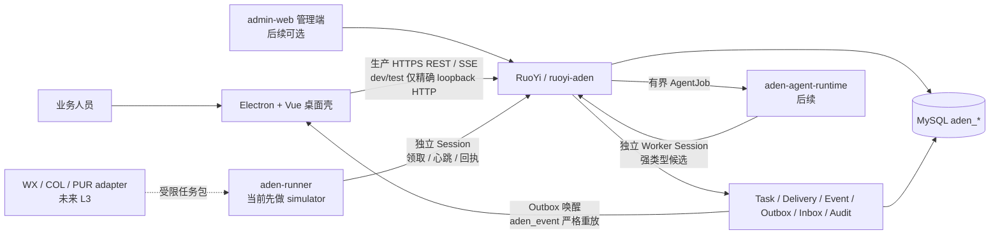

# Aden 桌面执行底座技术设计

> 文档类型：Feature 技术设计；版本：0.4.0；文档状态：Approved  
> Feature：FEAT-ADEN-001；创建 / 更新：2026-09-12；风险：L2 合成切片  
> owner：Codex 架构与实现；用户负责关键产品 / 风险决定；独立安全复核待指定  
> 决策记录：独立技术路线 ADR 尚未建立；本文是跨进程总设计，内部细节由三个关联专题设计分别维护  
> 输入：[功能规格](功能规格.md)、[Aden PRD](../../产品/产品需求文档.md)、[历史架构候选（非当前基线）](../../归档/架构/基于Python的多智能体架构候选.md)  
> 专题设计：[Python Agent](Python%20Agent架构与实现方案.md)、[智能体桌面端](桌面端架构与实现方案.md)、[RuoYi 后端](RuoYi后端架构与实现方案.md)
> 实施入口：[十阶段实施任务清单](任务清单.md)；本文和三个专题中的 P/B/D 阶段只表达设计顺序，不维护实施状态

## 1. 结论

采用“一套 RuoYi 权威控制面 + 一个本地桌面操作壳 + 两类相互隔离的 Python 执行进程”的结构。RuoYi 持有身份、工作空间、任务、审批、动作、回执和审计真相；Electron 只承载本地打包 UI；`aden-agent-runtime` 只产生模型候选；`aden-runner` 只执行获准任务包。Agent Runtime 与 Runner 的凭据、运行环境和发行物必须分开，不能因为语言相同而合成一个高权限 Python 服务。

目标态按源码组织是 **4 个实现单元 + 1 个非运行时契约目录**。其中 `ruoyi-aden` 是被现有 `ruoyi-admin` 承载的 Maven 业务模块，不是独立可执行 JAR：

| 工程 / 目录 | 当前事实 | 本 Feature 计划 |
| --- | --- | --- |
| `platform-backend/ruoyi-aden` | 已存在 1 个 Maven 模块，只有任务状态骨架 | 在这个模块内实现控制面；不再新增 Java 子模块 |
| `aden-desktop/` | 已存在 1 个 npm / Electron 工程，只有静态壳 | 仍保持一个工程，按 9 个内部逻辑模块演进 |
| `aden-agent-runtime/` | 不存在 | 当前新增低权限、无网络 Fake 骨架；真实 Agent Worker / Provider 另走后续 PoC |
| `aden-runner/` | 不存在 | 当前优先新增无权限 `runner-simulator`；真实 Runner 另走 L3 |
| `contracts/aden/` | 不存在；不运行 | 新增 OpenAPI / JSON Schema，作为 Java、Python、TypeScript 的字段唯一事实源 |

运行时对应 4 类组件：承载 `ruoyi-aden` 的 `ruoyi-admin` JVM、Electron 桌面应用、Agent Worker 进程、Runner 进程。当前正常合成闭环运行 `ruoyi-admin`、Electron 和无权限 Runner simulator；Agent Runtime 另行建立无网络 Fake 骨架，验证强类型候选与安全停止，但不是正常闭环的终态推进者。真实模型流量与真实高权限 Runner 都要经过对应阶段门。

当前 FEAT-ADEN-001 的实现顺序是“契约 → Java / MySQL → Runner simulator → Electron REST / SSE 闭环”；真实模型、UIA、浏览器、微信、采购外发和电商采集都不在这个切片内，也不引入 Temporal。



## 2. 技术栈与所有权

| 组件 | 当前选择 | 拥有 | 不拥有 |
| --- | --- | --- | --- |
| 中心后端 | Java 17、Spring Boot 4、RuoYi、MyBatis | 身份适配、权限、任务状态、策略、审计、API | 桌面登录态、模型推理、UIA 句柄 |
| 业务库 | MySQL / InnoDB，`aden_*` 表族 | 业务事实、版本、Outbox / Inbox、Runner delivery | 大截图、明文凭据、模型隐藏推理 |
| 桌面壳 | Electron 44、Vue 3、TypeScript、electron-vite | 本地 UI、任务快照、状态、未来窄 IPC | 直接数据库、任意 Shell / 文件 / 网络、业务终态 |
| Runner | 独立 `aden-runner`；当前先用 Python 3.12 simulator | 合成 Session、心跳、领取、进度、回执；未来受控本机执行 | 模型推理、审批、业务终态 |
| Agent Worker | 独立 `aden-agent-runtime`；Python 3.12 + Pydantic v2，候选 SDK 为 PydanticAI | 抽取、分类、草稿、候选 | 用户 JWT、桌面能力、授权、金额真相、审批、业务终态 |
| 进度 | REST 快照 + SSE | 可恢复展示、游标补发 | 业务事实和一次性动作许可 |

RuoYi 平台账号、角色、菜单和认证继续使用平台 MySQL；Aden 的独立业务表同样位于 MySQL，但必须使用稳定用户标识关联，不建立对其他独立项目业务表的隐式共享所有权。

## 3. 专题设计和模块边界

三个专题文档按唯一责任拆分，避免同一内部设计在多处漂移：

| 专题 | 拥有的事实 | 数量结论 |
| --- | --- | --- |
| [Python Agent 架构与实现方案](Python%20Agent架构与实现方案.md) | Agent Job、RunSpec、ContextView、工具、模型端口、Runner simulator 与 Python 测试 | 新增 2 个 Python 顶层工程；Agent Runtime 9 个逻辑包，当前 Runner simulator 6 个低权限包 |
| [桌面端架构与实现方案](桌面端架构与实现方案.md) | Electron 三层进程、IPC、会话、REST / SSE 客户端、安全、打包 | 保持 1 个 npm 工程，内部 9 个逻辑模块 |
| [RuoYi 后端架构与实现方案](RuoYi后端架构与实现方案.md) | Java 分层、领域模型、MySQL、REST、Runner / Agent 认证、事务、事件和 SSE | 保持 1 个 Maven 模块，内部 6 个逻辑领域边界；当前闭环先实现 4 个 |

跨组件的统一实施切片、依赖、状态、授权范围和计划证据只在[任务清单](任务清单.md)维护。三个专题文档中的 `P0～P6`、`D0～D5`、`B0～B8` 只是各组件的设计顺序参考，不能被解释为第二套进度或完成事实。

跨系统依赖只能朝中心契约收敛：

```text
Electron renderer → preload 窄能力 → Electron main → RuoYi API
aden-agent-runtime → RuoYi Agent Worker API
aden-runner → RuoYi Runner API
Java / TypeScript / Python DTO ← contracts/aden
业务状态、授权、任务版本、事件、审计 → RuoYi / MySQL
```

领域层不得依赖 Electron、Python、具体连接器或 MyBatis 类型。Runner / Agent 只通过版本化 DTO 与 API 通信，不能引用服务端实体类；Electron 不直接启动 Python，也不将用户 JWT 下发给 Runner / Agent。

## 4. 状态与命令

当前已实现的领域状态为：

```text
DRAFT ─SUBMIT_FOR_VALIDATION→ VALIDATING ─VALIDATION_PASSED→ QUEUED ─START→ RUNNING
RUNNING ─WAIT_FOR_USER→ WAITING_USER ─RESUME→ RUNNING
RUNNING ─WAIT_FOR_EXTERNAL→ WAITING_EXTERNAL ─RESUME→ RUNNING
VALIDATING / QUEUED / RUNNING / WAITING_* ─REQUEST_CANCEL→ CANCEL_REQUESTED
CANCEL_REQUESTED ─CONFIRM_CANCELED→ CANCELED
RUNNING ─COMPLETE→ SUCCEEDED
VALIDATING / QUEUED / RUNNING / WAITING_* ─FAIL→ FAILED
```

终态 `SUCCEEDED / FAILED / CANCELED` 不允许继续迁移。`CANCEL_REQUESTED` 不是终态；在未来真实外部动作场景中，若无法确认副作用是否发生，应进入独立的动作结果未知状态并触发对账，而不是直接把任务标记成功、失败或取消。

公开 OperatorCommand 当前只含 `SUBMIT_FOR_VALIDATION / REQUEST_CANCEL`，分别要求 `aden:task:command / aden:task:cancel`，Controller / Application guard 按 DTO command 查询权限，两项权限不互相隐式授予。Validator、Coordinator 和通过认证 / lease / fence 校验的 Runner receipt adapter 才能产生 `VALIDATION_* / START / COMPLETE / FAIL / WAIT_* / RESUME / CONFIRM_CANCELED` 等内部 DomainCommand；Runner 不提交命令，Operator DTO 也不能反序列化内部命令。当前合成 Validator 在 SUBMIT 的单一事务内作为纯确定性零网络函数，连续推进 `DRAFT → VALIDATING → QUEUED / FAILED`；合法业务校验失败已提交为 `FAILED` 时返回 HTTP 200 + Task / ETag，422 只表示不改变 Task 的前置拒绝。每次状态更新至少比较 `task_id + workspace_id + version + expected_state`，成功后 `version + 1`，并以同一事务写审计和 Outbox。状态枚举与 `state × actor × command` 是服务端事实；桌面只展示服务端按当前 Operator / role / permission 投影的公开 `allowedCommands`，不能依赖字符串猜测或构造终态命令。

## 5. 初始数据设计

`IMP-02` 计划建立支撑合成闭环的 **12 张 Aden 业务表**：

| 表族 | 表 | 最小职责 |
| --- | --- | --- |
| Workspace | `aden_workspace`、`aden_workspace_member` | 工作空间、成员和业务角色 |
| Task | `aden_task`、`aden_task_step` | Task 聚合、状态、版本和步骤 |
| Runner | `aden_runner`、`aden_runner_credential`、`aden_runner_session`、`aden_runner_delivery` | 设备、带 pepper key id 的凭据 digest、Runner 当前 Session epoch、租约、fencing 与回执 |
| Reliability | `aden_event`、`aden_outbox`、`aden_inbox` | 不可变事件、至少一次投递和幂等消费 |
| Audit | `aden_audit_event` | 主体、动作、对象、结果和 correlation；只追加 |

后续真实 Agent 再增加 Worker Credential / Worker Session / Job / Attempt 四类表；真实外部动作 L3 再增加 Action Intent / Approval / Attempt / External Receipt 表，当前不提前伪装为已实现。

已批准采用独立 location 和独立历史表的 Aden 专属 Flyway，普通应用启动不自动 migrate。不能使用默认 `classpath:db/migration`，否则可能误扫 `ruoyi-interview` 的 PostgreSQL migration。表、索引、时间、JSON、baseline、恢复和 expand / contract 细节以[RuoYi 后端架构与实现方案](RuoYi后端架构与实现方案.md)为准。

## 6. API 与事件候选

统一前缀候选为 `/api/v1/aden`，操作员资源显式带 workspace；最终以 `contracts/aden/` 的 OpenAPI 为准：

| 方法 / 路径 | 用途 | 关键契约 |
| --- | --- | --- |
| `POST /admin/workspaces` | 建立首个 workspace 与 OWNER | 受控管理权限；不由 migration 静默 seed |
| `GET /workspaces/{workspaceId}/bootstrap` | 读取桌面初始一致性投影 | 同一 `REPEATABLE_READ` 视图返回 Task 当前页、Runner、Capability 与 workspace-wide streamCursor；绑定 stream filter hash |
| `GET /workspaces/{workspaceId}/capabilities` | 读取 CORE / WX / PUR / COL 能力投影 | membership；状态、下一门禁、`externalActionsEnabled=false`，不新增业务表 |
| `POST /workspaces/{workspaceId}/tasks` | 创建合成任务 | `Idempotency-Key`；服务端从 membership 校验 workspace / actor |
| `GET /workspaces/{workspaceId}/tasks`、`GET .../{taskId}` | 列表与 Task 详情 | 资源级权限；Task 详情返回 ETag / version，但不能充当 Workspace stream 起点 |
| `POST .../{taskId}/commands` | 提交显式状态命令 | `If-Match`；非法迁移返回稳定错误码 |
| `GET /workspaces/{workspaceId}/events` | SSE 进度 | `Last-Event-ID`、replay、heartbeat 和过期回退 |
| `POST /workspaces/{workspaceId}/runners:enroll` | 管理员注册 Runner | `credentialId.secret` 只展示一次；库中只存公开 id、pepper key id 与 keyed digest |
| `POST /runner/v1/sessions` | 设备凭据换短期 Session | Runner 身份独立于 RuoYi 用户 JWT |
| `POST /runner/v1/deliveries:claim` | 有界领取 | capability、Session epoch、短租约与 fencing |
| `POST /runner/v1/deliveries/{deliveryId}/receipts` | 进度 / 结果回执 | 幂等键、请求 hash、旧 token / 旧租约拒绝 |
| `POST /agent/v1/jobs:claim`、`POST .../{jobId}/results` | 后续 Agent Worker 领取和候选回执 | 与 Runner 分离的机器身份；当前不走真实模型 |
| `GET .../{jobId}/context`、`POST .../tools/{toolName}:invoke` | 后续 ContextView 与只读 Tool Gateway | job scope 绑定 attempt / manifest；每次调用重新鉴权和审计 |

首批外部错误码至少包括 `ADEN_STATE_TRANSITION_DENIED`、`ADEN_VERSION_CONFLICT`、`ADEN_IDEMPOTENCY_KEY_REUSED`、`ADEN_TASK_NOT_FOUND`、`ADEN_RUNNER_LEASE_LOST`、`ADEN_RECEIPT_STALE`、`ADEN_EXTERNAL_ACTION_DISABLED`。跨 workspace 访问对外统一为资源 404，内部审计才记录 `ADEN_WORKSPACE_FORBIDDEN`，不能把该内部原因暴露给调用方。HTTP 失败必须保留 correlation id，不返回堆栈、令牌或内部路径。

跨语言 wire 中，Task / aggregate version、event sequence、Session epoch、fencing token、receipt sequence 和公开 BIGINT id 一律使用受 `0..Long.MAX_VALUE` 约束的 canonical 十进制字符串；Java 用受检 `long` value object，TypeScript 保持 string 并用共享 comparator，Python 可在内存用受界 int，但回传仍为 string。`attemptNo` 等有业务小上限的字段才用 int32；cursor 与 ETag 始终 opaque。这样避免 JavaScript 超过 `2^53-1` 后破坏版本、去重和 fencing。

`/api/v1/aden/**` 不沿用 RuoYi “HTTP 200 + body code”失败语义。安全链固定为 Runner `@Order(1)`、Aden Operator `@Order(2)`、RuoYi 默认链；前两者使用 Aden 专用 entry point / denied handler，高优先级且限定 Aden 包的 advice 处理 Controller / method-security / 领域异常，统一返回真实 400 / 401 / 403 / 404 / 409 / 410 / 412 / 428 / 429 / 5xx 与 ErrorEnvelope。两条 Aden chain 均为 stateless，关闭 CSRF、request cache、form login 与 HTTP Basic，不开放宽泛 CORS；RuoYi JWT 的 Redis 登录态不等于 Servlet HttpSession。

## 7. Electron 安全基线

当前实现已经采用：本地打包 renderer、sandbox、context isolation、关闭 Node integration、窄 preload、默认拒绝所有 Web 权限和新窗口、拒绝非精确开发 origin / 打包入口导航。目标设计把用户登录、REST 和 SSE 统一放在 main，renderer 的生产 CSP 保持 `connect-src 'none'`；当前开发 CSP 与 `file://` 包装仍需在打包 PoC 中收紧。完整模块、IPC、会话、打包和故障设计见[桌面端架构与实现方案](桌面端架构与实现方案.md)。

在 API 接入前还要完成：

- 固定生产 API Origin 白名单；不得把 CSP 放宽为任意 `https:`。
- IPC 每个方法校验 sender、参数 Schema、工作空间和能力；不提供通用 `invoke(channel, payload)`。
- 用户令牌优先仅在内存中保存；需要持久化时通过 Windows Credential Manager 或等价系统安全存储，不放 localStorage、普通 Cookie、配置文件或日志。
- renderer 不能加载电商、微信、帮助中心等远程页面；外部链接采用固定域名白名单并交系统浏览器，当前阶段全部拒绝。
- 安装包、更新源、签名、回滚和防降级必须独立设计和实机验证后才能进入 G2。

## 8. Runner 与 Agent 边界

当前 `IMP-05` 的 `aden-runner` 只是普通用户权限模拟器。它主动向 RuoYi 发起出站请求：生产目标只能是 HTTPS，当前 dev/test 只允许精确 loopback HTTP；它请求有界 delivery，按固定 fixture 产生进度和回执，不启动 Windows Service、不打开 UIA、不读浏览器、不访问任意文件。此设计先验证协议、租约和恢复，不冒充真实执行能力。

后续真实 Windows Runner 才考虑 Supervisor / Session Agent 双进程、ACL Named Pipe、设备证书、本地动作账本、签名任务包和 kill switch。它必须通过独立 L3 设计与实机测试。本轮不预先选择任意 Shell 或远程桌面控制接口。

`aden-agent-runtime` 的稳定端口只接受经过净化的 ContextView 和允许工具清单，返回带 Schema 版本、来源和 RunSpec 的候选。金额、目标对象、权限、审批、状态和写动作由 Java 确定性代码复核。当前推荐把 PydanticAI 放在自有 `ModelAgentPort` 后；SDK 不能进入业务契约。工程结构、Agent Family、运行逻辑和框架取舍见[Python Agent 架构与实现方案](Python%20Agent架构与实现方案.md)。

## 9. 一致性、失败与恢复

- API 事务：校验身份 → 先锁 Workspace 水位 → 按稳定顺序锁聚合 / Delivery → 更新聚合 → 同事务写 Event / Outbox / Inbox / Audit → 提交；网络投递在事务外，死锁只对幂等的整个事务做有界重试。
- Runner 领取：使用短租约和 fencing token；崩溃后过期重领；旧 Worker 的迟到回执拒绝。
- SSE：`aden_event` 是唯一 replay / 发送来源，Outbox 只唤醒 Workspace drain；broadcaster 从已成功发送的 cursor 严格升序、有界批量发送。首次和恢复先取多投影 Workspace bootstrap，游标非法 / 过期、慢消费者或 gap 时重新 bootstrap。
- 取消：服务端记录请求，Runner 在安全点确认；超时仍保持可解释状态，不猜测取消成功。
- 外部结果未知：未来连接器必须回读对账或转人工，不自动重发。
- 桌面断线：禁用写操作并显示最后同步时间；恢复后先取 Workspace bootstrap，再续订事件；切 Workspace / logout 递增 epoch 并拒绝旧上下文的迟到回调。
- 数据迁移失败：保留旧 Schema 可运行路径或停止启动；不自动删表、清数据或伪造版本成功。

## 10. 兼容与退出条件

当前 `ruoyi-aden` 只新增模块，不修改 RuoYi 公共认证契约；`aden-desktop` 是独立工程，不把业务页面塞入 `portal-web` 或上游 `ruoyi-vue3-frontend`。OpenAPI 冻结前允许破坏性调整，但必须同步桌面和 Runner simulator；冻结后按版本化兼容策略处理。

Electron PoC 在以下任一条件出现时触发 Tauri 2 对照，不凭偏好迁移：签名安装 / 自动更新无法满足企业策略；包体或内存超过批准预算；安全复核认为 Chromium / Node 运行时残余攻击面不可接受；离线环境更新带宽成为量化阻断。对照必须复用同一 REST / SSE / IPC 能力模型和 E2E，不得借换壳改变产品语义。

若 MySQL 轮询 / Outbox 在压测中成为瓶颈，再以新 ADR 评估 MQ；若多日工作流的计时、版本演进和恢复复杂度超过当前状态机的可维护门槛，再以 Java 侧 Temporal Worker 做 PoC。任何情况下，MySQL 仍是业务事实源，Python 不成为第二控制面。
