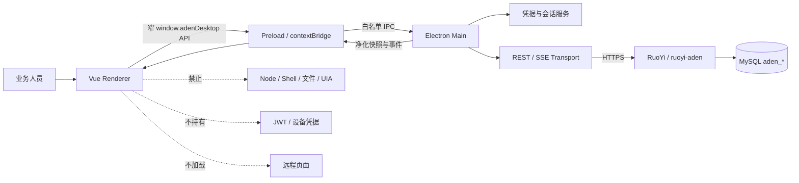
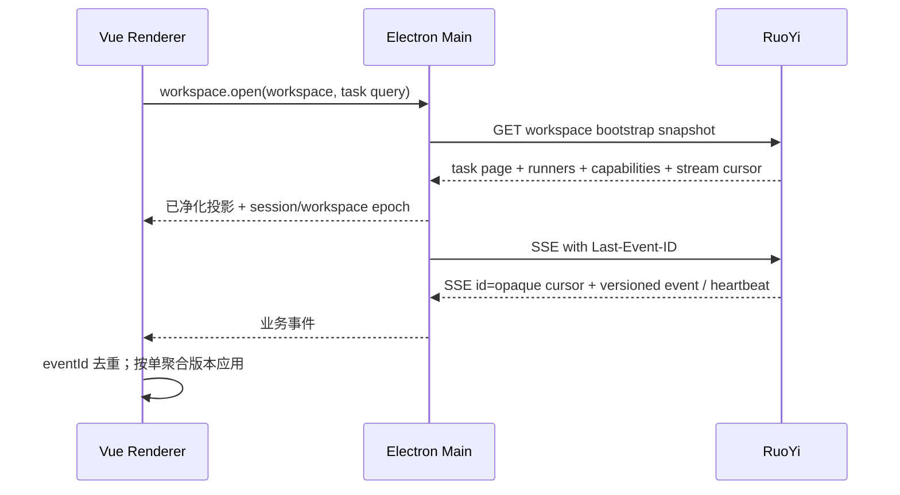

# Aden 智能体桌面端架构与实现方案

> 文档类型：Feature 专题技术设计；版本：0.2.0；文档状态：Approved  
> Feature：FEAT-ADEN-001；创建 / 更新：2026-09-12；风险：当前合成桌面壳 L2，持久凭据、安装更新或真实桌面控制另行评估  
> owner：Codex 负责候选架构与实现方案；用户负责产品交互、安装范围和真实环境决定；独立安全复核待指定  
> 上游：[功能规格](功能规格.md)、[总技术设计](技术设计.md)、[Aden 产品需求](../../产品/产品需求文档.md)  
> 关联：[Python Agent 架构与实现方案](Python%20Agent架构与实现方案.md)、[RuoYi 后端架构与实现方案](RuoYi后端架构与实现方案.md)、[十阶段实施任务清单](任务清单.md)  
> 事实边界：本文拥有 `frontend/desktop/aden-desktop/` 内部进程、模块、状态、IPC、安全和打包设计；服务端 API 字段以 `IMP-01` 建立的 `contracts/aden/` 为准

## 1. 结论

继续采用 **Electron + Vue 3 + TypeScript**，不在当前阶段改为 Tauri，也不把现有 `admin-web` 或 `portal-web` 包装成桌面程序。桌面端只做本地可信 UI、登录会话、任务快照、实时进度、Runner 状态以及事件 / 审计证据摘要；当前不注册审批入口。它不持有业务真相，也不直接操作 Windows UIA、浏览器、Shell、文件系统或业务数据库。

桌面工程保持一个顶层项目 `frontend/desktop/aden-desktop/`，不再新增平行前端项目。代码与信任边界固定为 Electron `main → preload → renderer` 三层：

- `main` 是本机安全与网络代理：校验配置、保存会话、访问 RuoYi、维护 SSE、控制窗口和安全策略。
- `preload` 只暴露经过类型约束的窄 API，不暴露 `ipcRenderer`、任意 channel、Node 对象或回调事件对象。
- `renderer` 只负责 Vue 页面和可恢复视图状态，不接触令牌、Node、数据库和任意本机能力。

生产构建只加载随安装包发布的本地代码。Electron 官方明确建议启用 context isolation、sandbox、限制导航和新窗口、验证 IPC sender、使用严格 CSP，并避免向不可信内容暴露 Electron API；这些要求作为本项目的阻断安全基线。[Electron Security](https://www.electronjs.org/docs/latest/tutorial/security)、[Electron Context Isolation](https://www.electronjs.org/docs/latest/tutorial/context-isolation)、[Electron Process Sandboxing](https://www.electronjs.org/docs/latest/tutorial/sandbox)

## 2. 当前实现事实

### 2.1 已存在

| 组成 | 当前内容 | 能证明什么 |
| --- | --- | --- |
| 工程与构建 | `package.json`、`electron.vite.config.ts`、三个 tsconfig、lockfile | 已有 Electron / Vite / Vue 工程骨架 |
| 当前版本 | Electron `44.3.0`、Vue `3.5.26`、TypeScript `5.7.3`、electron-vite `5.0.0`、Vite `6.4.1`、Vitest `3.2.7` | 只说明当前锁定依赖，不说明构建已在本轮通过 |
| main | 创建单窗口、校验 `ADEN_API_BASE_URL`、拒绝权限、新窗口和非受信导航 | 已写入基础安全配置，尚无登录、API、SSE 或更新 |
| preload | 只暴露运行时平台和 Electron / Chrome 版本 | 已有窄 bridge 骨架，尚无业务 IPC |
| renderer | 静态 CORE / WX / PUR / COL 模块卡片和阶段说明 | 仅合成 UI，不是服务端状态或真实连接 |
| 测试 | `runtime-config.test.ts` 与 build 输出检查脚本 | 可见测试入口；本轮尚未运行 |

### 2.2 当前缺口

- 没有 Vue Router、Pinia、API client、登录、工作空间、任务列表、任务详情、SSE 或离线恢复。
- 没有 RuoYi Token 的内存 / 安全存储策略实现；当前页面也没有发起 API 请求。
- 没有 IPC sender 校验、业务参数 Schema、请求并发控制和错误映射。
- 没有 Electron E2E、打包器、安装包、签名、Fuses、自动更新、降级保护或实机烟测。
- 当前 renderer CSP 在同一个 HTML 中长期允许 loopback `connect-src` 和 `style-src 'unsafe-inline'`，尚未区分开发与打包策略；目标态由 main 代理网络后，生产 renderer 应收紧为 `connect-src 'none'`，并通过 nonce / 哈希或构建调整移除不必要的 inline style。
- 当前 lockfile 的 resolved URL 指向 `registry.npmmirror.com`；在可发布构建前必须明确可信 registry、离线缓存、完整性校验和可重复构建策略，不能无记录地切换供应源。
- 页面中展示的 `FEAT-ADEN-CORE-001` 与当前正式 ID `FEAT-ADEN-001` 不一致，应在实施时修正。
- 页面写有“原型已验证”等静态状态；接入后必须来自服务端能力投影或明确的本地构建常量，不能继续把演示文案当事实。

## 3. 目标、范围与非目标

### 3.1 当前切片目标

1. 用户在桌面端登录 RuoYi，选择服务端授权的工作空间。
2. 创建或查看合成任务，提交显式命令，并显示版本冲突和权限拒绝。
3. 先取 REST 快照，再订阅带游标的 SSE；断线重连或重启后以服务端快照恢复。
4. 展示 Runner simulator 的在线、租约、能力和任务进度，不伪装为真实执行电脑。
5. 将 CORE / WX / PUR / COL 显示为独立能力包，各自有状态、门禁和“外部操作关闭”提示。
6. renderer 始终无 Node、无 Token、无任意 IPC、无远程页面。

### 3.2 非目标

- 不在 Electron 内运行 Python Agent 或 Windows Runner。
- 不把微信、电商网站、ERP 或帮助中心嵌入 renderer / webview。
- 不在当前 Feature 启用托盘常驻、开机自启、后台自动更新、全局快捷键或高权限安装。
- 不实现真实外部发送、UIA、浏览器采集、屏幕截图和键鼠控制。
- 不通过本地缓存制造“离线可写”；断线时只能查看最后快照并明确标记过期。

## 4. 进程与数据流架构



网络请求放在 main 进程而不是 renderer，理由是：

- Token 不进入 renderer、localStorage、URL、普通 Cookie 或 DevTools 可见的页面状态；
- 可在一个位置实施 API Origin 白名单、超时、证书错误、脱敏日志和撤销；
- 原生 browser `EventSource` 难以设置 Authorization header，把 Token 放 query 会泄漏；main 可用 `fetch` 流读取 SSE，再经窄 IPC 转发净化事件；
- renderer 的生产 CSP 可以保持 `connect-src 'none'`，只执行本地 UI。

main 进程仍是高价值攻击面，因此不能提供通用代理接口。renderer 不能传入任意 URL、HTTP method、header 或 IPC channel，只能调用固定业务方法。

main 的 REST / SSE `fetch` 全部使用 `redirect: 'manual'`。当前固定 API 不需要跳转，所以 301 / 302 / 307 / 308 无论同源或异源都直接拒绝；不能先自动跟随、再检查 final URL，因为 307 / 308 可能已经重放用户名、密码、验证码或 Authorization。未来若确需跳转，必须先取得并精确校验 Location，再按允许的方法和 header 重建请求，认证 / 凭据请求仍不得自动重放。

## 5. 模块数量和目录建议

### 5.1 数量结论

- 顶层桌面工程：**1 个**，继续使用现有 `frontend/desktop/aden-desktop/`。
- 代码 / 信任层：**3 个**，现有 `main`、`preload`、`renderer`。`preload` 不是独立 OS 进程；运行时通常是 main 与 renderer 两类进程，另有 Electron 管理的 utility / GPU 等进程，不能把三层边界误写成三个进程。
- 计划形成的内部逻辑模块：**9 个**，不是 9 个 npm 包，也不是 9 个进程。

### 5.2 九个逻辑模块

| 编号 / 模块 | 所在层 | 主要责任 | 当前状态 |
| --- | --- | --- | --- |
| D01 `app-host` | main | 应用生命周期、单实例、窗口、加载失败、renderer 崩溃和退出 | 部分骨架 |
| D02 `runtime-security` | main | runtime config、可信 Origin、自定义 protocol、CSP、权限 / 导航 / 窗口策略、Fuses | 部分骨架 |
| D03 `auth-vault` | main | 登录、登出、会话过期、内存 Token、可选安全持久化 | 未实现 |
| D04 `rest-client` | main | 固定 API Origin、超时、取消、ETag、幂等、If-Match、错误和 correlation | 未实现 |
| D05 `sse-coordinator` | main | 单连接、游标、heartbeat、去重、版本缺口、有界退避和快照回退 | 未实现 |
| D06 `ipc-gateway` | main + preload | 逐方法 capability、sender / Schema 校验、订阅释放和脱敏错误 | 只有 runtime info 骨架 |
| D07 `shared-contracts` | main + preload + renderer | 生成的 TypeScript DTO、事件、错误和本地 IPC Schema | 未实现 |
| D08 `renderer-shell` | renderer | Vue Router、Pinia、登录 / 工作空间 / 连接状态、布局和错误边界 | 静态骨架 |
| D09 `task-center` | renderer | 任务、步骤、Runner、证据摘要、CORE / WX / PUR / COL 状态和门禁；审批仅作未来 capability-gated 入口 | 静态模块卡片骨架 |

其中 D03、D04、D05、D07 是从零新增；D01、D02、D06、D08、D09 在现有代码上扩展或重构。业务能力继续在 D09 下按 feature 目录分组，但不各自复制一套网络、状态和权限代码。

### 5.3 建议目录

```text
frontend/desktop/aden-desktop/src/
├── main/
│   ├── bootstrap/
│   ├── config/
│   ├── security/
│   ├── auth/
│   ├── transport/
│   └── ipc/
├── preload/
│   ├── index.ts
│   ├── api.ts
│   └── index.d.ts
├── shared/
│   ├── contracts/
│   └── generated/
└── renderer/src/
    ├── router/
    ├── stores/
    ├── layouts/
    ├── components/system/
    ├── features/
    │   ├── auth/
    │   ├── task-center/
    │   ├── runner-status/
    │   └── capability-overview/
    └── App.vue
```

上表给出当前任务清单采用的具体落点；D01～D09 是逻辑模块名，例如 D01 `app-host` 映射到 `main/bootstrap/`、D03 `auth-vault` 映射到 `main/auth/`。不把 Java API DTO 手抄到每个 feature。传输类型由 `contracts/aden/` 生成，renderer 只维护展示模型和本地表单 Schema。

## 6. 技术栈

| 领域 | 采用 / 候选 | 用途与边界 |
| --- | --- | --- |
| 桌面壳 | 当前 Electron 44 + electron-vite 5 | 保持现状；实现前锁文件、许可和安全公告再复核，不在本文宣称永久版本 |
| UI | Vue 3 + TypeScript | 页面、组件和组合式逻辑 |
| 路由 | Vue Router `createMemoryHistory()` | 登录、任务中心、任务详情、Runner 与设置；打包页 URL 始终固定为 `index.html`，不以 URL 决定权限；审批当前不注册 |
| 本地视图状态 | Pinia | 当前工作空间、筛选、连接状态和页面状态；服务端事实不离线篡改 |
| 契约 | OpenAPI / JSON Schema → TypeScript | 共享枚举、请求、响应和事件；机器检查优先于 Markdown 字段表 |
| 本地参数校验 | 轻量 Schema 校验器，候选 Zod | IPC 输入、运行配置和本地表单；具体依赖在任务包中锁定 |
| HTTP | main 进程内置 `fetch` + 固定 API client | HTTPS、`redirect: 'manual'` 且拒绝所有 3xx、Authorization、ETag、Idempotency-Key、If-Match、correlation |
| SSE | main `fetch` stream + 经评审的有界 SSE parser | 2xx / content-type、line / event / buffer 上限、`Last-Event-ID`、heartbeat、IPC ack 背压、退避和重新拉快照；不在 query 传 Token |
| 单元 / 组件测试 | Vitest + Vue Test Utils | 纯逻辑、store、组件状态和 bridge adapter |
| 桌面 E2E | Playwright Electron 模式候选 | 启动、导航、IPC、安全拒绝、断线恢复；需在实施前确认对 Electron 44 的兼容 |

新增依赖必须记录用途、版本、许可和锁文件差异。若手写的小型 adapter 已足够，不因框架流行额外引入完整数据请求或 UI 组件体系。

生成契约把 version、event sequence、Session epoch、fencing token、receipt sequence 和公开 BIGINT id 保持为 canonical 十进制 `string`；共享 codec / comparator 在不转 JavaScript `number` 的前提下校验 `0..Long.MAX_VALUE` 并比较。`2^53` 以上边界必须做 round-trip / 排序测试；cursor 与 ETag 仍按 opaque string 原样传递。

## 7. Preload 与 IPC 契约

### 7.1 renderer 可见的最小 API

语义示例：

```text
window.adenDesktop.runtime.getInfo()
window.adenDesktop.session.getLoginChallenge()
window.adenDesktop.session.login(credentials)
window.adenDesktop.session.logout()
window.adenDesktop.session.getSnapshot()
window.adenDesktop.workspace.list()
window.adenDesktop.workspace.bootstrap(workspaceId, taskQuery)
window.adenDesktop.capabilities.list()
window.adenDesktop.tasks.list(query)
window.adenDesktop.tasks.get(taskId)
window.adenDesktop.tasks.create(command)
window.adenDesktop.tasks.executeCommand(taskId, command, expectedVersion)
window.adenDesktop.runners.list()
window.adenDesktop.events.subscribe(filter, listener) -> unsubscribe
```

实际方法以实现后的 TypeScript contract 为准，但必须满足：

- 不提供 `invoke(channel, payload)`、`send`、`on(channel)`、`request(url, options)` 或 `openPath(path)`。
- preload 对输入做第一层 Schema 校验；main 再独立校验 sender、Schema、工作空间和权限上下文。
- 事件 listener 只接收深拷贝的业务 DTO，不把 `IpcRendererEvent` 传给 renderer。
- 订阅有数量上限、注销句柄和窗口销毁清理；不能因重复 mount 建立无限 SSE / IPC listener。
- main 只接受来自当前受信主窗口主 frame 的消息。未打包 dev/test 校验精确 renderer Origin；打包态使用 `createMemoryHistory()`，`file://` 的 Origin 为 `null`，因此必须比较规范化、无 query / fragment 的固定 renderer `index.html` file URL，不能只比对 `origin` 字符串。隐藏窗口或后来创建的窗口不自动继承能力；未来切到安全 `app://` 后再改为精确 scheme / host / path 校验。
- 当前合成切片的 Runner enroll / revoke 只通过受控管理 API / CLI 和测试 setup 完成，不修改 `admin-web`，因此 `admin-web` 不计入本 Feature 的 4 个实现单元。桌面 bridge 只读 Runner 摘要，不把设备秘密传给 renderer；若后续要求可视化管理页，应单独把 `admin-web` 加入受影响工程和任务范围。

Electron 官方特别指出，直接把 `ipcRenderer.send` 暴露给 renderer 会失去参数过滤并扩大 IPC 能力；本项目因此只暴露逐方法 bridge。[Electron Context Isolation](https://www.electronjs.org/docs/latest/tutorial/context-isolation)

### 7.2 IPC 错误

IPC 返回判别联合：`Ok<T> | AppError`。`AppError` 至少含稳定 `code`、用户可读 message、`retryable`、`correlationId` 和可选安全 details；不传 Java 堆栈、Node 错误对象、文件路径、Token、SQL 或原始响应正文。

## 8. 登录、会话与凭据

### 8.1 当前推荐

1. renderer 先调用 `getLoginChallenge()`；main 根据 RuoYi 当前 captcha 开关获取 challenge，只把图片 / uuid 等必要公开字段返回 renderer。关闭 captcha 时返回明确的 `captchaRequired=false`，不由页面猜测。
2. renderer 收集用户名、密码和必要验证码，经窄 IPC 发送到 main；challenge uuid 与输入一起受 Schema、时限和长度约束。
3. main 只向固定 RuoYi Origin 请求登录；日志在序列化前移除凭据。
4. Token 默认只存在 main 内存；renderer 仅拿到用户摘要、权限摘要和到期状态。
5. 应用重启默认重新登录。只有用户明确需要“记住登录”且威胁模型通过后，才用 OS 安全存储保存可撤销会话材料。
6. `401` 清空内存会话并切回登录；`403` 保留登录但显示资源拒绝；不能把两者都伪装成网络失败。
7. main 维护单调 `sessionEpoch / workspaceEpoch`。401、logout 或工作空间切换时先递增对应 epoch、Abort 全部旧 REST / SSE，再清空旧 store 并拉新 bootstrap；每个 IPC 响应 / 事件携带 workspace 与 epoch，preload / renderer 丢弃不匹配上下文的迟到结果。前端传入的 workspace 仅是请求意图，服务端仍从身份与成员关系裁决。

Electron `safeStorage` 在 Windows 使用 DPAPI，可以防止其他 Windows 用户直接解密，但不能防止同一用户空间内的其他应用；它不是完整凭据保险箱。若后续持久化 Token，优先使用异步 API、检查可用性、支持密钥轮换，并记录这一残余风险。[Electron safeStorage](https://www.electronjs.org/docs/latest/api/safe-storage)

### 8.2 禁止做法

- Token 放 `localStorage`、renderer Pinia 持久化、URL query、日志、崩溃报告或截图。
- 把 RuoYi 用户密码保存到磁盘，或交给 Python Agent / Runner。
- 允许环境变量或页面内容改写生产 API Origin。
- 证书错误时降级 HTTP 或允许忽略 TLS 验证。

## 9. 任务快照与 SSE 恢复

### 9.1 首次进入



### 9.2 恢复规则

- Workspace bootstrap REST 快照是进入页面和重启后的基线；它在一个一致性视图中返回当前 Task 页、Runner 摘要、能力投影与 workspace-wide cursor。Task 详情只用 ETag 保护单个聚合，不能把它的版本或任意 cursor 当作 Workspace 全量订阅起点。SSE 只缩短刷新延迟。
- SSE `id:` 是应用当前事件后的不透明 `streamCursor`；main 只在 renderer 确认应用对应有界 batch 后保存 ack cursor，并在重连时放入 `Last-Event-ID`。JSON `eventId` 用于去重，`sequence` 只表示服务端 workspace 排序位置，`aggregateVersion` 只比较同一个聚合。
- renderer 仅应用当前工作空间和已知类型；重复 `eventId` 或 `aggregateVersion <= localVersion` 幂等忽略。若同一 Task 收到 `aggregateVersion > localVersion + 1`，只重拉该 Task；不能把不同聚合或过滤导致的 sequence 间隔误报成丢事件。
- 发现版本跳跃、未知 Schema、SSE `400/410`、游标超出保留窗、慢消费者被服务端断流或本地投影校验失败时，停止增量应用并重新拉 Workspace bootstrap 快照。
- main 只接受 2xx + `text/event-stream`，SSE parser 对 UTF-8、单行、单事件、`data:` 和累计 buffer 设上限；只在完整空行边界产出通过 Schema / 大小校验的事件。半帧断线丢弃未完成 buffer，并从最后 ack cursor 重连。
- main→renderer 使用有界 batch + ack 队列，并限制事件速率、IPC payload 和 ack timeout。renderer 阻塞、队列或 parser 超限时 Abort 流、清理当前 epoch 队列、显示 degraded 并重新 bootstrap，不能让 main 无界吸收网络流。
- SSE 使用有界指数退避和抖动；未重新认证时不无限重连。连接状态显示“连接中 / 已连接 / 已断开 / 会话失效 / 数据可能过期”。
- 服务端连接有硬 TTL，并周期复核登录态、功能权限和 workspace membership。连接因 Token 到期、成员撤销或权限变化被关闭后，main 必须先重认证 / 重拉 workspace 列表，不能继续展示旧空间为可写。
- 应用最小化、页面切换或 renderer 重载不能让服务端任务停止；用户显式取消必须调用任务命令 API。
- 离线时禁用创建、命令和审批等写按钮；不把未提交表单标为服务端已保存。

## 10. 状态管理和页面结构

### 10.1 Pinia 状态所有权

| Store | 允许保存 | 不允许保存 |
| --- | --- | --- |
| `sessionStore` | 用户摘要、权限摘要、会话状态 | Token、密码、验证码 |
| `workspaceStore` | 当前 workspace id、可选列表、切换状态 | 客户端自授予的 Scope |
| `taskStore` | 服务端快照、版本、分页、筛选、加载 / 错误状态 | 本地伪造终态、跨 workspace 残留 |
| `connectionStore` | SSE 状态、最后同步时间、重试次数 | 业务完成判定 |
| `runnerStore` | 服务端 Runner / simulator 投影 | 本地进程控制句柄 |
| `capabilityStore` | CORE / WX / PUR / COL 服务端可见状态和门禁 | 从静态页面推断已验证 |

命令不做乐观终态更新。用户点击命令后，UI 显示“提交中”；只有服务器返回新版本或随后快照 / 事件确认时才更新任务状态。`412/409` 触发刷新和差异提示，不自动覆盖用户看到的新状态。

### 10.2 页面

当前合成切片建议路由：`/login`、`/tasks`、`/tasks/:id`、`/runners`、`/settings/runtime`。`/approvals` 只有在未来后端 Action / Approval capability 通过 L3 并由服务端启用后才注册；当前不显示可操作审批页，任务详情只展示已有事件 / 审计摘要。能力包使用任务类型和筛选，不为 CORE / WX / PUR / COL 各复制一套任务中心。

所有页面覆盖：加载、空、部分数据、权限拒绝、版本冲突、服务不可用、会话过期、离线和恢复中。键盘导航、焦点、错误关联、减少动效和窄屏布局纳入组件验收。

## 11. 安全设计

| 风险 | 设计控制 | 计划验证 |
| --- | --- | --- |
| 远程代码进入 renderer | 生产只加载打包本地资源；禁用 webview；限制导航和新窗口；严格 CSP | 尝试导航、弹窗、脚本和外链均被拒绝 |
| renderer 获得 Node / Electron | `sandbox=true`、`contextIsolation=true`、`nodeIntegration=false`；窄 preload | renderer 中 `require/process/ipcRenderer` 不可用 |
| 任意 IPC | 固定方法、双侧 Schema、sender / origin 校验、订阅上限 | 未知 channel、伪 sender、超大 / 畸形 payload 被拒绝 |
| Token 泄漏 | main 内存持有；IPC / 日志 / store 脱敏；可选 safeStorage 风险说明 | 搜索构建、日志、store 与错误对象无 Token |
| API 重定向 / SSRF | API Origin 启动时冻结；业务方法不能传 URL；`redirect: 'manual'` 且当前拒绝全部 3xx，防止检查 final URL 前凭据已被重放 | 恶意 URL、query 凭据、HTTP，以及同源 / 异源 301/302/307/308 测试 |
| XSS 变成本机执行 | Vue 默认转义、禁止 `v-html` 或先净化；renderer 没有本机能力 | 恶意任务标题 / 证据文本只作为文本显示 |
| 依赖 / Electron 漏洞 | 锁版本、许可和安全审计；及时更新；发布前 Fuses 与签名 | SBOM / audit 结论和打包后 fuse 检查 |
| 降级 / 非法更新 | 当前不实现更新；未来签名 manifest、哈希、版本单调和回滚策略 | 独立发布 Feature 与实机故障测试 |

Electron Fuses 可以在打包时关闭未使用的高风险能力，例如 `RunAsNode`、`NODE_OPTIONS` 和 CLI inspect，并配合 ASAR integrity 与代码签名；它们应在确定打包器后配置和回读，不能只写配置不验产物。[Electron Fuses](https://www.electronjs.org/docs/latest/tutorial/fuses)

## 12. 打包、签名和更新

当前 Feature 只要求开发构建与 Electron 窗口烟测，不宣称可分发。进入安装包阶段前另行决定：

1. 打包器和 Windows 安装格式；安装范围是 per-user 还是 per-machine。
2. 自定义安全 `app://` protocol，替代生产 `file://` 页面；保持本地资源和严格 CSP。
3. Windows 代码签名、证书保管、时间戳和构建产物哈希。
4. Fuses、ASAR integrity、禁用降级和构建后回读。
5. 更新源、签名 manifest、灰度、失败回滚和旧版本禁用。
6. 是否需要托盘、开机启动和后台运行；每项都改变进程生命周期和用户预期。

Electron 官方建议分发应用使用代码签名；自动更新的配置、平台差异和重复检查也必须单独验证。[Electron Code Signing](https://www.electronjs.org/docs/latest/tutorial/code-signing)、[Electron autoUpdater](https://www.electronjs.org/docs/latest/api/auto-updater)

## 13. 失败与恢复

| 故障 | 用户可见状态 | 系统行为 |
| --- | --- | --- |
| 启动配置缺失 / 非法 | 阻断对话框，应用退出 | 不连接默认生产地址，不回显敏感 URL 部分 |
| RuoYi 不可达 | 已断开、显示最后同步时间 | 保留只读内存快照，禁用写入，有界重连 |
| 登录过期 | 会话失效 | 清 Token、停 SSE、清工作空间数据、回登录页 |
| `403` | 无权限 | 保持登录，不重试、不隐藏为 404；具体资源越权由服务端按策略返回 |
| `409/412` | 数据已更新 | 拉最新快照，展示冲突；不自动覆盖 |
| SSE 漏事件 / 未知事件 | 正在恢复 | 停止应用增量，重新拉快照和游标 |
| renderer 崩溃 | 页面恢复提示 | 重建 renderer 后从 main 会话与服务端快照恢复，不恢复未确认写入 |
| main 崩溃 / 应用退出 | 应用关闭 | 服务端任务继续；重启重新登录 / 恢复快照 |
| Runner 离线 | 执行电脑离线 / 步骤等待 | 桌面不伪造继续执行，不自动转移到别的 Runner |

## 14. 验证策略

### 14.1 静态与单元

- TypeScript / Vue 类型检查、生产构建和 build 输出完整性。
- runtime config：缺失、HTTP 非 loopback、用户名 / 密码、query、fragment、尾斜杠和 HTTPS。
- IPC Schema、dev Origin 与 packaged canonical file URL sender、订阅释放、SSE batch / ack 背压、错误脱敏、Token 不进入 renderer。
- Pinia store：工作空间切换清理、重复 / 跳序事件、快照覆盖、命令冲突，以及 A Workspace 迟到响应在切到 B 后被 epoch 拒绝。
- 组件：加载、空、权限、离线、冲突、错误、键盘与减少动效。

### 14.2 集成与 Electron E2E

- 使用本地合成 RuoYi stub 或测试服务；不接真实账号 / Provider。
- captcha 开 / 关、登录成功 / 失败、会话过期、Workspace bootstrap、301/302/307/308 凭据不重放、SSE 状态 / content-type / 超大或永不换行 frame / 半帧断开 / renderer ack 阻塞，以及非法 / 过期 cursor 的 `400/410` 恢复。
- Token 到期、workspace 成员撤销或权限变化后，既有 SSE 在服务端时限内断开，桌面清除旧 workspace 可写状态。
- 尝试打开新窗口、导航外站、申请权限、调用未知 IPC、访问 Node 和非法 API Origin。
- A Workspace 的延迟 REST / SSE 回调在切换到 B 后被 epoch 拒绝；renderer reload、窗口关闭重开、main 重启后任务状态从服务端恢复。
- 网络观测确认仅连接 loopback 测试服务，没有微信、电商、ERP、模型或更新源。

### 14.3 打包门禁（后续）

- 安装 / 卸载、签名、Fuses、ASAR integrity、API Origin、凭据安全存储、升级 / 回滚和旧版本阻断。
- Windows 目标版本、标准用户权限、代理 / 证书环境和企业安全软件兼容。

## 15. 分阶段落地

| 阶段 | 桌面改动 | 退出条件 |
| --- | --- | --- |
| D0 整理骨架 | 修正 Feature ID；拆 `platform`；补 Router / store / bridge 测试基线 | 静态壳类型检查、构建和单测通过 |
| D1 会话与快照 | main 网络层、captcha challenge、内存 Token、登录、工作空间、任务 REST | captcha 开关、登录 / 拒绝 / 过期 / 越权和快照恢复有证据 |
| D2 SSE 与命令 | 事件流、游标、断线恢复、If-Match、Idempotency-Key | 重复 / 跳序 / 冲突不产生错误终态 |
| D3 Runner 与能力 | simulator 状态、CORE / WX / PUR / COL 门禁、外部动作关闭 | 合成闭环可见且不冒充真实连接 |
| D4 证据摘要 / 未来审批门禁 | 当前只读事件、引用、审计摘要；审批路由保持未注册 | 敏感字段最小化和权限负向测试通过；真实审批另走 L3 |
| D5 打包 PoC | 打包器、自定义 protocol、Fuses、签名方案 | 实机报告形成；不等于发布就绪 |

本表只表达桌面组件自身的设计演进，其中 D5 不属于当前十阶段完成条件。跨组件的 `IMP-01`～`IMP-10`、实际状态、授权和证据只在[任务清单](任务清单.md)维护。

## 16. 待讨论决定

1. 首版是否必须“记住登录”。本方案默认不记住，以避免在威胁模型前落盘 Token。
2. 首版是否需要托盘和关闭后后台运行。本方案默认应用退出，但服务端任务继续。
3. 桌面端只供业务执行人使用，还是同时包含管理员设备 / 权限配置；后者可能更适合现有 `admin-web`。
4. 首个发布目标 Windows 10、Windows 11 还是企业固定版本；这会影响安装、WebView / Chromium 策略和实机矩阵。
5. Electron 包体、空闲内存、启动时间和更新包预算。只有量化不达标才触发 Tauri 对照。
6. 生产构建使用的 npm registry、缓存、SBOM、完整性验证和可重复构建要求。
7. 更新源、灰度、失败回滚、防降级与旧版本禁用策略。

## 17. 完成定义

十阶段[任务清单](任务清单.md)已形成 Draft；本文与任务清单经用户确认后，才能进入桌面实现。设计完成至少要求：

- main / preload / renderer 权限与 9 个逻辑模块职责明确；
- Token、网络和 SSE 均在 main，renderer 无 Node、无 Token、无任意 IPC；
- captcha 开 / 关、REST 快照 + SSE 游标 / 撤权恢复、错误和版本冲突语义可测试；
- 打包、签名、更新和真实桌面控制明确留在后续门禁；
- 当前骨架、建议新增和待 PoC 事实没有混写成“已完成”。
