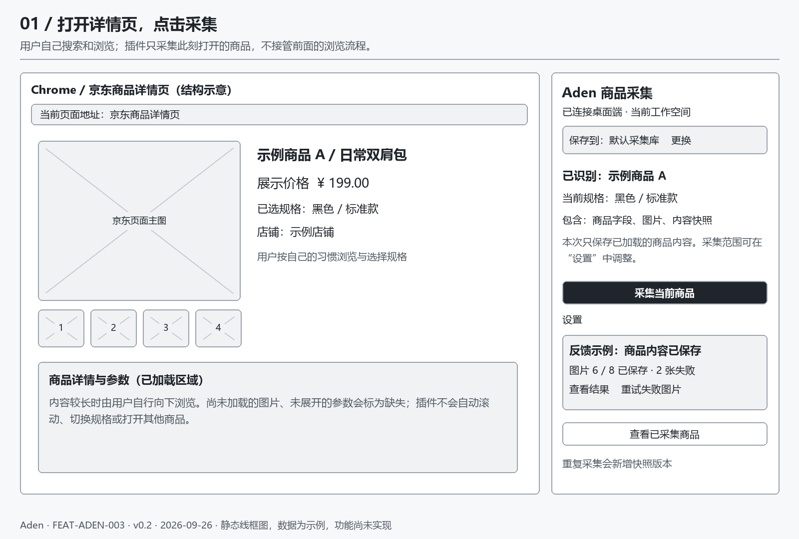
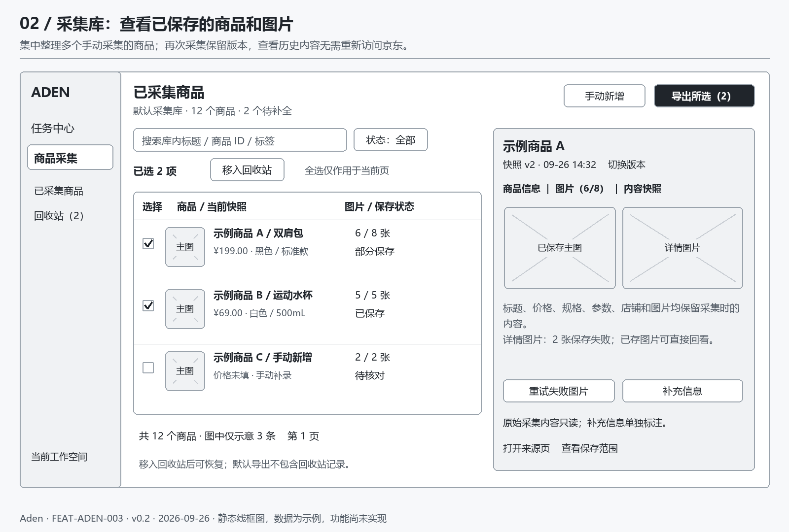
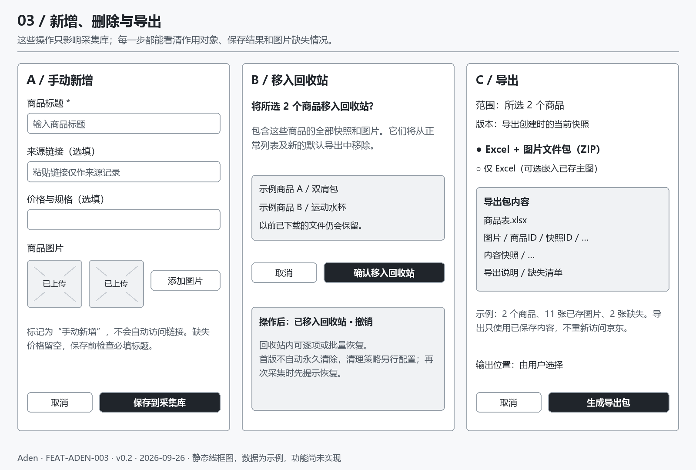

# 京东详情页采集与商品库线框图

> 类型：交互设计；版本：0.2.0；状态：Draft  
> owner：用户决定产品行为；Codex 编写设计  
> 日期：2026-09-26；依据：用户最新明确“自己搜索、打开详情页面，主要采集动作，其他流程不用操作”。  
> 需求与 AC 唯一正文：[技术设计](技术设计.md)；范围与任务：[控制页](README.md)。  
> 以下图片是静态线框图，商品、价格和数量均为合成示例；不是已运行页面或验收截图。

## 1. 主流程

**用户自行搜索并打开详情页 → 插件采集当前商品 → 查看采集库 → 整理商品与图片 → 导出。**

插件不自动搜索、翻页、滚动、切换规格或打开其他商品。默认记住工作空间与保存位置，一次点击开始采集；首次连接、重复采集冲突或异常时才出现对应处理提示。

## 2. 浏览器中的采集面板

- 入口：Chrome 工具栏打开侧边面板，始终显示当前识别商品及所选规格。切换标签页后更新预览，正在保存的请求仍绑定点击时的页面实例。
- 主动作：“采集当前商品”。商品身份或页面类型无法确认时禁用并说明原因，可转手动新增。
- 默认包含已加载的商品字段、商品图片、只读商品内容快照；允许在设置中关闭图片或选择图片分组。
- 反馈分开显示“内容已保存”和“图片已保存数/应保存数”；无服务端确认时不显示成功。图片失败可重试，也可先查看已存部分。
- “查看已采集商品”打开 Aden 采集库；浏览器面板保留轻量入口，不复制桌面整套管理界面。

## 3. 桌面采集库与商品详情

- 采集库搜索只查询已经保存的商品；首版一个默认采集库，工作空间切换遵循既有权限。
- 商品行展示主图、标题、规格、价格、图片状态和保存时间；数量按商品计，快照版本另计。
- 行内查看在右侧展开“商品信息 / 图片 / 内容快照”，可切换版本；窄窗口切换为完整详情页并保留返回入口。
- 选择框支持当页全选；工具栏清楚显示已选数量，批量删除和导出只作用于显式选择。跨筛选切换清空选择并提示。
- 原始快照只读；补充备注、标签、纠错值标为“人工补充”，不覆盖原始采集值。图片可设主图、调整展示顺序、从当前整理结果移除或恢复。

## 4. 新增、删除、导出

- 新增：再次采集一个详情页即可新增商品；同时提供手动录入标题、选填价格/链接、上传本地图片。粘贴链接不会触发自动访问。
- 删除：确认对象数量后移入回收站，包括该商品全部快照与资源引用；可撤销/恢复。首版无自动永久清除，已经下载到电脑的导出文件保持原状。
- 导出：默认“所选商品”，没有选择时可显式选择“当前筛选全部”并核对数量；支持 Excel 与 Excel+图片 ZIP 包。导出冻结商品、快照、人工补充和资源版本，失败图片进入缺失清单。

## 5. 适用状态与提示文案

| 场景 | 可见反馈与下一步 |
| --- | --- |
| 初次使用/未连接 | “请打开 Aden 并连接当前工作空间”；采集按钮禁用，提供重新连接 |
| 不支持的页面/登录验证页 | “请打开京东商品详情页后采集”；不自动跳转或处理验证 |
| 首次空库 | “还没有商品；在详情页点击采集，或手动新增” |
| 保存中 | “正在保存商品内容 / 图片 3/8”；同一请求不能重复提交；可停止未完成资源 |
| 部分保存 | “商品已保存，2 张图片失败”；查看失败原因、重试失败图片、仍可导出 |
| 重复 SKU | “此商品已有记录：新增快照版本 / 查看已有记录”；不无声覆盖旧版 |
| 回收站已有相同 SKU | “此商品在回收站：恢复并采集 / 取消”；不自动复活记录 |
| 权限撤回/离线 | “尚未保存到采集库”；保留受限的本地待传暂存并提示恢复，不显示已保存 |
| 手动表单校验失败 | 字段旁显示原因，保留输入，焦点到首个错误；可取消 |
| 导出中/失败 | 显示生成进度；可取消，失败后重试同一版本；不重新采集源站 |

## 6. 布局与交接

线框图画布 1600×1080，是结构示意而非强制窗口尺寸。目标为 Windows Aden 与 Chrome 侧边面板；不新增移动端。正式视觉沿用 Electron/Vue 现有组件，线框阶段用灰阶、清晰边框和文字状态。技能检索中的营销比较页、夸大字号和外部字体不适用于本管理工具，不采用。

浏览器面板按实际可用宽度重排，窄宽度下按钮整行、提示折行；桌面支持 1024 与 1440 宽度的后续布局验证。表格允许局部横向滚动，主页面不出现意外横向溢出。按钮有文字标签，键盘可达，焦点清晰；弹窗可取消，返回后恢复原焦点。此静态稿无法证明运行时焦点或响应式已通过。

可复现图源：[线框图生成脚本](线框图/生成线框图.py)。使用 Pillow 和 Windows 微软雅黑绘制，生成的三张图供评审；所有业务行为及权限以技术设计为准。
