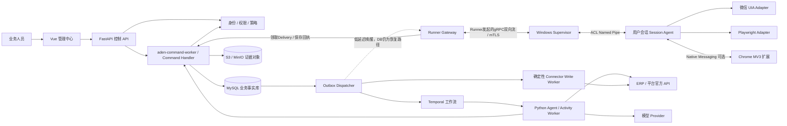
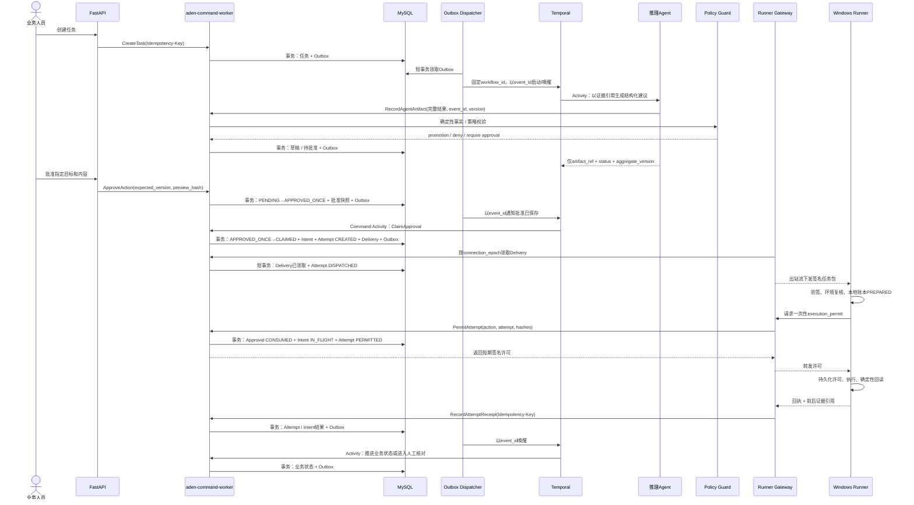

# Aden 基于 Python 的多智能体技术架构（历史候选）

> 文档类型：历史架构候选；ID：DES-ADEN-001；版本：0.1.0；文档状态：Superseded  
> owner：用户负责产品方向与风险接受；平台技术负责人负责架构落地；各能力包业务负责人负责规则与验收  
> 创建 / 更新：2026-09-11  
> 风险等级：L3；涉及个人聊天数据、网站账号、桌面控制和真实对外发送  
> 上游：[项目控制页](../../README.md)、[产品需求文档](../../产品/产品需求文档.md)  
> 替代入口：[桌面执行底座技术设计](../../功能/FEAT-ADEN-001-桌面执行底座/技术设计.md)  
> 验证状态：本文件是候选技术设计。代码、Windows Runner、Chrome 扩展、真实连接器、部署和安全演练均未因此实现或通过  
> 内容边界：设计个人微信客服、采购询价、电商信息采集三个能力包的共用架构；不设计平台限制规避、验证码绕过、指纹伪装或无人批准的外部写入

> [!IMPORTANT]
> 本文件记录 2026-09-11 的 Python-first / FastAPI / Temporal 中心控制面候选方案，已经被后续“RuoYi 为唯一服务端控制面、MySQL 为项目业务事实源、Electron 为桌面壳、Python 仅作受限 Worker / Runner”的决定替代。以下正文保持历史原貌，仅用于追溯，不得作为当前实现、任务或验收依据。

## 1 当时的架构结论

本历史候选当时建议 Aden 采用 **Python-first、边缘多语言、确定性控制面** 的架构，而不是“所有角色都是一个会自己点击的 LLM Agent”。该建议现已被文首所列当前路线替代。

- **Python 是主体**：中心 API、业务领域、可靠工作流、模型调用、数据抽取、规则实现、Windows Session Agent、UIA 适配器和 Playwright 受管浏览器均使用 Python。
- **TypeScript 保留在正确位置**：管理端继续使用 Vue 3 + TypeScript；Chrome Manifest V3 扩展使用 TypeScript。浏览器扩展不应为了“全 Python”而使用不自然的技术。
- **Agent 是受约束的逻辑能力，不等于微服务或进程**：首版多个 Agent 运行在少数 Python Worker 池中，用强类型输入输出、允许工具、成本预算和版本区分；不会一个角色启动一套容器。
- **模型只提出建议**：分类、抽取、草稿、解释和候选计划可以由模型完成；权限、状态迁移、金额、身份、审批、幂等、发送和回读由确定性代码负责。
- **MySQL 是业务事实源**：任务、审批、动作、报价、证据元数据和审计以 MySQL 为准；工作流引擎、Redis 或 Agent 会话都不能形成第二套业务真相。
- **Temporal 负责可恢复的长流程**：等待人工、等待供应商、超时追问、Runner 离线和版本升级由可靠工作流处理，但它不能替代外部动作的幂等和回读对账。
- **Windows Runner 是独立安全边界**：中心端只下发签名且能力受限的任务包；Runner 主动建立出站连接，不开放入站控制端口，不让模型直接获得任意桌面、网络、文件或凭据能力。

首版产品主线建议为 **电商采集 COL → 采购询价 PUR**；个人微信 WX 保持 Experimental 技术轨。理由不是微信一定做不了，而是网页只读采集和采购结果更容易形成可重复验证的商业闭环，个人微信同时存在客户端稳定性、收件人身份和平台许可三重不确定性。

## 2 架构目标与非目标

### 2.1 目标

1. 一套中心端支撑三种能力包，模块可独立授权、停用、升级和认证。
2. Agent 输出、业务对象、Runner 命令和事件都具有版本化 Schema，可回放、校验和审计。
3. 外部动作在崩溃、断网、重复投递和旧 Runner 恢复时不盲目重复。
4. 所有写动作经过确定性策略和必要的人工批准；网页、聊天、附件和模型输出不能扩大权限。
5. 支持多日任务、人工接管、暂停、恢复、超时与连接器版本变化。
6. 支持以来源证据复核回复草稿、商品字段、供应商报价和外部动作结果。
7. 架构能从单租户受监督试点平滑扩展，不在首版堆叠无数据依据的中间件。

### 2.2 非目标

- 不做能够操作任意软件、任意页面和任意账号的通用电脑 Agent。
- 不让大模型直接决定收件人、价格承诺、审批、付款、下单或是否重试发送。
- 不把 UI 坐标、随机延时、代理轮换、浏览器指纹伪装或 CAPTCHA 处理当作稳定性方案。
- 不以“一个角色一个服务”的方式拆出二十多个微服务。
- 不在首版同时引入 Temporal、Celery、Redis Streams 和 NATS 来解决同一类任务投递问题。
- 不复制微信或电商平台密码到中心端、模型上下文、日志或截图中。

## 3 系统上下文与信任边界



| 信任域 | 拥有的责任 | 明确不能拥有 |
| --- | --- | --- |
| 中心控制面 | 身份、授权、任务、审批、业务状态、审计、策略、动作账本 | 客户桌面登录态、任意脚本下发、绕过来源策略 |
| Agent Runtime | 受限上下文中的理解、抽取、草稿和候选计划 | 最终授权、业务事实覆盖、任意执行器句柄 |
| Windows Supervisor | 设备身份、出站控制通道、进程与版本管理、停止证明 | 用户界面操作、聊天正文长期保存、业务数据库访问 |
| Windows Session Agent | 当前交互会话中的 UIA / 浏览器执行和回读 | 自行扩展任务、跨工作空间访问、长期中心凭据 |
| Chrome 扩展 | 已批准页面的 DOM 观察与结构化消息 | 远程代码、任意域名权限、直接连接任意本机程序 |
| ERP / 平台 / 模型 | 提供各自接口的结果 | 决定 Aden 内部权限和工作流状态 |

页面 DOM、聊天内容、附件、商品描述、供应商话术和模型输出都属于**不可信输入**。它们只能成为观察或建议，不能通过文字内容调用新工具、改变批准范围或要求 Runner 读取其他文件。

## 4 “每一种角色都是 Agent”应怎样理解

### 4.1 三类运行角色

| 类型 | 是否使用 LLM | 适合的工作 | 运行约束 |
| --- | --- | --- | --- |
| 推理 Agent | 是 | 意图分类、需求解析、字段抽取、草稿、候选计划、解释差异 | 只返回结构化建议；无最终写权限；有限步数、时间和费用 |
| 策略 / 规则角色 | 否，模型仅可辅助分类 | 权限、金额、状态机、限额、审批有效性、身份唯一性、可比性 | 纯函数或事务服务；结果可重复；冲突时 fail-closed |
| 执行 Worker | 否 | 调用 API、读取 DOM、操作 UIA、提交一个已批准动作、回读对账 | 只接受签名任务包；能力清单固定；不理解并扩大业务目标 |

因此，产品界面可以让用户看到“需求理解 Agent”“询价 Agent”“报价 Agent”，但工程上它们未必是单独进程。真正的隔离边界应按**副作用、凭据和设备**划分，而不是按角色名称划分。

### 4.2 Agent 定义契约

工程上区分稳定的`AgentFamily`与每次调用的不可变`AgentRunSpec`。同一Family的不同模式使用不同提示词、Schema、工具和评测集，不能合成一个拥有所有工具的“大Agent”：

```yaml
agent_family: sourcing
run_mode: extract_quote
run_spec_version: 1.0.0
input_schema: aden.pur.QuoteExtractionInput@1
output_schema: aden.pur.QuoteExtractionResult@1
allowed_tools:
  - evidence.read_text
  - catalog.read_product
model_policy: extraction-balanced
side_effect_level: none
max_steps: 4
timeout_seconds: 45
cost_limit_cny: 0.20
policy_pack: pur-extraction-v1
eval_suite: pur-quote-gold-v1
```

服务端运行依赖与实际模型输入必须分开。工作空间、权限、Tool Gateway和审计句柄只存在Python运行时，不能序列化给模型让其填写：

```python
class AgentRuntimeDeps:
    workspace_id: UUID
    task_id: UUID
    step_id: UUID
    actor_id: UUID
    correlation_id: UUID
    granted_scopes: frozenset[str]
    tool_gateway: ToolGateway
    audit_sink: AuditSink

class AgentModelInput(BaseModel):
    schema_version: Literal["1"]
    sanitized_artifacts: list[ModelArtifact]
    evidence_refs: list[DataRef]
    task_constraints: TaskConstraints

class AgentInvocationResult(BaseModel):
    schema_version: Literal["1"]
    output: Annotated[
        ReplyDraftProposal
        | RequirementCandidates
        | SupplierMessageProposal
        | QuoteExtractionCandidates
        | ProductFieldCandidates
        | Escalation
        | NoAction,
        Field(discriminator="kind"),
    ]
    usage: AgentUsage

class QuoteExtractionCandidates(BaseModel):
    kind: Literal["quote_extraction_candidates"]
    fact_candidates: list[FactCandidate]
    missing_fields: list[str]
    conflicts: list[FactConflict]
    uncertainty: list[Uncertainty]
```

所有模型输出使用 Pydantic 严格模型、`extra="forbid"`、有版本的角色专用判别联合类型；没有一个万能结果允许所有模式同时返回事实和动作。金额使用 `Decimal`，时间带时区，来源用 `source_ref` 指向不可变证据。`FactCandidate`和`ActionProposal`都只是候选，分别经过确定性的Fact Promotion Gate和Policy Guard后才能成为业务事实或待批准动作。Pydantic 保证校验后的对象符合声明类型，但不保证输入事实真实，因此必须继续做来源与业务校验，参见 [Pydantic Models](https://docs.pydantic.dev/latest/concepts/models/)。

Fact Promotion Gate必须验证`source_ref`确实属于该RunSpec允许输入，校对引用片段 / 字段原文、内容哈希、观察时间、Parser / 模型版本和现有冲突；模型自造的证据ID、越界引用或高等级来源冲突全部进入待核对，不能落为`ValidatedFact`。

### 4.3 Agent SDK 选择

首版建议使用 **PydanticAI** 承载推理 Agent，原因是 Python 原生、依赖和输出类型清晰、Provider 可替换；官方将 Agent 定义为指令、工具、结构化输出、依赖和模型的组合，见 [PydanticAI Agents](https://ai.pydantic.dev/agents/)。

PydanticAI的Deferred Tools或人工批准能力只用于模型运行暂停，不作为Aden服务端授权边界；客户端返回“已批准”仍必须经过Aden身份、Scope、批准快照和事务动作账本，参见 [PydanticAI Deferred Tools](https://pydantic.dev/docs/ai/tools-toolsets/deferred-tools/)。

如果公司明确只采用 OpenAI，可在同一 `ModelAgentPort` 后改用 **OpenAI Agents SDK**；其 Agent 同样支持指令、工具、Guardrail、Handoff 和结构化输出，见 [OpenAI Agents SDK](https://openai.github.io/openai-agents-python/agents/)。首版只选择其中一套，不并用两套 Agent SDK，不把 SDK Session 当业务事实库。

`ModelAgentPort`只暴露窄接口`run_typed(run_spec, model_input, runtime_deps) -> AgentInvocationResult`。Handoff、SDK Session、Deferred Tool生命周期、SDK审批状态、Provider Trace和SDK durable execution都不进入领域契约；Temporal是唯一业务流程游标。Provider、精确模型与参数组合分别绑定`model_policy_id`和金标证据，不能把“可替换”理解为运行中任意热切换。

首版不引入 LangGraph。只有 G2 之后出现大量运行时动态认知分支，且现有代码编排难以表达时，才通过 ADR 评估它；即使采用，其 checkpoint 也不能承载审批、动作账本和业务终态。

### 4.4 首版到底实现几个 Agent

上述“需求解析、询价草稿、报价抽取”等是**逻辑角色或运行模式**，不是首版就要各建一个自主 Agent。P0 只注册三个主要 Agent 定义：

| 主要 Agent | 内部模式 | 何时才拆分 |
| --- | --- | --- |
| `CustomerServiceAgent` | `classify_intent`、`draft_reply`、`explain_escalation` | 模式间出现可量化的提示词 / 工具 / 权限冲突 |
| `SourcingAgent` | `normalize_requirement`、`plan_discovery`、`draft_supplier_message`、`extract_quote`、`explain_comparison` | 金标显示单一上下文显著降低某一模式质量，或角色需要不同数据权限 |
| `CatalogUnderstandingAgent` | `map_product_fields`、`resolve_sku_terms`、`explain_uncertainty` | 品类Schema、模型和评测集必须独立发布时 |

任务入口已经明确时，由确定性 `task_type` 路由，不设置“万能总指挥 Agent”。后续若增加全局自然语言入口，可设置只读的 `WorkspaceCopilotAgent`，但它只能生成任务建议，不能继承三个能力包的执行权限。Agent之间只交换经过Schema校验的Artifact引用，不自由群聊；P0模型Handoff和Agent自行委托深度均为0，所有调用次序由WorkflowCoordinator决定。未来只读经理—专家模式如有实证必要，再单独开放一层且子Agent重新计算ContextView与工具交集。

### 4.5 Tool Manifest 与实际授权

`AgentToolManifest`只包含只读工具和“创建候选 / 建议”工具；`ExecutorCapabilityManifest`只包含Runner或专用连接器可以执行的确定性命令。二者不能合并，`wechat.send_text`这类外部写工具永不直接暴露给推理Agent。

```yaml
tool_id: evidence.read_text
version: 1.0.0
execution_zone: server
effect: read                 # read | proposal | external_write
input_schema: aden.tool.EvidenceReadInput@1
output_schema: aden.tool.EvidenceReadResult@1
required_scopes: [evidence:read:task]
allowed_target_types: [task_evidence]
data_classification: confidential
approval_mode: none
certification_card_id: null
idempotency_strategy: content_ref
retry_class: safe_read
timeout_seconds: 10
max_calls: 4
evidence_policy: read-audit-v1
expires_at: 2026-12-31T23:59:59+08:00
```

每次Agent运行的实际工具集是以下集合的交集：`RunSpec允许工具 ∩ 当前用户权限 ∩ 当前任务范围 ∩ 连接器认证能力 ∩ 来源策略 ∩ 当前熔断 / kill switch状态`。workspace、task、actor和目标Scope由Tool Gateway从`AgentRuntimeDeps`注入，模型参数不能覆盖。

### 4.6 Context Broker 与 ContextView

Context Broker依据服务端TenantContext、任务 / 需求版本、RunSpec输入Schema、处理目的、数据等级和明确证据引用构建不可变`ContextView`。它执行字段白名单、脱敏、过期 / 撤权检查、最大条数 / token预算和跨任务过滤；保存ContextView哈希、引用版本与脱敏策略，不把整个聊天历史或工作空间搜索结果直接交给模型。

ContextView只决定本次模型可见内容，不授予后续工具权限。每次Tool Gateway调用仍以当前权限和策略重新鉴权，防止Run开始后撤权、任务换负责人或来源策略失效造成TOCTOU；撤权后运行可保留审计结果，但不能继续取得数据或产生动作建议。

## 5 逻辑 Agent 与确定性组件清单

本节的“推理 Agent”表示三个Agent Family中的某个`AgentRunSpec`模式，不增加独立SDK Agent或服务。可以一次强类型调用共同产出意图、风险和草稿时，不机械拆成多轮模型调用；自然语言推荐解释按需调用，确定性排序表始终可独立交付。

### 5.1 共用能力

| 逻辑角色 | 类型 | 输入 | 输出 | 禁止事项 |
| --- | --- | --- | --- | --- |
| 任务理解模式（P1全局入口） | 推理 | 用户目标、表单、批准的数据引用 | `ProposedPlan`、缺失项、风险提示 | P0明确入口不调用；不创建可执行外部动作 |
| 领域路由器 | 确定性 | 任务类型、能力认证卡、连接状态 | 固定 Workflow 与 Task Queue | 不由模型随意选择高权限执行器 |
| 策略守卫 | 确定性 | 身份、Scope、来源策略、动作哈希、限额 | allow / deny / require approval及规则编号 | 不接受页面或模型临时修改规则 |
| Fact Promotion Gate | 确定性 + 必要时人工 | 候选字段、原始证据、Parser / 模型版本、冲突 | 已观察事实、待核对或拒绝 | 模型候选不直接升级为权威事实 |
| 证据核验角色 | 完全确定性 / 人工权威核对 | 执行前后观察、稳定回执、哈希 | `CONFIRMED` / `NOT_OCCURRED` / `OUTCOME_UNKNOWN` | 模型不参与动作结果终态判定；不因“看起来成功”盲目确认 |
| 人工审批角色 | 人 | 目标、内容、附件、金额、来源、风险 | 有效期内的一次批准或拒绝 | 不批准模糊对象和后续任意变更 |

### 5.2 个人微信客服 WX

| 角色 | 实现 | 主要职责 |
| --- | --- | --- |
| UIA Observer | Python 确定性 Worker | 在认证客户端版本中读取会话身份锚点、消息和输入框状态 |
| Identity Resolver | 规则 + 人工 | 以稳定会话 / 联系人标识关联 ERP；重名或不唯一阻断 |
| Intent Classifier | 推理 Agent + 硬规则 | 分类普通问答、订单进度、退款、赔付、交期承诺等风险意图 |
| ERP Fact Retriever | Python Connector | 只读查询批准字段，生成带 `asOf` 和有效期的事实快照 |
| Reply Draft Agent | 推理 Agent | 只基于事实快照和话术策略生成草稿并列出来源 |
| Reply Policy Validator | 确定性 | 检查收件人、敏感意图、承诺、附件、事实过期和审批要求 |
| UIA Send Executor | Windows Worker | 再校验窗口 / 会话 / 输入框后执行一次已批准发送 |
| Send Reconciler | 确定性 | 回读同一会话，确认、否定或标记结果未知 |

WX 首版只读纯文本和生成草稿；只有五类必需 UIA 角色全部稳定、身份锚点唯一、故障回归通过后，才开放逐条批准发送。模型永远不能决定“当前窗口应该就是目标联系人”。

### 5.3 采购询价 PUR

| 角色 | 实现 | 主要职责 |
| --- | --- | --- |
| Requirement Agent | 推理 Agent | 把自然语言需求解析为规格、数量、预算、目的地、截止和缺失项 |
| Requirement Validator | 确定性 | 校验单位、数量、含税到货预算、硬约束和需求版本 |
| Discovery Agent | 推理 Agent | 基于批准来源提出搜索词、过滤条件和候选检索计划 |
| Product / Supplier Resolver | 规则 + 人工 | 合并平台稳定 ID，防止标题相似导致商品或店铺错并 |
| Inbound Correlation Resolver | 确定性 + 人工 | 以平台消息ID、线程ID、发送动作和任务会话映射关联回复；同线程多任务且归属不明时进入待关联区 |
| RFQ Draft Agent | 推理 Agent | 生成不泄露内部预算和其他报价的询价 / 缺项追问草稿 |
| Conversation Planner | 推理 Agent | 依据已回答和缺失字段提出有限次下一问或转人工建议 |
| Quote Extraction Agent | 推理 Agent | 从客服文本 / 报价单抽取单价、税运、MOQ、交期、有效期及原话 |
| Quote Validator / Calculator | Python `Decimal` 纯函数 | 校验同规格可比性、逐行舍入、总成本、预算和硬约束 |
| Recommendation Agent | 推理 Agent | 基于确定性比较结果解释差异，不能重算金额或补造未知值 |
| Dispatch / Reconcile Worker | 确定性 | 调用批准的 API / DOM / UIA 发送与回读，维护动作状态 |

任何平台入站回复先经过Inbound Correlation Resolver，按平台账号 / 连接器、`message_id`、`thread_id`、供应商稳定ID、已登记任务会话和原RFQ `action_id`关联；时间窗只能辅助排序。不能唯一归属时进入`WAITING_ASSOCIATION`，模型只能给候选说明，不能把消息直接交给Quote Extraction或更新报价。

### 5.4 电商信息采集 COL

| 角色 | 实现 | 主要职责 |
| --- | --- | --- |
| Collection Planner模式 | 推理 Agent | 只用于后续受管多页任务；`attended-activeTab`页面由用户选择、字段由来源策略冻结，P0不调用 |
| Source Policy Guard | 确定性 | 校验域名、路径、账号、字段、用途、频率、数据量和有效期 |
| API / DOM / Extension Worker | 确定性 | 按已认证模式读取响应或当前页 DOM，不主动对抗限制 |
| Product Extractor | 确定性Parser优先，Agent补未知字段 | 按“官方API / JSON-LD / 站点模板 → 通用DOM规则 → 结构质量校验 → 仅未知字段送Catalog Agent”处理；模型候选不得覆盖高等级来源 |
| Normalizer / Deduper | 确定性 | 以平台稳定 ID、SKU 和上下文去重，禁止只按标题长期合并 |
| Structure Change Detector | 规则 + 统计 | 检测模板指纹、字段缺失和异常分布，变化时隔离数据 |
| Dataset Publisher | 确定性 | 只有通过质量规则的数据进入版本化内部数据集或采购候选池 |

采集遇到 `403`、验证码、登录失效、持续限流、明确自动化阻止或权限不明时熔断。所谓“低风险”来自明确授权、低频、缓存、增量、官方接口优先和遇阻停止，不来自模仿真人规避识别。

## 6 中心控制平面

### 6.1 推荐技术

| 层 | 首版选择 | 设计理由 |
| --- | --- | --- |
| HTTP / 实时 API | FastAPI | Python 类型提示、OpenAPI、异步 I/O；SSE优先，必要时WebSocket |
| Schema | Pydantic v2 | API、事件、Agent、Runner 共享严格模型与 JSON Schema |
| ORM / 迁移 | SQLAlchemy 2.x + Alembic | 事务边界、行锁、迁移和测试清晰 |
| 业务库 | MySQL 8.4 LTS / InnoDB | 项目默认事实库；支持 ACID、行锁、唯一约束和 Outbox |
| 可靠工作流 | Temporal Python SDK | 多日等待、Timer、Signal / Update、取消、恢复和版本演进 |
| 证据对象 | S3 兼容对象存储；本地开发用 MinIO | 大截图、HTML、UIA树和附件与业务元数据分离 |
| 模型层 | PydanticAI + 自有 `ModelAgentPort` | 强类型输出；Provider 和模型策略可替换 |
| 缓存 | 首版可无 Redis | 后续只用于限流、短期缓存和在线状态投影，不存业务真相 |
| 可观测性 | OpenTelemetry + Prometheus / Grafana | 以 task / step / action / attempt 贯穿 API、Workflow 和 Runner |

FastAPI 的进程内 `BackgroundTasks` 只用于轻量响应后处理，不能承担询价等待、人工审批、UIA 发送等可靠任务；FastAPI 官方也建议重计算或多服务器任务采用更完整的工具，见 [Background Tasks](https://fastapi.tiangolo.com/tutorial/background-tasks/)。

### 6.2 进程边界

服务器侧使用同一Python代码库构建八类**进程配置**，不是八套独立产品或一个Agent一个服务。开发环境可以合并低风险配置，进入受监督试点后必须按凭据和网络权限分离：

1. `aden-api`：管理端HTTP、身份适配、只读查询、命令入口和SSE；把已认证actor上下文转交Command Worker，自身使用只读业务库权限。
2. `aden-command-worker`：运行内部Command API与Temporal Command Activities；持有受限MySQL写权限，统一执行Policy、CAS、Idempotency、Inbox、业务事实和Outbox事务；没有模型、ERP、平台账号或Runner执行能力。
3. `aden-workflow-worker`：只运行可重放Workflow；不持有MySQL、模型、ERP、对象存储或Runner凭据。
4. `aden-reasoning-worker`：运行模型Activity，只能读取经Context Broker裁剪的证据、调用模型，并调用极窄的`agent_artifact.create`内部Command接口。
5. `aden-integration-read-worker`：运行ERP / 平台只读Activity，按连接器使用独立服务身份。
6. `aden-connector-write-worker`：只处理已领取批准的官方API外部写动作；没有LLM、任意网页或桌面权限。
7. `aden-runner-gateway`：设备发起的 `grpc.aio` 双向流、mTLS、任务包投递、心跳、版本和回执；没有模型能力，状态写入调用Command Worker。
8. `aden-outbox-dispatcher`：从事务Outbox向Temporal Client、Gateway低延迟唤醒或受限连接器投递；持久Runner delivery已在业务事务创建，Gateway经Command Worker领取delivery是恢复路径。Dispatcher不执行真实外部动作。

Task Queue只负责路由，不自动形成权限隔离。上述进程使用独立服务账号、网络策略和密钥；共享的是版本化领域包与契约。不是每个Agent一套容器，三个主要推理Agent共同运行于可水平扩展的reasoning worker池。

### 6.3 Temporal 的准确职责

Temporal 适合以下长生命周期工作：等待批准、等待客户 / 供应商回复、截止时间、有限追问、暂停 / 接管、Runner 离线等待和流程版本升级。Temporal Workflow 必须可重放，联网、数据库、模型、随机、UIA 和浏览器操作都放入 Activity。其 Python 官方资料见 [Develop with Python](https://docs.temporal.io/develop/python)、[Message passing](https://docs.temporal.io/develop/python/workflows/message-passing) 和 [Workflow versioning](https://docs.temporal.io/develop/python/workflows/versioning)。

Temporal 不成为业务事实源：

- MySQL 拥有任务、批准、动作、报价和业务终态；管理端读取 MySQL。
- Temporal 拥有执行历史、Timer、等待条件和编排游标。
- Activity 采用至少一次语义设计，必须幂等；外部 UI 点击不能靠 Activity 重试实现 exactly-once。
- 同一业务状态只由幂等Command Handler写入。Workflow通过Activity调用Command Handler，后者在MySQL同一事务写业务事实与Outbox；Workflow不持有数据库凭据、不自行覆盖表字段。
- API或Command Handler提交后，由Outbox Dispatcher以固定`workflow_id + event_id`启动或唤醒Workflow；不依赖“数据库提交后直接调用Temporal”的最佳努力双写。

`aden_task_workflow`映射保存`workflow_id`、当前`run_id`、Workflow类型 / 代码版本、`last_published_event_id`和`last_applied_aggregate_version`。Workflow忽略重复版本，顺序应用连续版本；发现版本跳跃时停止推进，通过只读Activity从MySQL重建视图。已完成Workflow收到晚到事件时按对应业务规则归档或显式启动新run，不能隐式重开终态。MySQL、Temporal和对象存储恢复点不一致时，以MySQL业务版本和对象哈希做对账，再补投Outbox / 重建Workflow，不重放结果未知的外部动作。

Temporal Event History不保存聊天全文、截图、DOM、报价单、Prompt或模型完整输出。Workflow参数、Signal、Update、Memo和Search Attribute只传不可猜测对象ID、版本、状态码、哈希和证据引用；Search Attribute只放非敏感索引。确需传递的少量敏感字段使用自定义Payload Codec加密并纳入密钥轮换，Temporal UI访问、history留存、备份和删除与Aden策略一致。Temporal默认数据转换与History边界见 [Data handling](https://docs.temporal.io/develop/python/data-handling)。

## 7 Windows 执行平面

### 7.1 两进程模型

Windows 服务自 Vista 起运行在 Session 0，不能直接和用户桌面交互；微软建议把 UI 逻辑放在用户会话应用并通过 IPC 与服务通信，见 [Interactive Services](https://learn.microsoft.com/en-us/windows/win32/services/interactive-services)。因此 Runner 固定拆分：

| 进程 | 会话 / 身份 | 职责 |
| --- | --- | --- |
| `aden-runner-service` | Session 0，专用低权限服务账号 | 设备证书、出站 mTLS、任务包验签、防重放、版本 / 进程管理、看门狗、kill switch、停止证明 |
| `aden-session-agent` | 目标登录用户的交互会话 | UIA、Playwright、扩展 Native Host桥、本地抢占检测、执行前后证据 |

二者使用 **pywin32 Named Pipe + 长度前缀 Protobuf 帧**，Pipe 以精确 Windows ACL 限制到Supervisor Service SID和目标登录会话的Logon SID。首版不使用“gRPC over Named Pipe”：Python gRPC 的正常传输继续用于Supervisor到中心的mTLS通道，本机IPC使用可明确控制ACL和生命周期的原生Pipe。

默认让Supervisor以`LocalService + 专用Service SID`运行，Session Agent由已授权用户登录后自启动再连接Supervisor，不保存用户密码。若未来确有无人值守启动需求，另设一个不联网、不读取业务数据的最小LocalSystem Launcher，并对其`WTSQueryUserToken / CreateProcessAsUser`高权限能力单独审计；不能直接把整个Supervisor改成LocalSystem。

Session Agent订阅Windows会话锁定、解锁、注销、控制台 / RDP断开等事件；Supervisor同时通过Service Handler接收`SERVICE_CONTROL_SESSIONCHANGE`，事件类型以微软的 [WM_WTSSESSION_CHANGE](https://learn.microsoft.com/en-us/windows/win32/termserv/wm-wtssession-change) 为准。每个WTS Session最多一个Agent实例，任务显式绑定`windows_session_id + TokenLogonSid`，绝不自动选择“最近活跃用户”。任一侧报告锁屏、注销或断开即停止发放许可并转`WAITING_SESSION`；恢复须等待桌面ready事件与新的身份 / 窗口探针，双方状态不一致时fail-closed。

IPC采用两阶段协议。固定Bootstrap Pipe只做注册、不投递任务，使用`FILE_FLAG_FIRST_PIPE_INSTANCE`、`PIPE_REJECT_REMOTE_CLIENTS`、显式低权限DACL和小帧限额。Supervisor短暂`ImpersonateNamedPipeClient`读取并核验TokenLogonSid、Session ID和完整性级别后立即`RevertToSelf`；双方再用`GetNamedPipeClientProcessId / GetNamedPipeServerProcessId`核验PID、受管理员保护的安装路径、Authenticode签名和安装实例。依据见微软 [Named Pipe Security](https://learn.microsoft.com/en-us/windows/win32/ipc/named-pipe-security-and-access-rights)、[GetNamedPipeClientProcessId](https://learn.microsoft.com/en-us/windows/win32/api/winbase/nf-winbase-getnamedpipeclientprocessid) 和 [ImpersonateNamedPipeClient](https://learn.microsoft.com/en-us/windows/win32/api/namedpipeapi/nf-namedpipeapi-impersonatenamedpipeclient)。

Bootstrap成功后，Supervisor创建随机实例名的per-session Pipe，其DACL只允许Service SID、该TokenLogonSid及必要恢复主体，并用随机挑战建立短期会话MAC密钥。每条本机消息携带协议版本、进程 / 会话 / 实例、任务 / 动作、序列、nonce、过期、租约epoch和明确的会话MAC；中心任务包仍单独验中心签名。拒绝远程、重复、乱序、跨会话和过期消息。截图等大证据通过受ACL保护的临时对象与哈希引用传输，不塞入IPC消息。

ACL、签名路径与握手不能防御已经控制同一登录用户或本地管理员的恶意代码；该情况视为Session信任边界失守并停止Runner，而不是宣传成已完全隔离。

### 7.2 Python UIA 适配器

UIA 是 Windows 的辅助功能 / 自动化 API。客户端可从 UI Automation Tree 读取元素、属性、Pattern 和事件，见 [UI Automation Clients Overview](https://learn.microsoft.com/en-us/windows/win32/winauto/uiauto-clientsoverview)。推荐用端口隔离具体库：

```python
class DesktopAutomationPort(Protocol):
    def inspect_tree(self, window: WindowRef) -> UiTreeSnapshot: ...
    def resolve(self, locator: SemanticLocator) -> ElementRef: ...
    def read(self, element: ElementRef) -> Observation: ...
    def invoke(self, command: ApprovedUiCommand) -> ExecutionReceipt: ...
```

- G0/G1 探针可比较 `pywinauto` UIA backend、`uiautomation` 或直接 COM 封装。
- 业务定位器只使用语义属性、树关系和支持 Pattern，不把屏幕坐标写入业务 Workflow。
- UIA 调用可能阻塞或挂起，放在有超时和进程终止能力的同步Worker子进程；COM初始化、事件注册和移除固定在同一MTA线程，不能阻塞Session Agent或中心asyncio event loop。
- `AutomationElement`及第三方封装对象不跨线程、进程或动作长期持有；跨边界只传版本化语义定位器和不可变观察。
- UIA Event只作唤醒，配合有界轮询和执行后回读；不假设所有Provider都会可靠发出全部事件。批量属性读取优先使用UIA Cache，界面变化后重建缓存和语义定位结果。
- 每次写动作前重新解析语义定位器，优先使用`InvokePattern`、`ValuePattern`和`SelectionPattern`；首版不把`SendInput`作为微信发送路径，更不通过`UIAccess`或提权绕过完整性边界。
- 如果 Python 封装在冻结微信版本下达不到认证指标，保留用小型 .NET UIA Helper 替换 adapter 的能力；上层任务、审批和协议不变。
- OCR / 视觉只允许产生读取候选和异常证据，P0 不允许用它确定联系人或点击发送。

### 7.3 单 Writer、租约与停止证明

一个交互桌面同一时间最多一个writer。Session Agent在创建Executor和转交一次性execution permit前先验证；短生命周期Executor在每个实际副作用发生前立即独立复核：

1. 本地单调时钟租约未过期；
2. 本地独占 mutex 仍持有；
3. `fencing_token` 与任务包一致；
4. kill switch 未触发；
5. 用户没有键鼠抢占或切换会话；
6. 目标窗口、账号、联系人 / 页面和输入控件仍与批准快照一致。

Executor一次只持有一个批准动作及其短期许可，执行、回读并写入本地回执后立即退出，不接受追加目标或第二条命令。任一复核条件变化都不产生输入，返回前置失败或结果未知；不能用Session Agent较早的检查替代副作用前复核。

键鼠抢占不能只依赖`GetLastInputInfo`，因为它不能稳定区分真人输入和Runner自身输入。实现综合Supervisor / Session会话事件、前台窗口变化、受限键鼠事件观测、内部动作标记、可见托盘状态与本地紧急停止热键；每个离散写动作前再次检查。检测到人工输入后不再领取新动作，已经提交给目标应用的动作只能回读或标结果未知。认证卡报告P95 / P99停止延迟后再冻结SLO。

UIA 目标应用不会验证中心的 fencing token，因此心跳超时和网络隔离不能证明旧 writer 已停止。只有 Supervisor 获得旧进程 / 会话的 OS 级终止结果，或等价不可逆隔离证明，才允许新 writer 开始；否则相关动作进入 `OUTCOME_UNKNOWN`，不换机重放。

长驻Session Agent只能调度、观察和监控会话，代码路径不得直接产生UI输入；每个可能写入UI的Executor都是短生命周期子进程并运行在独立Windows Job Object中。Supervisor先创建不可预测名称、禁止breakaway且启用`JOB_OBJECT_LIMIT_KILL_ON_JOB_CLOSE`的per-action Job，保留`TERMINATE | QUERY`句柄，并在DACL中只授予目标Logon SID所需的`ASSIGN_PROCESS | QUERY`权限。Session Agent以挂起态创建Executor、以不可继承临时句柄打开该Job、完成Assign后关闭自己的Job句柄并通知Supervisor；Supervisor核验`ActiveProcesses`后才允许恢复Executor，从而成为唯一长期Job句柄持有者。

暂停或接管时Supervisor调用`TerminateJobObject`并等待`ActiveProcesses=0`，获得OS级停止证据后才释放新writer。LocalService本身不当然有权终止用户进程，Supervisor预先持有的Job句柄是停止能力来源。Windows [Job Objects](https://learn.microsoft.com/en-us/windows/win32/procthread/job-objects)用于获得进程树级生命周期证据；Chromium嵌套Job和子进程归属必须先做Windows版本探针，无法完整收拢时该Playwright能力不获认证。旧Job退出前，新writer保持阻断。

### 7.4 本地动作账本与跨重启恢复

Supervisor维护受ACL保护并加密的本地SQLite动作账本，以`(action_id, attempt_id)`为唯一键，至少保存命令 / 批准哈希、Runner Session、`connection_epoch`、fencing token、阶段、前后证据引用和中心回执确认。它是安全日志和重投去重依据，不取代MySQL业务真相。

```text
RECEIVED → PREPARED → PERMITTED → EXECUTING
         → RESULT_CONFIRMED | RESULT_NOT_OCCURRED | RESULT_UNKNOWN
         → RECEIPT_ACKED
```

- 越过UI副作用边界前，先以`FULL`同步等级事务持久化`PERMITTED / EXECUTING`并完成fsync；不能只写内存。
- 相同ID且哈希相同的合法重投返回已有阶段或回执，不重复执行；相同ID但哈希不同立即拒绝并告警。
- 执行回执进入durable spool，只有中心Command Handler在MySQL提交并返回回执ACK后才可清理。
- 重启后对`EXECUTING`和未ACK终态先回读 / 重投回执；无法确认外部结果时上报`OUTCOME_UNKNOWN`，不再次点击。
- nonce / sequence防恶意重放，本地账本处理丢ACK后的合法重投，两者不能相互替代。

### 7.5 打包、凭据与更新

- 首个兼容性探针以CPython 3.12 x64为候选基线，最终小版本由UIA / Playwright依赖认证卡冻结；依赖锁定并校验wheel hash。
- Supervisor、Session Agent和Native Host分别构建，优先采用PyInstaller `onedir`便于诊断和签名，不让高权限`onefile`从临时目录加载库；打包边界参考 [PyInstaller operating mode](https://pyinstaller.org/en/stable/operating-mode.html)。版本目录安装在普通用户不可写的Program Files，运行数据分别进入带ACL的ProgramData / LocalAppData。EXE、DLL和安装器做Authenticode SHA-256签名与时间戳；JSON / Protobuf更新清单使用固定更新公钥校验的独立CMS / COSE或等价签名封装，不能笼统当作Authenticode文件。构建生成SBOM和依赖许可清单。
- 设备首次注册通过Windows CNG KSP生成标记不可导出的设备私钥，ACL只授予Supervisor Service SID；需要硬件绑定时另要求TPM-backed key。中心只保存设备公钥、状态和吊销信息，软件“不可导出”不宣传为绝对不可提取。
- 平台登录态保留在专用 Windows 用户 / 浏览器 Profile；必要凭据进入 Windows Credential Manager 或客户批准的凭据库，Runner 只取得短期引用。
- 更新使用不可变版本目录、完整文件哈希、反降级版本和原子版本指针，已知良好回滚包同样验签。按实验机、小批量、全量灰度；先进入`DRAINING`、处理在途结果并确认Job退出，再切换版本指针。启动、握手、能力探针或核心指标异常自动回滚；协议至少支持N / N-1滚动升级。中心不能下发任意 Python 代码，只能下发签名发布物和版本化任务包。

### 7.6 Gateway连接归属与任务路由

MVP可以先运行单个Gateway，但不能因此宣称高可用。扩展到多副本时，MySQL维护`aden_runner_connection_lease(runner_session_id, gateway_instance_id, connection_epoch, stream_id, expires_at, version)`；Runner以mTLS重连时原子递增`connection_epoch`，旧连接的命令和回执不能推进新会话，只能进入对账。

Action Intent事务同时创建持久化`aden_runner_delivery`。每个Gateway通过Command Worker只领取“自己当前持有有效连接租约”的Runner delivery，并用短租约防止进程崩溃后永久占用；Command Worker对MySQL的轮询 / 领取是恢复路径，进程内唤醒只作低延迟优化。由此首版不需要Redis / NATS路由背板。若多Gateway实测吞吐使DB路由成为瓶颈，再以ADR引入消息背板，MySQL中的动作和delivery仍保持权威。

## 8 Chrome 与网页执行

### 8.1 三种模式分别认证

| 模式 | 技术 | 首版用途 | 权限边界 |
| --- | --- | --- | --- |
| `attended-activeTab` | TypeScript MV3扩展 + content script | 用户主动打开商品页并点击采集 | `activeTab`临时权限、当前tab、当前origin、用户手势 |
| `managed-host_permissions` | MV3扩展 + 固定域名策略 | 获批站点的任务化 DOM 读取 | 扩展版本、浏览器profile、域名 / 路径、账号和工作空间 |
| `playwright-managed-browser` | Python Playwright + 独立受管profile | 有预算的授权批量流程 | Runner、浏览器版本、profile、站点解析器、账号和工作空间 |

P0 先实现 `attended-activeTab`。Chrome 官方说明 `activeTab` 在用户手势后给予当前标签临时权限，跨 origin 导航或关闭标签后撤销，见 [activeTab](https://developer.chrome.com/docs/extensions/develop/concepts/activeTab)。

### 8.2 扩展与 Native Messaging

扩展本体使用 TypeScript，不从服务器加载远程代码。内容脚本只读取允许的 DOM；Service Worker 做事件和消息转发。需要与 Runner 通信时，按 Chrome [Native Messaging](https://developer.chrome.com/docs/extensions/develop/concepts/native-messaging) 使用注册的 Python Native Host：

- `allowed_origins`只列批准的扩展 ID，不使用通配符；
- 内容脚本不能直接访问 Native Host，消息经 Service Worker 转发；
- Chrome启动Native Host时可提供调用扩展origin等信息，但不会为Aden证明browser profile或扩展版本；Service Worker启动时`--parent-window`也可能为0。扩展自报的profile、workspace和版本一律视为不可信路由字段。Host校验允许origin；父浏览器签名 / 进程树检查只作纵深防御，不作为认证依据。Host本身不持有长期凭据，真正授权来自Session Agent建立的一次性会话challenge与中心签名任务包中的device / workspace / task、nonce、sequence和expiry。直接从命令行伪造Chrome参数不能取得中心任务或设备密钥。
- 需要固定profile的模式必须使用逐profile enrollment和受ACL保护的专用Windows用户 / 受管profile；其连接在Session Agent内绑定当前认证卡和短期challenge。不能仅凭Native Message里自报的profile名称取得权限。
- 协议只定义结构化“观察请求 / 观察结果”，不允许 shell、任意路径或任意脚本字段；
- Service Worker进程内变量不承载任务真相，只保存可丢失游标；回收、权限撤销、扩展更新和浏览器关闭都必须重新握手、对账并形成明确失败或部分结果。
- Service Worker接收content script消息时复核`sender.tab.id`、`frameId`、`documentId`、origin / URL和当前一次性任务token；同origin导航造成document变化时也必须重新绑定，不能沿用旧页面上下文。
- Native Host制作成极小的签名EXE，stdin / stdout使用Chrome规定的本机字节序32位长度前缀 + UTF-8 JSON，Windows设为binary mode；stdout只写协议，日志走stderr或文件。先检查长度再分配内存，遵守Host→Chrome 1 MiB、Chrome→Host 64 MiB硬上限，并设置更小的Aden限额；大对象仍走证据引用。

Playwright Python 用于独立受管浏览器，不复用普通员工日常 Profile，不接管用户当前 Chrome。Playwright与浏览器版本成套冻结；每个工作空间 / 平台账号使用独立Profile且单进程持有，认证状态按凭据保护，trace脱敏后留证。三种模式的一个模式通过不能证明另外两个模式也可用。

### 8.3 Playwright Worker约束

每个受管Profile由一个Browser Worker子进程独占，Windows上运行单一Proactor event loop；Playwright对象不跨线程 / 进程使用。生产认证的Chromium启动必须显式`chromium_sandbox=True`，禁止`--no-sandbox`和未经批准的custom args，并以进程探针确认sandbox生效；否则`playwright-managed-browser` fail-closed，不能进入G3 / G4。普通停止先设置业务检查点和Playwright timeout，超过期限后由Supervisor终止包含browser、driver和子进程的Job；不以`asyncio.Task.cancel()`返回当作浏览器已经停止的证明。`storage_state`、Cookie、Header、IndexedDB与passkey材料按高敏凭据存储，和普通trace分开授权、留存和清理，相关风险见 [Playwright authentication](https://playwright.dev/python/docs/auth)。

### 8.4 扩展分发与回滚

开发环境可加载unpacked扩展；生产只选择Chrome Web Store或受管企业策略分发之一，参见 [Distribute your extension](https://developer.chrome.com/docs/extensions/how-to/distribute)。渠道必须提供稳定扩展ID，联动Native Host `allowed_origins`、能力认证卡、版本禁用和紧急撤回；Web Store / 企业更新与Native Host保持N / N-1协议兼容。扩展降级或未授权版本只能停止采集，不能动态下载远程适配器代码。

## 9 核心业务状态与数据所有权

### 9.1 数据分层

| 存储 | 权威内容 | 不应保存 |
| --- | --- | --- |
| MySQL | 工作空间、任务 / 步骤、审批、动作账本、连接器、业务对象、证据元数据、审计 | 大截图、大HTML、明文凭据、模型隐藏推理 |
| Temporal | Workflow history、Timer、Signal / Update、Activity进度 | 业务主数据、批准真相、最终财务数据 |
| 对象存储 | 加密截图、DOM / UIA快照、附件、原始响应及哈希对象 | 可直接执行的任意脚本、无留存策略的全量聊天 |
| Redis（后续可选） | 缓存、限流、Runner在线状态投影、WebSocket路由 | 审批、唯一锁、任务终态、不可丢失审计 |

### 9.2 核心表族

所有业务表包含 `workspace_id`，关键更新包含 `version`；服务端每次查询和命令都校验工作空间，不依赖前端隐藏。

| 表族 | 代表表 | 职责 |
| --- | --- | --- |
| 控制 | `aden_task`、`aden_step`、`aden_agent_run`、`aden_task_workflow` | 任务版本、步骤、Agent输入输出引用 / 用量和Workflow版本映射 |
| 批准与动作 | `aden_approval`、`aden_action_intent`、`aden_action_attempt`、`aden_execution_permit` | 一次批准、不可变动作意图、尝试、执行许可和结果 |
| 可靠消息 | `aden_outbox_event`、`aden_inbox_receipt`、`aden_idempotency_record`、`aden_runner_delivery` | 事务投递、消费者去重、API幂等和持久Runner投递 |
| 设备与连接 | `aden_runner`、`aden_runner_session`、`aden_runner_connection_lease`、`aden_connector`、`aden_capability_card` | 设备、会话、Gateway连接epoch、连接状态和认证矩阵 |
| 证据审计 | `aden_evidence`、`aden_audit_event`、`aden_incident`、`aden_deletion_tombstone` | 来源、哈希、访问、事件、事故与删除防复活 |
| WX | `aden_customer_case`、`aden_channel_message`、`aden_identity_mapping`、`aden_erp_fact_snapshot` | 客服业务与渠道解耦、消息和事实引用 |
| PUR | `aden_sourcing_requirement`、`aden_candidate`、`aden_supplier`、`aden_conversation`、`aden_quote_version`、`aden_recommendation` | 采购需求、候选、会话、报价版本和建议快照 |
| COL | `aden_source_policy`、`aden_collection_job`、`aden_field_observation`、`aden_dataset_version` | 来源许可、字段观察、质量和数据集发布 |

大对象以内容哈希寻址。数据库记录对象 URI、哈希、大小、MIME、加密密钥引用、敏感级别、用途、保留期限和删除墓碑；下载使用短期签名地址并审计。

`aden_agent_run`记录Agent Family、RunSpec、Provider、精确模型ID与设置、system prompt哈希、输入 / 输出Schema哈希、AgentToolManifest哈希、policy pack、eval suite、模型调用次数 / token / 成本、trace ID和脱敏策略版本；不保存模型隐藏推理。原始输入输出按数据分级保存对象引用，不能把完整内容重复写入普通日志或Temporal History。

### 9.3 批准、Action Intent 与 Outbox

一次性批准必须在同一 MySQL 事务中领取：

```text
SELECT approval ... FOR UPDATE
→ 校验 APPROVED_ONCE、版本、有效期、账号、对象、正文 / 字段、附件哈希、金额和工作流版本
→ APPROVED_ONCE → CLAIMED
→ INSERT immutable action_intent（approval_id唯一）
→ INSERT outbox_event
→ COMMIT
```

推荐唯一约束：

- `UNIQUE(workspace_id, action_intent.approval_id)`；
- `UNIQUE(workspace_id, action_attempt.action_intent_id, attempt_no)`；
- `UNIQUE(workspace_id, inbox_receipt.consumer_name, event_id)`；
- 业务状态使用 `WHERE id = ? AND version = ?` 的 CAS；
- 外部写API的Idempotency-Key作用域是`workspace + actor + route + operation`，同时保存请求哈希、处理中状态和最终响应快照；同key同正文返回原结果，同key不同正文返回`409`，幂等记录与业务写同事务，保留期覆盖最大客户端 / Gateway重试窗口。

Outbox字段至少包含`available_at`、`attempt_count`、`locked_by`、`locked_until`、`last_error`、`schema_version`和`payload_hash`。Dispatcher只在短事务中以`FOR UPDATE SKIP LOCKED`领取一批并提交，网络I/O在事务外发生；成功表示下游已持久接受，不表示外部动作已发生。永久失败进入隔离队列并触发人工处理；Inbox去重记录与消费者业务副作用同一事务。使用MySQL复制时验证队列表行为并优先row-based binlog。

Outbox、Temporal消息和Runner投递都按至少一次处理；每层用同一`event_id / action_id`去重。不做MySQL与Temporal的分布式两阶段事务。

### 9.4 外部动作状态

批准、逻辑动作和单次尝试是三套正交状态，不能混成一列：

| 对象 | 主状态 | 说明 |
| --- | --- | --- |
| Approval | `PENDING → APPROVED_ONCE → CLAIMED → CONSUMED`；另有`REJECTED / REVOKED / EXPIRED` | `CLAIMED`发生在Intent与Outbox原子创建时；许可发出后按已消费处理 |
| Action Intent | `CREATED → DISPATCH_PENDING → DISPATCHED → IN_FLIGHT → RECONCILING → CONFIRMED / NOT_OCCURRED / OUTCOME_UNKNOWN / FAILED` | 一个逻辑动作只有一个稳定`action_id`；终态不由Workflow超时决定 |
| Action Attempt | `CREATED → DISPATCHED → PREPARED → PERMITTED → EXECUTING → RECEIPT_PENDING → CONFIRMED / NOT_OCCURRED / OUTCOME_UNKNOWN`；执行许可前可到`REJECTED_PRECONDITION / EXPIRED / CANCELED` | 每次实际执行一个`attempt_id`；Delivery状态独立维护，状态不倒退 |

`CLAIMED → CONSUMED`使用一次性执行许可协议：

1. Runner接收命令、验签、验证会话 / 窗口 / 能力卡，并把Attempt以`PREPARED`写入本地账本。
2. Runner携带动作、Attempt、命令哈希、批准哈希、Session和connection epoch请求`execution_permit`。
3. 中心Command Handler在单个MySQL事务中复核全部条件，把Approval转`CONSUMED`、Intent转`IN_FLIGHT`、Attempt转`PERMITTED`并保存短期签名许可；重复请求返回同一许可结果。
4. Runner持久化许可后才越过UI副作用边界并转`EXECUTING`。许可发出后若不能证明未执行，只能对账或进入`OUTCOME_UNKNOWN`。
5. 确定性回执或有权限的人工核对把Attempt和Intent推进终态，再以Outbox唤醒Workflow。

执行许可绑定`action_id`、`attempt_id`、`command_hash`、`approval_hash`、`runner_session_id`、`connection_epoch`、`fencing_token`、`issued_at`和`expires_at`。Runner每次UI输入前都检查许可仍有效；许可过期不为同一Attempt静默续签。本地账本能证明未越过副作用边界时上报`NOT_OCCURRED`，否则保持`OUTCOME_UNKNOWN`。

官方API写连接器复用同一Approval / Intent / Attempt协议，以`connector_session_id + credential_version`替代Runner会话字段，并优先把`action_id`作为平台幂等键；平台没有幂等与权威查询能力时，按不可自动重试连接器处理。Connector Write Worker不能绕过execution permit直接调用平台。

`action_id`在一个逻辑动作中不变。只有旧Attempt被权威确认`NOT_OCCURRED`，且目标、内容、环境和批准语义仍有效，才创建更大的`attempt_id`；这不是旧Attempt从终态退回`DISPATCHED`。Activity超时、网络断开、按钮消失或输入框清空都不能直接触发重发。

### 9.5 证据对象提交

对象存储与MySQL无法做单个ACID事务。证据采用`UPLOADING → VERIFIED → COMMITTED`：先上传到隔离前缀，校验大小、MIME、恶意内容扫描和哈希，再以MySQL事务提交元数据及引用。外部写动作要求必要的执行前证据已`COMMITTED`；周期任务清理超期孤儿对象，不能把未提交对象暴露给Agent或用户。

## 10 API、命令与事件契约

### 10.1 API 分组

| 路径组 | 主要能力 | 写入约束 |
| --- | --- | --- |
| `/api/aden/tasks` | 创建、查看、暂停、停止、接管、恢复任务 | Idempotency-Key + expected version |
| `/api/aden/approvals` | 预览、批准、拒绝、撤销 | 批准绑定动作哈希和有效期 |
| `/api/aden/actions` | 查看动作与人工核对结果 | 不能直接跳过Approval创建执行 |
| `/api/aden/runners` | 设备、会话、版本、能力认证卡 | 管理权限；凭据只显示引用和状态 |
| `/api/aden/evidence` | 证据元数据和短期下载 | 工作空间、目的、敏感级别与审计 |
| `/api/aden/wx/*` | Case、消息、ERP事实、回复草稿 | P0写操作逐条批准 |
| `/api/aden/pur/*` | 需求、候选、会话、报价、建议 | 金额规则由服务端确定性计算 |
| `/api/aden/col/*` | 来源策略、采集任务、字段观察、数据集 | 只在有效来源策略内创建任务 |

命令返回持久化后的资源版本。耗时流程返回`task_id`并通过 SSE 推送投影；浏览器断开不取消服务端任务。

所有会改变状态的外部API——包括批准、撤销、暂停 / 恢复、人工核对、来源策略和设备管理——均要求Idempotency-Key与`expected_version`；幂等作用域、请求哈希、冲突和保留语义统一采用§9.3规则。读取接口不以Idempotency-Key伪装一致性。

### 10.2 领域事件

事件信封至少包含：

```json
{
  "event_id": "uuid",
  "event_type": "aden.action.dispatched.v1",
  "occurred_at": "2026-09-11T10:00:00+08:00",
  "workspace_id": "uuid",
  "aggregate_id": "uuid",
  "aggregate_version": 12,
  "correlation_id": "uuid",
  "causation_id": "uuid",
  "payload": {}
}
```

事件 Schema 向后兼容；消费者按 `event_id` 幂等。敏感正文默认不放事件总线，只传证据引用。审计事件追加写，审计不可用时外部写动作 fail-closed。

### 10.3 Runner 任务包

任务包必须包含：`workspace_id`、`task_id`、`step_id`、`action_id`、`attempt_id`、`runner_id`、`windows_session_id`、`connector_id`、`capability_card_id/version`、`required_capabilities`、目标对象、批准哈希、`fencing_token`、`nonce`、`sequence`、`issued_at`、`expires_at`和中心签名。

Runner 只解释版本已知的命令联合类型，例如 `ObserveUiaTree`、`ReadConversation`、`FillApprovedText`、`InvokeApprovedSend`、`CollectActiveTabDom`、`NavigateManagedBrowser`。不存在通用 `RunScript`、`Click(x,y)` 或 `ReadFile(path)` 指令。

## 11 关键端到端序列

### 11.1 推理到执行



### 11.2 微信回复

1. UIA Observer 只读取白名单一对一会话，并保存消息游标和身份锚点。
2. Identity Resolver 唯一关联 ERP 客户 / 订单；不唯一即停止。
3. ERP Connector 产生有 `asOf` / `validUntil` 的事实快照。
4. Reply Draft Agent 输出草稿、引用、缺失和风险标签。
5. Policy Validator 检查敏感承诺；用户逐条批准实际账号、联系人和正文。
6. Action Intent 投递到认证 Runner；发送前重新验证窗口和会话。
7. Send Reconciler 回读目标会话；无法确认时进入结果未知，绝不自动再发。

### 11.3 采集进入采购

1. Source Policy Guard 确认来源、字段、用途、频率和账号范围。
2. 认证 Worker 获取页面观察并保存原始证据引用。
3. 站点 / 通用确定性Parser先输出可证明字段；只有未知项进入Catalog Agent成为FieldCandidate，再由Fact Promotion Gate核验；Normalizer以稳定ID去重。
4. Quality Gate 将可信记录发布到不可变 `dataset_version`，异常记录进入待核对。
5. 采购任务引用该快照创建候选；来源后续更新或撤权不会静默改写历史 RFQ。
6. RFQ Draft、人工批准、回复抽取、确定性报价比较和建议快照依次执行。

## 12 安全、隐私与风控设计

### 12.1 权限

- 身份沿用现有认证体系的签名Token或Token Introspection；Aden 服务不复制用户密码。
- 授权使用 RBAC + 资源 Scope：工作空间、任务、能力包、连接器、账号、设备、来源策略和动作级权限共同决定。
- MySQL没有原生RLS保证；请求路径中的Repository必须接收服务端`TenantContext`并强制附加`workspace_id`，跨对象关联和业务唯一约束包含workspace。禁止在普通业务服务暴露无租户Repository，并以替换ID、批量导出和关联查询做跨租户负向测试。
- 工作空间管理员不自动获得所有聊天正文；审计 / 支持访问采用临时目的授权并留痕。
- 所有外部写能力只在`ExecutorCapabilityManifest`中声明`effect=external_write`、需要的Scope、批准级别、幂等和回读方法；推理Agent的`AgentToolManifest`不包含它们，模型也无法自行注册工具。

### 12.2 数据最小化

- 微信不导入全量个人聊天，只处理白名单业务会话和必要游标。
- 模型上下文以脱敏片段和对象引用为主；不发送无关会话、其他供应商报价、完整ERP记录或凭据。
- 截图默认裁剪目标区域并遮盖非必要联系人、头像、订单号和账号；原始证据按用途短期保存。
- 日志、trace、prompt、tool结果、异常和崩溃转储使用同一敏感字段过滤器。
- 删除产生墓碑，离线 Runner、Outbox重试、备份恢复和派生索引不得复活已撤权数据。

### 12.3 Prompt Injection 与工具安全

1. 页面 / 聊天文本放入 `untrusted_content` 字段，不拼接成系统指令。
2. Agent 只取得任务所需的只读工具；写工具不直接暴露给推理 Agent。
3. Tool Gateway 从服务端上下文注入 workspace / task / actor，不接受模型自报。
4. 参数通过 Pydantic Schema、枚举、长度、格式和对象Scope校验。
5. 推理 Agent 输出的 `ProposedAction` 先落库，再经过确定性 Policy 与批准生成 `ActionIntent`。
6. 文件先隔离、扫描和类型确认；文档中的命令和链接不能触发执行。

SDK Guardrail 可作为补充，但不能取代 Aden 的权限服务和动作账本。比如 OpenAI Agents SDK 官方说明 Agent级输入 / 输出 Guardrail只覆盖链首 / 链尾，逐工具边界要使用Tool Guardrail；Handoff也有不同语义，见 [Guardrails](https://openai.github.io/openai-agents-python/guardrails/)。

## 13 失败、并发与恢复

| 故障 | 系统处理 | 禁止行为 |
| --- | --- | --- |
| 模型超时 / 无效Schema | 瞬时网络失败只重试同一冻结RunSpec；Schema修复只用已登记且已评测的repair策略；备用模型必须有独立`model_policy_id`和金标证据，否则转人工 | 运行中临时改提示或切到未认证模型；把半截文本当有效动作 |
| Temporal Activity超时 | 以幂等键检查结果；UI外部动作先对账 | 直接重复点击或发送 |
| MySQL提交失败 | 业务命令整体回滚；不投递Outbox | 状态未落库却继续执行 |
| Outbox重复投递 | Inbox唯一键去重，同action返回已有状态 | 创建第二个逻辑动作 |
| Runner断线 | 冻结新动作；在途动作保持未知直至回读 | 因换机而重放 |
| 旧Session Agent恢复 | 本地租约 / mutex / kill switch阻止；无停止证明不启新writer | 仅凭云端心跳超时接管 |
| 用户键鼠抢占 | 在能力认证卡规定时限内停止新的UI动作并安全交接；初始候选目标≤1秒，须由探针验证 | 与用户同时争抢桌面；把未测1秒写成已达成事实 |
| 微信升级 / UIA树变更 | 能力认证卡过期，连接器熔断，只允许重新普查 | 自动降级坐标点击发送 |
| Chrome权限撤销 / SW回收 | 保存部分结果和明确原因，可在重新授权后从检查点开始 | 静默标记完成 |
| `403` / 验证码 / 持续`429` | 按来源策略停止并告警 | 自动切代理、绕验证码或隐藏自动化 |
| 审计 / 证据不可用 | 读取可按降级策略；外部写fail-closed | 无证据继续发消息 |
| 删除 / 撤权 | 取消未执行任务、吊销访问、写墓碑、按策略清理派生 | 离线缓存或恢复任务复活数据 |

Workflow、Activity、Runner命令和事件全部携带 `correlation_id`；重试、回查和人工处理都追加记录，不覆盖原始失败。

## 14 部署拓扑

### 14.1 开发与试验

```text
Docker Compose（开发机 / 隔离环境）
├─ aden-api
├─ aden-command-worker
├─ aden-workflow-worker
├─ aden-reasoning-worker
├─ aden-integration-read-worker
├─ aden-connector-write-worker
├─ aden-runner-gateway
├─ aden-outbox-dispatcher
├─ mysql
├─ temporal + temporal-ui
├─ minio
└─ otel-collector（可在早期简化）

专用 Windows 测试机
├─ 签名的 aden-runner-service
├─ 登录用户的 aden-session-agent
├─ 固定版本微信测试客户端（WX试验）
├─ 专用浏览器Profile / Chrome扩展
├─ 本地加密动作账本 / durable receipt spool
└─ 本地加密证据缓冲
```

技术探针可以暂不部署 Temporal，但进入单租户产品 MVP 时接入正式 Workflow。不能长期维护“探针调度器”和“生产Temporal”两套业务流程。

### 14.2 受监督试点与生产

- Linux / 容器侧 API、Worker、Gateway、Dispatcher 独立副本化；MySQL、Temporal持久化和对象存储使用备份与恢复方案。
- 先按单区域部署，不把 Kubernetes 作为首版上线前置条件；吞吐、隔离或运维数据证明需要后再引入。
- Temporal 使用独立 namespace 和 Task Queue；其持久化使用独立 schema / 账号，不与 Aden 业务表混用。
- Gateway 只接受已注册 Runner 发起的 mTLS 长连接；证书吊销、版本禁用和kill switch可在不登录客户电脑时生效。
- 不在首版引入 Kafka / NATS。出现数百至数千 Runner、多独立消费者和 Outbox 成为实测瓶颈后，再以ADR评估 JetStream等消息系统。

### 14.3 候选代码布局

```text
aden-control-plane/
├─ pyproject.toml
├─ apps/
│  ├─ api/
│  ├─ command_worker/
│  ├─ workflow_worker/
│  ├─ reasoning_worker/
│  ├─ integration_read_worker/
│  ├─ connector_write_worker/
│  ├─ runner_gateway/
│  └─ outbox_dispatcher/
├─ src/aden/
│  ├─ contracts/
│  ├─ domain/
│  ├─ workflows/
│  ├─ agents/
│  ├─ activities/
│  ├─ policy/
│  ├─ connectors/
│  ├─ infrastructure/
│  └─ observability/
└─ tests/

aden-runner/
├─ supervisor/
├─ session_agent/
├─ adapters/uia/
├─ adapters/playwright/
├─ native_host/
└─ tests/

aden-extension/                 # TypeScript / Manifest V3
contracts/aden/                 # 跨语言 JSON Schema / Protobuf
admin-web/src/views/aden/       # 现有 Vue 3 管理端内的 Aden 页面
```

这是实施候选布局，不代表目录已创建。进入编码前需结合仓库模块边界形成 Feature 任务包，避免把独立 Aden 代码混入上游基线目录。

## 15 测试与认证策略

### 15.1 测试金字塔

| 层级 | 工具与重点 |
| --- | --- |
| 领域单测 | `pytest`；状态机、权限、审批、Decimal金额、可比性、删除墓碑 |
| 性质测试 | Hypothesis；任意重试序列不重复副作用、金额精度、状态不倒退 |
| Agent金标 | 固定输入、Schema、来源、缺失 / 冲突、敏感意图、成本和稳定性；模型 / prompt版本分层 |
| Workflow测试 | Temporal test environment与time skipping；等待、Signal、取消、升级和Activity失败 |
| 契约测试 | OpenAPI / JSON Schema / Protobuf兼容、旧Runner、乱序与重复事件 |
| UIA合成测试 | 自建聊天测试桩；DPI、重排、同名、虚拟节点、焦点、崩溃和旧writer恢复 |
| Chrome测试 | 静态页面语料、MV3生命周期、权限撤销、Native Host重放、Playwright profile隔离 |
| 集成故障注入 | DB提交边界、Outbox重复、Gateway断线、Runner崩溃、证据不可用和删除恢复 |
| 受监督真实验证 | 仅在G0批准的账号、对象、版本、数量和时间窗内；逐项批准并记录实际影响 |

### 15.2 必须独立通过的门禁

1. Agent离线金标通过不证明连接器可用。
2. UIA能看见文字不证明收件人身份稳定，也不证明允许真实发送。
3. Chrome `activeTab`通过不证明host permissions或Playwright模式通过。
4. Workflow恢复通过不证明外部动作 exactly-once；必须做崩溃边界回读。
5. 本地原型通过不证明服务端权限、多租户、Runner和真实平台通过。
6. 每张能力认证卡绑定版本、设备、账号类型、DPI / 浏览器profile、模式、证据、指标、到期和失效条件。

### 15.3 Agent RunSpec 发布门槛

每个RunSpec独立冻结测试集、分子 / 分母和版本；确定性检查优先，LLM Judge只评价语言质量，不能判断金额、身份、权限或发送结果。

| 维度 | 候选门槛 |
| --- | --- |
| Schema与轨迹 | Schema有效率100%；禁止工具调用、越权工具执行和超预算未停止均为0 |
| 来源 | `source_ref`属于本次允许输入的比例100%；无依据事实进入业务事实表为0 |
| 隔离 | 跨工作空间 / 跨任务内容暴露0；客服串客户、采购串供应商 / 任务0 |
| 客服 | 固定敏感意图集漏判0；每条业务承诺都能回指有效ERP事实或转人工 |
| 采购 | 关键报价字段精确率≥98%、可提取字段召回率≥95%；泄露内部预算或其他供应商报价0 |
| 商品 | SKU / 价格 / 适用条件关联≥99.5%，模型候选覆盖高等级API / Parser事实0 |
| 可用性 | 报告多次运行的一致性、人工接受率、编辑量、转人工率、P95延迟和单次成本，不只报告一次成功 |

任一Provider、精确模型ID、参数、system prompt、Schema、AgentToolManifest或policy pack变化都生成新RunSpec候选并重跑受影响金标；不能沿用旧版本认证。

## 16 分阶段实施计划

### 16.1 Phase 0：架构骨架与技术探针

- 建立 Python workspace、三个Agent Family / RunSpec、Pydantic契约、领域状态机、Decimal报价规则和本地测试。
- 用合成界面普查 UIA 五类必需角色，不做真实发送。
- 做 TypeScript `attended-activeTab` 扩展，在自建商品页形成字段观察。
- 用固定快照跑商品 / 报价抽取金标，比较模型和纯Parser边界。
- 退出条件：Schema、状态、错误分类和能力认证卡格式稳定；所有结果仍只算G1候选。

### 16.2 Phase 1：CORE 单租户纵向切片

- FastAPI、SQLAlchemy、Alembic、MySQL、对象存储和现有身份适配。
- Task / Step、Approval、Action Intent、Attempt、Outbox / Inbox、Evidence、Audit。
- Temporal三类Workflow骨架、敏感History策略和MySQL版本漂移对账；Runner Gateway模拟器；SSE任务进度。
- 完成重复投递、Outbox隔离、崩溃、审批过期、execution permit和未知结果测试。

### 16.3 Phase 2：COL → PUR 商业主线

- 先交付用户点击当前商品页的采集扩展和版本化数据集。
- 采集快照进入采购候选，完成需求解析、RFQ草稿、人工供应商回复录入、报价抽取和确定性比较。
- 接入单一经批准的平台读取能力；发送仍逐对象人工批准，失败先回查。
- 以包装耗材 / 定制礼品作为第一行业模板，再扩展服装面辅料字段包。

### 16.4 Phase 3：Windows Runner 与 WX 实验轨

- 实现Supervisor、Session Agent、两阶段ACL Named Pipe端点认证、per-action Job、设备证书、本地动作账本 / 回执spool、租约、mutex和kill switch。
- 在专用测试机固定微信版本完成UIA能力普查和合成故障集。
- 接 ERP staging 只读事实，先上线“读取 → 草稿 → 人工复制”模式。
- 只有身份锚点、200次重定位、安全动作和平台风险评估全部过门禁，才增加逐条批准发送。

### 16.5 Phase 4：受监督试点与生产硬化

- 多工作空间权限、凭据、脱敏、留存删除、备份恢复、观测告警和安全复核。
- Runner灰度更新、吊销、旧writer恢复、跨版本Workflow和事故演练。
- 用真实基线验证人工时间、字段质量、误阻断、接管率和单位成本。
- 阻断问题关闭、业务owner验收、发布与回滚方案完成后才进入G5。

## 17 技术决策摘要

| 决策 | 采用 | 暂不采用 / 触发条件 |
| --- | --- | --- |
| 主语言 | Python主体；Vue / MV3用TypeScript | 不追求全栈Python |
| Agent框架 | PydanticAI + 自有Port；OpenAI-only时可替换Agents SDK | 首版不混用多个Agent SDK |
| 工作流 | Temporal Python SDK | 不用FastAPI BackgroundTasks / Celery承载长流程 |
| 业务事实库 | MySQL / InnoDB | PostgreSQL需RLS、复杂JSONB、pgvector或团队运维等明确ADR |
| 可靠投递 | MySQL事务Outbox / Inbox去重 | NATS / Kafka等到量化瓶颈后评估 |
| 缓存 | 首版可无；后续Redis只作缓存 / 限流 / 投影 | Redis不作审批、锁、审计或任务真相 |
| Windows IPC | ACL Named Pipe + Protobuf帧 | 首版不做gRPC over Named Pipe |
| UIA库 | Adapter后比较Python实现；保留.NET helper替换 | 不把某个wrapper锁死成架构契约 |
| 网页首模式 | `attended-activeTab` | managed权限和Playwright分别认证后再开放 |
| 外部写 | Approval + Intent + Attempt + 回读 | 不允许模型或Workflow直接点击 |
| 服务拆分 | 共享领域代码 + 8个生产进程配置 + Windows安全边界；开发可合并低风险配置 | 生产的Command、Workflow、reasoning、integration-read、external-write和Gateway凭据边界不得合并；不按Agent名称拆微服务 |
| 部署 | Compose开发；受控容器生产；先单区域 | Kubernetes不是首版前提 |

## 18 当前状态与后续决策

截至2026-09-11：

- 本技术设计已形成，仍为`Draft`；尚未获得架构批准或产生运行代码。
- 采购本地原型继续是`G1 Partial`，只证明合成数据交互和部分金额 / 状态规则。
- CORE服务、Temporal、MySQL表、Runner、扩展、Agent Runtime、真实ERP和平台连接器均`NotRun`。
- WX是否能进入发送实验，取决于固定版本UIA五类角色、唯一身份锚点、故障集和平台风险评估；技术上能点击不构成许可或生产证明。
- COL和PUR建议作为第一条可交付纵向切片；任何真实站点和账号操作仍需来源、账号、字段、频率、对象和停止条件的G0记录。

进入编码前需形成至少八个ADR：`Agent SDK与模型Provider`、`业务事实—Temporal消息一致性协议`、`Temporal部署与敏感History`、`Runner执行许可与本地账本`、`Windows进程权限 / Session启动 / IPC端点认证`、`Windows UIA实现探针结论`、`Chrome扩展分发 / Profile绑定 / Native Host信任模型`、`首个电商来源与浏览器模式`。这些决定应依据探针和运行数据，不用当前文档提前伪造通过结论。
