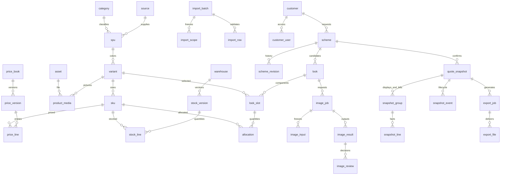

# 服装智能选品与报价系统数据库设计（已否决的 44 表 v1 历史稿）

> 历史状态：Superseded / Rejected。2026-09-12 用户明确判定本稿 44 表方案过度拆分并予以否决。本稿只用于追溯旧决定，**禁止用于生成 DDL、实体、Mapper、兼容表、迁移脚本或研发任务，也禁止把旧检查结果继承给当前版本**。当前唯一实施正文：[数据库设计 v2.3](../../架构/数据库设计.md)。除本警告外保留旧设计原文，便于理解历史与恢复归档内容。

> 文档类型：数据库逻辑与物理设计 · 版本：1.0 · 状态：Draft  
> 日期：2026-09-11 · owner：Codex 编写，项目研发负责人实施及复核  
> 上游：[PRD v1.2](../../产品/产品需求文档.md)、[服装工作台原型设计与生产任务转交](../../原型/服装工作台原型设计与生产任务转交.md) · 入口：[项目说明](../../README.md)  
> 授权依据：用户要求数据库设计，明确表间关系和字段。本文为设计交付，不是已建库、已迁移或已通过数据库测试的声明。

## 1 设计范围与阅读方法

本文是本独立服装项目的数据库设计唯一正文，不改变 AI Interview Coach 主工程的数据模型。覆盖商品、价格库存全量更新、京东图片映射、客户、搭配、图像任务、报价及 PPT 交付；不包含订单履约、采购、支付、真实库存预占或全网选品。

阅读顺序：业务人员先看第 2–3 节关系及第 6 节流程；开发人员再看第 4–5 节字段、第 7–9 节约束与验证。字段字典采用公共字段继承以减少重复；每张表的完整字段 = 所属公共字段组 + 该表专属字段。JSON 仅保存规则、参数或不可变证据，不用 JSON 数组代替 SKU、金额行或业务外键。

### 1.1 设计基线与取舍

| 项目 | 本设计决定 | 边界 |
| --- | --- | --- |
| 数据库 | MySQL 8 系列、InnoDB、utf8mb4；准确小版本与字符排序规则由后续执行包锁定 | 当前 RuoYi 配置有 MySQL，同时另有 PostgreSQL 业务连接；本设计没有连接或修改任何实例 |
| 命名 | 业务表统一 `fq_` 前缀，snake_case | 不混用既有面试业务表；文中关系图省略前缀便于阅读 |
| 身份 | 复用 RuoYi 用户及角色；本项目新增客户归属关系，不复制密码和角色体系 | `user_id` 类字段逻辑引用 `sys_user.user_id`；实际库位置及 ID 类型须接入核对 |
| 隔离 | 首期一个企业部署；每表有 `org_id` 企业边界字段 | org 来自服务端部署/身份映射，不允许前端任意指定；不是已实现多租户 SaaS |
| ID | 应用生成正 BIGINT；API 按字符串传输 | 不将 SKU、京东 ID 或文件 URL 作为主键；不能由浏览器生成生产主键 |
| 金额 | CNY 销售金额用 BIGINT 整数分；百分比用整数基点 | 5% = 500 bp，13% = 1300 bp；拒绝超过两位小数输入后再转换 |
| 时间 | DATETIME(3) 保存 UTC，API 带时区，界面转换 +08:00 | `as_of` 业务时间与 `created_at` 上传/入库时间严格区分 |
| 文件 | 对象存储保存内容；数据库保存对象键、摘要、权限和引用 | 不存 Base64、大图二进制、永久公开 URL；下载临时签名现场生成 |
| 版本发布 | 价格表/仓库维度生成完整只读版本，再原子切换当前指针 | 子范围更新将未修改行复制至新版本；不形成需要无限追溯父版本的查询链 |
| 历史 | 确认快照和金额行只增不改，作废另外记事件 | 商品归档不删除历史；素材禁用禁止新外发但不换写旧快照 |

“报价核验库存”只证明核验时数量可用，不占用库存，也不承诺下单时仍有货。后续增加预占或订单，必须另设计库存流水及释放流程。

## 2 业务对象与关系总览

```text
企业（org_id 作用域）
├─ 商品来源 ─ 款式 SPU ─ 颜色款 ─ 尺码 SKU
│                         └─ 商品图片关联 ─ 素材文件
├─ 价格表 ─ 价格版本 ─ SKU 价格行
│       └─ 当前有效版本指针
├─ 仓库 ─ 库存版本 ─ SKU 可售数量行
│     └─ 当前有效版本指针；人工核实另存凭据
├─ 客户 ─ 授权销售
│      └─ 方案 ─ 需求修订记录
│              ├─ 搭配候选 ─ 槽位（颜色款）─ 尺码分配（SKU）
│              ├─ 图像任务 ─ 输入图片版本 ─ 结果图片 ─ 人工复核
│              └─ 正式报价快照 ─ 展示组合 + 核算单元 ─ SKU 报价行
│                                  └─ 导出任务 ─ PPTX / CSV / ZIP 文件
└─ 导入批次、模板版本、费用账本、操作审计与可靠任务消息
```

### 2.1 核心 ER 图

以下为 Mermaid 源图；不支持 Mermaid 的阅读器仍可使用上面的文本图及下方关系表。`||` 表示一，`o{` 表示零到多；详细外键及可空性以字段字典为准。



### 2.2 关键关联解释

| 关系 | 基数、关联字段 | 业务解释 |
| --- | --- | --- |
| 来源 → 款式 → 颜色款 → SKU | 1:N → 1:N → 1:N；`source_id / spu_id / variant_id` | 同款绿色和黑色分开；同色 M/L 再分 SKU；报价与库存落实到尺码 |
| 颜色款 ↔ 文件 | 经 `product_media` 多对多 | 同文件可复用物理内容，但每个商品的匹配、来源、许可分别确认 |
| 京东商品 ↔ 企业商品 | `product_media.jd_item_id` 非唯一，可多条 | 京东 ID 不直接充当内部 SKU，也不设一对一唯一约束 |
| 价格表 → 版本 → 价格行 | 1:N → 1:N；一版本每 SKU 最多一价 | 客户指定价格表，没有有效行就阻断，不悄悄用其他表 |
| 仓库 → 版本 → 库存行 | 1:N → 1:N；一版本每 SKU 最多一行 | 一个方案明确一个发货仓；首期不把多仓库存自动相加 |
| 导入批次 → 冻结范围 / 解析行 | 各 1:N | 冻结名单与文件实际行分别存储，才能识别缺行和重复行 |
| 客户 ↔ 用户 | `customer_user` 多对多 | 一客户可有多名授权销售；用户角色不等于可读全部客户 |
| 方案 → 候选 → 槽位 → 配比 | 1:N → 1:N → 1:N | 四品类是四个槽位，不是四条尺码行；各槽位分配和等于该候选套数 |
| 图像任务 → 输入 / 结果 / 复核 | 1:N；结果再 1:N 复核 | 执行成功不等于已采用；复核对应固定商品和素材版本 |
| 方案 → 报价快照 | 1:N | 每次正式确认都是新版本，旧版不会被后续价格覆盖 |
| 快照 → 展示组合 / 核算单元 | 各 1:N，使用不同 role | 备选每个组合各核算一次；合并多个展示组合只对应一个全单核算单元 |
| 快照 → 导出任务 → 文件 | 1:N → 1:N | 相同报价可导出多种文件，失败不会修改报价或删除成功文件 |

## 3 建模中必须避免的混淆

1. **款式不是 SKU。** “休闲上衣”是款，绿色是颜色款，绿色 M 才是库存和单价可确定的 SKU。
2. **最新价格不是历史报价。** 当前表指针用于新选品；已确认报价使用自身行内金额和版本引用。
3. **库存上传时间不是库存核实时间。** 恢复昨天的库存仍是昨天的 `as_of`，不能借恢复延长 24 小时时效。
4. **生成成功不是图片审核成功。** 供应商状态、每张结果、每次审核、当前采用引用各自存储。
5. **备选总价不能相加。** 备选报价不设“客户应付总和”；合并采购只有一个折扣、运费与税额核算入口。
6. **可看图片不等于可以商用。** 内部、AI、提案、电商许可分别记录；输入图许可和输出图许可都需检查。
7. **报价不是订单。** 库存引用是核验依据，不写库存扣减，也不创建虚假的库存预占。

## 4 字段与约束统一约定

### 4.1 每表继承的字段

所有下表都包含公共组 B；标为 M 的表再包含可变组 M，标为 A 的表为追加记录，仅包含 B。表上若列有业务状态，该状态不替代公共字段。

| 组 | 字段 | 类型 | 空/默认 | 含义与约束 |
| --- | --- | --- | --- | --- |
| B | id | BIGINT | 非空，无默认 | 全局主键 PK，正数，服务端生成 |
| B | org_id | BIGINT | 非空，无默认 | 企业边界；每表另有 UQ(org_id,id)，供同企业复合 FK 使用 |
| B | created_at | DATETIME(3) | 非空，服务端当前 UTC | 创建时间 |
| B | created_by | BIGINT | 非空，无默认 | 操作者或受控服务账号；逻辑引用 sys_user |
| M | updated_at | DATETIME(3) | 非空，初始同 created_at | 最后修改时间 |
| M | updated_by | BIGINT | 非空，初始同 created_by | 最后修改者 |
| M | row_version | BIGINT | 非空，默认 1 | 乐观锁，更新 WHERE row_version=expected，成功加一 |

下文简写：`ID`=BIGINT；`I`=INT；`B`=BOOLEAN；`T`=DATETIME(3)；`J`=JSON；`Vn`=VARCHAR(n)；`C64`=CHAR(64)；`MONEY`=BIGINT 分；`BP`=INT 基点。字段列中逗号分隔字段分别具有该行类型和约束，不是一个复合字符串字段。`必填`=NOT NULL 且无默认；`可空`=NULL 默认 NULL；其他默认明确写出。状态使用 VARCHAR + CHECK/服务端枚举，不使用难扩展的数据库 ENUM。

### 4.2 全局关系、删除与索引规则

- 所有字典中标记 `→ 表` 的关系默认是物理 FK：`(org_id,外键) → 目标(org_id,id)`，`ON DELETE RESTRICT / ON UPDATE RESTRICT`；明确注明“逻辑引用/来源标识”的除外。每个 FK 建以 org_id、外键为前缀的索引。查询始终带 org_id。
- 用户 ID 为跨身份边界逻辑引用，业务写入校验存在和归属，用户停用保留历史 ID；不连带删除其方案。首期 org_id 由部署配置绑定企业，不接受自助建企业输入。
- 所有 UQ/IX 默认前置 org_id；例如 UQ(source_id,sku_code) 实际含 org_id。业务编码去首尾空白后按区分大小写的稳定规则比较，保留前导零；上线前固定二进制兼容排序规则并测试中文字段排序。
- 公共主键、业务编码不更新。业务数据用状态归档，不加通用 `deleted=1` 绕开唯一约束；已归档编码不复用。
- 所有数量非负整数，套数 1–100000，基点 0–10000；金额落库前检查业务上限和乘法溢出。服务端用宽整数/BigDecimal 运算，不能直接依赖 BIGINT 乘法溢出后的结果。
- JSON 使用带 `schema_version` 的服务端 schema 白名单校验；禁止秘密、任意脚本、客户隐私进入模型参数或公共快照 JSON。所有引用到的 JSON 内 ID 在写入时检查；关键引用另有关系行。

## 5 逐表字段字典

### 5.1 商品主数据（6 张）

#### T01 `fq_source` 商品来源（M）

| 字段 | 类型 | 空/默认 | 说明 |
| --- | --- | --- | --- |
| code | V64 | 必填 | 企业内稳定来源编码 |
| name | V64 | 必填 | 自有商品、供应商名称等 |
| status | V16 | active | active / inactive |
| catalog_revision | ID | 1 | 该来源商品结构版本；新增/上下架/规格/分类修改均递增，供导入冲突检查 |

索引：UQ(code)，IX(status)。

#### T02 `fq_category` 品类（M）

| 字段 | 类型 | 空/默认 | 说明 |
| --- | --- | --- | --- |
| parent_id | ID | 可空 | → fq_category，一级为空；拒绝环 |
| code | V32 | 必填 | top / trousers / hat / shoes 等 |
| name | V64 | 必填 | 品类名称 |
| slot_role | V32 | 必填 | 搭配槽位角色，细分类可共享父级角色 |
| status | V16 | active | active / inactive |
| sort_no | I | 0 | 展示顺序 |

索引：UQ(code)，IX(parent_id,sort_no)。

#### T03 `fq_spu` 款式（M）

| 字段 | 类型 | 空/默认 | 说明 |
| --- | --- | --- | --- |
| source_id | ID | 必填 | → fq_source |
| style_code | V64 | 必填 | 来源内款号 |
| name | V120 | 必填 | 商品名 |
| category_id | ID | 必填 | → fq_category |
| brand | V80 | 可空 | 资料品牌，不由 AI 猜填 |
| material | V255 | 可空 | 原始材质成分文字 |
| seasons, audiences, tags | J | 必填，空数组 | 各为字符串数组；人工确认的筛选标签 |
| status | V16 | draft | draft / active / inactive |

索引：UQ(source_id,style_code)，IX(category_id,status)，IX(source_id,status)。标签先对筛选后的候选集处理；确需大规模标签检索时再加归一化标签关系，不承诺 JSON 扫描达到性能目标。

#### T04 `fq_variant` 颜色款（M）

| 字段 | 类型 | 空/默认 | 说明 |
| --- | --- | --- | --- |
| spu_id | ID | 必填 | → fq_spu |
| color_code | V32 | 必填 | 稳定颜色编码，运营确认 |
| color_name | V32 | 必填 | 实际展示颜色 |
| current_main_media_id | ID | 可空 | → fq_product_media；必须是本颜色款 main 关联 |
| visual_version | ID | 1 | 影响主体/主图/颜色的变更递增 |
| attributes_confirmed | B | false | 当前视觉版本标签已人工确认 |
| confirmed_by | ID | 可空 | 确认人，逻辑引用 sys_user |
| confirmed_at | T | 可空 | 确认时间；与确认状态匹配 |
| status | V16 | draft | draft / active / inactive |

索引：UQ(spu_id,color_code)，IX(status)。主图用唯一当前指针，不以多条 `is_main=true` 制造歧义；媒体归属在同一事务检查。

#### T05 `fq_sku` 尺码 SKU（M）

| 字段 | 类型 | 空/默认 | 说明 |
| --- | --- | --- | --- |
| source_id | ID | 必填 | → fq_source，与 variant 所属 SPU 来源一致 |
| variant_id | ID | 必填 | → fq_variant |
| sku_code | V64 | 必填 | 文本编码，保留 000123 |
| size_code | V32 | 必填 | M、L、40.5、均码等 |
| size_system | V32 | 必填 | CN / EU / US / LETTER / FREE 等；不混同制式 |
| unit | V16 | 必填 | 件、顶、双 |
| sort_no | I | 0 | 尺码展示排序 |
| status | V16 | active | active / inactive |

索引：UQ(source_id,sku_code)，UQ(variant_id,size_system,size_code)，IX(variant_id,status)。本表不存“当前 price/stock”，避免双重事实源。

#### T06 `fq_warehouse` 仓库（M）

| 字段 | 类型 | 空/默认 | 说明 |
| --- | --- | --- | --- |
| code, name | V64 | 必填 | 稳定编码及仓库名 |
| current_version_id | ID | 可空 | → fq_stock_version；必须属于本仓库且 ready |
| status | V16 | active | active / inactive |

索引：UQ(code)。首次未发布库存时指针为空，不能把未知量当 0。

### 5.2 导入与版本化价格库存（9 张）

#### T07 `fq_import_batch` 导入批次（M）

| 字段 | 类型 | 空/默认 | 说明 |
| --- | --- | --- | --- |
| batch_no | V64 | 必填 | 业务批次号 |
| kind | V24 | 必填 | product / price / stock / media_map |
| source_id | ID | 必填 | → fq_source |
| price_book_id | ID | 可空 | → fq_price_book；price 必填 |
| warehouse_id | ID | 可空 | → fq_warehouse；stock 必填 |
| file_asset_id | ID | 可空 | → fq_asset；文件导入必填，恢复操作可空 |
| parent_batch_id | ID | 可空 | → fq_import_batch；修正重传来源 |
| restored_from_version_id | ID | 可空 | 按 kind 逻辑引用价格/库存版本；仅恢复填，服务端验证同范围 |
| operation | V16 | import | import / restore |
| mapping_json | J | 必填 | sheet、header_row、column_map、clear_fields；版本化字段映射 |
| scope_filter | J | 必填 | 范围声明：来源、品类、状态等；不代替冻结名单 |
| scope_hash, content_hash | C64 | 必填 | 冻结 SKU 排序摘要、原文件/恢复内容摘要 |
| base_version_id | ID | 可空 | price/stock 按 kind 逻辑引用校验时当前版本；首次为空 |
| base_catalog_revision | ID | 必填 | 校验时来源商品结构版本 |
| as_of | T | 必填 | 文件业务时间；商品资料为声明更新时间 |
| request_key | V128 | 必填 | 幂等键 |
| status | V24 | uploaded | uploaded / validating / invalid / validated / publishing / published / cancelled / conflict / failed |
| expected_count, actual_count, error_count | I | 0 | 应覆盖、实际数据行、错误数 |
| validated_at, published_at | T | 可空 | 实际动作时间 |
| failure_code | V64 | 可空 | 失败或冲突编码 |
| failure_note | V1000 | 可空 | 脱敏摘要 |

索引：UQ(batch_no)，UQ(request_key)，IX(kind,status,created_at)，IX(source_id,created_at)。语义重复键由 `kind+target+scope_hash+content_hash+as_of+mapping_hash` 规范化后作为 request_key；不同时间声明不误判重复。商品批次可以新增 SKU，不适用“全部现有 SKU 必须出现”；price/stock 必须严格覆盖。

#### T08 `fq_import_scope` 冻结范围（A）

| 字段 | 类型 | 空/默认 | 说明 |
| --- | --- | --- | --- |
| batch_id | ID | 必填 | → fq_import_batch |
| sku_id | ID | 必填 | → fq_sku |
| sku_row_version | ID | 必填 | 校验时 SKU 修订 |
| sku_code_snapshot | V64 | 必填 | 原编码证据 |

索引：UQ(batch_id,sku_id)。价格/库存必须建全量名单；与解析行做集合差，不只比较行数。

#### T09 `fq_import_row` 文件行及校验结果（M）

| 字段 | 类型 | 空/默认 | 说明 |
| --- | --- | --- | --- |
| batch_id | ID | 必填 | → fq_import_batch |
| row_no | I | 必填 | 源文件数据行号，正数 |
| sku_id | ID | 可空 | → fq_sku；未知 SKU 或商品新增行可空 |
| raw_json | J | 必填 | 脱敏原始字段，仅白名单；标识保留字符串 |
| normalized_json | J | 可空 | product 属性或 price/stock/media 映射的类型化值 |
| status | V16 | pending | pending / valid / invalid |
| errors_json | J | 必填，空数组 | [{field,code,value_summary,message}] |
| change_kind | V16 | 可空 | added / changed / unchanged |

索引：UQ(batch_id,row_no)，IX(batch_id,sku_id)，IX(batch_id,status)。**不**对(batch_id,sku_id)设唯一，以便保存重复输入并报错；合法发布后目标版本行必须唯一。

#### T10 `fq_price_book` 销售价格表（M）

| 字段 | 类型 | 空/默认 | 说明 |
| --- | --- | --- | --- |
| code, name | V64 | 必填 | 稳定编码、名称 |
| currency | CHAR(3) | CNY | 首期只允许 CNY |
| tax_mode | V16 | included | included / excluded；同表不能混用，已有版本后不得改口径，应新建表 |
| current_version_id | ID | 可空 | → fq_price_version，必须属于本表且 ready |
| status | V16 | active | active / inactive |

索引：UQ(code)。默认价格表在 settings 中明确指定，不依赖名字“批发价”匹配。

#### T11 `fq_price_version` 价格完整版本（M，ready 后不可改）

| 字段 | 类型 | 空/默认 | 说明 |
| --- | --- | --- | --- |
| price_book_id | ID | 必填 | → fq_price_book |
| version_no | ID | 必填 | 表内递增 |
| previous_version_id | ID | 可空 | → fq_price_version，原当前版本；只追溯，不参与取价链 |
| batch_id | ID | 必填 | → fq_import_batch |
| state | V16 | building | building / ready / failed |
| row_count | I | 0 | 完整版本行数 |
| checksum | C64 | 可空 | ready 必填，SKU 排序后的行摘要 |
| published_at | T | 可空 | 首次切换为当前版本时填 |

索引：UQ(price_book_id,version_no)，UQ(batch_id)。完整版本包含范围外原行，其业务时间与有效期不被刷新。

#### T12 `fq_price_line` 版本价格行（A）

| 字段 | 类型 | 空/默认 | 说明 |
| --- | --- | --- | --- |
| version_id | ID | 必填 | → fq_price_version |
| sku_id | ID | 必填 | → fq_sku |
| price_minor | MONEY | 必填 | ≥0；0 可入资料但不得正式报价 |
| unit | V16 | 必填 | 冻结计价单位，与 SKU 一致 |
| currency | CHAR(3) | CNY | 与价格表一致 |
| tax_mode | V16 | 必填 | 与价格表一致 |
| as_of | T | 必填 | 本 SKU 价格业务时间，范围外复制不改变 |
| valid_from | T | 必填 | 该行开始有效时间，缺省声明为发布生效时间 |
| valid_to | T | 可空 | 无到期为空，结束采用开区间 |
| origin_batch_id | ID | 必填 | → fq_import_batch；本行原始价格声明来源 |

索引：UQ(version_id,sku_id)，IX(sku_id,as_of)。当前版本内未来/过期行不可报价，不回退旧版本；未来价的自动排期切换不纳入首期。

#### T13 `fq_stock_version` 库存完整版本（M，ready 后不可改）

| 字段 | 类型 | 空/默认 | 说明 |
| --- | --- | --- | --- |
| warehouse_id | ID | 必填 | → fq_warehouse |
| version_no | ID | 必填 | 仓库内递增 |
| previous_version_id | ID | 可空 | → fq_stock_version，同仓 |
| batch_id | ID | 必填 | → fq_import_batch |
| state | V16 | building | building / ready / failed |
| row_count | I | 0 | 完整行数 |
| checksum | C64 | 可空 | ready 必填 |
| published_at | T | 可空 | 实际指针切换时间 |

索引：UQ(warehouse_id,version_no)，UQ(batch_id)。

#### T14 `fq_stock_line` 库存版本行（A）

| 字段 | 类型 | 空/默认 | 说明 |
| --- | --- | --- | --- |
| version_id | ID | 必填 | → fq_stock_version |
| sku_id | ID | 必填 | → fq_sku |
| available_qty | I | 必填 | ≥0；明确可售数量，不是未经处理的账面量 |
| as_of | T | 必填 | 本 SKU 的业务时间 |
| evidence_note | V1000 | 可空 | ERP 导出、盘点凭据摘要 |
| origin_batch_id | ID | 必填 | → fq_import_batch；本行最初声明批次 |

索引：UQ(version_id,sku_id)，IX(sku_id,as_of)。无行=未知；有行且 0=已知缺货。

#### T15 `fq_stock_verification` 逐 SKU 再核实（A）

| 字段 | 类型 | 空/默认 | 说明 |
| --- | --- | --- | --- |
| warehouse_id, sku_id | ID | 必填 | 分别 → fq_warehouse、fq_sku |
| base_stock_line_id | ID | 必填 | → fq_stock_line；核实基于哪条库存 |
| verified_qty | I | 必填 | 实际再次确认的可售数，≥0 |
| verified_at | T | 必填 | 真实核实时间，不是提交时间 |
| verified_by | ID | 必填 | 具有库存核实权限的用户 |
| evidence_note | V1000 | 必填 | 数量来源和凭据摘要 |

索引：IX(warehouse_id,sku_id,verified_at)。取当前库存行的最新有效核实；如果当前完整版本复制了原行，可按同 origin_batch、数值与 as_of 校验等价后复用核实；新声明不得被旧核实覆盖。核实时间必须不早于基线 as_of、不得未来超过 5 分钟，并按 24 小时时效判断。不修改旧库存行。

### 5.3 图片和商品理解（3 张）

#### T16 `fq_asset` 文件内容及可用状态（M）

| 字段 | 类型 | 空/默认 | 说明 |
| --- | --- | --- | --- |
| storage_key | V512 | 必填 | 私有对象键，无临时签名 |
| sha256 | C64 | 必填 | 原文件内容摘要 |
| mime_type | V100 | 必填 | 解码/探测后的实际类型 |
| byte_size | ID | 必填 | >0，上传限制在入库前检查 |
| width, height | I | 可空 | 图片像素，非图片为空 |
| original_name | V255 | 必填 | 原文件名，仅显示，不能当存储路径 |
| kind | V24 | 必填 | product_image / generated_image / import_file / export_file / logo / evidence |
| status | V16 | quarantined | quarantined / usable / disabled / deleted |
| disabled_reason | V1000 | 可空 | 禁用时必填 |
| retain_until | T | 必填 | 最早可清理时间，引用可延长 |
| hold_until | T | 可空 | 额外业务保留截止，无默认永久保留 |

索引：UQ(sha256)，UQ(storage_key)，IX(status,retain_until)。同企业相同文件去重不授予新的访问权限；实际访问通过拥有该文件的业务关系检查，不能仅凭知道 asset_id 下载。

#### T17 `fq_product_media` 商品图片关联与授权（M）

| 字段 | 类型 | 空/默认 | 说明 |
| --- | --- | --- | --- |
| variant_id | ID | 必填 | → fq_variant，颜色款 |
| sku_id | ID | 可空 | → fq_sku；指定尺码图时必填且属于该颜色款 |
| asset_id | ID | 必填 | → fq_asset，已通过图片检查 |
| usage_type | V16 | main | main / detail / reference |
| source_type | V24 | 必填 | jd_plugin / manual / supplier |
| source_url | V2048 | 可空 | JD 来源时 HTTPS 必填，无 Cookie/签名秘密 |
| jd_item_id | V64 | 可空 | JD 来源必填，非唯一文本 |
| captured_at | T | 必填 | 实际获取时间 |
| allow_internal, allow_ai, allow_proposal, allow_ecommerce | B | false | 四种用途分别确认，默认拒绝 |
| permission_note | V1000 | 可空 | 企业使用授权依据摘要 |
| status | V16 | pending | pending / confirmed / disabled |
| confirmed_by | ID | 可空 | 运营确认人 |
| confirmed_at | T | 可空 | confirmed 时必填 |
| binding_version | ID | 1 | 权限或映射修改递增，旧输入版本可识别 |
| binding_key | C64 | 必填 | 规范化 variant+sku(空有专门标记)+asset+usage 摘要 |

索引：UQ(binding_key)，IX(variant_id,status)，IX(jd_item_id)。binding_key 解决 nullable SKU 唯一键的空值重复问题；hash 冲突再比较原字段，不直接当相等。主图替换创建新关联并更新 variant 指针，旧关联保留；纠错/禁用事件进入 audit。

#### T18 `fq_product_analysis` 属性理解任务与建议（M）

| 字段 | 类型 | 空/默认 | 说明 |
| --- | --- | --- | --- |
| variant_id | ID | 必填 | → fq_variant |
| input_visual_version | ID | 必填 | 分析时视觉版本 |
| input_media_id | ID | 必填 | → fq_product_media |
| source_mode | V16 | 必填 | rule / sample / provider |
| provider_config_id | ID | 可空 | → fq_provider_config；真实调用时必填 |
| provider_task_id | V128 | 可空 | 供应商真实任务号，无调用留空 |
| model_version, prompt_version | V128 | 可空 | 真实或规则版本 |
| status | V24 | queued | queued / running / succeeded / failed / unknown / stale |
| suggested_json | J | 可空 | {schema_version,category,color,tags,confidence}，只作建议 |
| confirmed_json | J | 可空 | 人工采纳后的白名单值 |
| confirmed_by | ID | 可空 | 人工确认者 |
| confirmed_at | T | 可空 | 真正确认时间 |
| request_key | V128 | 必填 | 幂等请求标识 |
| error_note | V1000 | 可空 | 脱敏错误 |

索引：UQ(request_key)，IX(variant_id,created_at)。批量确认时写 SPU/variant 并递增业务版本，拒绝过期输入；调用付费模型也必须进入预算账本，不能因这是“标签任务”绕过费用控制。

### 5.4 客户、模板和方案（8 张）

#### T19 `fq_customer` 客户（M）

| 字段 | 类型 | 空/默认 | 说明 |
| --- | --- | --- | --- |
| code | V64 | 必填 | 企业内客户编码 |
| name | V80 | 必填 | 客户名称或简称 |
| customer_type | V24 | 必填 | group_purchase / wholesale |
| contact_name | V80 | 可空 | 联系人，受字段权限保护 |
| contact_phone_cipher | V512 | 可空 | 联系方式应用层加密密文，密钥不入库 |
| region | V120 | 可空 | 地区 |
| price_book_id | ID | 可空 | → fq_price_book；空表示使用设置中的默认表 |
| internal_note | V2000 | 可空 | 内部备注，禁止对客投影 |
| status | V16 | active | active / archived |

索引：UQ(code)，IX(name,status)。名称非唯一；同名客户不能自动合并。

#### T20 `fq_customer_user` 客户销售授权（M）

| 字段 | 类型 | 空/默认 | 说明 |
| --- | --- | --- | --- |
| customer_id | ID | 必填 | → fq_customer |
| user_id | ID | 必填 | 逻辑引用 sys_user |
| relation_role | V16 | member | owner / member |
| status | V16 | active | active / revoked |
| granted_by | ID | 必填 | 实际授权者 |
| granted_at | T | 必填 | 授权时间 |
| revoked_at | T | 可空 | 撤销时间 |

索引：UQ(customer_id,user_id)，IX(user_id,status)。权限为用户业务角色与有效客户关系的交集；负责人按企业管理范围访问，不用给所有客户伪造关系。

#### T21 `fq_template_version` 组合及交付模板版本（A）

| 字段 | 类型 | 空/默认 | 说明 |
| --- | --- | --- | --- |
| template_code | V64 | 必填 | 稳定模板家族编码 |
| version_no | I | 必填 | 同编码递增 |
| kind | V16 | 必填 | combination / presentation |
| name | V100 | 必填 | 模板名称 |
| definition_json | J | 必填 | 第 5.10 节约定的组合槽位或 PPT 布局参数 |
| logo_asset_id | ID | 可空 | → fq_asset；presentation 可用 |
| schema_version | I | 1 | 模板内容结构版本 |

索引：UQ(template_code,version_no)，IX(kind,created_at)。修改生成新行；默认使用哪个版本由 settings 指针决定，旧方案不随默认变化。

#### T22 `fq_scheme` 客户方案（M）

| 字段 | 类型 | 空/默认 | 说明 |
| --- | --- | --- | --- |
| scheme_no | V64 | 必填 | 唯一方案号 |
| customer_id | ID | 必填 | → fq_customer |
| owner_user_id | ID | 必填 | 方案负责人，需当前客户访问权 |
| title | V100 | 必填 | 方案标题 |
| status | V16 | draft | draft / active / closed / archived |
| current_revision | ID | 1 | 业务修订号；任何影响报价确认的修改递增 |
| copied_from_scheme_id | ID | 可空 | → fq_scheme；复制来源，仅追溯 |
| closed_at | T | 可空 | 关闭时间，关闭不删除报价 |

索引：UQ(scheme_no)，IX(customer_id,status,updated_at)，IX(owner_user_id,updated_at)。

#### T23 `fq_scheme_revision` 需求与商务参数修订（A）

| 字段 | 类型 | 空/默认 | 说明 |
| --- | --- | --- | --- |
| scheme_id | ID | 必填 | → fq_scheme |
| revision_no | ID | 必填 | 对应 scheme.current_revision |
| combination_template_id | ID | 必填 | → fq_template_version，kind=combination |
| warehouse_id | ID | 必填 | → fq_warehouse，明确本单发货仓 |
| requested_qty | I | 100 | 1–100000 套 |
| per_group_count | I | 2 | 1–3；总候选≤12 |
| selected_groups | J | 必填 | 互异的 1–4 整数数组 |
| progressive | B | true | 递进比较 / 独立选款 |
| budget_minor | MONEY | 可空 | 空无上限，有值>0 |
| budget_basis | V16 | total | total / per_set；统一按最终应付判断 |
| raw_requirement | TEXT | 可空 | 原始需求，仅内部保留 |
| parsed_json, confirmed_json | J | 必填 | 分别解析建议与人工确认条件；不得用建议覆盖确认值 |
| requirement_confirmed | B | false | 正式生成前须确认 |
| requirement_confirmed_by | ID | 可空 | 确认者 |
| requirement_confirmed_at | T | 可空 | 确认时间 |
| quote_mode | V16 | alternatives | alternatives / combined |
| discount_type | V16 | percent | percent / fixed |
| discount_bp | BP | 500 | percent 时使用；fixed 时必须 0 |
| discount_minor | MONEY | 0 | fixed 时使用；percent 时必须 0 |
| fee_minor | MONEY | 0 | 费用；演示例为 30000，生产新单不默加 |
| tax_mode | V16 | included | included / excluded，与所取价表一致 |
| tax_rate_bp | BP | 可空 | excluded 必填；included 可空，不重复加税 |
| fee_taxable | B | true | 未税报价中费用是否需再计税 |
| valid_days | I | 7 | 1–30 |
| public_note | V2000 | 可空 | 对客说明白名单，不直接复制内部备注 |
| delivery_date | DATE | 可空 | 客户期望日期 |
| content_hash | C64 | 必填 | 本修订规范化内容摘要 |

索引：UQ(scheme_id,revision_no)。每次编辑写新修订；实际组合另存当前 Look，报价 hash 同时覆盖组合和所有核价输入，不以此 content_hash 单独授权折扣例外。

#### T24 `fq_look` 搭配候选（M）

| 字段 | 类型 | 空/默认 | 说明 |
| --- | --- | --- | --- |
| scheme_id | ID | 必填 | → fq_scheme |
| name | V100 | 必填 | 候选名称 |
| category_count | I | 必填 | 1–4，等于互异槽位角色数 |
| candidate_no | I | 必填 | 同档候选序号 |
| qty | I | 100 | 该候选采购套数 |
| selected | B | true | 是否进入报价 |
| sort_no | I | 0 | 展示顺序 |
| reason | V2000 | 可空 | 搭配说明 |
| look_revision | ID | 1 | 候选业务修订 |
| visual_hash | C64 | 必填 | 排序槽位、颜色款、输入图及视觉版本摘要，不含价格/文案 |
| generation_source | V16 | manual | manual / rule / sample / provider |
| selected_image_result_id | ID | 可空 | → fq_image_result，须本 Look 且当前审核通过 |
| allocation_confirmed | B | false | 建议尺码分配必须人工确认 |
| allocation_confirmed_by | ID | 可空 | 确认人 |
| allocation_confirmed_at | T | 可空 | 确认时间 |
| status | V16 | active | active / removed |

索引：UQ(scheme_id,category_count,candidate_no)，IX(scheme_id,status,sort_no)。移除仍保留历史；重建分配使用新候选号或恢复原行，不重复使用业务键。

#### T25 `fq_look_slot` 搭配槽位（M）

| 字段 | 类型 | 空/默认 | 说明 |
| --- | --- | --- | --- |
| look_id | ID | 必填 | → fq_look |
| slot_role | V32 | 必填 | 模板角色，上衣/裤子/帽子/鞋等 |
| variant_id | ID | 必填 | → fq_variant；所属分类符合槽位 |
| sort_no | I | 必填 | 1–4 |
| is_locked | B | false | 重搭不能更改 |
| lock_source | V16 | none | none / inherited / manual |
| inherited_from_slot_id | ID | 可空 | → fq_look_slot；同方案低档来源，禁止环 |

索引：UQ(look_id,slot_role)，UQ(look_id,sort_no)。递进同步先预览，有手工锁冲突的候选不自动拆锁。

#### T26 `fq_allocation` 槽位尺码分配（M）

| 字段 | 类型 | 空/默认 | 说明 |
| --- | --- | --- | --- |
| slot_id | ID | 必填 | → fq_look_slot |
| sku_id | ID | 必填 | → fq_sku，必须属于槽位颜色款 |
| qty | I | 必填 | >0；0 行不存储 |

索引：UQ(slot_id,sku_id)。同槽位 qty 总和=look.qty；跨行约束由持有方案锁的服务端事务检查，不谎称单行 CHECK 可以保证。

### 5.5 图像任务、输入、结果和复核（4 张）

#### T27 `fq_image_job` 图像任务（M）

| 字段 | 类型 | 空/默认 | 说明 |
| --- | --- | --- | --- |
| look_id | ID | 必填 | → fq_look |
| input_look_revision | ID | 必填 | 发起时版本 |
| input_visual_hash | C64 | 必填 | 输入视觉摘要，与当前 Look 比对 |
| kind | V16 | 必填 | model / styling / ecommerce / composition |
| source_mode | V16 | 必填 | sample / upload / composition / provider |
| provider_config_id | ID | 可空 | → fq_provider_config，provider 时必填 |
| provider_task_id | V128 | 可空 | 真实供应商任务号；上传和样例必须空 |
| request_key | V128 | 必填 | 一次用户意图幂等键；主动新增候选用新键 |
| retry_of_job_id | ID | 可空 | → fq_image_job；明确失败项的人工重试来源 |
| requested_count | I | 2 | 1–4 |
| parameters_json | J | 必填 | 画幅、模特、姿势、场景、输出尺寸和提示词版本；无客户商业数据 |
| state | V24 | queued | queued / submitting / running / succeeded / partial / failed / cancel_requested / cancelled / unknown |
| attempt_count | I | 0 | 自动重试次数，最多 2 次 |
| next_attempt_at | T | 可空 | 退避时间 |
| started_at, finished_at | T | 可空 | 实际执行时间 |
| lease_until | T | 可空 | 工作者占用到期时间，崩溃恢复 |
| error_code | V64 | 可空 | 失败编码 |
| error_note | V1000 | 可空 | 脱敏详情 |
| billing_state | V16 | not_applicable | not_applicable / reserved / unknown / settled |

索引：UQ(request_key)，UQ(provider_config_id,provider_task_id)，IX(state,next_attempt_at)，IX(look_id,created_at)。unknown 不等于失败；先查询供应商受理结果，不重复提交扣费。

#### T28 `fq_image_input` 图像输入清单（A）

| 字段 | 类型 | 空/默认 | 说明 |
| --- | --- | --- | --- |
| job_id | ID | 必填 | → fq_image_job |
| slot_role | V32 | 必填 | 对应槽位 |
| variant_id | ID | 必填 | → fq_variant |
| visual_version | ID | 必填 | 输入时颜色款视觉版本 |
| product_media_id | ID | 必填 | → fq_product_media |
| binding_version | ID | 必填 | 输入时图片关联版本 |
| asset_id | ID | 必填 | → fq_asset；冻结文件，不从当前主图回查 |
| crop_json | J | 可空 | {x,y,w,h} 归一化裁切；0≤x,y，w,h>0，x+w/y+h≤1 |
| sort_no | I | 必填 | 输入顺序 |

索引：UQ(job_id,sort_no)，IX(variant_id,visual_version)，IX(product_media_id,binding_version)。每任务可有细节图，多于槽位数；至少每槽位一张有效输入。

#### T29 `fq_image_result` 单张结果（M）

| 字段 | 类型 | 空/默认 | 说明 |
| --- | --- | --- | --- |
| job_id | ID | 必填 | → fq_image_job |
| result_no | I | 必填 | 1–requested_count |
| asset_id | ID | 可空 | → fq_asset；成功文件必须非空且可读取 |
| state | V16 | pending | pending / succeeded / failed |
| review_state | V16 | pending | pending / accepted / rejected / stale |
| latest_review_id | ID | 可空 | → fq_image_review；属于本结果 |
| source_label | V80 | 必填 | 样例、上传、拼版、真实供应商等真实来源 |
| allow_proposal, allow_ecommerce | B | false | 输出授权范围；不得超过输入许可及供应商许可 |
| error_note | V1000 | 可空 | 单张错误，不能抹掉成功兄弟结果 |

索引：UQ(job_id,result_no)，IX(review_state)。审核缓存字段与最新复核同事务更新；素材版本失效时标 stale，同时记录 audit，不抹除曾通过事实。

#### T30 `fq_image_review` 人工审核记录（A）

| 字段 | 类型 | 空/默认 | 说明 |
| --- | --- | --- | --- |
| result_id | ID | 必填 | → fq_image_result |
| visual_hash | C64 | 必填 | 本次审核针对的输入视觉摘要 |
| decision | V16 | 必填 | accepted / rejected |
| checklist_json | J | 必填 | 逐槽位 {slot_role,present,style_ok,color_ok,logo_ok}，全通过才可采用 |
| reason | V1000 | 可空 | rejected 必填；通过也可备注 |
| reviewer_id | ID | 必填 | 有方案权限的实际复核者 |
| reviewed_at | T | 必填 | 实际审核时间 |

索引：IX(result_id,reviewed_at)。再次审核追加，不覆盖上次拒绝原因。方案当前采用哪张图由 look 指针决定，不把所有 accepted 图当已采用。

### 5.6 报价例外与不可变快照（5 张）

#### T31 `fq_quote_exception` 商务例外审批（M）

| 字段 | 类型 | 空/默认 | 说明 |
| --- | --- | --- | --- |
| scheme_id | ID | 必填 | → fq_scheme |
| scheme_revision | ID | 必填 | 申请时修订 |
| pricing_input_hash | C64 | 必填 | 客户、商品、尺码、价表/库存版本、单价覆盖、优惠、费用、税等全量输入摘要 |
| kind | V24 | 必填 | discount / unit_price / floor_price / combined |
| overrides_json | J | 必填 | 逐 SKU 原价、拟调价、原因；无覆盖时空数组；结构见 5.10 |
| reason | V2000 | 必填 | 内部审批理由，不导出 |
| state | V16 | pending | pending / approved / rejected / revoked |
| requested_by | ID | 必填 | 申请人 |
| decided_by | ID | 可空 | 实际审批者；审批权限服务端验证，禁止申请人自批 |
| decided_at | T | 可空 | 决策时间 |
| expires_at | T | 可空 | approved 时必填，默认批准后 24 小时 |
| decision_note | V1000 | 可空 | 审批意见 |

索引：IX(scheme_id,scheme_revision,state)。例外不允许零单价、100%优惠或零应付。没有成本/底价数据时不冒称已检查毛利；若启用底价政策，其数据另走受限商务字段契约，不把成本塞进客户快照。

#### T32 `fq_quote_snapshot` 正式报价头（A）

| 字段 | 类型 | 空/默认 | 说明 |
| --- | --- | --- | --- |
| scheme_id | ID | 必填 | → fq_scheme |
| scheme_revision | ID | 必填 | 已锁定确认的方案修订 |
| quote_no | V64 | 必填 | 对客报价编号 |
| version_no | I | 必填 | 同方案报价版本递增 |
| request_key | V128 | 必填 | 确认请求幂等键 |
| customer_id | ID | 必填 | → fq_customer；仅内部授权追溯 |
| customer_name, title | V100 | 必填 | 对客冻结名称和标题，不回读当前客户 |
| quote_mode | V16 | 必填 | alternatives / combined |
| price_book_id | ID | 必填 | → fq_price_book，本次实际取价表 |
| price_version_id | ID | 必填 | → fq_price_version，固定完整版本 |
| stock_version_id | ID | 必填 | → fq_stock_version，固定完整版本 |
| scheme_revision_id | ID | 必填 | → fq_scheme_revision，与方案及修订匹配 |
| exception_id | ID | 可空 | → fq_quote_exception，内部引用，不对客输出 |
| template_version_id | ID | 必填 | → fq_template_version，presentation |
| pricing_input_hash, content_hash | C64 | 必填 | 核价输入摘要、对客白名单内容摘要 |
| schema_version | I | 1 | 快照投影结构版本 |
| currency | CHAR(3) | CNY | 固定币种 |
| tax_mode | V16 | 必填 | included / excluded |
| tax_rate_bp | BP | 可空 | excluded 必填 |
| fee_taxable | B | 必填 | 是否计入额外税基 |
| discount_type | V16 | 必填 | percent / fixed |
| discount_bp | BP | 必填 | 固定优惠时 0 |
| valid_until | T | 必填 | 确认时固化有效期 |
| stock_ttl_hours | I | 24 | 确认时核验政策，配置变化不改写旧值 |
| public_note | V2000 | 可空 | 对客条款 |
| presentation_json | J | 必填 | 品牌、联系人、颜色等冻结白名单，不含客户私密联系人 |
| prototype | B | false | 生产真实单默认 false；从演示导入不得自动转正式单 |

索引：UQ(quote_no)，UQ(scheme_id,version_no)，UQ(request_key)，IX(customer_id,created_at)，IX(valid_until)。不在头表保存备选应付总和；不可变指内容，不等于永远允许导出。

#### T33 `fq_snapshot_group` 展示组合与核算单元（A）

| 字段 | 类型 | 空/默认 | 说明 |
| --- | --- | --- | --- |
| snapshot_id | ID | 必填 | → fq_quote_snapshot |
| role | V16 | 必填 | display / billing |
| group_key | V64 | 必填 | 快照内稳定键 |
| source_look_id | ID | 可空 | → fq_look；display 必填，仅追溯不回读 |
| billing_group_id | ID | 可空 | → fq_snapshot_group；display 必填，billing 为空，须同快照 role=billing |
| name | V100 | 必填 | 显示名或“合并采购核算” |
| category_count | I | 可空 | display 1–4；billing 可空 |
| set_qty | I | 可空 | display 必填；备选 billing 可填，混合组合全单不填假套数 |
| sort_no | I | 0 | 排序 |
| reason | V2000 | 可空 | 冻结搭配说明 |
| model_result_id | ID | 可空 | → fq_image_result；已审核采用图 |
| model_asset_id | ID | 可空 | → fq_asset，冻结实际文件 |
| image_label | V80 | 可空 | 商品原图拼版、样例、外部生成等 |
| subtotal_minor, discount_minor, fee_minor, tax_minor, total_minor | MONEY | 可空 | 仅 billing 必填；display 为空，避免重复算优惠或求和 |
| per_set_minor | MONEY | 可空 | 同质套装的展示平均价，非核算依据 |

索引：UQ(snapshot_id,role,group_key)，IX(snapshot_id,sort_no)。备选每个 display 对应独立 billing；合并所有 display 指向同一个 billing。统计收入/总价只读 billing，不遍历 display 金额。关系约束在确认事务统一验证。

#### T34 `fq_snapshot_line` 冻结 SKU 报价行（A）

| 字段 | 类型 | 空/默认 | 说明 |
| --- | --- | --- | --- |
| group_id | ID | 必填 | → fq_snapshot_group，必须 role=display |
| line_no | I | 必填 | 组合内正整数行序 |
| sku_id, variant_id | ID | 必填 | 分别 → fq_sku、fq_variant；作为溯源，内容仍从本行读 |
| price_line_id, stock_line_id | ID | 必填 | 分别 → fq_price_line、fq_stock_line；属于快照固定版本 |
| stock_verification_id | ID | 可空 | → fq_stock_verification；使用再核实时记录 |
| sku_code, style_code | V64 | 必填 | 冻结编码 |
| product_name | V120 | 必填 | 冻结名称 |
| category_name, color_name, size_code, size_system | V32 | 必填 | 冻结展示属性 |
| slot_role | V32 | 必填 | 槽位归属 |
| unit | V16 | 必填 | 冻结单位 |
| qty | I | 必填 | >0，实际购买件/顶/双数量 |
| source_price_minor | MONEY | 必填 | 取价表原价 |
| unit_price_minor | MONEY | 必填 | 实际报价单价；不同于原价须有效审批 |
| amount_minor | MONEY | 必填 | unit_price_minor × qty，无行级优惠 |
| verified_stock_qty | I | 必填 | 本次核验可售数量 |
| stock_as_of | T | 必填 | 本次采用库存业务/核实时间 |
| product_media_id | ID | 必填 | → fq_product_media，原图来源 |
| image_asset_id | ID | 必填 | → fq_asset，冻结原图 |
| image_binding_version, visual_version | ID | 必填 | 图片关联/颜色款视觉版本 |
| crop_json | J | 可空 | 归一化裁切 |

索引：UQ(group_id,line_no)，UQ(group_id,sku_id)，IX(sku_id)，IX(image_asset_id)。合并核算可通过 display.billing_group_id 聚合这些行；不再复制一套“合并明细”造成金额双写。聚合同 SKU 若有不同单价可保留多个展示行，但库存仍按 SKU 总量核验。

#### T35 `fq_snapshot_event` 报价生命周期（A）

| 字段 | 类型 | 空/默认 | 说明 |
| --- | --- | --- | --- |
| snapshot_id | ID | 必填 | → fq_quote_snapshot |
| event_type | V24 | 必填 | void / exported / downloaded / material_blocked |
| reason | V1000 | 可空 | void / material_blocked 必填 |
| request_key | V128 | 必填 | 事件幂等键 |
| related_export_id | ID | 可空 | → fq_export_job；导出相关事件 |

索引：UQ(request_key)，IX(snapshot_id,event_type,created_at)。过期由 valid_until 与当前时间计算，不周期改写快照；作废不允许恢复原单，复制后重新确认。downloaded 只表示服务器完成文件响应记录，不声称客户已经阅读或文件已发送。

### 5.7 导出与文件（2 张）

#### T36 `fq_export_job` 导出任务（M）

| 字段 | 类型 | 空/默认 | 说明 |
| --- | --- | --- | --- |
| snapshot_id | ID | 必填 | → fq_quote_snapshot |
| format | V16 | 必填 | pptx / csv / image_zip / jpg |
| purpose | V16 | customer | customer / internal_expired |
| renderer_version | V64 | 必填 | 实际渲染程序版本，用于复现 |
| request_key | V128 | 必填 | snapshot+内容hash+模板+格式+purpose+renderer 规范化摘要 |
| state | V16 | queued | queued / running / succeeded / failed / cancelled |
| attempt_count | I | 0 | 最多两次自动重试 |
| next_attempt_at, lease_until | T | 可空 | 重试时间及工作者租约 |
| started_at, finished_at | T | 可空 | 实际生成时间 |
| error_code | V64 | 可空 | 失败编码 |
| error_note | V1000 | 可空 | 脱敏错误 |

索引：UQ(request_key)，IX(state,next_attempt_at)，IX(snapshot_id,created_at)。同任务失败重试可重复 attempt，成功结果保持；人工换模板必须先新确认快照，不偷偷对旧报价套新品牌。

#### T37 `fq_export_file` 导出产物（A）

| 字段 | 类型 | 空/默认 | 说明 |
| --- | --- | --- | --- |
| export_job_id | ID | 必填 | → fq_export_job |
| asset_id | ID | 必填 | → fq_asset；文件确实存在且非空 |
| file_no | I | 必填 | 一个任务多个 JPG 的序号 |
| filename | V255 | 必填 | 含报价号/版本/日期；过期内部件加明显标识 |
| page_count | I | 可空 | PPTX 实际页数 |
| manifest_json | J | 必填 | 文件格式、快照hash、图片清单、实际内容检查摘要 |

索引：UQ(export_job_id,file_no)。摘要/大小以 asset 为唯一事实源。数据库写成功但对象上传失败时不得有 export_file；先私有临时上传并验证，再登记关系，最后任务成功。

### 5.8 配置、费用、可靠消息与审计（7 张）

#### T38 `fq_settings` 企业业务配置（M）

| 字段 | 类型 | 空/默认 | 说明 |
| --- | --- | --- | --- |
| default_price_book_id | ID | 必填 | → fq_price_book，客户未指定时取此表 |
| default_warehouse_id | ID | 必填 | → fq_warehouse，新方案默认仓 |
| combination_template_id, presentation_template_id | ID | 必填 | 分别 → fq_template_version，对应 kind |
| stock_ttl_hours | I | 24 | 正数；只影响新核验/新确认政策 |
| default_valid_days | I | 7 | 1–30 |
| sales_discount_limit_bp | BP | 1000 | 默认销售优惠上限10% |
| retention_json | J | 必填 | quote_days=365, import_days=90, unused_image_days=30；不得短于仍有效引用 |

索引：UQ(org_id)（本表此处不再重复前置 org_id），企业一行。配置修改留 audit，不修改历史快照。

#### T39 `fq_provider_config` 模型供应商配置（M）

| 字段 | 类型 | 空/默认 | 说明 |
| --- | --- | --- | --- |
| code | V64 | 必填 | 内部供应商配置编码 |
| provider_name, model_version | V128 | 必填 | 真实供应商与已验证模型版本 |
| secret_ref | V255 | 必填 | 密钥管理服务引用；不是 API Key 本体 |
| enabled | B | false | 默认付费调用关闭 |
| currency | CHAR(3) | 必填 | 费用账单币种，不强制等于销售 CNY |
| per_task_limit | DECIMAL(20,6) | 0 | 单任务预算上限，≥0 |
| daily_limit, monthly_limit | DECIMAL(20,6) | 0 | 日/月预算，0 禁止收费任务 |
| warning_bp | BP | 8000 | 80%预警 |
| capabilities_json | J | 必填 | 可用画幅、输入件数、输出张数及验证记录版本 |
| terms_version | V128 | 必填 | 人工核实的用途/数据处理条款记录引用 |

索引：UQ(code)。费用保留6位小数适配小额调用，实际账单精度在接入契约锁定；不同币种不直接求和，不自动换汇。

#### T40 `fq_budget_bucket` 预算周期余额（M）

| 字段 | 类型 | 空/默认 | 说明 |
| --- | --- | --- | --- |
| provider_config_id | ID | 必填 | → fq_provider_config |
| period_kind | V16 | 必填 | day / month |
| period_start | DATE | 必填 | 企业 +08:00 日/月起始日期 |
| limit_amount | DECIMAL(20,6) | 必填 | 本周期有效预算，变更审计 |
| reserved_amount | DECIMAL(20,6) | 0 | 包括受理未知费用的预留，≥0 |
| settled_amount | DECIMAL(20,6) | 0 | 已知实际净费用，≥0 |

索引：UQ(provider_config_id,period_kind,period_start)。一个任务同时占用 day/month 两个桶；跨期结算仍落原预留桶，不释放到错误月份。供应商超预估账单真实入账并告警，不截断假装未超限。

#### T41 `fq_usage_ledger` 费用流水（A）

| 字段 | 类型 | 空/默认 | 说明 |
| --- | --- | --- | --- |
| bucket_id | ID | 必填 | → fq_budget_bucket |
| image_job_id | ID | 可空 | → fq_image_job |
| analysis_id | ID | 可空 | → fq_product_analysis；与 image_job_id 恰好一项非空 |
| event_type | V16 | 必填 | reserve / settle / release / adjust |
| reserved_delta, settled_delta | DECIMAL(20,6) | 必填 | 有符号余额变化；规则检查后写入 |
| provider_event_key | V128 | 必填 | 供应商事件或人工对账单稳定键 |
| evidence_note | V1000 | 可空 | 账单/对账依据，adjust 必填 |

索引：UQ(bucket_id,provider_event_key)，IX(image_job_id)，IX(analysis_id)。每次动作分别写日/月桶，两行是同一费用的两个预算视图，财务统计只能选一个 period_kind，不跨桶相加。样例积分不落真实费用账本。

#### T42 `fq_provider_event` 回调收件箱（M）

| 字段 | 类型 | 空/默认 | 说明 |
| --- | --- | --- | --- |
| provider_config_id | ID | 必填 | → fq_provider_config |
| provider_event_key | V128 | 必填 | 供应商回调唯一事件号 |
| provider_task_id | V128 | 必填 | 受理任务号 |
| payload_hash | C64 | 必填 | 已校验签名的原文摘要 |
| normalized_json | J | 必填 | 白名单任务状态、结果对象、账单事实；不存签名秘密 |
| state | V16 | pending | pending / processed / rejected |
| processed_at | T | 可空 | 实际处理时间 |
| error_note | V1000 | 可空 | 乱序、无归属、载荷冲突等摘要 |

索引：UQ(provider_config_id,provider_event_key)，IX(state,created_at)。验签失败不写可信业务事件；安全日志单独留脱敏拒绝证据。相同事件号不同 payload_hash 进入人工处理，不覆盖旧载荷。

#### T43 `fq_outbox` 可靠任务/变更消息（M）

| 字段 | 类型 | 空/默认 | 说明 |
| --- | --- | --- | --- |
| event_key | V128 | 必填 | 稳定事件幂等键 |
| event_type | V64 | 必填 | import.publish / media.changed / image.submit / export.generate 等 |
| aggregate_type | V32 | 必填 | 业务对象类型，白名单 |
| aggregate_id | ID | 必填 | 对应对象逻辑引用；不可当通用越权查询入口 |
| aggregate_version | ID | 必填 | 产生事件的业务版本 |
| payload_json | J | 必填 | 最小对象 ID 和版本，无完整私密业务内容 |
| state | V16 | pending | pending / processing / delivered / dead |
| attempt_count | I | 0 | 重试次数 |
| next_attempt_at, lease_until | T | 可空 | 退避与租约 |
| error_note | V1000 | 可空 | 脱敏错误 |

索引：UQ(event_key)，IX(state,next_attempt_at)。与业务变更同事务插入，消费者按 event_key 幂等；消息投递重试不等于供应商重新付费调用。

#### T44 `fq_audit_log` 操作审计（A）

| 字段 | 类型 | 空/默认 | 说明 |
| --- | --- | --- | --- |
| action | V64 | 必填 | 发布、恢复、纠错、撤权、报价确认、审批、下载拒绝等 |
| object_type | V32 | 必填 | 白名单对象类型 |
| object_id | ID | 必填 | 逻辑引用目标记录 |
| before_version, after_version | ID | 可空 | 变更前后版本 |
| request_id | V128 | 必填 | 请求链路 ID |
| reason | V2000 | 可空 | 重要管理动作必填 |
| diff_json | J | 可空 | 脱敏字段差异，不记录密码/Cookie/API密钥/完整联系方式 |

索引：IX(object_type,object_id,created_at)，IX(created_by,created_at)，IX(request_id)。审计不是完整备份，也不让普通销售读取全企业审计。

### 5.9 表数量与所有权

共 **44 张业务表**，不包含既有身份表。不是 44 个页面，也不要求 44 个独立服务：

| 领域 | 表号 | 业务写入 owner |
| --- | --- | --- |
| 商品主数据 | T01–T06 | 商品运营服务 |
| 导入与价格库存 | T07–T15 | 导入/版本发布服务；库存核实权限单独检查 |
| 素材与属性理解 | T16–T18 | 素材服务与属性分析任务 |
| 客户与搭配 | T19–T26 | 销售方案服务，模板配置为管理员 |
| 图像任务 | T27–T30 | 任务服务及有权审核的销售 |
| 报价 | T31–T35 | 审批服务、确定性核价服务 |
| 导出 | T36–T37 | 文件交付服务 |
| 配置与基础可靠性 | T38–T44 | 管理、预算、异步任务与审计服务 |

模块可以部署在同一 Spring Boot 应用，初期不为表数量引入微服务。服务端角色能力由 RuoYi 权限码控制；运营的来源/价格表/仓库范围沿用授权服务的数据范围配置，实施时必须接通，不能假定有运营角色就能写全企业资源。

### 5.10 JSON 字段结构边界

以下是设计 schema 的必需键，不是允许任意扩展字段的示例。实现时在唯一 DTO/JSON Schema 定义并校验，本文作为字段意图，不另手工维护机器契约。

| 字段 | 结构与约束 |
| --- | --- |
| template.definition_json，组合 | `{schema_version, groups:[{count,slots:[{role,sort_no}]}]}`；count=slots长度，1–4；role 互异，均存在于品类角色字典 |
| template.definition_json，PPT | `{schema_version,aspect_ratio,brand,color,contact,phone,layout_version}`；16:9；联系方式为企业对客联系人，Logo 用关系字段 |
| scheme_revision.parsed_json | `{schema_version,source_mode,parser_version,scene,style,season,audience,colors,exclude,confidence,warnings}`；AI/规则建议不能标为人工事实 |
| scheme_revision.confirmed_json | `{schema_version,scene,style,season,audience,colors,exclude,text}`；数组字符串限长；套数、预算、档位以关系表独立字段为准，不重复写入此 JSON |
| quote_exception.overrides_json | `[{sku_id,original_price_minor,override_price_minor,reason}]`；同 SKU 唯一、金额正数；引用和原价与 pricing_input_hash 核对 |
| snapshot.presentation_json | `{schema_version,brand,color,contact,phone,logo_asset_id,layout_version}`；logo_asset_id 须与冻结 template 对应，文件保留扫描包含此处；禁止 internal_note/成本/审批原因 |
| image_job.parameters_json | `{schema_version,model_style,scene,pose,aspect_ratio,width,height,prompt_version}`；实际能力限制由 provider capabilities 验证 |
| export_file.manifest_json | `{schema_version,snapshot_hash,format,images:[{asset_id,sha256,filename}],checks:{nonempty,parsed,text_editable}}`；只能记录实际执行的检查，未运行不设 true |

## 6 关键流程怎样落库

### 6.1 商品与京东图入库

1. 创建 batch、解析 import_row，校验来源内 SKU 唯一及款号/颜色/尺码关系；商品允许缺图草稿。
2. 事务锁定 source，按正确顺序 upsert spu→variant→sku，禁止在商品导入中写价格/库存，递增 catalog_revision，写 audit。
3. 图片先上传私有暂存区，校验格式、解压范围、摘要及尺寸后创建 asset；同内容复用文件，不复用其他商品授权。
4. product_media 存颜色款或 SKU 映射及 JD 来源，待人工确认后才能成为 current_main_media_id。
5. 主图更正时锁定 variant，递增 visual_version，取消属性确认，写 outbox；关联图异步标 stale。任何正式确认/下载仍同步核对版本与许可，因此消息延迟不形成外发漏洞。

### 6.2 严格全量更新与恢复

```text
冻结SKU名单及基准版本 → 解析全部文件行 → 集合/值校验 → 差异确认
         ↓ 任一错误                         ↓ 全部通过
     原有效指针不变                构建完整候选版本（暂不可见）
                                             ↓
                     短事务复查基准和范围 → 原子切换有效指针
                                             ↓
                           批次published + 审计 + outbox
```

- 冻结记录有 A/B/C 三个 SKU，文件 A/B/B 即使也是 3 行，仍同时存在 C 缺失和 B 重复，整批失败。
- 构建版本时从 base 复制范围外行，范围内严格用新文件替换；单位、税口径、业务时间在发布前检查。复制行保留 origin_batch_id、as_of、有效期。
- 完整版本构建可以分块提交，但 current 指针始终不指向 building；发布短事务锁价格表或仓库、相关 source，以固定 ID 升序加锁，比较 base_version 和 catalog_revision，再切换。
- 同价格表的不同子范围并发也保守串行：第二批基准变化须重新预览，不自动合并运营没确认的差异。价格和库存锁不同根对象，可独立发布。
- 旧业务时间默认拒绝；显式 restore 是授权例外：构建一个新完整版本，只替换该历史批次冻结范围，保留原业务时间与来源，范围外保留当前值。若 SKU 存在性/范围不成立则拒绝恢复。
- 死锁/崩溃后回查 request_key 和有效指针；已经成功的请求返回原结果，不产生第二个版本。构建失败的孤立行后台清理，但不得清理 ready 或已引用版本。

### 6.3 搭配编辑与尺码守恒

所有写入先锁 scheme 或使用 expected revision 的 CAS；更新 Look、槽位、配比时同事务追加 scheme_revision、递增 scheme.current_revision。切换颜色款会重置配比确认并更新 visual_hash；文字/价格变化不改变 visual_hash，可复用仍获准的图片。图像回调仅存旧任务结果，不直接覆盖当前 Look。

正式核价必须检查：每 Look 槽位角色数量=category_count；每个槽位 SKU 均属于所选颜色款；每槽位 SUM(qty)=look.qty；配比已人工确认。一个 100 套方案 M60+L50 或 M50+L40 都拒绝。

### 6.4 报价确认事务与计算

1. 根据服务端身份核对客户访问权、方案 expected revision、需求和配比确认。
2. 在一个一致事务中锁定 scheme、客户价表选择及 settings、实际 price_book、warehouse；锁定参与的 SKU/颜色款/素材权限行，固定顺序防死锁。读取并固定当前价格与库存完整版本。
3. 校验价格有效期、税口径、SKU状态、库存数量/时效、图片许可与审核；必须实际重算，不信任前端总价。
4. 建立 pricing_input_hash，校验有效例外及审批者权限；无有效审批的单价覆盖或超折扣拒绝。
5. 为 alternatives 建每候选一 billing；combined 只建一 billing。每 billing 按关联 display 行重算商品额/优惠/税/费用并检查预算。
6. 先建 snapshot 头，再建 billing、display、line；填同快照关系与模板投影，校验后整单提交，同时写 audit。文件导出仅在提交后异步开始，不在数据库事务中调用模型或生成 PPT。

核算采用整数分与半入舍入：

```text
商品额 S = Σ(实际单价分 × 数量)
优惠 D = percent 时 round_half_up(S × discount_bp / 10000)，fixed 时固定优惠分
净商品额 N = S − D
含税模式：新增税额 T = 0；应付 = N + 费用 F
未税模式：税基 B = N + (fee_taxable ? F : 0)
          T = round_half_up(B × tax_rate_bp / 10000)
          应付 = N + F + T
```

例：25000 元商品额，优惠5%=1250 元，运费300 元，应付24050 元。另例：19.99×3=59.97，优惠7.5%四舍五入4.50，加0.99=56.46。税只在 billing 层舍入一次，不先逐 SKU 算税再相加。

合并例：三品类60套、四品类50套，共用帽子 SKU；先检查每套各自配比，再按 SKU 汇总为110顶核验库存。两套展示仍分别保留，优惠和运费只进一个 billing。备选模式两套各自校验，不将60+50当成实际采购。

### 6.5 真实模型任务及费用

锁定 provider 配置和日/月预算桶→预估额度检查→创建任务及输入→两桶预留流水→outbox，同一事务完成。事务外调用供应商；超时将任务设 unknown 并保留预留，先查受理状态。供应商回调先验签去重，再按合法状态更新结果与费用；日/月桶和流水同事务变更，禁止重复退款。

例如预留0.40，实际账单0.30：两个预算视图各写 reserved_delta=-0.40、settled_delta=+0.30；这不是实际支出0.60。取消只提出请求，只有确认未收费/最终账单后才释放余额。已知部分成功保留成功图；失败项重试不重复生成成功项。

### 6.6 历史导出、禁用与文件生命周期

导出读取 snapshot/group/line，不用当前价格重新计算。每次新导出和下载再次检查访问权、valid_until、void 事件、所引用 asset/product_media 的可用许可及视觉失效。历史内容不改写，但变化必须明确提示；不符合当前交付条件时复制为新草稿并重新确认。

过期单只允许有权人员明确选择 internal_expired，文件名与正文加失效标识；作废单不允许导出。禁止通过知道 storage_key 或旧下载地址绕过撤权；默认使用鉴权下载代理，不能向用户下发长期公开对象地址。文件生成成功不等于已下载，更不等于已发给客户。

## 7 一致性、索引与安全实施要求

### 7.1 必须加的数据库约束与服务端约束

| 层 | 应保证的规则 |
| --- | --- |
| DB PK/UQ/FK | 企业内引用完整、版本内SKU唯一、方案修订唯一、幂等键唯一、图像结果序号唯一；无级联硬删除 |
| DB CHECK + 输入校验 | 正数/非负、基点范围、税模式枚举、kind对应外键必填、两费用任务外键恰一、有效期起止 |
| 事务服务 | 跨表同属关系、同快照billing归属、槽位数及配比守恒、共享库存、例外hash、素材许可、版本指针归属与ready状态 |
| 应用访问层 | 每次客户/资源范围鉴权、成本及内部字段白名单过滤、文件下载撤权检查 |
| 异步消费者 | 幂等/乱序/租约、次数上限、外部 unknown 回查、失败保留、账单实际结算 |

循环引用如 warehouse.current_version_id、variant.current_main_media_id、look.selected_image_result_id、result.latest_review_id：先建父子表再 ALTER 添加 FK；先创建父对象空指针，再写子对象并事务设置指针。DDL 工具不能因循环依赖直接放弃全部 FK。

### 7.2 查询路径与索引验收

| 查询 | 使用路径/索引 | 注意 |
| --- | --- | --- |
| 商品库按品类来源筛选 | spu(source_id,status) / (category_id,status) → variant → sku | keyword 包含匹配未必利用普通索引，10万SKU压测后决定全文检索；不先承诺效果 |
| 一批候选 SKU 取价库存 | current pointer → line(version_id,sku_id) | 批量 IN / 临时键集，避免逐SKU N+1 |
| 我的客户/方案 | customer_user(user_id,status) → scheme(customer_id,status,updated_at) | owner字段不替代客户授权；页码深时用游标 |
| 导入错误行 | import_row(batch_id,status) | 分页读，不把10万错误一次返回前端 |
| 当前受影响图片 | image_input(product_media_id,binding_version) → job/result | 索引通知仅辅助；正式确认同步校验 |
| 历史报价/PPT | snapshot(customer_id,created_at) → group → line | 冻结行一次批量读，不 join 当前名字/价格替换内容 |
| 待任务及重试 | job/outbox(state,next_attempt_at) | 分页领取并设 lease，避免多个worker重复处理 |

所有 FK 默认索引已在4.2定义；各表列出的是额外唯一与业务复合索引。上线前用真实查询 EXPLAIN 和目标数据量证明索引有效；本设计未做执行计划与性能实测。

### 7.3 版本容量与保留

完整版本换取简单、可靠的一致读取，但有存储成本：10万SKU、每天一版，单一价格表一年约3650万价格行；一个仓同频约3650万库存行，多个表/仓按数量增加。不能把原型12款的性能当作生产证明。

版本清理保留当前版本、仍可恢复窗口的版本、被报价/核实记录引用的版本；无引用版本才可按审批范围分批删除。默认365天方案及审计、90天原始导入、30天未采用失败图片；被报价引用的素材/导出随报价保留。引用扫描须包含 template logo、image_input、image_result、snapshot_line、snapshot_group、export_file 及明确 JSON 文件引用。

不默认开启表分区；先验证数据增长、备份时间和 FK 约束兼容性，再单独提出归档方案。存储清理先建立候选清单和引用证明，进入隔离/保留状态后再删除对象；不能因原始文件90天到期删除仍需复算的版本行。

## 8 后续实施与迁移交接

本次不附未经数据库执行验证的“可直接上线 SQL”。下一步正式建库执行包须从本设计生成版本化 DDL、实体、迁移与自动化测试，DDL 才是实施后的物理 schema 事实源；本文继续解释业务关系与取舍。

1. 核对目标 MySQL 小版本、用户 ID 类型/库位置、企业及数据范围授权方式，明确专用库名和应用账号权限；不连接默认配置中可能存在的真实库。
2. 生成表、CHECK/UQ/FK/索引及字段注释；处理循环 FK；先在隔离临时库执行并回读 information_schema，核对44表字段及约束。
3. 初始化品类、仓库、默认价表、组合/PPT模板及 settings；先创建目标对象再建必填设置。付费 provider 不放测试密钥、不默认 enabled。
4. 原型备份只可进入隔离导入区，重新校验 SKU/金额/图片/角色/来源；演示客户、演示库存、积分及样例任务不自动转生产正式事实。浏览器可伪造的“审核通过/负责人”不作为迁移凭据。
5. 数据库变更采用兼容新增→回填→核验→切换；不得用本设计授权删旧表或覆盖其他项目。
6. 按 PRD 目标每日备份、至少30天保留，RPO≤24小时、RTO≤4小时；同时恢复数据库与对象存储版本，核对有效指针、金额、文件hash和权限，不仅检查数据库能启动。

## 9 设计验证清单与本次证据边界

### 9.1 实施时必须执行的数据库测试（本次均未执行）

| 编号 | 用例 | 预期 |
| --- | --- | --- |
| DB01 | 同来源重复SKU、跨来源同编码、前导零 | 前者拒绝，后者允许，000123保留 |
| DB02 | 同款两色两码、图片SKU与颜色款不一致 | 正确层级可写，错误关联拒绝 |
| DB03 | price全量100行缺1/重复/公式值 | 不切换指针，旧有效价格完整可读 |
| DB04 | 构建中终止进程、发布事务中终止 | building不可读；原指针或完整新指针，不能混合 |
| DB05 | 相同价表两个重叠范围并发，另有库存发布 | 冲突批次重预览；价格库存独立 |
| DB06 | 校验后新增/下架SKU | catalog_revision变化导致旧预览拒绝 |
| DB07 | 恢复旧库存、手工核实、未来时间 | 不刷新旧as_of，核实有权限和凭据，未来超5分钟拒绝 |
| DB08 | 指定客户价表缺行或税口径错误 | 阻断，无静默回退 |
| DB09 | 同时编辑方案、锁定替换、晚到图 | 旧revision写入409；人工锁保持；旧图不覆盖 |
| DB10 | 100套配比90/110、合并帽子60+50 | 配比阻断；共享帽库存按110核验 |
| DB11 | 小数、固定优惠、含税/未税、备选/合并 | 金额按6.4恰为预期，不重复优惠/费用/税 |
| DB12 | 11%优惠、自批、审批后改价 | 无有效例外拒绝；自批拒绝；hash改变失效 |
| DB13 | 确认报价后涨价/换图/禁用 | 原快照内容不变；新的交付按权限/版本规则阻断或重确认 |
| DB14 | 回调重复/乱序、任务取消与未知费用 | 终态不倒退，不重复扣费/退款，unknown保留预留 |
| DB15 | 多用户同时触发预算最后余额 | 锁日/月桶后最多合法额度请求成功 |
| DB16 | PPT生成中失败、重试、同幂等键并发 | 无空文件记录；同快照结果；成功文件不被失败覆盖 |
| DB17 | 错org FK、他人客户、旧下载链接、内部字段导出 | 数据写入及读取拒绝，不泄露联系人/成本/审批原因 |
| DB18 | 清理与备份恢复 | 当前/被引用版本不误删；数据库及文件完整恢复 |
| DB19 | 10万SKU/10万行批次/20并发、20页40图导出 | 达到PRD容量和时延目标，记录实际机器与执行计划 |

### 9.2 本次交付检查记录

环境：Windows 本地工作区；2026-09-11。范围：新增数据库设计及项目入口链接；不修改原型逻辑、PRD规则、数据库配置或其他业务工程。

已完成基于 PRD 的设计自审：44张表分层、字段公共组、主外键和唯一键、1–4品类关系、全量发布/恢复、报价快照、预算事务、数据保留与实施验证条件。文档结构、表号、关系目标与本地链接另以本次实际脚本输出记录于交付回复。未运行 DDL、数据库事务、权限、容量或备份恢复测试；第9.1节是后续验收清单，不是通过记录。

实际结构检查：使用本机 Node.js 只读解析本文、当时的 README.md 和原“设计与实施任务.md”（现[服装工作台原型设计与生产任务转交](../../原型/服装工作台原型设计与生产任务转交.md)）；44 个表号连续且表名唯一，全部44表声明了公共字段组，正文表引用无未定义目标，ER图32条关系的两端均存在，三文件18个本地链接全部可解析。首轮检查脚本的表标题正则受 PowerShell 转义影响误计0表，修正匹配方式后重新运行得到上述结果；此项只证明历史文档结构，不证明当前数据库约束已经执行。
