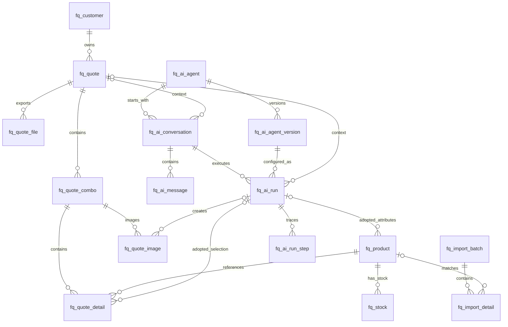

# 服装智能选品与报价系统数据库设计

> 版本：2.3 · 文档状态：Approved · 日期：2026-09-12 · 实施校正：2026-09-13  
> owner：Codex 编写，研发负责人实施与复核  
> 批准记录：2026-09-12 用户确认否决 44 表方案，并批准 6 模块、16 张 `fq_*` 业务表作为首期建库边界；批准设计不等于 DDL、迁移或数据库验证已完成  
> 依据：[PRD v1.4](../产品/产品需求文档.md)、[服装工作台原型设计与生产任务转交](../原型/服装工作台原型设计与生产任务转交.md)，以及用户确认的精简原则：否决旧 44 表方案，按业务主从关系组织，商品价格直接放商品表，AI 只保留必要的 Agent、对话、运行和工具调用记录。  
> 范围：本文件是数据库字段、关系和 16 张业务表的设计事实源；DDL 已在 IMP-02 于临时隔离 MySQL 验证，IMP-03/04 已取得商品、素材、价格和库存业务证据；非隔离数据库和生产数据仍未迁移。

## 1 本次设计结论

**首期按业务分为六个模块，共 16 张表：10 张核心业务表和 6 张 AI Agent 表。商品资料（包括当前销售价）只用一张表；报价以“方案主表 → 组合表 → 商品明细表”为主线；导入只保留“批次 → 行明细”；AI 只保留“Agent 主表 → 配置版本”“对话 → 消息”“对话＋Agent 版本 → 运行 → 步骤/工具调用”。**

旧 44 表方案已被明确否决，禁止从归档稿生成 DDL、实体、Mapper、兼容表或迁移脚本。不再为商品款式、颜色、尺码或价格分别建表，也不单独建设价格版本、库存版本、报价快照、图像输入、图像审核、生命周期事件等多层表。历史价格和库存变化由导入明细保存，历史报价由已确认方案及其明细自身留档。AI 运行表只记录 AI 过程和建议，真正商品、库存、搭配与报价仍以业务表为准。

当前 16 张是首期 `fq_*` 业务物理表上限，不是为了凑数量设定的目标。迁移工具自己的历史元数据表不计入 Fashion 业务表，也不得承载任何商品、库存、客户、报价、导入或 AI 业务事实；是否引入该技术表必须在 `IMP-01` 明确并在 `IMP-02` 验证。新增 `fq_*` 表必须先证明现有主从表、受控 JSON 字段或 RuoYi 平台能力不能安全表达该独立生命周期，并形成新的需求、迁移和恢复决定。首期四套固定导入模板由版本化代码/配置提供，实际映射固化在导入批次；通用 AI 点赞/纠正数据不单独建表，待出现明确反馈界面、查询和数据授权后再作为 P1 设计。

### 1.1 表清单——先看业务，再看字段

| 模块 | 编号 | 表名 | 中文名称 | 一行代表什么 |
| --- | --- | --- | --- | --- |
| 商品资料 | T01 | `fq_product` | 商品资料表 | 一个明确款号、颜色、尺码和当前销售价的SKU |
| 库存 | T02 | `fq_stock` | 商品库存表 | 一个商品在一个仓库的当前可售数量 |
| 客户 | T03 | `fq_customer` | 客户资料表 | 一个团购或批发客户 |
| 报价方案 | T04 | `fq_quote` | 报价方案主表 | 一个客户的一份方案版本，包括需求和报价条件 |
| 报价方案 | T05 | `fq_quote_combo` | 报价方案组合表 | 方案内的一个单品/二品/三品/四品类候选 |
| 报价方案 | T06 | `fq_quote_detail` | 报价方案商品明细表 | 一个组合中某SKU的数量和冻结报价 |
| 报价方案 | T07 | `fq_quote_image` | 方案图片记录表 | 一次组合图片生成、上传或拼版记录及其1–4张结果 |
| 报价方案 | T08 | `fq_quote_file` | 方案导出文件表 | 一次PPT、CSV、图片ZIP或JPG导出记录 |
| 导入管理 | T09 | `fq_import_batch` | 导入批次主表 | 一次上传、发布、人工库存核实或历史恢复，并冻结模板及映射版本 |
| 导入管理 | T10 | `fq_import_detail` | 导入行明细表 | 批次内一条输入或缺失行，以及前后值和错误 |
| AI Agent | T11 | `fq_ai_agent` | Agent主表 | 一个稳定Agent身份和当前发布版本 |
| AI Agent | T12 | `fq_ai_agent_version` | Agent版本表 | 某个Agent的一版提示词、模型、工具和输出配置 |
| AI Agent | T13 | `fq_ai_conversation` | AI对话主表 | 用户围绕一个选品/报价任务开展的一段对话 |
| AI Agent | T14 | `fq_ai_message` | AI消息明细表 | 对话中的一条用户消息、助手回复或上下文摘要 |
| AI Agent | T15 | `fq_ai_run` | Agent运行表 | Agent处理一次输入并产生结构化结果的一次运行 |
| AI Agent | T16 | `fq_ai_run_step` | Agent运行步骤表 | 一次模型调用、工具调用、交接、校验或人工审批步骤 |

价格直接放在商品资料表，表示一个SKU当前唯一销售价；调价历史由导入批次明细保存，正式报价时将商品当前价复制到报价明细。将来若业务明确出现“同一SKU同时存在多套客户价/渠道价”，届时再新增价表主从表，不为尚不存在的场景预建。

来源、品类、颜色、单位、季节和仓库编码复用 RuoYi `sys_dict_type/sys_dict_data`，字典类型固定为 `fashion_product_source`、`fashion_product_category`、`fashion_product_color`、`fashion_product_unit`、`fashion_product_season`、`fashion_warehouse`；这些是平台既有表中的逻辑引用，不计入 16 张 `fq_*` 业务表，也不建立跨表外键。`size_system`、币种、税口径和状态机使用版本化代码枚举，四套固定导入模板使用版本化代码/配置。用户、部门、角色和基础操作日志复用 RuoYi 体系。首期一个企业独立部署，不增加企业租户表。通用能力是否已接通须在实施时验证，本文没有声称现有平台已完成全部文件、AI 或权限功能。

### 1.2 为什么保留 16 张，不能继续机械合并

| 边界 | 当前决定 | 原因 |
| --- | --- | --- |
| 核心业务共 10 张 | `product/stock/customer` 3 张、报价交付 5 张、导入 2 张 | 这是用户直接操作和需要独立查询、权限、状态或多行明细的业务事实；不含纯技术中间表 |
| `fq_customer` 单独保留 | 不塞进 `fq_quote` | 同一客户会有多份报价，负责人、联系人和权限范围也独立变化；合并会重复客户资料并难以授权 |
| `fq_quote/combo/detail` 三层保留 | 确认后三层自身构成历史报价版本 | 一份报价有多个候选/采购组合，一个组合又有多个尺码 SKU；压成一表会重复报价头，塞 JSON 又无法可靠核算、索引和约束数量 |
| `fq_quote_image`、`fq_quote_file` 各一张 | 不并入组合或 Run | 图片与导出都有独立异步状态、重试、文件、费用/审核或下载生命周期；每次任务的少量结果仍合在本行 JSON，不再拆输入、结果、审核、产物表 |
| `fq_import_batch/detail` 两层保留 | 固定模板不建表 | 批次头负责范围、幂等和发布状态；行表负责 missing、错误和 before/after。合成一表会重复批次信息，只有批次头又无法定位行错和恢复 |
| AI 共 6 张 | Agent/版本、对话/消息、Run/Step 各主从两张 | 三组对象分别存在“一对多”和不同保留周期；但输出、checkpoint、工具调用和采用状态均放现有 Run/Step 字段，不再为它们拆表 |

因此，用户最初列出的精简主线对应 **10 张业务表**；为支持已确定的对话式 Agent 运行，再增加 **6 张 AI 生命周期表**，合计 16 张。若首期取消 AI 对话与运行能力，才可以整体移除后 6 张；不能在仍要求该能力时把多条消息或多次工具尝试压进一行 JSON。

## 2 调研依据与本项目取舍

本次于2026-09-11重新核查ERPNext/Frappe、OpenAI Agents SDK、LangGraph和Dify的一手文档或官方源码。前一组用于业务主从结构，后一组用于Agent的对话、运行、步骤和结果结构；不照搬任何完整平台的全部表。

| 核查对象 | 官方文档说明 | 本项目如何采用 |
| --- | --- | --- |
| [Frappe 主表/子表](https://docs.frappe.io/framework/user/en/basics/doctypes/child-doctype) | 子记录依附于父记录，有父对象和行序信息 | 报价组合依附方案，商品明细依附组合；不把它们拆成独立业务系统 |
| [ERPNext 报价](https://docs.frappe.io/erpnext/quotation) | 报价记录客户、有效期、商品行、数量和单价；产品也可使用价表 | 只采用报价主从结构；本项目当前一SKU一价，当前价放商品，正式单价留在报价明细 |
| [ERPNext 商品变体](https://docs.frappe.io/erpnext/item-variants) | 不同颜色、尺码对应具体可交易商品；模板与可交易规格有区别 | 保留规格粒度，但本项目直接一SKU一商品行，不照搬模板、变体和属性子表体系 |
| [ERPNext 库存核对](https://docs.frappe.io/erpnext/stock-reconciliation) | 按商品、仓库、数量和指定时间核对，也支持模板上传 | 库存表只保存商品＋仓库的当前数量，批次明细保存本次调整依据 |
| [ERPNext 数据导入](https://docs.frappe.io/erpnext/data-import) | 有下载模板、上传、校验、行列错误，以及主从数据导入 | 固定模板放版本化代码/配置；数据库只保留批次、行明细两张表，错误和更改前后值不分散到多张技术表 |
| [OpenAI Agents SDK Sessions](https://openai.github.io/openai-agents-python/sessions/) | Session保存跨多次run的会话历史；也可选择服务端conversation continuation，二者不应叠加使用 | 对话与消息分表；本系统由数据库持有历史，不同时建立另一套隐式会话事实源 |
| [OpenAI Agents SDK Running agents](https://openai.github.io/openai-agents-python/running_agents/) | 一次run包含模型循环、工具调用和Agent handoff，并有最大轮次及恢复语义 | 对话不等于运行；run独立记录，工具/交接进入run_step并设置上限 |
| [OpenAI Agents SDK Tracing](https://openai.github.io/openai-agents-python/tracing/) | 端到端trace由带父子关系的span组成，覆盖模型、工具、handoff和guardrail | run对应一次端到端操作，run_step用parent_step_id表达树；不保存模型隐藏思维链 |
| [OpenAI Agents SDK Usage](https://openai.github.io/openai-agents-python/usage/) | token用量按每次run统计，会话只维持上下文；恢复状态的用量需继续累计 | token/费用落run，必要时落step；不能按conversation总量冒充某次调用成本 |
| [LangGraph Agent Server类型](https://github.com/langchain-ai/langgraph/blob/main/libs/sdk-py/langgraph_sdk/schema.py) | 官方SDK区分Assistant配置、Thread状态与Run执行；run关联具体assistant和thread | 对应Agent/Conversation/Run三层，不声称LangGraph要求独立Message表 |
| [LangGraph Persistence](https://docs.langchain.com/oss/python/langgraph/persistence) | thread上的graph step可写checkpoint，跨thread记忆使用独立Store；全量checkpoint会随长对话增长 | 本项目在run_step保存有限checkpoint；不把商品/客户事实复制成模型长期记忆 |
| [Dify Agent配置模型（1.17.1）](https://github.com/langgenius/dify/blob/8387590ace4a094de812b7847fc6a4c3a27cd52b/api/models/agent.py) | 官方源码区分稳定Agent和不可变配置快照/版本 | 采用Agent主表＋版本表，run固定版本 |
| [Dify Conversation/Message模型（1.17.1）](https://github.com/langgenius/dify/blob/8387590ace4a094de812b7847fc6a4c3a27cd52b/api/models/model.py) | 官方源码区分conversation、message、feedback，并记录模型、状态、价格等 | 首期只采用conversation/message；采用/拒绝落run，图片审核落方案图片表，不照搬通用feedback表 |
| [Dify Workflow Run/Node模型（1.17.1）](https://github.com/langgenius/dify/blob/8387590ace4a094de812b7847fc6a4c3a27cd52b/api/models/workflow.py) | 官方源码区分workflow run与node execution，保存输入、输出、状态、耗时、token和步骤数 | 采用run/run_step；选品工具调用、失败和耗时可追查 |

以上是实际核查到的产品行为或公开源码模型，并非声明这些产品底层数据库只有这些对象。**16 张表是根据本项目首期真实生命周期做的设计取舍，不是任何框架的原表复制。** 本系统“缺行整批失败”的严格全量语义来自自身 PRD；AI 输出也必须经过确定性业务校验，不能因为其他 Agent 框架有 run、tool 或 feedback 表就照搬成正式业务表。

## 3 表关系与业务示例

### 3.1 主从关系图

```text
商品资料 fq_product
 ├─ 1:N 商品库存 fq_stock
 └─ 1:N 报价商品明细 fq_quote_detail

客户 fq_customer
 └─ 1:N 报价方案 fq_quote
           ├─ 1:N 方案组合 fq_quote_combo
           │         ├─ 1:N 报价商品明细 fq_quote_detail → 商品资料
           │         └─ 1:N 方案图片 fq_quote_image
           └─ 1:N 导出文件 fq_quote_file

导入批次 fq_import_batch（冻结模板代码、版本和实际映射）
 └─ 1:N 导入明细 fq_import_detail → 商品资料（匹配成功时）
           └─ 经全量校验后更新商品、价格、库存或图片字段

Agent主表 fq_ai_agent
 ├─ 1:N Agent版本 fq_ai_agent_version
 │         └─ 1:N Agent运行 fq_ai_run
 └─ 1:N AI对话 fq_ai_conversation

AI对话 fq_ai_conversation
 ├─ 1:N AI消息 fq_ai_message
 ├─ 1:N Agent运行 fq_ai_run
 │         └─ 1:N 运行步骤 fq_ai_run_step（模型/工具/交接/校验）
```



### 3.2 商品一张表具体怎么存

| product_id | sku_code | style_code | name | color | size |
| --- | --- | --- | --- | --- | --- |
| 101 | TOP-G-M | TOP001 | 休闲上衣 | 绿色 | M |
| 102 | TOP-G-L | TOP001 | 休闲上衣 | 绿色 | L |
| 103 | TOP-B-M | TOP001 | 休闲上衣 | 黑色 | M |

这三行都在`fq_product`中，不再拆SPU、颜色款、SKU三张表。页面按来源＋款号＋颜色分组显示，数据库则保留可报价、可核库存的规格行。颜色和尺码不能写成“绿色/黑色”“M/L”塞在一条可交易记录里，否则无法判断绿色M码到底有多少。

同款不同规格的名称、材质、图片允许少量重复，换取直接查询和简单维护。款号级编辑批量更新同款行，颜色级图片编辑只更新同款同色行；两种操作都必须在一个事务内完成，不能逐行部分成功。

### 3.3 报价三张表怎么配合

例如“某客户100套活动服报价”：

- `fq_quote`一行：客户、需求、预算、报价模式、折扣、运费、有效期。
- `fq_quote_combo`四行：A上衣、B上衣＋裤子、C上衣＋裤子＋帽子、D上衣＋裤子＋帽子＋鞋。
- `fq_quote_detail`若干行：D组合的上衣M码60件、L码40件；裤子各尺码；帽子100顶；鞋各尺码。

**四品类不等于四条明细。** 一个品类有多个尺码就有多条商品明细，用`slot_code`识别它们属于同一个组合位置，不再新增“槽位表”和“尺码配比表”。

### 3.4 主要关联字段

| 子表字段 | 指向 | 约束 |
| --- | --- | --- |
| stock.product_id / quote_detail.product_id | product.id | 商品必须存在；归档不删除关联；报价明细同时冻结当时资料 |
| quote.customer_id | customer.id | 方案始终有客户；权限按客户负责人/协作者校验 |
| quote_combo.quote_id | quote.id | 一个组合只能属于一份方案版本 |
| quote_detail.combo_id / product_id | quote_combo.id / product.id | 明细是组合子表，而不是同时在方案和组合两处维护 |
| quote_image.combo_id | quote_combo.id | 图片属于具体组合，不单独新建图片项目 |
| quote_file.quote_id | quote.id | 文件始终绑定一个确认版本 |
| import_detail.batch_id / product_id | import_batch.id / product.id | 批次必填；未匹配商品可空并报错 |
| ai_agent_version.agent_id | ai_agent.id | 配置版本严格属于一个稳定Agent身份 |
| ai_conversation.primary_agent_id / quote_id | ai_agent.id / quote.id | 对话有默认Agent；可围绕一份方案，也可先对话再新建方案 |
| ai_message.conversation_id | ai_conversation.id | 消息严格属于一个对话；序号在对话内唯一 |
| ai_run.conversation_id / agent_version_id | ai_conversation.id / ai_agent_version.id | 每次运行固定具体Agent版本，不从当前配置回查 |
| ai_run_step.run_id / parent_step_id | ai_run.id / ai_run_step.id | 步骤属于运行；父步骤表达工具/子Agent层级，禁止环 |
| product.last_ai_run_id / quote_detail.ai_run_id | ai_run.id | 只记录已采用属性或已采用选品的AI来源；人工操作可空，AI输出未采用不得提前回指 |
| quote_image.ai_run_id | ai_run.id | 记录图片任务由哪个run创建，任务创建时即可写；不表示图片已生成、审核或被组合采用 |

## 4 字段约定

设计采用MySQL 8系列、InnoDB、utf8mb4；这是设计选型，不表示已连接实例。业务ID用BIGINT，接口以字符串传递。商品编码按文本保留前导零。

每张表均包含以下公共字段，后面的字典不再重复：

| 字段 | 类型 | 必填/默认 | 说明 |
| --- | --- | --- | --- |
| id | BIGINT | 是 | 主键，服务端生成 |
| create_by | BIGINT | 是 | 创建者，引用既有用户身份 |
| create_time | DATETIME(3) | 是 | 服务端创建时间 |
| update_by | BIGINT | 是 | 最后修改者 |
| update_time | DATETIME(3) | 是 | 最后修改时间 |
| row_version | BIGINT | 是，1 | 乐观锁；修改时检查期望值并递增 |

下表`—`表示可空，除此以外“是”表示非空。字段名一行只定义一个字段。金额`DECIMAL(16,2)`单位为元，不用FLOAT/DOUBLE；百分率`DECIMAL(5,2)`单位为百分数，5.00表示优惠5%，不是95折中的95。数量用INT。时间统一存UTC，输入/显示明确时区。JSON用于小规模图片/配置/校验证据，不用于取代报价商品行或库存行。

外键使用`ON DELETE RESTRICT`，禁止级联删除正式业务。用户ID、系统字典编码为平台逻辑引用，服务端验证。状态停用/归档代替硬删；已用业务编码不得因归档重复使用。

文档按业务阅读顺序排列，不等于DDL建表顺序。`fq_ai_agent.current_version_id ↔ fq_ai_agent_version.agent_id`、`fq_ai_message.run_id ↔ fq_ai_run.input_message_id`、`fq_quote_combo.selected_image_id ↔ fq_quote_image.combo_id`是有意保留的循环关系；商品/库存回指导入批次、商品/报价产物回指来源run则是跨模块溯源。迁移时先创建全部表和无环的必需外键，再用后续`ALTER TABLE`增加这些可空回指外键；插入时先建立主记录，再设置回指。不能依靠永久关闭外键检查，也不能为了绕过顺序而取消“版本属于Agent、消息属于对话、图片属于组合”等应用层归属校验。

## 5 商品资料模块

### T01 `fq_product` 商品资料表

| 字段 | 类型 | 必填/默认 | 说明 |
| --- | --- | --- | --- |
| source_code | VARCHAR(64) | 是 | 来源字典编码 |
| sku_code | VARCHAR(64) | 是 | 来源内唯一的商品规格编码 |
| style_code | VARCHAR(64) | 是 | 款号，用于同款分组 |
| name | VARCHAR(120) | 是 | 商品名称 |
| category_code | VARCHAR(32) | 是 | 品类字典，上衣/裤子/帽子/鞋等 |
| color_code | VARCHAR(32) | 是 | 稳定颜色代码 |
| color_name | VARCHAR(32) | 是 | 展示颜色 |
| size_code | VARCHAR(32) | 是 | M、L、40.5、均码等 |
| size_system | VARCHAR(16) | 是 | CN/EU/US/LETTER/FREE等尺码制式 |
| unit | VARCHAR(16) | 是 | 件、顶、双等 |
| sale_price | DECIMAL(16,2) | — | 当前销售单价，单位元；可空或为0，正式报价必须>0 |
| currency | CHAR(3) | CNY | 当前价格币种，首期仅CNY |
| tax_mode | VARCHAR(16) | included | 当前价格口径：included含税/excluded未税 |
| price_as_of | DATETIME(3) | — | 当前价格的实际业务时间；有价格时必填 |
| last_price_import_batch_id | BIGINT | — | FK→fq_import_batch.id，当前价格来源；有价格时必填 |
| brand | VARCHAR(80) | — | 品牌资料 |
| material | VARCHAR(255) | — | 实际材质资料，不由图片推测成事实 |
| season | VARCHAR(32) | 四季 | 季节；多季节按字典集合校验 |
| tags_json | JSON | 空数组 | 风格、场景、人群等确认标签 |
| main_image_key | VARCHAR(512) | — | 当前主图的私有对象键 |
| images_json | JSON | 空数组 | 最多5张当前关联图片及来源、用途许可；结构见第10节 |
| visual_version | BIGINT | 1 | 主体/颜色/使用图片改变递增；仅改文案不递增 |
| last_ai_run_id | BIGINT | — | FK→fq_ai_run.id，最近一次已采用属性建议的来源运行 |
| attributes_confirmed | TINYINT | 0 | 0待核实，1已确认；不能将AI建议当人工确认 |
| attributes_confirmed_by | BIGINT | — | 实际确认者 |
| attributes_confirmed_at | DATETIME(3) | — | 实际确认时间 |
| jd_item_id | VARCHAR(64) | — | 当前主要京东来源ID，非唯一 |
| jd_url | VARCHAR(2048) | — | HTTPS来源链接，无Cookie/凭据 |
| last_product_import_batch_id | BIGINT | — | FK→fq_import_batch.id，最近商品资料变更来源 |
| status | VARCHAR(16) | draft | draft/active/inactive |

唯一：`(source_code,sku_code)`、`(source_code,style_code,color_code,size_system,size_code)`。索引：`(category_code,status)`、`(source_code,style_code,color_code)`、`(price_as_of,status)`。不按商品名称匹配，也不让京东ID替代SKU。批量图片映射按款号＋颜色查出全部规格，一次确认关联。

价格与商品是一对一字段关系：一条SKU记录只有一套当前销售价。价格全量更新发布后立即生效，只改`sale_price/currency/tax_mode/price_as_of/last_price_import_batch_id`，不改变款号、图片或库存；历史前后值写入导入明细。`price_as_of`不得晚于本批允许的源系统时钟偏差，本版不支持预约调价或自动到期回退。若将来同一时点同一SKU确实需要客户价、渠道价、阶梯价或未来生效价，再通过新需求增加价表主从表并迁移，不能提前把本版口径称为支持这些能力。

## 6 库存模块

### T02 `fq_stock` 商品库存表

| 字段 | 类型 | 必填/默认 | 说明 |
| --- | --- | --- | --- |
| product_id | BIGINT | 是 | FK→fq_product.id |
| warehouse_code | VARCHAR(64) | 是 | 仓库字典编码，默认主仓由系统配置 |
| available_qty | INT | 是 | ≥0，来源确认的可售量，不自行推测预占 |
| as_of | DATETIME(3) | 是 | 当前数量实际取得/核实时间 |
| confirmation_type | VARCHAR(16) | import | import/manual_verify/restore |
| verified_by | BIGINT | — | 人工核实者；manual_verify必填 |
| evidence_note | VARCHAR(1000) | — | ERP导出或盘点凭据摘要；人工核实必填 |
| last_import_batch_id | BIGINT | 是 | FK→fq_import_batch.id，当前数量来源 |

唯一：`(product_id,warehouse_code)`；索引：`(warehouse_code,as_of)`。无记录是未知库存，不是0。库存全量发布和逐SKU人工核实都通过批次留痕；核实创建新变更记录而不是把旧文件时间伪装成现在。恢复原值必须恢复原as_of，不能解除24小时过期条件。

不建入库单、出库单、库存流水和预占表：当前产品是现货报价，不是仓储系统。报价确认只核验可售量，不扣库存；正式订单锁库存是以后独立需求。

## 7 客户模块

### T03 `fq_customer` 客户资料表

| 字段 | 类型 | 必填/默认 | 说明 |
| --- | --- | --- | --- |
| code | VARCHAR(64) | 是 | 客户唯一编码 |
| name | VARCHAR(80) | 是 | 名称或简称，可同名不自动合并 |
| customer_type | VARCHAR(24) | 是 | group_purchase/wholesale |
| contact_name | VARCHAR(80) | — | 联系人 |
| contact_phone | VARCHAR(512) | — | 联系电话，应用层加密后保存；密钥不入库 |
| region | VARCHAR(120) | — | 地区 |
| salesperson_id | BIGINT | 是 | 主要销售，引用平台用户 |
| collaborator_ids | JSON | 空数组 | 少量明确授权协同销售ID；服务端检查，不接受任意前端自赋权 |
| internal_note | VARCHAR(2000) | — | 内部备注，不能复制到客户文件 |
| status | VARCHAR(16) | active | active/archived |

唯一：`code`；索引：`(salesperson_id,status)`、`name`。首期客户量和协作者数量小，授权ID集合不单拆关系表；访问仍要结合平台角色检查。若以后需要大规模按协作关系检索，再拆关联表，不在本版预建。

## 8 报价方案模块

### T04 `fq_quote` 报价方案主表

| 字段 | 类型 | 必填/默认 | 说明 |
| --- | --- | --- | --- |
| quote_no | VARCHAR(64) | 是 | 一组方案的业务编号 |
| version_no | INT | 1 | 同编号下版本序号；与quote_no共同唯一 |
| source_quote_id | BIGINT | — | FK→fq_quote.id，修订复制自哪一版本 |
| customer_id | BIGINT | 是 | FK→fq_customer.id |
| customer_name | VARCHAR(80) | 是 | 方案中的客户名称；确认后冻结 |
| title | VARCHAR(100) | 是 | 方案名称 |
| salesperson_id | BIGINT | 是 | 本方案负责人 |
| requirement_text | TEXT | — | 原始需求，仅内部 |
| requirement_json | JSON | 是 | 已采用的场景/季节/风格/颜色/排除项等结构化需求，结构见10节 |
| requirement_confirmed | TINYINT | 0 | 正式候选前确认 |
| requested_qty | INT | 100 | 1–100000，默认每候选套数 |
| budget | DECIMAL(16,2) | — | 空不限制，有值必须>0 |
| budget_basis | VARCHAR(16) | total | total/per_set，按最终应付判断 |
| quote_mode | VARCHAR(16) | alternatives | alternatives备选/combined合并采购 |
| progressive | TINYINT | 1 | 1递进比较，0独立选款 |
| combo_template_json | JSON | 是 | 本方案选定档位、槽位角色和每档候选数；由配置复制后保存 |
| warehouse_code | VARCHAR(64) | 是 | 本方案指定核验仓库，不暗中跨仓凑货 |
| currency | CHAR(3) | CNY | 冻结币种 |
| tax_mode | VARCHAR(16) | included | 必须与所有选中商品当前价格口径一致 |
| tax_rate | DECIMAL(5,2) | — | 未税必填0–100，含税不再次加税 |
| fee_taxable | TINYINT | 1 | 未税模式费用是否再计税 |
| discount_type | VARCHAR(16) | percent | percent/fixed |
| discount_rate | DECIMAL(5,2) | 5.00 | percent时0–100；fixed时0 |
| fixed_discount | DECIMAL(16,2) | 0 | fixed时金额；percent时0 |
| freight | DECIMAL(16,2) | 0 | 运费/附加费用，≥0 |
| subtotal | DECIMAL(16,2) | — | 仅合并报价保存总商品额；备选为空 |
| discount_amount | DECIMAL(16,2) | — | 仅合并报价保存实际优惠；备选为空 |
| tax_amount | DECIMAL(16,2) | — | 仅合并报价保存额外税额；备选为空 |
| total_amount | DECIMAL(16,2) | — | 仅合并报价保存总应付；备选不可求和 |
| approval_json | JSON | — | 折扣/调价例外的申请、决定、输入hash、批准人和有效期 |
| valid_days | INT | 7 | 1–30 |
| valid_until | DATETIME(3) | — | 正式确认时计算并冻结 |
| public_note | VARCHAR(2000) | — | 对客说明白名单 |
| presentation_json | JSON | 是 | 品牌、联系人、Logo对象键、版式与模板版本的冻结值 |
| content_hash | CHAR(64) | — | 确认内容规范化摘要，含组合和商品明细 |
| confirmed_by | BIGINT | — | 确认者 |
| confirmed_at | DATETIME(3) | — | 正式确认时间 |
| status | VARCHAR(16) | draft | draft/confirmed/void/closed |
| void_reason | VARCHAR(1000) | — | 作废必填 |
| is_demo | TINYINT | 0 | 示例记录明确标记，不自动迁移为正式单 |

唯一：`(quote_no,version_no)`；索引：`(customer_id,create_time)`、`(salesperson_id,status)`、`valid_until`。`source_quote_id`不得成环。用户与客户ID仍用于授权，客户文件只读白名单冻结字段。

**留档方式：** 草稿可修改；确认后主表业务字段、组合、商品明细锁定。修改报价时复制这三层为新version_no，清空确认/例外审批并重新核验。不再创建一套快照头、快照组合、快照商品表。作废只能修改生命周期状态与原因，并记平台审计；不改旧金额。

### T05 `fq_quote_combo` 报价方案组合表

| 字段 | 类型 | 必填/默认 | 说明 |
| --- | --- | --- | --- |
| quote_id | BIGINT | 是 | FK→fq_quote.id |
| combo_no | VARCHAR(32) | 是 | 方案内组合编号，如A1/D2 |
| name | VARCHAR(100) | 是 | 例如“四品类活动套装” |
| category_count | INT | 是 | 1–4，按互异slot_code计算 |
| set_qty | INT | 100 | 本候选套数，1–100000 |
| selected | TINYINT | 1 | 是否纳入客户报价 |
| sort_no | INT | 0 | 展示顺序 |
| reason | VARCHAR(2000) | — | 推荐/搭配理由 |
| lock_json | JSON | 空数组 | 按slot_code记录手动/继承锁定及款号颜色；最多4项 |
| visual_hash | CHAR(64) | 是 | 当前组合商品身份、图片版本、画面参数的摘要 |
| allocation_confirmed | TINYINT | 0 | 尺码建议须人工确认 |
| allocation_confirmed_by | BIGINT | — | 确认者 |
| allocation_confirmed_at | DATETIME(3) | — | 确认时间 |
| selected_image_id | BIGINT | — | FK→fq_quote_image.id，必须属于本组合 |
| selected_image_no | INT | — | 选中的结果序号1–4，必须审核通过 |
| subtotal | DECIMAL(16,2) | — | 当前组合明细商品额；报价预检后保存 |
| discount_amount | DECIMAL(16,2) | — | 备选模式保存，合并为空 |
| freight | DECIMAL(16,2) | — | 备选模式保存各候选运费，合并为空 |
| tax_amount | DECIMAL(16,2) | — | 备选模式保存，合并为空 |
| total_amount | DECIMAL(16,2) | — | 备选模式候选应付，合并为空 |

唯一：`(quote_id,combo_no)`；索引：`(quote_id,selected,sort_no)`。主表只有合并应付，组合表只有备选应付，两处不是同一金额的重复事实源。组合subtotal保留商品构成，不能当作客户应付。

### T06 `fq_quote_detail` 报价方案商品明细表

| 字段 | 类型 | 必填/默认 | 说明 |
| --- | --- | --- | --- |
| combo_id | BIGINT | 是 | FK→fq_quote_combo.id |
| ai_run_id | BIGINT | — | FK→fq_ai_run.id；由Agent建议并经销售采用时记录，人工加商品可空 |
| line_no | INT | 是 | 组合内行号 |
| slot_code | VARCHAR(32) | 是 | 上衣/裤子/帽子/鞋等组合位置 |
| product_id | BIGINT | 是 | FK→fq_product.id |
| source_code | VARCHAR(64) | 是 | 冻结来源编码 |
| sku_code | VARCHAR(64) | 是 | 冻结规格编码 |
| style_code | VARCHAR(64) | 是 | 冻结款号 |
| product_name | VARCHAR(120) | 是 | 冻结商品名 |
| category_code | VARCHAR(32) | 是 | 冻结品类 |
| color_code | VARCHAR(32) | 是 | 冻结颜色编码 |
| color_name | VARCHAR(32) | 是 | 冻结颜色名称 |
| size_code | VARCHAR(32) | 是 | 冻结尺码 |
| size_system | VARCHAR(16) | 是 | 冻结尺码制式 |
| unit | VARCHAR(16) | 是 | 冻结单位 |
| qty | INT | 是 | >0，采购件/顶/双数；零行不保存 |
| source_price | DECIMAL(16,2) | — | 商品表当前原价，草稿可为0，正式确认必须>0 |
| quote_price | DECIMAL(16,2) | — | 实际报价单价，草稿可为0，正式确认必须>0；不同原价需有效例外 |
| amount | DECIMAL(16,2) | — | quote_price×qty，确认必填 |
| price_batch_id | BIGINT | — | FK→fq_import_batch.id，正式确认必填，溯源取价 |
| stock_batch_id | BIGINT | — | FK→fq_import_batch.id，正式确认必填，溯源核验 |
| stock_qty | INT | — | 确认时核验的可售数，不是扣减后库存 |
| stock_as_of | DATETIME(3) | — | 确认时实际库存业务时间 |
| image_key | VARCHAR(512) | — | 冻结商品原图，正式确认必填 |
| image_hash | CHAR(64) | — | 对应文件摘要 |
| image_version | BIGINT | — | 对应商品visual_version |
| image_source_json | JSON | — | 冻结来源、用途许可与裁切信息 |
| remark | VARCHAR(500) | — | 对客商品说明，不放成本/内部备注 |

唯一：`(combo_id,line_no)`、`(combo_id,product_id)`；索引：`product_id`、`price_batch_id`、`stock_batch_id`。同槽位只能选同来源、同款、同色的多个尺码；每槽位SUM(qty)=组合set_qty。主表不再另建“SKU配比”数组，实际数量只在本表。

### T07 `fq_quote_image` 方案图片记录表

| 字段 | 类型 | 必填/默认 | 说明 |
| --- | --- | --- | --- |
| combo_id | BIGINT | 是 | FK→fq_quote_combo.id |
| ai_run_id | BIGINT | — | FK→fq_ai_run.id；由图片协调Agent创建时记录，人工上传/原图拼版可空 |
| source_image_id | BIGINT | — | FK→fq_quote_image.id，修订复用/重试来源 |
| image_type | VARCHAR(16) | 是 | model/styling/ecommerce/composition |
| source_mode | VARCHAR(16) | 是 | sample/upload/provider/composition/reuse |
| input_hash | CHAR(64) | 是 | 输入组合visual_hash |
| inputs_json | JSON | 是 | 本次商品ID、规格和图片版本的有限清单 |
| parameters_json | JSON | 是 | 画幅、模特、姿势、提示词版本；禁止客户/价格/库存数据 |
| requested_count | INT | 2 | 1–4 |
| results_json | JSON | 空数组 | 每张对象键、失败信息、审核人与结果；固定结构见10节 |
| provider_code | VARCHAR(64) | — | 真实调用的供应商配置引用，不存密钥 |
| provider_task_id | VARCHAR(128) | — | 真实受理ID；样例/上传为空 |
| request_key | VARCHAR(128) | 是 | 唯一请求意图键，重复点击复用 |
| status | VARCHAR(24) | queued | queued/running/success/partial/failed/cancel_requested/cancelled/unknown |
| stale | TINYINT | 0 | 输入变化待复核，不抹掉原生成成功事实 |
| retry_count | INT | 0 | 自动重试最多2次；unknown先回查 |
| next_retry_at | DATETIME(3) | — | 下次处理时间 |
| lease_until | DATETIME(3) | — | 工作者租约到期，崩溃后可恢复 |
| estimated_cost | DECIMAL(16,6) | — | 预计真实费用，未知为空 |
| actual_cost | DECIMAL(16,6) | — | 已核对账单，未知不能填0 |
| cost_currency | CHAR(3) | — | 供应商账单币种 |
| billing_status | VARCHAR(16) | not_applicable | not_applicable/reserved/unknown/settled |
| billing_events_json | JSON | 空数组 | 有限去重账单事件键、金额和依据；不记录签名或凭据 |
| error_message | VARCHAR(1000) | — | 脱敏错误 |
| finished_at | DATETIME(3) | — | 实际完成时间 |

唯一：`request_key`、`(provider_code,provider_task_id)`；索引：`(combo_id,create_time)`、`ai_run_id`、`(status,next_retry_at)`。一任务最多4张候选，有限结果放同一行，不再拆任务输入/输出/审核三套表。结果更新和审核用row_version防止互相覆盖；复核历史追加在结果的reviews集合，不直接抹掉拒绝记录。`ai_run_id`只表示任务创建来源，真正采用仍只认combo.selected_image_id/selected_image_no及对应审核结果。

修订复用图片时建source_mode=reuse的新记录，保留source_image_id，原供应商任务不重复填入，不伪造新调用。source_image_id禁止指向自身或形成来源环，来源记录创建时间必须早于当前记录。只在视觉输入一致且用途许可有效时允许复用。真正采用哪张由组合中的两个字段明确指定。

### T08 `fq_quote_file` 方案导出文件表

| 字段 | 类型 | 必填/默认 | 说明 |
| --- | --- | --- | --- |
| quote_id | BIGINT | 是 | FK→fq_quote.id，必须为已确认版本 |
| file_type | VARCHAR(16) | 是 | pptx/csv/image_zip/jpg |
| purpose | VARCHAR(24) | customer | customer/internal_expired |
| quote_hash | CHAR(64) | 是 | 本次固定方案内容摘要 |
| renderer_version | VARCHAR(64) | 是 | 渲染版本，可复现 |
| request_key | VARCHAR(128) | 是 | 方案版本＋格式＋用途＋渲染版本摘要，唯一 |
| status | VARCHAR(16) | queued | queued/running/success/failed |
| files_json | JSON | 空数组 | 实际文件名、对象键、摘要、字节数、页数；JPG可多项 |
| retry_count | INT | 0 | 自动重试上限2次 |
| next_retry_at | DATETIME(3) | — | 重试时间 |
| lease_until | DATETIME(3) | — | 工作者租约 |
| error_message | VARCHAR(1000) | — | 失败原因 |
| last_download_at | DATETIME(3) | — | 最近服务端完成下载响应时间，不等于已发给客户 |
| download_count | INT | 0 | 已完成下载响应次数 |

唯一：`request_key`；索引：`(quote_id,create_time)`、`(status,next_retry_at)`。任务与其少量文件合在一表；成功必须有可读非空文件。只能读取已确认三层方案，不能导出时重新读取最新商品价替换报价。

## 9 导入管理模块

首期提供商品、价格、库存、图片映射四套固定模板。模板定义作为版本化代码/配置随应用发布，不提供后台动态模板管理，因此不建立 `fq_import_template`。每次导入仍必须把实际模板代码、模板版本、工作表和字段映射完整冻结到批次，保证历史可解释。未来只有在出现管理员在线配置、多供应商长期复用或独立模板权限时，才通过新需求增加模板表。

### T09 `fq_import_batch` 导入批次主表

| 字段 | 类型 | 必填/默认 | 说明 |
| --- | --- | --- | --- |
| batch_no | VARCHAR(64) | 是 | 唯一批次号 |
| template_code | VARCHAR(64) | — | 固定模板家族编码；文件导入必填，手工核实/恢复可空 |
| template_version | VARCHAR(32) | — | 应用内模板版本；文件导入必填，与 mapping_snapshot 一起冻结 |
| import_type | VARCHAR(16) | 是 | product/price/stock/image |
| operation_type | VARCHAR(16) | import | import/manual/verify/restore |
| source_batch_id | BIGINT | — | FK→fq_import_batch.id，修正/恢复来源 |
| source_code | VARCHAR(64) | 是 | 本批来源范围 |
| warehouse_code | VARCHAR(64) | — | stock必填；其他为空 |
| file_name | VARCHAR(255) | — | 原文件名；文件导入必填 |
| file_key | VARCHAR(512) | — | 私有原文件对象键 |
| file_hash | CHAR(64) | — | 原文件摘要；文件导入必填 |
| mapping_snapshot | JSON | 是 | 固化工作表、字段映射和显式清空字段 |
| scope_json | JSON | 是 | 来源、品类、状态等范围定义；不是随意SQL |
| scope_hash | CHAR(64) | — | 校验时按稳定商品ID排序的冻结范围摘要 |
| base_data_hash | CHAR(64) | — | 校验时范围内商品结构和目标行row_version/不存在标记摘要 |
| as_of | DATETIME(3) | 是 | 本批实际业务时间，不用上传时间冒充 |
| request_key | VARCHAR(128) | 是 | 同文件/映射/范围/时间/类型幂等键 |
| expected_count | INT | 0 | 严格全量应覆盖商品数 |
| actual_count | INT | 0 | 文件实际数据行数 |
| error_count | INT | 0 | 阻断错误数 |
| status | VARCHAR(24) | uploaded | uploaded/validating/invalid/validated/publishing/success/failed/cancelled/conflict |
| validated_at | DATETIME(3) | — | 实际校验完成时间 |
| published_at | DATETIME(3) | — | 实际事务生效时间 |
| operator_note | VARCHAR(1000) | — | 人工核实/恢复原因及依据 |
| error_message | VARCHAR(1000) | — | 批次错误摘要 |

唯一：`batch_no`、`request_key`；索引：`(import_type,status,create_time)`、`(source_code,create_time)`。手工改价/核实也建有操作类型的批次，不制造假的上传文件。source_batch_id禁止指向自身或形成来源环，来源批次创建时间必须早于当前批次。

### T10 `fq_import_detail` 导入行明细表

| 字段 | 类型 | 必填/默认 | 说明 |
| --- | --- | --- | --- |
| batch_id | BIGINT | 是 | FK→fq_import_batch.id |
| detail_no | INT | 是 | 批次内内部连续行号 |
| source_row_no | INT | — | Excel/CSV实际行号；缺失商品的系统补记行为空 |
| row_type | VARCHAR(16) | input | input/missing；区分输入与应有但缺失的行 |
| product_id | BIGINT | — | FK→fq_product.id；未知/新增商品可空 |
| business_key | VARCHAR(255) | 是 | 来源＋SKU等规范化业务键，文本保留前导零 |
| raw_data | JSON | — | 原始字段白名单；missing行为空 |
| normalized_data | JSON | — | 类型化后的拟写入商品/价格/库存/图片数据 |
| before_data | JSON | — | 受影响字段原值、row_version和原业务时间；原记录不存在用exists=false |
| after_data | JSON | — | 实际成功写入的字段、row_version和业务时间；未发布为空 |
| status | VARCHAR(16) | pending | pending/valid/invalid/applied |
| error_json | JSON | 空数组 | [{field,code,value_summary,message}] |
| change_type | VARCHAR(16) | — | added/changed/unchanged |

唯一：`(batch_id,detail_no)`；索引：`(batch_id,status)`、`(batch_id,business_key)`、`(product_id,create_time)`。**business_key在文件行内不设唯一**，才能保存重复输入并明确报错。发布前要求合法目标业务键恰好一条。缺行补记missing，既保留冻结范围，又不再单独建范围表。

商品导入可以新增；价格/库存不得遇到未知SKU自动建商品。全量仅适用于价格和库存的明确范围，普通商品资料导入不是强制整库覆盖。

## 10 AI Agent 模块

### 10.1 Agent在本系统中负责什么

首期不是一个无边界的“万能Agent”，而是由同一运行框架承载几类可配置Agent：

| Agent类型 | 主要输入 | 允许调用的工具 | 输出 |
| --- | --- | --- | --- |
| 需求理解Agent | 销售对话、已选客户、当前方案 | 客户读取、方案草稿读取 | 结构化需求建议，不直接确认 |
| 商品选品Agent | 已确认需求、数量、预算 | 商品检索、当前价格读取、库存检查 | 候选商品及排除原因 |
| 搭配Agent | 商品候选、档位、锁定项 | 组合校验、颜色/风格规则、库存检查 | 1–4品类搭配建议 |
| 报价助手Agent | 选中组合与商务参数 | 确定性报价计算器、报价预检 | 解释、异常提示；金额由工具计算 |
| 图片协调Agent | 当前组合及获准商品图 | 创建图片任务、查询任务状态 | 图片任务引用与审核提示，不自行认定图片合格 |
| 总控Agent | 一条用户请求 | 将专业Agent当工具或handoff | 路由并汇总上述结果 |

这些类型不各建一张业务表，而作为`fq_ai_agent.agent_type`的不同主数据。一个部署可以先只启用总控、需求理解、选品搭配三个Agent；报价和库存的确定性规则仍在业务服务中，不写入提示词当唯一规则。

### T11 `fq_ai_agent` Agent主表

| 字段 | 类型 | 必填/默认 | 说明 |
| --- | --- | --- | --- |
| agent_code | VARCHAR(64) | 是 | Agent稳定编码，如fashion_orchestrator/product_selector |
| name | VARCHAR(100) | 是 | 中文显示名称 |
| agent_type | VARCHAR(32) | 是 | orchestrator/requirement/selection/styling/quotation/image |
| description | VARCHAR(500) | — | 能力和不负责事项 |
| current_version_id | BIGINT | — | FK→fq_ai_agent_version.id，必须属于本Agent且已published |
| status | VARCHAR(16) | active | active/inactive |

唯一：`agent_code`；索引：`(agent_type,status)`。Agent主表是稳定身份，对话引用它；提示词、模型和工具变化不覆盖主表历史配置。

### T12 `fq_ai_agent_version` Agent配置版本表

| 字段 | 类型 | 必填/默认 | 说明 |
| --- | --- | --- | --- |
| agent_id | BIGINT | 是 | FK→fq_ai_agent.id |
| version_no | INT | 是 | 本Agent内递增版本 |
| provider_code | VARCHAR(64) | 是 | 供应商配置逻辑引用；密钥不入本表 |
| model_name | VARCHAR(128) | 是 | 实际模型标识 |
| system_instruction | MEDIUMTEXT | 是 | 版本化系统指令，不含API密钥或客户私密数据 |
| model_config_json | JSON | 是 | temperature、reasoning、输出限制等允许参数 |
| tools_json | JSON | 空数组 | 工具名、版本、只读/写入、审批要求和超时 |
| handoffs_json | JSON | 空数组 | 允许移交的目标agent_code和条件 |
| input_schema_json | JSON | 是 | 允许输入的JSON Schema |
| output_schema_json | JSON | 是 | 结构化输出JSON Schema |
| guardrails_json | JSON | 是 | 输入/输出限制、敏感字段、最大商品数等 |
| max_steps | INT | 12 | 单次运行最大步骤，1–50 |
| timeout_seconds | INT | 120 | 单次运行总超时，1–600 |
| config_hash | CHAR(64) | 是 | 配置规范化摘要 |
| status | VARCHAR(16) | draft | draft/published/retired |
| published_by | BIGINT | — | 发布人；published必填 |
| published_at | DATETIME(3) | — | 发布时间 |

唯一：`(agent_id,version_no)`；索引：`config_hash`、`(agent_id,status)`。published版本的业务字段不可更新；发布新版本与切换agent.current_version_id在同一事务。同一个Agent历史上可有多个published版本，但只有指针所指版本用于新run；旧run继续引用实际版本。max_steps统计run_step中互异call_key的逻辑步骤，重试attempt不重复计数；每个call_key最多1次初始尝试＋2次重试。`run_attempt`只统计整run的worker重新调度，与step.attempt_no分开。Agent不能靠tools_json授予权限，工具服务每次按登录用户、客户和方案重新鉴权。

### T13 `fq_ai_conversation` AI对话主表

| 字段 | 类型 | 必填/默认 | 说明 |
| --- | --- | --- | --- |
| conversation_no | VARCHAR(64) | 是 | 内部唯一对话号 |
| owner_user_id | BIGINT | 是 | 发起销售，引用平台用户 |
| customer_id | BIGINT | — | FK→fq_customer.id；尚未选择客户可空 |
| quote_id | BIGINT | — | FK→fq_quote.id；一份方案可有多段对话 |
| primary_agent_id | BIGINT | 是 | FK→fq_ai_agent.id，对话默认Agent身份；每次run再固定实际版本 |
| title | VARCHAR(120) | 是 | 对话标题 |
| channel | VARCHAR(16) | web | web/api/voice；voice只保存已授权转写文本引用 |
| context_json | JSON | 是 | 当前客户/方案/组合ID和row_version，不复制完整业务数据 |
| summary_text | TEXT | — | 可见上下文摘要，不是商品或报价事实源 |
| summary_up_to_seq | INT | 0 | 摘要覆盖到的消息序号 |
| message_count | INT | 0 | 消息数缓存，由消息事务维护 |
| last_message_at | DATETIME(3) | — | 最近消息时间 |
| status | VARCHAR(16) | active | active/closed/archived |

唯一：`conversation_no`；索引：`(owner_user_id,status,last_message_at)`、`(quote_id,last_message_at)`、`(customer_id,last_message_at)`。对话访问权=登录用户有客户/方案权限，不能只凭conversation_no。首期只以本库message和可见summary构造模型上下文，不保存或依赖供应商的持续conversation；以后若启用供应商会话，必须先增加供应商和Agent版本归属字段并形成迁移设计，不能暗中同时维护两套上下文事实源。

### T14 `fq_ai_message` AI消息明细表

| 字段 | 类型 | 必填/默认 | 说明 |
| --- | --- | --- | --- |
| conversation_id | BIGINT | 是 | FK→fq_ai_conversation.id |
| seq_no | INT | 是 | 对话内单调递增序号 |
| parent_message_id | BIGINT | — | FK→fq_ai_message.id，重试/分支来源；必须同对话且早于本消息 |
| run_id | BIGINT | — | FK→fq_ai_run.id；助手输出消息关联产生它的run |
| role | VARCHAR(16) | 是 | user/assistant/system_summary；工具过程不伪装成聊天消息 |
| content_text | MEDIUMTEXT | — | 用户可见文本；与content_json至少一个非空 |
| content_json | JSON | — | 卡片、结构化片段或错误提示，不保存隐藏思维链 |
| attachments_json | JSON | 空数组 | 获准文件/图片的对象引用、摘要、类型和用途，不存Base64 |
| provider_item_id | VARCHAR(128) | — | 供应商消息/响应项标识，用于排查 |
| visible_to_user | TINYINT | 1 | 系统摘要可0；权限仍由服务端控制 |
| content_hash | CHAR(64) | 是 | 消息内容及附件摘要 |
| status | VARCHAR(16) | complete | pending/streaming/complete/failed/superseded |
| error_message | VARCHAR(1000) | — | 输出失败脱敏摘要 |

唯一：`(conversation_id,seq_no)`；索引：`(conversation_id,create_time)`、`run_id`。流式输出更新同一pending/streaming消息，完成后固定；不为每个token建行。重试建立新消息/新run，旧失败和分支仍可追查。

### T15 `fq_ai_run` Agent运行表

一次用户消息可能先由总控Agent运行，再产生一个或多个子Agent run；每个run记录自己实际使用的Agent版本、成本和终态。

| 字段 | 类型 | 必填/默认 | 说明 |
| --- | --- | --- | --- |
| run_no | VARCHAR(64) | 是 | 唯一运行号 |
| conversation_id | BIGINT | 是 | FK→fq_ai_conversation.id |
| agent_version_id | BIGINT | 是 | FK→fq_ai_agent_version.id，固定实际配置版本 |
| parent_run_id | BIGINT | — | FK→fq_ai_run.id，子Agent运行来源；同对话且无环 |
| input_message_id | BIGINT | 是 | FK→fq_ai_message.id，同对话用户输入或明确触发消息 |
| trigger_type | VARCHAR(32) | chat | chat/parse_requirement/select_products/style/quote_explain/image_coordinate |
| quote_id | BIGINT | — | FK→fq_quote.id，本次业务上下文 |
| quote_row_version | BIGINT | — | 运行开始时方案版本；应用结果前重查 |
| combo_id | BIGINT | — | FK→fq_quote_combo.id，针对具体组合时填写 |
| request_key | VARCHAR(128) | 是 | 用户意图幂等键，防双击重复提交 |
| agent_config_hash | CHAR(64) | 是 | 实际Agent配置摘要，须等于引用行 |
| deadline_at | DATETIME(3) | 是 | 本次运行绝对截止时间；恢复和子运行不得延长原业务意图 |
| budget_json | JSON | 是 | 冻结本次最大步骤、模型/工具/移交次数、token、费用、并行数和图片请求上限 |
| context_snapshot_json | JSON | 是 | 本次业务ID、版本、确认条件及权限范围的白名单快照 |
| output_type | VARCHAR(32) | — | text/product_attributes/requirement/product_candidates/outfit_plan/quote_draft/quote_explanation/image_prompt |
| output_json | JSON | — | 本run结构化建议；同类最多12个候选，不直接成为业务事实 |
| output_hash | CHAR(64) | — | 结构化输出规范化摘要 |
| validation_json | JSON | — | 业务预检、阻断项及商品价格/库存来源批次、业务时间和row_version摘要 |
| apply_status | VARCHAR(16) | not_applied | not_applied/applied/rejected/stale |
| apply_request_key | VARCHAR(128) | — | 本run一次原子采用的幂等键；进入采用终态后固定 |
| apply_input_hash | CHAR(64) | — | output_hash＋选中result_key集合＋目标业务row_version摘要 |
| applied_by | BIGINT | — | 人工采用者 |
| applied_at | DATETIME(3) | — | 实际采用时间 |
| applied_result_json | JSON | — | 选中result_key及实际修改的product/quote/combo ID、row_version，不复制完整对象 |
| rejection_reason | VARCHAR(1000) | — | rejected/stale必填 |
| trace_id | VARCHAR(128) | — | 外部可观测系统关联ID；不在业务库复制完整trace/span |
| status | VARCHAR(24) | queued | queued/running/waiting_approval/succeeded/failed/cancel_requested/cancelled/unknown |
| current_step_no | INT | 0 | 已持久化最新步骤 |
| checkpoint_json | JSON | — | 可恢复的有限编排状态和下一节点，不保存整段隐藏推理 |
| input_tokens | BIGINT | — | 供应商返回时填写；未知为空 |
| cached_tokens | BIGINT | — | 缓存输入token，未知为空 |
| output_tokens | BIGINT | — | 输出token，未知为空 |
| reasoning_tokens | BIGINT | — | 供应商可提供时填写，不能保存其隐藏内容 |
| total_cost | DECIMAL(16,6) | — | 本run同步直接步骤的已知成本，不含child run或异步图片；未知/多币种不能填合计 |
| cost_currency | CHAR(3) | — | total_cost币种；有合计时必填且全部计入步骤必须同币种 |
| run_attempt | INT | 0 | Worker 调度/接管代次；首次为0，接管时递增，外部调用attempt另按step记录 |
| execution_lease_id | VARCHAR(128) | — | 当前短期执行租约ID；领取或接管时更新，终态清空 |
| lease_owner | VARCHAR(128) | — | 当前Worker实例标识；只用于运行控制，不作为用户身份 |
| fencing_token | BIGINT | 0 | 单调递增栅栏值；旧租约携带较小值时禁止提交状态或副作用 |
| next_retry_at | DATETIME(3) | — | 可重试时间 |
| lease_until | DATETIME(3) | — | 工作者租约，进程故障后接管 |
| last_event_seq | BIGINT | 0 | Java 接受的状态变更事件序号；仅本run内单调递增 |
| started_at | DATETIME(3) | — | 实际开始时间 |
| finished_at | DATETIME(3) | — | 终态时间 |
| error_code | VARCHAR(64) | — | 稳定错误码 |
| error_message | VARCHAR(1000) | — | 脱敏错误摘要 |

唯一：`run_no`、`request_key`、`apply_request_key`（非空时）；索引：`(conversation_id,create_time)`、`(status,next_retry_at)`、`parent_run_id`、`quote_id`。会话用量不是一次run用量；每次恢复在同一run继续累计。领取或接管必须在同一事务递增 `run_attempt/fencing_token`、写入新租约，所有 Step Grant 和结果提交同时校验 `execution_lease_id + fencing_token + deadline_at`。`total_cost`只汇总本run同币种的同步直接步骤，child run各自记录，异步图片费用只认quote_image.actual_cost；跨币种按步骤分别展示，不能强行换算或重复累计。

一个run最多执行一次**原子采用**：仅`status=succeeded && apply_status=not_applied`且output_type属于可采用类型时可提交，销售一次选择output_json内一个或多个result_key；纯text/quote_explanation不可采用。服务端验证output_hash未变、结果项确属该run、apply_input_hash和全部业务版本后，在一个事务写业务表并置applied；同apply_request_key重放返回原结果，不同请求返回冲突。放弃置rejected，版本过期置stale，二者和applied均为本run采用终态；想采用另一组结果必须创建新run，不在原run上分批追加。

### T16 `fq_ai_run_step` Agent运行步骤表

| 字段 | 类型 | 必填/默认 | 说明 |
| --- | --- | --- | --- |
| run_id | BIGINT | 是 | FK→fq_ai_run.id |
| step_no | INT | 是 | run内单调递增序号 |
| run_attempt | INT | 是 | 创建本步骤时的 fq_ai_run.run_attempt，旧代次结果禁止提交 |
| execution_lease_id | VARCHAR(128) | 是 | 本次尝试获准执行的租约ID，不保存签名委托令牌正文 |
| fencing_token | BIGINT | 是 | 创建时的运行栅栏值，提交时必须仍等于当前run |
| deadline_at | DATETIME(3) | 是 | 本步骤最晚完成时间，不得超过run.deadline_at |
| parent_step_id | BIGINT | — | FK→fq_ai_run_step.id；父子span关系，同run且无环 |
| step_type | VARCHAR(24) | 是 | model/tool/handoff/guardrail/human_approval/checkpoint |
| name | VARCHAR(100) | 是 | 步骤名称，如product_search/quote_calculate |
| call_key | VARCHAR(128) | 是 | 本run内一个逻辑调用的稳定键；重试沿用 |
| attempt_no | INT | 1 | 同call_key从1递增；每次真实外部尝试一行 |
| tool_call_id | VARCHAR(128) | — | 模型返回的工具调用ID；tool时必填，同一调用重试可相同 |
| tool_name | VARCHAR(100) | — | 注册工具名；tool时必填 |
| tool_version | VARCHAR(64) | — | 实际工具契约版本 |
| target_agent_id | BIGINT | — | FK→fq_ai_agent.id，handoff时必填 |
| child_run_id | BIGINT | — | FK→fq_ai_run.id，子Agent实际运行 |
| provider_code | VARCHAR(64) | — | 本次外部模型/工具供应商；纯内部步骤为空 |
| external_request_key | VARCHAR(128) | — | 本次attempt的外部幂等键；供应商支持时原样发送 |
| provider_response_id | VARCHAR(128) | — | 供应商确认受理后的响应/任务ID，未知前可空 |
| last_client_event_id | VARCHAR(128) | — | 最近一次被接受的状态变更事件ID，用于同结果重放回读 |
| event_version | BIGINT | 0 | 本attempt接受的状态变更序号，只允许递增 |
| input_json | JSON | — | 白名单/脱敏输入，商品工具用ID和筛选条件 |
| input_hash | CHAR(64) | 是 | 本attempt规范化输入摘要；开始执行后输入不可改 |
| output_json | JSON | — | 白名单/脱敏结果，受大小限制；大文件只存对象引用 |
| status | VARCHAR(24) | queued | queued/running/waiting_approval/succeeded/failed/skipped/cancelled/unknown |
| approval_required | TINYINT | 0 | 写业务、付费图片等敏感工具是否需要人确认 |
| approval_status | VARCHAR(16) | not_required | not_required/pending/approved/rejected/expired |
| approval_input_hash | CHAR(64) | — | 请求审批时冻结的input_hash；审批与执行前都必须一致 |
| approval_requested_at | DATETIME(3) | — | 实际发起审批时间 |
| approval_expires_at | DATETIME(3) | — | 审批到期时间；敏感写入必填 |
| approved_by | BIGINT | — | 实际审批用户 |
| approved_at | DATETIME(3) | — | 实际审批时间 |
| approval_reject_reason | VARCHAR(1000) | — | rejected/expired原因 |
| checkpoint_json | JSON | — | 此attempt结束时的有限恢复快照；成功写入后不可覆盖 |
| input_tokens | BIGINT | — | 模型步骤用量；未知为空 |
| output_tokens | BIGINT | — | 模型步骤用量；未知为空 |
| cost | DECIMAL(16,6) | — | 本attempt同步直接成本；异步图片真实费用不在此重复记账 |
| cost_currency | CHAR(3) | — | 费用币种 |
| started_at | DATETIME(3) | — | 开始时间 |
| finished_at | DATETIME(3) | — | 结束时间 |
| error_code | VARCHAR(64) | — | 稳定错误码 |
| error_message | VARCHAR(1000) | — | 脱敏错误摘要 |

唯一：`(run_id,step_no)`、`(run_id,call_key,attempt_no)`、`(provider_code,external_request_key)`和`(provider_code,provider_response_id)`（后两组只在非空时生效）；索引：`(run_id,status)`、`tool_call_id`、`child_run_id`、`(tool_name,create_time)`。模型调用、商品检索、库存核验、报价计算、图片任务创建、Agent handoff和guardrail都用同一通用步骤表，不再各建日志表。步骤执行版本从run.agent_version_id取得；允许工具清单来自Agent版本，真实权限来自业务服务。中间进度事件不逐条建表，只持久化会改变步骤状态、用量、外部受理ID或终态的事件；重复或乱序事件必须通过租约、栅栏、合法状态和 `event_version` 检查后幂等回读。

每个外部attempt必须先落库再调用。崩溃或超时后恢复同一行并用external_request_key/provider_response_id回查，确定未受理才以相同call_key和递增attempt_no建新行；已受理的付费动作绝不重提。纯内部步骤的provider_code/external_request_key/provider_response_id全空；外部步骤必须有provider_code和external_request_key，provider_response_id在供应商确认受理后必填，任何外部ID非空时provider_code必填。

approval_required=0时approval_status必须为not_required，其余审批字段全空；approval_required=1时approval_status只能pending/approved/rejected/expired，approval_input_hash、approval_requested_at和approval_expires_at必填。approved要求approved_by/approved_at且未过期；rejected/expired要求approval_reject_reason。执行前再次要求approval_input_hash=input_hash，改参数必须新建attempt。handoff步骤必须满足child_run.parent_run_id=当前run、同conversation，且child run引用版本的agent_id等于target_agent_id。

### 10.2 AI表之间的一次完整流程

```text
用户消息(message)
  → 创建总控run
      → model步骤理解意图
      → tool步骤读取客户/商品/库存（只读）
      → 子Agent run生成选品和搭配
      → quote_calculate工具确定性复算
      → run.output_json保存有界的“建议方案”
  → 助手message向销售解释结果
  → 销售采用run的结构化结果
      → 业务服务重新鉴权、重查价格库存、写quote/combo/detail
```

失败时message、run和step的含义不同：消息可以显示“本次未完成”，run为failed/unknown，具体是模型超时还是库存工具失败在step中。这样既能继续对话，也能定位Agent错误。销售对候选的正式采用、拒绝和过期分别记录在 `run.apply_status`、`rejection_reason` 及业务表中；首期不额外提供通用点赞/训练反馈入口。

### 10.3 为什么暂时没有另外几类Agent表

| 常见表 | 本版决定 | 原因/启用条件 |
| --- | --- | --- |
| ai_tool / agent_tool | 暂不建 | 工具实现和权限在代码/接口契约；Agent行只存版本化白名单。需要后台动态安装工具时再拆 |
| ai_checkpoint | 合并进run/run_step | 首期步骤≤50、状态有界；若形成长时间并行图和大量断点，再拆checkpoint表 |
| ai_memory | 暂不建 | 客户、商品、方案已有权威业务表；不将业务事实复制为未经确认的“长期记忆” |
| knowledge_document/chunk/vector | 暂不建 | 首期选品检索结构化商品表，不用向量代替库存/价格过滤；接入品牌手册、穿搭知识库时作为独立RAG模块设计 |
| ai_artifact | 结构化输出合并进run | 本项目每个专业run只有一种有界业务输出；采用结果写现有业务表。未来一个run产生大量异构通用产物时再拆 |
| ai_trace/span | 用run/run_step | 已覆盖父子执行链、耗时、错误和用量；可异步导出到可观测平台 |
| token_usage/cost_ledger | 用run/step字段 | 先满足按运行核算；出现多币种对账、退款和财务结算时再建独立账本 |
| ai_image_result | 沿用fq_quote_image | 图片是组合业务产物；run_step记录调用，quote_image记录任务/审核，避免双写 |
| ai_feedback | P1再设计 | 首期采用、拒绝、图片审核已有明确落点；出现独立反馈界面、查询和训练/评估授权后再建，不塞进消息或运行JSON |

这个裁剪遵循“独立生命周期且必须独立查询才建表”：Agent身份与版本、对话与消息、运行与步骤需要分别管理，因此保留六张表；一次run的有限结构化建议、工具白名单和checkpoint用字段表达。

### 10.4 Run/Step状态、恢复权威与跨表归属

| 对象与当前状态 | 允许下一状态 | 关键约束 |
| --- | --- | --- |
| run queued | running/cancelled | 领取时设置lease；未实际开始可直接取消 |
| run running | waiting_approval/succeeded/failed/cancel_requested/unknown | 只有结构化输出校验通过才succeeded；外部结果不确定用unknown，不冒充failed |
| run waiting_approval | running/failed/cancel_requested | 等待时释放worker lease；批准后重新领取，拒绝/过期以稳定错误码failed |
| run cancel_requested | cancelled/succeeded/unknown | 供应商已完成则如实succeeded；无法确认是否停止则unknown |
| run unknown | running/succeeded/failed/cancelled | 必须先按已有外部ID回查，不能直接重复付费调用 |
| run succeeded/failed/cancelled | 无执行状态回退 | 三者为执行终态且finished_at必填；只有succeeded可进入一次采用流程 |
| step queued/running | waiting_approval/succeeded/failed/skipped/cancelled/unknown | 每个attempt独立留行；开始后input_json/input_hash不可改 |
| step waiting_approval/unknown | running/failed/cancelled或查明后的真实终态 | 审批按冻结hash；unknown先回查。终态step及其checkpoint不可覆盖 |

run.checkpoint_json是worker恢复时读取的**最新权威副本**，与current_step_no、run状态在同一事务更新；对应run_step.checkpoint_json是不变的历史证据。恢复时先比较二者的step_no和摘要，不一致则停止并告警，不能猜测某一步已经执行。waiting_approval不持有worker lease，审批记录自身保留到期时间；批准只恢复同一run，不新造重复用户消息。

单列外键不能表达的归属由服务层在事务中强制校验：message.run_id若非空，run与message必须同conversation；run.input_message_id必须是同conversation且早于输出消息；run.combo_id必须属于run.quote_id；quote_image.ai_run_id若非空，run的quote/combo上下文必须与图片组合一致；handoff子run必须满足上一节的父子Agent约束。跨行归属不能只靠前端约定。

## 11 少量JSON字段的明确边界

JSON不是“把被删除的几十张表全部藏起来”。核心可检索、可汇总数据——商品、价格、库存、组合、数量、金额、批次行——仍是关系字段。以下对象数量有界、不需要独立业务列表，才合并保存。

| 字段 | 必需结构和规则 |
| --- | --- |
| product.images_json | 最多5项：`image_id,object_key,sha256,usage,source_type,jd_id,source_url,captured_at,allow_internal,allow_ai,allow_proposal,allow_ecommerce,status,confirmed_by,confirmed_at`；main_image_key必须对应可用项 |
| quote.requirement_json | `schema_version,confirmed,confirmed_by,confirmed_at`；confirmed只保存已采用的场景/季节/风格/颜色/排除项等，AI原始建议留在run.output_json并由run.quote_id追溯，数量和预算不重复写两份 |
| quote.combo_template_json | `schema_version,template_code,template_version,groups:[{count,slots,candidate_count}]`；count等于互异槽位数、1–4；候选每档1–3 |
| quote.approval_json | `status,input_hash,reason,requested_by,approved_by,approved_at,expires_at,overrides:[{product_id,original_price,new_price,reason}]`；已申请内容冻结，更改则重新申请；同商品覆盖唯一 |
| combo.lock_json | 最多4项：`slot_code,source_code,style_code,color_code,lock_type,parent_combo_id`；与实际商品行一致，无继承环 |
| quote_image.inputs_json | 最多4个槽位组：`slot_code,products:[{product_id,visual_version}],image_key,image_hash,permission_snapshot`；保存实际输入，当前采用前再次验证引用 |
| quote_image.results_json | 最多4项：`no,status,object_key,sha256,width,height,error,allow_proposal,allow_ecommerce,reviews:[{decision,reviewer,time,reason,checklist,input_hash}]`；逐件款式/颜色/标识/完整性全通过才可采用 |
| quote.presentation_json | `schema_version,brand,color,contact,phone,logo_key,layout_version`；企业对客信息，不复制客户内部备注 |
| quote_file.files_json | `name,object_key,sha256,bytes,page_count`数组；PPT/CSV/ZIP一般1个，JPG多个；只有实际成功文件才写 |
| import_detail.before_data/after_data | 受影响业务表名、记录ID、exists、row_version、字段字典；只能是该批次类型的字段白名单，价格库存不保存全商品图片大对象 |
| ai_agent_version.tools_json | `[{name,version,mode,permission,approval_required,timeout_seconds}]`；只声明可请求工具，不能授予真实权限 |
| ai_conversation.context_json | 当前`customer_id,quote_id,quote_row_version,selected_combo_ids`及上下文策略；业务字段从业务表按权限重读 |
| ai_message.content_json | 可见卡片或结构化片段；禁止模型隐藏思维链、密钥、未脱敏工具响应 |
| ai_run.context_snapshot_json | 本次Agent看见的业务ID、版本、确认条件、工具策略摘要；产品候选明细进入step/output_json，不无限复制全库 |
| ai_run_step.input_json/output_json | 对应工具或模型attempt的白名单请求/响应；input_hash固定后不可改，超限文本或文件进私有对象存储并只留摘要引用 |
| ai_run.output_json | 按output_type验证；每个可采用单元有run内稳定result_key（候选可用candidate_id），商品引用含product_id和生成时row_version，金额只能来自quote_calculate工具结果；正式采用结果另记applied_result_json |

所有JSON由服务端schema验证，限制大小。审核累计超过配置上限时新建关联图片记录，不无限扩展单行。旧图片纠错、禁用由导入图片批次before/after与平台审计保留；对象不覆盖写同一个key。对历史外发检查按商品＋图片ID/hash回查当前许可和撤销记录，不能只信旧JSON中的allow_proposal=true。

## 12 关键业务操作与事务

### 12.1 全量更新：保留一张当前表也可以整批生效

1. 建批次，按查询条件冻结应覆盖商品；解析文件，每条输入建明细，缺少的商品补记missing行。
2. 比较**集合**而不只比较行数：100个SKU收到99个，或A/B/B替代A/B/C，均整批失败。
3. 保存范围摘要、原值和目标row_version，展示差异。价格/库存空值、单位错误、未知SKU、旧时间和非法精度全部阻断。
4. 发布时重新核查冻结范围与基准版本。商品新增、下架、分类或目标数据修改导致摘要不同，返回conflict重新预览。
5. 一次数据库事务批量更新当前商品价格或库存，同事务写after_data、applied和批次success；任意失败全部回滚。可以分批发送SQL，但**不能分段commit**后声称全量成功。
6. 范围外行不写；价格和库存是不同批次，互不要求一起成功。重复request_key返回已存在结果，不重复发布。

首期为单主 MySQL 部署，采用**数据库级应用命名锁**串行保护商品资料/主图、当前价格、当前库存的发布与人工修改，并在报价确认时使用同一锁完成短时一致核验；规范锁名为 `fashion:{database}:catalog-write`。范围冻结在一致事务中读取，发布在锁内重新读取，所以不能在校验与写入之间插入新的范围商品。文件解析、图片处理、AI 推理和外部调用不得占用该锁。

这是明确的简化取舍：牺牲短时间写并行度，不再增加多套发布指针和版本表。GET_LOCK 属于连接，不会随事务 commit/rollback 释放；实现必须固定同一专用连接，按“获取命名锁 → 执行并完成 commit/rollback → finally 释放命名锁”的顺序处理。不得在 Spring 事务业务回调的 finally 中先释放锁、再由框架提交；可使用经验证的事务同步 `afterCompletion` 或显式连接级事务封装。拿锁失败不继续写，连接断开停止事务；并发测试必须证明第二个发布者只能在第一个事务完成后进入。所有上述写入口遵守协议，外部直写不受保护；不适用于多主写。依据：[MySQL 8.0命名锁文档](https://dev.mysql.com/doc/refman/8.0/en/locking-functions.html)。

页面多次读取核价数据时使用同一数据库一致性读事务；确认时服务端在锁内重算，不能把跨请求读到的新旧行拼成正式单。10万行事务的耗时、锁等待、日志和恢复必须实测，未达标再调整实现，不能提前把未测试的大事务称为可上线。

### 12.2 历史查询与恢复，不再另建版本表

- 当前价格读product，当前库存读stock；历史变更按import_detail的product_id及batch类型查before/after。
- “恢复批次B的历史值”默认恢复B成功后的after_data，**不是**默认撤销B。界面若要撤销B，须明确选择before_data，两者不能混淆。
- 恢复操作生成新restore批次，目标范围与原批次一致；用当前值作新before_data，用选定历史值作拟写入值，重新完整校验。业务时间沿用历史值，不刷新为恢复时刻。
- 历史数据缺失、旧范围与当前商品不一致、目标商品不存在时拒绝。商品资料与图片纠错通过新的正常批次处理，不提供全库一键回滚。
- 原文件90天到期可按规则清理，但支撑历史查询/恢复和已确认报价的before/after明细必须继续保留，不能一起删除。

### 12.3 搭配与尺码：用明细即可表达

同组合内，slot_code为top的多条明细必须来自同款同色，SUM(qty)=set_qty。四个不同slot_code就是四品类，不靠明细条数计算品类数。未确认尺码只可参考选款，allocation_confirmed=0不能正式确认。

锁定记录匹配当前商品；替换裤子只改裤子明细并重算visual_hash，清空受影响采用图。递进修改先列出受影响组合，对手动锁冲突不自动覆盖。方案编辑统一检查主表row_version，主表版本检查、组合/明细更新在同一事务，防止并发写丢失。

### 12.4 备选与合并：金额只在正确层级计算

| 模式 | 商品金额 | 优惠、运费、额外税与应付 | 库存核验 |
| --- | --- | --- | --- |
| 备选 | 各combo明细合计 | 分别写各combo；quote总额字段为空 | 每候选独立核验，不假设全部购买 |
| 合并采购 | 选中combo商品额合计 | 只写quote主表一次；combo优惠/运费/税/应付为空 | 选中组合按product_id聚合数量后核验 |

金额计算使用十进制，优惠和税额在**核算层**四舍五入到分：

```text
商品额 S = Σ(quote_price × qty)
优惠 D = 优惠率模式 ROUND_HALF_UP(S × discount_rate / 100, 2)
         或固定优惠 fixed_discount
含税应付 = S − D + 运费
未税税额 = ROUND_HALF_UP((S − D + 应税运费) × tax_rate / 100, 2)
未税应付 = S − D + 运费 + 未税税额
```

核验示例：100套×250元，优惠5%、运费300元，应付24050元。三品类60套和四品类50套共用帽子，合并时按110顶核库存；备选则各核60/50。19.99×3，优惠7.5%，运费0.99，应付56.46元。

单价覆盖、超过10%或等值固定优惠须有效负责人例外：批准人不得自批，默认24小时有效，input_hash绑定客户、组合、数量、当前取价/库存来源和全部商务参数；改变即失效。零价、100%优惠、零应付不能通过例外。成本/底价未接入时不宣称已做毛利核验。

### 12.5 确认、留档与导出

确认锁定当前方案、客户和商品核验输入，服务端检查客户权限、尺码守恒、库存时效、商品当前价格/税口径、图片授权及商务例外，写入商品明细冻结值与金额、模板值和content_hash，再将方案confirmed，同一事务提交。

确认按钮携带quote_id＋expected row_version；相同已确认内容重复提交返回原单，不新建另一个报价版本。修订分配version_no时锁原方案版本，唯一约束兜底，冲突重新读最大版本后重试。

导出只读该确认版本的主表/组合/商品明细，生成quote_file。不读取最新商品名称、图片或单价替换旧内容；同时仍要检查当前访问权及素材禁用/纠错影响。历史文字金额不变，不代表永远可以继续外发。过期件仅允许明确internal_expired并在正文/文件名标识；void不可导出。

### 12.6 图片与付费：合并记录不等于省略控制

queued任务本身就是持久化待办，后台轮询领取并设置lease_until，不另建outbox表。每任务input_hash和request_key固定；失败最多两次自动重试，unknown先查询是否已被受理，取消不自动退款。每张图独立记录成功/失败/审核，部分失败不删除其他成功图。

付费供应商默认关闭，单次、日、月预算在受控配置中维护。首期以供应商＋币种命名锁串行“读取本周期已结算费用＋未结算预留→检查限额→插入reserved任务”；结算、账单事件去重和配置修改也用同一锁及事务。费用统计以原任务create_time确定的+08:00预留周期为准，跨期unknown预留不自动释放，不同币种不相加。只对真实provider任务计费；reuse/sample/upload不能复制真实账单造成重复计费。

账单回调按provider_task_id定位，在billing_events_json按事件键去重，实际费用即使超出预估也如实保存并告警。所有账单数据访问仅管理权限；AI属性理解若需要收费，必须使用同一受控调用服务，接入时纳入其持久任务与预算范围，不能从商品接口旁路调用。本设计没有把完整财务账本、支付和模型平台作为服装业务表重新建设。

### 12.7 Agent对话、工具与业务数据的提交边界

对话开始时追加user message并创建run；worker领取run后按step顺序持久化。每个工具步骤先根据登录用户和业务对象重新鉴权，再执行只读查询或受控动作。Agent不能发送任意SQL、改写工具名，也不能从提示词获得管理员权限。

商品检索先按品类、状态、价格、库存和明确排除项做确定性过滤，再允许模型排序与解释。报价金额只接受`quote_calculate`工具返回；模型自己输出的数字只能作为草稿文本。AI准备修改需求或搭配时先将结构化建议写入run.output_json；仅成功run可由销售一次选择明确result_key集合，业务服务按apply_input_hash重新比较quote_row_version及商品价格/库存/图片版本，成功才在同一事务更新业务表并把run.apply_status置为applied。

长时间图片任务由run_step调用fq_quote_image并返回image_id；图片状态仍由方案图片记录维护，Agent轮询只读该状态。取消、费用、审核和采用不能仅修改AI消息。对话关闭不取消已确认业务方案，也不删除其来源run；按保留策略脱敏或归档消息时仍保留必要审计摘要。

未知模型/工具结果先按对应run_step的external_request_key、provider_response_id或tool_call_id回查；确定未受理才以相同call_key和新attempt_no有限重试。同request_key只能创建一次run，同一attempt的外部幂等键不可重用到别的调用。worker崩溃后依据lease和checkpoint恢复，已经受理或成功的外部付费步骤不能重新提交。

### 12.8 Agent输入安全、隐私与质量

- 模型只接收完成当前任务所需字段。选品不发送客户联系电话、内部备注或无关敏感信息；图片供应商不发送客户名、预算、库存或报价。
- system_instruction、工具返回和上传文档都可能包含不可信文本；工具参数按schema重建，不能执行商品描述里的提示或URL。URL抓取/京东下载不由通用Agent任意访问，仍走已批准插件上传路径。
- 不保存或展示模型隐藏思维链。run_step只保存用户可见解释、结构化输入输出、工具调用、guardrail结果、耗时和费用；日志及trace默认脱敏。
- 每个run有最大步骤、超时、token和费用限制；达到上限明确失败或等待人工处理，不无限自循环。付费调用遵循第12.6节预算边界。
- 首期不建通用反馈表；真实训练、向第三方上传纠正数据或新增反馈数据集必须先取得独立数据授权、保留策略和删除能力。
- Agent版本、模型、工具版本和输入业务版本均可追溯。产品质量按真实失败、采用、纠正和硬约束错误统计，不能只统计成功对话。

## 13 与上一版的变化及保留边界

| 上一版拆法 | 本版落点 | 保留下来的业务能力 |
| --- | --- | --- |
| 来源、分类、SPU、颜色款、SKU多表 | 商品一表＋平台字典 | 同款分组、不同尺码独立库存 |
| 价表、版本、版本行 | 价格直接并入商品表 | 一个SKU一个当前销售价、价格独立全量更新、批次明细追溯；不再声称支持多价表 |
| 仓库、版本、版本行、核实表 | 当前库存＋导入批次明细 | 仓库区分、数量核实、时效与恢复 |
| 方案、修订、Look、槽位、配比 | 方案＋组合＋商品明细 | 1–4品类、尺码、锁定、递进 |
| 例外、快照头、快照组合、快照行、事件 | 方案字段＋确认后锁定＋复制修订 | 正式留档、审批、作废 |
| 图片任务、输入、结果、复核 | 方案图片记录＋有限结构字段 | 失败重试、逐张审核、旧图失效 |
| 导出任务、产物 | 方案导出文件 | 实际文件、历史版本、失败重试 |
| 导入批次、范围、解析行；曾拟增加独立模板主表 | 固定模板代码/配置＋批次＋行明细 | 模板版本、缺行识别、前后值与错误；首期不建模板表 |
| 未覆盖AI对话与Agent运行 | 6张Agent主从表 | Agent版本、对话、消息、run、工具/步骤、结构化建议与采用边界；首期不建通用反馈表 |
| 企业/预算桶/回调收件箱/消息/审计等预建 | 平台能力与有限任务字段；接入时验证 | 不重复造平台，但不免除鉴权、幂等、费用控制 |

这不是简单追求表越少越好，而是把**一个业务单据的数据放回同一个业务模块**，同时为真正独立的Agent生命周期建表。当前 16 张中 10 张是业务表、6 张是 AI 运行表；AI 表不重复商品、库存和报价。新版接受 SKU 行公共资料重复、少量嵌入式图片记录、固定模板随应用发布和串行发布的代价，换取首期可理解、可维护的结构。

保留默认：方案及必要审计365天、原始文件90天、失败且未采用图片30天。任何仍被确认报价/导出引用的素材、变更依据必须延长保留。不能从“当前商品图片列表删掉了”推断历史对象可物理删除。数据库与对象存储一起备份，遵循PRD恢复目标；本次未实测。

## 14 设计检查与后续建库验收

本次实际交付为字段与关系设计；没有DDL执行、没有数据库权限/并发/容量测试。正式实施时至少验证：

| 检查 | 通过标准 |
| --- | --- |
| 商品粒度 | 一商品表准确区分同款不同颜色尺码；编码前导零保留 |
| 主从关系 | 一个明细只能归属一个组合；组合只能归属一份方案版本；跨组合采用图拒绝 |
| 商品价格 | 一个SKU一个当前价；价格全量只改价格字段；报价明细冻结当时原价/报价，调价后历史方案不变 |
| 全量校验 | 缺行/重复/公式值/未知SKU阻断，原数据保持 |
| 原子发布 | 10万行更新中故障整批回滚，范围外不变；新增SKU使旧预览冲突 |
| 事务锁 | 同连接获取/释放；超时停止；连接池不泄漏；多写入口全部遵守 |
| 数量与金额 | 尺码数量守恒；合并帽子110顶；24050/56.46金额恰正确 |
| 报价修订 | 已确认业务内容不可覆盖，新版本有完整三层记录及原版本来源 |
| 图片任务 | 去重、部分失败保留、逐张审核、输入变化失效，unknown不擅自退款 |
| Agent版本与对话 | published配置不覆盖；run固定版本；对话消息顺序、重试分支和摘要范围正确 |
| Agent工具与结果 | 未授权工具拒绝；step可追查；AI数字不能替代报价工具；run结果未采用不改业务表 |
| Agent恢复与费用 | 重复run/tool幂等；checkpoint恢复不重复付费调用；每run/step token和费用一致 |
| Agent隐私与反馈 | 输入/trace脱敏，无隐藏思维链；纠正与训练授权分开；跨客户对话拒绝 |
| 文件与权限 | 导出绑定确认版本；撤权/禁用/过期受控；不泄露内部备注和费用 |
| 历史恢复 | 新restore批次保留原业务时间；before与after恢复语义明确 |
| 容量恢复 | 按PRD10万SKU/20并发/备份恢复指标实际验证，不用表数证明性能 |

### 14.1 改动与历史记录

- v2.3 记录用户批准 6 模块、16 张 `fq_*` 业务表边界，并明确迁移工具元数据表不属于 Fashion 业务表、不得承载业务事实；本次仍未执行 DDL 或数据库验证。
- 当前正文仍为本文件；v2.2 在 v2.1 的商品价格合并基础上，进一步删除首期没有独立生命周期的导入模板表和通用 AI 反馈表，收敛为 16 张。项目 README、产品与实施文档同步引用当前口径。
- 旧 44 表设计归档至[已否决的历史 v1 稿](../归档/架构/数据库设计-第一版.md)，保留原文用于追溯；禁止作为 DDL、实体、Mapper、兼容表、迁移或任务拆分依据。
- 范围只涉及本服装项目文档。未修改其他项目、原型运行代码、数据库配置，未执行Git写操作。
- v2.1 的“18 张表、T01–T18”静态检查只证明当时文档自洽，已被本次决策取代，不能继续作为建库验收证据。
- v2.2 已执行只读静态复核：T01–T16 共 16 张且编号连续，表名唯一，未发现表内重复字段；除明确写为“不建立”的 `fq_import_template`、`fq_ai_feedback` 外，未发现未定义 `fq_*` 引用。智能选品项目 18 个 Markdown 文件中的 139 个本地链接均可解析。
- 全仓 `scripts/check-docs.ps1` 最终复跑仍因生产排产项目既有 17 条断链退出 1，智能选品项目相关错误为 0；这些文件不在本次范围内，未越权修改。以上均是文档检查，不等于 DDL、数据库事务、权限、容量或恢复测试通过，也不代替研发和用户验收。
