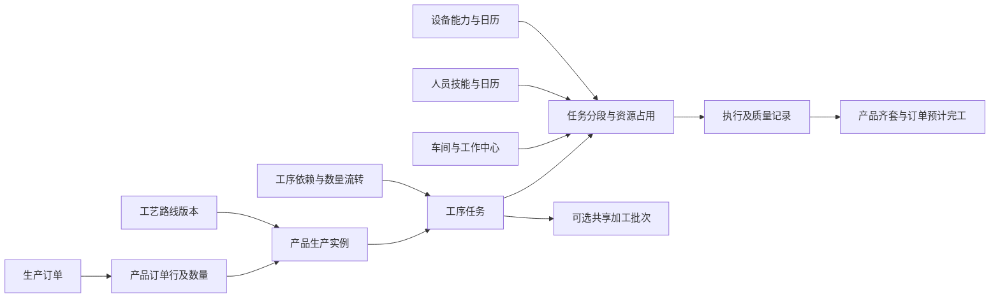

# 生产排程与车间调度系统产品需求文档

> 文档类型：产品 PRD；编号：PRD-PS-002；版本：2.2.0 Draft  
> 创建 / 更新：2026-09-11；owner：用户；调研与编写：Codex  
> 规范基线：用户级协作入口 2026.09-r1、规范索引 2026.09-r2 及产品、Feature、流程、文档规范；仓库文档组织规范 2026.09-r1  
> 风险与阶段：L2 产品规格保持 Draft；FEAT-APS-001 已获批进入阶段 7 开发 / InProgress  
> 授权依据：用户要求先调研再编写 PRD，随后明确授权自行决定细节、完成 PRD 与完整 HTML 原型，最终面向生产级产品；不涉及真实业务发布  
> 内容状态：用户口述为明确需求输入；本文细化规则、优先级及样例为待评审提案，不代替用户批准  
> 数据边界决定：2026-09-12 用户明确删除工厂表、技能只保留一张，随后批准以 29 表业务雏形和十阶段计划进入实现；多 Worker 可靠接管与 ERP/MES 可靠外发转为后续范围。该批准不等于 migration、整份 PRD 或生产实现已验收  
> 上游：[原始 Word V1.0](../原始需求/生产排产系统原始需求-第一版.docx)、[首轮市场调研](../调研/市场与竞品调研.md)、[本轮流程与资源专项调研](../调研/工序与资源调研.md)、[APS 排程引擎技术调研](../调研/APS排程引擎技术调研.md)  
> 原型：[生产排程 V2](../../../../prototype/production-workbench-v2/index.html)；覆盖与限制见 [验证记录](../../../../prototype/production-workbench-v2/verification.md)；[旧 V1](../../../../prototype/business-suite-v1/01-production-scheduling/index.html) 保留对照
> 技术设计：[APS 排程引擎需求与技术设计](../架构/APS排程引擎需求与技术设计.md)、[甘特组件选型决定](../决策/甘特图组件选型决策.md)、[29 表业务雏形数据库设计](../架构/数据库设计.md)、[MySQL 基线 DDL 草案](../架构/生产排程数据库基线草案.sql)；设计和 DDL 均不表示已接入组件、执行建库或完成迁移

## 1. 本版要解决的问题

把一个包含单个或多个产品的生产订单，展开为存在先后、并行、转序和合批关系的工序任务；给每道任务确定车间、工作中心、具体执行人员、必要设备及开始结束时间。在人员与设备均不超载、工艺与物料条件成立的前提下，回答：**谁在什么时候、用什么资源、做哪道工序、能完成多少，整个订单预计什么时候完成。**

产品定位为“有限产能排程 + 车间调度与反馈”。使用者应能从订单逐层追到产品、工序、人员和设备，也能从任意人员或设备反查正在占用它的任务与订单。

本版相对原始需求和原型有四项实质细化：

1. **人员级有限排程是核心要求。** 不能用只排设备、最后填写负责人代替；人员技能、班次、请假和并发占用都参与计算。
2. **跨产品关系必须进入任务网络。** 产品清单的显示顺序不代表生产顺序，BOM 也不能表达全部工序关系。
3. **“做完一半”及“一起加工”有明确业务语义。** 分开处理数量门槛、连续转移批量、纯时序约束、共享加工批次。
4. **交期和报表是主交付。** 设备、人员、车间工序三个甘特视角，车间每日生产表与人力累计产能表均纳入核心范围。

首轮调研曾建议先设备、后个人。本次用户已明确强调从产品落实到人，本版据此调整优先级；旧稿保留作为历史输入，不继续沿用其中将人员级排程列为 P1 的建议。

## 2. 调研结论如何进入产品

详细厂商证据、版本和限制在专项调研中维护，本节只记录取舍。

| 市场做法与证据入口 | 对本项目的决定 | 不直接照搬的部分 |
| --- | --- | --- |
| Asprova 的工序重叠、转移批量和同炉资源；SAP 的最小转移数量及集合订单重叠 | 工序关系单独建模；数量释放与共享批次分开 | 不把某一软件的术语或关系类型当成通用行业全集 |
| D365 的人力资源类型、能力与主次工序预约；Siemens 的主副资源跨班次约束 | 设备与人同时参与可行性，按准备、运行、卸料阶段占用 | 不假设人员整段陪机，也不默认一个人可无限看机 |
| Odoo 的工作中心、依赖和现场报工；金蝶的工序计划、设备有限派工 | 用工序任务连接排程与现场；保留简单的派工操作 | 派到员工、记录工时不能算作人员有限排程已满足 |
| MRPeasy 的部门每日最大用工需求 | 人力表同时展示需用工时与时段峰值人数 | 日总工时充足不代表每个时段都有足够合格人员 |
| 专业 APS 的冻结、资源负荷和 What-if | 计划草稿、影响比较、正式发布分开，锁定有明确维度 | 不允许自动重排覆盖已执行事实或绕过硬约束 |

以上为基于官方公开资料的产品分析，不代表已购买或实测任何竞品。公开资料未证明的复杂场景，使用本文的统一验收样例补测，不以厂商“智能排程”宣传代替。

## 3. 用户、职责与使用边界

| 角色 | 主要问题 | 核心动作与范围 |
| --- | --- | --- |
| 生产负责人 | 哪些订单会延期，哪个车间缺人或缺设备 | 查看跨车间交期、瓶颈与方案影响，决定生产优先级 |
| 计划员 | 怎样生成可执行计划，插单会影响谁 | 订单展开、模拟、人工调整、锁定、校验和发布 |
| 工艺工程师 | 产品怎么做，哪些工序能并行或合批 | 维护工艺版本、依赖、标准工时、技能与批次兼容条件 |
| 车间主管 / 班组长 | 今天每个人做什么，异常怎么调 | 查看本车间日表，提议或执行授权范围内派工，处理交接与异常 |
| 操作人员 | 我下一道任务是什么，能否开工 | 查看个人任务、接收、开停完工、数量报工与异常反馈 |
| 资源 / 人事维护人员 | 哪些人能做、何时能上班 | 维护技能、班次、请假、临时借调和可用性；不要求维护工资 |
| 质量人员 | 哪些产出可以转给下道工序 | 检验、放行、隔离、不良处置和返工放行 |

初始提案为单生产站点部署、多车间、离散件或可计量批量制造。站点是部署与配置边界，不在 P0 业务表中建立工厂实体。行业、订单规模、设备类型尚未由用户确定；本版采用机加工与批次处理组合样例验证通用语义，不能据此认定客户所属行业。

## 4. 目标、范围与成功标准

### 4.1 业务目标

- 每个已发布的人工或人机协同任务都能查到具体执行人员及其占用时段；纯自动运行任务显示责任人和需要人员介入的阶段。
- 每个订单可查到各产品当前状态、剩余工序、预计完工、瓶颈和延期原因；信息不足时明确显示“无法可靠估算”。
- 自动排程与人工调整使用同一套硬约束，不把冲突隐藏在甘特图之外。
- 现场反馈能够改变剩余工作量和风险判断，同时保留原计划作为对比基线。
- 日计划和累计产能表能够追溯到任务、资源日历、工时版本和实际记录。

### 4.2 核心与扩展范围

| 优先级 | 范围 |
| --- | --- |
| P0，核心闭环必须具备 | 多产品订单及产品数量；版本化工艺网络；跨产品前置、并行汇合、数量释放和转移批量；受兼容规则约束的人工合批及统一排程；人机阶段占用、具体人员技能班次、设备能力；任务拆分与分段；有限排程、调整、锁定、影响校验、版本发布；三类甘特；现场数量与质量反馈；订单交期；车间每日表、人力累计产能表；数据来源与错误处理 |
| P1，核心稳定后扩展 | 执行 `SAME_START` / `SAME_END` 同步组、重量/体积/挂点等多维混装、具名人机组合专属速率、自动搜索最佳合批组合、复杂多机看护模型、顺序换型矩阵优化、更多行业约束、完整多层 BOM 自动展开与外协协同、远期技能池粗排、实时多系统接口、多 Worker 可靠接管、ERP/MES 可靠外发与回执、自动建议加班与多方案排序 |
| P2，后续探索 | 跨工厂调拨优化、预测性维护联动、自动学习标准工时、AI 工艺建议与自然语言调度 |

P0 的基础物料/半成品可用量、工装约束入口和固定准备时间不能以“高级功能未做”为由省略：某任务实际依赖的资源必须纳入，未支持的必要约束应阻止将该订单标记为可执行。P1 的完整 BOM、换型优化指自动化深度，P0 可导入展开的组件任务及经工艺确认的准备时间。

本轮不包含 ERP 财务与采购全流程、HR 薪资、设备维修工单系统、完整 QMS、通用任意脚本规则编辑器，也不承诺数学全局最优或指定比例的交期改善。

### 4.3 如何判断产品有效

先用历史订单和现场数据建立人工计划基线，再比较排计划耗时、需要手工修复的任务数、可执行任务比例、延期和计划扰动。收益目标需由用户确认，不能引用竞品案例百分比作为本项目承诺。P0 正确性以第 15 节场景为准，性能评估见第 16 节。

## 5. 核心对象与关系

| 对象 | 产品定义及必要信息 |
| --- | --- |
| 生产订单 | 需求容器，订单号、来源、优先级、承诺日期、状态；可含多个产品行 |
| 产品订单行 | 产品/版本、需求数量、计量单位、分批交付要求；可有独立交期，不以订单总量代替 |
| 产品生产实例 | 某订单行的实际生产对象和批次，引用工艺版本；同产品不同订单有独立实例 |
| BOM 组件关系 | 表达消耗什么、数量比例；与多个独立交付产品的清单分开；有消耗关系才扣减组件 |
| 工序定义 | 可复用工艺知识，如钻孔、检验；由工艺人员维护，不属于某个具体操作工 |
| 工艺路线版本 | 指定产品版本怎样做，由工序节点及依赖组成；变更不得悄悄影响已展开订单 |
| 工序任务 | 某生产实例下某道工序的执行需求，稳定 ID、数量、资源要求、依赖、计划/实际状态 |
| 任务分段 | 工序任务在具体时间窗中的准备、加工、卸料或跨班次执行片段；不是新产品需求 |
| 共享加工批次 | 多个任务的部分或全部数量在同一设备同一周期加工；保留成员及数量归属 |
| 工作中心 | 排程能力单元，归属车间，可包含设备、工位和资源池；可以是纯人工中心 |
| 资源需求与分配 | 需要什么技能/能力、几人/几台、什么阶段；分配结果是具体人员/设备和时段 |
| 依赖关系 | 来源/目标任务、关系语义、门槛、数量比例、等待/转运时间、质量释放条件 |
| 执行记录 | 实际人员设备、起止、合格/不良/报废/转出数量、暂停与原因、批次追溯 |
| 计划版本 | 输入快照、参数、任务分配、依赖、数据时间、正式基线与变更说明 |

一个工序任务可以拆成多个执行段或转移批；多个任务也可加入同一加工批次。任务是业务追溯单位，资源占用段是时间校验单位，不能要求所有任务永远只有一条不可分割的甘特条。

## 6. 工序网络与数量规则

### 6.1 依赖类型

| 编号 | 场景 | 用户可设置的规则 | 调度及执行结果 |
| --- | --- | --- | --- |
| BR-01 | A 做完才能做 B | A 指定工序或整个产品完成，等待/搬运时间，放行条件 | B 开始不得早于前置释放时间；整产品前置展开为必要末端工序均完成 |
| BR-02 | 一个产品内分支并行、最后汇合 | 前置任务集合，全部满足或工艺批准的分支选择 | 并行分支独立占资源；汇合必须满足全部必需输入 |
| BR-03 | 产品 A 的某工序完成 50 件后产品 B 才能开工 | 指定节点、数量门槛或比例换算、是否消耗 A 产出 | 若只是时序门槛，不扣 A 数量；若为组件投入，按用量扣减可用量 |
| BR-04 | 上道做一部分，下道边做边接收 | 转移批量、最小首批量、尾批、转运与质检 | 各批按实际释放时间启动；下道各时点不得消耗尚未释放的产出 |
| BR-05 | 工艺要求两个独立任务同时开始或结束 | 同起/同止及允许偏差，独立资源需求 | 当前业务雏形识别为扩展约束并阻止发布，返回 `UNSUPPORTED_SYNC_RULE`；不能因共用工序名称自行推断，也不能伪装成共享批。后续扩展版再显式求解 |
| BR-06 | 两个产品必须一起加工 | 共享批次兼容条件、成员数量、容量、固定周期或工艺确认的时长 | 各成员共享实际加工周期，资源按批占用一次；产出按成员回记 |
| BR-07 | 同工艺连续加工以减少换型 | 产品族/准备条件，连续加工偏好 | 每个任务仍独立占用加工时间，与 BR-06 分开 |

**“完成一半”的默认定义：** 解释为指定前置工序的可转序合格数量达到该工序冻结计划量的 50%，不是已耗时间 50%，也不是产品所有工序平均完成度。整数单位向上取整；数量、单位与分母在建依赖时显示。若某工艺指“完成前三道工序”，使用节点里程碑。该规则采用依据见 D-01。

### 6.2 数量释放与守恒

- BR-08：计划态依据工艺产率、转移批量及资源计划预测释放；执行态以实报和必要质量放行为准。时间到了但没报合格产出，不能自动视为可转序。
- BR-09：有物料消耗的每条依赖保留需求比例与分配量。任一时点 `累计下游投入 × 单位用量 ≤ 已释放且分配给该下游的上游数量`；共享上游供给不可被不同订单重复使用。
- BR-10：首批门槛不是一次满足后无限供料。上道 20 件/小时、下道 40 件/小时，即使首批 20 件已可用，也必须分批或等待后续投入；不允许把全单后序按 40 件/小时无间断排完。
- BR-11：已生产、待检、合格可转、已预留、已转出、报废分开。订单变更数量不能静默重算已发生的门槛和批次分配，须重新评估受影响未开工部分。
- BR-12：技术等待说明按自然时间还是工作时间计算；转运如需要有限人员/运输设备，则形成占用任务，不能仅加一段时间后当作资源免费可用。

### 6.3 拆批、合批和返工

- BR-13：拆批需满足最小/最大批量、尾批规则、工艺可拆性及质量追溯；子段数量之和等于任务分配量。同一道工序分给不同资源时分别计算能力和准备占用，不能只把原工时平均分开。
- BR-14：共享批次需要校验工艺版本、配方/温度/颜色/材质兼容、交叉污染限制、质量规则、总容量和成员最早可用时间。工序同名不足以证明可合批。
- BR-15：批次开始后不能随意增删成员；未开工的拆合批产生新草稿，并重算成员交期、准备时间和数量归属。一个任务数量不能同时加入两个批次而超额分配。
- BR-16：当前业务雏形的一个资源或共享批只采用一个已确认容量单位，成员必须使用同一单位后才能合计；重量、体积、挂点数等多个维度同时约束及单位换算属于 P1 扩展。固定周期批次的时长按规则取值，不能把各成员时长相加或未经确认取最大值。
- BR-17：返工生成带来源的新任务与质量处置分支，不给已发布正常工艺图添加回边形成死循环；返工合格回归指定节点，新增劳动负荷、剩余数量和交期均更新。
- BR-18：自依赖、循环、丢失前置、不同单位无换算、门槛大于可产数量和无终止节点均阻止排程；返回具体对象与修正责任人。

## 7. 从工艺任务分配到车间、人员和设备

### 7.1 候选资源与归属

默认层级为单站点部署边界 → 车间 → 工作中心 → 具体设备/工位；站点和时区由部署配置承担，不恢复工厂表。人员有归属车间、班组和技能，可在授权时段借调到其他中心。工作中心可以没有设备，不能为纯人工工序虚构机器。

BR-19：工艺定义“谁能做”，排程确定“这次由谁做”。先按工艺许可筛选候选中心、资源能力、技能等级与有效期，再检查日历及已占用情况；空闲但不合格的资源必须淘汰。需要几名不同角色人员时，每个席位分别满足技能，禁止同一个人占两个必须由不同人担任的席位。

BR-20：人员同时具备多个技能，只代表可选择的任务更多，不会产生多份可用工时。跨车间借调计入一次总容量，并在归属与执行车间两个维度分别展示，汇总按员工去重。

### 7.2 按阶段占用

| 工艺模式 | 设备占用 | 人员占用 | 责任人 |
| --- | --- | --- | --- |
| 纯人工 | 无，或占用有限工位/工具 | 准备和加工全程，按需要人数 | 执行人员 / 组长 |
| 人机全程协同 | 准备、运行、必要卸料全程 | 同期指定人员 | 操作人员 |
| 自动运行、人工装卸 | 从装载到允许释放设备的全部时段 | 装载、准备、卸料等指定段 | 指定负责人员，自动运行段不重复消耗其整段工时 |
| 自然等待 / 固化 | 按工艺决定是否占模具、炉位或场地 | 无必要动作时不占人 | 过程负责人员 |
| 多人协作 | 按工艺需求 | 每个角色的必要同步时段 | 主操作人及协作人 |

BR-21：责任人字段不自动产生资源占用，也不意味着任务可无人执行。人机协同时按每个阶段所需资源的可用时间交集找窗口。整机运行需要设备持续可用，但可不要求人员运行全程在岗。

BR-22：一个人默认同一时刻只有一份有限劳动容量。多机看护只有在工艺明确允许且给出看护占用、并发上限和必须到场动作后启用；P0 至少支持人工装卸分段，复杂动态巡检放 P1。装卸冲突仍须严格阻断。

### 7.3 日历、跨班次和中断

- BR-23：P0 以 `aps_resource_availability` 中已经物化的资源绝对可用/不可用窗口为日历事实，人工维护、授权导入或后续适配器必须把班次、休息、请假、培训、维修、已批加班和站点关闭影响落实到具体资源窗口；加班是显式例外，不能因排不上自动开放。循环班制模板与 HR 实时同步属于后续范围。
- BR-24：可中断工序可跨班次分段；记录停机时设备/在制品是否保留占用、恢复是否重做准备。不可中断工序必须找到连续合法窗口，不能把 4 小时工作拆到上午 2 小时、下午 2 小时冒充可行。
- BR-25：跨班次换人须满足技能及交接要求，并记录各段执行人员；“原操作人下班”不代表设备自动停机，具体由工艺模式决定。
- BR-26：工作中心如果只是设备汇总层，不再次扣减一份相同产能；若中心另有限制，例如供电上限、工位数或同时最多两台运行，则作为独立约束明确配置。

## 8. 工时、产能与排程规则

### 8.1 工时必须可复算

当前业务雏形在“工序定义 + 工艺阶段”上维护默认固定秒数或默认单件秒数，路线版本负责冻结采用的工艺；任务展开和排程版本再冻结本次计算值与依据。候选资源必须满足这套默认标准的资格前提，较慢资源应拆成另一工序定义或资源类别，不能在求解时暗加无来源系数。具名人员、设备组合的专属速率和生效记录属于 P1 扩展。

| 模式 | 基础计算提案 | 使用边界 |
| --- | --- | --- |
| 按件加工 | `加工时长 = 固定准备秒数 + 待加工数量 × 工艺阶段默认单件秒数` | 默认值来自已批准工序参数版本；人与机器是资格与占用约束，不把两者产能相加，也不临时推导具名组合倍率 |
| 按标准单件工时 | `加工时长 = 数量 × 单件标准分钟 ÷ 60` | 效率修正只采用一次，明确是否已含在标准里 |
| 固定周期批处理 | `批次数 = 向上取整(数量 ÷ 有效批容量)`；每批按固定周期与装卸计算 | 跨产品混批须先通过兼容与容量校验；准备可按工艺规定跨连续批共用 |
| 多人协作 | 按工艺阶段规定的席位数预约合格人员，仍采用该阶段默认时长 | 两人不是默认一人两倍；班组规模专属产能表属于 P1 扩展 |
| 实际剩余工作 | 按尚需加工的原流程数量及独立返工任务计算 | 不能以“已耗计划工时”推定合格完成数量；避免返工重复计剩余量 |

BR-27：准备、加工、必要卸料、等待、运输分别记录。只有实际占用资源的部分进入对应资源负荷；总历时可能跨休息和等待，不能直接当作人工工时。

示例：李工上午可用 4 小时，准备 0.5 小时；已批准工序阶段默认速率为 8 件/小时，则该连续窗口最多加工 `向下取整((4−0.5)×8)=28 件`。只有李工和设备均满足资格且完整可用时，这 28 件才是可行上限。缺少默认工时或资格数据时标为待维护，不能默认为零准备、无限产能或自行套用具名组合倍率。

### 8.2 排程输入与输出

输入为订单及工艺任务网络、已释放/预计供给、资源候选、人员技能日历、设备能力、准备与批规则、正式计划及实际进度、锁定、时间范围和目标顺序。

输出为任务与各阶段的具体资源、数量和起止，合批/转移批归属，订单预计完工，资源负荷、未排原因、约束风险及相对基线的变更。无可行窗口的任务保留在未排池，不生成虚假的准时交期。

### 8.3 自动排程与优先级

- BR-28：默认有限产能。正排回答当前条件下预计何时完成；倒排尝试满足交期，倒排结果早于可开工时间或当前时刻时标记不可行，再给出可行的正排结果或未排原因。
- BR-29：硬约束先成立，再按提案顺序优化：重要订单交期 → 已发布计划稳定性 → 减少等待/换型 → 人员及设备负荷。目标顺序和权重由负责人确认，不承诺所有指标同时最优。
- BR-30：需要同时考虑所有必需资源和工序依赖。界面可以分步展示候选选择，但最终不能“先固定机器计划，再找不到人也发布”。
- BR-31：采用既有正式计划作为占用，已开工/已完成的实际部分固定；对部分完成任务只调整剩余可变部分。求解期间发生请假、报工或订单变更时，结果标记基线过期，发布前重新校验。
- BR-32：暂停/取消计算保留正式计划；无解、输入错误、计算超时分别说明。超时但存在已校验可行候选时可供审阅，必须标记搜索状态及未排任务，不宣称最优。

## 9. 人工调整、锁定、版本与发布

### 9.1 调整路径

计划员在任一甘特视角拖动或编辑任务 → 选择调整范围 → 系统试算 → 展示资源/依赖冲突和上下游受影响列表 → 保存候选或取消 → 全计划校验 → 比较并发布。

BR-33：调整可针对开始时间、人员、设备、允许中心、任务顺序、转移批和未开工批次成员。系统按依赖及共享资源计算影响闭包，可能跨车间和订单；“局部重排”不能只移动当前可见条。

BR-34：无权限、技能不符、超并发、不可用班次、数量不足和锁定冲突时不应用该次调整。已有数据变化导致旧草稿冲突时可以保留草稿并显示问题，但不得发布；不要求用户丢失整份讨论方案。

### 9.2 锁定语义

| 锁定 | 锁什么 | 其他维度 |
| --- | --- | --- |
| 时间锁 | 指定执行段起止或明确允许偏差 | 可在工艺允许且重新校验后替换资源 |
| 资源锁 | 指定人员、设备或中心 | 时间可在合法窗口调整 |
| 全锁 | 数量、起止及具体资源 | 仅解锁或受控异常处置后修改未执行部分 |
| 冻结窗口 | 配置时间范围内计划限制变更 | 需有明确例外动作和影响说明，不能忽略故障等真实不可用性 |
| 已执行事实 | 实际发生的数量、人员、设备与时段 | 不通过解锁改写；错误报工走冲正和审计 |

BR-35：锁定不是免检。锁定任务遇维修或请假，应显示“锁定与现实冲突”，阻止新版本作为可执行计划发布。系统不能静默解锁，也不能假装设备仍可用。

### 9.3 版本生命周期

草稿 → 校验通过候选 → 发布中 → 正式版本；候选可退回修改，旧正式版本在新版本生效后保留。发布失败独立记录，不能直接标正式。

BR-36：每次发布展示基线版本、受影响订单、任务和接收范围、完工变化、人员/设备变更及未解决风险。发布确认时再检查基线版本、实际进度和资源日历，防止使用过期方案覆盖最新现场状态。

BR-37：本系统现场页面以一个正式版本一致生效，P0 的“发布完成”仅指系统内唯一正式版本原子切换。ERP/MES 可靠外发、按接收方显示发送/确认/失败、稳定消息标识、重试和补偿属于 P1，必须在接收方、ACK 和责任明确后另行设计；P0 页面不得显示“已外发”或“全部下达完成”。

BR-38：恢复旧方案是以当前实际状态生成一个新候选并重新校验，不能回滚已经发生的生产。未开工取消须释放未消耗预留；已开工订单取消需保留在制品和后续处置。

## 10. 执行反馈与订单闭环

任务状态：未就绪 → 可派工 → 已派工 / 已接收 → 进行中 ↔ 暂停 → 待检 / 待确认 → 已完成；取消、质量隔离和异常作为有明确原因的状态或标记。就绪表示工艺、数量与资源条件已满足，不能只看计划开始时间。

- BR-39：开工核对当前正式版本、人员技能、设备状态、实际前置释放及资源占用；若现场换人换机，走有权限的重新分配和校验。断网或同步失败的记录显示待确认，不当作已同步事实。
- BR-40：支持部分报工，记录本次加工、合格、不良、报废和转序数量，数量不能为负或超过剩余可报范围；报工更正通过冲正或更正记录保留前后值。
- BR-41：加工完成与质量放行分开。待检数量不得自动增加下工序可用量；无单独质检要求的工序由授权报工即放行，规则来源要明确。
- BR-42：暂停说明原因、资源是否仍被占用、预计恢复时间；故障和缺勤触发影响评估，正式计划不自动全局改写。已确认恢复后重算剩余段。
- BR-43：设备工时和人工工时从各自占用或报工段汇总。多人一起加工 2 小时、设备运行 2 小时，应为 4 人时与 2 机时；共享批次只计算一次设备占用，各成员分摊用于分析并保留方法。
- BR-44：订单完成要求所有必需产品行的需求合格数量达到、末端必要工序和质量放行完成、没有阻断的返工/隔离。单个产品完成不等于多产品订单完成；生产完成、入库完成和客户交付分别展示。

## 11. 页面与主流程

### 11.1 页面清单

| 页面 | 主要内容与操作 | 必须可追溯到 |
| --- | --- | --- |
| 订单中心 / 详情 | 多产品行、数量交期、展开任务、进度、预计完成、延期原因 | 产品实例、工艺版本、缺项及末端任务 |
| 工艺路线 | 节点、分支汇合、跨产品引用模板、门槛和批次规则；实例级补充依赖 | 工艺确认人、版本和受影响订单 |
| 资源与人员 | 中心能力、设备日历、人员技能/班次、借调、不可用时段 | 具体资源和变更来源 |
| 数据就绪中心 | 缺工艺、工时、能力、技能、物料和循环关系 | 问题对象、责任人、修正入口 |
| 排程工作台 | 时间范围、未排池、甘特、任务详情、调整、锁定、校验 | 同一版本的工序和占用段 |
| 模拟 / 版本比较 | 插单、请假、维修场景，差异和发布 | 原因、基线、任务变更与接收状态 |
| 现场任务 | 今日个人/班组任务、工艺要求、开停完工、数量、质量和异常 | 计划版本、实际人员设备、流转批 |
| 车间每日生产表 | 当日工序、人员设备、计划量、实际量、差异和结转 | 每条执行段及当时正式版本 |
| 人力累计产能 | 可用/需用/占用/剩余、技能缺口、时段峰值、跨日累计 | 去重员工、日历和具体任务 |
| 订单交期 / 负荷分析 | 预计交期、风险订单、约束资源、产能缺口 | 形成完工日期的依赖与资源链 |

### 11.2 三类甘特图

三个视角共享同一份任务和版本，不各自生成独立计划。时间轴可切小时、班次、日，支持订单/产品/工序/车间/状态筛选。

| 视角 | 纵轴与条形语义 | 关键操作与注意点 |
| --- | --- | --- |
| 设备甘特 | 车间 → 中心 → 具体设备；条为真实设备占用，准备/运行/卸料可区分 | 换兼容设备、查维修、共享批次展开成员；自动运行显示其完整设备占用 |
| 人员甘特 | 车间 / 班组 → 员工；条为该员工实际需要到场的段 | 换人、借调、技能和班次提示；不得把机器无人运行段画为人工占用 |
| 车间工序甘特 | 车间 → 工作中心 → 工序类型，可展开具体任务和资源 | 看各道工序队列与衔接；汇总行允许并行多条，不能画成车间只容一项任务 |

联动选择一条任务时，其他视角高亮相同任务/批次、前后置、人员设备与订单。条上的重叠是否冲突由底层资源容量判断，不能只看视觉相交。

### 11.3 关键异常与恢复

| 场景 | 页面反馈 | 恢复方式 |
| --- | --- | --- |
| 无订单 / 资源未配置 | 明确空态与创建/导入入口 | 完成必要资料后重新检查 |
| 导入错误 / 外部源失败 | 显示行号、字段、来源时间；保留已有有效版本 | 修正后按同一来源标识更新，避免重复订单 |
| 无法排程 | 分开显示无工艺、缺资源、缺数量、无时窗和求解未完成 | 定位数据或选择有权限的模拟方案 |
| 调整违反硬约束 | 标出冲突任务和具体条件，不应用本次变更 | 撤销当前尝试或修改合法维度 |
| 计划已过期 | 显示差异来源和发生时间 | 刷新并对受影响范围重算 |
| 重复点击发布 / 报工 | 显示处理中或原处理结果 | 同一次动作不得产生重复记录 |
| 无权限 / 已被另一人修改 | 明确拒绝原因，保留未提交编辑可供比对 | 申请业务权限或加载新版本后重做合法变更 |

## 12. 报表与指标口径

所有报表包含部署站点标识、业务日期/时区、时间范围、筛选条件、计划版本、实际数据截止时间和生成时间。站点标识和 IANA 时区来自部署配置，不是业务表外键。报表可下钻并导出明细；导出需沿用页面权限和同一统计口径。示例默认 Asia/Shanghai，正式时区待部署确认。

### 12.1 工作中心 / 车间每日生产表（P0）

按车间 → 工作中心 → 工序 → 任务/产品分组，支持上午/下午、班次和整日。

| 字段组 | 必要字段 |
| --- | --- |
| 任务身份 | 日期、班次、订单/产品行、产品版本、任务/工序、批次及成员归属 |
| 分配 | 车间、中心、设备、执行人员、责任人、计划开始结束 |
| 数量 | 期初在制、当日计划投入/计划合格产出、实际投入、实际合格、不良/报废、转出、期末在制 |
| 工作量 | 计划人工时/机时、实际人工时/机时、等待/停机时长 |
| 风险与结果 | 当日计划达成、剩余量、延期、缺料/缺人/故障原因、次日结转 |

BR-45：跨日任务按实际计划分段和产出模型分配当日工作量；固定周期批次未完成前可有当日机时、没有可放行产出。不能每天重复记录整单数量。不同产品单位分行展示，不把“100 件 + 20 套”直接汇成 120。

BR-46：当日达成率使用冻结的日计划基线，不能下午重排减少计划量后把达成率抬高。原计划与最新计划同时保留。任务完成率、数量达成率和工时达成率分开命名。

### 12.2 人力资源累计产能表（P0）

需要两种视图：按员工看真实可用与分配；按技能/中心看需求与缺口。时间粒度至少上午/下午、日，累计区间由用户选择。

| 指标 | 定义 |
| --- | --- |
| 日历可用工时 | 对员工所有有效出勤窗口求并集，扣请假/培训/休息；单站点范围内一人只计一次 |
| 已排占用工时 | 正式计划中该员工必须参与的占用段；准备、加工、卸料分别可查 |
| 待排需用工时 | 未分配任务对技能角色的剩余需求，不冒充已占用 |
| 剩余可用工时 | 日历可用减已排占用；按员工及具体时段可查，不保证足以放入任意连续任务 |
| 累计可用 / 需用 / 缺口 | 在选定窗口累加对应工时；缺口同时显示时段及技能条件 |
| 时段峰值需用人数 | 同一时段所需席位数；与当班合格人数对比，日工时富余也可能出现峰值缺口 |
| 标准工时产能 | 若需要效率修正，按“可用工时 × 对指定工艺已确认效率”展示；与钟表工时分列 |
| 可完成数量估算 | 仅按指定产品/工艺阶段的已批准默认工时、资源资格和准备假设换算，不提供跨产品无条件合计件数 |

BR-47：不能把同一员工在焊接和检验两个技能池各 8 小时累加成 16 小时总产能。技能视图可展示“分别可承担的潜力”，须明确不可相加；正式分配视图则按真实时间占用去重。

BR-48：剩余工时是时段集合。上午富余 2 小时不能弥补下午必须同时到岗的两人缺口；当天总量、时段峰值、连续窗口三个检查均需保留。

累计表样例（相同技能、效率均 100%，单位为人时）：

| 日期 | 当日可用 | 当日需用 | 累计可用 | 累计需用 | 累计余额 | 解释 |
| --- | ---: | ---: | ---: | ---: | ---: | --- |
| 9 月 14 日 | 16 | 20 | 16 | 20 | -4 | 4 人时无法按该日完成 |
| 9 月 15 日 | 12 | 8 | 28 | 28 | 0 | 次日可补总量，但前日交期/时段缺口仍然存在 |

### 12.3 订单完成与管理指标

| 指标 | 口径与边界 |
| --- | --- |
| 产品行预计完成 | 满足该行交付量的最后必要末端产出及质量放行时间；不是所有节点工时相加 |
| 订单预计生产完成 | 所有必需产品行预计完成的最大值；有无法可靠排出的必需任务时标未知，并列最早已知下界 |
| 生产延期 | `max(0, 预计生产完成 − 生产承诺时间)`；默认自然时间，班次延迟另列 |
| 预计可交付 | 生产完成加已配置的入库/包装/物流必要过程；无数据时只承诺生产完成，不混称客户到货 |
| 订单按期生产达成率 | 到期订单中在原承诺时间前满足生产完成条件的比例；取消和承诺变更口径须保留版本 |
| 数量进度 | 按产品行显示末端合格数量 / 需求量；工序进度另列，不能对多工序数量重复求和 |
| 工作量进度 | 以冻结标准工作量加权的已完成工序工作量比例，最多 100%；与交付量进度分开，返工新增负荷单列 |
| 资源计划负荷率 | 合法已排占用 / 同期间可用容量；未排需求另列，0 分母显示无可用能力，不能显示 0% 掩盖风险 |
| 计划变更量 | 相对正式基线，变更任务数、人员/设备变化及起止移动；可下钻订单影响 |
| 瓶颈与预计交期依据 | 显示限制任务的前置、供给、具体资源及日历窗口；资源冲突形成的等待同样进入原因链 |

## 13. 一个完整订单的可复算样例

这是产品规则样例，尚未在真实系统运行。所有资源初始无其他任务，人员技能合格，物料已到位；日期为 2026-09-14 / 15，工作时间 08:00–12:00、13:00–17:00。

订单 O-100 包含独立交付产品 A、B 各 100 件。A10 加工 25 件/小时，使用 M1 和张工；B10 加工 50 件/小时，使用 M2 和李工。B10 必须等 A10 合格 50 件方可开始，这是业务时序门槛，B 不消耗 A。A、B 的第二道均为兼容的批处理，合批 200 件；炉 F1 容量 200 件，装载 0.5 小时、自动运行 2 小时、卸载 0.5 小时。王工负责装卸；运行期间不需持续看护。最后检验由赵工按 100 件/小时完成，允许分 A、B 两批检验，无额外转运时间。

| 时间 | 任务与产出 | 资源占用 | 依赖结果 |
| --- | --- | --- | --- |
| 9/14 08:00–10:00 | A10 前 50 件完成并当即放行 | M1、张工 2 小时 | 10:00 释放 B10 开工门槛 |
| 9/14 10:00–12:00 | A10 后 50 件，B10 100 件 | M1+张工、M2+李工各 2 小时 | 12:00 两产品各 100 件可进入同批 |
| 9/14 13:00–13:30 | 批 H1 装载 A100+B100 | F1、王工 0.5 小时 | 午休期间不安排人工装载 |
| 9/14 13:30–15:30 | H1 自动加工 | F1 2 小时，王工不占用 | 此时无可转序批产出 |
| 9/14 15:30–16:00 | H1 卸载并放行 | F1、王工 0.5 小时 | A、B 各 100 件可检验 |
| 9/14 16:00–17:00 | A 检验 100 件 | 赵工 1 小时 | A 行生产完成 |
| 9/15 08:00–09:00 | B 检验 100 件 | 赵工 1 小时 | 订单所有产品生产完成 |

预期：订单预计生产完成为 **9/15 09:00**。F1 占用 3 机时，王工占用 1 人时，不能算为 3 人时；批 H1 在设备甘特只占用一次，成员数量各自回记。9/14 赵工日表合格产出 100 件，9/15 为另 100 件；不能两个日期都登记 200 件。

若生产承诺为 9/14 17:00，预计延期为 16 个自然小时；按上述班次计算所需额外生产时间为 1 小时，两者分别展示。提出赵工加班方案可推演 9/14 18:00 完成，但未经批准不得把加班自动纳入正式可用时间。

## 14. 需求与验收追溯

“用户输入”指 2026-09-11 本次口述；“专项调研”指上游链接中的需求映射与来源台账。P0 能力在验收前均需实跑，本文中的预期不表示已通过。

| REQ | 核心需求 | 来源 | 优先级 | 对应验收 |
| --- | --- | --- | --- | --- |
| REQ-01 | 多产品订单、独立工艺版本及可追溯展开 | 用户输入、原始 PRD | P0 | AC-01、AC-02 |
| REQ-02 | 跨产品依赖、并行汇合、数量门槛与连续转移批 | 用户输入、SAP/Asprova/金蝶研究 | P0 | AC-03、AC-04、AC-05 |
| REQ-03 | 受约束的拆批、共享加工批次及独立同步扩展边界识别 | 用户输入、Asprova 研究 | P0 | AC-06、AC-07 |
| REQ-04 | 具体人员技能、班次、协作与人机分阶段容量 | 用户输入、D365/Siemens 研究 | P0 | AC-08、AC-09、AC-10、AC-11 |
| REQ-05 | 有限排程、人工调整、锁定、受控重排与发布 | 用户输入、专业 APS 研究 | P0 | AC-12、AC-13、AC-14、AC-15、AC-23 |
| REQ-06 | 三类甘特及影响联动 | 用户输入、资源可视化研究 | P0 | AC-16 |
| REQ-07 | 数量/质量报工、异常、返工及订单闭环 | 用户输入、原始 PRD、现场执行研究 | P0 | AC-17、AC-18、AC-19 |
| REQ-08 | 车间每日生产表与人力累计产能表 | 用户输入、MRPeasy/Asprova 负荷研究 | P0 | AC-20、AC-21 |
| REQ-09 | 订单预计完成、交期风险及可解释指标 | 用户输入、原始 PRD | P0 | AC-19、AC-22 |
| REQ-10 | 数据来源、权限、重复/失败恢复和版本追溯 | 原始 PRD、现场闭环可靠性需求 | P0 | AC-02、AC-15、AC-17、AC-24 |

## 15. 验收场景

以下均为 **待执行验收标准**。现有 HTML 原型的通过记录不能替代本版验收。

| AC | 输入与动作 | 必须观察到的结果 |
| --- | --- | --- |
| AC-01 | 一订单含 A100、B60，A 三工序，B 两工序；展开 | 各实例及任务数量、单位、来源可回查；两个独立产品不自动形成组件消耗或顺序 |
| AC-02 | 订单已按路线 V1 展开，再发布 V2；缺工时或循环路线再尝试展开 | 原实例不变；迁移未开工订单有差异确认；缺项/循环给出对象，不能生成可发布假计划 |
| AC-03 | A 的两条并行支路分别 10:00、11:00 放行，汇合搬运 30 分钟 | 汇合最早 11:30，资源另满足；人为改到 10:30 被拒绝 |
| AC-04 | 前置 101 件，比例 50%，仅 50 件合格，其他待检；再放行 1 件 | 门槛显示 51 件；50 件不释放，51 件释放；运行到计划时长一半不产生释放 |
| AC-05 | 同产品上序每小时释放一批 20 件，下序 40 件/小时，首批 20 件 | 下序最多消耗已分配释放量；首批做完后等待后续或拆段，不提前消费第二批；尾批也守恒 |
| AC-06 | A60、B40 同配方同炉、容量 100、固定周期 2 小时；再加入不兼容 C 或超量 | 合法批占设备 2 小时且成员量可追；不兼容/超量拒绝。时长只指周期，装卸另占；拆批不重复归属数量 |
| AC-07 | 导入两个独立工序的 `SAME_START` 要求；再将业务改为无需同步后重排 | 当前业务雏形明确返回 `UNSUPPORTED_SYNC_RULE` 并阻止发布，不丢失约束、不把同步误当合批；移除扩展约束后可按普通依赖和资源规则排程 |
| AC-08 | 任务要求技能三级，甲二级空闲，乙三级但请假，丙三级在岗 | 只能匹配丙；丙已占用则寻找其他合法窗口或标未排，不能降低技能要求 |
| AC-09 | 按第 13 节人机分段样例排程，王工自动运行阶段另有 1 小时人工任务 | 若装卸无冲突可安排，炉仍连续占用；把另任务移到装卸时段必须拒绝 |
| AC-10 | 两任务都需同一多技能员工，或两必需协作席位被填为同一人；跨中心借调 | 重叠被阻止；两个席位不能由同一人重复充数；全厂累计产能按员工去重 |
| AC-11 | 3 小时不可中断任务只剩上午 2 小时与下午 2 小时；再改可中断并需恢复准备 | 前者不能跨午休冒充连续；后者生成合法段并计算恢复准备；设备保留占用按工艺规则显示 |
| AC-12 | 两工序竞争同一设备和人员；正排再倒排到不可能的交期 | 无重复占用；倒排不可行明确显示，不排入过去、请假或维修；正式计划不变 |
| AC-13 | 跨产品前置任务延后或换人，影响跨车间下游和共享批次 | 比较中列出全部影响对象；取消后基线不变；局部重排没有遗漏关联资源冲突 |
| AC-14 | 分别锁时间、锁资源、全锁，重新排程；锁定期间新增故障 | 未锁维度按规则可调整；锁定维度不变；现实冲突阻止发布且不自动解锁 |
| AC-15 | 两人基于同一正式版本编辑，一人先发布；另一人再发布；系统内发布事务在切换前失败并重试 | 旧基线拒绝直接覆盖；失败时旧正式版本保持唯一当前且不显示全成功；同一发布意图重试不产生第二个当前正式版本 |
| AC-16 | 选择一个自动运行合批任务，切换设备、人员、车间工序甘特 | 同一版本身份一致；设备全段、人员仅到场段；中心/工序汇总不重复扣减资源 |
| AC-17 | 重复提交同一报工；报工 80 合格+20 待检；现场变更操作人 | 数量不重复；下序仅获 80 可用；换人须重新校验且实际记录可追；错误报工更正留痕 |
| AC-18 | 10 件隔离，其中 6 件返工、4 件报废，按批准处置需补产 | 新返工/补产任务及数量可追，原工艺历史不改；负荷与预计交期增加，返工合格不重复计总交付量 |
| AC-19 | 执行第 13 节完整样例，A 先完成、B 未完成；随后 B 合格 | 预计 9/15 09:00；A 完成时订单不完成，B 完成且其他条件满足后才关闭生产状态 |
| AC-20 | 跨日任务/批次，分别查询两个日期，再当天重排 | 日表工时按段、产出按释放归属；累计不重复；原日计划达成分母不随重排偷偷改变 |
| AC-21 | 一多技能员工 8 小时；两任务各需下午同一 2 小时时段，合计仅 4 小时；再看累计表 | 总可用仍 8；显示下午峰值缺口，不能因日总量少于8而判可行；累计表可复算且不掩盖前日逾期 |
| AC-22 | 必需任务没有工时/资源或未排；已知其他产品完成时间 | 订单显示无法可靠估算及原因，不把已排任务最大结束时间当全单交期；全部就绪后可重算 |
| AC-23 | 求解时新增请假，或求解被取消/超时 | 取消保留正式计划；过期结果发布前阻断；超时可行候选明确标状态和未排任务 |
| AC-24 | 非本车间用户改派工/导出人员明细；接口中断后重复同步同订单 | 无权限动作被拒且无变更；接口错误可追，重复来源记录不生成重复任务；导出范围与页面一致 |

P1 保留原外部可靠下达验收意图：确定真实 ERP/MES 接收方后，以稳定消息标识验证发送、ACK、失败、重试和补偿；响应丢失或重复发送不得产生重复派工，未确认时不得显示“全部下达完成”。该场景不计入 FEAT-APS-001 当前 P0 完成率。

## 16. 数据、权限与质量要求

### 16.1 数据来源与责任

| 数据 | 建议事实源 / 本地无接口时 | 缺失及冲突处理 |
| --- | --- | --- |
| 订单、产品、BOM | ERP；无接口时授权导入/录入 | 来源 ID、版本和更新时间；不覆盖已执行实例 |
| 工艺、工时、准备与批规则 | 工艺工程师确认的 PLM/MES 或本系统 | 未确认记录可草拟，影响可行性的缺项阻止发布 |
| 人员、技能、班次 | HR/车间确认日历；本系统可维护有效副本 | 过期技能、请假和来源冲突可定位；未经同意不采集薪资 |
| 设备能力及停机 | 设备台账 / MES / 车间维护 | 新停机影响已发布任务时提示评估，不能静默忽略 |
| 物料和质量释放 | WMS/ERP/QMS 或授权手工记录 | 区分预计和已确认可用，显示数据截止时间 |
| 正式计划 | 本系统经确认的版本 | 模拟不反写正式；外部执行接收状态单独跟踪 |
| 实际生产 | MES 或本系统现场记录，按部署选唯一入口 | 更正留痕，重复事件去重，冲突交责任人处理 |

具体采用哪个源系统尚未确定；本 PRD 不规定数据库、接口字段实现或算法框架。甘特前端已接受 DHTMLX Community v10+ 与 `vis-timeline` 进入 PoC，职责、许可与退出条件见[组件选型决定](../决策/甘特图组件选型决策.md)；源系统只读接入、真实回写及认证仍在后续设计中根据环境确定。

### 16.2 权限及可用性

P0 按角色、车间和必要的工作中心范围控制查看、调度、工艺编辑、日历修改、发布、现场报工和导出；单站点由部署隔离，不建立工厂数据权限字段。普通操作人员只能操作授权任务；车间主管的本地调整不得绕过跨车间依赖和统一校验。发布权限沿用客户现有职责，经负责人确认具体配置。

所有重要动作记录人、时间、理由、前后值、来源和版本。数据保留期、审计查询范围、敏感人员信息最小化及实际多租户边界在部署设计中确认，本轮不新增真实权限。

### 16.3 性能与评估提案

必须能看到长时间计算的进度、取消和可恢复结果；大甘特按时间范围和资源过滤，不能因全量加载而无法操作。以下仅为待客户规模确认的验收基准提案，不是已测结果：

- 试验集：单站点 30 日、1,000 张订单、20,000 道未完成任务、200 台设备、500 名人力资源，同时包含依赖和日历例外。
- 固定硬件、数据及指标后，甘特切换/筛选目标 P95 ≤ 2 秒；局部影响预览目标 P95 ≤ 5 秒。
- 全量排程目标 120 秒内给出首个经校验的可行候选或清楚说明无候选状态；不把“未完成搜索”判为已证明无解。
- 数据稀疏、合批、跨产品依赖密集和高资源竞争分别评估；性能测试不能省略约束以获取速度。

## 17. 原型差异与后续设计输入

旧 V1 HTML 展示设备级、小时粒度、单道关键工序示例。本轮在独立 V2 目录实现工艺网络、多产品数量依赖、具体人员并发、合批、三视角和累计报表的本地交互，原 V1 保留。V2 的实际行为、已验证场景与未覆盖项以验证记录为准，不将本 PRD 全部 P0 直接标记为已实现。

本轮 V2 已按以下闭环组织可操作页面：订单多产品与工艺图 → 人员/设备日历 → 分阶段排程与三甘特 → 调整影响和发布 → 现场数量/质量 → 日表和累计表。原型的本地求解与状态契约见 [实现契约](../../../../prototype/production-workbench-v2/contract.md)。生产甘特已接受两个组件进入 PoC，但正式求解服务、依赖图存储、数量账事务、并发发布及系统集成仍待技术设计；不将原型实现或 PoC 候选直接写成生产完成事实。

## 18. 本版采用的业务默认与配置边界

用户已明确授权自行结合需求和行业做法确定细节，不再逐项询问。本版按下列默认推进 PRD 和原型，记录假设以便未来真实工厂上线时配置；它们不降低已明确的核心需求，也不等于未经现场核实即可向客户承诺生产参数。

| 决定 | 本稿提案 | 影响 |
| --- | --- | --- |
| D-01 “做一半”通常指什么 | 指指定工序合格数量的门槛；支持改为工序里程碑 | 数量释放、质检与跨产品依赖方式 |
| D-02 “一起加工”主要发生在哪类设备 | 支持受兼容与容量约束的同批固定周期，先人工建批 | 首个行业模板及批次时长/容量单位 |
| D-03 哪些工艺必须全程有人 | 用阶段规则逐类确认；无人运行段不占整段人工 | 工时、人员甘特和可行性 |
| D-04 午间/夜间是否可自动运行，何时可换人 | 由设备日历和工艺允许决定，交接显式记录 | 跨班次与连续窗口 |
| D-05 目标生产站点、现有系统和真实数据规模 | 单站点多车间起步，先导入或本地维护 | 集成方式、性能基准和业务边界 |
| D-06 交期优先还是少改计划优先，冻结多长 | 提案为交期后兼顾稳定，冻结窗口可配置 | 重排影响、插单和发布策略 |
| D-07 生产完成还是入库/客户到货作为承诺 | 主指标先明确生产完成，其他里程碑单列 | 交期计算边界与统计达成 |
| D-08 首个真实系统采用多大数据库边界 | 用户已批准按 29 表业务雏形进入 IMP-01；无工厂表、技能仅一表，`SAME_START` 只在 M12/M17 保留来源但 P0 不执行；V001 migration 仍须在 IMP-02 形成并验证 | 数据库设计、DDL 与 P0/P1 边界 |

## 19. 生产级产品的交付边界

“生产级”最终要求真实身份与数据、服务端约束校验、可恢复的计划发布和数量账，以及已证明的容量与运行可靠性。HTML 原型承担完整交互与业务规则验证，本地存储和浏览器按钮不能替代这些工程能力。

| 交付层 | 需要完成的事实 | 本轮定位 |
| --- | --- | --- |
| 产品需求 | 用户目标、业务规则、数据口径、异常恢复及可观察验收 | 本文形成可审查草案；用户未被代签验收 |
| 可操作原型 | 同一业务数据贯穿页面，关键动作真实改变本地状态，失败路径可验证 | 本轮授权实施；结果见 V2 验证记录 |
| 核心排程服务 | 经真实工艺场景证明的约束与求解；统一服务端校验；规模/时限与无解/超时语义 | 后续真实系统设计与实现，不能以小样例代替 |
| 生产数据与权限 | ERP/MES/HR 事实源、服务端鉴权、数量预留/报工幂等、多用户并发与审计 | 原型不接真实账号；接口、职责和回读需要实际环境验证 |
| 运行与上线 | 持久数据库、备份恢复、监控、发布失败恢复、负载与安全测试、现场验收 | 尚未发生，不因文档和页面完成而声称上线就绪 |

## 20. 文档与原型证据

公开资料核对、产品语义复核、本地文档检查、引擎样例和浏览器交互分别记录。原型验证能证明已运行的本地场景，不能证明所有 P0、真实多用户或生产系统接口。具体 AC 对应的原型通过/未覆盖范围由 [V2 验证记录](../../../../prototype/production-workbench-v2/verification.md) 统一维护，用户验收尚未发生。
