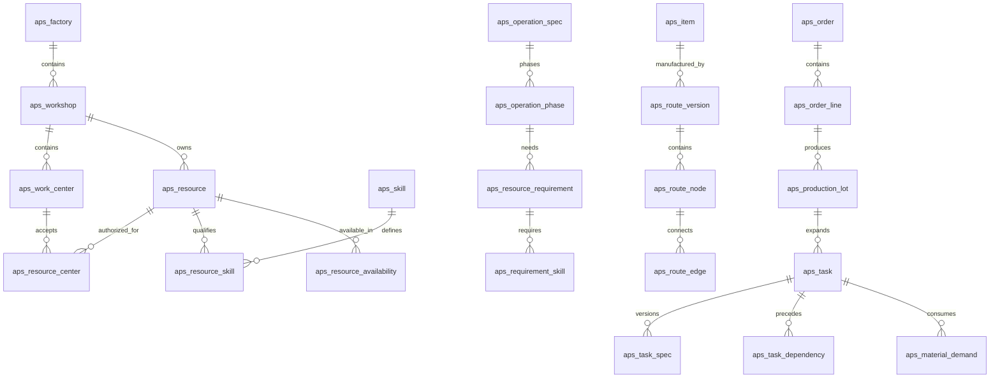
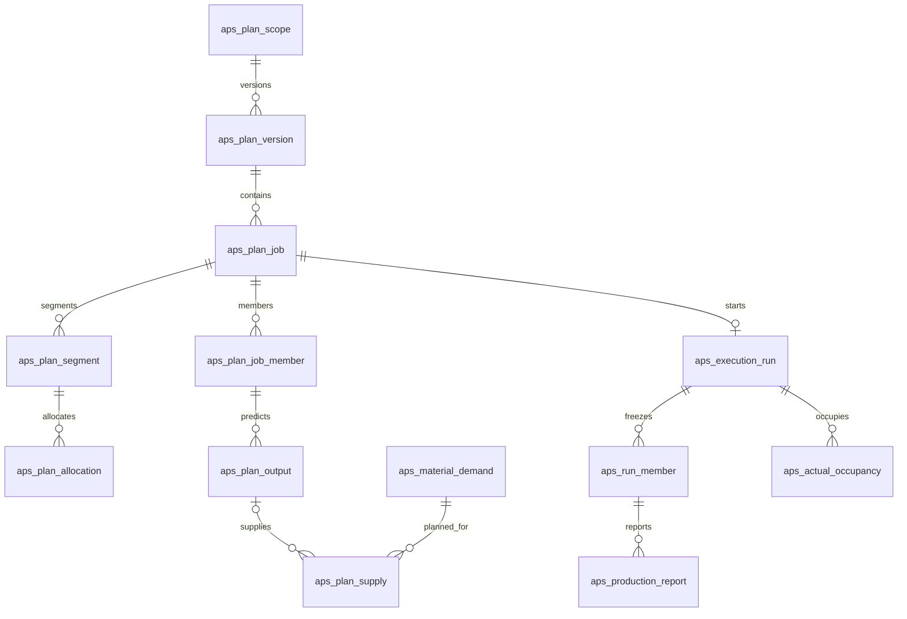
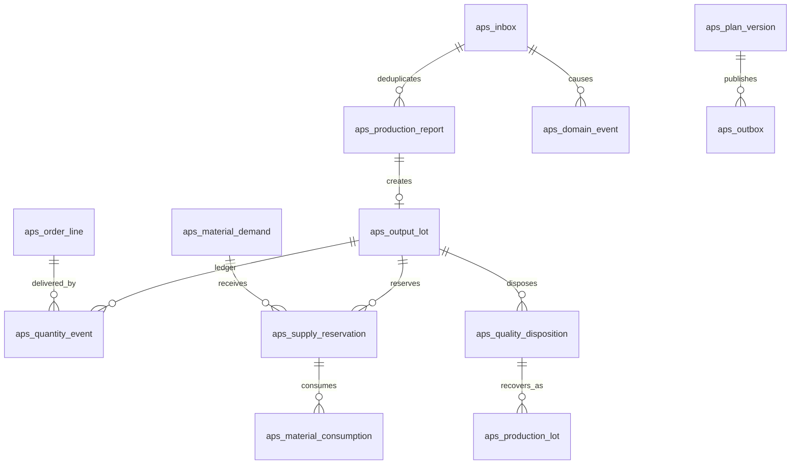

# 生产排程与车间调度数据库设计（46 表归档）

> 文档类型：技术设计；编号：DB-APS-001；版本：2.0.0；文档状态：Approved  
> 创建时间：2026-09-11；更新时间：2026-09-11；owner：用户；设计：Codex  
> 规范基线：用户级协作入口 2026.09-r1、规范索引 2026.09-r2、项目文档规范 2026.09-r2  
> 风险：L2；设计阶段：5 技术设计 / Completed；DDL 草案与静态验证不等于数据库已实施  
> 批准依据：2026-09-11 用户明确认可 46 张“标准生产闭环”并要求据此更新设计、编写 SQL  
> 上游：[产品需求文档](../../产品/产品需求文档.md)、[原型契约](../../../../../prototype/production-workbench-v2/contract.md)  
> 关联设计：[APS 排程引擎需求与技术设计](../../架构/APS排程引擎需求与技术设计.md)；其中 APS-DG-01 至 APS-DG-07 是求解器实施前的数据契约差距，不修改本历史版本当时的 46 表边界  
> 实现草案：[MySQL 初始化 DDL](生产排程数据库基线草案-46表.sql)；证据：[数据库设计验证记录](证据/数据库设计验证记录-46表.md)  
> 历史与恢复：[62 表原稿](数据库设计-62表草案.md)、[收敛记录](../../开发记录/2026-09-11-生产排程数据库46表收敛.md)

“Approved”只表示本版 46 表逻辑边界获得用户批准，不表示已经建库、迁移、联调、压测、用户验收或上线。

## 1. 设计结论

首个真实系统采用 **46 张物理表的标准生产闭环**：

`订单 → 工艺展开 → 排程 → 发布 → 开工 → 报工 → 质检 → 预留/投入 → 返工/补产 → 合格交付 → 日报追溯`

本版坚持六个分层原则：

1. 工艺模板、订单任务、计划安排和实际执行分别拥有生命周期，重排不得改写历史事实。
2. 非消耗开工门槛与真实物料消耗分开；计划预测供给与实际可领用批分开。
3. 普通任务、拆批任务和共享加工批统一由 job/member/segment/allocation 表达，不复制设备工时。
4. 报工单、实物批、不可变数量流水和当前余额投影分工明确；更正靠冲正，不删除历史。
5. 发布使用工厂级 scope、两类 revision 和内容 hash；外部命令用 inbox 防重，外发用 outbox 重试。
6. 表数是能力边界的结果，不是页面数；事件、流水和关联表不提供普通 CRUD 页面。

## 2. 标准版范围、计数与延期能力

| 业务域 | 表范围 | 数量 | 回答的问题 |
| --- | --- | ---: | --- |
| 组织、资源与可用性 | T01–T09 | 9 | 谁能在哪做、具备什么资格、何时可用 |
| 产品、工艺与路线 | T10–T17 | 8 | 产品怎么做、阶段需要哪些资源、节点如何连接 |
| 订单、实例与任务 | T18–T24 | 7 | 本次做多少、任务怎么展开、何时可开工和消耗什么 |
| 计划、供给与发布 | T25–T34 | 10 | 哪个版本在何时由哪些资源加工、何时预测释放 |
| 执行、数量与质量 | T35–T44 | 10 | 实际做了多少、占用了什么、数量如何流转和恢复 |
| 集成 | T45–T46 | 2 | 如何防止重复写入并可靠通知外部系统 |
| **合计** | **T01–T46** | **46** | **标准生产闭环** |

### 2.1 从旧 62 表到当前 46 表

| 旧设计 | 当前处理 | 净减少 |
| --- | --- | ---: |
| `resource + worker` | 人员条件字段并入 `aps_resource` | 1 |
| 日历版本、日历窗口、资源日历绑定 | 合并为 `aps_resource_availability` | 2 |
| `operation + operation_spec` | 合并为 `aps_operation_spec` | 1 |
| 工艺阶段与默认角色产能标准 | 默认标准速率并入 `aps_operation_phase` | 1 |
| 生产实例与简单恢复来源 | 简化血缘并入 `aps_production_lot` / `aps_task_spec` | 1 |
| 计划版本、输入包、问题明细 | 输入快照和校验摘要并入 `aps_plan_version` | 2 |
| 执行事件与业务审计 | 合并为 `aps_domain_event` | 1 |
| 数量流水与交付归属 | `DELIVER` 归属并入 `aps_quantity_event` | 1 |
| 任意同步组、持久预测表、多维装载表、具名组合成员表 | 不进入标准版 | 6 |
| **合计** | `62 - 16` | **16** |

旧机器检查和 62 表字段原文保留在归档中，不继承为本版验证结果。

### 2.2 标准版明确延期的能力

- 任意独立任务的 `SAME_START` / `SAME_END` 同步组；共享批自身的共同周期仍支持。
- 重量、体积、挂点等多个维度同时限制的混装；标准版只支持同一输出单位下的 `max_batch_qty`。
- 具名人员与具体设备组合的专属速率；标准版对一个工艺阶段采用一套已批准默认标准。
- 多来源、多分支、多返回点的复杂返工图；标准版限定一条恢复实例只有一个处置来源和明确返回点。
- 独立计划问题明细表、独立输入快照表、持久化逐版本订单预测表；分别改为版本 JSON 或可重建查询。
- 完整 ERP 采购库存、仓位、供应商、成本、序列号谱系、完整 QMS、CAPA 和设备维修工单。

必要业务遇到延期能力时必须标记为不支持并阻止发布，不能静默近似为可执行计划。

## 3. 数据库与系统边界

本独立业务项目按项目规则采用 **MySQL 8.0.16+、InnoDB、utf8mb4**。DDL 在独立的生产排程数据库执行，不放入 RuoYi 身份库，也不放入 AI Interview Coach 的 PostgreSQL Flyway 路径。

- 主键采用应用生成的 UUID 文本，物理类型 `char(36)`、ASCII 二进制排序；不得复用业务编码作主键。
- 数量使用 `decimal(18,6)`，比例和单件秒数使用 `decimal(18,9)`，禁止 float/double。
- 绝对时间使用 UTC `datetime(3)`；`aps_factory.timezone` 保存 IANA 时区，业务日和班次边界先按工厂时区解释。
- JSON 只保存不可变求解输入、校验摘要、策略及脱敏事件上下文，不替代路线边、资源席位和数量账。
- RuoYi 的 `sys_user`、`sys_dept` 继续由平台 MySQL 身份库维护；本文仅保存 `bigint` 逻辑标识，不建立跨库外键或跨库事务。
- MySQL 没有 PostgreSQL 式可延迟外键、部分索引和范围排斥；循环指针采用事务末尾补写，资源区间与累计容量由受控服务事务复验。
- 物理外键采用 MySQL 默认的 `ON DELETE RESTRICT / ON UPDATE RESTRICT` 语义；被引用的版本、事件和业务事实不级联删除，生命周期变化通过状态或新版本表达。

## 4. 关系总览

### 4.1 主数据、工艺与订单任务

### 4.2 计划与实际执行

### 4.3 数量、质量、恢复与集成

## 5. 字段和公共约定

字段字典缩写：`ID=char(36)`；`Q=decimal(18,6)`；`R=decimal(18,9)`；`TS=datetime(3) UTC`；`CODE=varchar(64)`；`STATE=varchar(32)`。`NN` 为非空，`NULL` 为可空，`—` 为创建者必须提供。

每张表都有 `id`、`created_at`、`ruoyi_user_id`、`source_system`；除工厂外还有 `factory_id`。M/V 表另有 `updated_at`、`updated_by`、`row_version`，E 表是追加事实，不包含可编辑维护字段。

| 类型 | 语义 |
| --- | --- |
| M | 主数据或状态投影；通过状态、乐观锁和受控事务维护，不物理删除被引用历史 |
| V | 版本内容；草稿可编辑，发布后冻结，变化创建新版本 |
| E | 不可变事实；更正通过新事件、反向引用或冲正，不覆盖原记录 |

## 6. 组织、资源与可用性（T01–T09）

### T01 `aps_factory` · 工厂（M）

| 字段 | 类型 | 必填 / 默认 | 含义及关系 |
| --- | --- | --- | --- |
| factory_code | CODE | NN / — | 全局唯一工厂代码 |
| name | varchar(128) | NN / — | 工厂名称 |
| timezone | varchar(64) | NN / Asia/Shanghai | IANA 时区 |
| status | STATE | NN / ACTIVE | ACTIVE、INACTIVE |
| ruoyi_dept_id | bigint | NULL / NULL | 逻辑引用平台部门 |

### T02 `aps_workshop` · 车间（M）

| 字段 | 类型 | 必填 / 默认 | 含义及关系 |
| --- | --- | --- | --- |
| workshop_code | CODE | NN / — | UQ(factory_id,workshop_code) |
| name | varchar(128) | NN / — | 车间名称 |
| ruoyi_dept_id | bigint | NULL / NULL | 逻辑引用平台部门 |
| manager_user_id | bigint | NULL / NULL | 逻辑引用平台用户 |
| status | STATE | NN / ACTIVE | ACTIVE、INACTIVE |

### T03 `aps_work_center` · 工作中心（M）

| 字段 | 类型 | 必填 / 默认 | 含义及关系 |
| --- | --- | --- | --- |
| workshop_id | ID | NN / — | FK→aps_workshop |
| center_code | CODE | NN / — | UQ(factory_id,center_code) |
| name | varchar(128) | NN / — | 工作中心名称 |
| center_kind | STATE | NN / MIXED | MANUAL、MACHINE、MIXED |
| status | STATE | NN / ACTIVE | ACTIVE、INACTIVE |

### T04 `aps_resource` · 统一资源与人员资料（M）

| 字段 | 类型 | 必填 / 默认 | 含义及关系 |
| --- | --- | --- | --- |
| resource_code | CODE | NN / — | UQ(factory_id,resource_code) |
| name | varchar(128) | NN / — | 人员、机器、工位、工装或容量资源名称 |
| resource_type | STATE | NN / — | PERSON、MACHINE、STATION、TOOL、CAPACITY |
| home_workshop_id | ID | NN / — | FK→aps_workshop，归属不是唯一执行中心 |
| capacity_uom_id | ID | NN / — | FK→aps_uom |
| capacity_value | Q | NN / 1 | 正数；PERSON 固定为 1 |
| is_exclusive | boolean | NN / true | 独占资源为 true，连续容量资源为 false |
| status | STATE | NN / ACTIVE | ACTIVE、INACTIVE |
| employee_no | CODE | NULL / NULL | PERSON 必填，工厂内唯一 |
| login_user_id | bigint | NULL / NULL | PERSON 可选，逻辑引用平台用户 |
| team_name | varchar(128) | NULL / NULL | PERSON 班组标签 |
| employment_start | date | NULL / NULL | PERSON 用工起始日 |
| employment_end | date | NULL / NULL | PERSON 用工结束日 |
| hr_reference | varchar(128) | NULL / NULL | HR 来源业务键 |

非 PERSON 行的人员专属字段必须为空。资源类型、容量单位和独占属性被计划或执行引用后不得原位改变语义。

### T05 `aps_skill` · 技能字典（M）

| 字段 | 类型 | 必填 / 默认 | 含义及关系 |
| --- | --- | --- | --- |
| skill_code | CODE | NN / — | UQ(factory_id,skill_code) |
| name | varchar(128) | NN / — | 技能名称 |
| applies_to | STATE | NN / PERSON | PERSON、EQUIPMENT |
| max_level | smallint | NN / 5 | 正整数 |
| status | STATE | NN / ACTIVE | ACTIVE、INACTIVE |

### T06 `aps_resource_skill` · 资源技能有效记录（V）

| 字段 | 类型 | 必填 / 默认 | 含义及关系 |
| --- | --- | --- | --- |
| resource_id | ID | NN / — | FK→aps_resource |
| skill_id | ID | NN / — | FK→aps_skill |
| level | smallint | NN / — | 1 至技能最高等级 |
| valid_from | TS | NN / — | 生效时点 |
| valid_to | TS | NULL / NULL | 不含该时点 |
| certification_ref | varchar(128) | NULL / NULL | 证书或确认依据编号 |

同资源同技能有效期不得重叠；历史计划按输入快照解释。

### T07 `aps_resource_center` · 中心资格与借调（V）

| 字段 | 类型 | 必填 / 默认 | 含义及关系 |
| --- | --- | --- | --- |
| resource_id | ID | NN / — | FK→aps_resource |
| work_center_id | ID | NN / — | FK→aps_work_center |
| valid_from | TS | NN / — | 资格生效时点 |
| valid_to | TS | NULL / NULL | 资格失效时点 |
| assignment_kind | STATE | NN / HOME | HOME、QUALIFIED、SECONDMENT |
| approved_by | bigint | NN / — | 逻辑引用批准用户 |
| reason | varchar(500) | NN / — | 资格或借调依据 |

### T08 `aps_resource_availability` · 资源可用窗口（V）

| 字段 | 类型 | 必填 / 默认 | 含义及关系 |
| --- | --- | --- | --- |
| resource_id | ID | NN / — | FK→aps_resource |
| start_at | TS | NN / — | 窗口起点 |
| end_at | TS | NN / — | 大于起点，采用半开区间 |
| availability_type | STATE | NN / WORK | WORK、OVERTIME、LEAVE、TRAINING、MAINTENANCE、BREAK |
| capacity_value | Q | NN / — | 此窗口可用容量；不可用类型为 0 |
| approval_status | STATE | NN / APPROVED | DRAFT、APPROVED、CANCELLED |
| approved_by | bigint | NULL / NULL | APPROVED 时必填 |
| reason | varchar(500) | NN / — | 班次、例外或停机依据 |
| supersedes_id | ID | NULL / NULL | FK→aps_resource_availability，更正替代关系 |

共享班制在首版展开为每个资源的绝对窗口。求解只读取 `APPROVED` 且未被另一条已批准记录替代的窗口；`DRAFT`、`CANCELLED` 和已被替代记录不参与。服务事务必须保证同一资源的有效已批准窗口采用半开区间且互不重叠，局部请假或维修通过拆分原窗口并追加替代记录表达，不能依赖“负窗口覆盖正窗口”的隐式优先级。求解时采用的窗口必须进入计划输入快照。

### T09 `aps_uom` · 计量单位（M）

| 字段 | 类型 | 必填 / 默认 | 含义及关系 |
| --- | --- | --- | --- |
| uom_code | CODE | NN / — | UQ(factory_id,uom_code) |
| name | varchar(128) | NN / — | 单位名称 |
| dimension | STATE | NN / — | COUNT、TIME、WEIGHT、VOLUME、CAPACITY |
| quantum | Q | NN / — | 最小数量量子，正数 |
| status | STATE | NN / ACTIVE | ACTIVE、INACTIVE |

## 7. 产品、工艺与路线（T10–T17）

### T10 `aps_item` · 产品与物料版本（V）

| 字段 | 类型 | 必填 / 默认 | 含义及关系 |
| --- | --- | --- | --- |
| item_code | CODE | NN / — | SKU 或物料代码 |
| revision_no | varchar(32) | NN / — | UQ(factory_id,item_code,revision_no) |
| name | varchar(200) | NN / — | 版本名称 |
| item_type | STATE | NN / PRODUCT | PRODUCT、SEMI_FINISHED、RAW_MATERIAL |
| base_uom_id | ID | NN / — | FK→aps_uom |
| external_id | varchar(128) | NULL / NULL | 外部系统版本业务键 |
| status | STATE | NN / DRAFT | DRAFT、ACTIVE、RETIRED |

### T11 `aps_operation_spec` · 工序定义与参数版本（V）

| 字段 | 类型 | 必填 / 默认 | 含义及关系 |
| --- | --- | --- | --- |
| operation_code | CODE | NN / — | 稳定工序代码 |
| spec_no | integer | NN / — | UQ(factory_id,operation_code,spec_no) |
| name | varchar(128) | NN / — | 工序名称 |
| category | STATE | NN / PROCESS | PROCESS、INSPECTION、TRANSFER、WAIT |
| description | text | NULL / NULL | 工艺说明 |
| mode | STATE | NN / — | MANUAL、MACHINE、AUTO、BATCH、WAIT |
| output_item_id | ID | NN / — | FK→aps_item |
| quality_policy | STATE | NN / REPORT_RELEASE | REPORT_RELEASE、INSPECTION_REQUIRED |
| compatibility_key | varchar(128) | NULL / NULL | BATCH 兼容组 |
| min_batch_qty | Q | NULL / NULL | 最小批量 |
| max_batch_qty | Q | NULL / NULL | 标准版唯一批容量维度 |
| status | STATE | NN / DRAFT | DRAFT、PUBLISHED、RETIRED |
| approved_by | bigint | NULL / NULL | 发布人 |
| approved_at | TS | NULL / NULL | 发布时间 |

### T12 `aps_operation_phase` · 工艺阶段与默认标准工时（V）

| 字段 | 类型 | 必填 / 默认 | 含义及关系 |
| --- | --- | --- | --- |
| operation_spec_id | ID | NN / — | FK→aps_operation_spec |
| phase_no | integer | NN / — | UQ(factory_id,operation_spec_id,phase_no) |
| phase_kind | STATE | NN / — | SETUP、RUN、UNLOAD、WAIT、TRANSFER、RECOVERY_SETUP |
| duration_mode | STATE | NN / FIXED | FIXED、PER_UNIT |
| interruptible | boolean | NN / false | 是否允许跨班分段 |
| resume_setup_seconds | bigint | NN / 0 | 恢复时追加准备秒数 |
| hold_on_pause | boolean | NN / false | 暂停时是否继续占用设备或工装 |
| releases_output | boolean | NN / false | 阶段是否形成预测释放 |
| fixed_seconds | bigint | NN / — | 已批准固定秒数或固定偏置 |
| seconds_per_unit | R | NN / — | FIXED 为 0；PER_UNIT 大于 0 |
| output_uom_id | ID | NN / — | FK→aps_uom，与工序输出一致 |
| value_source | STATE | NN / — | STANDARD、OBSERVED_APPROVED、ESTIMATE_APPROVED |
| evidence_reference | varchar(256) | NN / — | 工艺或工时批准依据 |

速率随工序规格发布并冻结。具体人员和机器仍参与资格与占用校验，但标准版不因具名组合改变工时。

### T13 `aps_resource_requirement` · 阶段资源角色与席位（V）

| 字段 | 类型 | 必填 / 默认 | 含义及关系 |
| --- | --- | --- | --- |
| phase_id | ID | NN / — | FK→aps_operation_phase |
| role_code | CODE | NN / — | UQ(factory_id,phase_id,role_code) |
| resource_type | STATE | NN / — | 与资源类型一致 |
| work_center_id | ID | NN / — | FK→aps_work_center |
| fixed_resource_id | ID | NULL / NULL | FK→aps_resource |
| seat_count | integer | NN / 1 | 必须分配的独立席位数 |
| demand_per_seat | Q | NN / 1 | 每席位容量需求 |
| demand_uom_id | ID | NN / — | FK→aps_uom |
| continuity_key | CODE | NULL / NULL | 多阶段要求同一资源时使用 |
| distinct_group | CODE | NULL / NULL | 重叠时必须使用不同资源的角色组 |

### T14 `aps_requirement_skill` · 角色技能要求（V）

| 字段 | 类型 | 必填 / 默认 | 含义及关系 |
| --- | --- | --- | --- |
| requirement_id | ID | NN / — | FK→aps_resource_requirement |
| skill_id | ID | NN / — | FK→aps_skill |
| minimum_level | smallint | NN / — | 多行按 AND 条件解释 |

### T15 `aps_route_version` · 产品工艺路线版本（V）

| 字段 | 类型 | 必填 / 默认 | 含义及关系 |
| --- | --- | --- | --- |
| item_id | ID | NN / — | FK→aps_item |
| route_code | CODE | NN / — | 路线代码 |
| version_no | integer | NN / — | UQ(factory_id,route_code,version_no) |
| name | varchar(128) | NN / — | 路线名称 |
| status | STATE | NN / DRAFT | DRAFT、PUBLISHED、RETIRED |
| published_at | TS | NULL / NULL | 发布时间 |
| approved_by | bigint | NULL / NULL | 逻辑引用批准用户 |

### T16 `aps_route_node` · 路线节点（V）

| 字段 | 类型 | 必填 / 默认 | 含义及关系 |
| --- | --- | --- | --- |
| route_version_id | ID | NN / — | FK→aps_route_version |
| node_code | CODE | NN / — | UQ(factory_id,route_version_id,node_code) |
| operation_spec_id | ID | NN / — | FK→aps_operation_spec |
| quantity_factor | R | NN / 1 | 每单位生产实例需要的工序输出量 |
| required_for_completion | boolean | NN / true | 是否为完成必要节点 |
| is_delivery_output | boolean | NN / false | 是否允许计入产品行交付 |

### T17 `aps_route_edge` · 路线模板关系（V）

| 字段 | 类型 | 必填 / 默认 | 含义及关系 |
| --- | --- | --- | --- |
| route_version_id | ID | NN / — | FK→aps_route_version |
| from_node_id | ID | NN / — | FK→aps_route_node |
| to_node_id | ID | NN / — | FK→aps_route_node，不能等于来源 |
| relation_type | STATE | NN / FINISH | FINISH、QUANTITY、TRANSFER |
| threshold_mode | STATE | NULL / NULL | ABSOLUTE、RATIO；QUANTITY 必填 |
| threshold_qty | Q | NULL / NULL | 最终绝对门槛 |
| threshold_ratio | R | NULL / NULL | `0 < threshold_ratio <= 1` |
| usage_ratio | R | NULL / NULL | TRANSFER 单位用量 |
| transfer_qty | Q | NULL / NULL | TRANSFER 批量 |
| lag_seconds | bigint | NN / 0 | 非负等待或转运秒数 |
| lag_basis | STATE | NN / ELAPSED | ELAPSED、WORKING |
| lag_calendar_resource_id | ID | NULL / NULL | FK→aps_resource；WORKING 时引用专用 CAPACITY 日历资源 |

WORKING 等待通过一条专用 CAPACITY 资源及其 availability 窗口积分，避免恢复三层共享日历表。发布校验必须确认 `ELAPSED` 时日历资源为空、`WORKING` 时非空，目标资源类型为 `CAPACITY`，且其有效已批准窗口覆盖求解范围。专用日历资源不得出现在普通阶段的 plan allocation 中。路线发布时还必须校验无环。

## 8. 订单、生产实例与任务（T18–T24）

### T18 `aps_order` · 生产订单（M）

| 字段 | 类型 | 必填 / 默认 | 含义及关系 |
| --- | --- | --- | --- |
| order_no | CODE | NN / — | UQ(factory_id,order_no) |
| external_id | varchar(128) | NULL / NULL | 外部订单业务键 |
| external_revision | varchar(64) | NULL / NULL | 来源版本或同步顺序 |
| customer_reference | varchar(200) | NULL / NULL | 客户业务参考，不保存联系人隐私 |
| priority | integer | NN / 50 | 0 至 100，数值越大越优先 |
| earliest_start_at | TS | NN / — | 最早允许开工 |
| promised_at | TS | NN / — | 当前生产承诺 |
| original_promised_at | TS | NN / — | 首次确认承诺，不覆盖 |
| status | STATE | NN / DRAFT | DRAFT、RELEASED、IN_PROGRESS、COMPLETED、CANCELLED |
| cancellation_reason | varchar(500) | NULL / NULL | 取消原因 |

### T19 `aps_order_line` · 产品需求行（M）

| 字段 | 类型 | 必填 / 默认 | 含义及关系 |
| --- | --- | --- | --- |
| order_id | ID | NN / — | FK→aps_order |
| line_no | integer | NN / — | UQ(factory_id,order_id,line_no) |
| item_id | ID | NN / — | FK→aps_item |
| ordered_qty | Q | NN / — | 客户需求量，正数 |
| uom_id | ID | NN / — | FK→aps_uom，与产品基本单位一致 |
| route_version_id | ID | NN / — | FK→aps_route_version，必须已发布且产品一致 |
| promised_at | TS | NULL / NULL | 空值继承订单承诺 |
| external_line_id | varchar(128) | NULL / NULL | 外部订单行标识 |

### T20 `aps_production_lot` · 产品生产与恢复实例（M）

| 字段 | 类型 | 必填 / 默认 | 含义及关系 |
| --- | --- | --- | --- |
| order_line_id | ID | NN / — | FK→aps_order_line |
| lot_no | CODE | NN / — | UQ(factory_id,lot_no) |
| route_version_id | ID | NN / — | FK→aps_route_version |
| lot_kind | STATE | NN / NORMAL | NORMAL、REWORK、REPLACEMENT |
| planned_qty | Q | NN / — | 正数；恢复实例不增加客户订购量 |
| source_disposition_id | ID | NULL / NULL | FK→aps_quality_disposition，恢复实例必填 |
| source_task_id | ID | NULL / NULL | FK→aps_task，原不良任务 |
| return_task_id | ID | NULL / NULL | FK→aps_task，恢复后返回的下游；末道可空 |
| reentry_node_id | ID | NULL / NULL | FK→aps_route_node，恢复路线重入点 |
| source_qty | Q | NULL / NULL | 处置来源量 |
| source_uom_id | ID | NULL / NULL | FK→aps_uom |
| product_qty | Q | NULL / NULL | 对应订单产品恢复量 |
| conversion_ratio | R | NULL / NULL | product_qty = source_qty × 冻结比例 |
| status | STATE | NN / CREATED | CREATED、IN_PROGRESS、COMPLETED、CANCELLED |

NORMAL 实例的恢复字段必须为空。标准版限定一个恢复实例只有一个处置来源、一个明确重入点，并且其任务链恰好一个 `is_recovery_output=true` 的末端任务；多源、多分支、多恢复末端血缘必须启用后续恢复关系扩展。

### T21 `aps_task` · 稳定工序任务身份（M）

| 字段 | 类型 | 必填 / 默认 | 含义及关系 |
| --- | --- | --- | --- |
| production_lot_id | ID | NN / — | FK→aps_production_lot |
| task_no | CODE | NN / — | UQ(factory_id,task_no) |
| route_node_id | ID | NULL / NULL | FK→aps_route_node，特殊恢复任务可空 |
| current_spec_id | ID | NULL / NULL | FK→aps_task_spec；事务结束前必须补齐并属于自身 |
| status | STATE | NN / READY | READY、RUNNING、PAUSED、COMPLETED、CANCELLED |
| responsible_user_id | bigint | NULL / NULL | 协调负责人，不产生资源占用 |

MySQL 不支持延迟外键。创建任务时先插入 current_spec_id 为空的任务，再插入首个 spec、回写指针，并在同一服务事务提交前校验非空。

### T22 `aps_task_spec` · 任务需求快照（V）

| 字段 | 类型 | 必填 / 默认 | 含义及关系 |
| --- | --- | --- | --- |
| task_id | ID | NN / — | FK→aps_task |
| spec_no | integer | NN / — | UQ(factory_id,task_id,spec_no) |
| operation_spec_id | ID | NN / — | FK→aps_operation_spec |
| required_qty | Q | NN / — | 该工序要求输出量 |
| output_item_id | ID | NN / — | FK→aps_item |
| uom_id | ID | NN / — | FK→aps_uom |
| earliest_start_at | TS | NN / — | 已展开的最早开始时点 |
| required_for_completion | boolean | NN / true | 完成必要标记 |
| is_delivery_output | boolean | NN / false | 产品行交付资格 |
| is_recovery_output | boolean | NN / false | 简单恢复链末端标记 |
| change_reason | varchar(500) | NN / — | 首次展开或变更依据 |

任务数量或工艺改变时创建新 spec；已开始的任务不得替换已执行 spec。

### T23 `aps_task_dependency` · 非消耗前置关系（M）

| 字段 | 类型 | 必填 / 默认 | 含义及关系 |
| --- | --- | --- | --- |
| from_task_id | ID | NN / — | FK→aps_task |
| to_task_id | ID | NN / — | FK→aps_task，不得等于来源 |
| from_spec_id | ID | NN / — | FK→aps_task_spec，属于来源任务 |
| to_spec_id | ID | NN / — | FK→aps_task_spec，属于目标任务 |
| relation_type | STATE | NN / FINISH | FINISH、QUANTITY |
| threshold_mode | STATE | NULL / NULL | ABSOLUTE、RATIO |
| denominator_qty | Q | NULL / NULL | 比例门槛冻结分母 |
| threshold_ratio | R | NULL / NULL | 比例门槛 |
| threshold_qty | Q | NULL / NULL | 按数量量子得到的最终门槛 |
| uom_id | ID | NULL / NULL | FK→aps_uom，QUANTITY 时必填 |
| lag_seconds | bigint | NN / 0 | 非负等待 |
| lag_basis | STATE | NN / ELAPSED | ELAPSED、WORKING |
| lag_calendar_resource_id | ID | NULL / NULL | FK→aps_resource；WORKING 时引用日历资源 |

该表只决定目标任务是否具备开工资格，不扣减来源实物。

### T24 `aps_material_demand` · 工序消耗需求（M）

| 字段 | 类型 | 必填 / 默认 | 含义及关系 |
| --- | --- | --- | --- |
| task_id | ID | NN / — | FK→aps_task，消费方 |
| task_spec_id | ID | NN / — | FK→aps_task_spec，属于消费任务 |
| demand_no | integer | NN / — | UQ(factory_id,task_spec_id,demand_no) |
| item_id | ID | NN / — | FK→aps_item |
| uom_id | ID | NN / — | FK→aps_uom |
| required_source_task_id | ID | NULL / NULL | FK→aps_task；空时可用外部供给 |
| usage_ratio | R | NN / — | 每单位目标产出需要的物料量 |
| total_required_qty | Q | NN / — | 冻结需求总量 |
| first_transfer_qty | Q | NN / — | 首次开工最低投入量 |
| transfer_qty | Q | NN / — | 后续转移批量 |
| lag_seconds | bigint | NN / 0 | 转运或放行等待 |
| lag_basis | STATE | NN / ELAPSED | ELAPSED、WORKING |
| lag_calendar_resource_id | ID | NULL / NULL | FK→aps_resource；WORKING 时引用日历资源 |

有指定来源的需求参与无环校验；真实投入必须通过预留与消费流水完成。

## 9. 计划、供给与发布（T25–T34）

### T25 `aps_plan_scope` · 工厂调度范围与正式指针（M）

| 字段 | 类型 | 必填 / 默认 | 含义及关系 |
| --- | --- | --- | --- |
| scope_code | CODE | NN / FACTORY | UQ(factory_id)，首版每厂唯一 |
| current_version_id | ID | NULL / NULL | FK→aps_plan_version，当前正式版本 |
| definition_revision | bigint | NN / 0 | 工艺、订单、可用性等输入修订号 |
| execution_revision | bigint | NN / 0 | 开停、质量和数量事实修订号 |
| publication_no | bigint | NN / 0 | 正式发布序列 |

### T26 `aps_plan_version` · 计划版本、输入快照与校验摘要（V）

| 字段 | 类型 | 必填 / 默认 | 含义及关系 |
| --- | --- | --- | --- |
| scope_id | ID | NN / — | FK→aps_plan_scope |
| version_no | bigint | NN / — | UQ(factory_id,scope_id,version_no) |
| base_version_id | ID | NULL / NULL | FK→aps_plan_version，同一 scope |
| input_definition_revision | bigint | NN / — | 求解时定义水位 |
| input_execution_revision | bigint | NN / — | 求解时执行水位 |
| horizon_start | TS | NN / — | 求解窗口起点 |
| horizon_end | TS | NN / — | 求解窗口终点 |
| status | STATE | NN / DRAFT | DRAFT、SOLVING、FEASIBLE、CONFLICT、CANCELLED、FAILED、PUBLISHED、SUPERSEDED |
| solver_name | varchar(128) | NN / — | 求解实现及版本 |
| strategy_json | json | NN / — | 目标权重、时限和参数 |
| result_kind | STATE | NULL / NULL | FEASIBLE、INFEASIBLE_PROVEN、TIMEOUT_WITH_SOLUTION、TIMEOUT_NO_SOLUTION、INVALID_INPUT |
| started_at | TS | NULL / NULL | 求解开始 |
| finished_at | TS | NULL / NULL | 求解结束或取消 |
| input_schema_version | integer | NN / 1 | 输入 JSON Schema 版本 |
| input_captured_at | TS | NN / — | 一致性快照截止时间 |
| input_content_sha256 | char(64) | NN / — | 规范化输入 hash |
| input_snapshot_json | json | NN / — | 完整不可变求解输入 |
| validation_run_id | ID | NULL / NULL | 最新完整校验批号 |
| validation_status | STATE | NN / NOT_RUN | NOT_RUN、PASS、FAIL |
| validated_at | TS | NULL / NULL | 完整校验结束时间 |
| validated_content_sha256 | char(64) | NULL / NULL | 所校验候选内容 hash |
| validation_summary_json | json | NULL / NULL | 问题数组、统计和定位上下文 |
| published_at | TS | NULL / NULL | 正式发布时间 |
| published_by | bigint | NULL / NULL | 正式发布人 |
| publish_note | varchar(1000) | NULL / NULL | 发布说明 |

输入快照冻结任务、阶段默认速率、资源资格和 availability、计划锁、实际占用、实物批与预留水位。JSON 不成为第二套可编辑主数据。

### T27 `aps_plan_job` · 计划作业与共享加工批（V）

| 字段 | 类型 | 必填 / 默认 | 含义及关系 |
| --- | --- | --- | --- |
| plan_version_id | ID | NN / — | FK→aps_plan_version |
| job_code | CODE | NN / — | UQ(factory_id,plan_version_id,job_code) |
| job_type | STATE | NN / SINGLE | SINGLE、SHARED_BATCH |
| cycle_spec_id | ID | NN / — | FK→aps_operation_spec |
| work_center_id | ID | NN / — | FK→aps_work_center |
| compatibility_key | varchar(128) | NULL / NULL | SHARED_BATCH 兼容结论 |
| carry_run_id | ID | NULL / NULL | FK→aps_execution_run，携带已发生运行 |
| planned_start | TS | NN / — | 第一段开始 |
| planned_end | TS | NN / — | 最后一段结束 |

标准版共享批要求成员采用可共同计算的同一输出单位，成员量合计不超过工序规格 `max_batch_qty`；不处理重量、体积和挂点的同时约束。

### T28 `aps_plan_job_member` · 作业成员和分配量（V）

| 字段 | 类型 | 必填 / 默认 | 含义及关系 |
| --- | --- | --- | --- |
| plan_version_id | ID | NN / — | FK→aps_plan_version |
| plan_job_id | ID | NN / — | FK→aps_plan_job |
| task_id | ID | NN / — | FK→aps_task |
| task_spec_id | ID | NN / — | FK→aps_task_spec |
| allocated_qty | Q | NN / — | 此作业承担的任务量 |
| uom_id | ID | NN / — | FK→aps_uom |

同任务可拆到多个 job；同一版本中的有效成员量合计必须精确覆盖待排量。SINGLE 恰好一个成员，SHARED_BATCH 至少两个成员。

### T29 `aps_plan_segment` · 计划阶段与中断分段（V）

| 字段 | 类型 | 必填 / 默认 | 含义及关系 |
| --- | --- | --- | --- |
| plan_version_id | ID | NN / — | FK→aps_plan_version |
| plan_job_id | ID | NN / — | FK→aps_plan_job |
| phase_id | ID | NN / — | FK→aps_operation_phase |
| segment_no | integer | NN / — | UQ(factory_id,plan_job_id,segment_no) |
| start_at | TS | NN / — | 分段开始 |
| end_at | TS | NN / — | 分段结束 |
| work_qty | Q | NULL / NULL | PER_UNIT 阶段本段加工量 |
| duration_mode_snapshot | STATE | NN / — | 冻结 FIXED 或 PER_UNIT |
| fixed_seconds_snapshot | bigint | NN / — | 本段采用的固定秒数或偏置 |
| seconds_per_unit_snapshot | R | NN / — | 本段采用的单件秒数 |
| planned_duration_seconds | bigint | NN / — | 最终计划历时秒数 |
| rate_uom_id | ID | NN / — | FK→aps_uom |
| calculation_basis_json | json | NN / — | 数量、恢复准备及分段计算依据 |

### T30 `aps_plan_allocation` · 阶段具体资源预约（V）

| 字段 | 类型 | 必填 / 默认 | 含义及关系 |
| --- | --- | --- | --- |
| plan_version_id | ID | NN / — | FK→aps_plan_version |
| plan_segment_id | ID | NN / — | FK→aps_plan_segment |
| requirement_id | ID | NN / — | FK→aps_resource_requirement |
| seat_no | integer | NN / — | 角色独立席位 |
| resource_id | ID | NN / — | FK→aps_resource |
| start_at | TS | NN / — | 计划占用起点 |
| end_at | TS | NN / — | 计划占用终点 |
| demand_units | Q | NN / — | 容量需求，不是产品数量 |
| uom_id | ID | NN / — | FK→aps_uom |
| exclusive_snapshot | boolean | NN / — | 本版采用的独占属性 |
| enforce_exclusive | boolean | NN / false | 校验通过和发布时必须为 true |

共享批只在作业阶段预约资源一次，不能按每个成员复制预约。

### T31 `aps_plan_output` · 逐成员预测释放（V）

| 字段 | 类型 | 必填 / 默认 | 含义及关系 |
| --- | --- | --- | --- |
| plan_version_id | ID | NN / — | FK→aps_plan_version |
| plan_job_id | ID | NN / — | FK→aps_plan_job |
| plan_segment_id | ID | NN / — | FK→aps_plan_segment |
| plan_member_id | ID | NN / — | FK→aps_plan_job_member |
| release_no | integer | NN / — | UQ(factory_id,plan_member_id,release_no) |
| quantity | Q | NN / — | 预测释放量 |
| uom_id | ID | NN / — | FK→aps_uom |
| predicted_release_at | TS | NN / — | 预计质量可用时间 |

预测释放不产生实际库存，也不能作为现场领料凭证。

### T32 `aps_plan_supply` · 计划态供需配对（V）

| 字段 | 类型 | 必填 / 默认 | 含义及关系 |
| --- | --- | --- | --- |
| plan_version_id | ID | NN / — | FK→aps_plan_version |
| demand_id | ID | NN / — | FK→aps_material_demand |
| supply_output_id | ID | NULL / NULL | FK→aps_plan_output |
| source_output_lot_id | ID | NULL / NULL | FK→aps_output_lot |
| allocated_qty | Q | NN / — | 计划配对数量 |
| expected_available_at | TS | NN / — | 预计可用时点 |
| required_at | TS | NN / — | 预计投入时点 |
| source_confidence | STATE | NN / CONFIRMED | CONFIRMED、FORECAST |

预测产出和实物批来源恰好一个非空；计划配对不减少实际批余额。

### T33 `aps_plan_lock` · 人工锁定锚点（M）

| 字段 | 类型 | 必填 / 默认 | 含义及关系 |
| --- | --- | --- | --- |
| scope_id | ID | NN / — | FK→aps_plan_scope |
| task_id | ID | NN / — | FK→aps_task |
| anchor_version_id | ID | NN / — | FK→aps_plan_version |
| lock_time | boolean | NN / false | 锁定时间 |
| lock_resource | boolean | NN / false | 锁定资源组合 |
| active | boolean | NN / true | 解除后保留历史并设为 false |
| reason | varchar(500) | NN / — | 锁定或解除依据 |

锁定不豁免技能、停机、供给和实际冲突校验。

### T34 `aps_daily_baseline` · 冻结日计划基线（E）

| 字段 | 类型 | 必填 / 默认 | 含义及关系 |
| --- | --- | --- | --- |
| workshop_id | ID | NN / — | FK→aps_workshop |
| production_date | date | NN / — | 工厂本地日期 |
| plan_version_id | ID | NN / — | FK→aps_plan_version |
| frozen_at | TS | NN / — | 冻结时点 |
| frozen_by | bigint | NN / — | 逻辑引用冻结用户 |

同一车间和生产日期只能有一个基线；当天重排不静默更换历史分母。

## 10. 执行、数量与质量（T35–T44）

### T35 `aps_execution_run` · 一次真实作业运行（M）

| 字段 | 类型 | 必填 / 默认 | 含义及关系 |
| --- | --- | --- | --- |
| run_no | CODE | NN / — | UQ(factory_id,run_no) |
| source_plan_job_id | ID | NN / — | FK→aps_plan_job，工厂内唯一，防重复开工 |
| source_plan_version_id | ID | NN / — | FK→aps_plan_version |
| work_center_id | ID | NN / — | FK→aps_work_center |
| status | STATE | NN / RUNNING | RUNNING、PAUSED、COMPLETED、ABORTED |
| actual_start | TS | NN / — | 真实开始时间 |
| actual_end | TS | NULL / NULL | 结束后非空 |

计划重排不会复制、撤销或删除已经发生的运行。

### T36 `aps_run_member` · 真实运行成员（E）

| 字段 | 类型 | 必填 / 默认 | 含义及关系 |
| --- | --- | --- | --- |
| execution_run_id | ID | NN / — | FK→aps_execution_run |
| source_plan_member_id | ID | NN / — | FK→aps_plan_job_member |
| task_id | ID | NN / — | FK→aps_task |
| task_spec_id | ID | NN / — | FK→aps_task_spec |
| assigned_qty | Q | NN / — | 开工时冻结的授权量 |
| uom_id | ID | NN / — | FK→aps_uom |

### T37 `aps_actual_occupancy` · 实际资源占用区间（M）

| 字段 | 类型 | 必填 / 默认 | 含义及关系 |
| --- | --- | --- | --- |
| execution_run_id | ID | NN / — | FK→aps_execution_run |
| phase_id | ID | NN / — | FK→aps_operation_phase |
| resource_id | ID | NN / — | FK→aps_resource |
| role_code | CODE | NN / — | 实际承担角色 |
| seat_no | integer | NN / 1 | 独立席位 |
| occupancy_kind | STATE | NN / WORK | WORK、HOLD |
| start_at | TS | NN / — | 实际占用开始 |
| end_at | TS | NULL / NULL | 空值表示仍占用 |
| demand_units | Q | NN / — | 实际容量用量 |
| uom_id | ID | NN / — | FK→aps_uom |
| correction_of_id | ID | NULL / NULL | FK→aps_actual_occupancy |
| voided_by_event_id | ID | NULL / NULL | FK→aps_domain_event |

计划结束时间不得自动写成实际结束。暂停留机记录 HOLD；换人换机关闭旧区间并新开区间。

### T38 `aps_production_report` · 数量报工（E）

| 字段 | 类型 | 必填 / 默认 | 含义及关系 |
| --- | --- | --- | --- |
| run_member_id | ID | NN / — | FK→aps_run_member |
| inbox_id | ID | NN / — | FK→aps_inbox，参与幂等 |
| occurred_at | TS | NN / — | 业务发生时间 |
| produced_qty | Q | NN / — | 此次总产出 |
| immediate_good_qty | Q | NN / 0 | 直接合格量 |
| pending_qty | Q | NN / 0 | 待检量 |
| rejected_qty | Q | NN / 0 | 已判不良量 |
| uom_id | ID | NN / — | FK→aps_uom |
| correction_of_id | ID | NULL / NULL | FK→aps_production_report |
| reason | varchar(500) | NN / — | 报工或更正依据 |

必须满足 `produced_qty = immediate_good_qty + pending_qty + rejected_qty`。更正先冲正原数量贡献，再录入新报工。

### T39 `aps_output_lot` · 实物产出批与余额投影（M）

| 字段 | 类型 | 必填 / 默认 | 含义及关系 |
| --- | --- | --- | --- |
| lot_no | CODE | NN / — | UQ(factory_id,lot_no) |
| production_report_id | ID | NULL / NULL | FK→aps_production_report，非空时唯一 |
| external_lot_id | varchar(128) | NULL / NULL | 外部供给批；与报工来源恰好一个非空 |
| item_id | ID | NN / — | FK→aps_item |
| uom_id | ID | NN / — | FK→aps_uom |
| gross_qty | Q | NN / — | 首次确认总量，不覆盖 |
| expected_available_at | TS | NULL / NULL | 外部预计可用时间 |
| receipt_status | STATE | NN / RECEIVED | EXPECTED、RECEIVED |
| pending_qty | Q | NN / 0 | 待检余额 |
| available_qty | Q | NN / 0 | 合格可用余额 |
| reserved_qty | Q | NN / 0 | 已预留余额 |
| consumed_qty | Q | NN / 0 | 已投入余额 |
| rejected_qty | Q | NN / 0 | 未处置不良余额 |
| rework_qty | Q | NN / 0 | 已批准返工、尚未领用余额 |
| scrap_qty | Q | NN / 0 | 已报废余额 |
| delivered_qty | Q | NN / 0 | 已认可完成产品行的余额 |
| voided_qty | Q | NN / 0 | 已冲正余额 |

RECEIVED 批的九类余额均非负且合计等于 gross_qty。余额只能和 T40 数量事件在同一事务更新，并可由事件重建。

### T40 `aps_quantity_event` · 数量状态转移与交付账（E）

| 字段 | 类型 | 必填 / 默认 | 含义及关系 |
| --- | --- | --- | --- |
| output_lot_id | ID | NN / — | FK→aps_output_lot |
| inbox_id | ID | NN / — | FK→aps_inbox |
| entry_no | integer | NN / — | UQ(factory_id,inbox_id,entry_no) |
| event_type | STATE | NN / — | RECEIVE、RELEASE、RESERVE、UNRESERVE、CONSUME、DISPOSE、DELIVER、VOID、REVERSE |
| reservation_id | ID | NULL / NULL | FK→aps_supply_reservation |
| order_line_id | ID | NULL / NULL | FK→aps_order_line；DELIVER 及其冲正必填 |
| from_bucket | STATE | NULL / NULL | 首次入账可空 |
| to_bucket | STATE | NN / — | PENDING、AVAILABLE、RESERVED、CONSUMED、REJECTED、REWORK、SCRAP、DELIVERED、VOIDED |
| quantity | Q | NN / — | 正数；方向由事件类型和桶表示 |
| occurred_at | TS | NN / — | 实际业务时间 |
| reversal_of_id | ID | NULL / NULL | FK→aps_quantity_event；原事件最多被有效冲正一次 |
| quality_reference | varchar(128) | NULL / NULL | 检验单或自动放行依据 |
| reason | varchar(1000) | NN / — | 流转、处置或冲正依据 |

DELIVER 必须执行 `AVAILABLE → DELIVERED` 并归属一个订单行；交付冲正执行反向转移。订单完成量由有效 DELIVER 减其有效 REVERSE 汇总。

### T41 `aps_supply_reservation` · 实际供给预留（M）

| 字段 | 类型 | 必填 / 默认 | 含义及关系 |
| --- | --- | --- | --- |
| demand_id | ID | NN / — | FK→aps_material_demand |
| output_lot_id | ID | NN / — | FK→aps_output_lot |
| plan_supply_id | ID | NULL / NULL | FK→aps_plan_supply，仅作计划来源提示 |
| reservation_kind | STATE | NN / NORMAL | NORMAL、REWORK_INPUT |
| origin_bucket | STATE | NN / AVAILABLE | AVAILABLE、REWORK |
| reserved_qty | Q | NN / — | 原始预留量 |
| consumed_qty | Q | NN / 0 | 已实际投入投影 |
| released_qty | Q | NN / 0 | 已取消返还投影 |
| inbox_id | ID | NN / — | FK→aps_inbox |
| status | STATE | NN / ACTIVE | ACTIVE、CLOSED |

预留事务必须锁同一 output_lot，检查需求未满足量、来源资格和当前余额，防止并发超卖。

### T42 `aps_material_consumption` · 实际物料投入（E）

| 字段 | 类型 | 必填 / 默认 | 含义及关系 |
| --- | --- | --- | --- |
| reservation_id | ID | NN / — | FK→aps_supply_reservation |
| run_member_id | ID | NN / — | FK→aps_run_member |
| quantity | Q | NN / — | 实际投入量 |
| quantity_event_id | ID | NN / — | FK→aps_quantity_event，工厂内唯一 |
| consumed_at | TS | NN / — | 实际投入时间 |
| reversal_of_id | ID | NULL / NULL | FK→aps_material_consumption |

只有预留而没有投入不能支持下序报出；冲正采用新的反向消费记录。

### T43 `aps_quality_disposition` · 不良处置（M）

| 字段 | 类型 | 必填 / 默认 | 含义及关系 |
| --- | --- | --- | --- |
| output_lot_id | ID | NN / — | FK→aps_output_lot |
| disposition_kind | STATE | NN / — | REWORK、SCRAP |
| quantity | Q | NN / — | 处置量 |
| requires_replacement | boolean | NN / false | SCRAP 可要求补产 |
| status | STATE | NN / DRAFT | DRAFT、APPROVED、REJECTED、COMPLETED |
| approved_by | bigint | NULL / NULL | 批准人 |
| approved_at | TS | NULL / NULL | 批准时间 |
| inbox_id | ID | NN / — | FK→aps_inbox |
| reason | varchar(1000) | NN / — | 质量结论与处置依据 |

返工批准后创建新的 REWORK production_lot；报废需要补产时创建 REPLACEMENT production_lot。原报工和原批不回写成合格。

### T44 `aps_domain_event` · 统一领域事件与审计（E）

| 字段 | 类型 | 必填 / 默认 | 含义及关系 |
| --- | --- | --- | --- |
| execution_run_id | ID | NULL / NULL | FK→aps_execution_run |
| event_no | integer | NN / 1 | 同一 inbox 内事件序号 |
| event_type | STATE | NN / — | START、PAUSE、RESUME、FINISH、ABORT、REASSIGN、CORRECT、PUBLISH、CONFIG_CHANGE 等 |
| entity_type | CODE | NN / — | 受影响聚合类型 |
| entity_id | ID | NN / — | 逻辑业务对象 ID，不建多态外键 |
| actor_user_id | bigint | NULL / NULL | 逻辑引用操作者 |
| inbox_id | ID | NULL / NULL | FK→aps_inbox；纯系统审计可空 |
| occurred_at | TS | NN / — | 业务发生时间 |
| reason | varchar(1000) | NN / — | 操作依据 |
| payload_json | json | NN / — | 执行事件上下文 |
| before_json | json | NULL / NULL | 脱敏前值或前版本 |
| after_json | json | NULL / NULL | 脱敏后值或后版本 |

该表用于追溯动作和配置变化，不替代 T40 的类型化数量账，也不作为 actual_occupancy 的工时替身。

## 11. 集成（T45–T46）

### T45 `aps_inbox` · 命令与外部事件幂等接收（M）

| 字段 | 类型 | 必填 / 默认 | 含义及关系 |
| --- | --- | --- | --- |
| external_event_id | varchar(128) | NN / — | 外部事件 ID 或人工请求 UUID |
| command_type | CODE | NN / — | ORDER_IMPORT、PUBLISH、START、REPORT、RELEASE 等 |
| request_hash | char(64) | NN / — | 规范化业务载荷 SHA-256 |
| payload_json | json | NN / — | 已校验、脱敏的命令载荷 |
| status | STATE | NN / RECEIVED | RECEIVED、PROCESSING、APPLIED、REJECTED、RETRY_WAIT |
| result_json | json | NULL / NULL | 成功或拒绝结果 |
| retry_count | integer | NN / 0 | 系统失败重试次数 |
| next_retry_at | TS | NULL / NULL | 下次重试时间 |
| lease_until | TS | NULL / NULL | 处理租约 |
| last_error_code | CODE | NULL / NULL | 脱敏错误码 |

唯一键为 `UQ(factory_id,source_system,command_type,external_event_id)`。同键同 hash 返回第一次结果；同键不同 hash 拒绝。

### T46 `aps_outbox` · 可靠外发与接收确认（M）

| 字段 | 类型 | 必填 / 默认 | 含义及关系 |
| --- | --- | --- | --- |
| target_system | CODE | NN / — | MES 等接收方 |
| message_key | varchar(128) | NN / — | 稳定幂等消息键 |
| event_type | CODE | NN / — | PLAN_PUBLISHED、QUALITY_RELEASED 等 |
| plan_version_id | ID | NULL / NULL | FK→aps_plan_version |
| aggregate_key | varchar(128) | NN / — | 顺序聚合键 |
| aggregate_sequence | bigint | NN / — | 同聚合单调序列 |
| payload_json | json | NN / — | 自包含、版本化且脱敏的业务载荷 |
| status | STATE | NN / PENDING | PENDING、SENDING、ACKNOWLEDGED、RETRY_WAIT、DEAD |
| attempt_count | integer | NN / 0 | 已尝试次数 |
| next_attempt_at | TS | NULL / NULL | 下次发送时间 |
| lease_until | TS | NULL / NULL | worker 租约 |
| acknowledged_at | TS | NULL / NULL | 业务 ACK 时间 |
| remote_receipt | varchar(200) | NULL / NULL | 接收凭证 ID |
| last_error | varchar(2000) | NULL / NULL | 脱敏错误信息 |

Outbox 与业务事实在同一事务写入，网络发送在提交后执行。HTTP 成功不等于业务接收成功，以协议 ACK 为准。

命令到业务事实的数据库级防重键为：`production_report(factory_id,inbox_id,run_member_id)`、`supply_reservation(factory_id,inbox_id,demand_id,output_lot_id)`、`quality_disposition(factory_id,inbox_id,output_lot_id)`、`domain_event(factory_id,inbox_id,event_no)`；入口使用 `inbox(factory_id,source_system,command_type,external_event_id)`，出口使用 `outbox(factory_id,target_system,message_key)`。MySQL 唯一键允许多行 NULL，因此不带 inbox 的纯系统审计仍可追加。

## 12. 跨表一致性与实现边界

数据库负责类型、非空、行内 CHECK、唯一键和物理外键；服务事务负责图无环、跨行合计、时间覆盖、技能资格、累计容量、发布复验和数量守恒。MySQL CHECK 不查询其他行，不能伪装成跨表业务校验。

| 编号 | 必须成立的关系 | 落实位置 |
| --- | --- | --- |
| C01 | 所有本域关联 factory_id 一致；计划当前指针和基础版本属于同 scope | 复合 FK、唯一键、发布事务 |
| C02 | phase 属于 spec，requirement 属于 phase，路线边两端属于同 route | 复合身份键及发布校验 |
| C03 | 生产实例路线产品与订单行一致；恢复路线仍须属于原产品 | 实例化与恢复事务 |
| C04 | 普通任务节点属于实例路线；task spec 输出与工序规格一致 | 实例化事务、版本冻结 |
| C05 | current spec 属于自身；依赖和物料需求引用的 spec 属于对应任务 | FK 与事务末尾校验 |
| C06 | FINISH、QUANTITY 和指定来源消耗共同组成无环图 | 受影响子图校验 |
| C07 | 物料来源 item/uom 与需求匹配；数量、比例和门槛符合量子 | 定义、排程和领用事务 |
| C08 | job、member、segment、allocation、output、supply 属于同一计划版本和正确父层级 | 复合 FK 与候选校验 |
| C09 | 资源技能、中心资格、availability、阶段默认标准与输入快照一致；WORKING 日历引用 CAPACITY 专用资源且覆盖窗口 | 求解校验与发布复验 |
| C10 | 同任务在一版本的成员量覆盖不缺不超；carry 未重复安排 | 按 task spec 聚合校验 |
| C11 | 简单共享批周期兼容、单位可合计、成员总量不超过 max_batch_qty，资源只预约一次 | 候选校验 |
| C12 | 每阶段席位完整；独占资源不重叠；连续容量累计不超可用容量 | 唯一键、锁和时间扫描 |
| C13 | 一项计划 job 只启动一次；run member 与源成员、任务、规格和数量一致 | 唯一键、开工事务 |
| C14 | 报工单位匹配运行成员；实物批与报工或外部收货一致；数量事件属于同批 | 报工事务与行内 CHECK |
| C15 | 预留批满足需求物料、来源和质量；消费成员属于需求任务 | 预留、投入事务 |
| C16 | 简单恢复实例、处置、源任务和返回任务属于同一原订单行，恢复量不超批准量，且恢复任务链恰好一个恢复末端 | 恢复事务 |
| C17 | DELIVER 来源是订单行有效末道或简单恢复末道，且 item/uom 一致 | 交付事务，锁订单行和批 |
| C18 | 冲正与原记录同批、同量、同上下文；原笔最多一次；事件与余额投影原子一致 | 唯一索引、受控冲正和定期核对 |

主要查询索引和物理约束见随附 DDL。MySQL 不能用单个排斥约束同时覆盖计划表和实际占用表，发布与开工必须联合检查。

## 13. 关键事务与锁顺序

统一锁顺序为：

`plan_scope → order_line → task → resource → output_lot → supply_reservation`

同类对象按 UUID 排序。scope 锁只覆盖短事务，求解和网络请求不能持有它。

### 13.1 订单导入与任务展开

1. 锁 inbox 业务键和工厂 scope，校验产品、单位和已发布路线。
2. 同事务创建 order、line、NORMAL production_lot、task、task_spec、dependency 和 material_demand。
3. MySQL 下先插入 current_spec_id 为空的 task，再插入 spec 并回写；提交前检查所有新任务指针完整。
4. 校验 C02–C07、必要末端和无环；写 domain_event、递增 definition_revision、保存 inbox 结果。
5. 任一步失败全部回滚，不留下半张订单。

### 13.2 求解、校验与发布

1. 在短一致性事务中读取当前正式版、两类 revision 和全量输入，创建 plan_version 并写入不可变输入 JSON/hash。
2. 事务外求解；将候选 job/member/segment/allocation/output/supply 写入该版本。
3. 完整校验任务量、依赖、availability、技能、席位、简单批量、物料、锁定和 carry；结果和问题数组写回 plan_version。
4. 发布时锁 scope，比较 base_version、两类 revision 和 validated_content_sha256，并重新检查实际占用和实物余额。
5. 成功后旧版置 SUPERSEDED，新版置 PUBLISHED，切换 current_version，写 domain_event 和 outbox 后提交。
6. 外发失败只改变 outbox 状态；正式计划仍显示“已发布、下达待确认”，不能伪装成未发布。

### 13.3 开工、占用与报工

1. 只允许当前正式版尚未启动的 job 开工；重新检查人员技能、资源可用性、实际冲突和已放行物料。
2. 同事务创建 execution_run、冻结 run_member、打开 actual_occupancy、写 START domain_event，并递增 execution_revision。
3. 暂停关闭 WORK；设备继续占用时打开 HOLD；恢复或换人换机时重新验证并新增区间。
4. 报工同事务创建 production_report、output_lot、首批 quantity_event 和余额投影。累计有效报出不得超过 assigned_qty。

### 13.4 放行、预留、投入与冲正

- 质检放行：`PENDING → AVAILABLE`；判不良：`PENDING → REJECTED`。
- 预留：锁 output_lot，写 reservation 和 `AVAILABLE/REWORK → RESERVED`。
- 投入：写 consumption 和 `RESERVED → CONSUMED`。
- 取消未领预留：`RESERVED → origin_bucket`，不能再次算作新合格释放。
- 更正：先检查下游，再追加 REVERSE 或新事实；已被消费、交付或形成恢复产出的量不能直接删除。

### 13.5 返工、补产与交付

1. 处置批准后将不良量转入 REWORK 或 SCRAP。
2. 创建带 source_disposition/source_task/reentry 信息的新生产实例及任务，重新进入排程、发布、开工和报工。
3. 恢复产出创建新 output_lot，不修改原报工；标准版只接受单来源、明确返回点。
4. 有效末道合格量通过 DELIVER quantity_event 归属 order_line；达到 ordered_qty 且所有必要分支完成后，订单行和订单才完成。
5. 交付冲正可能重新打开订单状态。

## 14. 状态、报表和预测

| 对象 | 正常状态路径 | 关键限制 |
| --- | --- | --- |
| 工序规格、路线 | DRAFT → PUBLISHED → RETIRED | 发布内容冻结，历史引用仍有效 |
| 计划版本 | DRAFT → SOLVING → FEASIBLE → PUBLISHED → SUPERSEDED | CONFLICT/FAILED 不可发布；输入改变必须重验 |
| 订单、任务 | RELEASED/READY → IN_PROGRESS/RUNNING → COMPLETED | 已排不等于已开工，已报工不等于已交付 |
| 执行运行 | RUNNING ↔ PAUSED → COMPLETED/ABORTED | 结束后不改回运行 |
| 质量处置 | DRAFT → APPROVED/REJECTED → COMPLETED | 批准数量冻结 |
| Inbox | RECEIVED → PROCESSING → APPLIED/REJECTED；暂时故障 → RETRY_WAIT | 同键不同 hash 拒绝 |
| Outbox | PENDING → SENDING → ACKNOWLEDGED；失败 → RETRY_WAIT/DEAD | 不因通讯失败回滚业务事实 |

报表是查询视图或可重建投影，不新增可编辑生产事实：

| 用户视图 | 主要事实来源 | 口径 |
| --- | --- | --- |
| 人员/设备/车间甘特 | 当前 plan version → allocation → resource；叠加 actual_occupancy | 计划与实际分层，共享批资源只记一次 |
| 每日生产表 | daily_baseline → plan_output；report/quantity_event → run/work_center | 计划释放、报出、合格、不良、交付分列 |
| 人力累计产能 | resource → availability，扣除 allocation/occupancy | 多技能不增加同一人员可用小时 |
| 产品行完成量 | quantity_event 的有效 DELIVER | 不把中间工序和待检量算成交付 |
| 订单预计完成 | 当前计划的必要任务与 plan_output 查询视图 | 任一必要行未知则整单 UNKNOWN；不保存权威预测表 |

## 15. 需求映射与能力边界

| PRD 需求 | 当前主要对象 | 标准版说明 |
| --- | --- | --- |
| REQ-01 | T10–T24 | 多产品订单、版本化路线和任务展开 |
| REQ-02 | T17、T23–T24、T31–T32、T40–T42 | 门槛、连续转移和物料守恒 |
| REQ-03 | T11、T27–T32 | 拆批与简单共享批；任意同起同止延期 |
| REQ-04 | T04–T08、T12–T14、T29–T30、T37 | 具名资源资格和分阶段占用；组合专属速率延期 |
| REQ-05 | T25–T33 | 候选版本、锁定、修订冲突和发布 |
| REQ-06 | T27–T30、T35–T37 | 三类甘特共享同一计划/实际事实 |
| REQ-07 | T20–T24、T35–T44 | 执行、质量、返工、补产和交付闭环 |
| REQ-08 | T04–T09、T30–T31、T34、T37–T40 | 日基线、实际工时和数量日报 |
| REQ-09 | T19、T22、T31、T40 及预测视图 | 逐产品行完成和可解释交期 |
| REQ-10 | 公共字段、T25–T26、T40、T44–T46 | 来源、权限逻辑引用、幂等、追溯和可靠外发 |

## 16. DDL、兼容、恢复与未验证项

- [生产排程数据库基线草案-46表.sql](生产排程数据库基线草案-46表.sql) 是 MySQL 8.0+ 的 46 表空库初始化草案，不带 DROP、TRUNCATE、业务 seed 或关闭外键逻辑。
- 当前不存在生产排程后端模块和独立 Flyway 配置，因此该 SQL 不使用 `V1__` 命名，也不会被现有应用自动扫描。
- 从旧 62 表迁移到 46 表的数据回填尚未设计；若未来存在真实旧库，需要独立迁移方案、备份、映射、校验和回滚，不能直接运行空库基线覆盖。
- 62 表原稿、旧验证记录、旧机器结果和旧检查脚本保留在归档。需要恢复设计时可从归档复制，但不得把旧静态 Pass 继承到当前版本。
- 当前只允许静态校验 Markdown/SQL 表集合、字段、FK 目标、禁止对象和危险语句。空库实际执行、FK 拒绝、并发发布、数量守恒、性能、升级和恢复均须在隔离 MySQL 环境另行验证。
- 原型 localStorage 不是生产迁移源；缺少真实来源证据的演示报工不得导入生产数量账。
