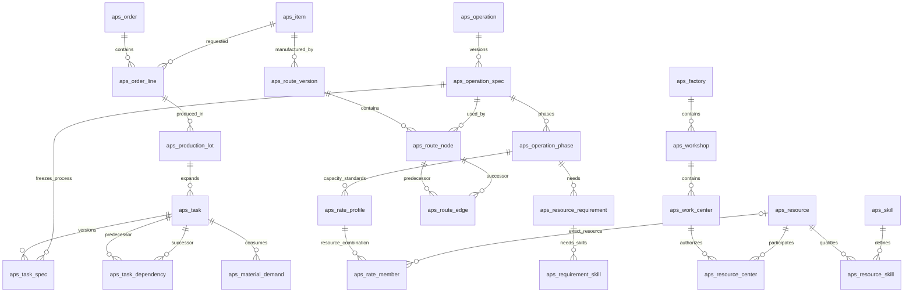
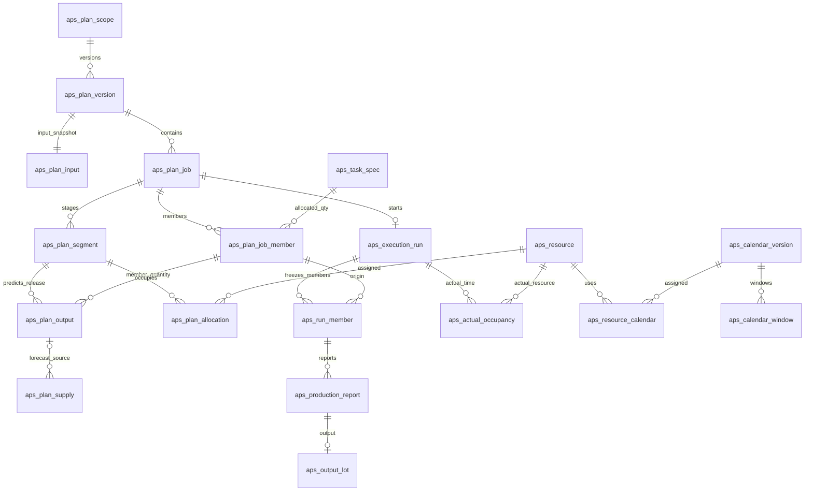
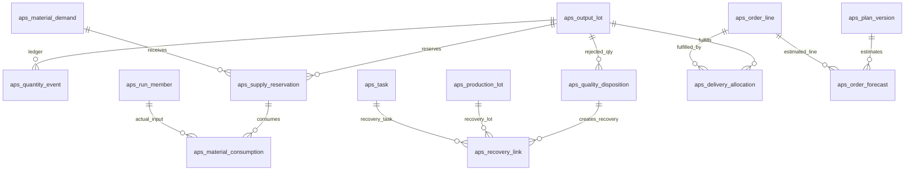

# 生产排程与车间调度数据库设计

> 历史状态：Superseded。2026-09-11 用户批准将首个真实系统收敛为 46 张标准生产闭环表；本 62 表草案仅供追溯，不再作为实施依据。当前正文见 [`架构/数据库设计.md`](../../架构/数据库设计.md)，恢复与映射见 [`开发记录/2026-09-11-生产排程数据库46表收敛.md`](../../开发记录/2026-09-11-生产排程数据库46表收敛.md)。

> 编号：DB-APS-001；版本：1.0.0；文档状态：Draft；创建 / 更新：2026-09-11  
> owner：用户；设计：Codex；规范基线：用户级入口2026.09-r1、规范索引2026.09-r2及项目文档规范  
> 风险：L2，独立业务产品的跨模块数据库设计；阶段：5 技术设计 / InProgress，设计已成稿、尚未实施数据库  
> 授权依据：用户要求编写数据库设计，说明表关系及字段；本轮不建库、不执行迁移、不改原型或真实业务数据  
> 上游：[PRD V2](../../产品/产品需求文档.md)、[专项调研](../../调研/工序与资源调研.md)、[原型契约](../../../../../prototype/production-workbench-v2/contract.md)  
> 检查与未验证项：[数据库设计验证记录](证据/数据库设计验证记录-62表.md)

## 1. 设计结论与阅读顺序

本设计把系统拆成六类事实：**组织和资源、版本化工艺、订单工序实例、计划版本与占用、实际执行与数量账、集成和报表投影**。先看第2节关系图，再看第4至9节逐表字段，最后看第10至13节事务、报表和样例。

关键决定：

1. 工艺模板不等于订单任务；路线版本和工序参数发布后冻结，具体订单引用明确版本。
2. 一道任务可以分批；多个任务可以合批。资源分配挂在“作业阶段”上，不在每个任务字段里塞一个员工ID和设备ID。
3. “合格50件才允许开始”是门槛；“下道消耗上道20件”是数量流转，两者分开建模。
4. 每个候选计划独立保存安排。正式计划通过一个发布指针选择，实际生产记录有独立身份，不随重排复制。
5. 设备 / 人员 / 车间甘特是同一资源占用的不同查询，不建立三份可编辑甘特表。日报也不是第二份报工账。
6. 表结构覆盖PRD目标，包括原型尚未实现的多人席位、独立质检、正式快照及外发重试；结构可表达不等于算法或业务功能已经实现。

### 1.1 数据库与既有系统边界

采用 **PostgreSQL关系模型**，以PostgreSQL 17官方文档作为本文类型及约束语义参考，不声称目标环境正在使用该版本。建议使用独立 `production` schema、`aps_` 表前缀，例如 `production.aps_task`，不混入面试业务表。

项目现有[身份边界](../../../面试项目/架构/若依集成/若依身份与后端单体收敛设计.md)是RuoYi MySQL维护账号权限，PostgreSQL维护业务事实。本设计沿用：`ruoyi_user_id BIGINT` 仅逻辑引用 `sys_user.user_id`，不建立跨数据库外键，不复制密码、角色和权限表。员工可以没有登录账号；报工者与实际执行员工可以不同，均要记录。部署选型仍须核对真实环境，不在本次设计中迁移现有数据库。

### 1.2 设计和实施范围

本次任务为：对齐PRD对象 → 定义表关系 / 字段 / 约束 → 复核数量及版本事务 → 文档静态检查。本文是唯一数据库字段设计正文，PRD继续维护业务规则。后续DDL应从本设计逐项落实并回链，不复制出另一份手工维护的字段字典。

首版采用**一个工厂一个完整调度范围**，允许跨车间，不做跨工厂资源借用；表保留 `factory_id` 隔离。工厂不是SaaS租户，本文不假称已实现多租户。后续若一个法人跨多厂共享员工，需要上移资源身份与锁范围，不能直接复制员工到两厂增加容量。

## 2. 表关系总览

图中省略公共字段；`1:N`表示一对多；两个一对多通过关联表表达多对多。可空关系及复合外键以逐表定义和第10节为准。

| 业务域 | 表范围 / 数量 | 主要回答的问题 |
| --- | --- | --- |
| 组织、资源与日历 | T01–T12，共12张 | 谁在哪个车间、会做什么、何时上班 / 可用 |
| 产品与工艺版本 | T13–T21，共9张 | 产品怎么做、阶段需要哪些角色、工序如何连接 |
| 订单与任务网络 | T22–T30，共9张 | 本次做多少、哪道等哪道、需要消耗什么 |
| 计划及资源占用 | T31–T41，共11张 | 用哪个版本、何时由谁和哪台设备加工 |
| 现场与数量账 | T42–T53，共12张 | 实际做了多少、是否合格、返工和交付如何追溯 |
| 集成、投影与能力标准 | T54–T62，共9张 | 如何防重、下达、预估交期及定义人机组合产能 |

合计62张候选表。它们是按不同生命周期拆分的数据模型，不代表62个独立页面，也不代表本轮已经建表。

### 2.1 从产品工艺到具体任务

### 2.2 从任务到人机占用及现场

`aps_plan_job.job_type=SHARED_BATCH` 就是共享加工批；`SINGLE` 是普通任务的一次安排。合批只有一套阶段 / 资源占用，多条成员保留各产品数量。图中“计划作业启动运行”是来源关系；运行ID不随以后计划版本变化，新版作业通过 `carry_run_id` 引用既有运行。

### 2.3 数量、质量与订单完成

### 2.4 重点基数和连接路径

| 关系 | 基数 / 承载表 | 不能误解为 |
| --- | --- | --- |
| 订单 → 产品行 → 生产实例 → 任务 | 每层1:N | 一张订单只能一个产品；拆实例就增加客户需求 |
| 路线节点 → 工序参数版本 | N:1 | 修改模板会改历史订单任务 |
| 任务 → 前后依赖 | M:N，自关联边表 | 只有线性序号；列表顺序就是依赖 |
| 员工 → 技能 / 工作中心 | M:N，带有效期 | 多技能带来多份工时；归属车间限制了所有借调 |
| 任务 → 计划作业 | M:N，经成员数量关联 | 一个任务永远一条甘特条；两个成员各扣一份炉工时 |
| 作业 → 阶段 → 资源分配 | 1:N → 1:N | 一道工序只允许一个人和一台设备 |
| 产出批 → 预留 → 消耗 | 1:N → 1:N | 一次满足开工门槛就可以无限用料 |
| 不良处置 → 恢复任务 | 1:N，经恢复关联 | 修改原工艺、删除不良历史或重新计算原订单需求 |
| 正式计划 → 实际记录 | 来源关联，非生命周期所有权 | 回滚计划可以撤销生产事实 |

## 3. 字段、类型与公共约定

### 3.1 类型和标记

字段字典中的 `NN` 表示NOT NULL，`NULL`表示允许空值；`—`表示无数据库默认值，创建者必须提供。`FK→表.字段`表示物理外键，`逻辑→`表示外部引用。未写目标字段的FK默认指向目标 `id`。

统一别名：`Q=numeric(18,6)` 数量；`R=numeric(18,9)` 换算比例；`TS=timestamptz(3)` 绝对时间；`CODE=varchar(64)`；`STATE=varchar(32)`；别名用于字典阅读，DDL需展开成真实类型。数量、比例不得使用float/double；件数按 `aps_uom.quantum` 检查取整，计件50%门槛向上取到一个量子。数值精度语义参考[PostgreSQL Numeric](https://www.postgresql.org/docs/17/datatype-numeric.html)。

保存UTC时间点，工厂保存IANA时区。班次和日报边界先按工厂本地日期计算，再转为时间点；不保存“从演示日期起第几分钟”。所有时间区间采用 `[start_at,end_at)`，相邻不重叠。`timestamptz`不保存原始时区名称，业务日历仍须保存时区，参见[时间类型](https://www.postgresql.org/docs/17/datatype-datetime.html)。

### 3.2 公共字段（每张表均实际包含）

| 字段 | 类型 | 必填 / 默认 | 含义及约束 |
| --- | --- | --- | --- |
| id | uuid | NN / 应用生成 | PK；不能使用订单号或姓名作主键；创建前可预生成，标识永不复用 |
| factory_id | uuid | NN / — | FK→aps_factory.id；aps_factory本身无此列 |
| created_at | TS | NN / CURRENT_TIMESTAMP | 数据入库时间，不代替业务发生时间 |
| ruoyi_user_id | bigint | NULL / NULL | 逻辑→sys_user.user_id，创建动作主体；外部系统事件可空，须记录source_system |
| source_system | CODE | NN / LOCAL | 数据来源，如LOCAL、ERP、MES、HR；不是权限凭据 |

所有非工厂表有 `UNIQUE(factory_id,id)`。本域关联默认使用 `(factory_id,关联ID)` → `(factory_id,id)` 复合FK，防止跨工厂误关联，删除默认RESTRICT。外键不会自动为引用列建索引，应显式规划，参见[外键文档](https://www.postgresql.org/docs/17/ddl-constraints.html)。

表类型：**M** 可维护主数据 / 状态投影；**V** 版本内容，草稿可编辑、冻结后业务内容只增新版本；**E** 不可变事件。M/V另包含下列列，E不包含：

| 字段 | 类型 | 必填 / 默认 | 含义及约束 |
| --- | --- | --- | --- |
| updated_at | TS | NN / CURRENT_TIMESTAMP | 每次更新显式刷新，默认值本身不会自动更新 |
| updated_by | bigint | NULL / NULL | 逻辑→sys_user.user_id；后台任务记录来源 |
| row_version | bigint | NN / 0 | 乐观锁，更新时WHERE旧版本并递增；业务输入修订另见plan_scope |

带valid_from/valid_to的资格、装载限额及标准，替换时允许审计化收束旧记录的未来valid_to，再创建不重叠新记录；不得倒改已发生区间或覆盖旧数值。该操作属于生效管理元数据变更，必须递增输入修订；历史计划使用冻结时采用的完整区间和值。工艺标准的数值 / 组合成员、已发布计划内容及E事件没有这种编辑例外。

共同规则：代码和名称非空；状态以varchar加CHECK保存，不建立通用“状态表”。不对历史对象使用通用软删除后重用业务编号；主数据停用、订单取消、事件冲正。核心关系不塞进JSON；JSON只用于不可变输入快照、参数补充、错误上下文和脱敏审计。

## 4. 组织、资源与日历

### T01 `aps_factory` · 工厂（M）
| 字段 | 类型 | 必填 / 默认 | 含义及关系 |
| --- | --- | --- | --- |
| factory_code | CODE | NN / — | 全局唯一工厂代码 |
| name | varchar(128) | NN / — | 工厂名称 |
| timezone | varchar(64) | NN / Asia/Shanghai | IANA时区 |
| status | STATE | NN / ACTIVE | ACTIVE、INACTIVE |
| ruoyi_dept_id | bigint | NULL / NULL | 逻辑→sys_dept.dept_id；组织权限映射，不作资源容量 |

### T02 `aps_workshop` · 车间（M）
| 字段 | 类型 | 必填 / 默认 | 含义及关系 |
| --- | --- | --- | --- |
| workshop_code | CODE | NN / — | UQ(factory_id,workshop_code) |
| name | varchar(128) | NN / — | 车间名 |
| ruoyi_dept_id | bigint | NULL / NULL | 逻辑→sys_dept.dept_id，数据权限映射 |
| manager_user_id | bigint | NULL / NULL | 逻辑→sys_user.user_id，管理负责人 |
| status | STATE | NN / ACTIVE | ACTIVE、INACTIVE |

### T03 `aps_work_center` · 工作中心（M）
| 字段 | 类型 | 必填 / 默认 | 含义及关系 |
| --- | --- | --- | --- |
| workshop_id | uuid | NN / — | FK→aps_workshop |
| center_code | CODE | NN / — | UQ(factory_id,center_code) |
| name | varchar(128) | NN / — | 如机加工中心、人工检验中心 |
| center_kind | STATE | NN / MIXED | MANUAL、MACHINE、MIXED |
| status | STATE | NN / ACTIVE | ACTIVE、INACTIVE；中心本身只作组织汇总 |

中心独立的供电、炉位等限制必须建CAPACITY资源并加入工艺需求；不在中心表再增加一个与设备重复的产能数。

### T04 `aps_resource` · 统一资源身份（M）
| 字段 | 类型 | 必填 / 默认 | 含义及关系 |
| --- | --- | --- | --- |
| resource_code | CODE | NN / — | UQ(factory_id,resource_code) |
| name | varchar(128) | NN / — | 人员 / 设备 / 工位 / 工装名称 |
| resource_type | STATE | NN / — | PERSON、MACHINE、STATION、TOOL、CAPACITY |
| home_workshop_id | uuid | NN / — | FK→aps_workshop，归属而非唯一执行车间 |
| capacity_uom_id | uuid | NN / — | FK→aps_uom，席位 / 台 / kW / kg等 |
| capacity_value | Q | NN / 1 | 正值；PERSON固定1，不能以技能数增大 |
| is_exclusive | boolean | NN / true | 独占资源=true且capacity_value=1；连续容量资源=false |
| status | STATE | NN / ACTIVE | ACTIVE、INACTIVE；维修走日历例外 |

resource_type、capacity_uom_id、is_exclusive一旦被计划或实际引用，不得直接改成另一种资源定义；新定义使用新资源身份并停用旧定义。capacity_value变更必须审计、递增输入修订并冻结到新计划，历史负荷仍按历史输入解释。

### T05 `aps_worker` · 员工业务资料（M）
| 字段 | 类型 | 必填 / 默认 | 含义及关系 |
| --- | --- | --- | --- |
| resource_id | uuid | NN / — | FK→aps_resource，UQ(factory_id,resource_id)，必须PERSON |
| employee_no | CODE | NN / — | UQ(factory_id,employee_no)，不是登录用户名 |
| login_user_id | bigint | NULL / NULL | 逻辑→sys_user.user_id；可无账号，非空值工厂内唯一 |
| team_name | varchar(128) | NULL / NULL | 班组标签，首版不另建HR组织体系 |
| employment_start | date | NN / — | 用工有效起始日期 |
| employment_end | date | NULL / NULL | 结束日期，空表示尚未结束 |
| hr_reference | varchar(128) | NULL / NULL | HR源记录键；与source_system组成非空唯一键 |

不采集薪资、身份证、健康隐私；员工姓名沿resource.name，账号信息仍由RuoYi维护。

### T06 `aps_skill` · 技能 / 能力字典（M）
| 字段 | 类型 | 必填 / 默认 | 含义及关系 |
| --- | --- | --- | --- |
| skill_code | CODE | NN / — | UQ(factory_id,skill_code) |
| name | varchar(128) | NN / — | 焊接、检验、五轴加工等 |
| applies_to | STATE | NN / PERSON | PERSON、EQUIPMENT；后者用于机器能力认证 |
| max_level | smallint | NN / 5 | 正整数，等级含义由工艺配置确认 |
| status | STATE | NN / ACTIVE | ACTIVE、INACTIVE |

### T07 `aps_resource_skill` · 资源技能有效记录（V）
| 字段 | 类型 | 必填 / 默认 | 含义及关系 |
| --- | --- | --- | --- |
| resource_id | uuid | NN / — | FK→aps_resource |
| skill_id | uuid | NN / — | FK→aps_skill |
| level | smallint | NN / — | 1至对应技能max_level |
| valid_from | TS | NN / — | 资格生效 |
| valid_to | TS | NULL / NULL | 到期，不含该时点；空为无上界 |
| certification_ref | varchar(128) | NULL / NULL | 证书或确认依据编号，不存证件内容 |

同一资源同一技能的有效期不得重叠，期满/等级变化建立新记录。已发布计划冻结所采用的记录及值。

### T08 `aps_resource_center` · 中心资格与借调（V）
| 字段 | 类型 | 必填 / 默认 | 含义及关系 |
| --- | --- | --- | --- |
| resource_id | uuid | NN / — | FK→aps_resource |
| work_center_id | uuid | NN / — | FK→aps_work_center |
| valid_from | TS | NN / — | 允许在中心工作的起点 |
| valid_to | TS | NULL / NULL | 有效截止 |
| assignment_kind | STATE | NN / HOME | HOME、QUALIFIED、SECONDMENT |
| approved_by | bigint | NN / — | 逻辑→sys_user.user_id；资格 / 借调确认人 |
| reason | varchar(500) | NN / — | 归属或借调依据 |

UQ(factory_id,resource_id,work_center_id,valid_from)，相同三项的有效期不重叠；不同中心可重叠资格，但实际占用仍按resource_id去重。

### T09 `aps_calendar_version` · 日历版本（V）
| 字段 | 类型 | 必填 / 默认 | 含义及关系 |
| --- | --- | --- | --- |
| calendar_code | CODE | NN / — | 稳定日历编码 |
| version_no | integer | NN / — | UQ(factory_id,calendar_code,version_no)，正整数 |
| name | varchar(128) | NN / — | 班制或设备日历名 |
| timezone | varchar(64) | NN / — | 日历展开时区 |
| horizon_start | TS | NN / — | 已明确展开窗口的起点 |
| horizon_end | TS | NN / — | 已展开终点；区间外为未知，不默认全天可用 |
| status | STATE | NN / DRAFT | DRAFT、PUBLISHED、RETIRED |
| published_at | TS | NULL / NULL | 发布后必须有值 |

### T10 `aps_calendar_window` · 班次与例外窗口（V）
| 字段 | 类型 | 必填 / 默认 | 含义及关系 |
| --- | --- | --- | --- |
| calendar_version_id | uuid | NN / — | FK→aps_calendar_version |
| start_at | TS | NN / — | 窗口起点，位于日历范围 |
| end_at | TS | NN / — | 必须大于start_at |
| window_type | STATE | NN / BASE_WORK | BASE_WORK、OVERTIME、LEAVE、TRAINING、MAINTENANCE、BREAK |
| capacity_value | Q | NN / — | 可用窗口正值；不可用窗口为0 |
| approval_status | STATE | NN / APPROVED | PENDING、APPROVED、REJECTED；加班待批不产生容量 |
| approved_by | bigint | NULL / NULL | 逻辑→sys_user.user_id；加班及例外批准必须有值 |
| reason | varchar(500) | NN / — | 班次来源 / 例外原因 |

同类BASE窗口不重叠。有效窗口=已批BASE/OVERTIME并集减去已批不可用窗口，不能叠加两个班次增加容量；冲突容量取更严格限制并要求确认。原始周期班制可由HR导入展开，首版此表保存绝对窗口，不设计另一套无限递归日历语言。

### T11 `aps_resource_calendar` · 资源日历绑定（V）
| 字段 | 类型 | 必填 / 默认 | 含义及关系 |
| --- | --- | --- | --- |
| resource_id | uuid | NN / — | FK→aps_resource |
| calendar_version_id | uuid | NN / — | FK→aps_calendar_version，必须已发布 |
| valid_from | TS | NN / — | 绑定起点 |
| valid_to | TS | NN / — | 绑定终点，必须在所引日历展开范围内 |

同一资源的有效绑定区间不得重叠。个人请假通过专用日历新版本绑定，不修改所有员工共享旧日历；历史实际工时来自实际占用，不用新日历倒算。

### T12 `aps_uom` · 计量单位（M）
| 字段 | 类型 | 必填 / 默认 | 含义及关系 |
| --- | --- | --- | --- |
| uom_code | CODE | NN / — | UQ(factory_id,uom_code)，如PCS、KG、SEAT |
| name | varchar(64) | NN / — | 件、公斤、人员席位等 |
| dimension | STATE | NN / — | COUNT、MASS、VOLUME、CAPACITY |
| quantum | Q | NN / — | 最小合法数量增量，件=1、kg可=0.001；必须>0 |
| status | STATE | NN / ACTIVE | ACTIVE、INACTIVE |

不存在通用“件转公斤”的默认换算；工艺批容量占用和材料用量必须保存该产品已确认的转换因子。单位被引用后uom_code、dimension、quantum不可修改；更换计量基准建立新定义并受控迁移，名称和停用状态可维护。

## 5. 产品与版本化工艺

### T13 `aps_item` · 产品 / 物料版本（V）
| 字段 | 类型 | 必填 / 默认 | 含义及关系 |
| --- | --- | --- | --- |
| item_code | CODE | NN / — | SKU / 物料代码 |
| revision_no | varchar(32) | NN / — | UQ(factory_id,item_code,revision_no) |
| name | varchar(200) | NN / — | 该版本名称 |
| item_type | STATE | NN / PRODUCT | PRODUCT、SEMI_FINISHED、RAW_MATERIAL |
| base_uom_id | uuid | NN / — | FK→aps_uom；后续数量归一到该单位 |
| external_id | varchar(128) | NULL / NULL | 非空时UQ(factory_id,source_system,external_id,revision_no) |
| status | STATE | NN / DRAFT | DRAFT、ACTIVE、RETIRED；ACTIVE内容冻结 |

### T14 `aps_operation` · 工序定义（M）
| 字段 | 类型 | 必填 / 默认 | 含义及关系 |
| --- | --- | --- | --- |
| operation_code | CODE | NN / — | UQ(factory_id,operation_code) |
| name | varchar(128) | NN / — | 加工、热处理、检验等定义名 |
| description | text | NULL / NULL | 工艺说明 |
| status | STATE | NN / ACTIVE | ACTIVE、INACTIVE |

### T15 `aps_operation_spec` · 工序参数版本（V）
| 字段 | 类型 | 必填 / 默认 | 含义及关系 |
| --- | --- | --- | --- |
| operation_id | uuid | NN / — | FK→aps_operation |
| spec_no | integer | NN / — | UQ(factory_id,operation_id,spec_no) |
| mode | STATE | NN / — | MANUAL、MACHINE、AUTO、BATCH、WAIT |
| output_item_id | uuid | NN / — | FK→aps_item；明确工序半成品状态，不能只按产品名认定可消费 |
| quality_policy | STATE | NN / REPORT_RELEASE | REPORT_RELEASE、INSPECTION_REQUIRED |
| compatibility_key | varchar(128) | NULL / NULL | 批次配方 / 工艺兼容组，BATCH必填 |
| min_batch_qty | Q | NULL / NULL | 允许最小批量，使用输出基本单位 |
| max_batch_qty | Q | NULL / NULL | 允许最大批量，不小于最小值 |
| status | STATE | NN / DRAFT | DRAFT、PUBLISHED、RETIRED |
| approved_by | bigint | NULL / NULL | 逻辑→sys_user.user_id；发布时必填 |

### T16 `aps_operation_phase` · 工艺阶段参数（V）
| 字段 | 类型 | 必填 / 默认 | 含义及关系 |
| --- | --- | --- | --- |
| operation_spec_id | uuid | NN / — | FK→aps_operation_spec |
| phase_no | integer | NN / — | UQ(factory_id,operation_spec_id,phase_no)，阶段顺序 |
| phase_kind | STATE | NN / — | SETUP、RUN、UNLOAD、WAIT、TRANSFER、RECOVERY_SETUP |
| duration_mode | STATE | NN / FIXED | FIXED、PER_UNIT |
| interruptible | boolean | NN / false | 能否分段跨班 |
| resume_setup_seconds | bigint | NN / 0 | 每次恢复新增准备秒数 |
| hold_on_pause | boolean | NN / false | 暂停时是否保留设备 / 工装，按需求角色进一步解释 |
| releases_output | boolean | NN / false | 本阶段结束才形成产出；普通按件运行可分批释放 |

实际数值由T61批准的产能标准提供。FIXED强制标准seconds_per_unit=0，时长为fixed_seconds；PER_UNIT使用 `ceil(fixed_seconds + quantity × seconds_per_unit)`，允许固定偏置。固定批周期不得使用PER_UNIT乘成员数量。多个阶段有自己的资源需求，技术等待不凭空占人工。

### T17 `aps_resource_requirement` · 阶段资源角色 / 席位（V）
| 字段 | 类型 | 必填 / 默认 | 含义及关系 |
| --- | --- | --- | --- |
| phase_id | uuid | NN / — | FK→aps_operation_phase |
| role_code | CODE | NN / — | UQ(factory_id,phase_id,role_code)，如OPERATOR、HELPER、FURNACE |
| resource_type | STATE | NN / — | 与aps_resource.resource_type枚举一致 |
| work_center_id | uuid | NN / — | FK→aps_work_center；候选中心资格 |
| fixed_resource_id | uuid | NULL / NULL | FK→aps_resource；指定设备或指定资源，可空则择优 |
| seat_count | integer | NN / 1 | 必需独立席位数，>=1 |
| demand_per_seat | Q | NN / 1 | 每席位所占容量；PERSON固定1 |
| demand_uom_id | uuid | NN / — | FK→aps_uom，须与候选资源容量单位一致 |
| continuity_key | CODE | NULL / NULL | 同一作业多个阶段必须同一资源时用同一key；如同一炉装卸与运行 |
| distinct_group | CODE | NULL / NULL | 同组同时需要不同资源；人员席位默认在重叠时段不得重复充数 |

默认候选为“指定中心内具有全部必需能力的资源”；一个资源可有多个中心资格。多人任务靠多席位及多分配行表达，不使用people_ids字符串。同一人仅禁止在重叠时段充当两个必须不同的席位，顺序阶段可复用；continuity_key可要求同一人装卸。

### T18 `aps_requirement_skill` · 角色所需技能（V）
| 字段 | 类型 | 必填 / 默认 | 含义及关系 |
| --- | --- | --- | --- |
| requirement_id | uuid | NN / — | FK→aps_resource_requirement |
| skill_id | uuid | NN / — | FK→aps_skill |
| minimum_level | smallint | NN / — | >=1，全部记录为AND条件 |

UQ(factory_id,requirement_id,skill_id)。复杂技能OR组合需另行设计，不能以JSON表达式绕过资格校验。

### T19 `aps_route_version` · 产品工艺路线版本（V）
| 字段 | 类型 | 必填 / 默认 | 含义及关系 |
| --- | --- | --- | --- |
| item_id | uuid | NN / — | FK→aps_item，所制造产品版本 |
| route_code | CODE | NN / — | 路线编码 |
| version_no | integer | NN / — | UQ(factory_id,route_code,version_no) |
| name | varchar(128) | NN / — | 路线名称 |
| status | STATE | NN / DRAFT | DRAFT、PUBLISHED、RETIRED |
| published_at | TS | NULL / NULL | 发布后非空 |
| approved_by | bigint | NULL / NULL | 逻辑→sys_user.user_id，发布后非空 |

### T20 `aps_route_node` · 路线节点（V）
| 字段 | 类型 | 必填 / 默认 | 含义及关系 |
| --- | --- | --- | --- |
| route_version_id | uuid | NN / — | FK→aps_route_version |
| node_code | CODE | NN / — | UQ(factory_id,route_version_id,node_code)，非简单执行顺序 |
| operation_spec_id | uuid | NN / — | FK→aps_operation_spec，必须已发布 |
| quantity_factor | R | NN / 1 | 每一单位生产实例需求展开多少工序输出单位，>0 |
| required_for_completion | boolean | NN / true | 是否必需完成节点 |
| is_delivery_output | boolean | NN / false | 是否最终可交付产出节点；见交付账规则 |

### T21 `aps_route_edge` · 路线模板关系（V）
| 字段 | 类型 | 必填 / 默认 | 含义及关系 |
| --- | --- | --- | --- |
| route_version_id | uuid | NN / — | FK→aps_route_version |
| from_node_id | uuid | NN / — | FK→aps_route_node，与路线一致 |
| to_node_id | uuid | NN / — | FK→aps_route_node，与路线一致且不等于from |
| relation_type | STATE | NN / FINISH | FINISH、QUANTITY、TRANSFER |
| threshold_mode | STATE | NULL / NULL | ABSOLUTE、RATIO；QUANTITY时必填 |
| threshold_qty | Q | NULL / NULL | ABSOLUTE时>0，使用上序输出基本单位 |
| threshold_ratio | R | NULL / NULL | RATIO时0<值<=1，展开时乘冻结分母并向上取量子 |
| usage_ratio | R | NULL / NULL | TRANSFER时每下序输出所需上序输出数量，>0 |
| transfer_qty | Q | NULL / NULL | TRANSFER时每次释放批量，上序输出单位，>0 |
| lag_seconds | bigint | NN / 0 | 非负等待 / 转运秒数 |
| lag_basis | STATE | NN / ELAPSED | ELAPSED、WORKING |
| lag_calendar_version_id | uuid | NULL / NULL | FK→aps_calendar_version；WORKING时必填 |

UQ(factory_id,route_version_id,from_node_id,to_node_id,relation_type)。发布时拓扑校验无环。跨产品具体依赖不放进单产品模板，展开后写task_dependency或material_demand。

## 6. 订单、实例与工序网络

### T22 `aps_order` · 生产订单（M）
| 字段 | 类型 | 必填 / 默认 | 含义及关系 |
| --- | --- | --- | --- |
| order_no | CODE | NN / — | UQ(factory_id,order_no) |
| external_id | varchar(128) | NULL / NULL | 非空时UQ(factory_id,source_system,external_id) |
| external_revision | varchar(64) | NULL / NULL | 来源版本 / 同步顺序校验 |
| customer_reference | varchar(200) | NULL / NULL | 客户业务参考，不保存联系人隐私 |
| priority | integer | NN / 50 | 0至100，数值越大越优先 |
| earliest_start_at | TS | NN / — | 最早允许开工，不等于资源一定可用 |
| promised_at | TS | NN / — | 当前生产承诺；修改必须记录审计与计划输入 |
| original_promised_at | TS | NN / — | 首次已确认承诺，后续不得覆盖 |
| status | STATE | NN / DRAFT | DRAFT、RELEASED、IN_PROGRESS、COMPLETED、CANCELLED |
| cancellation_reason | varchar(500) | NULL / NULL | CANCELLED时必填，已执行须有在制处置 |

### T23 `aps_order_line` · 产品需求行（M）
| 字段 | 类型 | 必填 / 默认 | 含义及关系 |
| --- | --- | --- | --- |
| order_id | uuid | NN / — | FK→aps_order |
| line_no | integer | NN / — | UQ(factory_id,order_id,line_no) |
| item_id | uuid | NN / — | FK→aps_item |
| ordered_qty | Q | NN / — | >0，使用item基本单位；有执行后变更须受控 |
| uom_id | uuid | NN / — | FK→aps_uom，必须等于item基本单位 |
| route_version_id | uuid | NN / — | FK→aps_route_version，产品一致、已发布 |
| promised_at | TS | NULL / NULL | 行级承诺，空继承订单；输入快照中必须展开为确定值 |
| external_line_id | varchar(128) | NULL / NULL | 非空时同订单内唯一 |

### T24 `aps_production_lot` · 产品生产实例（M）
| 字段 | 类型 | 必填 / 默认 | 含义及关系 |
| --- | --- | --- | --- |
| order_line_id | uuid | NN / — | FK→aps_order_line |
| lot_no | CODE | NN / — | UQ(factory_id,lot_no) |
| route_version_id | uuid | NN / — | FK→aps_route_version，实例采用的冻结版本 |
| lot_kind | STATE | NN / NORMAL | NORMAL、REWORK、REPLACEMENT |
| planned_qty | Q | NN / — | >0，原产品基本单位；恢复实例不增加ordered_qty |
| source_disposition_id | uuid | NULL / NULL | FK→aps_quality_disposition，恢复实例必填 |
| status | STATE | NN / CREATED | CREATED、IN_PROGRESS、COMPLETED、CANCELLED |

正常有效实例数量之和不得超过产品需求；返工 / 补产按处置量单独校验，不计新增客户需求。

### T25 `aps_task` · 稳定工序任务身份（M）
| 字段 | 类型 | 必填 / 默认 | 含义及关系 |
| --- | --- | --- | --- |
| production_lot_id | uuid | NN / — | FK→aps_production_lot |
| task_no | CODE | NN / — | UQ(factory_id,task_no) |
| route_node_id | uuid | NULL / NULL | FK→aps_route_node；正常展开必填，特殊返工节点可空 |
| current_spec_id | uuid | NN / — | FK→aps_task_spec，且该spec.task_id=id；循环FK延迟到事务结束 |
| status | STATE | NN / READY | READY、RUNNING、PAUSED、COMPLETED、CANCELLED |
| responsible_user_id | bigint | NULL / NULL | 逻辑→sys_user.user_id；协调负责人，不产生人工占用 |

不在此表写person_id / machine_id / planned_start；一个任务可以多段、多人员、多个候选安排。合格量可通过账本派生，不以手填百分比作为事实。

### T26 `aps_task_spec` · 任务需求快照（V，创建后冻结）
| 字段 | 类型 | 必填 / 默认 | 含义及关系 |
| --- | --- | --- | --- |
| task_id | uuid | NN / — | FK→aps_task |
| spec_no | integer | NN / — | UQ(factory_id,task_id,spec_no) |
| operation_spec_id | uuid | NN / — | FK→aps_operation_spec，冻结完整阶段和资源需求 |
| required_qty | Q | NN / — | >0，明确该工序输出需求 |
| output_item_id | uuid | NN / — | FK→aps_item，与operation_spec输出一致 |
| uom_id | uuid | NN / — | FK→aps_uom，与输出基本单位一致 |
| earliest_start_at | TS | NN / — | 已展开为确定的最早开始时间 |
| required_for_completion | boolean | NN / true | 必要工序标记冻结 |
| is_delivery_output | boolean | NN / false | 最终交付产出资格冻结 |
| change_reason | varchar(500) | NN / — | 初次展开或未开工规格变更说明 |

数量、工艺参数变化建新spec，当前指针切换并使候选过期。已开始任务不能替换已执行spec；剩余重制 / 返工形成新任务。跨班次实际换人不改任务工艺，记录实际分段。

### T27 `aps_task_dependency` · 非消耗前置关系（M）
| 字段 | 类型 | 必填 / 默认 | 含义及关系 |
| --- | --- | --- | --- |
| from_task_id | uuid | NN / — | FK→aps_task，允许不同产品行 / 订单但同厂 |
| to_task_id | uuid | NN / — | FK→aps_task，不得等于from |
| from_spec_id | uuid | NN / — | FK→aps_task_spec，必须属于from任务 |
| to_spec_id | uuid | NN / — | FK→aps_task_spec，必须属于to任务 |
| relation_type | STATE | NN / FINISH | FINISH、QUANTITY；不表示材料扣减 |
| threshold_mode | STATE | NULL / NULL | ABSOLUTE、RATIO；QUANTITY必填 |
| denominator_qty | Q | NULL / NULL | 比例门槛冻结分母，例如101件 |
| threshold_ratio | R | NULL / NULL | RATIO时0<值<=1 |
| threshold_qty | Q | NULL / NULL | 最终有效门槛，例如ceil(101×0.5)=51；QUANTITY必填 |
| uom_id | uuid | NULL / NULL | FK→aps_uom；QUANTITY时使用上序输出单位 |
| lag_seconds | bigint | NN / 0 | >=0 |
| lag_basis | STATE | NN / ELAPSED | ELAPSED、WORKING |
| lag_calendar_version_id | uuid | NULL / NULL | FK→aps_calendar_version；WORKING时必填 |

UQ(factory_id,from_task_id,to_task_id,relation_type)。FINISH可转量达到该冻结前置量并完成必要质量放行；QUANTITY以有效合格释放累计判定，**不因之后正常消耗使门槛倒退**。关系更改只影响未执行目标和新计划输入；正式执行读冻结输入，不临时读当前边表。

### T28 `aps_material_demand` · 工序消耗需求（M）
| 字段 | 类型 | 必填 / 默认 | 含义及关系 |
| --- | --- | --- | --- |
| task_id | uuid | NN / — | FK→aps_task，消费方 |
| task_spec_id | uuid | NN / — | FK→aps_task_spec，属于消费任务 |
| demand_no | integer | NN / — | UQ(factory_id,task_spec_id,demand_no) |
| item_id | uuid | NN / — | FK→aps_item，所需原料 / 半成品状态 |
| uom_id | uuid | NN / — | FK→aps_uom，该item基本单位 |
| required_source_task_id | uuid | NULL / NULL | FK→aps_task；必须来自指定上序时填，空允许匹配外部供给 |
| usage_ratio | R | NN / — | 每单位本工序输出所需此物料基本数量，>0 |
| total_required_qty | Q | NN / — | 冻结需求量，依qty×ratio按物料量子取整 |
| first_transfer_qty | Q | NN / — | 首次开工最低输入量，>0且<=总量 |
| transfer_qty | Q | NN / — | 连续转移批大小，尾批取剩余，>0 |
| lag_seconds | bigint | NN / 0 | 转运及放行后等待秒数；有限搬运资源另建工序 |
| lag_basis | STATE | NN / ELAPSED | ELAPSED、WORKING，从TRANSFER模板边复制 |
| lag_calendar_version_id | uuid | NULL / NULL | FK→aps_calendar_version；WORKING时必填 |

有指定来源的消耗需求同时进入拓扑校验，但不能又当成“完成全部上序”依赖。一个任务可有多物料需求，任一投入时刻每个需求都满足才能生产。

### T29 `aps_sync_group` · 独立同步组（M）
| 字段 | 类型 | 必填 / 默认 | 含义及关系 |
| --- | --- | --- | --- |
| group_code | CODE | NN / — | UQ(factory_id,group_code) |
| sync_type | STATE | NN / SAME_START | SAME_START、SAME_END、BOTH |
| tolerance_seconds | bigint | NN / 0 | >=0，同步容差 |
| status | STATE | NN / ACTIVE | ACTIVE、INACTIVE；变更使输入修订递增 |

### T30 `aps_sync_member` · 同步成员（M）
| 字段 | 类型 | 必填 / 默认 | 含义及关系 |
| --- | --- | --- | --- |
| sync_group_id | uuid | NN / — | FK→aps_sync_group |
| task_id | uuid | NN / — | FK→aps_task |
| task_spec_id | uuid | NN / — | FK→aps_task_spec，属于task |

UQ(factory_id,sync_group_id,task_id)，组至少两个成员。同步约束默认针对成员完整任务起止，若任务拆批则对其所有段的最早开始 / 最晚结束检查；同步不能让两个独立作业共占单容量机器。

## 7. 计划版本、合批与资源占用

### T31 `aps_plan_scope` · 全厂调度范围及正式指针（M）
| 字段 | 类型 | 必填 / 默认 | 含义及关系 |
| --- | --- | --- | --- |
| scope_code | CODE | NN / FACTORY | UQ(factory_id)，首版每厂唯一范围 |
| current_version_id | uuid | NULL / NULL | FK→aps_plan_version，必须属于此scope；空表示尚未发布 |
| definition_revision | bigint | NN / 0 | 订单、工艺、依赖、日历、技能等有效输入每次变更递增 |
| execution_revision | bigint | NN / 0 | 实际开停、质量、数量等变化递增 |
| publication_no | bigint | NN / 0 | 发布序列，唯一正式版本切换的CAS依据 |

### T32 `aps_plan_version` · 计划版本（V）
| 字段 | 类型 | 必填 / 默认 | 含义及关系 |
| --- | --- | --- | --- |
| scope_id | uuid | NN / — | FK→aps_plan_scope |
| version_no | bigint | NN / — | UQ(factory_id,scope_id,version_no) |
| base_version_id | uuid | NULL / NULL | FK→aps_plan_version，同scope，初版可空 |
| input_definition_revision | bigint | NN / — | 求解开始的基础输入版本 |
| input_execution_revision | bigint | NN / — | 求解开始的实际执行水位 |
| horizon_start | TS | NN / — | 求解未来窗口起点 |
| horizon_end | TS | NN / — | >起点；历史已执行锚点可早于此范围但不可重新调度 |
| status | STATE | NN / DRAFT | DRAFT、SOLVING、FEASIBLE、CONFLICT、CANCELLED、FAILED、PUBLISHED、SUPERSEDED |
| solver_name | varchar(128) | NN / — | 求解实现及版本，不填模糊的AI自动排程 |
| strategy_json | jsonb | NN / {} | schema校验的目标权重、时限与参数；不存核心关系 |
| result_kind | STATE | NULL / NULL | FEASIBLE、INFEASIBLE_PROVEN、TIMEOUT_WITH_SOLUTION、TIMEOUT_NO_SOLUTION、INVALID_INPUT |
| started_at | TS | NULL / NULL | 求解开始时间 |
| finished_at | TS | NULL / NULL | 求解结束 / 取消时间 |
| last_validation_id | uuid | NULL / NULL | 最新完整校验批号，和问题表validation_run_id对应；空表示未完成校验 |
| validated_at | TS | NULL / NULL | 完整校验结束时间；没有问题行不代表已经校验 |
| validated_content_sha256 | char(64) | NULL / NULL | 所校验候选安排、输入hash及两类修订号的规范化摘要 |
| published_at | TS | NULL / NULL | 正式发布时非空 |
| published_by | bigint | NULL / NULL | 逻辑→sys_user.user_id，发布时非空 |
| publish_note | varchar(1000) | NULL / NULL | 调整原因及范围，发布时必填 |

一次候选更改产生新的候选版本或使尚未冻结的草稿重新进入DRAFT；已发布业务内容不更新。TIMEOUT_NO_SOLUTION不等于已证明无解。

### T33 `aps_plan_input` · 不可变输入包（E）
| 字段 | 类型 | 必填 / 默认 | 含义及关系 |
| --- | --- | --- | --- |
| plan_version_id | uuid | NN / — | FK→aps_plan_version，UQ(factory_id,plan_version_id) |
| schema_version | integer | NN / 1 | 快照格式版本 |
| captured_at | TS | NN / — | 同一一致性读取的截止时间 |
| content_sha256 | char(64) | NN / — | 按约定规范化JSON计算哈希，防快照漂移 |
| payload | jsonb | NN / — | 完整不可变输入，结构要求见下文 |

payload必须包含：选中订单及承诺 / 数量快照、task_spec及完整工艺阶段 / 角色 / 批准产能标准及其资源组合、依赖边和消耗需求、同步成员、资源资格、装载上限及转换、展开后的有效日历窗口、锁定锚点、实际未结束占用、供给 / 预留 / 消耗水位、来源版本。每类对象保存ID与本次采用值；只有ID或hash不构成可复算快照。JSON不参与当前主数据编辑，只服务冻结、复算和跨版本解释；DDL实施前补JSON Schema校验。

### T34 `aps_plan_job` · 计划作业 / 共享加工批（V）
| 字段 | 类型 | 必填 / 默认 | 含义及关系 |
| --- | --- | --- | --- |
| plan_version_id | uuid | NN / — | FK→aps_plan_version |
| job_code | CODE | NN / — | UQ(factory_id,plan_version_id,job_code)，如H1 |
| job_type | STATE | NN / SINGLE | SINGLE、SHARED_BATCH |
| cycle_spec_id | uuid | NN / — | FK→aps_operation_spec，采用的共同周期与资源需求 |
| work_center_id | uuid | NN / — | FK→aps_work_center，执行中心 |
| compatibility_key | varchar(128) | NULL / NULL | SHARED_BATCH时必填，冻结兼容结论 |
| carry_run_id | uuid | NULL / NULL | FK→aps_execution_run；携带已发生运行，不新建第二次运行 |
| planned_start | TS | NN / — | 作业第一段开始 |
| planned_end | TS | NN / — | 作业最后一段结束，>开始 |

SINGLE恰好一条成员；SHARED_BATCH至少两条。多任务共享时周期和阶段需求须等价并通过工艺确认，不能只看compatible字符串。具体炉的装载上限来自T58，成员换算来自T59，不能用并发容量1代替装载容量200件。

### T35 `aps_plan_job_member` · 作业成员及分配量（V）
| 字段 | 类型 | 必填 / 默认 | 含义及关系 |
| --- | --- | --- | --- |
| plan_version_id | uuid | NN / — | FK→aps_plan_version，与job相同 |
| plan_job_id | uuid | NN / — | FK→aps_plan_job |
| task_id | uuid | NN / — | FK→aps_task |
| task_spec_id | uuid | NN / — | FK→aps_task_spec，属于task且存在于输入快照 |
| allocated_qty | Q | NN / — | >0，该作业实际安排的工序数量 |
| uom_id | uuid | NN / — | FK→aps_uom，与task_spec一致 |

UQ(factory_id,plan_job_id,task_id)。一个任务可出现在多个作业中，但**同一计划版本内**各有效成员量之和等于需要安排的总量；旧版不能参与新版本分配量求和。已生产部分通过carry_run锚点计入，不得再次产生新待生产量。

### T36 `aps_plan_segment` · 计划阶段 / 中断分段（V）
| 字段 | 类型 | 必填 / 默认 | 含义及关系 |
| --- | --- | --- | --- |
| plan_version_id | uuid | NN / — | FK→aps_plan_version，和job一致 |
| plan_job_id | uuid | NN / — | FK→aps_plan_job |
| phase_id | uuid | NN / — | FK→aps_operation_phase，属于job周期spec |
| rate_profile_id | uuid | NN / — | FK→aps_rate_profile，属于该phase、在本版输入中且匹配本段资源组合 |
| segment_no | integer | NN / — | UQ(factory_id,plan_job_id,segment_no) |
| start_at | TS | NN / — | 分段开始 |
| end_at | TS | NN / — | >start_at |
| work_qty | Q | NULL / NULL | PER_UNIT阶段本段实际安排的加工量，使用rate_profile.output_uom；FIXED为空；加工量不等于本段质量释放量 |

分段表达时间及加工量，释放数量在T60逐成员记录。PER_UNIT同phase分段work_qty合计必须覆盖作业该阶段应加工量；固定偏置只在该阶段首次执行计一次，恢复准备按T16追加，不能每切一段就重复整批固定工时。恢复需不同资源时必须有明确RECOVERY_SETUP阶段，禁止凭空复制人工；本设计不以共享批的异单位成员量直接算PER_UNIT总量，缺共同标准时采用批准固定批周期或拆开加工。准备和等待不自动产出；固定批运行及卸载不能各计一遍批量。连续转移批直接记录20、20、20件，不以有限精度的1/3比例反推数量。

### T37 `aps_plan_allocation` · 阶段资源预约（V）
| 字段 | 类型 | 必填 / 默认 | 含义及关系 |
| --- | --- | --- | --- |
| plan_version_id | uuid | NN / — | FK→aps_plan_version，与segment一致 |
| plan_segment_id | uuid | NN / — | FK→aps_plan_segment |
| requirement_id | uuid | NN / — | FK→aps_resource_requirement，属于阶段phase |
| seat_no | integer | NN / — | 1至seat_count，独立协作席位 |
| resource_id | uuid | NN / — | FK→aps_resource，具体人 / 设备 / 工装 / 限额 |
| start_at | TS | NN / — | 实际计划占用起点，通常等于段起点 |
| end_at | TS | NN / — | >起点；持续保留资源时覆盖等待区间，必须在job范围内 |
| demand_units | Q | NN / — | 正值，容量需求，不是产品件数 |
| uom_id | uuid | NN / — | FK→aps_uom，资源容量单位 |
| exclusive_snapshot | boolean | NN / — | 本版采用的独占属性 |
| enforce_exclusive | boolean | NN / false | 约束门标志；独立校验成功后置true，发布前必须为true |

UQ(factory_id,plan_segment_id,requirement_id,seat_no)。共享批只在作业阶段建预约一次，不为每个成员复制；同一阶段人员每个必需席位使用不同人。若设备承担多个同义角色，工艺需求在发布前归一成一个物理角色，禁止靠重复预约后在报表去重掩盖需求冲突。enforce_exclusive只用于数据库约束门，不表示用户锁定；冲突草稿可保留false但不能发布。

### T38 `aps_plan_supply` · 计划态供需配对（V）
| 字段 | 类型 | 必填 / 默认 | 含义及关系 |
| --- | --- | --- | --- |
| plan_version_id | uuid | NN / — | FK→aps_plan_version |
| demand_id | uuid | NN / — | FK→aps_material_demand；字段值以本版输入快照为准 |
| supply_output_id | uuid | NULL / NULL | FK→aps_plan_output，同版上序某个精确释放批次 |
| source_output_lot_id | uuid | NULL / NULL | FK→aps_output_lot，既有实物或已确认外部供给 |
| allocated_qty | Q | NN / — | >0，消费物料基本单位 |
| expected_available_at | TS | NN / — | 预测可用时间 |
| required_at | TS | NN / — | 预计投入时点，须>=可用时间+等待 |
| source_confidence | STATE | NN / CONFIRMED | CONFIRMED、FORECAST；FORECAST不能直接现场领用 |

两个供给ID恰好一个非空。计划分配不减少实际库存余额；同版对同一上序预测或实际供给的分配总量不得超过可用量，不能在多个订单候选中重复承诺正式供给。

### T39 `aps_plan_lock` · 任务锁定锚点（M）
| 字段 | 类型 | 必填 / 默认 | 含义及关系 |
| --- | --- | --- | --- |
| scope_id | uuid | NN / — | FK→aps_plan_scope |
| task_id | uuid | NN / — | FK→aps_task |
| anchor_version_id | uuid | NN / — | FK→aps_plan_version，采用的已冻结安排 |
| lock_time | boolean | NN / false | 保留锚点中该任务所有成员 / 分段时间 |
| lock_resource | boolean | NN / false | 保留所有阶段角色与资源组合 |
| active | boolean | NN / true | 解除时false，保留锚点及审计 |
| reason | varchar(500) | NN / — | 锁定 / 解除依据 |

active记录UQ(factory_id,scope_id,task_id)；至少一个锁维度=true。锚点必须冻结，编辑中的草稿先创建不可变锚点版本。锁定不免除技能、停机和供给校验。

### T40 `aps_plan_issue` · 求解 / 校验问题（E）
| 字段 | 类型 | 必填 / 默认 | 含义及关系 |
| --- | --- | --- | --- |
| plan_version_id | uuid | NN / — | FK→aps_plan_version |
| validation_run_id | uuid | NN / — | 本次校验批号，应用生成 |
| issue_code | CODE | NN / — | 稳定错误码，例如RESOURCE_OVERLAP、MISSING_RATE |
| severity | STATE | NN / ERROR | ERROR、WARNING |
| task_id | uuid | NULL / NULL | FK→aps_task |
| resource_id | uuid | NULL / NULL | FK→aps_resource |
| message | text | NN / — | 可定位原因和修正建议 |
| context_json | jsonb | NN / {} | 冲突对象 / 时间 / 输入版本等结构化上下文 |

新校验建立新run_id，旧结果保留；当前展示按plan_version.last_validation_id选择最新完整校验，不把旧错误简单标删除。零问题也必须写版本的校验完成时间和摘要；发布仍重新验证，不以“查不到错误行”作为通过依据。

### T41 `aps_daily_baseline` · 冻结日计划基线（E）
| 字段 | 类型 | 必填 / 默认 | 含义及关系 |
| --- | --- | --- | --- |
| workshop_id | uuid | NN / — | FK→aps_workshop |
| production_date | date | NN / — | 工厂本地日期 |
| plan_version_id | uuid | NN / — | FK→aps_plan_version，该日批准的正式计划基线 |
| frozen_at | TS | NN / — | 冻结时间 |
| frozen_by | bigint | NN / — | 逻辑→sys_user.user_id |

UQ(factory_id,workshop_id,production_date)。当天重排不改此记录；更正日基线须新设审计化修订机制并单列新旧达成率，本版禁止静默更换分母。

## 8. 实际执行、质量与数量账

### T42 `aps_execution_run` · 一次真实作业运行（M）
| 字段 | 类型 | 必填 / 默认 | 含义及关系 |
| --- | --- | --- | --- |
| run_no | CODE | NN / — | UQ(factory_id,run_no) |
| source_plan_job_id | uuid | NN / — | FK→aps_plan_job，UQ(factory_id,source_plan_job_id)；实际来源 |
| source_plan_version_id | uuid | NN / — | FK→aps_plan_version，与源job一致且启动时为正式版 |
| work_center_id | uuid | NN / — | FK→aps_work_center，实际执行中心 |
| status | STATE | NN / RUNNING | RUNNING、PAUSED、COMPLETED、ABORTED |
| actual_start | TS | NN / — | 真实开始，不采用计划时间代替 |
| actual_end | TS | NULL / NULL | 未结束为空；完成后>=开始 |

暂停恢复仍是同一run。一个计划作业只启动一次，额外返工用新任务 / 新作业。实际运行不删除，ABORTED也保留已发生工时和产出。

### T43 `aps_run_member` · 真实批成员（E）
| 字段 | 类型 | 必填 / 默认 | 含义及关系 |
| --- | --- | --- | --- |
| execution_run_id | uuid | NN / — | FK→aps_execution_run |
| source_plan_member_id | uuid | NN / — | FK→aps_plan_job_member，属于运行源job |
| task_id | uuid | NN / — | FK→aps_task |
| task_spec_id | uuid | NN / — | FK→aps_task_spec，与源成员相同 |
| assigned_qty | Q | NN / — | >0，本次运行实际授权任务量，启动后冻结 |
| uom_id | uuid | NN / — | FK→aps_uom，任务输出单位 |

UQ(factory_id,execution_run_id,task_id)。先调整并发布成员才能改变启动量；已开工批次不增删成员。

### T44 `aps_actual_occupancy` · 实际资源占用区间（M，结束后仅更正）
| 字段 | 类型 | 必填 / 默认 | 含义及关系 |
| --- | --- | --- | --- |
| execution_run_id | uuid | NN / — | FK→aps_execution_run；共享批按run只记一次 |
| phase_id | uuid | NN / — | FK→aps_operation_phase，源周期参数中的阶段 |
| resource_id | uuid | NN / — | FK→aps_resource，真实到场人员或使用设备 |
| role_code | CODE | NN / — | 实际角色，须匹配冻结需求 |
| seat_no | integer | NN / 1 | 独立席位 |
| occupancy_kind | STATE | NN / WORK | WORK、HOLD；暂停留机为HOLD，不记人工生产 |
| start_at | TS | NN / — | 实际占用起点 |
| end_at | TS | NULL / NULL | 空为仍占用；不能按计划结束自动补齐 |
| demand_units | Q | NN / — | >0，实际容量用量 |
| uom_id | uuid | NN / — | FK→aps_uom，实际占用容量的冻结单位，与资源采用定义一致 |
| correction_of_id | uuid | NULL / NULL | FK→aps_actual_occupancy；更正原区间，不覆盖旧时间 |
| voided_by_event_id | uuid | NULL / NULL | FK→aps_execution_event；旧区间被更正时仅更新有效性元数据 |

开放记录只允许一次关闭；迟到设备事实即使暴露冲突也应受控接收并告警，不用排斥约束丢掉真实历史。受控开工路径必须先锁资源并防冲突；跨班换人关闭旧人工区间、打开新人区间，设备区间可连续。

### T45 `aps_execution_event` · 开停 / 更正事件（E）
| 字段 | 类型 | 必填 / 默认 | 含义及关系 |
| --- | --- | --- | --- |
| execution_run_id | uuid | NN / — | FK→aps_execution_run |
| event_type | STATE | NN / — | START、PAUSE、RESUME、FINISH、ABORT、REASSIGN、CORRECT |
| occurred_at | TS | NN / — | 业务实际发生时间 |
| inbox_id | uuid | NN / — | FK→aps_inbox，UQ(factory_id,inbox_id,event_type) |
| actor_user_id | bigint | NULL / NULL | 逻辑→sys_user.user_id；后台设备事件可空，需来源 |
| reason | varchar(1000) | NN / — | 原因 / 操作依据 |
| payload_json | jsonb | NN / {} | 原新区间ID、实际资源与变更上下文，不作工时事实替身 |

### T46 `aps_production_report` · 数量报工（E）
| 字段 | 类型 | 必填 / 默认 | 含义及关系 |
| --- | --- | --- | --- |
| run_member_id | uuid | NN / — | FK→aps_run_member，成员分别报工 |
| inbox_id | uuid | NN / — | FK→aps_inbox，UQ(factory_id,inbox_id,run_member_id) |
| occurred_at | TS | NN / — | 实际加工 / 报工业务时间，不以入库created_at替代 |
| produced_qty | Q | NN / — | >0，工序此次产出 |
| immediate_good_qty | Q | NN / 0 | 无待检要求时可直接放行数量 |
| pending_qty | Q | NN / 0 | 待检数量 |
| rejected_qty | Q | NN / 0 | 本次确认不良数量 |
| uom_id | uuid | NN / — | FK→aps_uom，成员单位 |
| correction_of_id | uuid | NULL / NULL | FK→aps_production_report；更正链来源 |
| reason | varchar(500) | NN / — | 报工依据或更正原因 |

三类分项>=0且相加=produced_qty。独立质检模式不得以immediate_good绕过质检。冲正通过数量账转VOIDED并用新报工替代，不能直接UPDATE原report；累计有效报工不得超assigned_qty，累计已消耗产出不能直接撤销。

### T47 `aps_output_lot` · 产出 / 外部供给批及余额投影（M）
| 字段 | 类型 | 必填 / 默认 | 含义及关系 |
| --- | --- | --- | --- |
| lot_no | CODE | NN / — | UQ(factory_id,lot_no) |
| production_report_id | uuid | NULL / NULL | FK→aps_production_report，非空唯一；外部供给为空 |
| external_lot_id | varchar(128) | NULL / NULL | 与report恰好一个非空；非空时UQ(factory_id,source_system,external_lot_id) |
| item_id | uuid | NN / — | FK→aps_item，具体物料 / 半成品状态 |
| uom_id | uuid | NN / — | FK→aps_uom，item基本单位 |
| gross_qty | Q | NN / — | >0，首次确认批总量，之后不覆盖 |
| expected_available_at | TS | NULL / NULL | 外部预计可用时点，不等于实物已确认 |
| receipt_status | STATE | NN / RECEIVED | EXPECTED、RECEIVED；EXPECTED余额不能实际预留 |
| pending_qty | Q | NN / 0 | 待检余额 |
| available_qty | Q | NN / 0 | 合格可用余额 |
| reserved_qty | Q | NN / 0 | 实际供给预留余额 |
| consumed_qty | Q | NN / 0 | 已投入下道工序 |
| rejected_qty | Q | NN / 0 | 已确认不良、未处置 |
| rework_qty | Q | NN / 0 | 已批准返工、尚未领用 |
| scrap_qty | Q | NN / 0 | 已报废 |
| delivered_qty | Q | NN / 0 | 已计入产品行交付，不再可用 |
| voided_qty | Q | NN / 0 | 更正撤销的数量，保留总量历史 |

RECEIVED时9个余额均>=0且合计=gross_qty；EXPECTED时全部为0。余额是quantity_event同事务维护的投影，可重建，不能独立改写。批是数量追溯单位，不等于设备加工批。

### T48 `aps_quantity_event` · 数量状态转移账（E）
| 字段 | 类型 | 必填 / 默认 | 含义及关系 |
| --- | --- | --- | --- |
| output_lot_id | uuid | NN / — | FK→aps_output_lot |
| inbox_id | uuid | NN / — | FK→aps_inbox |
| entry_no | integer | NN / — | UQ(factory_id,inbox_id,entry_no)，一次命令多个分录 |
| event_type | STATE | NN / — | RECEIVE、RELEASE、RESERVE、UNRESERVE、CONSUME、DISPOSE、DELIVER、VOID、REVERSE |
| reservation_id | uuid | NULL / NULL | FK→aps_supply_reservation；RESERVE、UNRESERVE、CONSUME及其冲正必填，批必须与预留一致 |
| from_bucket | STATE | NULL / NULL | 首次收货 / 产出入账才可空 |
| to_bucket | STATE | NN / — | PENDING、AVAILABLE、RESERVED、CONSUMED、REJECTED、REWORK、SCRAP、DELIVERED、VOIDED |
| quantity | Q | NN / — | >0，转移量，单位继承批；不用任意正负数表达含义 |
| occurred_at | TS | NN / — | 实际释放 / 消耗 / 处置业务时间 |
| reversal_of_id | uuid | NULL / NULL | FK→aps_quantity_event，整笔冲正时唯一引用 |
| quality_reference | varchar(128) | NULL / NULL | 外部检验单 / 批准凭据；RELEASE必须有此凭据或明确的自动放行工艺依据 |
| reason | varchar(1000) | NN / — | 质量、预留、领用、更正依据 |

from非空时使用与to相同枚举且两者不同。常规允许PENDING→AVAILABLE/REJECTED，AVAILABLE→RESERVED/DELIVERED，RESERVED→CONSUMED或退回原状态，REJECTED→REWORK/SCRAP，REWORK→RESERVED；VOIDED只用于受控更正。门槛只累计有效的RECEIVE直入AVAILABLE及RELEASE从PENDING入AVAILABLE，**UNRESERVE退回AVAILABLE不再计一次合格产出**；正常消耗不抵消已完成数量。REVERSE必须引用原事件，反向冲正其业务贡献并触发影响处置，不能把任意入AVAILABLE事件算作新放行。

预留分录按reservation_id可重建每笔reserved_qty、consumed_qty、released_qty；不能只重建整个物料批的RESERVED总余额。RELEASE也可用于待检判不良，只有符合上述合格方向的事件计入合格释放；quality_reference或工艺自动判定依据需可追溯。

### T49 `aps_supply_reservation` · 实际供给预留（M）
| 字段 | 类型 | 必填 / 默认 | 含义及关系 |
| --- | --- | --- | --- |
| demand_id | uuid | NN / — | FK→aps_material_demand，消费需求 |
| output_lot_id | uuid | NN / — | FK→aps_output_lot，来源物料与需求一致 |
| plan_supply_id | uuid | NULL / NULL | FK→aps_plan_supply，来源计划配对；领用不能只靠预测 |
| reservation_kind | STATE | NN / NORMAL | NORMAL、REWORK_INPUT |
| origin_bucket | STATE | NN / AVAILABLE | AVAILABLE或REWORK；释放未用预留退回此状态 |
| reserved_qty | Q | NN / — | >0，本次预留原始量 |
| consumed_qty | Q | NN / 0 | >=0，累计领用投影 |
| released_qty | Q | NN / 0 | >=0，取消后归还投影 |
| inbox_id | uuid | NN / — | FK→aps_inbox，UQ(factory_id,inbox_id,demand_id,output_lot_id) |
| status | STATE | NN / ACTIVE | ACTIVE、CLOSED；consumed+released<=reserved，等号时关闭 |

同一物料批可有多次合法预留，不能只对lot+demand唯一；不同命令仍须在余额锁下检查需求未满足量及批可用量。

### T50 `aps_material_consumption` · 实际投入（E）
| 字段 | 类型 | 必填 / 默认 | 含义及关系 |
| --- | --- | --- | --- |
| reservation_id | uuid | NN / — | FK→aps_supply_reservation |
| run_member_id | uuid | NN / — | FK→aps_run_member，任务对应reservation的需求任务 |
| quantity | Q | NN / — | >0，需求物料基本单位 |
| quantity_event_id | uuid | NN / — | FK→aps_quantity_event，UQ(factory_id,quantity_event_id)；正向RESERVED→CONSUMED，冲正CONSUMED→RESERVED |
| consumed_at | TS | NN / — | 实际投入时点 |
| reversal_of_id | uuid | NULL / NULL | FK→aps_material_consumption，整笔更正唯一引用 |

下序报出数量×冻结用量不能超过该成员累计有效投入；支持分批领用与等待。仅有预留而未投入不能自动报完。冲正行的quantity仍为正，和原行同预留、同成员、同量，汇总时减计；原笔最多冲正一次，不冲正冲正行。已经产出时，禁止仅撤投入造成无料生产，须执行第11节受控更正。

### T51 `aps_quality_disposition` · 不良处置明细（M，批准后内容冻结）
| 字段 | 类型 | 必填 / 默认 | 含义及关系 |
| --- | --- | --- | --- |
| output_lot_id | uuid | NN / — | FK→aps_output_lot，不良来源 |
| disposition_kind | STATE | NN / — | REWORK、SCRAP；补产由SCRAP处置的恢复关联生成 |
| quantity | Q | NN / — | >0，源批单位 |
| requires_replacement | boolean | NN / false | 仅SCRAP可true |
| status | STATE | NN / DRAFT | DRAFT、APPROVED、REJECTED、COMPLETED |
| approved_by | bigint | NULL / NULL | 逻辑→sys_user.user_id，批准后必填 |
| approved_at | TS | NULL / NULL | 批准时点 |
| inbox_id | uuid | NN / — | FK→aps_inbox，创建命令 |
| reason | varchar(1000) | NN / — | 质量结论 / 处置依据 |

同批批准处置总量不能超未处置不良。10件中的6返工、4报废写两条处置；质检从待检释放或判不良使用quantity_event，不要求每次合格检查也新建不良处置单。

### T52 `aps_recovery_link` · 返工 / 补产任务来源（E）
| 字段 | 类型 | 必填 / 默认 | 含义及关系 |
| --- | --- | --- | --- |
| disposition_id | uuid | NN / — | FK→aps_quality_disposition |
| recovery_lot_id | uuid | NN / — | FK→aps_production_lot，kind与处置一致 |
| recovery_task_id | uuid | NN / — | FK→aps_task，属于恢复实例 |
| source_task_id | uuid | NN / — | FK→aps_task，原不良工序 |
| return_task_id | uuid | NULL / NULL | FK→aps_task，恢复后回到的下游；末道返工可空 |
| is_recovery_output | boolean | NN / false | 恢复链返回产出的末端节点，不按每道计恢复量 |
| source_qty | Q | NN / — | 本恢复实例对应的处置来源量 |
| source_uom_id | uuid | NN / — | FK→aps_uom，处置源批单位 |
| product_qty | Q | NN / — | 对应恢复实例的原订单产品量 |
| product_uom_id | uuid | NN / — | FK→aps_uom，原产品单位 |
| conversion_ratio | R | NN / — | 冻结工艺换算，product_qty=source_qty×ratio并符合量子 |

UQ(factory_id,disposition_id,recovery_task_id)。同恢复实例各行的来源量 / 产品量 / 换算必须一致，按实例去重累加，不按任务行相加；处置分到多实例时来源量合计不超处置量。返工任务领用批准的REWORK量；补产走正常原料及必要完整路线。新链无回边，产出批可追溯到原处置。

### T53 `aps_delivery_allocation` · 产品行合格交付归属账（E）
| 字段 | 类型 | 必填 / 默认 | 含义及关系 |
| --- | --- | --- | --- |
| order_line_id | uuid | NN / — | FK→aps_order_line |
| output_lot_id | uuid | NN / — | FK→aps_output_lot，符合最终交付输出资格 |
| quantity | Q | NN / — | >0，订单产品基本单位 |
| quantity_event_id | uuid | NN / — | FK→aps_quantity_event，UQ(factory_id,quantity_event_id)；正向AVAILABLE→DELIVERED，冲正DELIVERED→AVAILABLE |
| accepted_at | TS | NN / — | 生产完成认可时间，不是客户签收 |
| reversal_of_id | uuid | NULL / NULL | FK→aps_delivery_allocation，整笔冲正唯一引用 |

按行锁校验累计有效交付<=ordered_qty，原末道98+返工2计100，不加上中间工序的100。冲正行与原行同产品行、同批、同量且最多一次，汇总减计并重新打开订单完成判断。默认每条产品路线明确一个最终物理交付输出节点；其他必要末端质量节点作为完成条件。多个独立物理交付产品拆订单行；同产品多项检验不产生多份交付量。交付输出item及单位必须与订单产品一致，否则不能仅改ID交付。

## 9. 集成、投影与装载约束

### T54 `aps_inbox` · 命令 / 外部事件幂等接收（M）
| 字段 | 类型 | 必填 / 默认 | 含义及关系 |
| --- | --- | --- | --- |
| external_event_id | varchar(128) | NN / — | 人工请求UUID或来源事件ID |
| command_type | CODE | NN / — | ORDER_IMPORT、REPORT、RELEASE、PUBLISH等 |
| request_hash | char(64) | NN / — | 规范化业务载荷hash，同key不同内容拒绝 |
| payload_json | jsonb | NN / — | 经过校验及脱敏的命令，不存凭据 |
| status | STATE | NN / RECEIVED | RECEIVED、PROCESSING、APPLIED、REJECTED、RETRY_WAIT |
| result_json | jsonb | NULL / NULL | 成功或业务拒绝结果，支持重复请求回读 |
| retry_count | integer | NN / 0 | 非负 |
| next_retry_at | TS | NULL / NULL | 系统故障重试时点 |
| lease_until | TS | NULL / NULL | 处理租约，到期可重新接管 |
| last_error_code | CODE | NULL / NULL | 失败原因码 |

UQ(factory_id,source_system,command_type,external_event_id)。业务对象自身唯一键仍保留；不能以“幂等记录过期”允许重复报工。APPLIED及去重键归档后仍须可查，需要清理载荷时保留键、hash和结果指针。

### T55 `aps_outbox` · 发布 / 反馈外发（M）
| 字段 | 类型 | 必填 / 默认 | 含义及关系 |
| --- | --- | --- | --- |
| target_system | CODE | NN / — | MES等接收方 |
| message_key | varchar(128) | NN / — | 同一业务事件稳定key |
| event_type | CODE | NN / — | PLAN_PUBLISHED、QUALITY_RELEASED等 |
| plan_version_id | uuid | NULL / NULL | FK→aps_plan_version，发布事件必填 |
| aggregate_key | varchar(128) | NN / — | 工厂范围 / 订单 / 运行的顺序键，非业务FK替身 |
| aggregate_sequence | bigint | NN / — | 同聚合单调序列，采用对应scope修订序列 |
| payload_json | jsonb | NN / — | 自包含业务载荷及schema_version，不含凭据 |
| status | STATE | NN / PENDING | PENDING、SENDING、ACKNOWLEDGED、RETRY_WAIT、DEAD |
| attempt_count | integer | NN / 0 | 重试次数 |
| next_attempt_at | TS | NULL / NULL | 重试计划 |
| lease_until | TS | NULL / NULL | worker接管租约 |
| acknowledged_at | TS | NULL / NULL | 接收端确认时间，ACKNOWLEDGED必填 |
| remote_receipt | varchar(200) | NULL / NULL | 接收凭证ID |
| last_error | varchar(2000) | NULL / NULL | 脱敏错误，不记录Token |

UQ(factory_id,target_system,message_key)。HTTP返回不一定表示业务已接收，按协议确认回执；失败只影响该接收方状态，不伪造全部下达完成。

### T56 `aps_audit_log` · 业务变更审计（E）
| 字段 | 类型 | 必填 / 默认 | 含义及关系 |
| --- | --- | --- | --- |
| actor_user_id | bigint | NULL / NULL | 逻辑→sys_user.user_id；系统操作保留source_system |
| action_code | CODE | NN / — | 修改日历、替换任务spec、锁定、发布等 |
| entity_type | CODE | NN / — | 受影响对象类型 |
| entity_id | uuid | NN / — | 逻辑业务对象ID；审计通用引用，不设伪多态FK |
| inbox_id | uuid | NULL / NULL | FK→aps_inbox |
| occurred_at | TS | NN / — | 操作时间 |
| reason | varchar(1000) | NN / — | 变更理由 |
| before_json | jsonb | NULL / NULL | 脱敏前值 / 前版本ID |
| after_json | jsonb | NULL / NULL | 脱敏后值 / 后版本ID |

### T57 `aps_order_forecast` · 版本化交期计算结果（V）
| 字段 | 类型 | 必填 / 默认 | 含义及关系 |
| --- | --- | --- | --- |
| plan_version_id | uuid | NN / — | FK→aps_plan_version |
| order_line_id | uuid | NN / — | FK→aps_order_line，UQ(factory_id,plan_version_id,order_line_id) |
| estimate_status | STATE | NN / UNKNOWN | KNOWN、UNKNOWN、COMPLETE |
| estimated_finish_at | TS | NULL / NULL | UNKNOWN必须为空；不能写已排子集最大时间 |
| promised_at_snapshot | TS | NN / — | 本版有效生产承诺 |
| late_seconds | bigint | NULL / NULL | UNKNOWN为空；否则max(0,预计-承诺)自然秒 |
| known_lower_bound_at | TS | NULL / NULL | 已知下界，与可靠预计区分 |
| reason_code | CODE | NULL / NULL | UNKNOWN必填，如UNPLANNED、QUALITY_HOLD、ACTUAL_OVERRUN |
| bottleneck_task_id | uuid | NULL / NULL | FK→aps_task，主要限制任务 |
| explanation_json | jsonb | NN / {} | 依赖、资源等待、缺项证据链 |
| computed_at | TS | NN / — | 计算时刻，不能掩盖实际水位已变化 |

全订单交期由所有必需产品行汇总；任一行UNKNOWN，整单UNKNOWN。过期预测保留供版本对比，当前界面需明确已过期，不当作实时承诺。

### T58 `aps_resource_load_limit` · 具体设备装载上限（V）
| 字段 | 类型 | 必填 / 默认 | 含义及关系 |
| --- | --- | --- | --- |
| resource_id | uuid | NN / — | FK→aps_resource，设备 / 工装 |
| dimension_code | CODE | NN / — | 如WEIGHT、VOLUME、HANG_POINT |
| uom_id | uuid | NN / — | FK→aps_uom，装载单位 |
| max_load | Q | NN / — | >0，一个周期最大装载量 |
| valid_from | TS | NN / — | 限额有效起点 |
| valid_to | TS | NULL / NULL | 限额截止 |

同资源同dimension的有效期不重叠。一台炉同一时刻只能加工一个批次，与它能装200件或100kg是两种不同约束。有效上限冻结到计划输入，多维上限同时检查。

### T59 `aps_batch_load_rule` · 工艺输出装载换算（V）
| 字段 | 类型 | 必填 / 默认 | 含义及关系 |
| --- | --- | --- | --- |
| operation_spec_id | uuid | NN / — | FK→aps_operation_spec，该spec明确输出item |
| dimension_code | CODE | NN / — | 与设备装载上限维度对应 |
| uom_id | uuid | NN / — | FK→aps_uom，与限额单位一致 |
| load_per_output_unit | R | NN / — | >0，每个输出基本单位占用多少装载容量 |

UQ(factory_id,operation_spec_id,dimension_code)。批总占用=Σ各成员allocated_qty×该成员工艺换算。设备每个必需限额维度都必须有明确换算；缺项拒绝候选，不把kg、体积和件数直接相加。

### T60 `aps_plan_output` · 逐成员预测释放批次（V）
| 字段 | 类型 | 必填 / 默认 | 含义及关系 |
| --- | --- | --- | --- |
| plan_version_id | uuid | NN / — | FK→aps_plan_version，与段和成员一致 |
| plan_job_id | uuid | NN / — | FK→aps_plan_job，冗余身份用于同job复合FK校验 |
| plan_segment_id | uuid | NN / — | FK→aps_plan_segment，产生或放行该批的阶段 |
| plan_member_id | uuid | NN / — | FK→aps_plan_job_member，必须与segment属于同一job |
| release_no | integer | NN / — | UQ(factory_id,plan_member_id,release_no)，>0 |
| quantity | Q | NN / — | >0，该成员本次预测释放量，符合其输出量子 |
| uom_id | uuid | NN / — | FK→aps_uom，与成员一致 |
| predicted_release_at | TS | NN / — | 预计质量可用时间，不能早于对应产出完成及必要卸料 |

未开工成员的预测量之和=allocated_qty，默认按标准产出假设，未引入概率良率。carry_run成员只为**尚未报出的授权余量**建立预测行；已报待检 / 合格部分由真实output_lot承载，已报不良由处置及恢复任务承载，三者不重复供给。每批按成员精确记录，不能将不同产品单位先相加再平均分配；计划预测不是实际放行凭证。

### T61 `aps_rate_profile` · 经确认的工时 / 组合产能版本（V）
| 字段 | 类型 | 必填 / 默认 | 含义及关系 |
| --- | --- | --- | --- |
| phase_id | uuid | NN / — | FK→aps_operation_phase，已限定产品工艺和协作角色规模 |
| profile_code | CODE | NN / — | 同一标准身份，如李工与M1组合 |
| version_no | integer | NN / — | UQ(factory_id,phase_id,profile_code,version_no) |
| profile_scope | STATE | NN / — | ROLE_STANDARD、EXACT_COMBINATION；通用角色标准或具名资源组合 |
| fixed_seconds | bigint | NN / — | >=0，明确确认的固定偏置 / 固定周期，不以缺失默认0 |
| seconds_per_unit | R | NN / — | FIXED为0；PER_UNIT必须>0，每输出基本单位秒数 |
| output_uom_id | uuid | NN / — | FK→aps_uom，与phase所属spec的输出单位一致 |
| value_source | STATE | NN / — | STANDARD、OBSERVED_APPROVED、ESTIMATE_APPROVED；原始观测不直接当标准 |
| evidence_reference | varchar(256) | NN / — | 工时测定、工艺批准或估算依据编号 |
| valid_from | TS | NN / — | 生效起点 |
| valid_to | TS | NULL / NULL | 失效起点，非空时>valid_from |
| status | STATE | NN / DRAFT | DRAFT、PUBLISHED、RETIRED |
| approved_by | bigint | NULL / NULL | 逻辑→sys_user.user_id，发布必填 |
| approved_at | TS | NULL / NULL | 发布必填 |

发布后冻结标准与成员。同phase同profile_code的批准有效期不重叠；候选资源先匹配完整EXACT_COMBINATION，再回退到已批准的ROLE_STANDARD。同优先级存在多个不同有效值时阻断并要求维护，不按最大速率挑选。标准有效期必须覆盖完整采用区间；不可中断阶段不能跨两个不同标准拼接。新标准替换未来生效区间，历史计划保留旧标准及快照；零时长阶段须显式批准，可省略零长segment但不能留下需要正时长的资源需求。

### T62 `aps_rate_member` · 产能标准的资源组合（V）
| 字段 | 类型 | 必填 / 默认 | 含义及关系 |
| --- | --- | --- | --- |
| rate_profile_id | uuid | NN / — | FK→aps_rate_profile |
| requirement_id | uuid | NN / — | FK→aps_resource_requirement，属于profile.phase |
| seat_no | integer | NN / — | 1至角色seat_count |
| resource_id | uuid | NULL / NULL | FK→aps_resource；EXACT_COMBINATION必填，ROLE_STANDARD为空 |

UQ(factory_id,rate_profile_id,requirement_id,seat_no)。每个标准覆盖阶段全部必需角色席位；无资源等待阶段允许无成员。ROLE_STANDARD表示所定义合格角色组合的批准共同标准，EXACT_COMBINATION保存具体员工 / 设备 / 工装组合。两人协作使用对应两席位工艺阶段的组合标准，不能把两个单人速率相加；多资源组合标准必须经过设备瓶颈确认。机器上限和员工上限尚未形成批准组合时，不凭空生成一个更快标准。

例如同工艺下“李工+M1”为10件/h，另一组合为8件/h，可分别建立两份标准，seconds_per_unit为360及450。李工上午可用4小时、准备0.5小时，则该工艺标准上限35件；采用8件/h组合时为28件。输出以该产品单位计算，不把此上限当作李工对所有产品的固定每日产能。

## 10. 跨表一致性与数据库约束

### 10.1 约束分层

数据库负责类型、NOT NULL、行内CHECK、唯一键、外键和适用的区间排斥；服务事务负责数量合计、图无环、日历覆盖、冻结输入和业务资格。跨行合计不能写成查询其他表的普通CHECK。实现时应将关键写入收敛到受控事务入口，数据库账号不能向终端用户开放任意DML。约束边界参考[PostgreSQL Constraints](https://www.postgresql.org/docs/17/ddl-constraints.html)。

| 编号 | 必须成立的关系 | 落实位置 |
| --- | --- | --- |
| C01 | 所有本域FK两端factory_id一致；scope.current_version及version.base_version属于同scope | 复合FK；scope+version身份唯一键及提交前校验 |
| C02 | 工艺phase属于spec；requirement属于phase；路线edge的两端属于同route_version | 追加含父ID的复合唯一键 / FK，不只检查节点ID存在 |
| C03 | production_lot.route_version.item_id=order_line.item_id；正常实例初始路线来自产品行批准版本 | FK加实例化事务检查；恢复路线允许另选同产品的批准返工版本 |
| C04 | 普通task.route_node属于实例route_version；初始task_spec.operation_spec_id等于节点spec | 实例化事务检查；后续替换需新task_spec、原因与新计划，已经启动的spec不改 |
| C05 | task.current_spec_id所属task必须是自身；dependency两端spec分别属于对应task；同步成员 / material_demand同理 | UNIQUE(factory_id,task_id,id)及复合FK；task与首个spec预生成ID，同事务插入，循环FK可延迟到提交 |
| C06 | FINISH/QUANTITY及有指定来源的消耗边共同组成无环图，from≠to；跨产品 / 跨订单边只允许同厂且授权 | 定义变更事务验证全受影响子图；删除或取消前检查下游影响 |
| C07 | material_demand指定来源的冻结输出item / uom必须匹配需求；总量、比例、门槛满足量子 | 定义与求解校验；不匹配需显式增加加工 / 换算工序，不能只换单位ID |
| C08 | job、member、segment、allocation、output及supply属于同plan_version；段 / 成员属于同job；allocation的requirement属于段phase | 层级复合FK；角色所属phase由提交校验确认；输出跨job拒绝；供给源为同版output或真实lot二选一 |
| C09 | 成员task_spec存在于该版冻结输入；阶段工艺、工作中心资格、资源技能 / 有效期、单位、rate_profile完整资源组合与输入一致 | 求解独立校验及发布事务复验；不能按已变更主数据替换历史含义 |
| C10 | 同任务在一个版本的有效数量覆盖不缺不超；拆批和carry不重复；所有必需任务均有安排或明确错误 | 按task_spec聚合校验，不能用成员行上的CHECK代替 |
| C11 | 同步组成员满足完整任务起止；合批成员周期等价、装载各维度均不过载 | 独立校验；同步不豁免资源互斥，合批不按成员复制占用 |
| C12 | 分配席位覆盖每段每个必需角色；单位一致；独占资源不重叠；非独占用量之和不超当时容量 | 复合唯一键、区间排斥及时间扫描联合校验；跨实际占用检查见第11节 |
| C13 | execution_run源job与源version一致；run_member源成员属于此job且task/spec/量一致；carry_run属于同厂且未复制启动 | 复合FK与开工事务；UQ(source_plan_job_id)，同一新计划中carry_run非空时唯一 |
| C14 | report单位等于run_member单位；output_lot物料 / 单位 / 总量等于有效report或确认收货；事件必须属于同批 | FK、行内数量CHECK及报工事务；确认收货前不拥有可领用库存 |
| C15 | reservation的lot符合需求物料、来源限制、单位和质量；consumption的成员任务等于需求任务 | 预留 / 投入事务校验；NORMAL只用AVAILABLE，REWORK_INPUT只用批准的REWORK |
| C16 | recovery_lot、source_task及return_task最终属于同一原订单产品行；source_task可由来源report追溯 | 恢复事务；恢复任务属于recovery_lot；source_disposition一致；明确源量到产品量转换 |
| C17 | delivery来源为该产品行的有效末道或其恢复末道，且其他必要分支已满足；单位 / item完全一致 | 交付认可事务，锁产品行及来源批；禁止同一物理量同时交付与领用 |
| C18 | 冲正与原记录同批、同量、同上下文，原笔至多一次；有效事件与余额投影原子一致 | 反向引用部分唯一索引、受控冲正事务、定期账实投影核对 |

表中的冗余父ID（如plan_version_id、task_id）用于防错及查询，不允许各自独立写入。例如member添加 `UNIQUE(factory_id,plan_version_id,plan_job_id,id)`，output通过此身份键验证成员；segment建立同结构身份键，output再同时验证段，保证同版同job。DDL编写时为每条实际使用的复合FK建立对应唯一键，不假定一个单列FK能完成C08。

### 10.2 有效计划数量与历史边界

task_spec.required_qty是该任务授权加工量，不直接等于客户最终合格交付量。新作业按allocated_qty计入覆盖；已启动运行的冻结assigned_qty不改。当前计划对RUNNING/PAUSED运行按“已报出量+仍有效授权余量”覆盖；对COMPLETED/ABORTED运行只按累计有效已报出量覆盖，未加工余量安排新作业。关闭运行前处理已领未用物料，不把中止的未产出量当作完成。

正常任务的已报不良计入“已加工量”，但不计入合格可交付量；缺少的合格产品通过新恢复任务完成，不重新扩大原任务spec。撤销错误报工会减少有效已加工量并触发重新排程。历史运行保留原授权量，不能为了让新计划合计相等而修改run_member。重排窗口之外已完成的任务可仅作为冻结完成事实，C10只统计本次输入定义的待排集合及其carry锚点。

计划输出和真实供给必须去重：已经存在output_lot的部分不得再生成T60预测量；真实批的未使用余额要先扣除既有实际预留。为同一需求保留的有效预留只计入该需求一次，不能既作为全局可用量，又在计划中被重新分给另一需求。未满足量=冻结需求量-有效已投入-仍有效预留；计划供需配对只覆盖未满足部分，快照另保留既有预留用于完整时间校验。

### 10.3 索引与时间冲突

每个FK引用侧建立以factory_id及关联ID开头的B-tree索引；被已有唯一索引左前缀完整覆盖时不重复创建。业务查询固定带factory_id和明确计划版本，禁止将所有历史版本占用合并成当前负荷。

| 表 / 查询 | 建议索引或约束 |
| --- | --- |
| order，按状态交期筛选 | (factory_id,status,promised_at,priority)；外部订单ID非空时按source_system部分唯一 |
| task及任务图 | task(factory_id,production_lot_id,status)；dependency分别建from_task_id与to_task_id索引；demand建required_source_task_id索引 |
| 计划层级 | job(factory_id,plan_version_id,planned_start)；member(factory_id,plan_version_id,task_id)；segment(factory_id,plan_job_id,start_at) |
| 甘特范围 | allocation(factory_id,plan_version_id,resource_id,start_at,end_at)；时间范围查询量大时评估GiST |
| 实际开放占用 | occupancy(factory_id,resource_id,start_at) WHERE end_at IS NULL AND voided_by_event_id IS NULL；结束区间另建资源+时间索引 |
| 可用物料 | output_lot(factory_id,item_id,expected_available_at) WHERE receipt_status='RECEIVED' AND available_qty>0；reservation按demand_id及output_lot_id分别索引 |
| 执行与日报 | report(factory_id,run_member_id,occurred_at)；quantity_event(factory_id,output_lot_id,occurred_at)；delivery按order_line_id及accepted_at索引 |
| 对外幂等 / 重试 | inbox唯一业务键；outbox(target_system,status,next_attempt_at)；inbox(status,next_retry_at)；均保留factory_id查询范围 |
| 单次冲正 / 更正 | quantity_event、material_consumption、delivery_allocation各自(factory_id,reversal_of_id) WHERE reversal_of_id IS NOT NULL唯一；occupancy的correction_of_id非空唯一 |
| 一份有效锁 / 携带运行 | lock(factory_id,scope_id,task_id) WHERE active唯一；job(factory_id,plan_version_id,carry_run_id) WHERE carry_run_id IS NOT NULL唯一 |

独占计划占用建议使用组合GiST排斥：同 `factory_id + plan_version_id + resource_id` 的 `tstzrange(start_at,end_at,'[)')` 不得相交，条件为 `exclusive_snapshot AND enforce_exclusive`。组合标量与范围的索引操作类需在DDL阶段核对并批准相应扩展；本次不安装扩展、不提供已执行DDL的暗示。区间语义依据[PostgreSQL Range Types](https://www.postgresql.org/docs/17/rangetypes.html)。

冲突草稿可将enforce_exclusive置false保存诊断，但FEASIBLE及发布版本必须通过独立完整校验，发布时将全部有效分配置true，由数据库作第二道防线。不同候选版本可以时间重叠，不能去掉plan_version_id；正式占用只读scope.current_version_id。日历 / 技能 / 装载有效区间也可按对应实体和维度建立排斥约束。

CAPACITY资源不能用两两排斥代替累计容量：按所有开始、结束及日历容量变化点做扫描，同一时点先结束后开始，要求Σdemand<=有效容量。计划表与实际占用表之间也不能靠单表排斥解决，必须在发布 / 开工事务中统一检查。

## 11. 状态、并发与关键事务

### 11.1 统一写入与修订

首版采用可审查的保守并发策略：**同工厂所有改变排程有效输入或执行事实的命令，先锁唯一plan_scope行**，再按固定顺序锁产品行、任务、资源、物料批、预留；同类对象按UUID排序。包括人事可用性变更、停机、报工、放行、领用、处置和发布，不允许有绕过该入口的“快速写入”。scope锁只覆盖短事务，求解和外部网络调用不持有它。

输入修改递增definition_revision，执行 / 质量 / 数量修改递增execution_revision；一次命令改多行时各类修订最多加一次。实际事件也导致现有预测过期，但不自动撤销已经正式发布的计划。修订冲突采用回滚、重新读取和有界重试；业务校验失败返回明确原因，不重试伪装成功。锁顺序、死锁与行锁语义参考[PostgreSQL Explicit Locking](https://www.postgresql.org/docs/17/explicit-locking.html)。

工厂级锁有吞吐上限，适合作为首个可验证实现基线，尚无容量压测结论。后续细化锁粒度必须证明仍能保护共享资源和跨订单供给，不直接拆成互不知情的车间锁。

### 11.2 从订单生成任务

1. 使用inbox业务键去重并锁scope；校验订单编号、产品版本、数量量子、路线已发布。
2. 创建order / line / 正常production_lot。按节点quantity_factor计算每个task_spec所需工序量，预生成task和spec的ID，同事务满足current_spec循环引用。
3. 展开FINISH/QUANTITY为task_dependency；TRANSFER为material_demand，完整复制工作等待口径。跨产品关系另写实例边，不能改动通用路线。
4. 验证C02–C07、所有必要末端、路线输出资格和无环；写审计、递增definition_revision、提交inbox结果。任一步失败全回滚，不留下半张订单。

正常生产实例planned_qty之和等于产品行ordered_qty；恢复实例另按处置来源核算。调整订单量只针对未启动部分生成新spec及新版本，已开工量不能被改小到真实事实以下；交付过的行需要业务变更单语义，首版禁止直接改量。

### 11.3 求解、手工调整与发布

1. 在短REPEATABLE READ一致性事务中读取正式基线、两类修订及全量求解输入，创建plan_version与唯一plan_input。快照建立后不替换payload；需要不同输入时另建版本。
2. 在事务外求解，结果写入该候选job/member/segment/allocation/output/supply/forecast。手工移动也只能更改未发布候选的安排，不改输入快照或正式版本。计算中取消不会影响当前正式指针。
3. 独立校验完整图、数量、供给、技能、班次、设备装载、多人席位、锁定锚点及所有必需任务。写last_validation_id、时间、摘要和issues；零错误但存在未知交期或未排必需任务时仍不可发布。
4. 发布先锁scope，核对base_version仍为current_version、两类input_revision仍等于scope当前值、候选内容摘要未变，再按统一顺序锁所需资源 / 供给。任何不一致都拒绝此次发布并要求刷新重排，不能“强制忽略”。
5. 在同一事务重新验证当前实际占用和物料余额，确认已开始运行被原样携带。尚未发生的未来供给按冻结预测校验，已存在的质量冻结、实际迟延不能忽略；**现场开工与领用只认实际合格放行**，不要求发布时所有未来产出已经形成实物。独占约束门置true；旧版置SUPERSEDED、新版置PUBLISHED并切换current_version，publication_no递增，写audit、inbox及outbox后提交。
6. 提交后由外发worker送MES，使用稳定message_key重试。响应丢失可重复发送，接收端按key幂等。ACK之前显示“已发布、下达待确认”，不能显示“车间已收到”。

发布前输入变动即使与当前观察任务无关，首版也保守判过期。较细的影响分析属于后续优化。历史版本恢复是“基于当前事实创建新候选并重新发布”，不是把current_version直接指回旧版；实际报工、不良和领料绝不回滚。

### 11.4 开工、暂停与报工

1. 开工仅接受当前正式版未启动job。检查当前工艺安全资格、人员在岗、资源未被其他实际运行占用、所需材料已放行，并核对该job冻结规则；资格失效阻断执行而不是改写旧版本。
2. 同事务创建唯一execution_run、冻结run_member、记录START事件与actual_occupancy。若旧计划job已被新版本替代，旧页面请求拒绝；carry_run只返回原run，不能另启一次。
3. 暂停关闭WORK区间；需占机时开启HOLD，恢复时关闭HOLD并开启新WORK。允许换班换人，但要重新验证技能 / 日历。午休不自动产出，设备无人运行与人工到场分开计量。
4. 报工创建不可变production_report、output_lot及RECEIVE分录；produced=good+pending+rejected，累计有效产出不得超授权量，投入需求也须满足。自动合格进入AVAILABLE，待检进入PENDING，不良进入REJECTED；质量冻结不能跳过。
5. 运行结束需关闭实际占用、处理剩余投入及成员状态。没报完但设备已经停下可ABORTED，剩余量待重排；“计划时间到了”不会自动完成或释放设备。

迟到或异常设备事实与受控开工不同：将来源原始载荷先幂等保存在inbox，结构可验证的真实占用允许受控导入并标出冲突；不满足数量、物料或授权量约束的报工进入REJECTED / 人工处置，不伪造平账。保留原始事实并不等于接受它为有效合格产出。

### 11.5 放行、预留、消耗与防超用

以一批AVAILABLE=100为例，两个下游分别要60：两次命令都锁scope及同一output_lot，第二次在首个提交后只能看到40可用，拒绝再预留60。仅在页面上先查余额不能防止超用。

预留事务创建reservation、RESERVE事件并同步 `available-=q,reserved+=q`；投入事务建立consumption及CONSUME事件，更新预留消费累计及 `reserved-=q,consumed+=q`。取消未用预留用UNRESERVE退回origin_bucket；正常退料不再次增加“累计合格放行量”。每次状态转移检查源桶充足、目标桶合法、投影非负及总量守恒。

非消耗门槛按源任务有效合格释放历史判断；连续转移批同时检查实际物料投入，不能用累计释放代替剩余可用。多种物料必须在各自单位内全部满足。待检放行需质量凭据，PENDING→AVAILABLE后递增执行修订并触发下游预测刷新。

### 11.6 不良、返工、报废及冲正

批准返工时锁处置源批，将REJECTED转REWORK，创建独立恢复实例 / 任务 / spec / 消耗需求和recovery_link。报废转SCRAP；要求补产时建立REPLACEMENT实例，按必要路线领用新的原料。恢复任务仍须排程、发布、开工及报工；处置单批准不等于恢复已经完成。

恢复产出生成新output_lot，不修改原report.immediate_good_qty，也不增加原order_line.ordered_qty。只有合格末道产出满足完成条件后才写delivery_allocation。一个恢复实例中的多个任务不能重复累加同一处置来源量。

恢复归属按 `新产出批→report→run_member.task→recovery_link` 追溯，只认可is_recovery_output=true的恢复末端；其输出item / uom必须与被恢复的原工序输出一致，恢复量不得超批准处置及换算额度。对于原任务的非消耗门槛，累计“原任务有效合格释放+批准恢复末端的有效合格释放”，不改原报工；正常消耗仍不抵消累计完成。限定required_source_task的消费需求可接受其批准恢复末端产出，但return_task必须是该消费任务；最终交付恢复的return_task可空。普通同产品任务不能冒充恢复来源。

求解快照也冻结这一来源等价关系，计划供给可指向恢复任务的plan_output；现场只接受真实有效恢复批。恢复链再次不良时继续创建新处置及新链，追溯到同一原产品行，禁止回边；每个物理释放批只累计一次，不能沿恢复祖先逐层重复加总。未完成恢复、物料 / 单位不匹配或额度不明时，下游保持阻断或交期UNKNOWN。

更正采用“锁住影响对象 → 检查下游 → 追加反向 / 撤销事件 → 必要时重新录入正确事实 → 重新校验与重排”。整笔冲正只允许一次；部分更正按整笔撤销后重记正确数量。若原量已预留、消耗、交付或形成恢复产出，不能直接冲回源桶：先按反向业务顺序处理受影响下游，无法恢复实物时转人工质量处置，不删除历史。报工撤销将原产出批剩余对应桶转VOIDED并保存原因；新正确报工产生新批。

### 11.7 主要状态转移

| 对象 | 正常路径 | 禁止 / 异常规则 |
| --- | --- | --- |
| 工艺 / 路线 / 日历版本 | DRAFT→PUBLISHED→RETIRED | 发布内容冻结；历史引用仍有效，不因退役丢失 |
| 计划 | DRAFT→SOLVING→FEASIBLE→PUBLISHED→SUPERSEDED | CONFLICT/FAILED不可发布；TIMEOUT有可行解仍须完整复验；输入变更新建版本 |
| 订单 / 任务 | 以各表status定义为准，由排程与实际事件驱动 | 已排≠已开工；全部必要分支及合格交付均达标才完成；更正可能重新打开 |
| 实际运行 | RUNNING↔PAUSED；RUNNING/PAUSED→COMPLETED或ABORTED | 已结束不直接改回运行；确需新增工作建新作业；更正留事件 |
| 不良处置 | DRAFT→APPROVED→COMPLETED，或DRAFT→REJECTED | 已批准数量冻结；完成需实物处置和要求的恢复闭环 |
| 接收幂等 | RECEIVED→PROCESSING→APPLIED/REJECTED；暂时故障→RETRY_WAIT | 已成功返回原结果；同键不同hash拒绝；租约过期可恢复处理 |
| 对外下达 | PENDING→SENDING→ACKNOWLEDGED；失败→RETRY_WAIT/DEAD | DEAD保留人工恢复入口；不改正式计划为未发布掩盖通讯失败 |

## 12. 甘特、产能、日报与交期口径

报表使用查询视图或可重建投影，不另造可编辑生产事实。历史报表固定计划版本、实际事件截止水位和工厂本地日期；迟到更正后应标出报表修订，不默默改变已发送报表。

| 用户看到的内容 | 事实表与连接 | 口径 |
| --- | --- | --- |
| 人员甘特 | 当前version→allocation→resource(PERSON)→worker；实际叠加occupancy | 按同一员工身份合并查看，不按技能生成多个人；准备 / 运行 / 卸料各段独立 |
| 设备甘特 | 当前version→allocation→resource(MACHINE) | 共享炉批显示一个job，详情展开多个member；不按成员重复扣机时 |
| 车间 / 工序甘特 | job→work_center→workshop；segment→phase→spec | 按执行中心归属聚合；借调员工仍在实际工作车间显示，其总工时按resource去重 |
| 每日生产表 | daily_baseline→plan_output；report / quantity_event→run→work_center | 计划释放、实际报出、实际合格放行、不良、末道认可分列；报出日期与检验释放日期不混用 |
| 每日人机工时 | allocation与actual_occupancy按本地日交集 | 计划工时和实际工时分开；有效WORK计工作，HOLD单列占机；开放实际区间只统计到as_of并标未结束 |
| 人力累计产能 | resource→冻结calendar及有效窗口，叠加已排allocation | 先求每人可用时间并集，再扣请假等不可用并集；半日、日、周累加，同一人多技能不叠加可用小时 |
| 工序标准件产能 | 对具体spec的可用资源组合、速率和资源日历 | 理论上限与可执行计划产出分列；混产品 / 混单位不直接合成“总件数” |
| 产品 / 订单交期 | order_forecast按line及version；完成量取delivery_allocation | 整单预计=max所有必需行及分支的可靠预计；有未排或质量未知则UNKNOWN，不取已排部分冒充整单交期 |

关键公式：

- 人员可用小时 = `Σ每个唯一resource在统计窗口内的有效工作秒数 / 3600`。多技能只改变任务资格，不增加可用时间。
- 计划占用率 = `计划有效占用小时 / 同口径可用小时`。分母为0显示“不适用”；超载不能截断成100%。实际在岗工时可能与原日历不同，另显示异常。
- 半日产能先分配窗口 `[08:00,12:00)`、`[13:00,17:00)`（样例班次），不能简单把跨休息的任务一分为二；完整产品件数遵守量子与工艺速率。
- 日计划达成率按同产品 / 工序 / 单位的 **实际有效合格释放量 ÷ 冻结基线计划释放量**；末道达成率单独以交付认可量计算。不同产品只提供分行或事先定义的标准工时加权指标。
- 整单延期自然秒 = `max(0,整单可靠预计完成-订单承诺)`；工作小时延期为另一个按明确日历积分的指标，不能互换。
- 有效合格交付量 = 正向delivery.quantity合计-冲正合计；必须逐产品行达标，不能用A多做10件抵消B少做10件。

工序工时模式见T16，组合数值、版本、有效期、来源及确认人见T61–T62，计划段明确记录实际采用标准。人员熟练度不隐含生成一个未经定义的“效率系数”，不能只在前端临时乘系数，也不能因两个人协作就自动按两倍速度计算。

## 13. 贯通样例

以下ID均为便于阅读的别名，不是可执行UUID插入脚本；时间按Asia/Shanghai。样例用于核对关系，不表示已创建任何数据库记录。

### 13.1 双产品、数量门槛及同炉

| 对象 | 样例记录 | 连接及结果 |
| --- | --- | --- |
| 订单 / 行 | O-100；LA=A产品100件，LB=B产品100件 | 两行各引用自己的route_version，承诺2026-09-14 17:00 |
| 实例 / 任务 | Lot-A→A10/A20/A30；Lot-B→B10/B20/B30 | 六个task各有task_spec，正常实例总量不超过各自订单行 |
| 跨产品门槛 | A10→B10，QUANTITY，threshold_qty=50 | A10累计有效释放50件后B10可开始；本例是门槛，不另扣掉A10的50件 |
| 上料工序 | A10：9/14 08:00–12:00，25件/h；B10：10:00–12:00，50件/h | 各自M1+P1、M2+P2；A10到10:00释放50使B10启动 |
| 共享加工批 | V1.job=H1，SHARED_BATCH；member(A20,100)、member(B20,100) | 工艺周期相容，F1装载200件；job只有一套三个阶段 |
| 炉批阶段 / 占用 | 13:00–13:30准备，13:30–15:30运行，15:30–16:00卸料 | F1全程3小时；王工P3仅准备及卸料，共1小时 |
| 预测释放 | H1卸料段的两个plan_output：A20=100、B20=100，16:00可用 | 不是A/B各一份3小时设备预约；也不把200件只归给A |
| 末道 | A30：9/14 16:00–17:00；B30：9/15 08:00–09:00，同赵工P4 | 两行都完成后整单预计9/15 09:00，延期16自然小时 |
| 真实运行 | H1启动→Run-H1→两条run_member，报工产生各自output_lot | 下一版job.carry_run_id=Run-H1；原run、报工及产出批仍保持同一身份 |

H1若改为要求两名装卸工，准备及卸料需求各seat_count=2，必须分配两个在岗合格人员。王工可在两个不重叠阶段复用，但不能一个人充两个同时席位。

### 13.2 连续转移批与数量守恒

上序20件/h，下序40件/h，总60件、转移批20件、1:1用量。上序08:00开工，plan_output在09:00、10:00、11:00各释放20件；下序三个RUN段09:00–09:30、10:00–10:30、11:00–11:30，各消耗20，尾段完成11:30。下序不能09:00拿到第一批后连续做完60。

计划层通过三条plan_supply分别引用三个plan_output；实际层每次上序真实放行后建立预留及消耗。第二批实际晚到时，下游只能等待并触发重排，不能照抄预计时间增加实际可用。另一个101件、50%非消耗门槛按件量子得到51件，不能50件就开工。

### 13.3 不良返工与订单完成

A30报100件：98合格、2不良，产生Lot-A30，AVAILABLE=98、REJECTED=2。交付认可98后该批为DELIVERED=98、REJECTED=2，总量仍100。批准2件返工，将2转REWORK，新建恢复实例和返工任务，领用2后原批为DELIVERED=98、CONSUMED=2。

返工实际产出2件形成新Lot-R，合格认可后为DELIVERED=2，A产品行累计认可98+2=100。B产品行另认可100，整单才是200；原A30的immediate_good_qty仍是98。不跨不同工序批简单加gross_qty，因为投入转成新产出会同时保留两段追溯历史。

若2件报废而不是返工，原批SCRAP=2，补产实例走必要生产链并消耗新原料；客户订单量仍100。两种处置对实际投入、资源工时和成本后续核算具有不同含义，不能用同一个“补2件”标志掩盖。

## 14. 需求映射与落地边界

### 14.1 PRD到数据对象

| PRD需求 | 主要表 | 核心检查场景 |
| --- | --- | --- |
| REQ-01 多产品订单与工艺 | T13–T28 | 订单多行、路线版本冻结、普通与恢复实例量分开 |
| REQ-02 复杂工序关系 | T21、T27–T30、T38、T48–T50、T60 | 无环、数量门槛、连续转移、同步与合批区分 |
| REQ-03 受约束拆批、同步与共享批 | T29–T30、T34–T38、T58–T60 | 分配量守恒、同起同止、周期兼容及多维装载满足 |
| REQ-04 具名人员与分阶段人机容量 | T04–T11、T15–T18、T37、T44、T61–T62 | 同时席位不重复、技能有效、组合产能、换班、跨中心不重复工时 |
| REQ-05 调整与锁定 | T31–T40 | 候选独立、锁锚点、修订冲突拒绝、历史恢复重新发布 |
| REQ-06 三类甘特与联动 | T34–T37、T42–T44 | 三视角同一占用事实，计划与实际分层 |
| REQ-07 执行、质量、返工闭环 | T42–T53 | 实际开停、质量释放、返工补产、投入与交付守恒 |
| REQ-08 日报与人力累计产能 | T04–T11、T37、T41、T44、T46–T48、T53、T60 | 日基线冻结、跨日 / 半日切分、多技能不增工时 |
| REQ-09 订单完成与交期 | T23、T26、T53、T57 | 每行末道合格达标、必要分支、UNKNOWN与下界区别 |
| REQ-10 来源、权限、恢复与追溯 | 公共身份字段、T31–T33、T45、T48、T54–T56 | 版本快照、来源凭据、幂等、冲正、外发重试及权限边界 |

表结构支持多人协作席位、同步组、工作日历等待、分批供给及恢复追溯；是否能排出可行解还依赖后续求解器实现。数据库不预先承诺全局最优、自动找出所有可行组合或无条件满足交期。

### 14.2 实施顺序与接入

1. 先落实身份映射、工厂范围、UOM / 资源 / 日历 / 工艺版本，校验其已有数据来源和使用权限。
2. 再实现订单实例化、任务图、冻结输入与候选计划；外键循环采用延迟约束或建表后添加，不靠关闭约束导入不一致数据。
3. 实现正式发布事务、实际执行、数量流水、恢复和幂等外发；形成可回放、可重建的事件核对工具后再接真实MES。
4. 建报表视图及必要索引，通过真实规模查询计划和并发测试决定投影、分区与细粒度锁。首版不预设数据量，也不盲目按月份分区破坏全局唯一去重键。
5. DDL迁移采用项目届时确定的数据库迁移机制，先在隔离测试库执行完整建库、升级、回退 / 恢复演练，再走生产审批。字段重命名与单位变更须消费者兼容窗口；历史事件表不使用随意删除式回退。

原型localStorage数据仅为演示，不直接作为生产迁移源。原型的单个worker / machine、起始分钟及recoveredGood缓存需转换到本设计的资源分配、绝对时间、不可变数量账；没有实际来源证据的演示报工不能导入真实生产账。

ERP负责订单外部身份，HR提供员工 / 出勤来源，MES提供实际事件；每条接入需映射业务键、单位、时区、修订及幂等键。外部用户ID只有逻辑引用，账号停用不删除历史worker及报工。应用查询必须验证工厂 / 车间数据权限，日志及快照不含密码、Token、薪资或身份证；跨库一致性用接口对账，不伪称有物理FK保障。

### 14.3 本次未实施及需后续验收项

本次交付为数据库设计草案与文档检查，**没有可执行迁移、建库、真实数据导入、接口联调或数据库性能结果**。尚需实现并验证：复合FK及延迟约束DDL、区间排斥和连续容量校验、全部事务及状态保护、快照JSON Schema、权限与审计防篡改、外部消息协议、迁移兼容、备份恢复和容量基准。

暂不覆盖完整ERP采购库存、客户出库、计件工资、成本核算、仓库库位、设备遥测时序仓、多厂共享人机和通用单位换算引擎。本设计中的产出批、投入和交付归属是生产调度所需的追溯范围，不替代企业全套库存和财务账。
