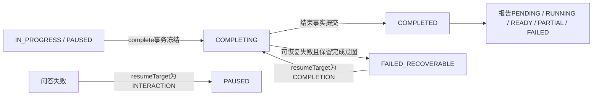

# 首版邀测技术设计与 0.2.0 契约

> 文档类型：技术设计；版本：0.1.0；规范基线：2026.08-r1  
> 文档状态：Draft；创建 / 更新：2026-09-09；产出阶段：5 技术设计；产物阶段状态：InProgress  
> Feature：FEAT-INTERVIEW-002；风险：L3；owner：Codex；独立复核人待指定  
> 批准记录：产品范围已接受；本设计新增状态 / 字段及事务细则尚待评审  
> 输入：[Canonical Spec](功能规格.md)、[流程审阅](../../调研/2026-09-08-商业语音面试全流程审阅.md)、[共用架构](../../架构/商业语音面试智能体与接口设计.md)；2026-09-09 只读源码基线  
> 输出：[任务](任务清单.md)、[交互](交互原型.md)、[检查](验证记录.md)

## 1. 复用与版本

继续使用 RuoYi Java 模块化单体、Vue Portal、PostgreSQL、现有 Redis、Port / Adapter、Job / Outbox。层级、工具白名单与 Provider 方案沿用共用架构 §3–6；本文只维护首版变化，机器契约以本目录 contracts 为准。

- [openapi.json](契约/openapi.json)：0.2.0 REST 候选。
- [schemas.json](契约/schemas.json)：2020-12 数据 / Agent / 消息定义。
- [asyncapi.json](契约/asyncapi.json)：0.2.0 WS / SSE 候选。

迁移前位于 `docs/architecture/commercial-interview-contracts/`、现位于 `文档/项目/面试项目/架构/商业面试契约/` 的 0.1.0 保持不变，是历史广义候选而非本版运行输入；现有生产 `contracts/` 和 v1 不变。新版本显式收窄岗位 / 模式、补充必填字段，属于不兼容草案修订；没有已部署 0.1.0 消费者的证据，正式集成前仍需登记消费者。若发现旧草案已被使用，停止替换并增加迁移窗口。

代码基线：DefaultStartInterview 已校验活动预留、创建首题 Job，尚无首题呈现启用阶段；InterviewAnswerCommitter 已建立答案与下一步 Job 的事务工作单元。改造应复用这些边界，不能在 Controller 写第二套提交逻辑。当前资源迁移至 V12；下一迁移序号必须实施时重新扫描，本稿不占号。

项目 SPEC-portal-web 含旧 apps 路径和 Cookie 方案，与后续 RuoYi 收敛及当前源码不同。本设计以现有 portal-web、platform-backend、RuoYi Bearer 为实现基线；不恢复旧独立身份服务，不据旧 SPEC 猜测 HttpOnly 已实现。Token 存储风险独立复核未完成。

## 2. DES-PILOT-01 开场、身份与契约门

API 输入强制 JAVA_BACKEND / MID / zh-CN / SIMULATION / MANUAL_CONFIRM / EFFECTIVE_TRAINING；rounds 用 oneOf 精确限定 HR、TECHNICAL 或 HR→TECHNICAL。拒绝自动模式和教练参数，不只隐藏前端入口。

新增 GET /voice-capabilities：仅读取批准配置与配额，返回 observedAt / source=CONFIGURATION，不调用 Provider、不接受录音、不要求 turnId。麦克风测试由浏览器本地进行。原 turn preflight 仍承担采集 codec 协商，不与设备测试混用。

计划确认沿用短事务，增加唯一 plan→session 约束和 reservationExpiresAt；start 进入 IN_PROGRESS 但 activationState=AWAITING_PRESENTATION，clock=NOT_STARTED。新 POST /interviews/{id}/presentation 确认当前 questionVersionId；首题 requires startAcknowledged=true，校验题目 / 会话 / 预留后原子启用权益和时钟。之后每题使用同入口记录呈现，不重复启用。旧题 / 旧版本返回 409/412；主体由后端读取。

所有业务写入 Idempotency-Key，聚合修改 If-Match；同 key/body 重放先于版本冲突判断但必须仍检查当前主体权限。独立子资源的 If-Match 只针对自身，应用事务同时校验父会话未终止。命令返回 202=已受理，不等于下一题已生成。

首题确认前，对用户返回的 TurnView.questionText=null，且不可领取首题 TTS 内容；questionVersionId 仍可用于开始确认。领域 / Agent 内部保留已生成题目，不用客户端隐藏代替此门。后续 QUESTION_COMMITTED 题面必须非空；PLANNED / 失败且未生成时可以为 null。服务端确认的是明确开始及客户端可呈现声明，不证明用户已听清。

新增本人历史 GET /interviews，游标分页、按 createdAt+id 倒序、页上限 50；cursor 绑定 owner 与过滤条件。没有结果返回 items=[] / nextCursor=null，不返回其他用户是否存在的信息。

## 3. DES-PILOT-02 输入确认与时钟

### 3.1 正式答案

client.audio.stop 只封口当前 capture，transcript.final 只准备确认文本。任何 WebSocket 消息都不能自动提交答案。显式 ConfirmTranscript 指明 USER_CONFIRM，文字 AnswerInput 同样受当前 turn 唯一确认约束。

原转写、修订文本、确认版本及来源分别保留。权重与分数不接受客户端写入。已确认版本不能直接修改；评分反馈不反向改答案。无置信度时 quality=UNKNOWN，而非空低置信数组就判可靠。

### 3.2 计时数据及合法转换

Snapshot 新增 timing / activationState / completion / usageState；计时唯一归 interview。字段包括 policyVersion、totalBudgetSeconds、consumedSeconds、remainingSeconds、clockState、clockReason、asOf、confirmationDeadlineAt。服务器以未重叠时间段计算，不使用客户端上报 duration 直接累加。

| 信号 | 时钟变化 | 校验 |
| --- | --- | --- |
| 首题 presentation 确认 | 从未开始到运行；若 TTS 正等待首包则暂时等待 | 预留有效、当前题就绪、本人明确开始 |
| 已显示题面 / 开始回答 / 文本编辑 / 重听 | 运行 | 当前题、当前 interactionEpoch；主动重听也计时 |
| audio.stop 后 ASR 尚未 final | 系统等待 | 存在有效 capture；等待总期限有上限 |
| final 到达 | 恢复运行等待用户确认 | 非 PAUSED / 终态；转写来自当前 capture |
| 正式答案提交后模型思考 | 系统等待 | 答案已持久化且对应 Job 在途 |
| 下一题就绪且 presentation | 运行 | 不接受旧题回执；TTS 首包等待单列 |
| pause / 失联 / 故障 | 暂停 | 域状态变更，增 sessionVersion / generation |
| complete / cancel | 停止 | 冻结输入与结束原因 |

同一媒体队列首包等待需前端收到数据回执与后端发送事实相互校验；客户端不能传任意 SYSTEM_WAIT 状态。服务器最多允许 5 秒媒体首包等待，超时提示文字 / 暂停，不把永远不 ACK 当无限免费延长。

新增 /interaction-leases 写入用于活动浏览器续约：10 秒心跳、30 秒 TTL，epoch+sequence 独立于 session ETag；同序列同内容返回原 ACK，不同内容冲突，旧 epoch 拒绝；lease 由 presentation / resume 返回的 interactionEpoch 绑定。心跳只能续约当前活动会话，不能恢复 PAUSED、变更已确认答案或自行申请新 epoch。后台失联处理在下一次租约到期检查时把会话暂停，消耗时间截止到最后服务端收到的续约时刻，避免将失联等待计给用户；因此最多一个心跳间隔的正常活动可能不计入，作为邀测候选取舍记录。Provider 调用时长与次数仍独立限额，防止靠断线无限消耗。

为恢复进程故障中的计时，时间段边界与最近租约 ACK 持久化；定期汇总不能丢掉已确认边界。暂停 / 提交 / 结束均先结算当前段再转状态，不为每个音频 chunk 写数据库。服务器时钟异常则暂停恢复，禁止负时间或时间回拨增加预算。

预算到期后 timing=EXHAUSTED，冻结 capture 接收截止和 final 输入；60 秒内只确认同一冻结文本，禁止 correctedText 增补或新文字答案。确认后结束；窗口到期排除当前未确认数据并记录结果。停止后供应商生成结果仍可完成转写，但不能扩充截止后音频。

## 4. DES-PILOT-03 Agent 决策和角色交接

沿用五段 prompt、只读工具策略及模型别名，实际模型版本仍须固定。0.2.0 的 InterviewerActionV2 增加 coverageUpdates 候选（dimensionId、evidenceStatus、sourceAnswerVersionIds、reason）。不能直接把模型结论写成最终分数或真实经历验证。

调度器逐项验证维度属于蓝图、引用属于确认回答、回答支持简短结论；校验失败丢弃该覆盖更新，保留不足。更新按 session / round / dimension + 输入版本 CAS；不允许靠重复模型调用重复累计覆盖。既有 coverage 数组结构在 0.2.0 中明确区分提问机会和证据状态。remainingFollowUps 是当前主问题剩余内容追问数，最大 2；remainingClarifications 是全场剩余语义澄清数，最大 2，不能用新建追问题重置预算。首版 verifiedProfileFacts 必须为空，本人确认资料仍放 candidateClaims / handoffClaims，不能冒充已核实经历。

每次轻判断与下一问一次模型主调用；最多一次格式修复、至多两次只读工具调用，共享 8 秒期限。NEXT 使用预取审核主问题，不隐含无限递归调用；COMPLETE 由程序校验预算与轮次。完整评估只在 S3 异步执行，不挡下一题。

新 AgentContext.handoffClaims 仅含最小自述与对应 answerVersionId，禁传 HR 分数 / 人格判断。术语统一：candidateProfile 指个人确认资料，agentProfile 指提示词角色版本，避免 profile 误用。首版单条口播问题最大 300 字符，超过即拒绝候选；这是上限，不鼓励长题，真实可用长度由内容评审检查。

## 5. DES-PILOT-04 结束、恢复与持久化

complete 请求必须携带当前最后正式 answerVersionId（可 null）和 pendingAnswerDisposition=NONE 或 DISCARD。客户端 reasonCode 仅可为 USER_COMPLETE；BUDGET_EXHAUSTED 由服务端时钟生成，不能接受用户伪造到期事实。用户选择“先提交再结束”由前端先确认答案并回读新版本，再发送 NONE；如果仍有当前未确认 capture，NONE 返回 409 PENDING_ANSWER，不替用户做决定。DISCARD 显式排除当前未确认数据。

事务检查 expectedLastAnswerVersionId 与库一致，不一致返回 412；冻结输入 hash、completionReason、excludedPendingAnswer、resumeTarget=COMPLETION、评估 Job 与 Outbox 同时持久化。结束任务重试保持原意图 / hash，不能重新受理不同的答案集。

异常发生在冻结事务前时原状态 / 未确认内容仍存在；发生在冻结后只能重试完成 / 评估，不再受理回答。暂停/取消与 Worker CAS、lease fencing 一起防止旧结果落库。若 cancel 时 completion 已冻结，返回真实状态与允许命令，不静默删除已有报告。

需增加持久约束：planId 绑定唯一 session；turnId 正式确认唯一；reservation 的结算 / 补偿幂等键唯一；presentation 按 session / turn / questionVersion 去重；completion inputHash 固定；时钟分段 / interactionEpoch / leaseSeq 唯一；profile/rubric 发布版本不可变。使用现有所属 schema，物理 DDL 在 S1 设计审查中逐列映射并分配新迁移，不改 V1–V12。

## 6. DES-PILOT-05 报告、数据与邀测准备

RoundReport.overallScore 在 0.2.0 必须为 null，新增 displayPolicy=LEVELS_ONLY。coverageRatio 仍表示固定蓝图的可评分权重占比；新增 askedCoverageRatio 与 coverageGaps。DimensionJudgement 增加 DISPUTED 非评分状态，原 SCORED 校验不变。不返回服务端计算出的隐藏百分制总分给浏览器。

ReportView 加入 failedStages，区分证据 / 判断 / 解释失败；状态 READY 不等于全部维度可评分。S1 开关禁止创建评分任务，reportState=NOT_REQUESTED，并明确内部链路验证无报告；S3 才启用整场评估。

资料、反馈、撤回删除、复练的完整接口在 S3 补充；本次先为恢复添加历史列表，为手填资料补 candidate profile 创建 / 本人读取，为真实邀测前治理提供设计入口，不声称候选 API 已覆盖商业售后。S1 不允许加载真实简历 / 用户录音进入模型；所需模拟资料为明确虚构内部样例。

测试权益 sku=INVITE_PILOT_V1，quantity 仍为一次场次；定价查询仅保留旧草案结构且 x-pilot-enabled=false，调用应受 FEATURE_NOT_AVAILABLE 门拒绝，不能返回旧候选套餐当在售商品。真实销售的订单 / 支付 / 退款没有被本版批准或接通。

## 7. DES-PILOT-06 前端与协议

复用现有 CSR 路由 / Element Plus；新增功能放 features/interview 的 api / composables / media 子目录。现有 shared/api/client.ts 自动拼接 /api/v1；实施时为受控调用增加显式 v2 选择，保持默认 v1 与 RuoYi 登录路径不变，禁止把完整任意 URL 传入。初期入口由默认关闭的配置控制，不能先对全部用户开放。服务端快照为状态事实，浏览器只持设备、播放队列和未提交草稿；数据缓存 key 包含主体和 session，登出清空，录音 / 转写不存 localStorage。

SSE 只通知 ID / 版本，fetch 流携带 Bearer；WS 帧消息仍继承 0.1.0 的 PCM / ACK / 背压 / ticket / generation 限制。增加 client.playback.started 用于绑定当前 outputId 的首音频回执，不能借此写答案；入站 envelope 校验、Origin、帧序号与主体检查不放宽。每题换 handle 暂保留，真实延迟测量后再决定是否另升协议。

页面与状态细节见 交互原型.md。默认 zh-CN / Asia/Shanghai，UTC 存储，中文错误文案有稳定 key；不新装 i18n 框架。键盘可完成所有操作，final / 错误可朗读，partial 不逐字抢读屏；44px 目标、200%/400% 缩放、减少动效，WCAG2.2AA 作为目标而非已通过。

浏览器目标仍为桌面 Chrome/Edge/Firefox/Safari 当前及前一稳定版、iOS Safari / Android Chrome；S1 的静态或 fake 验证不代表全矩阵完成。现有 Portal 的样式资产及组件为视觉基线，不在该版本新造品牌系统；实际 tokens / 截图和 UI 复核在实施前定位，缺失不得宣称视觉门通过。

## 8. DES-PILOT-07 质量、风险与退出

| 指标 | 候选门与口径 | owner / 验证 / 失败 |
| --- | --- | --- |
| NFR-PILOT-01 正确性 | 重复确认 / 结算为 0；暂停后旧题落地为 0；应用重启不丢已确认答案 | 软件架构；领域+PostgreSQL 并发 / 恢复验证，失败阻断 |
| NFR-PILOT-02 延迟 | 用户显式确认到下一题首音频 P95≤3s；另报停止录音至 final 与人工确认等待，不混算 | 系统 / voice；≥200 轮真链路，单次决策8s硬期限；当前 NotRun |
| NFR-PILOT-03 容量 / 可用性 | 峰值20场、平均5场、配额余量30%；30天核心请求99.5%，0.5%错误预算 | 系统；受控压测 / 运行观察，超预算冻结扩大邀测 |
| NFR-PILOT-04 报告 / 质量 | 60s P95 报告；120s可离开恢复；专家分层质量门引用 Spec §6 | 内容 / evaluation；真实样本未建立，不虚报准确率 |
| NFR-PILOT-05 成本 | 完整30分钟场变量成本P95≤¥3为待验证预算；每次attempt可归因 | 运营；实账及失败重试数据，超标不销售 |
| NFR-PILOT-06 前端 | P75 LCP≤2.5s、INP≤200ms、CLS≤0.1；初始JS≤250KB gzip、面试增量≤150KB | 前端；中档设备冷缓存受控4G，未测不称达标 |
| NFR-PILOT-07 隐私 / 恢复 | 跨主体引用为0；删除不复活；DB灾难RPO≤5分钟/RTO≤60分钟候选 | 安全 / 系统；独立复核、备份恢复演练，NotRun |

安全资产与威胁沿用共用架构 §14；本版新增攻击面为 presentation 伪造、时钟等待欺骗、租约重放、完成意图竞争和候选 profile 注入，分别由题版本 / 主体校验、可信状态、epoch+seq、CAS及数据隔离处理。普通日志仅 ID、版本、耗时、用量、错误码，禁止 Bearer、原文、录音、全 prompt。

默认单地域、同源TLS、受保护DB / Redis / 对象存储，交互与评分线程池隔离；实际生产拓扑不在本轮变更。供应商及核心依赖版本依据现有锁文件 / 配置，未运行依赖漏洞检查。真实调用前固定模型、区域与配额；不自行换模型跨区域传数据。

退出：先关闭新 v2 会话入口，保留恢复 / 查询路径；兼容应用回退，不删除新列或改旧答案；暂停新场不把 v2 数据交给 v1 解析。用户数据与额度补偿须独立处理，不能用代码回退代替。

## 9. ADR 与缺口处置

| ADR | 推荐 / 备选 | 状态 / 后果 |
| --- | --- | --- |
| ADR-PILOT-01 | 新 Feature 聚合新增商业邀测范围；不重开旧历史 tasks | Proposed；独立入口可追溯，增加少量索引 |
| ADR-PILOT-02 | 手动 final 确认；自动轮换延后 | 产品方向Accepted，接口细化Proposed；多一步确认，降低误提交风险 |
| ADR-PILOT-03 | 有效时间 + 独立交互租约；不用浏览器本地秒数结算 | 产品口径Accepted，租约参数Proposed；需持久计时边界与反滥用 |
| ADR-PILOT-04 | 0.2.0 分项等级，overallScore=null；不开放总分 | 产品方向Accepted；评估证据契约需专家复核 |

FLOW-GAP-01/02/03/04/05/06/07 已有具体规格 / 契约候选，不是已验证关闭；GAP-08 历史 / 手填资料已补，隐私管理留 S3 上线前；GAP-09 有交接结构；GAP-10 场内提示延期、复练 S3；GAP-11 反馈跟踪 S3；GAP-12/13 需真链路与成本样本。实测、独立评审、物理 DDL、全量消费者校验尚未完成。
