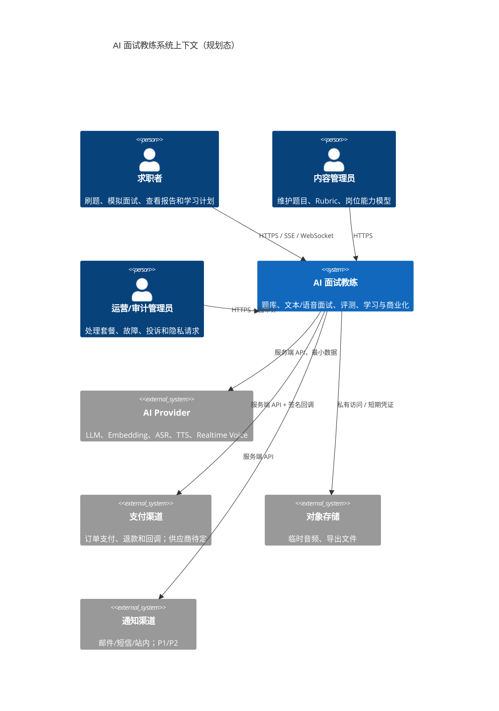
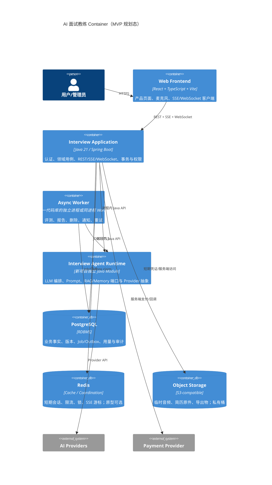
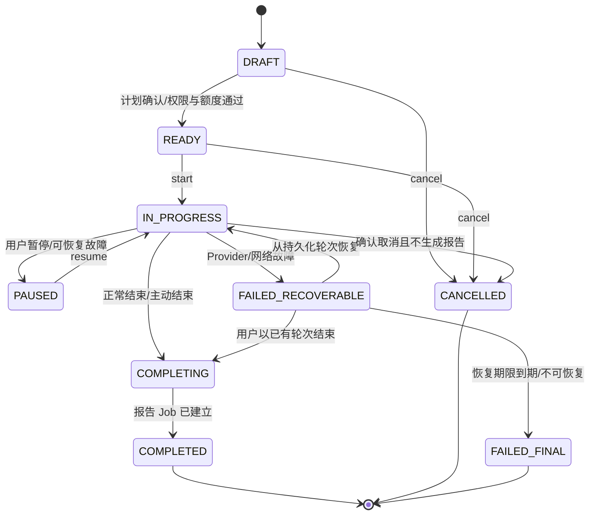

# AI 面试教练与题库系统技术架构

> 文档类型：设计
> 文档状态：Draft
> owner / 责任边界：架构 owner 维护技术方案、模块、契约、安全和演进边界；产品 owner 维护产品行为
> 创建时间：2026-08-02
> 更新时间：2026-08-02
> Feature ID：FEAT-INTERVIEW-001
> 风险等级：L3
> Spec 基线：[`../product/产品需求文档.md`](../../产品/产品需求文档.md) PRD v0.2 Draft（全量发散稿，尚未收敛批准）
> 产出阶段：5 技术设计
> 阶段状态：InProgress
> 设计版本：v0.1 技术战略讨论稿
> 当前代码基线：新项目尚无代码；PaiCLI 仅为外部参考项目，二者无源码、依赖、数据库、配置、发布或 Git 关联
> 关联：[项目入口](../../../../../README.md)、[调研](../../产品/面试教练与题库调研.md)、[产品 PRD](../../产品/产品需求文档.md)

## 1. 结论摘要

推荐采用“模块化单体 + 可插拔 AI Provider + 异步评测 + 分层语音”的技术战略：

1. **核心形态**：首版是一个 Spring Boot 模块化单体业务后端，不直接把现有 `RuntimeApiServer` 暴露为商业公网服务。
2. **参考地基**：参考 PaiCLI 的 `agent`、`llm`、`memory`、`rag`、`policy` 设计经验，在新项目中独立实现对应能力；禁止对 PaiCLI 建立代码或运行时依赖。
3. **前端**：新建独立的 React + TypeScript + Vite 前端；可采用 TanStack Query 和 Zustand，但不复用 PaiCLI 前端源码。
4. **数据**：PostgreSQL 是业务唯一事实源；Redis 用于短期状态、限流和多实例协调；对象存储用于临时音频和导出文件。
5. **检索**：题库先使用 PostgreSQL 精确筛选和全文检索；语义检索/推荐需要时再启用 PostgreSQL 向量扩展，避免首版引入独立向量数据库。
6. **语音 MVP**：浏览器采音 → WebSocket/分段上传 → ASR → 文本面试 Agent → TTS → 音频/文本返回；文本模式始终可用。
7. **Realtime 高级模式**：WebRTC 端到端语音作为 P2 Provider，不成为首版核心依赖。
8. **Agent 控制**：LLM 负责理解、追问、解释和建议；面试状态、时间预算、题目版本、权限、额度、删除、分数门禁由确定性代码控制。
9. **评测**：Rubric 确定性校验 + 结构化 LLM Judge + 证据引用 + 置信门 + Golden Set；没有可靠证据时输出“无法判断”。
10. **部署**：先单区域、少实例、托管数据库/对象存储；不在 MVP 引入微服务、Kafka、Kubernetes 或复杂服务网格。

这是一份 `Draft` 设计。PRD 未收敛、原型未评审，因此它只能作为技术战略输入，不能进入任务拆分或开发。

## 2. 目标、非目标与约束

### 2.1 技术目标

- 支撑独立项目的题库、文本/语音模拟面试、可解释评测、学习计划和个人订阅的完整闭环。
- 允许 LLM、Embedding、ASR、TTS、Realtime Voice 供应商独立替换。
- 面试进行中可暂停、断线恢复、降级和避免重复计费。
- 所有评分可追溯到题目、Rubric、回答、Prompt/策略和模型版本。
- 将账号、录音、转写、简历、支付和管理员访问置于明确的权限、同意、审计与删除链路。
- 单人/小团队可维护，业务增长后仍有清晰拆分点。

### 2.2 非目标

- 不在首版拆成多个网络微服务。
- 不复制或改造 PaiCLI React 控制台；新项目只维护自己的前端。
- 不让浏览器持有 LLM/ASR/TTS Provider Key。
- 不把现有 SQLite、JDK `HttpServer` 和前端 `localStorage` API Key 方案直接当作商业生产架构。
- 不在首版实现视频、表情分析、多人群面、实时作弊 Copilot 或数字人。
- 不与 PaiCLI 建立 Maven 依赖、Git submodule、共享数据库、共享配置、共享部署或运行时调用。
- 不在本文冻结具体云厂商、支付渠道和模型 SKU；这些需要地域、合同、价格、DPA 和实际质量评测。

### 2.3 当前事实与差距

| 领域 | PaiCLI 可参考事实 | 新项目需要独立建设 |
|---|---|---|
| Java/Agent | Java 17、ReAct、Plan、多 Agent、多模型客户端 | 缺少面试领域状态机、评分门禁、账号/租户和商业用例层 |
| Runtime | JDK `HttpServer`、线程/turn、有限 SSE 事件 | 缺少 Spring Security、事务、生产 WebSocket、标准错误、幂等和多租户 |
| 数据 | SQLite 保存任务、线程和本地 RAG | 不适合商业多用户并发、查询、备份、租户和合规删除 |
| Frontend | React 18、TypeScript、Vite、TanStack Query、Zustand | 缺少产品页面、会话认证、麦克风/音频和后台管理 |
| LLM | 多个 OpenAI-compatible 文本 Provider | 缺少能力路由、成本账本、模型/Prompt 版本和内容质量门禁 |
| 语音 | 无 ASR/TTS/WebRTC/音频链路 | 全部需要新增，并受隐私与供应商数据边界约束 |
| 安全 | PathGuard、CommandGuard、HITL、AuditLog | 独立实现商业认证、租户、同意、审计和 Secret；不得复制参考项目的公网绑定/CORS/API Key 风险 |

## 3. 方案比较与技术决定

| 设计问题 | 方案 A | 方案 B | 方案 C | 决定 |
|---|---|---|---|---|
| 系统形态 | 扩展现有 JDK HttpServer | Spring Boot 模块化单体 | 微服务 | **B**；A 不足以承载商业认证/事务，C 当前运维成本过高 |
| PaiCLI 关系 | 作为依赖库 | 复制源码 | 只借鉴设计并独立实现 | **只借鉴设计**；禁止依赖、复制、共享运行时或共享数据 |
| 数据库 | SQLite | PostgreSQL | 文档数据库 | **PostgreSQL**；新项目不使用 PaiCLI SQLite |
| 数据访问 | JPA | jOOQ | 原生 JDBC 混用 | **Spring Data JPA 为 MVP 默认**；复杂报表用受控 SQL，不首版引入两套主数据层 |
| 数据迁移 | 手写启动 SQL | Flyway | 应用自动推断 schema | **Flyway**；每次迁移版本化且可审计 |
| 题库搜索 | 独立 Elasticsearch | PostgreSQL 全文/模糊检索 | 全靠向量 | **PostgreSQL 优先**；搜索规模和质量证据触发后再评估 ES |
| 向量检索 | 独立向量库 | PostgreSQL 向量扩展 | 现有 SQLite 内存余弦 | **B 为候选 P1**；实现前复核版本、索引、许可证和质量；不阻塞 P0 |
| 异步处理 | 同步请求等待 | PostgreSQL Job/Outbox + Worker | Kafka | **B**；Kafka 延后到吞吐和解耦证据成立 |
| 事件推送 | 轮询 | SSE | WebSocket 全部承载 | 文本/状态用 **SSE**，音频双向用 **WebSocket**，普通 CRUD 用 REST |
| 语音 | ASR→Agent→TTS | 端到端 Realtime | 只文本 | **A + 文本降级**为 MVP；B 为 P2 高级模式 |
| 登录会话 | API Key localStorage | HttpOnly Secure Cookie 会话 | SPA 自管长期 JWT | **安全 Cookie 会话**；未来开放 API 再引入 OAuth2/OIDC Token |
| 缓存/协调 | 仅本机内存 | Redis | 全部落数据库 | 单实例原型可不用；商业多实例、限流和会话启用 **Redis** |
| 部署 | 裸 Jar | 容器化单体 + 托管数据服务 | Kubernetes | **容器化单体**；Kubernetes 延后 |

### 3.1 为什么选择模块化单体

面试、题库、评测、学习计划、计费和隐私删除之间事务与版本关联密集，首版强行微服务会增加分布式事务、消息一致性、链路追踪和部署成本。Spring Modulith 官方将其定位为在 Spring Boot 中构建领域驱动、可验证模块边界的工具，符合本项目“单进程但边界清楚”的需求。[Spring Modulith 官方文档](https://docs.spring.io/spring-modulith/reference/)

采用规则：

- 逻辑模块之间通过应用服务、领域事件和公开 DTO 交互。
- 模块不得直接访问其他模块的 Repository/内部实体。
- 先用代码和测试验证依赖方向，不因用了 Spring 就允许全局 Bean 任意调用。
- Spring Modulith 是建议工具，不是必须绑定；若与最终 Spring Boot 兼容线不匹配，可用 Maven 模块 + ArchUnit/包可见性实现同一边界。

## 4. 系统上下文



信任边界：浏览器不可信；公网入口与业务服务之间需认证/限流；AI Provider、支付和对象存储都是外部数据处理方；管理员不是天然可信，敏感访问仍须授权与审计。

## 5. Container 架构



### 5.1 部署策略

- **本地开发**：Frontend、Spring Boot、PostgreSQL；Redis/对象存储使用本地兼容服务或 Fake。
- **试用环境**：单区域 1–2 个应用实例、托管 PostgreSQL、Redis、私有对象存储、TLS 入口。
- **生产 MVP**：应用与 Worker 可独立扩缩容；数据库高可用与自动备份；音频桶生命周期规则；按需 CDN 仅服务公开静态资源。
- **不采用**：依赖或调用 PaiCLI 进程；使用 `~/.paicli/*.db`；把 Provider Key 暴露给前端；把所有能力塞进单个无边界包。

## 6. 逻辑模块与依赖方向

新项目从零建立独立模块边界：`identity`、`catalog`、`practice`、`interview`、`voice`、`agent`、`evaluation`、`learning`、`billing`、`governance`、`integration`、`operations`、`frontend` 和 `test-support`。这些名称只属于新项目，与 PaiCLI 包结构无关；物理 Maven 模块是否拆分在阶段 6 决定。

| DES | 逻辑模块 / owner | 职责 | 可依赖 | 禁止越界 | 关联需求 |
|---|---|---|---|---|---|
| DES-MOD-01 | Identity / runtime | 用户、个人 tenant、会话、角色和账号生命周期 | Governance | 不保存 Provider Key，不让前端自判权限 | REQ-11 |
| DES-MOD-02 | Catalog / runtime | 题目、分类、来源、Rubric、追问、岗位模型和版本 | Governance | 不调用 LLM 决定发布状态 | REQ-01/02/06 |
| DES-MOD-03 | Practice / runtime | 单题作答、尝试、错题和专项练习 | Catalog、Evaluation | 不直接改历史 Rubric | REQ-01/07/10 |
| DES-MOD-04 | Interview / runtime | 面试计划、状态机、轮次、时间、暂停/恢复 | Catalog、Usage、Agent Port | LLM 不能直接改状态/扣费 | REQ-03/04/06/09 |
| DES-MOD-05 | Voice / integration | 音频输入、ASR/TTS、置信、降级与临时 Artifact | Interview、Governance | 不永久保留音频，不把 key 交给前端 | REQ-05/11/15 |
| DES-MOD-06 | Agent Orchestration / agent | 提问、追问、澄清、总结和结构化输出 | Provider Port、Retrieval Port | 不拥有用户/订单/状态事实 | REQ-04/08/15 |
| DES-MOD-07 | Evaluation / runtime + agent | Rubric 评测、证据、置信门、报告 Job | Catalog、Interview、Agent Port | 不输出无证据权威总分 | REQ-07/08 |
| DES-MOD-08 | Learning / runtime | 弱项、计划、复测和趋势 | Practice、Evaluation | 不把不可比版本直接算趋势 | REQ-10 |
| DES-MOD-09 | Usage & Billing / runtime | 权益、配额、预留、结算、订单和成本账本 | Identity、Payment Port | 金额/额度不由 LLM 计算 | REQ-14 |
| DES-MOD-10 | Governance / runtime | 同意、留存、删除、审计、内容安全和管理员访问 | Identity | 业务审批不能绕过安全拒绝 | REQ-11/12 |
| DES-MOD-11 | Provider Adapters / integration | LLM、Embedding、ASR、TTS、Realtime、支付、存储适配 | 外部 SDK/API | 供应商类型不泄漏到核心域 | REQ-05/15 |
| DES-MOD-12 | Operations / runtime | 故障、成本、质量、反馈、工单和开关 | 各模块只读投影 | 不默认读取敏感正文 | REQ-08/11/14/15 |

推荐依赖方向：

```text
frontend -> runtime API -> application use cases -> domain
                                             -> agent ports -> agent core
                                             -> integration ports -> provider adapters
domain -> 无 UI、SDK、数据库、HTTP 依赖
```

## 7. 后端技术栈

### 7.1 推荐栈

| 层 | 技术选择 | 用途与边界 |
|---|---|---|
| Java | Java 21 LTS | 新项目独立基线；兼顾成熟生态和长期维护，不受 PaiCLI Java 17 约束 |
| 应用框架 | 当前受支持且兼容 Java 21 的 Spring Boot 版本 | Web、安全、事务、配置、健康检查；具体版本在依赖评审时锁定 |
| 模块治理 | Spring Modulith 候选 + 包边界检查 | 逻辑模块、事件、模块测试；兼容性不满足时使用 Maven/ArchUnit 等价治理 |
| Web | Spring MVC + SSE；Spring WebSocket | CRUD/文本事件/音频双向；不在同一接口混合所有协议 |
| 安全 | Spring Security | Cookie 会话、RBAC、CSRF、限流前置、管理员二次控制 |
| 数据访问 | Spring Data JPA + 明确 Repository 边界 | CRUD 和事务；复杂 SQL 需独立审查，不让实体跨模块传播 |
| 数据库 | PostgreSQL | 业务事实、版本、事务、Job/Outbox、审计和用量 |
| 迁移 | Flyway | schema 版本、前进迁移和可定位回退/补偿 |
| 缓存协调 | Redis | 多实例会话、限流、短锁、热点缓存；单实例原型可裁剪 |
| 对象存储 | S3-compatible 私有存储 | 临时音频、简历原件、导出文件；生命周期与加密 |
| HTTP 客户端 | 复用 OkHttp 或统一 Spring HTTP Client（二选一） | 阶段 6 只保留一个主外部 HTTP 栈，避免重复连接池 |
| 韧性 | 有界超时/重试/熔断；Resilience4j 为候选 | 供应商调用；重试必须受幂等和预算约束 |
| 可观测性 | Micrometer + OpenTelemetry | Trace、Metric、Log 关联；不得采集音频/简历/完整回答正文 |
| 测试 | JUnit 5、Mockito、MockWebServer、Testcontainers 候选 | 领域、契约、数据库和外部 Provider；实际新增/运行需执行包授权 |

OpenTelemetry Java 官方说明其 Java 实现可生成和采集 traces、metrics、logs，且页面当前将三项主要组件标为 Stable，适合作为跨 Agent、Provider 和异步 Job 的关联标准。[OpenTelemetry Java 官方文档](https://opentelemetry.io/docs/languages/java/)

### 7.2 为什么不直接用 LangChain4j/Spring AI 统领业务

新项目不依赖 PaiCLI 的 `LlmClient`、Agent、工具或 RAG。为了保持供应商和框架可替换，首版先定义自己的小型能力端口；Spring AI、LangChain4j 或厂商 SDK 只能作为适配器候选。策略是：

- 先定义项目自己的小型能力端口：`ChatModelPort`、`EmbeddingPort`、`SpeechToTextPort`、`TextToSpeechPort`、`RealtimeVoicePort`。
- 新项目独立实现 Provider Adapter；不得直接引用 PaiCLI Provider 类。
- 若某框架能显著减少已批准范围的代码，并通过兼容/退出评审，可在任务拆分阶段引入；不得让框架 API 泄漏到领域层。

## 8. 前端技术架构

新建独立 `frontend/`，采用 React + TypeScript + Vite；TanStack Query、Zustand 作为建议依赖：

| 区域 | 技术职责 |
|---|---|
| React Router（候选新增） | 公开区、用户工作台和后台路由；引入前核对现有依赖与范围 |
| TanStack Query | REST 查询、缓存、失效和服务端状态；不保存长期敏感正文 |
| Zustand | 当前会话 UI、音频设备、临时草稿和连接状态 |
| SSE Client | 文本 token、状态、报告进度、用量和恢复事件 |
| WebSocket Client | 音频 chunk、转写事件、TTS 音频和语音控制 |
| MediaDevices / Web Audio | 麦克风授权、设备检测、录音、音量和必要格式转换 |
| IndexedDB（受控） | 仅保存可恢复的非敏感草稿/短期 chunk；默认不离线永久保存音频 |

安全决定：

- 生产认证使用 `HttpOnly + Secure + SameSite` Cookie；不把 Runtime API Key、Provider Key 或长期 Token 放 `localStorage`。
- 前后端优先同源部署；CORS 使用精确 allowlist，不允许 `*` 携带认证。
- 前端只显示服务端返回的业务状态和错误码，不自行推断面试状态、额度或删除完成。
- 麦克风必须由用户手势触发；权限拒绝后不循环弹窗。

## 9. Agent 与模型战略

### 9.1 能力端口

```java
// 概念契约，非实现代码
interface ChatModelPort {}
interface EmbeddingPort {}
interface SpeechToTextPort {}
interface TextToSpeechPort {}
interface RealtimeVoicePort {}
```

每个调用必须记录：`provider`、`model`、能力、配置版本、Prompt 版本、开始/结束时间、Token/音频用量、成本单位、结果状态、供应商 request ID 和可重试性；不得记录 Key 或默认记录完整敏感正文。

### 9.2 面试 Agent 组成

| Agent/组件 | 职责 | 输入 | 输出 | 确定性门禁 |
|---|---|---|---|---|
| Interview Planner | 根据确认范围生成面试计划 | 岗位、级别、主题、时长、题库 | 结构化计划候选 | 题目必须已发布；比例、时长和题数由代码校验 |
| Interviewer | 提问、澄清、有限追问和过渡 | 当前题目、回答、Rubric、剩余预算 | 结构化下一动作 | 状态迁移、追问上限和时间由 Orchestrator 裁决 |
| Evidence Extractor | 从回答抽取可引用证据 | 回答/转写 | 带位置的证据片段 | 只能引用原回答，不生成“用户说过”的新内容 |
| Rubric Judge | 按维度判断覆盖/错误/不足 | 题目版本、Rubric、证据 | 结构化维度结论 | schema 校验；无证据不得给高置信结论 |
| Report Composer | 将已裁决事实组织成报告 | 维度结论、限制、建议 | 报告草稿 | 不改变评分，不新增未验证事实 |
| Learning Coach | 生成有限练习建议 | 弱项、历史和可用题目 | 训练计划候选 | 只能引用存在的题目/题单，用户可调整 |

### 9.3 结构化输出

所有关键 Agent 使用版本化 JSON Schema，不解析自由文本来驱动状态或计费。概念示例：

```json
{
  "action": "FOLLOW_UP | NEXT_TOPIC | COMPLETE | NEED_CLARIFICATION",
  "reasonCode": "MISSING_TRADEOFF",
  "question": "...",
  "eviden…1638 tokens truncated…tion | immutable version | 用户私有 |
| Report | evaluationVersion、renderedSections、status | Evaluation | immutable version | 用户私有，可导出/删除 |
| LearningItem | weakness、sourceEvidence、dueAt、status | Learning | version | 用户私有 |
| Entitlement | plan、capability、limit、period | Billing | version | 确定性规则 |
| UsageReservation | idempotencyKey、reserved、settled、reason | Billing | unique key | 财务/成本事实 |
| Order/Payment | amount、currency、status、providerRef | Billing | state/version | 高敏；不存卡号 |
| ConsentRecord | policyVersion、purpose、grantedAt、revokedAt | Governance | append-only | 审计保留 |
| DeletionRequest | scope、state、dueAt、result | Governance | state/version | 审计与执行 |
| AuditEvent | actor、action、target、result、correlationId | Governance | append-only | 禁止存敏感正文 |
| OutboxEvent | aggregate、type、payloadRef、state | Platform | claim/version | 可靠异步通知 |

### 12.2 数据原则

- 所有业务表带 `tenant_id`、创建/更新时间和必要版本字段；个人用户使用 personal tenant，降低未来 B2B 迁移成本。
- Repository 必须强制 tenant scope；B2B 上线前增加数据库级隔离专项评审。
- 正式内容发布后使用不可变版本；历史报告永远引用原题目和 Rubric 版本。
- 大段音频、简历原件和导出物不放数据库，只保存私有对象引用、哈希、用途、过期和删除状态。
- 模型 Prompt/输出正文是否存储按用途最小化；生产日志禁止记录完整录音、简历、回答和 Token。
- 删除采用“业务不可见 → 异步物理清理 → 外部处理确认/超时 → 完成记录”状态机，不用单条 SQL 冒充端到端删除。

### 12.3 检索

P0：分类/标签/岗位/难度使用关系索引，题干/知识点使用 PostgreSQL 全文或模糊搜索。

P1：语义检索只用于相似题、推荐和 RAG 候选召回；仍以发布状态、tenant、岗位和版本进行确定性过滤。PostgreSQL 向量扩展仅作为候选，阶段 6 前需要完成兼容版本、索引策略、许可证、召回质量和备份恢复核验。

## 13. API 与事件契约

### 13.1 协议分工

| 协议 | 用途 | 不用于 |
|---|---|---|
| REST `/api/v1` | 账号、题库、计划、CRUD、命令、报告查询 | 音频双向流 |
| SSE `/api/v1/streams/*` | 文本 delta、会话状态、报告进度、用量事件 | 上行音频 |
| WebSocket `/ws/v1/interviews/{id}/voice` | 音频 chunk、ASR/TTS 和语音控制 | 普通后台 CRUD |
| Webhook `/api/v1/webhooks/*` | 支付/供应商回调 | 浏览器直接调用 |

### 13.2 主要 REST API（草案）

| API | 方法 | 用途 | 幂等/权限 | 失败语义 |
|---|---|---|---|---|
| `/api/v1/questions` | GET | 题库搜索和筛选 | tenant/public scope | `INVALID_FILTER`、`RATE_LIMITED` |
| `/api/v1/questions/{id}` | GET | 已发布题目详情 | entitlement | `NOT_FOUND`、`NOT_ENTITLED` |
| `/api/v1/practice-attempts` | POST | 提交单题回答 | `Idempotency-Key`、user | `CONTENT_VERSION_EXPIRED`、`USAGE_EXCEEDED` |
| `/api/v1/interview-plans` | POST | 生成面试计划候选 | user、预算预估 | `INSUFFICIENT_CATALOG`、`INVALID_SCOPE` |
| `/api/v1/interviews` | POST | 确认并创建会话 | `Idempotency-Key`、user | `CONSENT_REQUIRED`、`USAGE_EXCEEDED` |
| `/api/v1/interviews/{id}/answers` | POST | 提交/确认回答 | 幂等、session owner | `STALE_TURN`、`INVALID_STATE` |
| `/api/v1/interviews/{id}/commands` | POST | pause/resume/skip/complete | 幂等、session owner | `INVALID_TRANSITION` |
| `/api/v1/interviews/{id}` | GET | 恢复会话快照 | session owner | `NOT_FOUND`、`FORBIDDEN` |
| `/api/v1/interviews/{id}/report` | GET | 查询报告 | session owner | `REPORT_PENDING`、`REPORT_FAILED` |
| `/api/v1/consents` | POST | 授予/撤回用途同意 | user、policyVersion | `POLICY_VERSION_REQUIRED` |
| `/api/v1/deletion-requests` | POST | 删除会话/资料/账号 | 强确认、user/admin | `DELETE_CONFLICT`、`LEGAL_HOLD` |
| `/api/v1/usage` | GET | 查看权益和账本 | user | `NOT_FOUND` |
| `/api/v1/orders` | POST | 创建订单 | 幂等、user | `PRICE_VERSION_EXPIRED` |

### 13.3 标准错误

```json
{
  "error": {
    "code": "INVALID_STATE",
    "message": "当前会话状态不允许提交回答",
    "retryable": false,
    "correlationId": "corr_xxx",
    "details": {"currentState": "PAUSED"}
  }
}
```

- `message` 可面向用户；日志保留英文异常名和 Provider 原始错误码。
- `details` 不暴露内部堆栈、SQL、Key、完整 Prompt 或敏感正文。
- `retryable` 由服务端决定；前端不能看到 500 就无限重试。

### 13.4 事件信封

```json
{
  "eventId": "evt_xxx",
  "type": "interview.transcript.final",
  "aggregateId": "int_xxx",
  "sequence": 18,
  "occurredAt": "2026-08-02T10:00:00Z",
  "schemaVersion": 1,
  "correlationId": "corr_xxx",
  "data": {}
}
```

SSE/WebSocket consumer 使用 `eventId + sequence` 去重和续传；未知事件安全忽略并保留诊断，不导致页面崩溃。

## 14. 状态机

### 14.1 面试会话



`COMPLETED` 只表示面试会话终态，不自动表示评测报告成功；报告拥有独立状态。

### 14.2 评测 Job

`PENDING → RUNNING → SUCCEEDED | FAILED_RETRYABLE | FAILED_FINAL | CANCELLED`

- Worker 使用原子 claim 和 lease；进程崩溃后 lease 到期可恢复。
- 重试只针对明确可重试外部错误，次数和总成本受限。
- 输入版本变化不覆盖原 Job；用户修正转写后创建新 evaluation version。

### 14.3 删除请求

`REQUESTED → VALIDATING → HIDDEN → DELETING_INTERNAL → DELETING_EXTERNAL → COMPLETED`

异常状态：`BLOCKED_LEGAL`、`PARTIAL_FAILED`、`CANCELLED`。每一步记录对象数量、结果和关联 ID，不在审计中保存删除内容本身。

### 14.4 用量预留

`RESERVED → SETTLED | RELEASED | EXPIRED`

创建语音/模型操作前预留预算；成功按实际结算，平台故障释放，客户端重复提交通过幂等键返回同一结果。

## 15. 异步、事务与一致性

### 15.1 Outbox + Job

- 用户提交回答时，在一个 PostgreSQL 事务中保存 Turn、会话状态、用量预留和 Outbox/Job。
- Worker 提交外部模型调用后写 ProviderInvocation；得到结果后在事务中保存评测版本并结算用量。
- 通知、报告导出、删除和统计由 Job 执行，不阻塞主请求。
- “至少一次”投递要求 consumer 幂等；不承诺不存在重复事件。

### 15.2 何时引入消息队列

只有出现以下证据之一再评估 Kafka/RabbitMQ：

- Worker 与 API 的独立扩缩容已被数据库 Job 锁竞争限制。
- 跨服务事件吞吐、保留、重放或多 consumer 成为真实需求。
- 数据库 Outbox 延迟或容量无法达到批准 SLO。

引入消息队列不自动意味着拆微服务，且必须新增契约、重放、死信、顺序和运维设计。

## 16. 安全与隐私架构

### 16.1 认证与授权

- 用户端：同源 Web + Secure HttpOnly Cookie，会话轮换、CSRF、防固定会话和登录限流。
- 管理端：独立角色、强认证/二次验证候选、短会话、敏感访问 reason code。
- API 权限：服务端根据 `userId + tenantId + role + resource owner` 判定，不能只验证“已登录”。
- 对象存储：私有桶，短期签名 URL，仅限特定对象/方法/期限；下载/查看可审计。
- Provider Key：Secret Manager/环境注入，只存在服务端 integration 层。

### 16.2 数据分类

| 级别 | 示例 | 控制 |
|---|---|---|
| Public | 公开题目、产品文案 | 发布审核、版权记录 |
| Internal | Prompt、Rubric、成本规则、运营指标 | 员工最小权限、禁止公开日志 |
| Confidential | 用户回答、转写、报告、学习档案 | tenant 隔离、加密、访问审计、删除 |
| Highly Sensitive | 原始音频、简历原件、支付/身份相关字段 | 单独同意、最短保留、强访问控制、禁止日志 |

### 16.3 日志红线

禁止记录：API Key、Cookie、Authorization、支付敏感字段、完整简历、原始音频、完整回答/转写、未经脱敏的 Prompt/模型响应。

允许记录：`correlationId`、tenant/user 的不可逆替代 ID、session/job/provider request ID、模型标识、耗时、Token/音频秒数、错误码、状态与成本单位。

### 16.4 当前安全阻断

新项目必须从第一天避免以下从参考项目识别出的风险：

1. `RuntimeApiServer` 默认 `0.0.0.0` 与参考文档“本机监听”不一致。
2. CORS `Access-Control-Allow-Origin: *`。
3. 前端在 `localStorage` 保存 Runtime API Key。
4. 现有线程/事件未体现用户/tenant owner。
5. SQLite 本地库没有商业多租户备份、删除和审计边界。

这些是参考经验，不是新项目当前缺陷；新项目不复制对应代码，而是独立建设生产安全控制面。

## 17. 可靠性、容量与成本

### 17.1 初始 SLO 候选（待压测与产品批准）

| 信号 | 目标候选 | 说明 |
|---|---|---|
| REST 可用性 | 月度 ≥ 99.9% | 不含明确维护窗口；不是当前承诺 |
| 文本首个事件 | P95 ≤ 3s | 与 PRD 指标一致 |
| 级联语音首段播放 | P95 ≤ 4s | ASR final 后计时口径需原型确认 |
| 会话恢复 | 已确认回答不丢失 | partial transcript 可丢弃并重录 |
| 报告生成 | P95 ≤ 60s | 超时显示进度并可后台完成 |
| 删除请求 | 产品/法规批准的 SLA | 当前不预设具体天数 |

### 17.2 超时与重试预算

- 每个 Provider 单独配置 connect/read/overall timeout。
- 用户同步路径最多一次安全重试；异步 Job 按错误类型指数退避并限制总尝试/总成本。
- 4xx、内容拒绝、权限、额度和 schema 永久错误不自动重试。
- 触发熔断后降级为文本、排队或明确失败，不循环切换供应商。

### 17.3 成本账本

每次 Provider 调用记录输入/输出 Token、音频秒数、模型/价格版本、缓存命中、重试、结算单位和所属功能。价格表必须版本化，历史账单不随新价格重算。

成本控制：

- 会话开始前预估和预留。
- 限制单题追问、上下文、报告重生成和语音时长。
- 简单分类/提取使用低成本模型或确定性代码，关键 Judge 使用质量更高模型。
- 对同一输入版本的报告生成使用幂等与结果缓存。
- 供应商异常成本触发 Feature Flag/熔断和运营告警。

## 18. 可观测性

统一关联字段：`traceId`、`correlationId`、`tenantHash`、`userHash`、`interviewId`、`turnId`、`jobId`、`providerInvocationId`、`model`、`promptVersion`、`rubricVersion`。

### 18.1 核心指标

- 业务：首练、面试开始/完成/恢复、报告打开、复测、订阅转化。
- 质量：ASR 低置信率、用户转写修正率、Judge 无法判断率、用户纠错率、Golden Set 一致性。
- 可靠性：API/SSE/WebSocket 错误、断线恢复、Job 积压、Provider 超时/限流、删除失败。
- 成本：每用户/会话/功能的 Token、音频分钟、重试和供应商成本。
- 安全：登录失败、限流、越权拒绝、管理员敏感访问、删除与审计异常。

Trace 只记录阶段与关联 ID，不把敏感正文放 span attribute；日志、指标和 Trace 的保留期分别设计。

## 19. 配置、Feature Flag 与 Provider 路由

配置分层：

1. 代码默认安全值。
2. 环境配置与 Secret Manager。
3. 版本化业务配置：Prompt、Rubric、价格、套餐、模型路由。
4. 运行时 Feature Flag：语音、Realtime、Provider、JD/简历、支付、B2B。

Provider 路由输入仅包含能力、语言、质量等级、地域/数据策略、成本上限和健康状态。业务代码不得写 `if provider == X`。

停止条件：供应商数据条款不满足、错误/成本异常、Golden Set 回归失败或无法保证文本降级时，关闭对应 Flag；关闭语音不能影响文本面试和历史报告读取。

## 20. 测试与验证设计输入

本节只定义未来验证面，不代表已授权新增或执行测试。

| 层 | 重点 |
|---|---|
| Domain Unit | 状态机、追问预算、用量预留/结算、版本与删除规则 |
| Module Boundary | 禁止跨模块 Repository/实体依赖，事件/DTO 契约 |
| Repository/DB | tenant scope、乐观锁、唯一幂等键、Job claim、迁移 |
| Provider Contract | LLM/ASR/TTS 成功、超时、限流、schema 错误、部分流 |
| API Contract | 认证、授权、错误码、幂等、SSE 续传、WebSocket sequence |
| Frontend | 空/加载/失败/权限/断线/恢复、麦克风拒绝和文本降级 |
| Golden Set | 正确/部分/错误/不足/对抗输入，模型/Prompt/Rubric 回放 |
| Security | 越权、跨 tenant、CSRF、CORS、上传、Prompt Injection、日志泄漏 |
| Privacy | 同意前零采集、撤回、音频 TTL、删除状态和外部处理失败 |
| Resilience | Provider 故障、Worker 崩溃、重复事件、网络中断、成本熔断 |
| Performance | 并发会话、SSE/WebSocket、Job backlog、数据库和对象存储 |

Mock/Fake 只证明边界逻辑；ASR/TTS/Realtime 的真实质量、延迟、地域和费用需要另行批准的最小真实链路验证。

## 21. 演进路线与拆分门槛

### 21.1 技术路线

| 阶段 | 技术范围 | 退出门 |
|---|---|---|
| T0 架构原型 | Spring Boot 骨架、PostgreSQL schema 草案、文本短面试、静态报告样例 | 产品流程与模块边界评审通过；不代表生产实现 |
| T1 MVP | 账号、题库、文本面试、级联语音、评测、报告、学习闭环、安全与质量后台 | P0 AC 有验证入口，Golden Set 达批准门槛 |
| T2 商业 V1 | 订阅/用量、JD/简历、运营、成本路由、导出/删除完整链 | 单位经济和隐私/支付专项通过 |
| T3 体验升级 | Realtime Voice、语义推荐、更多岗位和高级报告 | 语音付费价值、质量与供应商风险已验证 |
| T4 B2B | tenant 强隔离、组织、SSO、私有内容、聚合报告和组织账单 | B2B 合同、权限/隐私和容量方案批准 |

### 21.2 何时拆服务

满足真实证据后再拆：

- Voice Gateway：长连接/编解码负载与普通 API 扩缩容明显不同。
- Evaluation Worker：报告队列、模型成本和部署频率需要独立控制。
- Billing：支付合规、审计和组织边界要求独立发布。
- Catalog/Search：题库规模和检索流量成为主要瓶颈。

拆分前必须定义 API/事件、事务边界、Outbox、幂等、重放、观测和回滚；“代码目录大”不是拆微服务理由。

## 22. 兼容、迁移与回滚

- 新项目从独立 Spring Boot Web 形态开始，不迁移或改造 PaiCLI CLI。
- 新项目不抽取、打包或调用 PaiCLI 核心；仅依据公开/本地参考经验重建小型端口。
- 新项目 API 独立使用 `/api/v1`，与 PaiCLI `/v1/threads` 无兼容关系。
- 数据迁移只向前执行；回滚应用版本前先检查 schema 兼容。破坏性迁移采用 expand → migrate → contract。
- Prompt、Rubric、价格和模型路由都是版本化配置，可通过 Flag 回退到上一批准版本。
- Provider 回滚优先切换能力路由；历史报告保留生成时版本，不批量重算。
- 音频/简历删除不可“恢复”，因此执行前校验 scope，执行后只保留最小审计结果。

## 23. 来源与适用边界

| 来源 | 访问日期 | 支持结论 | 适用边界 |
|---|---|---|---|
| [Spring Modulith](https://docs.spring.io/spring-modulith/reference/) | 2026-08-02 | Spring Boot 模块化、领域模块与边界验证工具存在 | 具体版本须与最终 Spring Boot/Java 兼容矩阵复核 |
| [OpenTelemetry Java](https://opentelemetry.io/docs/languages/java/) | 2026-08-02 | Java 可统一产生 traces、metrics、logs；主要组件页面标记 Stable | Collector、Exporter 和采样策略仍需部署设计 |
| [OpenAI Audio and Speech](https://developers.openai.com/api/docs/guides/audio) | 2026-08-02 | 请求式音频、Realtime 和 speech-to-speech 路径存在 | 不代表已选 OpenAI，也不证明中国地域/价格/条款适用 |
| [OpenAI Voice Agents](https://developers.openai.com/api/docs/guides/voice-agents#build-a-speech-to-speech-voice-agent) | 2026-08-02 | Realtime 适用于低延迟、打断、自然轮次和工具调用 | 作为 P2 候选，不成为 P0 供应商锁定 |
| [Gemini Live API](https://ai.google.dev/gemini-api/docs/live-api) | 2026-08-02 | 低延迟音频、打断、工具、转写能力存在 | 页面访问日为预览；选型时重查状态和地域 |
| PaiCLI `pom.xml`、`frontend/package.json`、Runtime/LLM/RAG 源码 | 2026-08-02 | 提供 Agent、流式事件、Provider、RAG 和安全反例的设计参考 | 外部参考项目；新项目不复制依赖、源码、配置或运行时 |

PostgreSQL 向量扩展的官方仓库页面在本轮被浏览器策略阻止，本文只保留为候选，不把版本、性能或索引细节当作已核验事实。

## 24. 未决技术决策

| 决策 | 推荐 | 必须由谁/何时关闭 |
|---|---|---|
| Java 基线 | 推荐 Java 21 LTS | 架构 owner，阶段 5 批准前 |
| Spring Boot 具体版本 | 选择当时受支持且兼容 Java 21/Modulith/依赖的版本 | 依赖评审，阶段 6 前 |
| Spring Modulith 是否引入 | 推荐；兼容不满足则用 Maven/ArchUnit 等价边界 | 架构 owner |
| JPA 是否满足报表查询 | MVP 使用；复杂查询证据出现后再评估 jOOQ | 数据 owner |
| Redis 是否 P0 | 单实例原型否；商业多实例/限流是 | 部署 owner |
| PostgreSQL 向量扩展 | P1 候选，不阻塞 P0 | RAG/数据 owner，质量对比后 |
| 国内 ASR/TTS/LLM Provider | 按普通话术语、DPA、地域、价格、SLA 实测选择 | 集成/隐私 owner |
| 支付渠道 | 等经营主体、地区和退款规则确认 | 产品/财务/合规 owner |
| 原始音频保留期 | 默认转写后尽快删除；具体 SLA 待批准 | 产品/隐私 owner |
| Realtime Voice | P2；级联链路和付费价值成立后 | 产品/架构 owner |

## 25. 评审结论与下一步

- 结论：**技术方向推荐，设计文档保持 Draft**。
- 独立性结论：本项目与 PaiCLI 是两个独立项目，仅借鉴设计经验；禁止源码依赖、共享运行时和共享数据。
- 原因：PRD v0.2 仍是全量发散稿，阶段 4 原型未创建，关键供应商、数据地域、支付和音频留存未决。
- 当前可批准的只是技术战略：模块化单体、Spring Boot 生产服务、PostgreSQL、Provider SPI、级联语音、分层评测和安全 Cookie。
- 不能进入阶段 6：尚无 Approved PRD/原型/设计，也没有 `TASK-*` 或执行包。

建议评审顺序：

1. 先收敛 PRD 的 P0/P1/OUT；
2. 确认本文件第 3 节技术决定和第 24 节未决项；
3. 创建关键页面/语音/错误/恢复原型并回流产品语义；
4. 再把本设计修订为可批准版本，补充具体 schema、OpenAPI/AsyncAPI 和威胁模型；
5. 最后建立 `任务清单.md` 与执行包，开发、测试、构建、真实 Provider、Git 和发布分别授权。
