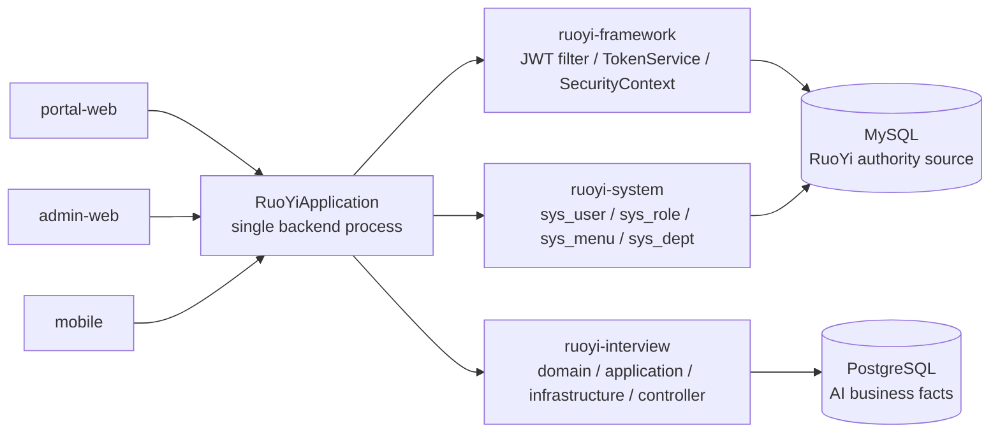

# 若依身份与后端单体收敛设计

> 文档类型：设计
> 文档状态：Approved
> owner / 责任边界：platform / identity / backend convergence
> 创建时间：2026-08-16
> 更新时间：2026-09-12
> 设计 ID：DES-RUOYI-CONVERGENCE-001
> 风险等级：L3
> 产出阶段：5 技术设计
> 原设计阶段状态：Completed（设计门）；当前实施与验证状态以源码、Feature 控制页和验证记录为准
> 当前关联：[`项目规范索引`](../../../../规范/README.md)、[`当前后端聚合配置`](../../../../../ruoyi-backend/pom.xml)；历史输入：[`第19期-若依身份与后端单体收敛`](../../归档/阶段/第19期-若依身份与后端单体收敛.md)、[`历史技术架构`](../../归档/架构/技术架构.md)、[`历史若依迁移计划`](../../归档/架构/若依迁移计划.md)；历史源码路径：`backend/pom.xml`、`apps/platform-backend/pom.xml`

> 归属说明：本文描述 AI 面试项目采用若依身份与后端能力的集成边界，不是通用若依框架说明。正文中的 `backend/`、`apps/` 等路径属于当时的迁移语境；当前工程入口以[`参考/README.md`](../../参考/README.md)为准。

## 当前落实状态与阅读边界

- 当前物理后端根目录是 [`ruoyi-backend/`](../../../../../ruoyi-backend/)，面试业务模块是 [`ruoyi-backend/ruoyi-interview/`](../../../../../ruoyi-backend/ruoyi-interview/)；不再存在可执行的根 `backend/` 或 `apps/platform-backend/` 工程。
- RuoYi 的账号、认证、角色、菜单和权限继续由 MySQL 承载；面试题库、会话、语音元数据、评测、学习、计费和业务事件由 PostgreSQL 承载，只通过稳定用户标识关联。
- 当前管理端、门户端和移动端分别位于根 [`frontend/admin-web/`](../../../../../frontend/admin-web/)、[`frontend/portal-web/`](../../../../../frontend/portal-web/) 和 [`miniapp/interview-mobile/`](../../../../../miniapp/interview-mobile/)。
- 下文保留 2026-08-16 设计时的迁移盘点、目标路径和任务表，用于说明决策来源，不是当前可执行任务清单；历史 `apps/`、`backend/` 路径不能据此恢复为现行入口。

## 1. 结论

本设计把两个独立问题合并处理：

1. AI Interview Coach 的自建身份体系收敛到 RuoYi 的 `sys_user / sys_role / sys_user_role / sys_menu / sys_dept` 权威事实源。
2. 原 `backend/` 的独立 Spring Boot 单体已按本设计收敛；当前落点为根 `ruoyi-backend/`，只保留一个 RuoYi HTTP 后端进程。下文的 `apps/platform-backend/` 是迁移设计阶段使用的旧目标路径。

明确结论：

- 只保留一套账号、登录、验证码、Token/Session、权限和菜单事实源，来自 RuoYi。
- 旧 `identity.*` 只作为迁移候选和历史参考，不再作为认证事实源。
- PostgreSQL 只保存 AI 业务事实，并通过 `ruoyi_user_id BIGINT` 关联用户。
- `tenant / profile / consent` 可以保留，但只能是业务扩展，不能再承担认证或 RBAC。
- `backend/` 的 `InterviewCoachApplication`、自建 `SecurityConfiguration`、自建 `SessionCookiePolicy` 和旧 `IdentityController` 都是收敛候选，不再进入新权威链路。

## 2. 设计时事实盘点（2026-08-16 历史快照）

### 2.1 迁移前旧 AI 后端

- 根 POM 仍只聚合 `backend/`。
- 运行入口是 `backend/interview-boot/src/main/java/com/aiinterviewcoach/boot/InterviewCoachApplication.java`。
- 自建安全链路在 `backend/interview-boot/src/main/java/com/aiinterviewcoach/boot/SecurityConfiguration.java`。
- 自建身份入口在 `backend/interview-adapters/src/main/java/com/aiinterviewcoach/adapters/inbound/rest/identity/IdentityController.java`。
- 旧会话使用 `AIC_SESSION` Cookie，另配 `AIC-XSRF-TOKEN`。
- 旧身份表在 PostgreSQL：`identity.user_account`、`identity.user_identifier`、`identity.password_credential`、`identity.web_session`、`identity.tenant`、`identity.membership`、`identity.profile_version`。

### 2.2 迁移目标中的 RuoYi 后端

- 单一入口是 `apps/platform-backend/ruoyi-admin/src/main/java/com/ruoyi/RuoYiApplication.java`。
- 认证入口是 `SysLoginController`、`CaptchaController`、`SysProfileController`。
- Token 与 SecurityContext 由 `JwtAuthenticationTokenFilter`、`TokenService`、`UserDetailsServiceImpl`、`SysLoginService` 维护。
- 权威表在 MySQL：`sys_user`、`sys_role`、`sys_user_role`、`sys_menu`、`sys_dept`，以及 `sys_role_menu`、`sys_role_dept`、`sys_user_post`、`sys_post`、`sys_config`、`sys_dict_type`、`sys_dict_data`、`sys_logininfor`、`sys_oper_log`、`sys_user_online` 等配套表。

### 2.3 设计时前端现状

- `admin-web` 与 `ruoyi-app` 已经在走 RuoYi 的 token 风格。
- `portal-web` 仍在使用 AI 自建 `/api/v1/auth/login`、`/api/v1/me` 和 `AIC-XSRF-TOKEN`。
- 三端目前没有统一的登录态事实源。

## 3. 冲突矩阵

| 领域 | 旧 AI 事实源 | RuoYi 事实源 | 结论 | 处理 |
|---|---|---|---|---|
| 账号 | `identity.user_account` | `sys_user` | 迁移 | 业务账号只保留 RuoYi 用户 ID |
| 密码 | `identity.password_credential` | `sys_user.password` | 停用 | 不再读取或迁移旧密码事实 |
| 会话 | `identity.web_session` / `AIC_SESSION` | RuoYi Token/Redis/`SecurityContext` | 迁移 | 旧 session 退出权威链路 |
| 验证码 | 自建注册前置校验 | `CaptchaController` | 保留 | 统一使用 RuoYi 验证码 |
| 权限 | membership/tenant role | `sys_role` + `sys_menu.perms` + `@ss.hasPermi` | 迁移 | AI Controller 改成 RuoYi 注解 |
| 当前用户 | `ResolvePrincipal` / `RequestContextFactory` | `SecurityUtils.getLoginUser()` | 改造 | 仅保留业务级 principal 适配 |
| 部门 | 自建 tenant 层级 | `sys_dept` | 迁移 | 组织事实源改为 RuoYi |
| 业务归属 | `tenant/membership` | `ruoyi_user_id` + 业务扩展表 | 改造 | 只承载业务，不承载 RBAC |
| REST 入口 | `/api/v1/auth/*`、`/api/v1/me` | `/login`、`/captchaImage`、`/getInfo`、`/getRouters` | 停用/兼容 | 旧接口只保留过渡适配 |
| 进程 | `backend/` 独立 Boot | `apps/platform-backend` 单一 Boot | 迁移 | 只留一个后端进程 |

## 4. 目标架构

### 4.1 容器边界

- `ruoyi-admin`：唯一启动容器。
- `ruoyi-framework`：唯一安全过滤器和 Token 实现。
- `ruoyi-system`：唯一用户、角色、菜单、部门、权限数据源。
- `ruoyi-interview`：AI 面试业务模块。
- `ruoyi-quartz / ruoyi-generator / ruoyi-common`：RuoYi 公共能力。
- `backend/`：迁移期兼容源，不再是新权威运行容器。

### 4.2 组件边界

- `controller`：只做入参、鉴权、返回映射。
- `application`：编排用例、事务、权限上下文，不直接依赖 Web。
- `domain`：只保留业务规则，不依赖 Spring Security、MyBatis、JDBC。
- `infrastructure`：MySQL / PostgreSQL / Provider / WebSocket / SSE 适配。
- `configuration`：只装配 bean，不自己定义第二套安全入口。

## 5. 统一身份 / RBAC 设计

### 5.1 权威事实源

RuoYi MySQL 中以下表为唯一权威：

- `sys_user`
- `sys_role`
- `sys_user_role`
- `sys_menu`
- `sys_dept`
- `sys_role_menu`
- `sys_role_dept`
- `sys_user_post`
- `sys_post`
- `sys_logininfor`
- `sys_oper_log`

业务系统不得再写入自建账号、密码、session、角色或菜单事实。

### 5.2 登录与当前主体

- 登录、验证码、退出、当前用户和路由菜单统一走 RuoYi 体系。
- 当前主体从 `SecurityContextHolder` / `SecurityUtils.getLoginUser()` 获取。
- AI 业务 Controller 只接受当前主体，不信任前端传入的 `user_id`、`role`、`dept`、`tenant`。
- 所有业务读写都以 `LoginUser.user.userId` 作为权威用户键。

### 5.3 权限注解

- 新增 AI 业务接口使用 `@PreAuthorize("@ss.hasPermi('...')")`。
- 菜单权限写入 `sys_menu.perms`，前端菜单和按钮权限从 RuoYi 菜单树派生。
- 自建 `membership role` 只保留为业务角色语义，不进入 Spring Security。

### 5.4 RuoYi 当前用户桥

建议在 `ruoyi-interview` 内增加一个只读 principal facade：

- 输入：RuoYi `LoginUser`
- 输出：`PrincipalRef(userId, deptId, username, roles, permissions)`
- 作用：给 application 层提供纯值对象，避免 domain 直接依赖 RuoYi 静态工具类

## 6. 业务扩展边界

| 业务对象 | 是否保留 | 位置 | 规则 |
|---|---|---|---|
| `tenant` | 保留 | PostgreSQL 业务表 | 只作为业务工作区 / 协作空间，不承担登录和 RBAC |
| `profile` | 保留 | PostgreSQL 业务表 + RuoYi `sys_user` | RuoYi 保存账号资料，业务 profile 保存面试偏好和学习状态 |
| `consent` | 保留 | PostgreSQL 业务表 | 只记录服务条款、隐私、语音和模型处理授权，不决定登录态 |
| `membership` | 视业务需要保留 | PostgreSQL 业务表 | 只表达协作成员关系，不影响 RuoYi 权限 |

结论：这些对象可以在业务域里存在，但不能再次承担认证或菜单权限判定。

## 7. 数据表所有权清单

### 7.1 RuoYi MySQL

| 表 | 归属 | 角色 |
|---|---|---|
| `sys_user` | RuoYi | 账号、密码、状态、部门、基础资料的权威源 |
| `sys_role` | RuoYi | 角色权威源 |
| `sys_user_role` | RuoYi | 用户-角色关联权威源 |
| `sys_menu` | RuoYi | 菜单、按钮权限权威源 |
| `sys_dept` | RuoYi | 部门/组织权威源 |
| `sys_role_menu` | RuoYi | 角色-菜单关联 |
| `sys_role_dept` | RuoYi | 角色-部门数据权限 |
| `sys_user_post` / `sys_post` | RuoYi | 岗位事实 |
| `sys_logininfor` / `sys_oper_log` | RuoYi | 登录与操作日志 |
| `sys_config` / `sys_dict_*` | RuoYi | 系统配置与字典 |

### 7.2 PostgreSQL 业务事实

| schema / 表族 | 归属 | 备注 |
|---|---|---|
| `catalog.*` | AI Interview Coach | 题库、题目版本、发布、用户答案 |
| `practice.*` | AI Interview Coach | 练习尝试、答案版本 |
| `interview.*` | AI Interview Coach | 计划、会话、轮次、答复 |
| `voice.*` | AI Interview Coach | 音频、转写、修正、执行记录 |
| `evaluation.*` | AI Interview Coach | 评测、报告、证据、反馈 |
| `learning.*` | AI Interview Coach | 学习计划、任务、复练 |
| `billing.*` | AI Interview Coach | 权益、用量、成本账本 |
| `platform.*` | AI Interview Coach | Job、Outbox、Idempotency、Stream |
| `governance.consent_*` | AI Interview Coach | 同意与政策版本 |
| `identity.*` | 迁移候选 | 旧身份事实，不再作为权威源 |

### 7.3 目标引用规则

- 业务写表必须带 `ruoyi_user_id BIGINT`。
- 不再复制密码、角色、权限到 PostgreSQL。
- PostgreSQL 不建立到 MySQL 的物理外键，只做逻辑引用和应用层校验。

## 8. RuoYi user_id 引用方案

### 8.1 目标字段

建议所有 AI 业务表统一使用以下字段组合：

- `ruoyi_user_id BIGINT NOT NULL`
- `owner_ruoyi_user_id BIGINT`
- `created_by_ruoyi_user_id BIGINT`
- `updated_by_ruoyi_user_id BIGINT`
- `ruoyi_dept_id BIGINT`（仅当业务真的需要组织维度）

### 8.2 规则

- `ruoyi_user_id` 是唯一用户引用键。
- 业务表不得保存旧 AI `user_id` 作为主事实。
- 旧 `identity.user_account.user_id` 只在迁移映射期间出现。
- 不能用前端传入的 `user_id` 覆盖当前主体。

### 8.3 迁移绑定表

建议在迁移期增加临时绑定表，例如：

`platform.identity_user_binding`

字段建议：

- `legacy_identity_user_id`
- `legacy_identifier_hash`
- `legacy_email`
- `ruoyi_user_id`
- `binding_mode`
- `bound_at`
- `status`

用途只限迁移、回填、核对和审计；完成切换后可归档或删除。

## 9. 双数据源与事务设计

### 9.1 数据源职责

| 数据源 | 归属 | 用途 |
|---|---|---|
| MySQL | RuoYi | 账号、登录、验证码、菜单、角色、部门、系统配置、日志 |
| PostgreSQL | ruoyi-interview | 题库、会话、答案、评测、报告、语音、学习、账本 |

### 9.2 事务边界

- 单个用例只在一个数据库内完成强事务。
- 禁止假装存在跨库原子事务。
- 涉及两个库时，只允许：
  1. 先读 MySQL 主体，再写 PostgreSQL 业务事实。
  2. 先写 PostgreSQL 事实，再异步补偿或审计 MySQL 侧投影。
- 不允许 XA / 2PC 作为默认方案。

### 9.3 Flyway 归属

- MySQL 归 RuoYi 原有初始化脚本和系统模块。
- PostgreSQL 归 `ruoyi-interview` 模块。
- 旧 `backend/interview-boot/src/main/resources/db/migration/*` 仅作为迁移参考，不能继续作为新权威 Flyway 入口。

## 10. 模块与 package 映射

| 旧位置 | 新位置 | 处理 |
|---|---|---|
| `backend/interview-domain/src/main/java/com/aiinterviewcoach/domain/**` | `apps/platform-backend/ruoyi-interview/src/main/java/com/ruoyi/interview/domain/**` | 迁移 |
| `backend/interview-application/src/main/java/com/aiinterviewcoach/application/**` | `.../application/**` | 迁移 |
| `backend/interview-adapters/src/main/java/com/aiinterviewcoach/adapters/inbound/rest/**` | `.../controller/rest/**` | 改造迁移 |
| `backend/interview-adapters/src/main/java/com/aiinterviewcoach/adapters/inbound/sse/**` | `.../controller/stream/sse/**` | 改造迁移 |
| `backend/interview-adapters/src/main/java/com/aiinterviewcoach/adapters/inbound/websocket/**` | `.../controller/stream/ws/**` | 改造迁移 |
| `backend/interview-adapters/src/main/java/com/aiinterviewcoach/adapters/outbound/persistence/**` | `.../infrastructure/persistence/**` | 迁移 |
| `backend/interview-adapters/src/main/java/com/aiinterviewcoach/adapters/outbound/provider/**` | `.../infrastructure/provider/**` | 迁移 |
| `backend/interview-adapters/src/main/java/com/aiinterviewcoach/adapters/outbound/platform/**` | `.../infrastructure/platform/**` | 迁移 |
| `backend/interview-boot/src/main/java/com/aiinterviewcoach/boot/**` | `apps/platform-backend/ruoyi-interview/src/main/java/com/ruoyi/interview/configuration/**` | 改造 / 合并 |

### 10.1 不能直接复制的内容

- 第二个 Spring Boot main
- 第二套 `SecurityFilterChain`
- 第二套 `AIC_SESSION` / CSRF 设计
- 第二套登录、注册、退出、当前用户接口
- 第二套健康检查与统一错误入口
- 重复的 MySQL / PostgreSQL 双写事实

### 10.2 首个实现切片结果

- 已新增 `apps/platform-backend/ruoyi-interview`，并由 `ruoyi-admin` 聚合。
- 已迁移旧 domain 的非 `identity` 代码（121 个 Java 文件）到 `com.ruoyi.interview.domain`。
- 已迁移旧 application 的非 `identity` 代码（206 个 Java 文件）到 `com.ruoyi.interview.application`。
- 旧 `identity` 包、注册/认证/退出用例、旧 Session 端口和旧身份同意桥未复制。
- 业务 tenant 标识暂保留在 domain/application 作为业务工作区范围；它不参与 RuoYi 登录或 RBAC，后续必须由服务端业务 tenant resolver 解析。
- 本切片尚未迁移 Controller、Repository、Flyway、SSE/WebSocket、Provider 或后台 Job 适配器。

## 11. REST / SSE / WebSocket 设计

### 11.1 REST

- 统一 Web 安全入口来自 RuoYi。
- AI 业务 REST 保持 `/api/v1/*`，但控制器迁入 `ruoyi-interview`。
- 业务权限全部使用 `@PreAuthorize("@ss.hasPermi('...')")`。

建议保留的业务权限编码：

- `interview:question:list`
- `interview:question:add`
- `interview:question:edit`
- `interview:question:remove`
- `interview:session:start`
- `interview:session:recover`
- `interview:session:submit`
- `interview:report:view`
- `interview:report:export`
- `interview:voice:upload`
- `interview:voice:confirm`
- `interview:learning:view`
- `interview:consent:view`

### 11.2 SSE

- SSE 只承载 server -> client 的进度、状态、报告生成和恢复事件。
- SSE 不承载登录，不承载密码，不承载第二套会话。
- 如浏览器无法直接带 RuoYi token，则只允许使用短时、单用途、由 RuoYi principal 签发的 stream ticket。

### 11.3 WebSocket

- WebSocket 只承载语音/长连接低延迟交互。
- 连接前必须验证当前 RuoYi 主体或由当前主体签发的短时 socket ticket。
- ticket 不是第二套账号，不是第二个 session，不允许脱离 RuoYi principal 单独存在。

## 12. 前端登录迁移

### 12.1 当前差异

- `admin-web`：已经按 RuoYi token 风格工作。
- `ruoyi-app`：已经按 RuoYi token 风格工作。
- `portal-web`：仍是 AI 自建 cookie session。

### 12.2 目标路径

| 前端 | 当前状态 | 目标状态 | 说明 |
|---|---|---|---|
| admin-web | RuoYi token | 继续使用同一 token | 作为后台管理唯一入口 |
| portal-web | AI cookie session | 切换到 RuoYi token / principal bridge | 不再自管登录态 |
| mobile | 需统一同源身份 | 切换到同一 token / principal bridge | 与 portal-web 共用同一身份事实 |

### 12.3 兼容期

- 兼容期只允许旧接口做“读主体 / 读 profile / 读菜单”的适配，不允许创建第二套账号或会话。
- `register` 不能继续作为新账号的自服务权威入口。
- `login` 兼容期结束后返回 `410 Gone` 或等价迁移错误。
- 兼容期结束条件：三端全部切换完成、旧身份接口 0 真实流量、旧身份表 0 新写入。

## 13. 旧 identity 体系下线清单

### 13.1 旧表

- `identity.user_account`
- `identity.user_identifier`
- `identity.password_credential`
- `identity.web_session`
- `identity.tenant`
- `identity.membership`
- `identity.profile_version`

### 13.2 旧入口

- `POST /api/v1/auth/register`
- `POST /api/v1/auth/login`
- `POST /api/v1/auth/logout`
- `GET /api/v1/me`
- `PATCH /api/v1/me`
- `GET /api/v1/policies/current`（若仅服务旧注册流）
- `AIC_SESSION`
- `AIC-XSRF-TOKEN`

### 13.3 旧实现

- `InterviewCoachApplication`
- `SecurityConfiguration`
- `IdentityUseCaseConfiguration`
- `SessionCookiePolicy`
- `SameOriginAuthMutationFilter`
- `CsrfCookieMaterializationFilter`
- `backend/interview-boot` 独立 Boot main

## 14. 数据迁移顺序

1. 先冻结旧身份写入点，禁止新增旧账号和旧 session。
2. 建立 RuoYi 角色、菜单、部门和业务权限编码。
3. 建立 `ruoyi_user_id` 映射和 PostgreSQL 绑定表。
4. 回填业务表 owner 引用，先只读校验，不切流量。
5. 把 `ruoyi-interview` 模块迁入 `apps/platform-backend`。
6. 切换前端登录态到 RuoYi。
7. 迁移 REST / SSE / WebSocket。
8. 关闭旧身份写入口和兼容注册入口。
9. 完成 0 流量验证后，再处理旧 identity 归档/删除候选。

## 15. 回滚方案

### 15.1 切换前

- 仅回退前端与控制器适配层。
- 保留 RuoYi 为唯一权威身份源。
- 保留 PostgreSQL 绑定表和迁移备份。

### 15.2 切换后

- 只允许回退应用版本或路由，不允许恢复第二套身份事实源。
- 不允许把 `identity.password_credential` 或 `identity.web_session` 再次提升为权威链路。
- 任何回滚都必须保留 `sys_user.user_id` 作为唯一用户主键来源。

## 16. 停止条件

任一条件成立即停止：

- 出现第二套账号或第二套 session 创建路径。
- 前端或控制器接受前端传入的 `user_id / role / tenant` 作为权威值。
- PostgreSQL 业务表开始复制密码、角色或权限。
- 跨库写入出现不可解释的不一致或幂等失效。
- 旧身份接口仍能继续写入旧表。
- 发现密码、Cookie、Token、API Key、Secret 外泄。

## 17. 验证方案

| AC | 验证点 | 方法 | 结果 |
|---|---|---|---|
| AC-01 | 只有一套登录态 | 登录、获取当前用户、退出、刷新 | NotRun |
| AC-02 | 只有一套权限判断 | 缺权限访问 `@PreAuthorize` 接口 | NotRun |
| AC-03 | 业务表只存 `ruoyi_user_id` | 抽样检查 PostgreSQL 行 | NotRun |
| AC-04 | 旧身份接口不再建第二套账号/会话 | 调用旧 register/login/logout | NotRun |
| AC-05 | 运行时只有一个后端进程 | 只启动 RuoYi 容器 | NotRun |
| AC-06 | 端到端登录迁移完成 | admin-web / portal-web / mobile 同源登录 | NotRun |
| AC-07 | SSE / WebSocket 主体一致 | 同一主体打开长连接并恢复 | NotRun |

## 18. TASK 输入

| TASK | 目标 | 模块 / 文件范围 | 验证入口 | 风险 |
|---|---|---|---|---|
| TASK-RUOYI-01 | 身份源切换 | `ruoyi-framework`、`ruoyi-system`、`ruoyi-admin`、`ruoyi-interview/controller`、`apps/portal-web`、`apps/admin-web`、`apps/ruoyi-app` | login / getInfo / logout / me | 高 |
| TASK-RUOYI-02 | backend 单体迁入 | `backend/*` -> `apps/platform-backend/ruoyi-interview` | 单一 Boot 启动、控制器扫描 | 高 |
| TASK-RUOYI-03 | 双数据源与 `ruoyi_user_id` 回填 | `ruoyi-interview/infrastructure/persistence`、Flyway SQL | 业务表抽样核对 | 高 |
| TASK-RUOYI-04 | REST / SSE / WebSocket 切换 | 控制器、流式适配、ticket 处理、前端调用 | 端到端会话恢复 | 高 |
| TASK-RUOYI-05 | 旧 identity 退役 | 旧 schema、旧控制器、旧 session/cookie 逻辑 | 0 写入、0 账号创建 | 高 |

## 19. 评审结论

- 结论：设计已获用户实施授权，设计门完成。
- 本设计只批准进入实施，不等同于代码迁移完成、构建通过、服务启动、数据迁移完成或用户验收通过。
- 首批实现状态、实际文件差异和当时未执行的验证由 [`开发记录/若依集成/2026-08-16-若依收敛-批次01.md`](../../开发记录/若依集成/2026-08-16-若依收敛-批次01.md) 记录；当前状态仍需结合源码和最新 Feature 验证判断。
